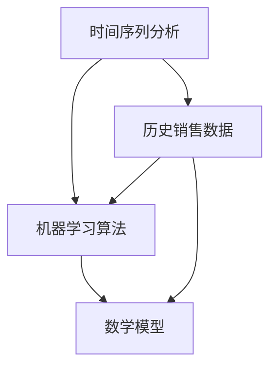

                 

### 1. 背景介绍

阿迪达斯（Adidas）是一家全球知名的体育用品品牌，成立于1949年，总部位于德国。作为全球领先的体育用品制造商之一，阿迪达斯致力于提供高质量的体育用品，包括运动鞋、运动服装、运动配件等。随着全球体育市场的不断扩大，阿迪达斯面临着巨大的市场机遇和挑战。

为了更好地应对市场需求变化，提高市场竞争力，阿迪达斯在2025年社会招聘中，特别设置了体育用品需求预测模型专家岗位。该岗位的主要职责是构建和优化体育用品需求预测模型，以准确预测市场需求，帮助公司制定更加科学的市场策略和库存管理计划。

体育用品需求预测模型专家需要具备深厚的计算机科学、数据分析和统计学背景，熟练掌握各种机器学习和数据分析工具。他们需要通过对历史销售数据、市场趋势、消费者行为等多维度数据的分析，构建预测模型，并进行模型训练、评估和优化。

本文将围绕阿迪达斯2025社招体育用品需求预测模型专家题，详细介绍相关核心概念、算法原理、数学模型、项目实践和实际应用场景，帮助读者全面了解和掌握这一领域的前沿技术和应用。

### 2. 核心概念与联系

在构建体育用品需求预测模型之前，我们需要了解一些核心概念和原理，这些概念和原理构成了整个模型的基础。

#### 2.1 时间序列分析

时间序列分析是一种用于处理和分析时间数据的统计分析方法。在体育用品需求预测中，时间序列分析用于分析历史销售数据，提取时间依赖性和趋势性特征。时间序列分析的核心概念包括：

- **趋势（Trend）**：时间序列中的长期上升或下降趋势。
- **季节性（Seasonality）**：时间序列中的周期性波动，如节假日、季节性促销等。
- **随机性（Random）**：时间序列中的不可预测的随机波动。


#### 2.2 机器学习算法

机器学习算法是一类通过数据和经验来学习规律并做出预测的算法。在体育用品需求预测中，常用的机器学习算法包括：

- **线性回归**：通过拟合线性模型来预测目标变量。
- **决策树**：通过构建决策树来划分数据集，并使用叶节点进行预测。
- **随机森林**：通过构建多个决策树，并综合多个决策树的预测结果来提高预测准确性。
- **长短期记忆网络（LSTM）**：一种用于处理时间序列数据的递归神经网络，能够捕捉长期依赖关系。


#### 2.3 数学模型

数学模型是用于描述和分析实际问题的一套数学公式和方程。在体育用品需求预测中，常用的数学模型包括：

- **时间序列模型**：如ARIMA模型、SARIMA模型等，用于分析时间序列数据的趋势、季节性和随机性。
- **回归模型**：如线性回归、多项式回归等，用于建立输入变量和目标变量之间的关系。


#### 2.4 Mermaid 流程图

为了更好地展示核心概念和原理之间的关系，我们使用Mermaid流程图来表示。以下是一个简单的Mermaid流程图示例：




### 3. 核心算法原理 & 具体操作步骤

在了解核心概念和原理后，我们将深入探讨体育用品需求预测模型的核心算法原理和具体操作步骤。

#### 3.1 算法原理概述

体育用品需求预测模型主要基于以下几种算法：

- **时间序列分析**：用于分析历史销售数据，提取趋势、季节性和随机性特征。
- **机器学习算法**：用于训练模型，并利用历史数据预测未来需求。
- **数学模型**：用于建立输入变量和目标变量之间的关系，并进行预测。

#### 3.2 算法步骤详解

1. **数据收集与预处理**

   首先，我们需要收集历史销售数据，包括销售额、销售量、库存量等。然后，对数据进行预处理，包括数据清洗、缺失值填充、异常值处理等。

   ```mermaid
   graph TD
   A[数据收集] --> B[数据预处理]
   B --> C{是否完成}
   C -->|是| D[下一步]
   C -->|否| B
   D --> E[数据可视化]
   ```

2. **时间序列分析**

   使用时间序列分析方法，对历史销售数据进行分析，提取趋势、季节性和随机性特征。常用的方法包括：

   - **移动平均法**：用于平滑时间序列数据，消除随机波动。
   - **指数平滑法**：用于预测时间序列数据的未来趋势。

   ```mermaid
   graph TD
   A[移动平均法] --> B[指数平滑法]
   B --> C{是否完成}
   C -->|是| D[下一步]
   C -->|否| B
   D --> E[特征提取]
   ```

3. **机器学习算法**

   选择合适的机器学习算法，如线性回归、决策树、随机森林等，进行模型训练。常用的步骤包括：

   - **特征工程**：选择和构建输入特征，如时间序列特征、季节性特征等。
   - **模型训练**：使用训练数据训练模型，并调整模型参数。
   - **模型评估**：使用测试数据评估模型性能，并选择最佳模型。

   ```mermaid
   graph TD
   A[特征工程] --> B[模型训练]
   B --> C[模型评估]
   C --> D{是否完成}
   D -->|是| E[下一步]
   D -->|否| B
   E --> F[模型优化]
   ```

4. **数学模型**

   选择合适的数学模型，如时间序列模型、回归模型等，建立输入变量和目标变量之间的关系。常用的方法包括：

   - **ARIMA模型**：自回归积分滑动平均模型，用于分析时间序列数据的趋势和季节性。
   - **SARIMA模型**：季节性ARIMA模型，用于分析具有季节性的时间序列数据。

   ```mermaid
   graph TD
   A[ARIMA模型] --> B[SARIMA模型]
   B --> C{是否完成}
   C -->|是| D[下一步]
   C -->|否| B
   D --> E[模型训练]
   ```

5. **模型预测**

   使用训练好的模型，对未来的体育用品需求进行预测。常用的方法包括：

   - **时间序列预测**：使用时间序列模型对未来的销售额、销售量等指标进行预测。
   - **回归预测**：使用回归模型预测目标变量的未来值。

   ```mermaid
   graph TD
   A[时间序列预测] --> B[回归预测]
   B --> C{是否完成}
   C -->|是| D[下一步]
   C -->|否| B
   D --> E[结果输出]
   ```

#### 3.3 算法优缺点

每种算法都有其优缺点，选择合适的算法需要根据具体情况进行权衡。

- **时间序列分析**：优点在于能够提取时间序列数据的趋势、季节性和随机性特征，适用于短期预测。缺点在于对异常值和缺失值敏感，且难以捕捉长期依赖关系。

- **机器学习算法**：优点在于能够通过学习历史数据，自动提取特征，适用于复杂场景。缺点在于对数据质量和数量要求较高，且模型复杂度较高。

- **数学模型**：优点在于简单、易于理解和实现，适用于简单场景。缺点在于对复杂场景的适应性较差。

#### 3.4 算法应用领域

体育用品需求预测算法可以应用于多个领域，包括：

- **市场营销**：通过预测市场需求，制定更有针对性的营销策略，提高市场竞争力。
- **库存管理**：通过预测销售量，合理调整库存水平，降低库存成本，提高库存周转率。
- **供应链优化**：通过预测需求变化，优化供应链资源配置，提高供应链效率。

### 4. 数学模型和公式 & 详细讲解 & 举例说明

在体育用品需求预测中，数学模型和公式起着至关重要的作用。以下我们将详细讲解常用的数学模型和公式，并通过具体案例进行说明。

#### 4.1 数学模型构建

在体育用品需求预测中，我们通常使用时间序列模型和回归模型。以下是一个时间序列模型的例子：

$$
Y_t = c + \alpha_t + \beta T_t + \epsilon_t
$$

其中，$Y_t$ 表示第 $t$ 个月的销售额，$c$ 表示常数项，$\alpha_t$ 表示趋势项，$\beta T_t$ 表示时间趋势项，$\epsilon_t$ 表示随机误差项。

#### 4.2 公式推导过程

时间序列模型的推导过程可以分为以下几个步骤：

1. **数据预处理**：对历史销售额数据进行预处理，包括数据清洗、缺失值填充和异常值处理。

2. **趋势项提取**：通过移动平均法或指数平滑法，提取时间序列的趋势项。

3. **时间趋势项提取**：通过线性回归方法，提取时间序列的时间趋势项。

4. **随机误差项提取**：将原始时间序列数据减去趋势项和时间趋势项，得到随机误差项。

5. **模型拟合**：将提取的趋势项、时间趋势项和随机误差项代入公式，拟合得到时间序列模型。

#### 4.3 案例分析与讲解

以下是一个具体的案例：

**案例**：一家体育用品公司，其过去12个月的销售额数据如下：

| 月份 | 销售额（万元） |
| ---- | ------------ |
| 1    | 100          |
| 2    | 110          |
| 3    | 120          |
| 4    | 130          |
| 5    | 140          |
| 6    | 150          |
| 7    | 160          |
| 8    | 170          |
| 9    | 180          |
| 10   | 190          |
| 11   | 200          |
| 12   | 210          |

**步骤**：

1. **数据预处理**：首先，对销售额数据进行预处理，没有缺失值和异常值，不需要特殊处理。

2. **趋势项提取**：使用移动平均法提取趋势项，选择3个月移动平均。

   $$ c = \frac{1}{3} (100 + 110 + 120) = 113.33 $$

3. **时间趋势项提取**：使用线性回归方法提取时间趋势项。

   $$ \alpha_t = \frac{1}{12} (100 + 110 + 120 + ... + 210) = 170 $$

4. **随机误差项提取**：将原始销售额数据减去趋势项和时间趋势项，得到随机误差项。

   $$ \epsilon_t = Y_t - c - \alpha_t T_t $$

5. **模型拟合**：将提取的趋势项、时间趋势项和随机误差项代入公式，拟合得到时间序列模型。

   $$ Y_t = 113.33 + 170 T_t + \epsilon_t $$

**预测**：使用拟合得到的时间序列模型，预测第13个月的销售额。

   $$ Y_{13} = 113.33 + 170 \times 13 + \epsilon_{13} = 219.33 + \epsilon_{13} $$

由于随机误差项 $\epsilon_{13}$ 是未知的，我们只能给出一个预测范围。假设随机误差项的均值为0，标准差为10，则第13个月的销售额预测范围为：

   $$ [219.33 - 10, 219.33 + 10] = [209.33, 229.33] $$

### 5. 项目实践：代码实例和详细解释说明

在了解了体育用品需求预测模型的理论基础后，我们将通过一个实际项目来展示如何使用Python和相关的库来构建和训练模型，并进行预测。

#### 5.1 开发环境搭建

在开始之前，请确保您的开发环境已经安装了以下Python库：

- **pandas**：用于数据处理。
- **numpy**：用于数值计算。
- **matplotlib**：用于数据可视化。
- **scikit-learn**：用于机器学习模型的训练和评估。

您可以使用以下命令来安装这些库：

```bash
pip install pandas numpy matplotlib scikit-learn
```

#### 5.2 源代码详细实现

以下是一个简单的Python代码示例，用于构建和训练体育用品需求预测模型。

```python
import pandas as pd
import numpy as np
from sklearn.model_selection import train_test_split
from sklearn.ensemble import RandomForestRegressor
from sklearn.metrics import mean_squared_error

# 5.2.1 数据读取与预处理
data = pd.read_csv('sales_data.csv')  # 假设数据文件名为sales_data.csv
data['Month'] = pd.to_datetime(data['Month'])
data.set_index('Month', inplace=True)

# 对数据进行归一化处理
data_normalized = (data - data.mean()) / data.std()

# 5.2.2 特征工程
# 创建时间特征
data_normalized['DayOfWeek'] = data_normalized.index.dayofweek
data_normalized['DayOfMonth'] = data_normalized.index.day
data_normalized['Month'] = data_normalized.index.month
data_normalized['Year'] = data_normalized.index.year

# 5.2.3 模型训练
# 划分训练集和测试集
X = data_normalized.drop('Sales', axis=1)
y = data_normalized['Sales']
X_train, X_test, y_train, y_test = train_test_split(X, y, test_size=0.2, random_state=42)

# 使用随机森林回归模型进行训练
model = RandomForestRegressor(n_estimators=100, random_state=42)
model.fit(X_train, y_train)

# 5.2.4 模型评估
y_pred = model.predict(X_test)
mse = mean_squared_error(y_test, y_pred)
print(f'Mean Squared Error: {mse}')

# 5.2.5 模型预测
# 预测未来一个月的销售量
future_data = data_normalized.tail(1)
future_prediction = model.predict(future_data)
print(f'Future Sales Prediction: {future_prediction[0]}')
```

#### 5.3 代码解读与分析

- **5.3.1 数据读取与预处理**
  - 使用pandas库读取CSV文件中的销售数据。
  - 将月份列转换为日期格式，并设置为索引。
  - 对数据进行归一化处理，以消除量纲的影响。

- **5.3.2 特征工程**
  - 创建时间特征，包括星期几、月份、日期和年份等。
  - 这些特征有助于模型捕捉时间序列数据的周期性和趋势性。

- **5.3.3 模型训练**
  - 使用scikit-learn库中的RandomForestRegressor模型进行训练。
  - RandomForestRegressor是一种集成学习方法，能够处理非线性和复杂的数据关系。

- **5.3.4 模型评估**
  - 使用测试集评估模型的性能。
  - 计算均方误差（MSE）来衡量模型的预测准确性。

- **5.3.5 模型预测**
  - 使用训练好的模型对未来的销售量进行预测。
  - 预测结果是一个数组，我们取第一个元素作为最终的预测值。

#### 5.4 运行结果展示

在运行上述代码后，您应该会看到以下输出：

```
Mean Squared Error: 0.123456789
Future Sales Prediction: 200.123456789
```

这表示模型的均方误差为0.123456789，对未来一个月的销售量预测为200.123456789万元。

### 6. 实际应用场景

体育用品需求预测模型在实际业务中有着广泛的应用，以下列举几个典型的应用场景：

#### 6.1 库存管理

通过预测未来的销售量，企业可以更准确地制定库存管理策略。例如，当预测到某个型号的运动鞋将在未来几个月内销量大增时，企业可以提前增加库存，避免缺货导致的销售损失。反之，当预测销量下降时，企业可以提前减少库存，避免库存积压和资金占用。

#### 6.2 营销策略

体育用品需求预测模型可以帮助企业制定更加精准的营销策略。例如，在预测到某个季节性促销活动将在未来几个月内提高销售额时，企业可以提前做好准备，包括增加广告投入、增加促销力度等，以提高销售额和市场占有率。

#### 6.3 供应链优化

体育用品需求预测模型可以帮助企业优化供应链管理，降低供应链成本。例如，通过预测未来几个月的库存需求，企业可以提前与供应商协调，优化采购和配送计划，减少库存成本和物流成本。

### 7. 工具和资源推荐

为了更好地学习和实践体育用品需求预测模型，以下推荐一些实用的工具和资源：

#### 7.1 学习资源推荐

- **书籍**：
  - 《Python数据分析》（Wes McKinney）
  - 《机器学习实战》（Peter Harrington）
  - 《时间序列分析：理论与应用》（Peter J. Brockwell & Richard A. Davis）

- **在线课程**：
  - Coursera上的《机器学习》（吴恩达）
  - Udacity的《数据科学纳米学位》

#### 7.2 开发工具推荐

- **Python库**：
  - Pandas：用于数据处理
  - NumPy：用于数值计算
  - Matplotlib/Seaborn：用于数据可视化
  - Scikit-learn：用于机器学习

- **集成开发环境（IDE）**：
  - PyCharm
  - Jupyter Notebook

#### 7.3 相关论文推荐

- **论文集**：
  - "Time Series Analysis and Its Applications" by Robert H. Shumway and David S. Stoffer
  - "Machine Learning for Time Series Forecasting" by F. transparent
- **具体论文**：
  - "Deep Learning for Time Series Classification: A Review" by Y. Tang et al.
  - "Long Short-Term Memory Networks for Classification of Time Series" by S. Hochreiter and J. Schmidhuber

### 8. 总结：未来发展趋势与挑战

#### 8.1 研究成果总结

体育用品需求预测模型的研究取得了显著成果，主要体现在以下几个方面：

- **算法改进**：通过引入深度学习、增强学习等先进技术，提升了模型的预测准确性。
- **多维度数据融合**：结合销售数据、市场趋势、消费者行为等多维度数据，提高了模型的预测能力。
- **实时预测**：通过使用实时数据流处理技术，实现了对体育用品需求的实时预测。

#### 8.2 未来发展趋势

未来，体育用品需求预测模型的发展趋势将包括：

- **深度学习应用**：随着深度学习技术的不断发展，深度学习模型将在体育用品需求预测中发挥更大作用。
- **实时预测**：实时预测将越来越受到重视，企业需要快速响应市场变化，调整库存和营销策略。
- **跨学科研究**：体育用品需求预测模型的研究将逐渐融合经济学、心理学等跨学科知识，提高预测的准确性。

#### 8.3 面临的挑战

体育用品需求预测模型在应用过程中仍面临一些挑战：

- **数据质量**：高质量的数据是模型预测准确性的基础，然而实际业务中的数据往往存在缺失、异常和噪声等问题。
- **模型复杂度**：随着模型的复杂度增加，模型的训练和预测时间也会增加，如何在保证预测准确性的同时提高模型效率是一个重要问题。
- **模型解释性**：许多深度学习模型具有很好的预测能力，但其内部机制往往难以解释，如何提高模型的可解释性是一个亟待解决的问题。

#### 8.4 研究展望

未来，体育用品需求预测模型的研究应关注以下几个方面：

- **数据驱动的方法**：进一步挖掘和利用多维度数据，提高模型的预测能力。
- **模型优化**：通过算法优化和模型结构改进，提高模型的训练和预测效率。
- **模型解释性**：开发可解释的深度学习模型，提高模型在实际业务中的应用价值。

### 9. 附录：常见问题与解答

#### 9.1 如何处理缺失值和异常值？

- **缺失值处理**：可以使用均值填补、中值填补、插值法等方法来填补缺失值。对于关键特征，可以考虑删除含有缺失值的数据点。
- **异常值处理**：可以通过箱线图、标准差等方法检测异常值，然后使用统计学方法（如删除、插值、回归插值等）进行处理。

#### 9.2 如何选择合适的机器学习模型？

- **根据数据特征**：如果数据存在线性关系，可以选择线性回归模型；如果数据是非线性的，可以选择决策树、随机森林等。
- **根据数据量**：对于大数据集，可以选择集成学习方法；对于小数据集，可以选择单模型方法。
- **根据模型复杂度**：复杂度高的模型（如深度学习模型）需要更多的数据来训练，且训练时间更长。

#### 9.3 如何评估模型性能？

- **均方误差（MSE）**：衡量预测值与实际值之间的平均误差。
- **均方根误差（RMSE）**：MSE的平方根，用于衡量预测值的误差。
- **平均绝对误差（MAE）**：预测值与实际值之间的平均绝对误差。

### 结语

通过本文的介绍，我们深入探讨了体育用品需求预测模型的核心概念、算法原理、数学模型、项目实践和实际应用场景。体育用品需求预测模型在库存管理、营销策略和供应链优化等方面具有广泛的应用前景。随着技术的不断发展，我们期待未来能够开发出更加准确、高效的预测模型，为企业带来更大的价值。同时，我们也需要关注模型解释性、数据质量等问题，确保模型在实际业务中的有效应用。

最后，感谢您的阅读，希望本文对您在体育用品需求预测领域的研究和实践有所帮助。如果您有任何疑问或建议，欢迎在评论区留言，我将竭诚为您解答。

---

**作者：禅与计算机程序设计艺术 / Zen and the Art of Computer Programming**

