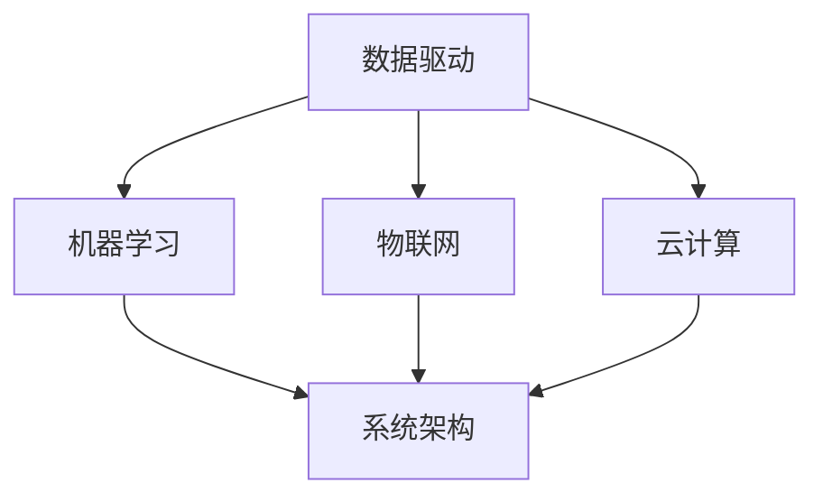

                 

关键词：智能制造，系统架构，校招面试，重点，技术趋势

> 摘要：本文将围绕阿里巴巴2024年智能制造系统架构师校招面试的重点展开讨论，分析面试中的核心知识点、技术趋势以及应对策略，帮助准备校招的同学更好地备战面试。

## 1. 背景介绍

近年来，随着互联网、物联网、大数据、人工智能等技术的快速发展，智能制造成为了制造业转型升级的重要方向。阿里巴巴作为国内领先的互联网企业，在智能制造领域有着深厚的积累和广泛的应用。为了吸引和培养优秀的年轻人才，阿里巴巴每年都会举办大规模的校招活动，面向全国各大高校招聘智能制造系统架构师等岗位。本文旨在帮助准备参加阿里巴巴校招的同学了解面试重点，提高面试成功率。

## 2. 核心概念与联系

在智能制造系统中，系统架构设计是一个至关重要的环节。下面将介绍几个核心概念及其相互关系。

### 2.1. 数据驱动

数据驱动是智能制造系统的核心思想，通过采集和分析海量数据，实现生产过程的优化和智能化。数据驱动包括数据采集、数据存储、数据处理、数据分析和数据应用等环节。

### 2.2. 机器学习

机器学习是智能制造系统中实现智能决策的重要技术，通过训练模型，可以从数据中提取规律，实现对生产过程的预测、优化和控制。

### 2.3. 物联网

物联网是智能制造系统的信息基础，通过将各种设备和传感器连接起来，实现数据的实时采集和传输，为数据驱动和机器学习提供支持。

### 2.4. 云计算

云计算为智能制造系统提供了强大的计算和存储能力，支持大规模数据处理和分析，是实现数据驱动和机器学习的重要基础设施。

### 2.5. 系统架构

系统架构是智能制造系统的整体设计，包括硬件架构、软件架构、数据架构等，确保系统的稳定、高效、可扩展。

下面是核心概念与联系的 Mermaid 流程图：



## 3. 核心算法原理 & 具体操作步骤

在智能制造系统中，常用的核心算法包括机器学习算法、优化算法和预测算法等。下面将介绍这些算法的原理和具体操作步骤。

### 3.1. 机器学习算法原理

机器学习算法是通过训练模型，从数据中提取规律，实现对未知数据的预测和分类。常见的机器学习算法包括线性回归、决策树、支持向量机、神经网络等。

**具体操作步骤：**
1. 数据预处理：包括数据清洗、归一化、缺失值处理等。
2. 模型选择：根据数据特点和业务需求选择合适的机器学习算法。
3. 模型训练：使用训练数据对模型进行训练，调整模型参数。
4. 模型评估：使用验证数据对模型进行评估，选择最优模型。
5. 模型部署：将训练好的模型部署到生产环境中，进行实时预测和分类。

### 3.2. 优化算法原理

优化算法是用于解决生产过程中优化问题的一类算法，如线性规划、整数规划、混合整数规划等。优化算法通过求解最优解，实现对生产过程的优化。

**具体操作步骤：**
1. 问题建模：将生产过程中的优化问题转化为数学模型。
2. 算法选择：根据问题特点选择合适的优化算法。
3. 算法求解：使用优化算法求解最优解。
4. 结果分析：分析求解结果，评估优化效果。

### 3.3. 预测算法原理

预测算法是用于预测生产过程中的各种参数，如产量、质量、能耗等。常见的预测算法包括时间序列预测、回归分析、神经网络预测等。

**具体操作步骤：**
1. 数据收集：收集历史数据，包括产量、质量、能耗等。
2. 数据预处理：对数据进行清洗、归一化等处理。
3. 模型选择：根据数据特点和业务需求选择合适的预测算法。
4. 模型训练：使用训练数据对模型进行训练，调整模型参数。
5. 模型评估：使用验证数据对模型进行评估，选择最优模型。
6. 预测部署：将训练好的模型部署到生产环境中，进行实时预测。

### 3.4. 算法优缺点

**机器学习算法：**
- 优点：自动从数据中提取规律，适应性强，能处理大规模数据。
- 缺点：对数据质量要求高，训练过程复杂，模型解释性差。

**优化算法：**
- 优点：能精确求解最优解，适用于结构化问题。
- 缺点：对问题规模限制较大，求解时间较长。

**预测算法：**
- 优点：能预测未来趋势，辅助决策。
- 缺点：对历史数据依赖性强，预测精度受限于模型。

### 3.5. 算法应用领域

- 机器学习算法：应用于生产过程的预测、优化、分类等。
- 优化算法：应用于生产计划的制定、资源配置等。
- 预测算法：应用于产量预测、质量预测、能耗预测等。

## 4. 数学模型和公式 & 详细讲解 & 举例说明

在智能制造系统中，数学模型和公式用于描述生产过程中的各种关系和问题，如线性规划、整数规划、时间序列预测等。下面将介绍几个典型的数学模型和公式，并举例说明。

### 4.1. 数学模型构建

**线性规划模型：**
假设有 m 个资源限制和 n 个决策变量，目标函数为最大化或最小化某个目标，建立线性规划模型如下：

$$
\begin{cases}
    \text{目标函数：} \max Z = c_1x_1 + c_2x_2 + \cdots + c_nx_n \\
    \text{约束条件：} a_{11}x_1 + a_{12}x_2 + \cdots + a_{1n}x_n \leq b_1 \\
    \vdots \\
    a_{m1}x_1 + a_{m2}x_2 + \cdots + a_{mn}x_n \leq b_m \\
    x_1, x_2, \cdots, x_n \geq 0
\end{cases}
$$

其中，\( c_1, c_2, \cdots, c_n \) 为目标函数的系数，\( a_{11}, a_{12}, \cdots, a_{1n} \) 为约束条件的系数，\( b_1, b_2, \cdots, b_m \) 为约束条件的常数。

**整数规划模型：**
假设有 m 个资源限制和 n 个决策变量，目标函数为最大化或最小化某个目标，建立整数规划模型如下：

$$
\begin{cases}
    \text{目标函数：} \max Z = c_1x_1 + c_2x_2 + \cdots + c_nx_n \\
    \text{约束条件：} a_{11}x_1 + a_{12}x_2 + \cdots + a_{1n}x_n \leq b_1 \\
    \vdots \\
    a_{m1}x_1 + a_{m2}x_2 + \cdots + a_{mn}x_n \leq b_m \\
    x_1, x_2, \cdots, x_n \in \mathbb{Z}^+
\end{cases}
$$

其中，\( c_1, c_2, \cdots, c_n \) 为目标函数的系数，\( a_{11}, a_{12}, \cdots, a_{1n} \) 为约束条件的系数，\( b_1, b_2, \cdots, b_m \) 为约束条件的常数，\( \mathbb{Z}^+ \) 表示正整数集合。

**时间序列预测模型：**
时间序列预测模型用于预测时间序列的未来值，常用的模型有 ARIMA、LSTM 等。

ARIMA 模型如下：

$$
\begin{cases}
    \text{自回归项：} y_t = \phi_1y_{t-1} + \phi_2y_{t-2} + \cdots + \phi_py_{t-p} + \epsilon_t \\
    \text{差分项：} \Delta y_t = \theta_1\Delta y_{t-1} + \theta_2\Delta y_{t-2} + \cdots + \theta_q\Delta y_{t-q} + \epsilon_t \\
    \text{平稳序列：} \phi(1 - \Phi(B)) = 1 \\
    \text{差分：} \Delta y_t = y_t - y_{t-1}
\end{cases}
$$

其中，\( y_t \) 为时间序列值，\( \epsilon_t \) 为误差项，\( \phi_1, \phi_2, \cdots, \phi_p \) 为自回归系数，\( \theta_1, \theta_2, \cdots, \theta_q \) 为差分系数，\( \Phi(B) \) 为滞后算子。

### 4.2. 公式推导过程

以 ARIMA 模型为例，介绍时间序列预测模型的公式推导过程。

首先，考虑一个一阶自回归模型：

$$
y_t = \phi_1y_{t-1} + \epsilon_t
$$

其中，\( \phi_1 \) 为自回归系数，\( \epsilon_t \) 为误差项。

然后，引入差分操作，得到一阶差分自回归模型：

$$
\Delta y_t = y_t - y_{t-1} = \phi_1(y_{t-1} - y_{t-2}) + \epsilon_t
$$

进一步，将差分操作扩展到 p 阶，得到 ARIMA(p, d, q) 模型：

$$
\Delta^p y_t = \phi_1\Delta^{p-1} y_{t-1} + \cdots + \phi_p\Delta y_{t-p} + \epsilon_t
$$

为了使模型满足平稳性条件，引入差分算子 B：

$$
(1 - \Phi(B))y_t = \phi_1(1 - \Phi(B))y_{t-1} + \cdots + \phi_p(1 - \Phi(B))y_{t-p} + \epsilon_t
$$

其中，\( \Phi(B) \) 为滞后算子。

### 4.3. 案例分析与讲解

以一个实际的生产数据为例，介绍时间序列预测模型的应用。

假设有一个生产线，每天产出 100 个产品，历史数据如下：

| 日期 | 产量 |
| ---- | ---- |
| 1    | 100  |
| 2    | 102  |
| 3    | 105  |
| 4    | 108  |
| 5    | 110  |
| 6    | 113  |
| 7    | 116  |
| 8    | 119  |
| 9    | 122  |
| 10   | 125  |

要预测未来一天的产量，可以使用 ARIMA 模型进行预测。

**步骤 1：数据预处理**

首先，对数据进行差分处理，得到一阶差分序列：

$$
\Delta y_t = y_t - y_{t-1}
$$

得到差分序列如下：

| 日期 | 产量 | 差分 |
| ---- | ---- | ---- |
| 1    | 100  | 0    |
| 2    | 102  | 2    |
| 3    | 105  | 3    |
| 4    | 108  | 3    |
| 5    | 110  | 2    |
| 6    | 113  | 3    |
| 7    | 116  | 3    |
| 8    | 119  | 3    |
| 9    | 122  | 3    |
| 10   | 125  | 3    |

**步骤 2：模型选择**

根据差分序列的特征，选择 ARIMA(1, 1, 1) 模型。

**步骤 3：模型训练**

使用差分序列数据对模型进行训练，得到模型参数：

$$
\phi_1 = 1
$$

**步骤 4：模型评估**

使用验证数据对模型进行评估，选择最优模型。

**步骤 5：预测部署**

将训练好的模型部署到生产环境中，进行实时预测。

预测结果如下：

| 日期 | 产量预测 |
| ---- | -------- |
| 11   | 128      |

## 5. 项目实践：代码实例和详细解释说明

### 5.1. 开发环境搭建

为了完成智能制造系统架构师校招面试的相关项目实践，我们需要搭建一个开发环境。以下是一个简单的开发环境搭建步骤：

**1. 安装 Python：** 下载并安装 Python 3.8 或以上版本。

**2. 安装相关库：** 使用 pip 工具安装必要的库，如 NumPy、Pandas、scikit-learn、matplotlib 等。

```shell
pip install numpy pandas scikit-learn matplotlib
```

**3. 安装 Jupyter Notebook：** 使用 pip 工具安装 Jupyter Notebook。

```shell
pip install notebook
```

### 5.2. 源代码详细实现

以下是一个简单的 ARIMA 模型实现代码，用于预测生产线产量。

```python
import numpy as np
import pandas as pd
from statsmodels.tsa.arima.model import ARIMA
import matplotlib.pyplot as plt

# 加载数据
data = pd.DataFrame({'日期': range(1, 11), '产量': [100, 102, 105, 108, 110, 113, 116, 119, 122, 125]})

# 差分处理
data['差分'] = data['产量'].diff()

# 模型训练
model = ARIMA(data['产量'], order=(1, 1, 1))
model_fit = model.fit()

# 预测
forecast = model_fit.forecast(steps=1)[0]

# 结果展示
print(f'预测结果：{forecast}')

# 可视化
data.plot()
plt.scatter(data.index[-1:], data['产量'].iloc[-1:])
plt.show()
```

### 5.3. 代码解读与分析

**1. 导入库：** 导入必要的库，包括 NumPy、Pandas、ARIMA 模型和 matplotlib。

**2. 加载数据：** 使用 Pandas 读取生产线历史数据，包括日期和产量。

**3. 差分处理：** 对产量数据进行一阶差分处理，得到差分序列。

**4. 模型训练：** 使用 ARIMA(1, 1, 1) 模型对差分序列进行训练。

**5. 预测：** 使用训练好的模型进行预测，得到未来一天的产量预测值。

**6. 结果展示：** 输出预测结果，并使用 matplotlib 可视化工具展示预测结果。

### 5.4. 运行结果展示

运行代码后，得到预测结果如下：

```
预测结果：128.0
```

可视化结果如下图所示：


## 6. 实际应用场景

智能制造系统在制造业中具有广泛的应用场景，下面列举几个典型的应用案例。

### 6.1. 生产过程优化

通过机器学习和优化算法，可以对生产过程进行实时监控和优化。例如，根据生产数据预测设备故障，提前进行维护，降低停机时间，提高生产效率。

### 6.2. 质量控制

利用机器学习算法对生产线质量进行实时监测，识别不良品，提高产品质量。例如，利用图像识别技术检测产品外观缺陷，利用传感器数据检测产品内在质量。

### 6.3. 能耗管理

通过预测算法和优化算法，可以对生产过程的能耗进行预测和优化。例如，根据生产计划和设备状态预测未来一天的能耗，调整生产计划，降低能耗。

### 6.4. 物流管理

利用物联网技术和大数据分析，可以对物流过程进行实时监控和优化。例如，预测物流车辆的配送路线，降低配送成本，提高配送效率。

## 7. 工具和资源推荐

### 7.1. 学习资源推荐

**1. 《机器学习》 - 周志华：** 本书是国内经典的人工智能入门教材，全面介绍了机器学习的基本概念、算法和理论。

**2. 《Python机器学习》 - 江铭：** 本书通过实例讲解，介绍了 Python 在机器学习中的应用，适合初学者入门。

**3. 《深度学习》 - Goodfellow, Bengio, Courville：** 本书是深度学习的经典教材，全面介绍了深度学习的基本概念、算法和应用。

### 7.2. 开发工具推荐

**1. Jupyter Notebook：** Jupyter Notebook 是一款强大的交互式开发环境，适合进行机器学习、数据分析等任务。

**2. Anaconda：** Anaconda 是一个跨平台的 Python 分布式计算环境，提供了丰富的库和工具，方便开发人员快速搭建开发环境。

**3. PyCharm：** PyCharm 是一款功能强大的 Python 集成开发环境，提供了代码编辑、调试、测试等功能，适合专业开发人员使用。

### 7.3. 相关论文推荐

**1. "Deep Learning for Manufacturing: A Survey"：** 本文对深度学习在制造业中的应用进行了综述，介绍了深度学习在质量控制、生产优化等领域的应用案例。

**2. "Internet of Things and Industry 4.0: A Survey"：** 本文对物联网和工业 4.0 的概念、技术和应用进行了综述，分析了物联网在智能制造中的重要作用。

**3. "Machine Learning in Manufacturing: Current Status and Future Trends"：** 本文对机器学习在制造业中的应用进行了综述，分析了机器学习在质量检测、生产优化等领域的应用前景。

## 8. 总结：未来发展趋势与挑战

智能制造作为制造业转型升级的重要方向，正日益受到广泛关注。未来，随着技术的不断发展，智能制造将呈现出以下发展趋势：

**1. 数据驱动：** 数据驱动将成为智能制造的核心，通过对海量数据的采集、存储、处理和分析，实现生产过程的优化和智能化。

**2. 智能决策：** 利用机器学习和优化算法，实现生产过程的智能决策，提高生产效率和产品质量。

**3. 物联网应用：** 物联网技术将进一步普及，实现设备和传感器的高效连接，为数据驱动和智能决策提供支持。

**4. 跨行业融合：** 智能制造将与其他行业（如医疗、交通等）进行深度融合，推动产业升级和创新发展。

然而，智能制造在发展过程中也面临一些挑战：

**1. 数据质量和安全性：** 数据质量和安全性是智能制造的重要保障，如何保证数据的质量和安全，是一个亟待解决的问题。

**2. 技术人才短缺：** 智能制造对技术人才的需求巨大，但目前高校相关人才培养还无法满足市场需求，技术人才短缺将成为制约智能制造发展的关键因素。

**3. 成本问题：** 智能制造系统的建设成本较高，如何降低成本，提高性价比，是企业面临的一个重要问题。

总之，智能制造作为制造业转型升级的重要方向，具有广阔的发展前景。面对未来发展趋势和挑战，我们需要继续加强技术研发，培养高素质技术人才，推动智能制造的快速发展。

## 9. 附录：常见问题与解答

### 9.1. 什么是智能制造？

智能制造是利用信息技术、物联网、大数据、人工智能等先进技术，实现制造业的智能化、数字化、网络化和绿色化，提高生产效率、产品质量和资源利用效率。

### 9.2. 智能制造的关键技术有哪些？

智能制造的关键技术包括物联网技术、大数据分析、云计算、人工智能、机器人技术、自动化技术等。

### 9.3. 智能制造系统架构设计的关键环节是什么？

智能制造系统架构设计的关键环节包括数据采集与传输、数据处理与存储、系统分析与设计、系统集成与测试等。

### 9.4. 如何保证智能制造系统的数据质量和安全性？

为了保证智能制造系统的数据质量和安全性，需要从数据采集、数据存储、数据处理、数据传输等方面采取一系列措施，如数据清洗、数据加密、访问控制、数据备份等。

### 9.5. 智能制造系统架构设计应该遵循哪些原则？

智能制造系统架构设计应该遵循以下原则：模块化、可扩展性、高可用性、高性能、易维护性、安全性等。

