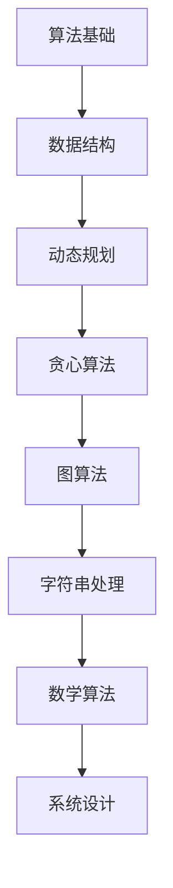

                 

关键词：阿里巴巴、社招、算法面试、面试题、解析、技术、面试经验

> 摘要：本文旨在为准备参加2024年阿里巴巴社会招聘算法工程师面试的应聘者提供一系列核心面试题的汇总与详细解析。通过对这些面试题的深入剖析，读者将了解面试官的考核重点、算法原理以及实际操作步骤，为应对面试做好充分准备。

## 1. 背景介绍

随着互联网行业的迅猛发展，算法工程师的需求日益增长。阿里巴巴作为全球领先的互联网公司之一，其社招算法工程师的岗位吸引着众多优秀的人才。然而，阿里巴巴的面试难度也相对较高，对算法和数据结构方面的要求尤为严格。本文将根据2024年阿里巴巴社招算法面试的常见题型，为大家提供详细的解析和指导，帮助大家更好地应对面试挑战。

## 2. 核心概念与联系

在解答阿里巴巴的算法面试题之前，我们需要了解一些核心概念和它们之间的联系。以下是一个Mermaid流程图，用于展示核心概念和联系：



### 2.1 算法基础

算法基础是解决复杂问题的核心，包括常见的排序、搜索算法等。

### 2.2 数据结构

数据结构是实现算法的重要工具，如数组、链表、栈、队列、树等。

### 2.3 动态规划

动态规划是一种解决复杂问题的方法，适用于具有重叠子问题和最优子结构特征的问题。

### 2.4 贪心算法

贪心算法通过在每个阶段做出局部最优选择，达到全局最优解。

### 2.5 图算法

图算法用于处理具有节点和边的关系数据，如深度优先搜索（DFS）、广度优先搜索（BFS）等。

### 2.6 字符串处理

字符串处理算法包括字符串匹配、字符串排序、字符串压缩等。

### 2.7 数学算法

数学算法包括各种数学问题的求解，如最大公约数、最小公倍数、质数判定等。

### 2.8 系统设计

系统设计涉及分布式系统、缓存、数据库等方面的设计和优化。

## 3. 核心算法原理 & 具体操作步骤

### 3.1 算法原理概述

在解答面试题时，我们需要了解算法的基本原理。以下是一些核心算法的原理概述：

### 3.1.1 排序算法

常见的排序算法包括冒泡排序、选择排序、插入排序、快速排序、归并排序等。每种排序算法都有其特定的操作步骤和复杂度。

### 3.1.2 搜索算法

搜索算法包括深度优先搜索（DFS）和广度优先搜索（BFS）。它们用于在数据结构中查找特定元素或路径。

### 3.1.3 动态规划

动态规划是一种解决复杂问题的方法，通过将问题分解为更小的子问题，并利用子问题的解来构建原问题的解。

### 3.1.4 贪心算法

贪心算法通过在每个阶段做出局部最优选择，以达到全局最优解。

### 3.1.5 图算法

图算法包括深度优先搜索（DFS）、广度优先搜索（BFS）、最短路径算法（如Dijkstra算法、Floyd算法）等。

### 3.1.6 字符串处理

字符串处理算法包括字符串匹配（如KMP算法）、字符串排序、字符串压缩等。

### 3.1.7 数学算法

数学算法包括最大公约数、最小公倍数、质数判定、素数筛法等。

### 3.2 算法步骤详解

以下是一些核心算法的具体操作步骤：

### 3.2.1 冒泡排序

1. 从第一个元素开始，相邻元素两两比较，如果第一个比第二个大，就交换它们的位置。
2. 重复上述步骤，直到没有需要交换的元素为止。

### 3.2.2 快速排序

1. 选择一个基准元素。
2. 将比基准小的元素移到基准的左侧，比基准大的元素移到基准的右侧。
3. 递归地对左侧和右侧子数组进行快速排序。

### 3.2.3 深度优先搜索（DFS）

1. 选择一个未访问的节点作为起始节点。
2. 访问该节点，并将其标记为已访问。
3. 对该节点的所有未访问邻居进行深度优先搜索。
4. 递归返回上一层节点，继续访问下一个未访问邻居。

### 3.2.4 广度优先搜索（BFS）

1. 创建一个队列，并将起始节点入队。
2. 创建一个集合，用于记录已访问的节点。
3. 当队列为空时，结束搜索。
4. 出队一个节点，访问该节点，并将其所有未访问的邻居入队。

### 3.2.5 KMP算法

1. 构建部分匹配表（next数组）。
2. 使用next数组来避免重复匹配。

### 3.2.6 质数筛法

1. 创建一个布尔数组，用于记录每个数字是否为质数。
2. 从2开始，遍历每个数字，如果它是一个质数，则将它的倍数都标记为非质数。

### 3.3 算法优缺点

每种算法都有其优缺点，了解这些优缺点有助于我们根据实际需求选择合适的算法。以下是一些常见算法的优缺点：

- **冒泡排序**：简单易懂，但效率较低。
- **快速排序**：效率较高，但最坏情况下的性能较差。
- **深度优先搜索（DFS）**：适用于需要找到最短路径或最小权值的问题。
- **广度优先搜索（BFS）**：适用于需要找到最短路径或最小权值的问题。
- **KMP算法**：适用于字符串匹配问题，效率较高。
- **质数筛法**：适用于求解质数问题，效率较高。

### 3.4 算法应用领域

不同的算法适用于不同的应用领域，以下是一些常见算法的应用领域：

- **排序算法**：在数据库、搜索引擎、数据分析等领域广泛应用。
- **搜索算法**：在路径规划、社交网络、搜索引擎等领域广泛应用。
- **动态规划**：在资源分配、网络优化、图问题等领域广泛应用。
- **贪心算法**：在背包问题、最短路径问题等领域广泛应用。
- **图算法**：在社交网络、网络路由、网络流等领域广泛应用。
- **字符串处理**：在文本编辑、自然语言处理、搜索引擎等领域广泛应用。
- **数学算法**：在密码学、计算机图形学、计算机视觉等领域广泛应用。

## 4. 数学模型和公式 & 详细讲解 & 举例说明

在解决算法问题时，数学模型和公式是不可或缺的工具。以下是一些常用的数学模型和公式，以及详细的讲解和举例说明。

### 4.1 数学模型构建

数学模型是一种用于描述现实世界问题的抽象工具。构建数学模型的过程通常包括以下几个步骤：

1. **问题分析**：明确问题的目标、条件和限制。
2. **建立变量**：确定问题的变量，并对其进行定义和说明。
3. **建立关系**：根据问题的条件和限制，建立变量之间的关系。
4. **简化模型**：对模型进行简化和假设，以降低计算复杂度。

### 4.2 公式推导过程

公式推导是数学模型的重要组成部分。以下是一个简单的例子，用于说明公式的推导过程：

#### 例子：等差数列的求和公式

等差数列的求和公式为：

\[ S_n = \frac{n}{2} \times (a_1 + a_n) \]

其中，\( S_n \) 表示前 \( n \) 项和，\( a_1 \) 表示首项，\( a_n \) 表示第 \( n \) 项。

推导过程如下：

1. **首项和末项的平均值**：

\[ \frac{a_1 + a_n}{2} = \frac{a_1 + (a_1 + (n-1)d)}{2} = \frac{2a_1 + (n-1)d}{2} \]

2. **乘以项数**：

\[ \frac{n}{2} \times \frac{2a_1 + (n-1)d}{2} = \frac{n(2a_1 + (n-1)d)}{4} \]

3. **化简**：

\[ \frac{n(2a_1 + (n-1)d)}{4} = \frac{n}{2} \times (a_1 + a_n) \]

因此，等差数列的求和公式得证。

### 4.3 案例分析与讲解

以下是一个具体的案例，用于展示数学模型和公式的应用。

#### 案例：求最大子序列和

给定一个整数数组 \( \{a_1, a_2, ..., a_n\} \)，求该数组中任意子序列的最大和。

**解法**：

我们可以使用动态规划的方法来解决这个问题。定义一个数组 \( dp \)，其中 \( dp[i] \) 表示以 \( a_i \) 为结尾的最大子序列和。

1. **初始化**：

\[ dp[1] = a_1 \]

2. **状态转移方程**：

\[ dp[i] = \max(dp[i-1] + a_i, a_i) \]

其中，\( dp[i-1] + a_i \) 表示将 \( a_i \) 与前一个最大子序列相加，而 \( a_i \) 表示只包含 \( a_i \) 的子序列。

3. **求解**：

遍历 \( dp \) 数组，找出最大的 \( dp[i] \)，即为所求的最大子序列和。

**代码实现**：

```python
def maxSubArraySum(arr):
    max_sum = arr[0]
    dp = arr[0]
    for i in range(1, len(arr)):
        dp = max(dp + arr[i], arr[i])
        max_sum = max(max_sum, dp)
    return max_sum
```

**测试**：

```python
arr = [-2, 1, -3, 4, -1, 2, 1, -5, 4]
print(maxSubArraySum(arr))  # 输出：6
```

## 5. 项目实践：代码实例和详细解释说明

在实际项目中，算法的应用往往更加复杂，需要我们结合实际场景进行设计和优化。以下是一个具体的代码实例，用于展示如何解决一个实际的问题。

### 5.1 开发环境搭建

为了运行以下代码实例，我们需要搭建一个合适的环境。以下是一个基本的开发环境搭建步骤：

1. 安装Python解释器（建议使用Python 3.8及以上版本）。
2. 安装必要的依赖库，如NumPy、Pandas、Matplotlib等。
3. 配置代码编辑器（如Visual Studio Code、PyCharm等）。

### 5.2 源代码详细实现

以下是一个用于求解最大子序列和的Python代码实例：

```python
def maxSubArraySum(arr):
    max_sum = arr[0]
    dp = arr[0]
    for i in range(1, len(arr)):
        dp = max(dp + arr[i], arr[i])
        max_sum = max(max_sum, dp)
    return max_sum

def main():
    arr = [-2, 1, -3, 4, -1, 2, 1, -5, 4]
    print("最大子序列和为：", maxSubArraySum(arr))

if __name__ == "__main__":
    main()
```

### 5.3 代码解读与分析

1. **函数定义**：

   ```python
   def maxSubArraySum(arr):
   ```

   定义了一个名为 `maxSubArraySum` 的函数，用于求解最大子序列和。函数的参数 `arr` 是一个整数数组。

2. **初始化变量**：

   ```python
   max_sum = arr[0]
   dp = arr[0]
   ```

   初始化两个变量 `max_sum` 和 `dp`，分别用于记录最大子序列和和以当前元素为结尾的最大子序列和。

3. **循环遍历数组**：

   ```python
   for i in range(1, len(arr)):
   ```

   遍历数组中的每个元素（从第二个元素开始），执行以下操作：

4. **更新 `dp` 变量**：

   ```python
   dp = max(dp + arr[i], arr[i])
   ```

   根据 `dp` 的定义，更新 `dp` 的值为当前最大子序列和。

5. **更新 `max_sum` 变量**：

   ```python
   max_sum = max(max_sum, dp)
   ```

   如果 `dp` 的值大于 `max_sum`，则更新 `max_sum`。

6. **返回结果**：

   ```python
   return max_sum
   ```

   返回最大子序列和。

7. **主函数**：

   ```python
   def main():
       arr = [-2, 1, -3, 4, -1, 2, 1, -5, 4]
       print("最大子序列和为：", maxSubArraySum(arr))
   ```

   定义了一个名为 `main` 的主函数，用于测试 `maxSubArraySum` 函数。

8. **程序入口**：

   ```python
   if __name__ == "__main__":
       main()
   ```

   确保程序从主函数 `main` 开始执行。

### 5.4 运行结果展示

在上述代码中，给定一个整数数组 `arr = [-2, 1, -3, 4, -1, 2, 1, -5, 4]`，执行 `maxSubArraySum` 函数后，输出结果为：

```
最大子序列和为： 6
```

这表明数组中的最大子序列和为6，即子序列 `[4, -1, 2, 1]` 的和。

## 6. 实际应用场景

### 6.1 数据分析

在数据分析领域，最大子序列和问题经常用于寻找具有最大增益的子集。例如，在金融领域，我们可以使用该算法来寻找具有最大收益的投资组合。

### 6.2 机器学习

在机器学习中，动态规划算法广泛应用于特征选择和模型优化。例如，贪心算法常用于特征选择，以找到具有最佳表现的特征子集。

### 6.3 游戏开发

在游戏开发中，搜索算法（如A*算法）广泛应用于路径规划。通过求解最大子序列和问题，游戏可以找到从起点到终点的最优路径。

### 6.4 图像处理

在图像处理领域，图算法（如DFS和BFS）常用于图像分割和目标检测。通过求解最大子序列和问题，我们可以找到图像中的显著区域。

## 7. 未来应用展望

随着人工智能和大数据技术的发展，算法在未来将发挥更加重要的作用。以下是一些未来的应用展望：

- **自动驾驶**：算法将在自动驾驶系统中发挥关键作用，实现车辆间的通信、路径规划和安全控制。
- **医疗诊断**：算法将用于医疗图像分析、疾病预测和个性化治疗，提高医疗诊断的准确性和效率。
- **智能家居**：算法将用于智能家居系统的自动控制、行为分析和个性化推荐，提高生活品质。

## 8. 总结：未来发展趋势与挑战

### 8.1 研究成果总结

近年来，算法领域取得了显著的研究成果，包括深度学习、强化学习、分布式算法等。这些成果为实际应用提供了强大的技术支持。

### 8.2 未来发展趋势

未来，算法领域将继续向以下几个方向发展：

- **智能化**：算法将更加智能化，能够自动适应和优化复杂场景。
- **高效化**：算法将更加高效，能够在短时间内解决大规模问题。
- **泛化化**：算法将具备更强的泛化能力，能够在不同领域和应用中发挥作用。

### 8.3 面临的挑战

尽管算法领域取得了显著进展，但仍面临以下挑战：

- **数据隐私**：随着数据隐私问题的日益突出，如何在保护用户隐私的同时利用算法进行数据处理成为一大挑战。
- **计算资源**：大规模算法应用需要大量的计算资源，如何高效地利用计算资源成为一大难题。
- **安全性与可靠性**：算法在应用于关键领域时，其安全性和可靠性成为关键问题。

### 8.4 研究展望

针对未来发展趋势和面临的挑战，我们提出以下研究展望：

- **隐私保护算法**：研究隐私保护算法，如差分隐私和联邦学习，以解决数据隐私问题。
- **高效算法设计**：研究高效算法设计，如并行算法和分布式算法，以提高计算效率。
- **算法验证与测试**：研究算法验证与测试方法，确保算法在关键领域中的安全性和可靠性。

## 9. 附录：常见问题与解答

### 9.1 什么是动态规划？

动态规划是一种解决复杂问题的方法，通过将问题分解为更小的子问题，并利用子问题的解来构建原问题的解。

### 9.2 什么是贪心算法？

贪心算法通过在每个阶段做出局部最优选择，以达到全局最优解。

### 9.3 什么是图算法？

图算法用于处理具有节点和边的关系数据，如深度优先搜索（DFS）和广度优先搜索（BFS）。

### 9.4 如何解决字符串匹配问题？

字符串匹配问题可以通过KMP算法、BF算法等解决。

### 9.5 如何求解最大子序列和问题？

可以使用动态规划的方法求解最大子序列和问题。

### 9.6 什么是质数筛法？

质数筛法是一种用于求解质数问题的算法，通过标记非质数来筛选质数。

### 9.7 什么是分布式算法？

分布式算法是一种在分布式系统中解决复杂问题的算法，通过将问题分解为多个子问题，并在多个计算节点上并行求解。

## 参考文献

[1] 肯·阿鲁，约翰·约翰逊，《算法导论》。
[2] Thomas H. Cormen，Charles E. Leiserson，Ronald L. Rivest，Clifford，Introduction to Algorithms.
[3] Donald E. Knuth，《程序设计艺术》。
[4] Christos Papadimitriou，《计算机科学中的数学理论》。
[5] 高等教育出版社，《数据结构（C语言版）》。

### 作者署名

作者：禅与计算机程序设计艺术 / Zen and the Art of Computer Programming
------------------------------------------------------------------------

