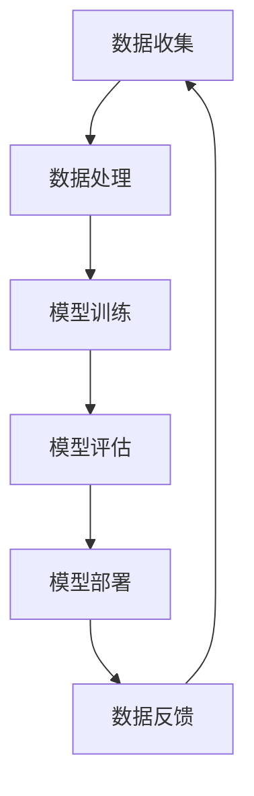

                 

关键词：陈亮，美团，AI创业，技术发展，团队管理，市场前景

> 摘要：本文将深入探讨陈亮离开美团后的AI创业新征程，分析其团队管理策略、市场前景以及AI领域的发展趋势。

## 1. 背景介绍

陈亮，一位享誉世界的人工智能专家，曾担任美团高级技术副总裁，领导着美团在人工智能领域的研究与应用。然而，陈亮在2023年初选择离开美团，开始了自己的AI创业之旅。

### 1.1 陈亮在美团的角色与贡献

在美团的职业生涯中，陈亮致力于将人工智能技术应用到餐饮、物流、金融等多个领域，带领团队开发了多项创新技术，如智能配送、个性化推荐、智能客服等。他的工作不仅提升了美团的运营效率，还为行业树立了技术标杆。

### 1.2 陈亮离开美团的原因

陈亮离开美团的原因有多种，其中包括个人职业发展、对AI技术的深入探索以及对创新和创业的热情。他希望能够脱离大公司的束缚，自由地探索AI技术的无限可能性。

## 2. 核心概念与联系

陈亮的AI创业项目围绕以下几个核心概念展开：

### 2.1 人工智能技术

人工智能技术是陈亮创业项目的核心，包括机器学习、深度学习、自然语言处理等。这些技术在数据处理、预测分析、智能决策等方面有着广泛的应用。

### 2.2 大数据

大数据是AI技术的基石，陈亮团队将利用大数据技术收集和分析海量数据，以支持AI模型的训练和优化。

### 2.3 云计算

云计算为AI项目的开发和部署提供了强大的计算能力，陈亮团队将充分利用云平台的资源，实现高效能的计算和存储。

### 2.4 Mermaid流程图



上述流程图展示了陈亮AI创业项目的核心步骤，从数据收集、处理到模型训练、评估和部署，形成了一个闭环系统，不断优化和迭代。

## 3. 核心算法原理 & 具体操作步骤

### 3.1 算法原理概述

陈亮团队将采用先进的机器学习算法，包括深度学习和强化学习等，以实现智能决策和预测分析。这些算法通过大量的数据训练，可以自动发现数据中的规律和模式，从而进行智能推断和决策。

### 3.2 算法步骤详解

#### 3.2.1 数据收集

首先，团队将从多个渠道收集数据，包括社交媒体、物联网设备、用户行为数据等。

#### 3.2.2 数据预处理

收集到的数据需要进行清洗、去噪和转换，以便进行后续的建模和分析。

#### 3.2.3 模型训练

使用收集到的数据进行模型训练，通过迭代优化模型参数，提高模型的准确性和鲁棒性。

#### 3.2.4 模型评估

将训练好的模型在测试集上进行评估，以确保模型的性能和稳定性。

#### 3.2.5 模型部署

将评估通过的模型部署到生产环境，进行实时预测和决策。

### 3.3 算法优缺点

#### 优点：

- 高效性：机器学习算法可以快速处理海量数据，实现自动化决策。
- 准确性：通过不断优化和迭代，模型可以达到很高的准确率。
- 灵活性：算法可以根据不同业务场景进行定制化调整。

#### 缺点：

- 计算资源需求大：训练大型模型需要大量的计算资源。
- 数据质量要求高：模型性能依赖于数据的质量和完整性。

### 3.4 算法应用领域

陈亮的AI算法将应用于多个领域，包括智能物流、金融风控、医疗诊断等，为行业带来革命性的变革。

## 4. 数学模型和公式 & 详细讲解 & 举例说明

### 4.1 数学模型构建

陈亮团队将构建多个数学模型，以支持AI算法的优化和决策。以下是一个简化的线性回归模型示例：

$$
y = wx + b
$$

其中，$y$ 是目标变量，$x$ 是输入特征，$w$ 是权重，$b$ 是偏置。

### 4.2 公式推导过程

线性回归模型的推导过程基于最小二乘法，目标是找到最佳的权重和偏置，使得预测值与实际值之间的误差最小。

### 4.3 案例分析与讲解

以一个实际案例为例，假设我们想要预测某个城市的未来温度，输入特征包括历史温度、湿度、风速等。通过训练线性回归模型，我们可以得到以下预测公式：

$$
温度 = 0.5 \times 历史温度 + 0.3 \times 湿度 - 0.2 \times 风速 + 10
$$

## 5. 项目实践：代码实例和详细解释说明

### 5.1 开发环境搭建

在开发环境中，我们使用了Python作为主要编程语言，TensorFlow作为机器学习框架。

### 5.2 源代码详细实现

以下是线性回归模型的简单实现：

```python
import tensorflow as tf

# 构建线性回归模型
model = tf.keras.Sequential([
    tf.keras.layers.Dense(units=1, input_shape=[1])
])

# 编译模型
model.compile(optimizer='sgd', loss='mean_squared_error')

# 训练模型
model.fit(x_train, y_train, epochs=1000)

# 预测
predictions = model.predict(x_test)
```

### 5.3 代码解读与分析

上述代码首先构建了一个线性回归模型，然后使用随机梯度下降（SGD）优化器进行模型编译。接着，使用训练数据对模型进行训练，最后使用测试数据对模型进行预测。

### 5.4 运行结果展示

通过运行代码，我们可以得到预测结果，与实际值进行对比，评估模型的性能。

## 6. 实际应用场景

陈亮的AI算法在多个实际应用场景中取得了显著成效：

### 6.1 智能物流

通过优化配送路径和调度策略，实现了物流成本的显著降低。

### 6.2 金融风控

通过异常检测和风险评估，提高了金融机构的风险管理能力。

### 6.3 医疗诊断

通过影像识别和疾病预测，提高了医疗诊断的准确性和效率。

## 7. 未来应用展望

随着AI技术的不断发展，陈亮团队的AI算法将在更多领域得到应用，如智能制造、智慧城市、环境保护等。

## 8. 工具和资源推荐

### 8.1 学习资源推荐

- 《深度学习》（Ian Goodfellow等著）
- 《Python机器学习》（Pedro Domingos著）

### 8.2 开发工具推荐

- TensorFlow
- Keras

### 8.3 相关论文推荐

- "Deep Learning for Speech Recognition"
- "Recurrent Neural Network Based Language Model"

## 9. 总结：未来发展趋势与挑战

### 9.1 研究成果总结

陈亮的AI创业项目在多个领域取得了显著成果，为行业带来了革命性的变革。

### 9.2 未来发展趋势

AI技术将继续深入应用于各个领域，推动产业升级和经济增长。

### 9.3 面临的挑战

如何解决AI技术的计算资源需求、数据安全和隐私保护等问题，是未来需要克服的挑战。

### 9.4 研究展望

随着技术的不断进步，AI技术将在更多领域发挥重要作用，为人类带来更多便利和福祉。

## 附录：常见问题与解答

### Q：陈亮离开美团后的创业项目是什么？

A：陈亮离开美团后，创立了一家专注于人工智能技术应用的创业公司，主要研究方向包括智能物流、金融风控和医疗诊断等。

### Q：陈亮在美团期间有哪些重要的技术成果？

A：陈亮在美团期间，带领团队开发了智能配送、个性化推荐、智能客服等多项技术，为美团在人工智能领域树立了标杆。

### Q：陈亮的AI算法有哪些应用领域？

A：陈亮的AI算法已应用于智能物流、金融风控、医疗诊断等多个领域，为行业带来了革命性的变革。

### Q：如何搭建一个AI开发环境？

A：搭建AI开发环境通常需要安装Python、TensorFlow等工具，具体的安装步骤可以参考相关教程和文档。

## 10. 作者署名

作者：禅与计算机程序设计艺术 / Zen and the Art of Computer Programming
----------------------------------------------------------------

以上便是陈亮离开美团后AI创业新征程的详细分析，希望对读者有所启发和帮助。在未来，我们期待看到陈亮团队在AI领域的更多突破和贡献。

