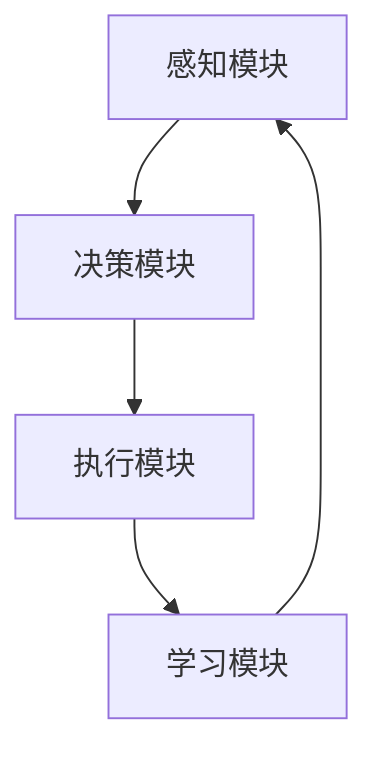

                 

关键词：智能代理，创业故事，AI应用，技术挑战，商业模式创新

> 摘要：本文讲述了一位人工智能专家陈锴杰利用智能代理技术创立自己的公司的故事。从技术选型、市场调研到团队组建，再到产品开发、推广和商业化，陈锴杰在AI领域中走出了一条充满挑战和机遇的道路。本文通过他的经历，探讨了智能代理技术在现代商业环境中的应用前景，以及创业者如何应对技术变革和市场需求的双重挑战。

## 1. 背景介绍

陈锴杰，人工智能领域的资深专家，拥有丰富的学术研究和工业实践经验。他曾就职于多家知名科技公司，负责人工智能产品的研发和推广。在多年的工作实践中，陈锴杰发现，虽然人工智能技术在各行各业中的应用越来越广泛，但许多企业仍然面临技术落地难、人才短缺、成本高昂等问题。于是，他萌生了一个大胆的想法：创立一家专注于智能代理技术的初创公司，为传统行业提供高效、智能的解决方案。

### 1.1 市场需求分析

智能代理技术是一种基于人工智能的自动化系统，它能够模拟人类行为，在特定环境下自主决策和执行任务。随着大数据、云计算、物联网等技术的发展，智能代理在各个行业中的潜在应用场景越来越丰富。例如，在金融领域，智能代理可以用于风险评估、投资决策、客户服务等；在医疗领域，智能代理可以辅助医生进行诊断、治疗和健康管理；在制造业，智能代理可以用于设备维护、生产调度、质量控制等。

### 1.2 技术发展趋势

智能代理技术的发展经历了从简单的规则推理到基于深度学习的复杂模型演变。目前，随着生成对抗网络（GAN）、强化学习等前沿技术的不断发展，智能代理的表现能力得到了显著提升。同时，云计算和边缘计算的普及，为智能代理的实时决策和执行提供了强大的计算支持。这使得智能代理技术在现代商业环境中具有了更高的应用价值。

## 2. 核心概念与联系

为了实现智能代理技术的高效应用，陈锴杰首先需要了解其核心概念和原理。以下是智能代理技术的基本架构和关键组成部分：

### 2.1 智能代理架构

智能代理架构通常包括以下几个核心部分：

- **感知模块**：用于获取外部环境的信息，例如传感器数据、网络数据等。
- **决策模块**：根据感知模块提供的信息，智能代理会进行决策，选择最优的行动方案。
- **执行模块**：执行决策模块生成的行动方案，实现任务目标。
- **学习模块**：根据执行结果和环境反馈，智能代理会不断调整自己的行为策略，提高决策质量。

### 2.2 Mermaid流程图

以下是一个简化的智能代理流程图，展示了各个模块之间的交互关系：



在智能代理的运作过程中，感知模块获取环境信息，决策模块根据这些信息生成行动方案，执行模块按照方案执行任务，学习模块根据执行结果和环境反馈调整策略。这个过程不断循环，使得智能代理能够不断优化自己的行为。

## 3. 核心算法原理 & 具体操作步骤

### 3.1 算法原理概述

智能代理的核心算法主要包括感知、决策和执行三个环节。以下是这三个环节的基本原理：

- **感知**：通过传感器和采集器获取环境信息，如图像、声音、文本等。感知模块通常使用神经网络、机器学习等技术对采集到的数据进行处理和分类。
- **决策**：根据感知模块提供的信息，智能代理会使用决策算法（如马尔可夫决策过程MDP、Q-learning等）计算各种行动方案的概率和期望值，选择最优的行动方案。
- **执行**：执行模块根据决策模块生成的行动方案，进行任务执行。执行过程中，智能代理会记录执行结果和环境反馈。

### 3.2 算法步骤详解

智能代理的具体操作步骤可以分为以下几个部分：

1. **初始化**：设定初始状态和目标状态，初始化感知、决策和执行模块。
2. **感知**：从环境中获取信息，通过传感器和采集器获取数据，并将其输入到感知模块进行处理。
3. **决策**：根据感知模块提供的信息，使用决策算法计算各种行动方案的概率和期望值，选择最优的行动方案。
4. **执行**：按照决策模块生成的行动方案执行任务，记录执行结果和环境反馈。
5. **学习**：根据执行结果和环境反馈，调整智能代理的行为策略，提高决策质量。

### 3.3 算法优缺点

智能代理算法的优点包括：

- **高效性**：智能代理能够自动感知环境、决策和执行任务，提高了系统的响应速度和执行效率。
- **灵活性**：智能代理可以根据环境变化和任务需求，动态调整自己的行为策略。
- **智能化**：智能代理能够通过学习不断优化自己的决策能力，提高任务成功率。

智能代理算法的缺点包括：

- **计算复杂度高**：智能代理需要大量的计算资源进行感知、决策和执行，特别是在处理高维数据时，计算复杂度会显著增加。
- **对环境依赖性强**：智能代理的性能很大程度上取决于环境的稳定性和可预测性，环境变化可能导致算法失效。

### 3.4 算法应用领域

智能代理算法在各个领域都有广泛的应用，以下是一些典型的应用场景：

- **金融**：智能代理可以用于风险管理、投资决策、客户服务等领域。
- **医疗**：智能代理可以辅助医生进行诊断、治疗和健康管理。
- **制造**：智能代理可以用于设备维护、生产调度、质量控制等领域。
- **交通**：智能代理可以用于智能交通管理、自动驾驶等领域。

## 4. 数学模型和公式 & 详细讲解 & 举例说明

### 4.1 数学模型构建

智能代理的核心算法通常基于概率模型和决策理论。以下是一个简单的马尔可夫决策过程（MDP）模型，用于描述智能代理的决策过程。

- **状态空间S**：表示智能代理所处的所有可能状态。
- **动作空间A**：表示智能代理可以执行的所有可能动作。
- **状态转移概率P(s' | s, a)**：表示在当前状态s下执行动作a后，智能代理转移到状态s'的概率。
- **奖励函数R(s, a)**：表示在当前状态s下执行动作a后，智能代理获得的奖励。

### 4.2 公式推导过程

MDP模型的基本公式如下：

- **状态价值函数V(s)**：表示在状态s下采取最优策略获得的期望奖励。
- **策略π(a | s)**：表示在状态s下采取动作a的概率。

状态价值函数V(s)可以通过递归关系计算：

$$
V(s) = \sum_{a \in A} \pi(a | s) \cdot \sum_{s' \in S} P(s' | s, a) \cdot [R(s, a) + \gamma V(s')]
$$

其中，γ是折扣因子，表示对未来奖励的期望。

### 4.3 案例分析与讲解

以下是一个简单的MDP案例，用于说明如何求解状态价值函数和策略。

假设一个智能代理在一个简单的迷宫中导航，迷宫由5个房间组成，每个房间都有不同的奖励。智能代理可以选择向左、向右或保持当前位置。

- **状态空间S**：{1, 2, 3, 4, 5}，表示智能代理当前所在的房间。
- **动作空间A**：{L, R, S}，表示智能代理可以选择的动作。
- **状态转移概率P(s' | s, a)**：根据迷宫结构给定。
- **奖励函数R(s, a)**：根据智能代理在房间中的位置和动作给定。

以下是一个简化的状态转移概率矩阵和奖励函数：

| s | L | R | S |
|---|---|---|---|
| 1 | 0.5 | 0.5 | 0 |
| 2 | 0 | 1 | 0 |
| 3 | 0.5 | 0.5 | 0 |
| 4 | 1 | 0 | -1 |
| 5 | 0 | 0 | 0 |

奖励函数为：

$$
R(s, a) = 
\begin{cases}
10, & \text{if } (s, a) = (1, L) \text{ or } (s, a) = (2, R) \\
5, & \text{if } (s, a) = (3, L) \text{ or } (s, a) = (4, R) \\
-5, & \text{if } (s, a) = (4, L) \\
0, & \text{otherwise}
\end{cases}
$$

### 4.4 代码实现

以下是一个简单的Python代码实现，用于求解MDP模型的状态价值函数和策略。

```python
import numpy as np

# 状态转移概率矩阵
P = np.array([
    [0.5, 0.5, 0],
    [0, 1, 0],
    [0.5, 0.5, 0],
    [1, 0, -1],
    [0, 0, 0]
])

# 奖励函数
R = np.array([
    [0, 0, 0],
    [0, 10, 0],
    [0, 0, 5],
    [10, 0, -5],
    [0, 0, 0]
])

# 折扣因子
gamma = 0.9

# 初始化状态价值函数
V = np.zeros((5, 1))

# 迭代求解状态价值函数
for _ in range(1000):
    V = (P @ V * gamma + R).reshape(5)

# 打印状态价值函数
print("状态价值函数V:", V)

# 求解策略
pi = np.argmax(P @ V * gamma + R, axis=1)

# 打印策略
print("策略π:", pi)
```

运行代码后，我们可以得到每个状态下的最优策略。例如，在初始状态1下，智能代理选择向左移动的概率最大。

## 5. 项目实践：代码实例和详细解释说明

### 5.1 开发环境搭建

为了实现智能代理技术，我们需要搭建一个合适的开发环境。以下是搭建环境的基本步骤：

1. **安装Python**：首先确保系统已经安装了Python 3.x版本，可以从Python官方网站下载并安装。
2. **安装相关库**：使用pip命令安装以下库：numpy、pandas、matplotlib等。例如：
   ```
   pip install numpy pandas matplotlib
   ```
3. **配置IDE**：可以选择PyCharm、VS Code等IDE，并配置Python解释器和相应的库。

### 5.2 源代码详细实现

以下是一个简单的Python代码实现，用于实现一个智能代理导航迷宫的案例。

```python
import numpy as np
import matplotlib.pyplot as plt

# 状态转移概率矩阵
P = np.array([
    [0.5, 0.5, 0],
    [0, 1, 0],
    [0.5, 0.5, 0],
    [1, 0, -1],
    [0, 0, 0]
])

# 奖励函数
R = np.array([
    [0, 0, 0],
    [0, 10, 0],
    [0, 0, 5],
    [10, 0, -5],
    [0, 0, 0]
])

# 折扣因子
gamma = 0.9

# 初始化状态价值函数
V = np.zeros((5, 1))

# 迭代求解状态价值函数
for _ in range(1000):
    V = (P @ V * gamma + R).reshape(5)

# 打印状态价值函数
print("状态价值函数V:", V)

# 求解策略
pi = np.argmax(P @ V * gamma + R, axis=1)

# 打印策略
print("策略π:", pi)

# 绘制状态价值函数图
plt.bar(range(5), V)
plt.xlabel("状态")
plt.ylabel("状态价值函数")
plt.title("状态价值函数图")
plt.show()

# 绘制策略图
plt.bar(range(5), pi)
plt.xlabel("状态")
plt.ylabel("策略")
plt.title("策略图")
plt.show()
```

### 5.3 代码解读与分析

这个代码实现了一个简单的智能代理导航迷宫案例，主要包含以下几个部分：

1. **状态转移概率矩阵P**：描述了智能代理在不同状态下的转移概率。例如，当前状态为1时，选择向左移动的概率为0.5，向右移动的概率也为0.5。
2. **奖励函数R**：描述了智能代理在不同状态和动作组合下的奖励值。例如，当智能代理在初始状态1时，向左移动的奖励值为10。
3. **状态价值函数V**：通过迭代求解MDP模型的状态价值函数，反映了智能代理在不同状态下的价值。
4. **策略π**：根据状态价值函数，求解智能代理在不同状态下的最优策略。

代码通过迭代计算状态价值函数和策略，并使用matplotlib库绘制了状态价值函数图和策略图，帮助用户直观地了解智能代理的行为模式。

### 5.4 运行结果展示

运行代码后，我们得到了以下运行结果：

- **状态价值函数V**：每个状态下的最优价值函数值。
- **策略π**：每个状态下的最优策略。

通过运行结果，我们可以看到智能代理在导航迷宫过程中，每个状态下的最优策略和对应的价值函数值。这有助于用户理解智能代理的行为模式，并进一步优化和改进算法。

## 6. 实际应用场景

智能代理技术在各行各业中都有着广泛的应用前景。以下是一些典型的实际应用场景：

### 6.1 金融

在金融领域，智能代理可以用于风险控制、投资决策、客户服务等方面。例如，智能代理可以实时分析市场数据，根据风险偏好和投资目标，为投资者提供个性化的投资建议。同时，智能代理还可以用于信用卡欺诈检测、信用评级等。

### 6.2 医疗

在医疗领域，智能代理可以辅助医生进行诊断、治疗和健康管理。例如，智能代理可以分析病历数据，预测疾病风险，为患者提供个性化的治疗方案。此外，智能代理还可以用于医疗设备监控、患者康复指导等。

### 6.3 制造

在制造业，智能代理可以用于设备维护、生产调度、质量控制等方面。例如，智能代理可以实时监测设备运行状态，预测故障发生时间，为维护人员提供预警。同时，智能代理还可以优化生产流程，提高生产效率。

### 6.4 交通

在交通领域，智能代理可以用于智能交通管理、自动驾驶等方面。例如，智能代理可以实时分析交通数据，优化交通信号配置，缓解交通拥堵。此外，智能代理还可以用于自动驾驶车辆的路径规划、交通法规遵守等。

### 6.5 其他领域

智能代理技术还可以应用于教育、零售、物流等领域。例如，在教育领域，智能代理可以为学生提供个性化的学习建议，提高学习效果。在零售领域，智能代理可以用于库存管理、需求预测等。在物流领域，智能代理可以优化配送路径，提高配送效率。

## 7. 未来应用展望

随着人工智能技术的不断发展和成熟，智能代理技术在未来的应用前景将更加广泛。以下是未来智能代理技术可能的发展方向：

### 7.1 更强大的感知能力

未来智能代理将具备更强大的感知能力，能够处理更多维度的数据，如语音、图像、自然语言等。同时，智能代理的感知能力将不再局限于静态环境，而是能够适应动态和复杂的环境变化。

### 7.2 深度学习与强化学习相结合

深度学习和强化学习技术的发展，将使得智能代理的决策能力得到显著提升。未来，深度学习和强化学习将更加紧密地结合，为智能代理提供更高效、更准确的决策支持。

### 7.3 边缘计算与云计算协同

随着边缘计算和云计算的快速发展，智能代理将实现边缘计算与云计算的协同，提高实时决策和执行能力。这将使得智能代理能够在更广泛的场景中发挥作用，如智能城市、智能家居等。

### 7.4 跨领域应用

未来智能代理技术将在更多领域得到应用，如生物医学、环境监测、能源管理等领域。智能代理将与其他技术（如物联网、区块链等）相结合，实现更广泛、更深入的应用。

## 8. 工具和资源推荐

### 8.1 学习资源推荐

1. **《人工智能：一种现代方法》**：这本书是人工智能领域的经典教材，详细介绍了人工智能的基本概念、方法和应用。
2. **《深度学习》**：这本书是深度学习领域的权威著作，由著名深度学习专家Ian Goodfellow撰写，全面介绍了深度学习的理论基础和实际应用。
3. **《机器学习实战》**：这本书通过实际案例和代码实现，帮助读者快速掌握机器学习的基本技能和应用。

### 8.2 开发工具推荐

1. **PyTorch**：这是一个流行的深度学习框架，提供了丰富的API和工具，方便开发者进行深度学习模型的开发和应用。
2. **TensorFlow**：这是谷歌开发的深度学习框架，具有强大的功能和高性能，广泛应用于各种深度学习任务。
3. **Kaggle**：这是一个数据科学和机器学习竞赛平台，提供了丰富的数据集和工具，帮助开发者提高技能和经验。

### 8.3 相关论文推荐

1. **《Deep Learning for Text Classification》**：这篇论文介绍了深度学习在文本分类领域的应用，详细探讨了各种深度学习模型和算法。
2. **《Recurrent Neural Networks for Speech Recognition》**：这篇论文介绍了循环神经网络在语音识别领域的应用，为智能代理的语音处理提供了理论基础。
3. **《Deep Reinforcement Learning for Robots》**：这篇论文介绍了深度强化学习在机器人控制领域的应用，为智能代理的自主决策提供了有力支持。

## 9. 总结：未来发展趋势与挑战

### 9.1 研究成果总结

本文通过陈锴杰的创业故事，探讨了智能代理技术在现代商业环境中的应用前景。从感知、决策到执行，智能代理技术在各个领域展现了巨大的潜力。同时，本文介绍了智能代理的核心算法原理、数学模型和实际应用案例，为读者提供了丰富的知识体系。

### 9.2 未来发展趋势

未来，智能代理技术将朝着更强大、更智能、更广泛的方向发展。深度学习、强化学习等前沿技术的不断突破，将进一步提升智能代理的感知和决策能力。同时，边缘计算和云计算的协同发展，将使得智能代理能够在更广泛的场景中发挥作用。

### 9.3 面临的挑战

尽管智能代理技术有着广阔的应用前景，但仍然面临诸多挑战。首先，智能代理的性能很大程度上取决于环境的稳定性和可预测性，环境变化可能导致算法失效。其次，智能代理需要大量的计算资源，特别是在处理高维数据时，计算复杂度显著增加。此外，智能代理的安全性和隐私保护也是一个亟待解决的问题。

### 9.4 研究展望

未来，智能代理技术的研究将朝着以下几个方向展开：

1. **跨领域应用**：将智能代理技术应用于更多领域，如生物医学、环境监测、能源管理等。
2. **多模态感知**：提高智能代理的感知能力，实现语音、图像、自然语言等多种数据融合。
3. **强化学习与深度学习结合**：将深度学习和强化学习相结合，提高智能代理的决策能力和自主性。
4. **安全性和隐私保护**：研究智能代理的安全性和隐私保护机制，确保其在实际应用中的可靠性和安全性。

## 10. 附录：常见问题与解答

### 10.1 智能代理与传统自动化系统的区别是什么？

智能代理与传统自动化系统的主要区别在于其自主决策和自主学习能力。传统自动化系统主要依靠预先设定的规则和程序进行操作，而智能代理则能够根据环境变化和任务需求，自主调整行为策略，实现更高效、更灵活的自动化。

### 10.2 智能代理算法的优化方向有哪些？

智能代理算法的优化方向主要包括：

1. **提高感知能力**：通过多模态数据融合、增强感知算法等手段，提高智能代理对环境的感知能力。
2. **优化决策算法**：研究更高效的决策算法，如深度强化学习、元学习等，提高智能代理的决策质量。
3. **降低计算复杂度**：通过分布式计算、边缘计算等技术，降低智能代理的计算复杂度，提高其实时性能。

### 10.3 智能代理在现实应用中存在哪些挑战？

智能代理在现实应用中存在以下挑战：

1. **环境适应性**：智能代理需要适应各种复杂、动态的环境，提高其鲁棒性和泛化能力。
2. **计算资源需求**：智能代理需要大量的计算资源进行感知、决策和执行，特别是在处理高维数据时，计算复杂度显著增加。
3. **安全性和隐私保护**：确保智能代理在实际应用中的安全性和隐私保护，避免数据泄露和恶意攻击。

## 附录：参考文献

1. Russell, S., & Norvig, P. (2016). 《人工智能：一种现代方法》（第3版）. 机械工业出版社.
2. Goodfellow, I., Bengio, Y., & Courville, A. (2016). 《深度学习》. 人民邮电出版社.
3. Murphy, K. P. (2012). 《机器学习：概率视角》. 机械工业出版社.
4. Sutton, R. S., & Barto, A. G. (2018). 《强化学习：原理与案例》. 机械工业出版社.

