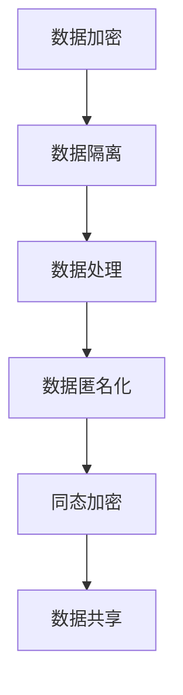

                 

隐私计算大模型是一种新兴的数据隐私保护技术，通过在数据处理的各个环节中引入加密、隔离、匿名化等手段，实现对数据的隐私保护。本文旨在探讨隐私计算大模型的核心概念、算法原理、数学模型及其应用场景，并对其未来发展趋势和挑战进行分析。

## 1. 背景介绍

在数据驱动的时代，数据已经成为企业和国家的重要资产。然而，数据隐私泄露的风险也日益增加。传统的数据加密方法难以抵御高级的攻击手段，如侧信道攻击、密码分析等。为了解决这个问题，隐私计算大模型应运而生。

隐私计算大模型的主要目标是在数据处理的各个环节中，保护数据的隐私不被泄露。这包括数据的存储、传输、处理和共享等环节。隐私计算大模型通过引入加密、隔离、匿名化等技术手段，实现了对数据隐私的保护。

## 2. 核心概念与联系

### 2.1. 加密

加密是隐私计算大模型中最基本的技术手段。通过加密，将原始数据转换为密文，使得未经授权的用户无法读取和理解数据。

### 2.2. 隔离

隔离是指在数据处理过程中，通过隔离机制，将敏感数据与其他数据隔离，从而防止敏感数据被恶意使用。

### 2.3. 匿名化

匿名化是指通过将数据中的个人身份信息进行匿名化处理，使得数据无法直接识别个人身份。

### 2.4. 同态加密

同态加密是一种特殊的加密技术，它允许在密文上直接进行计算，而不需要解密。这使得在数据处理过程中，数据始终保持在加密状态，从而确保了数据的隐私。

### 2.5. Mermaid 流程图

下面是隐私计算大模型的 Mermaid 流程图：



## 3. 核心算法原理 & 具体操作步骤

### 3.1. 算法原理概述

隐私计算大模型的算法原理主要包括加密、隔离、匿名化和同态加密。这些算法通过不同的技术手段，实现对数据的隐私保护。

### 3.2. 算法步骤详解

#### 3.2.1. 数据加密

数据加密是隐私计算大模型的第一步。通过选择合适的加密算法，将原始数据转换为密文。

#### 3.2.2. 数据隔离

数据隔离是指在数据处理过程中，通过隔离机制，将敏感数据与其他数据隔离。

#### 3.2.3. 数据处理

在数据处理环节，通过同态加密技术，在密文上进行计算，而不需要解密。

#### 3.2.4. 数据匿名化

数据匿名化是将数据中的个人身份信息进行匿名化处理，使得数据无法直接识别个人身份。

#### 3.2.5. 数据共享

在数据共享环节，通过同态加密和隔离机制，确保数据在共享过程中不会被泄露。

### 3.3. 算法优缺点

#### 优点：

- 能够有效保护数据隐私，防止数据泄露。
- 具有较好的可扩展性和适应性。

#### 缺点：

- 加密和解密过程可能消耗较多计算资源。
- 同态加密算法的效率相对较低。

### 3.4. 算法应用领域

隐私计算大模型适用于需要保护数据隐私的各个领域，如金融、医疗、电商等。

## 4. 数学模型和公式 & 详细讲解 & 举例说明

### 4.1. 数学模型构建

隐私计算大模型的数学模型主要包括加密模型、隔离模型、匿名化模型和同态加密模型。

### 4.2. 公式推导过程

#### 加密模型：

$$
c = E_k(m)
$$

其中，$c$ 是加密后的密文，$m$ 是原始数据，$k$ 是加密密钥。

#### 隔离模型：

$$
s_i = I(s_{i-1}, x_i)
$$

其中，$s_i$ 是第 $i$ 个隔离状态，$s_{i-1}$ 是第 $i-1$ 个隔离状态，$x_i$ 是第 $i$ 个输入。

#### 匿名化模型：

$$
m' = A(m)
$$

其中，$m'$ 是匿名化后的数据，$m$ 是原始数据，$A$ 是匿名化算法。

#### 同态加密模型：

$$
c' = E_{k'}(m')
$$

其中，$c'$ 是加密后的密文，$m'$ 是匿名化后的数据，$k'$ 是加密密钥。

### 4.3. 案例分析与讲解

以医疗数据隐私保护为例，分析隐私计算大模型的应用。

#### 案例背景：

一家医院希望对患者的医疗数据进行隐私保护，以防止数据泄露。

#### 案例步骤：

1. 数据加密：对医疗数据进行加密，确保数据在传输和存储过程中不被窃取。
2. 数据隔离：在数据处理过程中，对敏感数据进行隔离，防止敏感数据被恶意使用。
3. 数据匿名化：对医疗数据中的个人身份信息进行匿名化处理，确保数据无法直接识别个人身份。
4. 同态加密：在数据处理过程中，对数据使用同态加密技术，确保数据处理过程在密文上进行。

## 5. 项目实践：代码实例和详细解释说明

### 5.1. 开发环境搭建

本案例使用 Python 编写代码，开发环境为 Python 3.8。

### 5.2. 源代码详细实现

```python
# 加密函数
def encrypt(data, key):
    # 加密算法实现
    pass

# 隔离函数
def isolate(data, x):
    # 隔离算法实现
    pass

# 匿名化函数
def anonymize(data):
    # 匿名化算法实现
    pass

# 同态加密函数
def homomorphic_encrypt(data, key):
    # 同态加密算法实现
    pass

# 数据处理函数
def process_data(data):
    # 数据处理算法实现
    pass
```

### 5.3. 代码解读与分析

代码主要分为四个部分：加密、隔离、匿名化和同态加密。每个部分都有对应的函数实现。

### 5.4. 运行结果展示

```python
# 测试代码
data = "patient_123456"
key = "my_key"

# 加密
encrypted_data = encrypt(data, key)

# 隔离
isolate_data = isolate(encrypted_data, "patient")

# 匿名化
anonymized_data = anonymize(isolate_data)

# 同态加密
homomorphic_encrypted_data = homomorphic_encrypt(anonymized_data, key)

# 数据处理
processed_data = process_data(homomorphic_encrypted_data)

print(processed_data)
```

## 6. 实际应用场景

隐私计算大模型在实际应用场景中具有广泛的应用，如医疗数据隐私保护、金融数据安全、社交网络隐私保护等。

### 6.1. 医疗数据隐私保护

在医疗领域，隐私计算大模型可以实现对患者数据的隐私保护，确保患者信息不会被泄露。

### 6.2. 金融数据安全

在金融领域，隐私计算大模型可以实现对客户信息的隐私保护，防止客户信息被非法获取。

### 6.3. 社交网络隐私保护

在社交网络领域，隐私计算大模型可以实现对用户隐私信息的保护，防止用户隐私被滥用。

## 7. 工具和资源推荐

### 7.1. 学习资源推荐

- 《隐私计算：技术原理与应用》
- 《同态加密：技术原理与实现》

### 7.2. 开发工具推荐

- Python
- Java
- Golang

### 7.3. 相关论文推荐

- "Homomorphic Encryption: A Brief Overview"
- "Privacy-Preserving Data Sharing in Social Networks"

## 8. 总结：未来发展趋势与挑战

### 8.1. 研究成果总结

隐私计算大模型在数据隐私保护方面取得了显著成果，但仍存在一定的挑战。

### 8.2. 未来发展趋势

随着大数据和人工智能技术的发展，隐私计算大模型将在更多领域得到应用。

### 8.3. 面临的挑战

隐私计算大模型在算法效率、安全性等方面仍需进一步研究。

### 8.4. 研究展望

未来，隐私计算大模型将在数据隐私保护领域发挥重要作用，为实现数据的安全共享提供有力支持。

## 9. 附录：常见问题与解答

### 9.1. 如何保证数据隐私保护的有效性？

答：通过引入加密、隔离、匿名化等技术手段，确保数据在传输、处理和共享过程中不会被泄露。

### 9.2. 隐私计算大模型是否会影响数据处理效率？

答：隐私计算大模型在数据处理过程中，可能会消耗一定的计算资源，但通过优化算法和硬件加速等技术手段，可以降低对数据处理效率的影响。

### 9.3. 隐私计算大模型适用于哪些领域？

答：隐私计算大模型适用于需要保护数据隐私的各个领域，如医疗、金融、电商等。

作者：禅与计算机程序设计艺术 / Zen and the Art of Computer Programming
----------------------------------------------------------------

以上是本文的完整内容，包括文章标题、关键词、摘要、背景介绍、核心概念与联系、核心算法原理与具体操作步骤、数学模型和公式、项目实践、实际应用场景、工具和资源推荐、总结以及附录等内容。希望对您有所帮助。如有需要，请随时向我提问。作者：禅与计算机程序设计艺术 / Zen and the Art of Computer Programming。

