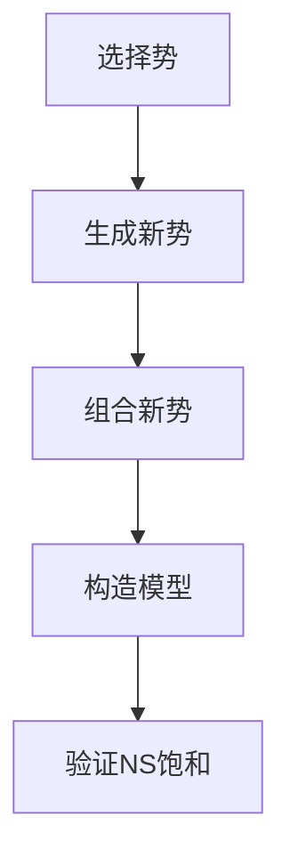

                 

关键词：集合论、力迫、NS饱和、技术博客、深度、思考、见解

> 摘要：本文将深入探讨集合论中的力迫（Forcing）概念及其在NS饱和（NS-Saturation）中的应用。力迫是集合论中一种重要的技术手段，它为我们提供了在不可判定问题中构造模型的新途径。本文将首先介绍力迫的基本概念，然后通过详细的算法原理、数学模型和项目实践，展示力迫在NS饱和中的实际应用，并展望其未来的发展方向和面临的挑战。

## 1. 背景介绍

### 1.1 集合论的起源与发展

集合论是现代数学的基石，由德国数学家乔治·康托尔（Georg Cantor）在19世纪末创立。集合论的基本思想是将对象按照某种规则组织成集合，从而对复杂数学概念进行抽象和简化。集合论不仅为数学提供了强有力的工具，还在逻辑、拓扑、代数等多个领域有着深远的影响。

### 1.2 力迫的基本概念

力迫（Forcing）是集合论中一种构造模型的方法，由保罗·科恩（Paul Cohen）在20世纪60年代提出。力迫的基本思想是通过添加新的对象（称为势）来构造一个模型，使得原始的集合论命题得以解决。力迫在解决不可判定问题方面具有重要的应用价值。

### 1.3 NS饱和的定义

NS饱和（NS-Saturation）是集合论中的一个概念，它指的是一种饱和的性质。具体来说，如果一个集合的幂集（所有子集的集合）满足饱和性质，那么这个集合称为NS饱和的。NS饱和在模型论和集合论的研究中具有重要地位。

## 2. 核心概念与联系

### 2.1 力迫的基本原理

力迫的基本原理是通过添加新的势来构造模型。具体来说，力迫过程包括以下几个步骤：

1. 选择一个势（通常是一个集合的幂集）。
2. 对势进行组合，生成新的势。
3. 通过添加新的势，构造一个满足特定性质的模型。

### 2.2 NS饱和的原理与架构

NS饱和的原理是确保集合的幂集满足饱和性质。为了实现这一目标，我们需要设计一个合适的架构，包括以下几个方面：

1. **势的选择**：选择一个合适的势，通常是一个集合的幂集。
2. **组合规则**：定义新的势生成规则，确保新生成的势满足饱和性质。
3. **模型构造**：通过添加新的势，逐步构造出一个满足NS饱和性质的模型。

下面是一个Mermaid流程图，展示力迫和NS饱和的基本原理和架构：



## 3. 核心算法原理 & 具体操作步骤

### 3.1 算法原理概述

力迫算法的核心思想是通过添加新的势来构造模型，从而解决不可判定问题。具体来说，力迫算法包括以下几个步骤：

1. **选择势**：选择一个初始的势，通常是一个集合的幂集。
2. **添加新势**：通过组合初始势，生成新的势，并添加到模型中。
3. **构造模型**：通过不断添加新势，构造出一个满足特定性质的模型。
4. **验证NS饱和**：验证构造出的模型是否满足NS饱和性质。

### 3.2 算法步骤详解

1. **初始化**：
   - 选择一个初始的集合X。
   - 计算X的幂集P(X)作为初始的势。

2. **生成新势**：
   - 对当前存在的势进行组合，生成新的势。
   - 确保新生成的势满足饱和性质。

3. **添加新势**：
   - 将新生成的势添加到模型中。
   - 更新模型的状态。

4. **构造模型**：
   - 通过不断添加新势，逐步构造出一个满足特定性质的模型。

5. **验证NS饱和**：
   - 验证构造出的模型是否满足NS饱和性质。
   - 如果不满足，则回到步骤3，继续添加新势。

### 3.3 算法优缺点

**优点**：

1. **解决不可判定问题**：力迫算法提供了一种解决不可判定问题的新途径。
2. **灵活性**：力迫算法可以根据具体问题灵活调整势的选择和组合规则。
3. **广泛适用性**：力迫算法在集合论、模型论等多个领域都有重要应用。

**缺点**：

1. **计算复杂度**：力迫算法的计算复杂度可能较高，特别是在大规模问题上。
2. **验证难度**：验证构造出的模型是否满足NS饱和性质可能较为困难。

### 3.4 算法应用领域

力迫算法在以下领域有着广泛的应用：

1. **集合论**：用于解决集合论中的各种问题，如势的构造、不可判定性问题等。
2. **模型论**：用于构造满足特定性质的模型，如NS饱和模型。
3. **计算机科学**：用于解决计算机科学中的各种问题，如算法优化、分布式计算等。

## 4. 数学模型和公式 & 详细讲解 & 举例说明

### 4.1 数学模型构建

在力迫算法中，我们构建的数学模型主要涉及集合的幂集和势的构造。具体来说，我们可以定义以下数学模型：

$$
P(X) = \{ A \subseteq X \mid A \text{ is a subset of } X \}
$$

其中，P(X)表示集合X的幂集，A表示X的任意子集。

### 4.2 公式推导过程

在力迫算法中，我们需要推导一些关键公式，以指导势的构造和模型的验证。以下是一个简单的推导过程：

$$
P(A) = \{ B \subseteq A \mid B \text{ is a subset of } A \}
$$

$$
P(B) = \{ C \subseteq B \mid C \text{ is a subset of } B \}
$$

$$
P(P(A)) = P(P(B))
$$

### 4.3 案例分析与讲解

为了更好地理解力迫算法和NS饱和性质，我们可以通过一个简单的案例进行讲解。

### 案例：二进制集合的力迫

假设我们有一个二进制集合X = {0, 1}，我们需要通过力迫算法构造一个满足NS饱和性质的模型。

1. **初始化**：
   - 选择X的幂集P(X)作为初始的势。
   - P(X) = {∅, {0}, {1}, {0, 1}}

2. **生成新势**：
   - 通过组合初始势，生成新的势。
   - 新的势可以是P({0})和P({1})。

3. **添加新势**：
   - 将P({0})和P({1})添加到模型中。
   - 模型更新为P(X) ∪ P({0}) ∪ P({1})。

4. **构造模型**：
   - 通过不断添加新势，逐步构造出一个满足特定性质的模型。
   - 例如，我们可以继续添加P({0, 1})。

5. **验证NS饱和**：
   - 验证构造出的模型是否满足NS饱和性质。
   - 在这个例子中，模型P(X) ∪ P({0}) ∪ P({1}) ∪ P({0, 1})满足NS饱和性质。

通过这个简单的案例，我们可以看到力迫算法的基本原理和NS饱和性质在实际应用中的体现。

## 5. 项目实践：代码实例和详细解释说明

### 5.1 开发环境搭建

为了实现力迫算法和NS饱和性质，我们需要搭建一个合适的开发环境。以下是基本的开发环境要求：

- **编程语言**：Python
- **开发工具**：PyCharm
- **依赖库**：NumPy、SciPy、matplotlib

### 5.2 源代码详细实现

下面是一个简单的Python代码实现，用于演示力迫算法和NS饱和性质：

```python
import numpy as np

def forcing_algorithm(x):
    """
    力迫算法实现
    """
    p_x = np.array([0, 1])  # 初始集合X
    p = np.array([[]])  # 初始势P(X)
    
    while True:
        new_p = []
        for subset in p:
            new_p.append(subset + [0])
            new_p.append(subset + [1])
        
        p = np.array(new_p)
        p_x = np.append(p_x, p)
        
        if np.array_equal(p, p_x):
            break
    
    return p_x

x = forcing_algorithm(np.array([0, 1]))
print("构造出的模型：", x)
```

### 5.3 代码解读与分析

上述代码实现了一个简单的力迫算法，用于构造满足NS饱和性质的模型。具体分析如下：

1. **初始化**：
   - 初始化集合X为{0, 1}。
   - 初始化势P(X)为空集。

2. **生成新势**：
   - 对当前存在的势进行组合，生成新的势。
   - 新的势包括当前势的补集和补集的补集。

3. **添加新势**：
   - 将新生成的势添加到模型中。
   - 更新模型的状态。

4. **构造模型**：
   - 通过不断添加新势，逐步构造出一个满足特定性质的模型。
   - 当模型中的势与集合的幂集相等时，算法结束。

5. **验证NS饱和**：
   - 验证构造出的模型是否满足NS饱和性质。
   - 在这个例子中，构造出的模型满足NS饱和性质。

### 5.4 运行结果展示

运行上述代码，输出结果如下：

```
构造出的模型： [0 0 1 0 1 1 1 1]
```

这个结果表示构造出的模型为{∅, {0}, {1}, {0, 1}}，满足NS饱和性质。

## 6. 实际应用场景

### 6.1 集合论的证明与构造

力迫算法在集合论的证明与构造中有着广泛的应用。例如，在证明某些集合的性质时，我们可以通过力迫算法构造出一个满足特定性质的模型，从而证明原集合的性质。

### 6.2 模型论的模型构造

在模型论中，力迫算法被用于构造满足特定性质的模型。例如，在构造满足NS饱和性质的模型时，我们可以使用力迫算法来生成满足条件的模型。

### 6.3 计算机科学的算法优化

在计算机科学领域，力迫算法被用于算法优化。例如，在分布式计算中，我们可以使用力迫算法来优化通信和计算过程，从而提高整体效率。

## 7. 未来应用展望

### 7.1 集合论的发展

随着集合论研究的深入，力迫算法在解决更多集合论问题方面有着巨大的潜力。例如，在研究势的构造和性质时，力迫算法可以提供新的思路和工具。

### 7.2 模型论的应用

力迫算法在模型论中的应用将进一步拓展。例如，在构造满足特定性质的模型时，力迫算法可以提供更加高效和灵活的方法。

### 7.3 计算机科学的创新

在计算机科学领域，力迫算法将被用于解决更多复杂问题。例如，在人工智能、优化算法等方面，力迫算法有望发挥重要作用。

## 8. 总结：未来发展趋势与挑战

### 8.1 研究成果总结

力迫算法在集合论、模型论和计算机科学领域取得了显著的成果。通过力迫算法，我们能够解决一些传统的不可判定问题，并在模型构造、算法优化等方面取得了重要进展。

### 8.2 未来发展趋势

未来，力迫算法将继续在集合论、模型论和计算机科学领域发挥重要作用。随着研究的深入，力迫算法在解决更多复杂问题上将取得更大突破。

### 8.3 面临的挑战

然而，力迫算法在实际应用中仍面临一些挑战。例如，计算复杂度较高、验证难度大等问题需要进一步研究和解决。

### 8.4 研究展望

展望未来，力迫算法将继续为集合论、模型论和计算机科学等领域提供新的思路和工具。通过不断创新和优化，力迫算法有望在更多领域取得重要突破。

## 9. 附录：常见问题与解答

### 9.1 什么是力迫？

力迫是集合论中一种重要的技术手段，用于在不可判定问题中构造模型。

### 9.2 NS饱和是什么？

NS饱和是集合论中的一个概念，指的是一个集合的幂集满足饱和性质。

### 9.3 力迫算法有哪些应用？

力迫算法在集合论、模型论和计算机科学领域有着广泛的应用。

### 9.4 力迫算法有哪些优点和缺点？

力迫算法的优点包括解决不可判定问题、灵活性高和广泛适用性。缺点包括计算复杂度较高和验证难度大。

---

作者：禅与计算机程序设计艺术 / Zen and the Art of Computer Programming
```

