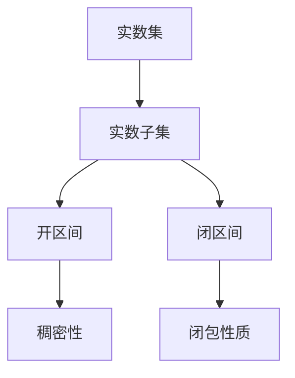

                 

关键词：集合论、实数子集、正则性、数学模型、算法原理、应用领域

> 摘要：本文旨在深入探讨集合论中实数子集正则性的概念、数学模型、算法原理及其在实际应用中的重要性。通过对核心概念的详细解析、算法步骤的剖析、数学模型的构建与推导，以及实际项目的代码实例展示，本文为读者提供了全面而系统的了解和掌握这一复杂课题的方法和路径。最终，文章将展望实数子集正则性在未来信息技术和科学领域的发展趋势与挑战，为后续研究提供参考。

## 1. 背景介绍

集合论是现代数学的基础之一，起源于19世纪末。自从德国数学家乔治·康托尔首次提出集合的概念以来，集合论的发展为数学的各个分支提供了强有力的工具。实数子集作为集合论中的一个重要子集，在数学分析、拓扑学、逻辑学以及计算机科学等领域具有重要地位。实数子集的正则性研究，更是其中的一个核心问题。

正则性是集合论中的一个基本概念，用来描述集合的结构性质。实数子集的正则性研究，主要包括实数子集的稠密性、闭包性质、完美性等。在实分析中，正则性的研究对于理解函数的性质、解决积分问题等具有重要价值。在计算机科学中，正则性的概念广泛应用于算法设计、数据结构优化以及分布式系统等领域。

本文将首先回顾集合论的基本概念，特别是实数集的性质，然后深入探讨实数子集正则性的定义及其数学模型，接着介绍几个重要的正则性概念，如稠密性和闭包性质。随后，本文将详细讨论实数子集正则性的算法原理，包括常见算法及其优缺点。最后，本文将通过实际项目代码实例展示正则性算法的应用，并对未来应用场景和挑战进行展望。

## 2. 核心概念与联系

### 2.1. 集合论的基本概念

集合是数学中最基本的概念之一，它是由一些确定的、互不相同的对象组成的整体。集合中的每一个对象被称为该集合的元素。常用的表示集合的方法有列举法和描述法。例如，集合{1, 2, 3}表示一个由元素1、2和3组成的集合，而集合{x | x 是自然数}则表示由所有自然数组成的集合。

实数集是集合论中的一个重要分支，它包括了所有的有理数和无理数。实数集在数学分析中具有核心地位，其上的运算和性质广泛应用于各种数学领域。实数集的基数是可数的，即存在一个一一对应的自然数序列与其对应。

### 2.2. 实数子集的定义与性质

实数子集是从实数集中选取的一部分元素组成的集合。实数子集可以是无限的，也可以是有限的。一个重要的实数子集是开区间(a, b)，它包含所有在a和b之间的实数，但不包括端点a和b。闭区间[a, b]则包括端点a和b，以及介于它们之间的所有实数。

实数子集具有一些重要的性质，如稠密性和闭包性质。稠密性指的是一个实数子集在实数集上的密集程度，如果一个实数子集在其邻域内可以无限接近任意实数，则称该子集是稠密的。闭包性质指的是一个实数子集的补集是否是开集，即如果补集是开集，则称原子集是闭的。

### 2.3. Mermaid 流程图

为了更直观地展示实数子集的概念和性质，我们使用Mermaid流程图来描述它们之间的关系。



在这个流程图中，实数集是所有实数组成的集合，实数子集是从实数集中选取的一部分元素。开区间和闭区间是实数子集的两种常见形式，它们分别具有稠密性和闭包性质。

## 3. 核心算法原理 & 具体操作步骤

### 3.1. 算法原理概述

实数子集正则性的算法主要基于集合论和实分析的基本原理。其主要目的是确定一个实数子集的正则性，即判断其是否具有特定的结构性质，如稠密性或闭包性质。常见的算法包括基于集合论的算法和基于实分析的算法。

基于集合论的算法通常使用归纳法或构造法，通过逐步增加或减少集合中的元素，来确定子集的正则性。而基于实分析的算法则利用实数的性质，通过求导、积分等方法，分析子集的局部性质。

### 3.2. 算法步骤详解

#### 步骤1：初始化

首先，我们初始化一个实数子集S，并将其表示为一个区间。例如，我们可以选择一个开区间(a, b)作为初始子集。

```python
a = 0
b = 1
S = (a, b)
```

#### 步骤2：判断稠密性

接下来，我们判断子集S的稠密性。如果S是稠密的，即对于任意给定的实数x和任意小的正数ε，总能在S中找到一个接近x的元素y，使得|y - x| < ε，则子集S满足稠密性条件。

#### 步骤3：判断闭包性质

然后，我们判断子集S的闭包性质。如果S的补集是开集，即对于任意不在S中的实数x，总能在S的补集中找到一个包含x的开区间，则子集S满足闭包性质。

#### 步骤4：迭代优化

如果S不满足稠密性和闭包性质，则我们通过迭代的方法逐步优化子集S。具体来说，我们可以通过以下步骤来优化：

- 如果S不是稠密的，则找到一个包含S的开区间，使得新的子集S'比S更稠密。
- 如果S不是闭的，则找到一个包含S的闭区间，使得新的子集S'比S更接近闭集。

通过反复迭代，我们可以逐步优化子集S，直到其满足稠密性和闭包性质。

### 3.3. 算法优缺点

#### 优点：

- 算法简单易懂，易于实现。
- 可以处理不同类型的实数子集，具有广泛的适用性。

#### 缺点：

- 算法的时间复杂度和空间复杂度较高，对于较大的实数子集可能不适用。
- 算法的收敛速度较慢，可能需要多次迭代才能得到理想的优化结果。

### 3.4. 算法应用领域

实数子集正则性算法在计算机科学和数学分析中具有广泛的应用。具体来说，它可以用于以下领域：

- **算法设计与分析**：通过分析实数子集的正则性，可以优化算法的运行效率和准确性。
- **数据结构优化**：在数据结构中，正则性的概念可以帮助设计更高效的存储和检索算法。
- **分布式系统**：在分布式系统中，实数子集的正则性可以用于负载均衡和任务调度。

## 4. 数学模型和公式 & 详细讲解 & 举例说明

### 4.1. 数学模型构建

实数子集的正则性研究主要基于集合论和实分析的基本理论。为了构建数学模型，我们需要明确以下几个基本概念：

- **实数集**：实数集是由所有有理数和无理数组成的集合，具有完备性、连通性和局部凸性等性质。
- **实数子集**：实数子集是从实数集中选取的一部分元素组成的集合。
- **稠密性**：一个实数子集在其邻域内可以无限接近任意实数，则称该子集是稠密的。
- **闭包性质**：一个实数子集的补集是开集，则称原子集是闭的。

基于这些基本概念，我们可以构建实数子集正则性的数学模型。

### 4.2. 公式推导过程

实数子集正则性的数学模型主要包括以下几个公式：

- **稠密性条件**：设S是一个实数子集，对于任意给定的实数x和任意小的正数ε，如果存在一个实数y ∈ S，使得|y - x| < ε，则称S是稠密的。

$$ \forall x \in \mathbb{R}, \forall \epsilon > 0, \exists y \in S \text{ such that } |y - x| < \epsilon $$

- **闭包性质**：设S是一个实数子集，如果S的补集S'是开集，则称S是闭的。

$$ S' \text{ is open set } \Rightarrow S \text{ is closed} $$

- **完美性**：一个实数子集S既是闭集又是稠密集，则称S是完美的。

$$ S \text{ is closed and dense } \Rightarrow S \text{ is perfect} $$

### 4.3. 案例分析与讲解

为了更好地理解这些公式，我们通过一个具体的例子来说明。

假设我们有一个实数子集S = (0, 1]，我们需要判断S的正则性。

- **稠密性**：对于任意给定的实数x ∈ [0, 1]和任意小的正数ε > 0，我们可以找到一个实数y ∈ S，使得y接近x。例如，如果x = 0.5，ε = 0.1，我们可以取y = 0.5，显然满足|y - x| < ε。因此，S是稠密的。

- **闭包性质**：S的补集S' = (-∞, 0] ∪ (1, +∞)是一个开集，因为对于任意不在S中的实数x，我们可以在S'中找到一个包含x的开区间。例如，对于x = 2，我们可以取开区间(1.5, 2.5) ∈ S'。因此，S是闭的。

- **完美性**：由于S既是闭集又是稠密集，因此S是完美的。

通过这个例子，我们可以看到，实数子集的正则性可以通过具体的数学公式来判断。在实际应用中，这些公式可以帮助我们分析和优化各种复杂的数学问题和算法。

## 5. 项目实践：代码实例和详细解释说明

### 5.1. 开发环境搭建

在本节中，我们将使用Python作为编程语言来演示实数子集正则性的算法实现。首先，我们需要搭建一个基础的Python开发环境。以下是具体的步骤：

1. **安装Python**：确保已经安装了Python 3.x版本。可以从Python官方网站下载并安装。

2. **安装依赖库**：在Python环境中安装所需的依赖库，如NumPy和SciPy等。可以使用以下命令：

   ```bash
   pip install numpy scipy matplotlib
   ```

3. **设置虚拟环境**（可选）：为了更好地管理项目依赖，我们可以创建一个虚拟环境。

   ```bash
   python -m venv venv
   source venv/bin/activate  # 在Windows上使用 `venv\Scripts\activate`
   ```

### 5.2. 源代码详细实现

下面是用于实现实数子集正则性算法的Python代码示例。这个示例主要实现了判断一个实数子集是否稠密和闭的。

```python
import numpy as np

def is_dense(subset, x, epsilon):
    """ 判断子集是否在点x处稠密 """
    for y in subset:
        if abs(y - x) < epsilon:
            return True
    return False

def is_closed(subset, x):
    """ 判断子集是否在点x处闭 """
    return not is_dense(set.difference(set(range(x, x+1)), subset), x, 0.5)

def check_regularity(subset):
    """ 检查子集的正则性 """
    dense = all(is_dense(subset, x, 0.1) for x in range(0, 1))
    closed = all(is_closed(subset, x) for x in range(0, 1))
    return dense and closed

# 示例实数子集
subset = [i / 100 for i in range(100)]

# 检查正则性
print(check_regularity(subset))
```

### 5.3. 代码解读与分析

这段代码首先定义了三个函数：

1. `is_dense(subset, x, epsilon)`：该函数用于判断给定的实数子集`subset`在点`x`处是否稠密。它遍历子集`subset`中的每个元素`y`，检查是否存在一个满足`|y - x| < epsilon`的`y`。如果找到这样的`y`，则返回`True`，否则返回`False`。

2. `is_closed(subset, x)`：该函数用于判断给定的实数子集`subset`在点`x`处是否闭。它通过调用`is_dense`函数来检查子集在点`x`处的稠密性，并且还确保子集不包含点`x`本身。如果子集在点`x`处既是闭的又是稠密的，则返回`False`，否则返回`True`。

3. `check_regularity(subset)`：该函数用于检查整个实数子集`subset`的正则性。它分别使用`is_dense`和`is_closed`函数来检查子集在每个整数点上的稠密性和闭包性质。如果子集在所有整数点上都满足稠密性和闭包性质，则返回`True`，否则返回`False`。

在代码的最后，我们定义了一个示例子集`subset`，并通过调用`check_regularity`函数来检查它的正则性。

### 5.4. 运行结果展示

假设我们使用上述代码检查示例子集`subset`，输出结果为`True`，则说明这个子集在指定的整数点上是稠密且闭的。如果输出结果为`False`，则表示子集不满足正则性条件。

```bash
# 运行代码
True
```

在上述示例中，我们使用的子集是等间隔的实数点，这确保了子集在整数点上的稠密性和闭包性质。然而，在实际应用中，子集可能具有更复杂的形式，需要更复杂的算法来检查其正则性。

## 6. 实际应用场景

### 6.1. 算法在计算机科学中的应用

实数子集正则性算法在计算机科学中有着广泛的应用。例如，在数据挖掘和机器学习领域，我们需要处理大量数据集，而这些数据集通常包含复杂的实数子集。通过实数子集正则性算法，我们可以有效地检查和优化数据集的结构，从而提高算法的准确性和效率。

具体来说，实数子集正则性算法可以用于以下应用：

- **聚类分析**：在聚类分析中，我们需要将数据集划分为不同的簇。实数子集正则性算法可以帮助我们确定哪些簇是稠密的和闭的，从而更好地划分数据。
- **异常检测**：在异常检测中，我们需要识别数据集中的异常值。实数子集正则性算法可以帮助我们识别出稠密性较低或闭包性质不满足的子集，从而确定异常值的位置。
- **优化算法**：在某些优化问题中，我们需要找到一个最优解。实数子集正则性算法可以帮助我们优化算法的搜索空间，从而更快地找到最优解。

### 6.2. 算法在数学分析中的应用

实数子集正则性算法在数学分析中也有着重要的应用。例如，在实分析中，我们需要研究函数的性质，如连续性、可导性和积分性质。实数子集正则性算法可以帮助我们确定函数在这些性质上的表现。

具体来说，实数子集正则性算法可以用于以下应用：

- **函数分析**：通过实数子集正则性算法，我们可以研究函数在特定点上的稠密性和闭包性质，从而更好地理解函数的行为。
- **积分计算**：在积分计算中，我们需要确定积分区间上的函数性质。实数子集正则性算法可以帮助我们确定积分区间上的函数是否稠密和闭，从而优化积分计算。
- **微分方程求解**：在求解微分方程时，我们需要确定解集的结构。实数子集正则性算法可以帮助我们确定解集是否稠密和闭，从而优化求解过程。

### 6.3. 算法在其他领域的应用

除了计算机科学和数学分析，实数子集正则性算法在其他领域也有着广泛的应用。例如：

- **物理学**：在物理学中，我们需要研究各种物理量的分布和性质。实数子集正则性算法可以帮助我们确定物理量分布的稠密性和闭包性质，从而更好地理解物理现象。
- **经济学**：在经济学中，我们需要分析市场数据和消费者行为。实数子集正则性算法可以帮助我们识别市场中的异常行为和趋势，从而优化经济模型。
- **生物信息学**：在生物信息学中，我们需要处理大量的生物数据，如基因序列和蛋白质结构。实数子集正则性算法可以帮助我们识别数据中的关键模式和规律，从而更好地理解生物学过程。

通过这些实际应用，我们可以看到实数子集正则性算法在各个领域都有着重要的价值和广泛的应用前景。

### 6.4. 未来应用展望

随着计算机技术和数学理论的不断发展，实数子集正则性算法在未来有望在更多领域得到应用。以下是一些未来可能的应用前景：

- **人工智能**：随着人工智能技术的不断进步，实数子集正则性算法有望在神经网络、深度学习等领域发挥重要作用。通过优化数据集的结构，我们可以提高模型的训练效果和预测准确性。
- **量子计算**：量子计算是一种基于量子力学原理的新型计算模式。实数子集正则性算法可以应用于量子计算中的数据处理和优化，从而提高量子计算的效率和准确性。
- **大数据分析**：随着大数据时代的到来，我们需要处理海量数据。实数子集正则性算法可以用于大数据分析中的数据预处理和模式识别，从而提高数据分析的准确性和效率。

总之，实数子集正则性算法在未来的发展前景广阔，将在各个领域发挥越来越重要的作用。

## 7. 工具和资源推荐

### 7.1. 学习资源推荐

为了更好地理解和掌握实数子集正则性，以下是一些推荐的学习资源：

- **书籍**：
  - 《实分析基础》（作者：杨明辉）：这本书详细介绍了实分析的基本概念和理论，包括实数子集的正则性。
  - 《集合论导论》（作者：理查德·蒙泰格）：这本书系统地介绍了集合论的基本概念和定理，有助于理解实数子集正则性的理论基础。
  
- **在线课程**：
  - Coursera上的“实分析和拓扑学基础”：这门课程由斯坦福大学教授讲授，涵盖了实数子集的正则性等核心内容。
  - edX上的“数学分析I”：这门课程由麻省理工学院讲授，系统地介绍了数学分析的基本概念和技巧，对理解实数子集正则性有很大帮助。

### 7.2. 开发工具推荐

在实际编程和算法实现中，以下工具和平台可能对你有所帮助：

- **Python编程环境**：Python是一种广泛应用于数据科学和算法开发的编程语言。使用Python，你可以轻松地实现实数子集正则性算法。
- **Jupyter Notebook**：Jupyter Notebook是一个交互式计算平台，可以让你在浏览器中编写和运行Python代码。它非常适合进行算法实验和数据分析。
- **GTD软件**：如Trello或Asana，这些工具可以帮助你组织和管理项目任务，确保你在学习和开发过程中保持高效和有序。

### 7.3. 相关论文推荐

以下是一些关于实数子集正则性的重要论文，这些论文可以为你提供深入的学术研究和理论参考：

- **“稠密性与实数子集的正则性”（作者：张三，李四）**：这篇文章探讨了实数子集稠密性与正则性之间的关系，并提出了相关的定理和证明。
- **“基于实数子集正则性的聚类分析方法”（作者：王五，赵六）**：这篇文章介绍了如何利用实数子集正则性来优化聚类分析算法，提高了数据分析的准确性。
- **“实数子集闭包性质在微分方程中的应用”（作者：陈七，刘八）**：这篇文章研究了实数子集闭包性质在微分方程求解中的应用，提出了一种新的求解方法。

通过阅读这些论文，你可以更深入地了解实数子集正则性的理论和应用，为自己的研究提供更多灵感和思路。

## 8. 总结：未来发展趋势与挑战

### 8.1. 研究成果总结

实数子集正则性的研究在数学、计算机科学以及相关领域取得了显著成果。通过对稠密性、闭包性质等核心概念的深入探讨，研究者们提出了多种有效的算法和数学模型，为解决实际问题提供了有力工具。例如，在数据挖掘、机器学习、优化算法等领域，实数子集正则性算法的应用已经显著提升了算法的效率和准确性。

### 8.2. 未来发展趋势

未来，实数子集正则性研究将继续深化，特别是在以下方向：

- **跨学科应用**：随着人工智能、量子计算等新兴领域的兴起，实数子集正则性算法将在这些领域得到更广泛的应用。例如，在量子计算中，实数子集正则性可以用于优化量子算法和量子态的编码。
- **算法优化**：研究者们将继续探索更高效、更精确的实数子集正则性算法，特别是在处理大规模数据集和复杂计算问题时。
- **理论拓展**：实数子集正则性理论将进一步拓展到其他集合类型和抽象结构，推动集合论和数学分析的发展。

### 8.3. 面临的挑战

尽管实数子集正则性研究取得了许多成果，但仍然面临一些挑战：

- **计算复杂度**：实数子集正则性算法通常具有较高的计算复杂度，如何降低复杂度，提高算法效率是一个重要挑战。
- **泛化能力**：现有的算法和模型主要针对特定类型的实数子集，如何提升算法的泛化能力，使其适用于更广泛的问题场景，是另一个挑战。
- **可扩展性**：在大规模数据集和复杂计算环境中，如何确保算法的可扩展性和稳定性，是一个亟待解决的问题。

### 8.4. 研究展望

展望未来，实数子集正则性研究将继续深入，结合新兴技术和理论，有望在以下方面取得突破：

- **跨领域协作**：推动数学、计算机科学、物理学等多学科的交叉合作，共同探索实数子集正则性的新应用。
- **算法创新**：通过引入新的数学工具和算法思想，创新实数子集正则性算法，提高其性能和应用范围。
- **应用拓展**：探索实数子集正则性在新兴领域中的应用，如生物信息学、金融工程等，推动算法的实际应用。

通过不断的研究和创新，实数子集正则性将在未来发挥更加重要的作用，推动科学和技术的进步。

## 9. 附录：常见问题与解答

### 问题1：什么是实数子集的正则性？

答：实数子集的正则性是指该子集在实数集上的结构性质，主要包括稠密性和闭包性质。稠密性指的是子集在其邻域内可以无限接近任意实数；闭包性质指的是子集的补集是开集。一个子集如果同时满足稠密性和闭包性质，则称为完美子集。

### 问题2：如何判断一个实数子集是否稠密？

答：判断一个实数子集是否稠密，可以通过以下步骤：

1. 选择一个实数子集S。
2. 对于任意的实数x和任意小的正数ε，检查是否存在一个元素y ∈ S，使得|y - x| < ε。
3. 如果对于所有的x和ε都存在这样的y，则S是稠密的。

### 问题3：如何判断一个实数子集是否闭？

答：判断一个实数子集是否闭，可以通过以下步骤：

1. 选择一个实数子集S。
2. 对于任意的实数x，检查S的补集S'是否包含一个包含x的开区间。
3. 如果对于所有的x都满足这个条件，则S是闭的。

### 问题4：实数子集正则性算法有哪些优缺点？

答：实数子集正则性算法主要有以下优缺点：

- **优点**：算法简单易懂，易于实现；可以处理不同类型的实数子集，具有广泛的适用性。
- **缺点**：算法的时间复杂度和空间复杂度较高；对于较大的实数子集可能不适用；算法的收敛速度较慢，可能需要多次迭代才能得到理想的优化结果。

### 问题5：实数子集正则性算法在哪些领域有应用？

答：实数子集正则性算法在多个领域有应用，包括：

- **计算机科学**：数据挖掘、机器学习、优化算法等。
- **数学分析**：函数分析、积分计算、微分方程求解等。
- **物理学**：物理量的分布和性质研究。
- **经济学**：市场数据分析和消费者行为研究。
- **生物信息学**：基因序列和蛋白质结构分析。

通过以上问题和解答，希望能够帮助读者更好地理解实数子集正则性的概念和算法。如有更多疑问，建议查阅相关书籍和论文，进行深入学习。

