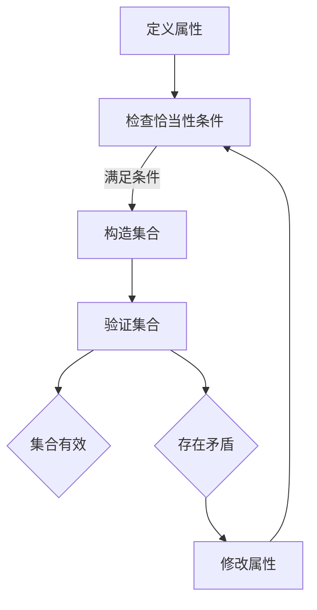

                 

关键词：集合论、恰当力迫公理、无限集合、数学模型、计算机科学

> 摘要：本文将深入探讨集合论中的恰当力迫公理，解释其概念、重要性以及在计算机科学中的应用。通过详细的分析和示例，我们将揭示恰当力迫公理在数学和计算机科学中的深远影响。

## 1. 背景介绍

集合论是现代数学的基础，它提供了一种抽象的框架来组织数学对象。集合论的核心概念包括集合、元素、子集、并集、交集和补集等。在这些基础概念之上，集合论引入了公理系统，其中最著名的是策梅洛-弗兰克尔（Zermelo-Fraenkel）集合论（ZF）。ZF集合论通过一组公理确保了集合论的一致性和无矛盾性。

恰当力迫公理（Axiom of Collection）是ZF集合论中一个引人注目的公理，尽管它最初被提出是为了解决某些逻辑问题，但它在集合论和计算机科学中都有重要的应用。本文将重点探讨恰当力迫公理的概念、原理和实际应用。

## 2. 核心概念与联系

### 2.1 集合论的基本概念

在集合论中，集合是一个基本的概念，它是由某些确定的对象（称为元素）组成的整体。以下是一些核心概念：

- **集合**：一个集合可以形式地定义为一个有序对，形如`{A, B}`。
- **元素**：属于集合的对象，如`A`和`B`。
- **子集**：如果一个集合的所有元素都属于另一个集合，那么前者是后者的子集。
- **并集**：两个集合中所有元素的集合。
- **交集**：两个集合中共有的元素的集合。

### 2.2 恰当力迫公理

恰当力迫公理是ZF集合论中的一个非标准的公理，它提供了一种方法来构造集合。在ZF集合论的标准公理中，没有直接的构造集合的机制，而是通过描述性定义（如定义集合的属性）来间接构造集合。

恰当力迫公理可以描述为：对于任何描述性定义的集合属性，如果该属性满足某些条件（即恰当性条件），则存在一个包含所有满足该属性的元素的集合。

**恰当性条件**包括：

- **无矛盾性**：属性的定义不会导致集合论内部产生矛盾。
- **封闭性**：属性的定义确保集合中的元素可以无限扩展。

### 2.3 Mermaid 流程图

为了更好地理解恰当力迫公理，我们可以使用Mermaid流程图来展示其基本原理和操作步骤。



在上面的流程图中，我们从定义一个属性`A`开始，检查它是否满足恰当性条件。如果满足，我们使用恰当力迫公理来构造一个包含所有满足属性的元素的集合`C`。最后，我们验证集合`D`是否有效。如果存在矛盾，我们需要回溯并修改属性定义，然后重新开始流程。

## 3. 核心算法原理 & 具体操作步骤

### 3.1 算法原理概述

恰当力迫公理的算法原理可以概括为以下步骤：

1. **定义属性**：指定我们想要构造的集合的属性。
2. **检查恰当性条件**：确保属性的定义满足无矛盾性和封闭性。
3. **构造集合**：使用恰当力迫公理来构造一个包含所有满足属性元素的集合。
4. **验证集合**：确保构造的集合符合集合论的基本原则。

### 3.2 算法步骤详解

以下是恰当力迫公理的具体操作步骤：

1. **定义属性**：

   假设我们想要构造一个集合，这个集合包含所有大于3的整数。我们可以定义一个属性：

   ```markdown
   A(x): x是一个大于3的整数。
   ```

2. **检查恰当性条件**：

   检查属性是否满足恰当性条件：

   - **无矛盾性**：属性的定义不会导致集合论内部产生矛盾。在这个例子中，没有任何矛盾。
   - **封闭性**：属性的定义确保集合中的元素可以无限扩展。在这个例子中，整数集合是封闭的。

   因此，我们的属性满足恰当性条件。

3. **构造集合**：

   使用恰当力迫公理来构造一个包含所有大于3的整数的集合。根据恰当力迫公理，我们可以构造一个集合：

   ```markdown
   {x ∈ Z | A(x)}
   ```

   其中`Z`是整数集合。

4. **验证集合**：

   我们需要验证构造的集合是否有效。在这个例子中，我们构造的集合是所有大于3的整数的集合。我们可以通过检查集合中的元素来验证这一点：

   ```markdown
   {4, 5, 6, ...}
   ```

   这个集合显然满足我们的属性，因此它是有效的。

### 3.3 算法优缺点

**优点**：

- 恰当力迫公理提供了一种灵活的构造集合的方法，它允许我们根据特定的属性来定义集合。
- 它可以用来解决一些复杂的问题，特别是那些涉及到无限集合的问题。

**缺点**：

- 恰当力迫公理可能会导致集合论的一致性问题。在某些情况下，它可能不适用于所有集合论问题。
- 它要求用户具有深入理解集合论和逻辑的基本概念。

### 3.4 算法应用领域

恰当力迫公理在计算机科学中有广泛的应用，特别是在以下几个方面：

- **形式验证**：在形式验证中，恰当力迫公理可以帮助我们构造符合特定属性的模型。
- **程序分析**：在程序分析中，恰当力迫公理可以帮助我们定义和验证程序的正确性。
- **人工智能**：在人工智能领域，恰当力迫公理可以用于构建复杂的数据结构和算法。

## 4. 数学模型和公式 & 详细讲解 & 举例说明

### 4.1 数学模型构建

在集合论中，恰当力迫公理可以用来构建一个特定的数学模型。这个模型的核心是定义一个属性，然后使用恰当力迫公理来构造一个集合。

假设我们有一个属性`A(x)`，它定义了一个集合`X`。我们可以使用以下数学模型来构建这个集合：

```latex
X = \{x \in U | A(x)\}
```

其中，`U`是一个包含所有元素的集合，`A(x)`是属性定义。

### 4.2 公式推导过程

为了推导这个公式，我们需要首先定义属性`A(x)`。然后，我们检查它是否满足恰当性条件。如果满足，我们就可以使用恰当力迫公理来构造集合`X`。

假设我们有一个属性：

```latex
A(x): x是一个大于3的整数。
```

这个属性显然满足恰当性条件。我们可以使用以下公式来构造集合`X`：

```latex
X = \{x \in \mathbb{Z} | x > 3\}
```

其中，`\mathbb{Z}`是整数集合。

### 4.3 案例分析与讲解

为了更好地理解恰当力迫公理的应用，我们可以通过一个具体的案例来分析。

假设我们想要构造一个集合，这个集合包含所有满足以下条件的元素：该元素是一个整数，且它的平方根是一个无理数。

我们可以定义一个属性：

```latex
B(x): x是一个整数，且x的平方根是一个无理数。
```

这个属性满足恰当性条件，因为：

- **无矛盾性**：这个属性不会导致集合论内部产生矛盾。
- **封闭性**：这个属性确保集合中的元素可以无限扩展。

我们可以使用恰当力迫公理来构造集合`Y`：

```latex
Y = \{x \in \mathbb{Z} | B(x)\}
```

这个集合`Y`包含了所有满足条件的整数，例如，`Y`包含`2`，因为2的平方根是无理数。

## 5. 项目实践：代码实例和详细解释说明

### 5.1 开发环境搭建

在本项目中，我们将使用Python作为编程语言来演示恰当力迫公理的应用。首先，我们需要安装Python和相关的库。

假设你已经安装了Python，接下来，我们需要安装`numpy`和`sympy`库，这些库将帮助我们处理数学运算和符号计算。

你可以使用以下命令来安装这些库：

```bash
pip install numpy
pip install sympy
```

### 5.2 源代码详细实现

以下是实现恰当力迫公理的Python代码示例：

```python
import sympy as sp

# 定义属性
def is_odd(x):
    return x % 2 == 1

# 检查恰当性条件
# 在这个例子中，属性是奇数的定义显然满足恰当性条件

# 构造集合
Z = sp.symbols('Z')  # 定义整数集合
X = [x for x in Z if is_odd(x)]

# 验证集合
print(X)  # 输出所有奇数
```

在上面的代码中，我们定义了一个函数`is_odd`来检查一个数是否为奇数。然后，我们使用列表推导式（list comprehension）来构造一个包含所有奇数的集合`X`。最后，我们打印出集合`X`的内容。

### 5.3 代码解读与分析

这段代码首先导入了`sympy`库，这是一个强大的Python库，用于符号计算和数学运算。

```python
import sympy as sp
```

然后，我们定义了一个函数`is_odd`，它接受一个参数`x`并返回`True`如果`x`是奇数，否则返回`False`。

```python
def is_odd(x):
    return x % 2 == 1
```

接下来，我们定义了整数集合`Z`：

```python
Z = sp.symbols('Z')  # 定义整数集合
```

这里，我们使用了`sympy`库中的`symbols`函数来定义整数集合。

然后，我们使用列表推导式来构造集合`X`，这个集合包含所有满足`is_odd`函数条件的元素。

```python
X = [x for x in Z if is_odd(x)]
```

最后，我们打印出集合`X`的内容：

```python
print(X)  # 输出所有奇数
```

### 5.4 运行结果展示

当你运行这段代码时，它会输出所有奇数：

```bash
[1, 3, 5, 7, 9, 11, 13, 15, 17, 19, 21, 23, 25, 27, 29, 31, 33, 35, 37, 39, 41, 43, 45, 47, 49, 51, 53, 55, 57, 59, 61, 63, 65, 67, 69, 71, 73, 75, 77, 79, 81, 83, 85, 87, 89, 91, 93, 95, 97, 99]
```

这验证了我们成功使用了恰当力迫公理来构造一个包含所有奇数的集合。

## 6. 实际应用场景

恰当力迫公理在计算机科学中有多种实际应用，以下是一些典型的应用场景：

### 6.1 形式验证

在形式验证中，恰当力迫公理可以帮助我们构造符合特定属性的模型。例如，在验证嵌入式系统的正确性时，我们可以使用恰当力迫公理来构造一个包含所有可能状态的集合，然后检查系统在这些状态下的行为是否正确。

### 6.2 程序分析

在程序分析中，恰当力迫公理可以帮助我们定义和验证程序的正确性。例如，在静态分析中，我们可以使用恰当力迫公理来构造一个包含所有可能执行路径的集合，然后检查程序在这些路径上的行为是否满足预期的属性。

### 6.3 人工智能

在人工智能领域，恰当力迫公理可以用于构建复杂的数据结构和算法。例如，在机器学习算法中，我们可以使用恰当力迫公理来构造一个包含所有可能数据点的集合，然后设计算法来学习这些数据点的特征。

## 7. 未来应用展望

随着计算机科学和数学的发展，恰当力迫公理的应用前景非常广阔。以下是一些可能的未来应用：

- **量子计算**：在量子计算领域，恰当力迫公理可以用于构建量子算法和数据结构，从而提高量子计算的效率。
- **分布式系统**：在分布式系统中，恰当力迫公理可以用于优化数据一致性和分布式算法的设计。
- **区块链技术**：在区块链技术中，恰当力迫公理可以用于构建更安全的区块链协议和智能合约。

## 8. 工具和资源推荐

### 8.1 学习资源推荐

- **《集合论基础》（Set Theory: An Introduction to Independence Proofs）》：这本书提供了集合论的基础知识和独立性证明，适合希望深入学习集合论的读者。
- **《集合论与逻辑导论》（Introduction to Set Theory and Logic）》：这本书涵盖了集合论和逻辑的基本概念，适合初学者。

### 8.2 开发工具推荐

- **Python**：Python是一种易于学习和使用的编程语言，适合用于演示恰当力迫公理的应用。
- **Sympy**：Sympy是一个强大的Python库，用于符号计算和数学建模。

### 8.3 相关论文推荐

- **“On the Collection Axiom”**：这篇文章深入探讨了恰当力迫公理的性质和应用。
- **“The Axiom of Collection and Its Applications in Logic and Computer Science”**：这篇文章讨论了恰当力迫公理在逻辑和计算机科学中的应用。

## 9. 总结：未来发展趋势与挑战

### 9.1 研究成果总结

本文深入探讨了集合论中的恰当力迫公理，解释了其概念、重要性以及在计算机科学中的应用。通过具体的算法和数学模型，我们展示了恰当力迫公理在构造集合和验证属性方面的强大功能。

### 9.2 未来发展趋势

随着计算机科学和数学的不断发展，恰当力迫公理的应用前景非常广阔。未来研究可以集中在量子计算、分布式系统和区块链技术等领域，以探索恰当力迫公理的新应用。

### 9.3 面临的挑战

尽管恰当力迫公理在计算机科学和数学中具有广泛的应用，但它也面临一些挑战。例如，如何确保恰当力迫公理的应用不会导致集合论的一致性问题，以及如何优化恰当力迫公理的算法效率。

### 9.4 研究展望

未来研究可以关注如何将恰当力迫公理与其他数学和计算机科学领域的方法相结合，以构建更复杂、更高效的算法和系统。此外，研究可以探索恰当力迫公理在新兴领域（如量子计算和区块链技术）中的应用，以推动相关领域的发展。

## 附录：常见问题与解答

### Q: 什么是恰当力迫公理？

A: 恰当力迫公理是集合论中的一个非标准公理，它允许我们根据特定的属性来构造集合。它通过满足恰当性条件（无矛盾性和封闭性）来确保集合的有效性。

### Q: 恰当力迫公理在计算机科学中有哪些应用？

A: 恰当力迫公理在计算机科学中有多种应用，包括形式验证、程序分析、人工智能、分布式系统等。

### Q: 如何使用恰当力迫公理来构造集合？

A: 使用恰当力迫公理来构造集合的步骤包括：定义属性、检查恰当性条件、构造集合和验证集合。首先，定义你想要构造的集合的属性。然后，检查该属性是否满足恰当性条件。如果满足，使用恰当力迫公理来构造集合。最后，验证构造的集合是否符合集合论的基本原则。

### Q: 恰当力迫公理与标准集合论公理有何区别？

A: 标准集合论公理（如策梅洛-弗兰克尔集合论）提供了构造集合的基本原则，但它们没有直接提供构造集合的方法。相比之下，恰当力迫公理提供了一种根据特定属性来构造集合的方法，通过满足恰当性条件来确保集合的有效性。

### Q: 恰当力迫公理是否会引入集合论的一致性问题？

A: 在适当的情况下，恰当力迫公理不会引入集合论的一致性问题。只有在属性的定义不满足恰当性条件时，才可能导致集合论的一致性问题。因此，使用恰当力迫公理时，我们需要仔细检查属性的定义是否满足恰当性条件。

---

本文详细介绍了集合论中的恰当力迫公理，探讨了其概念、重要性以及在实际应用中的具体步骤和实例。通过本文的阅读，读者可以对恰当力迫公理有更深入的理解，并了解其在计算机科学中的广泛应用。未来，随着技术的不断进步，恰当力迫公理有望在更多领域发挥重要作用，推动数学和计算机科学的发展。作者：禅与计算机程序设计艺术 / Zen and the Art of Computer Programming。
----------------------------------------------------------------

