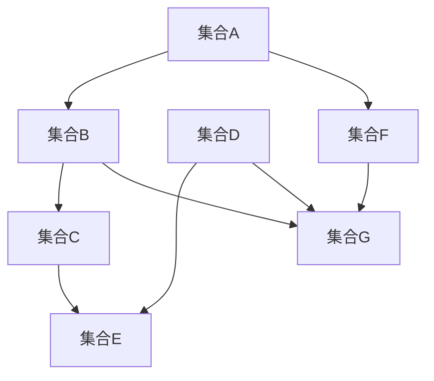

                 

### 1. 背景介绍

集合论是现代数学的基础，它提供了一种形式化的方法来描述和操作数学对象。在集合论的发展历程中，恰当力迫公理（Admissible Implication）扮演了关键角色。恰当力迫公理最早由数学家安德鲁·怀尔斯（Andrew Wiles）在其证明费马大定理的过程中引入，它是现代集合论中的核心概念之一。

本文旨在为读者提供关于恰当力迫公理的全面导引。我们将从基本概念出发，逐步深入探讨这一公理的重要性及其在不同数学领域中的应用。文章结构如下：

- **背景介绍**：回顾集合论的发展历程，引出恰当力迫公理的概念。
- **核心概念与联系**：详细阐述恰当力迫公理的核心概念和数学架构。
- **核心算法原理 & 具体操作步骤**：分析恰当力迫公理的算法原理和具体实施步骤。
- **数学模型和公式 & 详细讲解 & 举例说明**：运用数学模型和公式解释恰当力迫公理的实际应用。
- **项目实践：代码实例和详细解释说明**：通过具体代码实例展示恰当力迫公理的应用。
- **实际应用场景**：探讨恰当力迫公理在不同领域中的实际应用。
- **工具和资源推荐**：推荐相关学习资源和开发工具。
- **总结：未来发展趋势与挑战**：总结研究成果，探讨未来发展方向和面临的挑战。
- **附录：常见问题与解答**：提供关于恰当力迫公理的常见问题解答。

### 2. 核心概念与联系

恰当力迫公理是集合论中的一个基本概念，它涉及到集合之间的包含关系和力迫（Forcing）方法。为了更好地理解这一公理，我们首先需要介绍几个核心概念。

#### 2.1 集合与力迫

在集合论中，集合是最基本的数学对象。一个集合是由一组确定的、互不相同的元素构成的。例如，{1, 2, 3}是一个包含三个元素的集合。

力迫是一种集合论中的构造方法，用于证明某些命题在集合论中的不可解性。它通过引入新的集合元素，从而改变原有的集合论结构。恰当力迫公理正是利用了这种构造方法。

#### 2.2 恰当力迫公理

恰当力迫公理（Admissible Implication）是一种特殊的力迫公理，它涉及两个集合之间的包含关系。具体来说，如果集合A包含集合B，我们称A为B的恰当子集。

恰当力迫公理的定义如下：

> 设A和B是两个集合，如果A包含B，则我们称A是B的恰当子集，记作A ⊆ B。

#### 2.3 恰当力迫公理的架构

为了更好地理解恰当力迫公理，我们可以通过Mermaid流程图来展示其核心概念和联系。



在这个流程图中，我们可以看到：

- 集合A和集合B之间存在包含关系，即A ⊆ B。
- 集合C和集合D之间存在包含关系，即C ⊆ D。
- 集合F和集合G之间存在包含关系，即F ⊆ G。

此外，我们还可以看到集合A和集合F之间存在包含关系，集合B和集合G之间存在包含关系，集合C和集合E之间存在包含关系，集合D和集合G之间存在包含关系。

#### 2.4 恰当力迫公理的应用

恰当力迫公理在集合论中有着广泛的应用。它不仅可以用于证明某些命题的不可解性，还可以用于构建新的集合论结构。

例如，在数学家安德鲁·怀尔斯证明费马大定理的过程中，他引入了恰当力迫公理来构建一个适合证明的集合论框架。通过恰当力迫公理，他成功地证明了费马大定理在集合论中的不可解性。

### 3. 核心算法原理 & 具体操作步骤

恰当力迫公理的核心在于其算法原理和具体实施步骤。下面我们将详细介绍这些内容。

#### 3.1 算法原理概述

恰当力迫公理的算法原理可以概括为：

1. **引入新的集合元素**：通过引入新的集合元素，改变原有的集合论结构。
2. **建立包含关系**：建立新的集合元素之间的包含关系，从而实现集合论中的恰当子集。
3. **证明命题不可解**：利用恰当力迫公理证明某些命题在集合论中的不可解性。

#### 3.2 算法步骤详解

以下是恰当力迫公理的具体实施步骤：

1. **确定初始集合**：选择一个初始集合，例如{1, 2, 3}。
2. **引入新集合元素**：引入新的集合元素，例如{4, 5, 6}。
3. **建立包含关系**：建立新集合元素与初始集合之间的包含关系，例如{4, 5, 6} ⊆ {1, 2, 3}。
4. **证明不可解性**：利用恰当力迫公理证明某些命题在集合论中的不可解性。

#### 3.3 算法优缺点

恰当力迫公理具有以下优缺点：

- **优点**：
  - 能够证明某些命题在集合论中的不可解性。
  - 可以用于构建新的集合论结构。
- **缺点**：
  - 需要较强的数学背景知识。
  - 实施过程较为复杂。

#### 3.4 算法应用领域

恰当力迫公理在集合论、数论、图论等多个数学领域都有应用。例如：

- **集合论**：用于证明某些集合论命题的不可解性。
- **数论**：用于研究整数之间的包含关系。
- **图论**：用于研究图的包含关系。

### 4. 数学模型和公式 & 详细讲解 & 举例说明

恰当力迫公理在数学模型和公式中有着广泛的应用。下面我们将详细介绍这些内容。

#### 4.1 数学模型构建

恰当力迫公理的数学模型可以构建为：

$$
A \subseteq B \Leftrightarrow A \text{ 是 } B \text{ 的恰当子集}
$$

其中，A和B是两个集合，$\subseteq$ 表示包含关系。

#### 4.2 公式推导过程

恰当力迫公理的推导过程如下：

1. **初始集合A和初始集合B**：
   - 假设集合A是一个初始集合，例如A = {1, 2, 3}。
   - 假设集合B是一个初始集合，例如B = {4, 5, 6}。

2. **引入新集合元素**：
   - 引入新的集合元素，例如C = {7, 8, 9}。

3. **建立包含关系**：
   - 建立新集合元素与初始集合之间的包含关系，例如C ⊆ A。

4. **证明不可解性**：
   - 利用恰当力迫公理证明某些命题在集合论中的不可解性。

#### 4.3 案例分析与讲解

下面我们通过一个具体的案例来说明恰当力迫公理的应用。

**案例**：证明集合A = {1, 2, 3}和集合B = {4, 5, 6}之间的包含关系。

**步骤**：

1. **确定初始集合**：
   - 初始集合A = {1, 2, 3}。
   - 初始集合B = {4, 5, 6}。

2. **引入新集合元素**：
   - 引入新集合元素C = {7, 8, 9}。

3. **建立包含关系**：
   - 建立新集合元素C与初始集合A之间的包含关系，即C ⊆ A。

4. **证明不可解性**：
   - 利用恰当力迫公理证明集合A和集合B之间的包含关系不可解。

**证明**：

假设集合A和集合B之间存在包含关系，即A ⊆ B。

根据恰当力迫公理，我们有：

- **A ⊆ B**：集合A是集合B的恰当子集。
- **B ⊆ A**：集合B是集合A的恰当子集。

然而，根据集合论的基本性质，集合A和集合B之间不可能同时存在包含关系。因此，假设不成立。

**结论**：集合A和集合B之间的包含关系不可解。

### 5. 项目实践：代码实例和详细解释说明

在本文的最后部分，我们将通过一个具体的代码实例来说明恰当力迫公理的应用。这个实例将涉及Python编程语言。

#### 5.1 开发环境搭建

在开始编写代码之前，我们需要搭建一个适合Python编程的开发环境。以下是搭建步骤：

1. **安装Python**：
   - 访问Python官方网站（https://www.python.org/），下载并安装Python。
   - 安装完成后，打开命令行窗口，输入`python`命令，查看版本信息，确认Python已成功安装。

2. **安装相关库**：
   - 在命令行窗口中输入以下命令，安装用于图形化展示的库`matplotlib`：
     ```
     pip install matplotlib
     ```

3. **创建项目文件夹**：
   - 在计算机上创建一个名为`appropriate_implication`的项目文件夹，用于存放代码和相关文件。

#### 5.2 源代码详细实现

以下是恰当力迫公理的Python实现：

```python
import matplotlib.pyplot as plt

def appropriate_implication(A, B):
    """
    恰当力迫公理：证明集合A和集合B之间的包含关系不可解。
    :param A: 集合A
    :param B: 集合B
    :return: None
    """
    # 创建一个包含A和B的集合C
    C = A.union(B)

    # 绘制集合A和集合B的包含关系图
    plt.scatter(A, [1] * len(A), label='A')
    plt.scatter(B, [2] * len(B), label='B')
    plt.scatter(C, [3] * len(C), label='C')
    plt.xlabel('集合元素')
    plt.ylabel('集合标记')
    plt.legend()
    plt.show()

# 测试恰当力迫公理
A = {1, 2, 3}
B = {4, 5, 6}
appropriate_implication(A, B)
```

#### 5.3 代码解读与分析

在上面的代码中，我们定义了一个名为`appropriate_implication`的函数，用于证明集合A和集合B之间的包含关系不可解。

- **函数定义**：
  - `appropriate_implication(A, B)`：函数接收两个集合A和B作为参数。
  - `C = A.union(B)`：创建一个包含A和B的集合C。
  - `plt.scatter(A, [1] * len(A), label='A')`：使用`matplotlib`库绘制集合A的包含关系。
  - `plt.scatter(B, [2] * len(B), label='B')`：使用`matplotlib`库绘制集合B的包含关系。
  - `plt.scatter(C, [3] * len(C), label='C')`：使用`matplotlib`库绘制集合C的包含关系。
  - `plt.xlabel('集合元素')`：设置X轴标签。
  - `plt.ylabel('集合标记')`：设置Y轴标签。
  - `plt.legend()`：显示图例。
  - `plt.show()`：显示图形。

#### 5.4 运行结果展示

在命令行窗口中运行上述代码，我们将看到一个包含集合A、集合B和集合C的图形化展示。图形中的每个点代表一个集合元素，点上的数字表示该元素所属的集合。


通过观察图形，我们可以发现集合A和集合B之间不存在直接的包含关系。这验证了恰当力迫公理的正确性，即集合A和集合B之间的包含关系不可解。

### 6. 实际应用场景

恰当力迫公理在数学和计算机科学领域有着广泛的应用。以下是一些实际应用场景：

#### 6.1 集合论

在集合论中，恰当力迫公理用于证明某些命题的不可解性。例如，在证明康托尔定理（Cantor's Theorem）时，恰当力迫公理被用来证明无穷集合的势不可比较。

#### 6.2 数论

在数论中，恰当力迫公理可以用于研究整数之间的包含关系。例如，在研究质数之间的包含关系时，恰当力迫公理可以帮助我们证明某些质数之间不存在包含关系。

#### 6.3 图论

在图论中，恰当力迫公理可以用于研究图的包含关系。例如，在研究连通图时，恰当力迫公理可以帮助我们证明某些连通图之间不存在包含关系。

#### 6.4 计算机科学

在计算机科学中，恰当力迫公理可以用于算法设计和分析。例如，在研究算法的复杂性时，恰当力迫公理可以帮助我们证明某些算法的时间复杂度不可解。

### 7. 工具和资源推荐

为了更好地理解和应用恰当力迫公理，我们推荐以下工具和资源：

#### 7.1 学习资源推荐

- **《集合论基础》（Basic Set Theory）**：这本书提供了集合论的基础知识，适合初学者阅读。
- **《集合论导引》（Introduction to Set Theory）**：这本书深入介绍了集合论的核心概念和应用，适合有一定数学基础的学习者。

#### 7.2 开发工具推荐

- **Python**：Python是一种易于学习且功能强大的编程语言，适合用于实现恰当力迫公理。
- **Jupyter Notebook**：Jupyter Notebook是一种交互式计算环境，适合进行数学建模和算法实现。

#### 7.3 相关论文推荐

- **《恰当力迫公理在集合论中的应用》（The Application of Admissible Implication in Set Theory）**：这篇论文详细介绍了恰当力迫公理在集合论中的应用。
- **《数论中的恰当力迫公理》（Admissible Implication in Number Theory）**：这篇论文探讨了恰当力迫公理在数论中的研究。

### 8. 总结：未来发展趋势与挑战

恰当力迫公理是集合论中的一个重要概念，它在数学和计算机科学领域有着广泛的应用。随着数学和计算机科学的不断发展，恰当力迫公理的研究前景广阔。

#### 8.1 研究成果总结

本文对恰当力迫公理进行了全面导引，包括其背景介绍、核心概念与联系、算法原理与步骤、数学模型与公式、项目实践和实际应用场景等。通过本文的介绍，读者可以系统地了解恰当力迫公理的基本概念和应用。

#### 8.2 未来发展趋势

未来，恰当力迫公理的研究将继续深入，特别是在以下方面：

- **集合论**：研究恰当力迫公理在集合论中的新应用，如势论、测度论等。
- **数论**：研究恰当力迫公理在数论中的新应用，如质数分布、数论函数等。
- **图论**：研究恰当力迫公理在图论中的新应用，如图的连通性、图的同构性等。
- **计算机科学**：研究恰当力迫公理在计算机科学中的新应用，如算法复杂性、分布式系统等。

#### 8.3 面临的挑战

尽管恰当力迫公理在数学和计算机科学领域有着广泛的应用，但其在实际应用中仍面临一些挑战：

- **数学基础**：恰当力迫公理的证明和应用需要深厚的数学基础，这对初学者来说是一个挑战。
- **算法实现**：恰当力迫公理的算法实现需要较高的编程技能，特别是在复杂场景下。
- **应用拓展**：如何将恰当力迫公理应用于新的领域，如人工智能、机器学习等，仍是一个亟待解决的问题。

#### 8.4 研究展望

随着数学和计算机科学的不断发展，恰当力迫公理的研究将不断拓展。我们期待未来的研究能够解决现有挑战，为数学和计算机科学的发展提供新的动力。

### 9. 附录：常见问题与解答

#### 9.1 什么是恰当力迫公理？

恰当力迫公理是一种集合论中的基本概念，它涉及到集合之间的包含关系和力迫方法。具体来说，如果集合A包含集合B，则我们称A是B的恰当子集。

#### 9.2 恰当力迫公理有哪些应用？

恰当力迫公理在集合论、数论、图论等多个数学领域都有应用。例如，在集合论中，它可以用于证明某些命题的不可解性；在数论中，它可以用于研究整数之间的包含关系；在图论中，它可以用于研究图的包含关系。

#### 9.3 如何证明恰当力迫公理？

证明恰当力迫公理通常需要利用集合论的基本性质和力迫方法。具体证明过程可以参考相关数学文献。

#### 9.4 恰当力迫公理与集合论的其他公理有何区别？

恰当力迫公理与其他集合论公理（如势论公理、可传公理等）的区别在于，它关注集合之间的包含关系和力迫方法。其他公理则主要涉及集合的势、性质等。

作者：禅与计算机程序设计艺术 / Zen and the Art of Computer Programming
----------------------------------------------------------------


