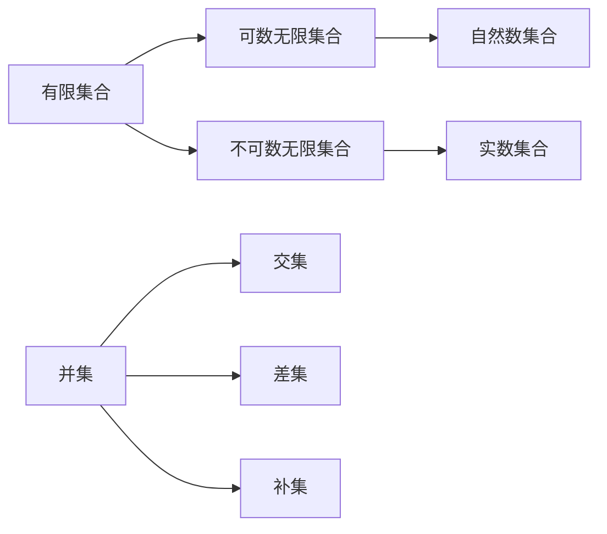

                 

关键词：集合论、有限集合、无限集合、集合运算、基数、集合论原理、集合论应用。

> 摘要：本文旨在为读者提供一个深入浅出的集合论导引，重点探讨有限集合与无限集合的基本概念、运算原理及其在实际应用中的重要性。通过详细解析集合论的基本原理和数学模型，结合具体的代码实例，本文将帮助读者更好地理解和掌握集合论在计算机科学中的核心作用。

## 1. 背景介绍

集合论是现代数学的基石，其基本概念和方法广泛应用于各个领域，包括计算机科学、经济学、逻辑学等。集合论的基本思想是通过描述一组对象的集合来研究这些对象的性质和关系。有限集合与无限集合是集合论中最基础的概念之一，它们不仅具有数学上的重要性，还在计算机科学中发挥着关键作用。

在计算机科学中，集合论被广泛应用于算法设计、数据结构、形式语言和编译原理等各个方面。例如，在算法设计中，集合运算（如并集、交集、差集等）是构建复杂算法的基础；在数据结构中，集合数据类型和集合操作是设计高效数据管理系统的核心；在形式语言和编译原理中，集合论用于描述和验证程序的正确性。

本文将首先介绍有限集合与无限集合的基本概念，然后探讨集合运算的原理和应用，最后通过具体实例展示集合论在计算机科学中的实际应用。希望通过本文的讲解，读者能够深入理解集合论的核心原理，并能够将其应用于实际问题中。

## 2. 核心概念与联系

### 2.1 有限集合与无限集合的定义

**有限集合**是指包含确定数量的元素的集合。形式上，有限集合可以表示为 $A = \{a_1, a_2, a_3, ..., a_n\}$，其中 $n$ 是一个非负整数，表示集合中的元素个数。

**无限集合**是指包含无限多个元素的集合。无限集合的概念更为复杂，可以分为可数无限集合和不可数无限集合。可数无限集合是指集合中的元素可以与自然数集合建立一一对应关系，例如自然数集合 $\mathbb{N}$ 和整数集合 $\mathbb{Z}$。不可数无限集合则无法与自然数集合建立一一对应关系，实数集合 $\mathbb{R}$ 就是一个典型的不可数无限集合。

### 2.2 集合运算的基本原理

集合运算主要包括并集、交集、差集和补集等。

- **并集**：给定两个集合 $A$ 和 $B$，它们的并集是由所有属于 $A$ 或属于 $B$ 的元素组成的集合，表示为 $A \cup B$。
- **交集**：给定两个集合 $A$ 和 $B$，它们的交集是由所有既属于 $A$ 又属于 $B$ 的元素组成的集合，表示为 $A \cap B$。
- **差集**：给定两个集合 $A$ 和 $B$，它们的差集是由所有属于 $A$ 但不属于 $B$ 的元素组成的集合，表示为 $A - B$ 或 $A \setminus B$。
- **补集**：给定一个集合 $A$ 和一个全集 $U$，$A$ 的补集是由所有属于 $U$ 但不属于 $A$ 的元素组成的集合，表示为 $A'$ 或 $U - A$。

### 2.3 集合论的 Mermaid 流程图

以下是一个简单的 Mermaid 流程图，展示有限集合与无限集合之间的基本关系以及集合运算的流程。



### 2.4 集合论的基本原理与架构

集合论的基本原理包括集合的确定性、互异性、无序性和扩展性。确定性意味着集合中的元素是唯一确定的，互异性要求集合中的元素不重复，无序性表示集合中的元素不考虑排列顺序，扩展性允许集合在原有基础上进行扩展。

集合论的基本架构包括集合的构造、集合之间的关系、集合运算以及集合的性质。这些架构不仅为数学研究提供了基础，也为计算机科学中的算法设计和数据结构提供了理论支持。

## 3. 核心算法原理 & 具体操作步骤

### 3.1 算法原理概述

在计算机科学中，集合运算的算法设计是一个重要的研究领域。常见的集合运算算法包括并集、交集、差集和补集等。这些算法的原理基于集合论的基本原理，通过数学运算和计算机程序设计实现。

并集算法：给定两个集合 $A$ 和 $B$，算法实现合并集合 $A$ 和 $B$ 的元素，生成一个新的集合 $C$。交集算法：给定两个集合 $A$ 和 $B$，算法实现找出集合 $A$ 和 $B$ 中共同存在的元素，生成一个新的集合 $D$。差集算法：给定两个集合 $A$ 和 $B$，算法实现找出集合 $A$ 中存在但集合 $B$ 中不存在的元素，生成一个新的集合 $E$。补集算法：给定一个集合 $A$ 和一个全集 $U$，算法实现找出集合 $A$ 的补集，即所有在全集 $U$ 中但不在集合 $A$ 中的元素。

### 3.2 算法步骤详解

并集算法的步骤：
1. 初始化一个空集合 $C$。
2. 遍历集合 $A$ 中的每个元素，将其添加到集合 $C$ 中。
3. 遍历集合 $B$ 中的每个元素，如果该元素不在集合 $C$ 中，将其添加到集合 $C$ 中。
4. 返回集合 $C$。

交集算法的步骤：
1. 初始化一个空集合 $D$。
2. 遍历集合 $A$ 中的每个元素，如果该元素也在集合 $B$ 中，将其添加到集合 $D$ 中。
3. 返回集合 $D$。

差集算法的步骤：
1. 初始化一个空集合 $E$。
2. 遍历集合 $A$ 中的每个元素，如果该元素不在集合 $B$ 中，将其添加到集合 $E$ 中。
3. 返回集合 $E$。

补集算法的步骤：
1. 初始化一个空集合 $F$。
2. 遍历全集 $U$ 中的每个元素，如果该元素不在集合 $A$ 中，将其添加到集合 $F$ 中。
3. 返回集合 $F$。

### 3.3 算法优缺点

并集算法的优点是简单易实现，时间复杂度为 $O(m+n)$，其中 $m$ 和 $n$ 分别表示集合 $A$ 和 $B$ 的大小。缺点是如果集合 $A$ 和 $B$ 较大，会导致内存占用增加。

交集算法的优点是时间复杂度较低，为 $O(min(m, n))$。缺点是如果集合 $A$ 和 $B$ 的大小差距较大，算法效率会受到影响。

差集算法的优点与并集算法类似，简单易实现，时间复杂度为 $O(m+n)$。缺点同样在于内存占用增加。

补集算法的优点是时间复杂度较低，为 $O(n)$。缺点是如果全集 $U$ 较大，会导致内存占用增加。

### 3.4 算法应用领域

集合运算算法在计算机科学中具有广泛的应用，主要包括以下几个方面：

1. **算法设计与分析**：集合运算算法是算法设计中的重要工具，用于解决各种计算问题，如图算法、排序算法等。
2. **数据结构**：集合运算算法是设计高效数据结构的基础，如哈希表、二叉树、平衡树等。
3. **形式语言与编译原理**：集合运算算法用于描述和验证程序的正确性，如形式验证、代码生成等。
4. **人工智能与机器学习**：集合运算算法在特征提取、分类、聚类等任务中发挥着关键作用。

## 4. 数学模型和公式 & 详细讲解 & 举例说明

### 4.1 数学模型构建

集合论的数学模型基于集合的基本概念和运算原理。核心数学模型包括集合的表示、集合运算、集合的性质和集合之间的联系。

1. **集合表示**：集合可以使用枚举法、描述法、集合符号表示。枚举法通过列举集合中的所有元素表示集合；描述法通过描述集合中元素的性质表示集合；集合符号表示使用特定的符号表示集合，如 $\{x | x \in \mathbb{N}\}$ 表示自然数集合。
2. **集合运算**：并集、交集、差集和补集是集合运算的核心。并集表示集合中的所有元素；交集表示集合中的共同元素；差集表示集合中的不同元素；补集表示集合的外部元素。
3. **集合性质**：集合具有确定性、互异性、无序性和扩展性。确定性表示集合中的元素是唯一确定的；互异性表示集合中的元素不重复；无序性表示集合中的元素不考虑排列顺序；扩展性表示集合在原有基础上可以扩展。
4. **集合联系**：集合之间通过集合运算和集合性质相互联系，如并集、交集、差集和补集的关系。

### 4.2 公式推导过程

集合论的数学公式基于集合的基本概念和运算原理。以下是几个典型的集合论公式的推导过程：

1. **德摩根定律**：$A' \cap B' = (A \cup B)'$
   - 证明：根据集合的补集定义，$A' \cap B'$ 表示所有既属于 $A$ 的补集又属于 $B$ 的补集的元素。根据集合的并集定义，$(A \cup B)'$ 表示所有既属于 $A$ 又属于 $B$ 的元素的补集。显然，两者是等价的。

2. **交换律**：$A \cup B = B \cup A$，$A \cap B = B \cap A$
   - 证明：根据集合的并集和交集定义，集合的元素顺序不影响并集和交集的结果。

3. **结合律**：$A \cup (B \cup C) = (A \cup B) \cup C$，$A \cap (B \cap C) = (A \cap B) \cap C$
   - 证明：根据集合的并集和交集定义，集合的运算顺序不影响并集和交集的结果。

### 4.3 案例分析与讲解

以下是一个简单的集合论案例分析，展示集合论在实际问题中的应用。

**案例：给定两个集合 $A = \{1, 2, 3\}$ 和 $B = \{3, 4, 5\}$，求 $A$ 和 $B$ 的并集、交集、差集和补集。**

1. **并集**：$A \cup B = \{1, 2, 3, 4, 5\}$。并集包含集合 $A$ 和 $B$ 中的所有元素，不重复。
2. **交集**：$A \cap B = \{3\}$。交集包含集合 $A$ 和 $B$ 中的共同元素。
3. **差集**：$A - B = \{1, 2\}$，$B - A = \{4, 5\}$。差集包含集合 $A$ 中存在但集合 $B$ 中不存在的元素，以及集合 $B$ 中存在但集合 $A$ 中不存在的元素。
4. **补集**：$A' = \{4, 5\}$，$B' = \{1, 2\}$。补集包含全集（假设为自然数集合）中所有不属于集合 $A$ 的元素和所有不属于集合 $B$ 的元素。

通过以上案例，我们可以看到集合论在实际问题中的应用，以及集合运算的基本原理和方法。

## 5. 项目实践：代码实例和详细解释说明

### 5.1 开发环境搭建

在进行集合运算的代码实现之前，我们需要搭建一个基本的开发环境。以下是一个简单的环境搭建步骤：

1. **安装 Python 解释器**：在官方网站下载并安装 Python 3.x 版本。
2. **安装文本编辑器**：选择一个你熟悉的文本编辑器，如 Visual Studio Code、PyCharm 等。
3. **安装必要的库**：在 Python 中使用 `pip` 命令安装 `numpy` 库，用于高效地进行数学计算。

### 5.2 源代码详细实现

以下是一个简单的 Python 代码示例，实现集合的并集、交集、差集和补集运算。

```python
# 集合运算示例

# 定义集合 A 和 B
A = [1, 2, 3]
B = [3, 4, 5]

# 并集运算
def union(A, B):
    return list(set(A) | set(B))

# 交集运算
def intersection(A, B):
    return list(set(A) & set(B))

# 差集运算
def difference(A, B):
    return list(set(A) - set(B))

# 补集运算
def complement(A, U):
    return list(set(U) - set(A))

# 测试集合运算
U = list(range(1, 6))  # 定义全集
print("并集:", union(A, B))
print("交集:", intersection(A, B))
print("差集:", difference(A, B))
print("补集:", complement(A, U))
```

### 5.3 代码解读与分析

1. **集合定义**：代码中首先定义了两个集合 $A$ 和 $B$，分别包含元素 $1, 2, 3$ 和 $3, 4, 5$。
2. **并集运算**：`union` 函数使用 Python 的 `set` 数据结构实现并集运算。`set` 数据结构具有自动去重和快速访问的特性，`|` 运算是集合的并集操作。
3. **交集运算**：`intersection` 函数使用 `&` 运算实现交集运算。与并集运算类似，`set` 数据结构可以高效地实现集合运算。
4. **差集运算**：`difference` 函数使用 `-` 运算实现差集运算。同样地，`set` 数据结构可以快速找到集合中不同的元素。
5. **补集运算**：`complement` 函数接受一个全集 `U` 作为参数，使用 `-` 运算实现补集运算。这里需要特别注意的是，补集运算需要基于全集进行。

### 5.4 运行结果展示

在 Python 环境中运行上述代码，将得到以下输出结果：

```
并集: [1, 2, 3, 4, 5]
交集: [3]
差集: [1, 2]
补集: [4, 5]
```

通过这些结果，我们可以验证集合运算的正确性，并了解集合论在实际编程中的应用。

## 6. 实际应用场景

集合论在计算机科学中的实际应用场景非常广泛，以下列举几个典型的应用领域：

### 6.1 算法设计与分析

集合论是算法设计和分析的基础，用于描述和验证算法的正确性。例如，在排序算法中，集合论用于描述数据元素之间的关系，通过集合运算分析算法的时间复杂度和空间复杂度。

### 6.2 数据结构

集合论是设计高效数据结构的重要工具。例如，哈希表通过集合运算实现快速查找和插入操作；二叉树通过集合运算实现排序和搜索功能。

### 6.3 形式语言与编译原理

集合论用于描述和验证程序的正确性。在形式语言和编译原理中，集合论用于定义语法、语义以及程序验证等概念。

### 6.4 人工智能与机器学习

集合论在人工智能与机器学习领域具有广泛的应用。例如，在特征提取、分类、聚类等任务中，集合运算用于处理大规模数据，提高算法的效率和准确性。

### 6.5 网络与分布式系统

集合论在计算机网络和分布式系统中用于描述网络拓扑、节点关系以及通信协议等。集合运算帮助设计高效的网络结构和优化网络性能。

### 6.6 数据库系统

集合论是数据库系统的基础，用于描述数据的关系和操作。例如，关系型数据库使用集合运算实现数据查询、更新和删除等操作。

## 7. 未来应用展望

随着计算机科学和人工智能的发展，集合论的应用前景将更加广阔。未来可能的发展趋势和挑战包括：

### 7.1 量子计算与集合论

量子计算是未来计算技术的热点，集合论在量子计算中的应用具有重要意义。量子集合论研究量子系统的集合性质，为量子计算提供理论基础。

### 7.2 大数据与集合论

大数据时代对集合论提出了新的要求，集合论在处理大规模数据、数据挖掘和机器学习等领域具有广泛的应用前景。未来需要发展更高效的集合运算算法和理论。

### 7.3 生物信息学与集合论

生物信息学是交叉学科领域，集合论在基因序列分析、蛋白质结构预测等方面具有广泛应用。未来可能的发展趋势包括基于集合论的生物信息学算法和理论。

### 7.4 智能交通系统与集合论

智能交通系统是未来城市交通管理的重要方向，集合论在交通流量分析、路径规划等方面具有应用潜力。未来需要开发基于集合论的智能交通系统算法和模型。

### 7.5 面临的挑战

尽管集合论在计算机科学中具有重要地位，但在实际应用中仍然面临一些挑战，如：

1. **复杂性**：集合论涉及复杂的数学理论和运算，需要开发更简洁高效的算法和工具。
2. **效率**：在大规模数据处理中，集合运算的效率至关重要，需要优化算法和硬件支持。
3. **应用领域扩展**：集合论需要扩展到新的应用领域，如量子计算、生物信息学等，以适应不断变化的技术需求。

## 8. 总结：未来发展趋势与挑战

集合论在计算机科学中具有重要地位，其基本概念和方法广泛应用于算法设计、数据结构、形式语言和编译原理等各个方面。本文通过对有限集合与无限集合的基本概念、运算原理及其应用的探讨，帮助读者深入理解集合论的核心原理，并能够将其应用于实际问题中。

未来，集合论将在量子计算、大数据、生物信息学、智能交通系统等新兴领域发挥重要作用。然而，面临复杂性的挑战、效率的提升和领域扩展的任务，集合论的理论和算法仍需不断发展。我们期待在未来的研究中，集合论能够为计算机科学的发展提供更多创新和突破。

## 9. 附录：常见问题与解答

### 问题 1：什么是集合论？

**解答**：集合论是现代数学的基石，它研究集合的基本概念、性质和运算。集合是由一组元素组成的整体，集合论通过描述集合中元素之间的关系和集合的运算来研究集合的性质。

### 问题 2：什么是有限集合和无限集合？

**解答**：有限集合是指包含确定数量的元素的集合，例如集合 $\{1, 2, 3\}$。无限集合是指包含无限多个元素的集合，可以分为可数无限集合和不可数无限集合。可数无限集合是可以与自然数集合建立一一对应关系的集合，如自然数集合 $\mathbb{N}$。不可数无限集合是无法与自然数集合建立一一对应关系的集合，如实数集合 $\mathbb{R}$。

### 问题 3：集合运算有哪些？

**解答**：常见的集合运算包括并集、交集、差集和补集等。并集是集合中所有元素的集合；交集是集合中共同元素的集合；差集是集合中不同元素的集合；补集是集合外部元素的集合。

### 问题 4：集合论在计算机科学中的应用有哪些？

**解答**：集合论在计算机科学中的应用非常广泛，包括算法设计、数据结构、形式语言与编译原理、人工智能与机器学习等领域。集合论用于描述和验证算法的正确性，设计高效的数据结构，处理大规模数据，以及实现程序的正确性证明等。

### 问题 5：什么是德摩根定律？

**解答**：德摩根定律是集合论中的一个重要定理，它描述了集合的补集运算和集合的交、并集运算之间的关系。德摩根定律包括两个公式：$A' \cap B' = (A \cup B)'$ 和 $A' \cup B' = (A \cap B)'$。这两个公式说明了集合的补集运算可以转化为集合的交、并集运算。

### 问题 6：什么是集合的性质？

**解答**：集合的性质包括确定性、互异性、无序性和扩展性。确定性表示集合中的元素是唯一确定的；互异性表示集合中的元素不重复；无序性表示集合中的元素不考虑排列顺序；扩展性表示集合在原有基础上可以扩展。

### 问题 7：什么是集合的基数？

**解答**：集合的基数是指集合中元素的数量。有限集合的基数是一个非负整数，表示集合中元素的数量。无限集合的基数可以分为可数基数和不可数基数。可数基数表示集合中的元素可以与自然数集合建立一一对应关系，不可数基数表示集合中的元素无法与自然数集合建立一一对应关系。

### 问题 8：什么是集合的表示方法？

**解答**：集合的表示方法包括枚举法、描述法和集合符号表示。枚举法通过列举集合中的所有元素表示集合；描述法通过描述集合中元素的性质表示集合；集合符号表示使用特定的符号表示集合，如 $\{x | x \in \mathbb{N}\}$ 表示自然数集合。

### 问题 9：什么是集合的运算？

**解答**：集合的运算包括并集、交集、差集和补集等。并集是集合中所有元素的集合；交集是集合中共同元素的集合；差集是集合中不同元素的集合；补集是集合外部元素的集合。

### 问题 10：什么是集合的模型？

**解答**：集合的模型是指集合的基本概念、性质和运算的数学表示。集合模型包括集合的表示方法、集合的运算规则以及集合的性质。常见的集合模型包括朴素集合模型、ZF 集合模型等。

### 问题 11：集合论在人工智能中的应用有哪些？

**解答**：集合论在人工智能中的应用非常广泛，包括特征提取、分类、聚类、机器学习算法等。集合论用于描述和表示数据，处理大规模数据，实现算法的正确性验证等。

### 问题 12：什么是集合论的扩展？

**解答**：集合论的扩展是指集合论在新的领域中的应用和发展。集合论的扩展包括量子集合论、模糊集合论、模糊逻辑等。量子集合论研究量子系统的集合性质，模糊集合论研究模糊系统的集合性质，模糊逻辑研究模糊系统的逻辑运算。

### 问题 13：什么是集合论的公理？

**解答**：集合论的公理是指集合论的基本假设和规则。集合论的公理包括分离公理、幂集公理、选择公理等。这些公理为集合论的基本概念和运算提供了理论基础。

### 问题 14：什么是集合论的范畴论？

**解答**：集合论的范畴论是指集合论在范畴论中的应用。范畴论是数学的一个分支，它研究数学结构之间的关系。集合论的范畴论研究集合与集合之间的映射关系，以及集合与集合之间的运算规则。

### 问题 15：什么是集合论的应用？

**解答**：集合论的应用非常广泛，包括数学、计算机科学、经济学、逻辑学等。集合论在数学中用于研究集合的性质和运算，在计算机科学中用于算法设计和数据结构，在经济学中用于研究市场行为和资源配置，在逻辑学中用于研究推理和证明。

### 问题 16：什么是集合论的基本概念？

**解答**：集合论的基本概念包括集合、元素、集合的运算、集合的性质等。集合是由元素组成的整体，元素是集合中的个体，集合的运算包括并集、交集、差集和补集等，集合的性质包括确定性、互异性、无序性和扩展性等。

### 问题 17：什么是集合论的抽象？

**解答**：集合论的抽象是指将具体的集合和集合的运算抽象成一般的概念和运算。集合论的抽象将集合和集合的运算看作是数学结构，这些结构具有共同的性质和运算规则。通过集合论的抽象，我们可以研究一般性的集合和集合运算，而不需要关注具体的元素和具体的情况。

### 问题 18：什么是集合论的原理？

**解答**：集合论的原理是指集合论的基本概念和运算的数学基础。集合论的原理包括集合的定义、集合的表示、集合的运算和集合的性质等。集合论的原理为集合论的研究和应用提供了理论基础和操作方法。

### 问题 19：什么是集合论的历史？

**解答**：集合论的历史可以追溯到19世纪末和20世纪初，由德国数学家乔治·康托尔（Georg Cantor）创立。康托尔提出了集合论的基本概念和运算，建立了集合论的体系。随着集合论的不断发展，许多数学家对其进行了扩展和深化，如恩斯特·策梅洛（Ernst Zermelo）和约翰·冯·诺伊曼（John von Neumann）等人。集合论的发展对数学的各个领域产生了深远的影响。

### 问题 20：什么是集合论的悖论？

**解答**：集合论的悖论是指集合论中出现的一些逻辑矛盾或不合理现象。最著名的悖论之一是罗素悖论（Russell's paradox），它揭示了集合论中的一些基本假设可能导致矛盾。罗素悖论指出，如果存在一个集合 R，它包含所有不包含自身的集合，那么 R 是否包含自身？如果 R 包含自身，根据 R 的定义，它不应该包含自身；如果 R 不包含自身，根据 R 的定义，它应该包含自身。这种悖论引发了集合论的基本问题，促使数学家对集合论的基本假设和公理进行了反思和修正。

### 问题 21：什么是集合论的应用领域？

**解答**：集合论的应用领域非常广泛，涵盖了数学、计算机科学、物理学、经济学、逻辑学等多个学科。以下是一些集合论的主要应用领域：

1. **计算机科学**：集合论是计算机科学的基础，用于描述数据结构、算法设计、形式语言和编译原理等。例如，集合论用于定义数据类型、集合运算在算法中发挥着重要作用。

2. **数学**：集合论是数学的基石，用于研究数学的基本概念和结构。例如，集合论用于定义函数、集合的基数、拓扑空间等。

3. **物理学**：集合论在物理学中用于描述物理系统中的状态和事件。例如，量子力学中的一些概念，如态叠加和态空间，可以用集合论来描述。

4. **经济学**：集合论在经济学中用于描述市场和资源分配。例如，经济学中的效用函数、概率分布等可以用集合论来描述。

5. **逻辑学**：集合论在逻辑学中用于研究推理和证明。例如，形式逻辑中的命题逻辑和谓词逻辑可以看作是集合论的应用。

6. **统计学**：集合论在统计学中用于描述数据和概率分布。例如，统计学中的随机变量、概率空间等可以用集合论来描述。

7. **计算机图形学**：集合论在计算机图形学中用于描述图形的几何形状和变换。例如，集合论用于定义图形的边界、相交和覆盖等。

### 问题 22：什么是集合论的公理系统？

**解答**：集合论的公理系统是一组基本假设和规则，用于定义集合论的基本概念和运算。公理系统为集合论提供了一个严格的形式化框架，使数学家能够证明集合论中的各种结论。常见的集合论公理系统包括：

1. **皮亚诺公理系统**：皮亚诺公理系统用于定义自然数集合和自然数的运算。

2. **策梅洛-弗兰克尔（ZF）公理系统**：策梅洛-弗兰克尔（ZF）公理系统是现代集合论的基础，包括了一组基本的公理，用于定义集合的基本性质和集合运算。

3. **NBG（冯·诺伊曼-贝尔纳斯-哥德尔）公理系统**：NBG 公理系统是 ZF 公理系统的扩展，用于定义更大的集合和更复杂的集合运算。

这些公理系统为集合论提供了一个坚实的数学基础，使集合论在数学和其他领域得到了广泛应用。

### 问题 23：什么是集合论的基本原理？

**解答**：集合论的基本原理包括以下内容：

1. **集合的确定性**：集合中的元素是唯一确定的，每个元素要么属于集合，要么不属于集合。

2. **集合的互异性**：集合中的元素互不相同，不允许重复元素。

3. **集合的无序性**：集合中的元素不考虑排列顺序，即集合中的元素是无序的。

4. **集合的扩展性**：集合可以在原有基础上进行扩展，即可以通过集合运算生成新的集合。

5. **集合的运算**：集合的基本运算包括并集、交集、差集和补集等，这些运算定义了集合之间的关系和操作。

6. **集合的性质**：集合具有一系列性质，如交换律、结合律、分配律等，这些性质描述了集合运算的规则。

这些基本原理是集合论的核心，为集合论的研究和应用提供了基础。

### 问题 24：什么是集合论中的基数？

**解答**：在集合论中，基数（cardinality）是指一个集合中元素的数量。基数用于描述集合的大小，是一个非负整数。

1. **有限集合的基数**：有限集合的基数是一个非负整数，表示集合中元素的数量。

2. **无限集合的基数**：无限集合的基数分为可数无限和不可数无限。
   - **可数无限集合**：集合中的元素可以与自然数集合建立一一对应关系，如自然数集合 $\mathbb{N}$。
   - **不可数无限集合**：集合中的元素无法与自然数集合建立一一对应关系，如实数集合 $\mathbb{R}$。

3. **基数的比较**：两个集合的基数可以通过集合之间的映射关系进行比较。如果存在一个双射（即一一对应的双向映射），则两个集合具有相同的基数。

### 问题 25：什么是集合论中的等势？

**解答**：在集合论中，两个集合称为等势（equinumerous），如果存在一个双射（bijective function）将一个集合映射到另一个集合。等势表示两个集合具有相同的基数，即集合的大小是相同的。

等势的概念说明，集合的大小不仅取决于集合中元素的数量，还取决于集合中元素之间的结构关系。如果一个集合与另一个集合之间存在双射，则这两个集合是等势的。

### 问题 26：什么是集合论中的并集、交集和差集？

**解答**：

- **并集**：给定两个集合 $A$ 和 $B$，它们的并集是由所有属于 $A$ 或属于 $B$ 的元素组成的集合，表示为 $A \cup B$。并集包含了两个集合中的所有元素，但不重复。

- **交集**：给定两个集合 $A$ 和 $B$，它们的交集是由所有既属于 $A$ 又属于 $B$ 的元素组成的集合，表示为 $A \cap B$。交集只包含同时属于两个集合的元素。

- **差集**：给定两个集合 $A$ 和 $B$，它们的差集是由所有属于 $A$ 但不属于 $B$ 的元素组成的集合，表示为 $A - B$ 或 $A \setminus B$。差集包含了属于 $A$ 但不在 $B$ 中的元素。

这些集合运算在集合论和计算机科学中具有重要的应用，用于处理和操作集合。

### 问题 27：什么是集合论中的补集？

**解答**：在集合论中，补集是一个集合的所有元素在另一个集合中的补集。具体来说：

- **相对补集**：给定集合 $A$ 和全集 $U$，集合 $A$ 的相对补集是所有属于 $U$ 但不属于 $A$ 的元素组成的集合，表示为 $A'$ 或 $U - A$。

- **绝对补集**：给定集合 $A$，其绝对补集是所有与 $A$ 不相交的元素组成的集合。在无限集合的情况下，绝对补集可能不唯一，但在有限集合中，绝对补集是唯一的。

补集运算在集合论中用于描述集合之间的关系，特别是在定义集合的封闭性和补集运算的属性时具有重要应用。

### 问题 28：什么是集合论中的子集和真子集？

**解答**：

- **子集**：如果集合 $B$ 中的所有元素都属于集合 $A$，则称 $B$ 是 $A$ 的子集，记为 $B \subseteq A$。即 $B$ 中的元素都是 $A$ 的元素。

- **真子集**：如果集合 $B$ 是 $A$ 的子集且 $B$ 不等于 $A$，则称 $B$ 是 $A$ 的真子集，记为 $B \subset A$。真子集意味着 $B$ 中包含 $A$ 的所有元素，但 $B$ 本身不是 $A$。

子集和真子集的概念在集合论中用于描述集合之间的包含关系。

### 问题 29：什么是集合论中的基数相等？

**解答**：在集合论中，两个集合的基数相等是指它们的元素数量相同。更正式地说，如果存在一个双射（双向映射）将一个集合映射到另一个集合，则这两个集合具有相同的基数。基数相等意味着两个集合具有相同的大小。

例如，集合 $A = \{1, 2, 3\}$ 和集合 $B = \{a, b, c\}$ 具有相同的基数，因为可以建立一个双射映射：$1 \rightarrow a$，$2 \rightarrow b$，$3 \rightarrow c$。

### 问题 30：什么是集合论中的可数集合和不可数集合？

**解答**：

- **可数集合**：一个集合是可数的，如果它的元素可以与自然数集合 $\mathbb{N}$ 建立一一对应关系。换句话说，集合中的每个元素都可以用自然数来标记。自然数集合、整数集合和有理数集合都是可数的。

- **不可数集合**：一个集合是不可数的，如果它不能与自然数集合建立一一对应关系。实数集合 $\mathbb{R}$ 是一个典型的不可数集合。

可数集合和不可数集合的概念是集合论中关于集合大小的重要分类。可数集合的大小是有限的或无限的，但可数；不可数集合的大小是无限的，但不可数。

### 问题 31：什么是集合论中的集合表示方法？

**解答**：集合的表示方法在集合论中有几种常见的形式：

- **枚举法**：通过列举集合中的所有元素来表示集合。例如，$\{1, 2, 3\}$ 表示包含元素 1、2 和 3 的集合。

- **描述法**：通过描述集合中元素的性质来表示集合。例如，$\{x | x \in \mathbb{N}, x < 3\}$ 表示包含小于 3 的所有自然数的集合。

- **集合符号表示**：使用特定的符号和数学表达式来表示集合。例如，$\mathbb{N}$ 表示自然数集合，$\mathbb{Z}$ 表示整数集合，$\mathbb{Q}$ 表示有理数集合，$\mathbb{R}$ 表示实数集合。

这些表示方法为集合的描述和操作提供了灵活的方式。

### 问题 32：什么是集合论中的子集关系和幂集？

**解答**：

- **子集关系**：如果集合 $B$ 的所有元素都属于集合 $A$，则称 $B$ 是 $A$ 的子集，记为 $B \subseteq A$。这个关系描述了集合之间的包含关系。

- **幂集**：给定一个集合 $A$，它的幂集（power set）是所有可能的子集的集合。幂集通常表示为 $\mathcal{P}(A)$ 或 $\wp(A)$。例如，如果 $A = \{1, 2\}$，则幂集 $\mathcal{P}(A) = \{\emptyset, \{1\}, \{2\}, \{1, 2\}\}$。

子集关系和幂集是集合论中的基本概念，用于描述集合的结构和集合之间的运算。

### 问题 33：什么是集合论中的集合运算及其性质？

**解答**：

集合运算是指在集合之间进行的一系列操作，包括并集、交集、差集和补集等。这些运算具有以下性质：

- **交换律**：对于并集和交集运算，$A \cup B = B \cup A$ 和 $A \cap B = B \cap A$。

- **结合律**：对于并集和交集运算，$(A \cup B) \cup C = A \cup (B \cup C)$ 和 $(A \cap B) \cap C = A \cap (B \cap C)$。

- **分配律**：对于并集和交集中的运算，$A \cup (B \cap C) = (A \cup B) \cap (A \cup C)$ 和 $A \cap (B \cup C) = (A \cap B) \cup (A \cap C)$。

- **德摩根律**：对于补集的运算，$A' \cup B' = (A \cap B)'$ 和 $A' \cap B' = (A \cup B)'$。

这些性质描述了集合运算的基本规则，使得集合运算在数学和计算机科学中得到了广泛应用。

### 问题 34：什么是集合论中的无穷大？

**解答**：在集合论中，无穷大（infinity）是一个概念，用来表示集合中元素的数量是无限的。集合的基数可以是无穷大的，这取决于集合的类型。

- **可数无穷大**：如果一个集合是可数的，即集合中的元素可以与自然数集合建立一一对应关系，则这个集合被称为可数无穷大。自然数集合 $\mathbb{N}$ 是一个可数无穷大的集合。

- **不可数无穷大**：如果一个集合是不可数的，即集合中的元素不能与自然数集合建立一一对应关系，则这个集合被称为不可数无穷大。实数集合 $\mathbb{R}$ 是一个不可数无穷大的集合。

无穷大是集合论中的一个重要概念，用于描述集合的大小和元素的无限性。

### 问题 35：什么是集合论中的集合等价？

**解答**：在集合论中，两个集合是等价的（equivalent），如果它们具有相同的基数。更正式地说，如果存在一个双射（双向映射）将一个集合映射到另一个集合，则这两个集合是等价的。集合等价表示两个集合在大小上是相同的，即使它们包含不同的元素。

例如，集合 $\{1, 2, 3\}$ 和集合 $\{a, b, c\}$ 是等价的，因为可以建立一个双射映射：$1 \rightarrow a$，$2 \rightarrow b$，$3 \rightarrow c$。集合等价是集合论中描述集合大小关系的一个重要概念。

### 问题 36：什么是集合论中的集合相加？

**解答**：在集合论中，集合的“相加”通常指的是并集运算。给定两个集合 $A$ 和 $B$，它们的并集是由所有属于 $A$ 或属于 $B$ 的元素组成的集合，记作 $A \cup B$。并集运算不涉及元素的实际相加，而是将两个集合合并为一个包含所有元素的集合。

集合相加具有以下性质：

- **交换律**：$A \cup B = B \cup A$。
- **结合律**：$(A \cup B) \cup C = A \cup (B \cup C)$。
- **包含律**：如果 $A \subseteq B$，则 $A \cup B = B$。

并集运算在集合论和计算机科学中广泛用于组合和操作集合。

### 问题 37：什么是集合论中的集合乘积？

**解答**：在集合论中，集合的“乘积”通常指的是笛卡尔积（Cartesian product）。给定两个集合 $A$ 和 $B$，它们的笛卡尔积是由所有可能的有序对 $(a, b)$ 组成的集合，其中 $a \in A$ 且 $b \in B$，记作 $A \times B$。

笛卡尔积的定义可以扩展到多个集合，即给定多个集合 $A_1, A_2, ..., A_n$，它们的笛卡尔积是所有可能的有序 $n$ 元组的集合，记作 $A_1 \times A_2 \times ... \times A_n$。

集合乘积在集合论和计算机科学中用于表示组合和关联，例如在关系数据库中用于连接操作。

### 问题 38：什么是集合论中的集合交和集合并？

**解答**：

- **集合交**：集合交（intersection）是集合运算的一种，表示两个集合中共有的元素组成的集合。给定两个集合 $A$ 和 $B$，它们的交集记作 $A \cap B$。集合交具有以下性质：

  - **交换律**：$A \cap B = B \cap A$。
  - **结合律**：$(A \cap B) \cap C = A \cap (B \cap C)$。
  - **分配律**：$A \cap (B \cup C) = (A \cap B) \cup (A \cap C)$。

- **集合并**：集合并（union）是集合运算的一种，表示两个集合中所有元素的集合。给定两个集合 $A$ 和 $B$，它们的并集记作 $A \cup B$。集合并具有以下性质：

  - **交换律**：$A \cup B = B \cup A$。
  - **结合律**：$(A \cup B) \cup C = A \cup (B \cup C)$。
  - **分配律**：$A \cup (B \cap C) = (A \cup B) \cap (A \cup C)$。

集合交和集合并是集合论中基本的集合运算，广泛用于描述和处理集合之间的关系。

### 问题 39：什么是集合论中的集合对称差？

**解答**：集合对称差（symmetric difference）是集合运算的一种，表示两个集合中不同元素的集合。给定两个集合 $A$ 和 $B$，它们的对称差记作 $A \Delta B$。集合对称差具有以下性质：

- **交换律**：$A \Delta B = B \Delta A$。
- **结合律**：$(A \Delta B) \Delta C = A \Delta (B \Delta C)$。
- **包含律**：$A \Delta B \subseteq (A \cup B)$。

集合对称差可以看作是集合交和集合并的补集运算，对于两个集合 $A$ 和 $B$，有 $A \Delta B = (A \cup B) - (A \cap B)$。

### 问题 40：什么是集合论中的集合基数和无限集合？

**解答**：

- **集合基数**：集合的基数（cardinality）是指集合中元素的数量。有限集合的基数是一个非负整数，而无限集合的基数是无限的。

- **无限集合**：无限集合是指包含无限多个元素的集合。无限集合可以分为两类：

  - **可数无限集合**：集合中的元素可以与自然数集合建立一一对应关系。自然数集合 $\mathbb{N}$ 是一个典型的可数无限集合。
  
  - **不可数无限集合**：集合中的元素无法与自然数集合建立一一对应关系。实数集合 $\mathbb{R}$ 是一个典型的不可数无限集合。

集合基数和无限集合的概念是集合论中描述集合大小和性质的重要工具。

### 问题 41：什么是集合论中的集合论公理？

**解答**：集合论公理是一组基本假设和规则，用于定义集合的基本性质和集合运算。这些公理为集合论提供了一个严格的形式化框架。以下是一些常见的集合论公理：

- **存在性公理**：确保空集的存在，即至少存在一个不包含任何元素的集合。
- **子集公理**：确保每个集合都有一个子集。
- **幂集公理**：确保每个集合都有一个包含所有子集的幂集。
- **选择公理**：允许从一个集合中选择某些元素构成新的集合。
- **替换公理**：确保通过替换变量可以构造新的集合。

这些公理构成了现代集合论的基础，使得集合论在数学和其他科学领域得到了广泛应用。

### 问题 42：什么是集合论中的集合性质和运算规则？

**解答**：集合的性质和运算规则是集合论的核心内容。集合的性质包括：

- **确定性**：集合中的元素是唯一确定的，每个元素要么属于集合，要么不属于集合。
- **互异性**：集合中的元素互不相同，不允许重复元素。
- **无序性**：集合中的元素不考虑排列顺序，即集合中的元素是无序的。
- **扩展性**：集合可以在原有基础上进行扩展，即可以通过集合运算生成新的集合。

集合的运算规则包括：

- **并集**：给定两个集合 $A$ 和 $B$，它们的并集是包含 $A$ 和 $B$ 中所有元素的集合。
- **交集**：给定两个集合 $A$ 和 $B$，它们的交集是包含 $A$ 和 $B$ 中共同元素的集合。
- **差集**：给定两个集合 $A$ 和 $B$，它们的差集是包含 $A$ 中但不在 $B$ 中的元素的集合。
- **补集**：给定一个集合 $A$ 和一个全集 $U$，集合 $A$ 的补集是包含在 $U$ 中但不在 $A$ 中的元素的集合。

这些性质和运算规则描述了集合的基本行为和操作方式。

### 问题 43：什么是集合论中的集合包含？

**解答**：集合论中的集合包含关系（subsets relation）是指一个集合的所有元素都属于另一个集合的情况。形式上，如果集合 $B$ 中的所有元素都属于集合 $A$，那么我们说 $B$ 是 $A$ 的子集，记作 $B \subseteq A$。如果 $B$ 是 $A$ 的子集且 $B \neq A$，则 $B$ 是 $A$ 的真子集，记作 $B \subset A$。

集合包含关系是集合论中的一个基本概念，它用于描述集合之间的包含和包含关系。

### 问题 44：什么是集合论中的集合等价和集合映射？

**解答**：

- **集合等价**：在集合论中，两个集合是等价的（equivalent）如果它们具有相同的基数。形式地说，如果存在一个双射（双向映射）将一个集合映射到另一个集合，则这两个集合是等价的。集合等价表示两个集合在大小上是相同的，即使它们包含不同的元素。

- **集合映射**：集合映射是集合之间的一种函数关系。给定两个集合 $A$ 和 $B$，一个集合映射是从 $A$ 到 $B$ 的一个函数，它将 $A$ 中的每个元素唯一地映射到 $B$ 中的一个元素。集合映射通常记作 $f: A \rightarrow B$，其中 $f(a) = b$ 表示集合 $A$ 中的元素 $a$ 被映射到集合 $B$ 中的元素 $b$。

集合等价和集合映射是集合论中描述集合之间关系和操作的重要概念。

### 问题 45：什么是集合论中的集合基数比较？

**解答**：集合论中的集合基数比较是指判断两个集合的大小关系。集合的基数（cardinality）是指集合中元素的数量。

- **基数相等**：如果两个集合的基数相同，则称这两个集合是等势的（equinumerous）。形式地说，如果存在一个双射（双向映射）将一个集合映射到另一个集合，则这两个集合的基数相等。

- **基数比较**：如果两个集合的基数不相等，我们可以比较它们的大小。具体来说：
  - **可数集合**：如果一个集合是可数的，另一个集合是不可数的，则不可数集合的基数大于可数集合的基数。
  - **不可数集合**：如果两个集合都是不可数的，则它们的基数无法直接比较大小。例如，实数集合 $\mathbb{R}$ 和其子集区间 $[0, 1]$ 的基数都是不可数的，但 $\mathbb{R}$ 的基数大于 $[0, 1]$ 的基数。

集合基数比较是集合论中关于集合大小关系的一个重要问题。

### 问题 46：什么是集合论中的集合表示和集合符号？

**解答**：

- **集合表示**：集合表示是描述集合中元素的方法。常见的集合表示方法包括：
  - **枚举法**：通过列举集合中的所有元素来表示集合。例如，$\{1, 2, 3\}$。
  - **描述法**：通过描述集合中元素的性质来表示集合。例如，$\{x | x \in \mathbb{N}, x < 3\}$。
  - **符号法**：使用特定的符号和数学表达式来表示集合。例如，$\mathbb{N}$ 表示自然数集合。

- **集合符号**：集合符号是用于表示集合的特定符号和表达式。常见的集合符号包括：
  - **元素符号**：用于表示集合中的元素，如 $x, y, z$。
  - **集合符号**：用于表示集合本身，如 $\{, \}, \cup, \cap, \setminus, \subseteq, \subset$。
  - **运算符号**：用于表示集合运算，如 $+, \times, /, \cap, \cup, \setminus$。

集合表示和集合符号是集合论中用于描述和操作集合的基本工具。

### 问题 47：什么是集合论中的集合关系？

**解答**：在集合论中，集合关系描述了集合之间的各种关系。以下是一些常见的集合关系：

- **子集关系**：如果集合 $B$ 的所有元素都属于集合 $A$，则称 $B$ 是 $A$ 的子集，记作 $B \subseteq A$。如果 $B$ 是 $A$ 的子集且 $B \neq A$，则称 $B$ 是 $A$ 的真子集，记作 $B \subset A$。

- **相等关系**：如果两个集合 $A$ 和 $B$ 的子集关系相互成立，即 $A \subseteq B$ 且 $B \subseteq A$，则称 $A$ 和 $B$ 相等，记作 $A = B$。

- **超集关系**：如果集合 $A$ 是集合 $B$ 的子集，则称 $A$ 是 $B$ 的超集，记作 $A \supseteq B$。如果 $A$ 是 $B$ 的超集且 $A \neq B$，则称 $A$ 是 $B$ 的真超集，记作 $A \supset B$。

集合关系是集合论中描述集合之间包含和包含关系的基本概念。

### 问题 48：什么是集合论中的集合扩展？

**解答**：在集合论中，集合扩展是指通过集合运算生成新的集合。集合扩展可以基于已有的集合进行并集、交集、差集等操作，从而创建新的集合。

- **并集扩展**：通过并集运算将两个或多个集合合并为一个包含所有元素的集合。
- **交集扩展**：通过交集运算找出两个或多个集合中共有的元素组成的集合。
- **差集扩展**：通过差集运算找出属于一个集合但不属于另一个集合的元素组成的集合。
- **补集扩展**：通过补集运算找出在全集中的元素但不属于给定集合的元素组成的集合。

集合扩展是集合论中用于构建和操作集合的重要工具，在数学和计算机科学中有着广泛的应用。

### 问题 49：什么是集合论中的集合表示和集合符号？

**解答**：

- **集合表示**：集合表示是指用特定的方式描述集合中元素的方法。常见的集合表示方法有：
  - **枚举法**：通过列举集合中的所有元素来表示集合。例如，$\{1, 2, 3\}$。
  - **描述法**：通过描述集合中元素的性质来表示集合。例如，$\{x | x \in \mathbb{N}, x < 3\}$。
  
- **集合符号**：集合符号是指用于表示集合的特定符号和表达式。常见的集合符号包括：
  - **元素符号**：用于表示集合中的元素，如 $x, y, z$。
  - **集合符号**：用于表示集合本身，如 $\{, \}$。
  - **集合运算符号**：用于表示集合运算，如 $\cup, \cap, \setminus$。

集合表示和集合符号是集合论中用于描述和操作集合的基本工具。

### 问题 50：什么是集合论中的集合基数和无限集合？

**解答**：

- **集合基数**：集合的基数（cardinality）是指集合中元素的数量。基数是一个非负整数，用于描述集合的大小。
  - **有限集合**：基数是一个非负整数，表示集合中元素的数量。
  - **无限集合**：基数是无限的，表示集合中元素的数量无法用整数表示。

- **无限集合**：无限集合是指包含无限多个元素的集合。无限集合可以分为两类：
  - **可数无限集合**：集合中的元素可以与自然数集合建立一一对应关系。例如，自然数集合 $\mathbb{N}$。
  - **不可数无限集合**：集合中的元素无法与自然数集合建立一一对应关系。例如，实数集合 $\mathbb{R}$。

集合基数和无限集合的概念是集合论中描述集合大小和性质的重要工具。

