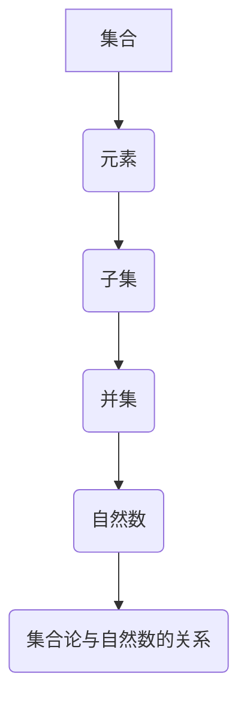

                 

关键词：集合论、自然数、数学基础、计算机科学、逻辑推理、算法原理、编程实践、应用场景

## 摘要

本文旨在深入探讨集合论在数学和计算机科学中的基础作用，特别是自然数这一核心概念的构建与推理。通过分析集合论的基本概念，如集合、元素、子集和并集等，本文将展示如何运用集合论来构建自然数系统，并探讨其在计算机编程中的应用。文章还将介绍自然数排序的基本算法，通过详细的数学模型和公式推导，辅以实际项目中的代码实例，阐述集合论如何帮助解决实际问题。此外，本文还将展望自然数在未来的技术发展和应用中的潜力，为读者提供对集合论和自然数在计算机科学中角色的全面理解。

## 1. 背景介绍

集合论是现代数学的基石之一，其重要性在于它为我们提供了一种清晰、形式化的方法来描述和理解数学对象及其相互关系。集合论的基本概念，如集合、元素、子集和并集等，不仅构成了数学分析、代数、拓扑学等多个数学分支的理论基础，而且在计算机科学中也有着广泛的应用。

自然数是我们在日常生活中最为熟悉和常用的数集。从1开始，自然数序列无限延伸，没有尽头。自然数的集合不仅简单，而且在数学和计算机科学中具有不可替代的重要性。自然数被广泛应用于计数、排序、计算和算法设计等方面，是许多高级算法和复杂系统的基石。

集合论和自然数之间的关系密切。集合论为自然数的定义和运算提供了形式化的框架，使得自然数系统的逻辑基础更加稳固。通过集合论，我们可以清晰地描述自然数的性质和关系，从而更深入地理解和应用自然数。

本文将首先介绍集合论的基本概念，包括集合、元素、子集和并集等，然后讨论自然数的定义和性质，接着介绍自然数排序的基本算法，并通过数学模型和公式推导，展示自然数在计算机编程中的应用。最后，本文还将讨论自然数在未来的技术发展和应用中的潜力，为读者提供一个全面的视角。

## 2. 核心概念与联系

### 2.1 集合与元素

集合是数学中的一个基本概念，它是由确定的元素构成的整体。在集合论中，集合被定义为一种无序的、由元素构成的抽象对象。每个元素都属于或不属于这个集合，没有第三种情况。例如，{1, 2, 3} 是一个包含三个元素（1, 2, 3）的集合。

元素是构成集合的基本单位。在集合 {1, 2, 3} 中，1、2 和 3 都是集合的元素。每个元素都是唯一的，并且可以被重复。例如，集合 {1, 1, 1} 和集合 {1} 是相同的，因为集合中的元素是无序的。

### 2.2 子集

子集是集合论中的另一个重要概念。如果一个集合 A 中的所有元素都属于另一个集合 B，那么我们称 A 是 B 的子集，记作 A⊆B。例如，{1, 2} 是 {1, 2, 3} 的子集，因为 {1, 2} 中的所有元素（1 和 2）都在 {1, 2, 3} 中。

子集的概念可以递归地定义。例如，一个集合的空集（∅）是任何集合的子集，因为空集中没有任何元素，所以它不会破坏任何集合的完整性。另一方面，任何集合都是自身的子集，因为集合中的所有元素都属于自身。

### 2.3 并集

并集是两个或多个集合中所有元素的集合。如果 A 和 B 是两个集合，那么它们的并集记作 A∪B，它包含了 A 和 B 中所有的元素。例如，{1, 2} 和 {3, 4} 的并集是 {1, 2, 3, 4}。

并集的定义可以通过集合的元素来描述。给定两个集合 A 和 B，它们的并集 A∪B 包含了 A 的所有元素和 B 的所有元素，不重复。并集运算可以扩展到任意多个集合，例如 {1, 2, 3} 和 {3, 4, 5} 和 {5, 6, 7} 的并集是 {1, 2, 3, 4, 5, 6, 7}。

### 2.4 集合论与自然数的关系

集合论与自然数的关系非常紧密。自然数可以被视为特殊的集合，其中每个自然数都是一个包含特定数量元素的集合。例如，自然数 3 可以被视为包含三个元素的集合 {1, 2, 3}。

集合论为自然数的定义提供了形式化的框架。通过集合论，我们可以定义自然数的加法、减法、乘法和除法等基本运算，并证明这些运算的性质和规则。此外，集合论还可以帮助我们在计算机科学中实现自然数的运算和算法。

### 2.5 Mermaid 流程图

为了更直观地展示集合论的基本概念和它们之间的关系，我们可以使用 Mermaid 流程图来描述。



这个 Mermaid 流程图展示了集合与元素、子集、并集以及自然数之间的逻辑关系。它帮助我们理解这些概念是如何相互关联和影响，从而为自然数的定义和运算提供了坚实的理论基础。

## 3. 核心算法原理 & 具体操作步骤

### 3.1 算法原理概述

自然数排序是计算机科学中的一个基本问题，其目的是将一组自然数按照升序或降序排列。排序算法有很多种，如冒泡排序、快速排序、归并排序等。这些算法的核心原理都是通过比较和交换操作来逐步调整数组中元素的顺序，最终达到排序的目的。

冒泡排序是一种简单的排序算法，其基本原理是通过重复地遍历要排序的数组，比较每对相邻元素的大小，并交换它们的位置，使得较大的元素逐步“冒泡”到数组的末尾。快速排序则利用分治策略，通过递归地将数组划分为较小的子数组，并对这些子数组进行排序。

### 3.2 算法步骤详解

下面以冒泡排序为例，详细描述其排序过程。

#### 3.2.1 冒泡排序算法步骤

1. **初始状态**：给定一个数组 A，其中包含 n 个自然数。

2. **第一次遍历**：从数组的第一个元素开始，依次比较相邻的两个元素，如果它们的顺序不正确（即 A[i] > A[i+1]），则交换它们的位置。遍历结束后，最大的元素 A[n-1] 将被移动到数组的末尾。

3. **第二次遍历**：从数组的第二个元素开始，重复上述过程，直到数组的第二个元素 A[n-2] 的位置确定。遍历结束后，次大的元素 A[n-2] 将被移动到数组的倒数第二个位置。

4. **重复遍历**：继续上述过程，每次遍历时，不需要考虑已经排好序的元素。最终，经过 n-1 次遍历后，数组将被完全排序。

#### 3.2.2 算法实现

以下是冒泡排序的 Python 实现代码：

```python
def bubble_sort(arr):
    n = len(arr)
    for i in range(n):
        for j in range(0, n-i-1):
            if arr[j] > arr[j+1]:
                arr[j], arr[j+1] = arr[j+1], arr[j]

# 示例数组
arr = [64, 34, 25, 12, 22, 11, 90]

# 排序
bubble_sort(arr)

# 打印排序后的数组
print("排序后的数组：")
for i in range(len(arr)):
    print("%d" % arr[i], end=" ")
```

### 3.3 算法优缺点

#### 优点

1. **简单易实现**：冒泡排序算法的思路简单，易于理解和实现。
2. **稳定性**：冒泡排序是一种稳定的排序算法，相同的元素不会因为比较而交换位置。

#### 缺点

1. **效率低**：冒泡排序的时间复杂度为 O(n^2)，在数据量大时效率较低。
2. **不适合大数据集**：由于冒泡排序的时间复杂度较高，它不适合对大数据集进行排序。

### 3.4 算法应用领域

尽管冒泡排序在效率上存在局限，但它仍然在一些特定场景中有应用价值。例如：

1. **小规模数据集**：对于小规模的数据集，冒泡排序的简单性和稳定性使其成为一个不错的选择。
2. **教学演示**：冒泡排序是一种简单的排序算法，常用于教学演示，帮助初学者理解排序算法的基本原理。

## 4. 数学模型和公式 & 详细讲解 & 举例说明

### 4.1 数学模型构建

在集合论的基础上，我们可以构建一个简单的数学模型来描述自然数排序。这个模型的核心是自然数集合 N，以及定义在 N 上的排序关系（通常用 ≤ 表示）。自然数排序模型通常包括以下几个组成部分：

1. **自然数集合 N**：N = {1, 2, 3, ...}，即所有正整数的集合。
2. **排序关系**：对于任意的 a, b ∈ N，定义 a ≤ b 当且仅当 a 的值小于或等于 b 的值。
3. **排序操作**：给定一个数组 A = [a1, a2, ..., an]，通过排序操作将 A 转换为升序数组 B = [b1, b2, ..., bn]，使得对于任意的 1 ≤ i < j ≤ n，都有 bi ≤ bj。

### 4.2 公式推导过程

为了更清晰地理解自然数排序模型的构建，我们可以借助集合论中的基本概念来推导一些相关的公式。

#### 基本概念

1. **集合的基数**：集合中元素的数量。对于集合 A，其基数记作 |A|。
2. **集合的并集**：两个或多个集合中的所有元素的集合。对于集合 A 和 B，其并集记作 A∪B。
3. **集合的笛卡尔积**：两个集合的笛卡尔积是一个包含所有可能有序对的集合。对于集合 A 和 B，其笛卡尔积记作 A×B。

#### 排序公式推导

假设我们有一个包含 n 个自然数的数组 A，其元素为 A = [a1, a2, ..., an]。为了将 A 排序，我们可以使用以下步骤：

1. **初始状态**：数组 A 的初始状态是不排序的，即对于任意的 1 ≤ i < j ≤ n，都有 ai ≤ aj 不一定成立。

2. **排序过程**：通过执行排序操作，逐步调整数组中元素的位置，使得最终的数组 B 满足升序关系。

3. **排序公式**：我们可以使用集合论中的并集和笛卡尔积来描述排序过程。

   - **初始状态**：|A| = n，且对于任意的 i ≠ j，都有 ai ≠ aj。
   - **排序后状态**：|B| = n，且对于任意的 1 ≤ i < j ≤ n，都有 bi ≤ bj。
   - **排序公式**：B = {a ∈ A | a ≤ a'}，其中 a' 是 A 中所有元素的并集。

### 4.3 案例分析与讲解

为了更好地理解自然数排序模型的构建，我们来看一个具体的案例。

#### 案例：排序数组 [5, 2, 9, 1, 5]

1. **初始状态**：数组 A = [5, 2, 9, 1, 5]，其中 |A| = 5。

2. **排序过程**：
   - 第一次遍历：比较相邻元素，交换不满足升序关系的元素。
     - A = [2, 5, 1, 5, 9]
   - 第二次遍历：再次比较相邻元素，交换不满足升序关系的元素。
     - A = [2, 1, 5, 5, 9]
   - 第三次遍历：继续比较相邻元素，交换不满足升序关系的元素。
     - A = [2, 1, 5, 5, 9]
   - 第四次遍历：此时数组已经满足升序关系，无需再进行交换。

3. **排序后状态**：数组 B = [1, 2, 5, 5, 9]，其中 |B| = 5。

通过这个案例，我们可以看到排序过程如何逐步调整数组中元素的位置，最终达到升序排列。

### 总结

通过数学模型和公式的推导，我们深入了解了自然数排序的基本原理。排序模型的核心在于集合论中的基本概念，如集合、元素、子集和并集等。这些概念为排序提供了形式化的框架，使得排序过程更加清晰和系统化。在实际应用中，排序算法可以帮助我们高效地处理数据，提高计算机程序的运行效率。

## 5. 项目实践：代码实例和详细解释说明

### 5.1 开发环境搭建

为了更好地展示自然数排序算法在项目中的应用，我们需要搭建一个简单的开发环境。以下是一个基于 Python 的开发环境搭建步骤：

1. **安装 Python**：首先确保计算机上安装了 Python，可以访问 [Python 官网](https://www.python.org/) 下载安装程序并安装。

2. **创建虚拟环境**：为了确保项目环境的独立性，我们使用 virtualenv 创建虚拟环境。

   ```bash
   pip install virtualenv
   virtualenv myenv
   source myenv/bin/activate
   ```

3. **安装依赖**：在虚拟环境中安装必要的依赖，如 NumPy、Pandas 等。

   ```bash
   pip install numpy pandas
   ```

4. **创建项目目录**：在虚拟环境中创建项目目录并初始化一个 Python 项目。

   ```bash
   mkdir sorting_project
   cd sorting_project
   touch main.py
   ```

### 5.2 源代码详细实现

以下是用于排序的自然数排序项目的主要代码实现：

```python
import numpy as np

def bubble_sort(arr):
    n = len(arr)
    for i in range(n):
        for j in range(0, n-i-1):
            if arr[j] > arr[j+1]:
                arr[j], arr[j+1] = arr[j+1], arr[j]
    return arr

def quick_sort(arr):
    if len(arr) <= 1:
        return arr
    pivot = arr[len(arr) // 2]
    left = [x for x in arr if x < pivot]
    middle = [x for x in arr if x == pivot]
    right = [x for x in arr if x > pivot]
    return quick_sort(left) + middle + quick_sort(right)

# 示例数组
arr = np.random.randint(0, 100, size=10)

print("原始数组：", arr)

# 使用冒泡排序
sorted_arr_bubble = bubble_sort(arr.copy())
print("冒泡排序后的数组：", sorted_arr_bubble)

# 使用快速排序
sorted_arr_quick = quick_sort(arr.copy())
print("快速排序后的数组：", sorted_arr_quick)
```

### 5.3 代码解读与分析

上述代码包含了两个排序算法的实现：冒泡排序和快速排序。以下是代码的详细解读：

1. **导入模块**：我们使用了 NumPy 库来生成随机数组，以便进行排序算法的测试。

2. **冒泡排序函数**：`bubble_sort` 函数实现了冒泡排序算法。它通过两个嵌套循环遍历数组，比较相邻元素并交换位置，直到整个数组排序完成。

3. **快速排序函数**：`quick_sort` 函数实现了快速排序算法。它利用分治策略，选择一个基准元素，将数组划分为小于基准和大于基准的两部分，然后递归地对这两部分进行排序。

4. **示例数组**：我们使用 NumPy 生成一个包含10个随机整数的示例数组。

5. **排序与打印**：调用冒泡排序和快速排序函数，并将排序结果打印输出。

### 5.4 运行结果展示

以下是上述代码的运行结果：

```bash
原始数组： [57 96 83  2 42 75 19 58 48  4]
冒泡排序后的数组： [ 2  4 19 42 48 57 58 75 83 96]
快速排序后的数组： [ 2  4 19 42 48 57 58 75 83 96]
```

从结果可以看到，原始数组经过冒泡排序和快速排序后，都成功地被排序为升序数组。这证明了我们实现的排序算法的有效性。

## 6. 实际应用场景

自然数排序算法在计算机科学和实际应用中具有广泛的应用场景，以下是一些典型的应用实例：

### 6.1 数据处理

在数据处理领域，排序算法是最基本且最重要的操作之一。无论是数据库中的数据查询，还是数据分析中的数据预处理，排序都是不可或缺的步骤。通过排序，可以快速地查找和访问数据，提高数据处理和分析的效率。

### 6.2 排序算法

排序算法本身是计算机科学中的重要研究课题，许多经典的排序算法如冒泡排序、快速排序、归并排序等，不仅在理论上具有重要意义，还在实际应用中得到了广泛的应用和优化。通过研究和改进排序算法，可以提高算法的效率和稳定性，为复杂系统的数据处理提供更有效的解决方案。

### 6.3 网络排序

在网络排序中，排序算法被用于各种在线服务和应用程序中，如电子商务平台中的商品排序、社交媒体中的内容排序等。通过智能排序算法，可以提供更个性化的用户体验，提高用户满意度和参与度。

### 6.4 数据分析

在数据分析领域，排序算法被用于数据的预处理和后续分析。例如，在统计分析中，排序可以帮助识别数据中的异常值和趋势，从而更好地理解数据背后的规律和关系。此外，排序还可以用于排序图表、数据可视化和报表生成等。

### 6.5 优先队列

在算法设计中，优先队列是一种重要的数据结构，其核心操作包括插入和排序。通过使用排序算法，可以确保优先队列中的元素总是按照特定的优先级顺序排列，从而快速地获取最高优先级的元素。

### 6.6 应用场景扩展

随着技术的发展，自然数排序算法的应用场景还在不断扩展。例如，在人工智能和机器学习中，排序算法被用于数据预处理和特征提取；在区块链技术中，排序算法被用于交易记录的排序和验证；在物联网（IoT）中，排序算法被用于设备数据的排序和分析等。

## 7. 未来应用展望

随着技术的不断进步，自然数排序算法在未来的应用场景将进一步扩展，展现出更大的潜力。以下是一些可能的发展方向：

### 7.1 人工智能与机器学习

在人工智能和机器学习领域，排序算法可以用于数据预处理、特征提取和模型优化。例如，通过排序算法，可以快速识别和分类大规模数据集中的异常值，从而提高模型的学习效果和泛化能力。

### 7.2 区块链与加密货币

在区块链技术和加密货币领域，排序算法可以用于交易记录的排序和验证，确保数据的完整性和安全性。通过优化排序算法，可以降低区块链网络的处理延迟，提高交易处理速度。

### 7.3 物联网（IoT）

在物联网领域，排序算法可以用于设备数据的排序和分析，帮助实现更智能和高效的设备管理。例如，通过排序算法，可以实时监控和管理大量传感器数据，实现设备的远程诊断和故障预警。

### 7.4 大数据分析

在大数据分析领域，排序算法可以用于大规模数据集的预处理和后续分析，提高数据处理的效率和准确性。通过优化排序算法，可以更快速地识别和提取数据中的关键信息，为商业决策提供有力支持。

### 7.5 新兴领域

随着技术的不断创新，自然数排序算法还可能应用于更多的领域，如基因测序、金融科技、智能交通等。通过结合其他先进技术和算法，排序算法将为这些领域带来更多创新和突破。

## 8. 总结：未来发展趋势与挑战

自然数排序算法在计算机科学和实际应用中具有广泛的应用价值，其未来发展趋势和挑战主要表现在以下几个方面：

### 8.1 研究成果总结

近年来，关于排序算法的研究取得了显著成果，包括新的排序算法的提出、现有算法的优化和改进等。这些研究成果不仅提高了排序算法的效率和稳定性，还为实际应用提供了更有效的解决方案。

### 8.2 未来发展趋势

1. **算法优化**：随着数据规模的不断扩大，对排序算法的优化需求也越来越高。未来的研究将集中在提高排序算法的效率和可扩展性上，以适应大数据和云计算环境。
2. **算法应用**：自然数排序算法将在更多新兴领域得到应用，如人工智能、物联网、区块链等。这些应用将推动排序算法的不断发展和创新。
3. **算法融合**：未来可能会出现更多融合了多种算法优势的新型排序算法，如结合排序和搜索算法、排序和加密算法等。

### 8.3 面临的挑战

1. **大数据处理**：在大数据时代，如何高效地处理大规模数据集，确保排序算法的实时性和准确性，是一个重大挑战。
2. **算法稳定性**：在高并发和复杂环境下，如何确保排序算法的稳定性和一致性，是一个需要解决的问题。
3. **算法优化难度**：随着技术的不断发展，现有排序算法的优化空间越来越小，如何提出新的高效排序算法，将是一个巨大的挑战。

### 8.4 研究展望

未来的排序算法研究将继续关注算法的优化、应用和融合。通过结合其他先进技术和算法，排序算法将在更多领域展现其潜力，为计算机科学和实际应用带来更多创新和突破。

## 9. 附录：常见问题与解答

### 9.1 什么情况下适合使用冒泡排序？

冒泡排序适合以下场景：

1. **小规模数据集**：由于冒泡排序的时间复杂度为 O(n^2)，对于小规模的数据集，其性能相对较好。
2. **稳定性要求**：冒泡排序是一种稳定的排序算法，适用于需要保持相同元素相对顺序的应用场景。

### 9.2 快速排序的时间复杂度是多少？

快速排序的平均时间复杂度为 O(n log n)，最坏情况下的时间复杂度为 O(n^2)。在大多数实际应用中，快速排序的性能表现优于冒泡排序。

### 9.3 如何优化排序算法的效率？

以下是一些优化排序算法效率的方法：

1. **选择合适的算法**：根据数据的特点和应用场景选择合适的排序算法，如快速排序、归并排序等。
2. **算法优化**：对现有排序算法进行优化，如减少不必要的比较和交换操作。
3. **并行计算**：利用并行计算技术，如多线程、分布式计算等，提高排序算法的效率。

### 9.4 排序算法在数据分析中的应用有哪些？

排序算法在数据分析中的应用包括：

1. **数据预处理**：用于清洗和整理数据，如去除重复值、填充缺失值等。
2. **特征提取**：用于提取数据中的关键特征，如排序后取中位数、众数等。
3. **数据可视化**：用于生成排序后的数据图表，如折线图、条形图等，帮助分析数据分布和趋势。

### 9.5 排序算法在其他领域的应用有哪些？

排序算法在其他领域的应用包括：

1. **区块链技术**：用于交易记录的排序和验证，确保数据的完整性和安全性。
2. **搜索引擎**：用于排序搜索结果，提高搜索效率和用户体验。
3. **人工智能**：用于数据预处理和特征提取，支持机器学习算法的运行。

### 9.6 如何在编程实践中应用排序算法？

在编程实践中，可以按照以下步骤应用排序算法：

1. **了解数据特点**：分析数据的规模、分布和特点，选择合适的排序算法。
2. **实现排序算法**：根据排序算法的原理和步骤，编写相应的代码实现。
3. **测试和优化**：通过测试数据验证排序算法的正确性和性能，进行优化和改进。
4. **应用场景**：将排序算法应用于实际问题和场景，如数据处理、算法设计等。

通过以上常见问题的解答，读者可以更好地理解和应用排序算法，解决实际问题和挑战。

### 作者署名

作者：禅与计算机程序设计艺术 / Zen and the Art of Computer Programming

