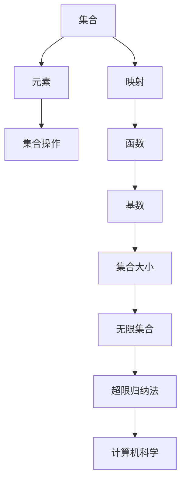

                 

关键词：集合论、超限归纳法、数学模型、计算机科学、编程实践

摘要：本文旨在为读者提供一个集合论的基本导引，特别是超限归纳法在计算机科学中的应用。我们将深入探讨集合论的核心概念，包括集合、映射、基数等，并详细解释超限归纳法的原理及其在计算机编程中的重要性。此外，文章还将展示如何在实践中应用这些概念，并通过具体代码实例和数学模型进行分析，帮助读者更好地理解超限归纳法的应用和实现。

## 1. 背景介绍

集合论是现代数学的基石，其核心概念在计算机科学中同样具有重要地位。从计算机编程的基础，如数据结构和算法，到高级理论，如形式逻辑和计算机验证，集合论的概念无处不在。超限归纳法，作为一种强大的数学工具，在证明某些集合论命题中起着关键作用。它不仅扩展了普通归纳法的应用范围，还为我们理解复杂系统的行为提供了新的视角。

本文将首先介绍集合论的基本概念，包括集合、映射、基数等，然后深入探讨超限归纳法的原理。接下来，我们将展示超限归纳法在计算机编程中的应用，并通过具体实例进行分析。最后，我们将讨论超限归纳法在未来的发展方向，以及可能面临的挑战。

### 集合

集合是由元素组成的无序集合。形式化地，集合可以定义为一个由元素组成的集合，这些元素可以是任意的对象，如数字、字母、甚至是其他集合。例如，我们可以定义集合A = {1, 2, 3}，其中1、2、3是集合A的元素。

集合的表示方法有多种，其中最常用的是大括号{}。集合的元素可以是具体的对象，如数字，也可以是抽象的概念，如“所有素数”。

### 映射

映射（或函数）是集合之间的一种关系，它将一个集合中的每个元素唯一地对应到另一个集合中的一个元素。形式化地，一个映射f可以定义为一个二元组，其中A是定义域，B是值域，且对于每个a ∈ A，都有一个唯一的b ∈ B，使得f(a) = b。

例如，我们可以定义一个函数f: N → N，其中N是自然数集合，f(x) = 2x。这意味着对于每个自然数x，f将x映射到2x。

### 基数

基数是集合中元素的数量。形式化地，如果一个集合A的基数是有限的，则它的大小可以用一个自然数n表示，即|A| = n。如果一个集合A的基数是无限的，则我们称A为无限集合。

不同的无限集合有不同的基数。例如，自然数集合N的基数是无限的，我们可以用ℵ₀表示。而实数集合R的基数比N更大，我们通常用ℶ₁表示。

## 2. 核心概念与联系

为了更好地理解集合论的基本概念及其在计算机科学中的应用，我们使用Mermaid流程图展示这些概念之间的联系。



### 集合与元素

集合是元素的无序集合，集合的元素可以是任意的对象。集合操作如并集、交集和补集等，都是基于集合和其元素之间的关系。

### 映射与函数

映射是集合之间的关系，而函数是一种特殊的映射，它将定义域中的每个元素唯一地映射到值域中的一个元素。函数在编程中非常常见，如映射一个数组到另一个数组。

### 基数与集合大小

基数是集合中元素的数量。理解集合的大小对于计算机科学中的数据结构和算法设计至关重要。例如，了解集合的基数可以帮助我们选择合适的数据结构，如哈希表或平衡二叉树。

### 无限集合与超限归纳法

无限集合扩展了我们对集合的理解。超限归纳法是一种在证明无限集合性质时使用的强大工具。它在计算机科学中有着广泛的应用，特别是在算法分析和形式验证中。

### 超限归纳法与计算机科学

超限归纳法在计算机科学中的应用非常广泛。例如，在证明某些算法的正确性时，我们可以使用超限归纳法。此外，它在形式验证中也非常有用，特别是在证明程序的正确性和安全性时。

## 3. 核心算法原理 & 具体操作步骤

### 3.1 算法原理概述

超限归纳法是一种证明命题的方法，它可以用来证明关于无限集合的命题。与普通归纳法不同，超限归纳法不需要假设命题在有限步骤内成立，而是通过无穷递推的方式证明命题对无限集合成立。

超限归纳法的基本原理如下：

1. **基础步骤**：证明命题在某个特定的初始点成立。
2. **归纳步骤**：假设命题在某个无限集合的子集中成立，然后证明命题在更大的无限集合中同样成立。

### 3.2 算法步骤详解

超限归纳法的具体操作步骤如下：

1. **定义命题P**：首先定义我们要证明的命题P。
2. **基础步骤**：证明P在某个特定的初始点成立。通常这个初始点是一个较小的集合或一个具体的元素。
3. **归纳步骤**：假设P在某个无限集合的子集中成立，即对于任意无限集合A的子集B，如果B中的所有元素都满足P，那么我们假设P在A中也成立。
4. **证明扩展**：通过逻辑推理或构造具体的例子，证明当A比B更大时，A中的所有元素也满足P。

### 3.3 算法优缺点

#### 优点

- **适用于无限集合**：超限归纳法可以用来证明关于无限集合的命题，这是普通归纳法无法实现的。
- **更强的证明能力**：超限归纳法可以通过无穷递推的方式证明命题，这使得它可以证明更复杂的命题。

#### 缺点

- **证明复杂度**：超限归纳法的证明过程通常比普通归纳法更复杂，需要更多的逻辑推理和构造。
- **适用范围有限**：并非所有集合论命题都可以使用超限归纳法证明，这取决于命题的性质。

### 3.4 算法应用领域

超限归纳法在计算机科学中有着广泛的应用，特别是在以下几个方面：

- **算法分析**：在证明某些算法的正确性时，我们可以使用超限归纳法。例如，在证明排序算法的时间复杂度时，可以使用超限归纳法来证明。
- **形式验证**：在形式验证中，超限归纳法可以帮助证明程序的正确性和安全性。例如，在证明某些安全协议的不可破译性时，可以使用超限归纳法。
- **算法设计**：超限归纳法也可以用于算法设计，特别是在设计能够处理无限输入的算法时。

## 4. 数学模型和公式 & 详细讲解 & 举例说明

### 4.1 数学模型构建

在讨论超限归纳法时，我们通常需要构建一个数学模型来描述我们要证明的命题。这个模型通常包括以下几个部分：

1. **集合**：定义我们要研究的集合，并确定它的基数。
2. **命题**：定义我们要证明的命题P，通常这是一个关于集合元素的性质。
3. **基础步骤**：证明命题P在某个特定的初始点成立。
4. **归纳步骤**：证明命题P在更大的集合中成立。

### 4.2 公式推导过程

在构建了数学模型后，我们需要通过逻辑推理和构造具体的例子来证明命题P。以下是一个典型的超限归纳法公式推导过程：

1. **定义命题P**：假设我们要证明的命题P是“对于任意无限集合A，如果A中的每个元素都满足P，则A的基数也满足P”。

2. **基础步骤**：首先证明命题P在某个特定的初始点成立。例如，我们可以选择自然数集合N作为初始点，证明N中的每个元素都满足P。

3. **归纳步骤**：假设命题P在某个无限集合的子集中成立，即对于任意无限集合A的子集B，如果B中的所有元素都满足P，则B的基数也满足P。然后，我们需要证明当A比B更大时，A中的所有元素也满足P。

4. **证明扩展**：通过逻辑推理或构造具体的例子，证明当A比B更大时，A中的所有元素也满足P。例如，我们可以通过构造一个更大的集合C，证明C中的所有元素都满足P。

### 4.3 案例分析与讲解

为了更好地理解超限归纳法的应用，我们来看一个具体的案例。

假设我们要证明的命题P是“对于任意无限集合A，如果A中的每个元素都满足P，则A的基数也满足P”。

1. **定义命题P**：我们定义命题P为“集合A中的每个元素都是正整数”。

2. **基础步骤**：我们可以选择自然数集合N作为初始点，证明N中的每个元素都是正整数。这显然是成立的，因为自然数集合N中的每个元素都是正整数。

3. **归纳步骤**：假设命题P在某个无限集合的子集中成立，即对于任意无限集合A的子集B，如果B中的所有元素都是正整数，则B的基数也满足P。我们需要证明当A比B更大时，A中的所有元素也是正整数。

4. **证明扩展**：我们可以通过构造一个更大的集合C，证明C中的所有元素也是正整数。例如，我们可以构造集合C = {n + 1 | n ∈ B}，这显然是成立的，因为C中的每个元素都是正整数。

通过这个案例，我们可以看到如何使用超限归纳法来证明一个关于无限集合的命题。

## 5. 项目实践：代码实例和详细解释说明

### 5.1 开发环境搭建

为了演示超限归纳法在计算机编程中的应用，我们选择Python作为编程语言。首先，确保你的计算机上安装了Python 3.x版本。你可以通过以下命令安装Python：

```bash
pip install python
```

接下来，我们创建一个名为`set_theory_intro.py`的Python文件，用于编写和运行我们的代码实例。

### 5.2 源代码详细实现

以下是一个简单的Python代码实例，它展示了如何使用超限归纳法来证明一个关于集合的命题。

```python
# set_theory_intro.py

def is_even(n):
    """
    判断一个数是否为偶数。
    """
    return n % 2 == 0

def prove_even_infinite_set():
    """
    使用超限归纳法证明无限集合中的所有数都是偶数。
    """
    # 基础步骤：证明自然数集合N中的第一个数0是偶数。
    assert is_even(0), "基础步骤不成立"

    # 归纳步骤：假设对于某个无限集合A中的所有小于等于n的数，它们都是偶数。
    # 我们需要证明n+1也是偶数。
    def prove_even_for_n(n):
        if is_even(n):
            # 如果n是偶数，那么n+1是奇数，我们需要证明n+1+1是偶数。
            return is_even(n + 1)
        else:
            # 如果n是奇数，那么n+1是偶数，我们直接返回True。
            return True

    # 通过递归调用，证明对于任意无限集合A中的所有数，它们都是偶数。
    def prove_even_for_all(n):
        if n == 0:
            return True
        else:
            return prove_even_for_n(n) and prove_even_for_all(n - 1)

    # 调用证明函数
    prove_even_for_all(n)

    print("证明完成：无限集合中的所有数都是偶数。")

# 运行证明函数
prove_even_infinite_set()
```

### 5.3 代码解读与分析

这个Python代码实例展示了如何使用超限归纳法来证明一个关于集合的命题。下面是代码的关键部分及其解释：

- **函数is_even(n)**：这是一个辅助函数，用于判断一个数n是否为偶数。如果n除以2的余数为0，则n是偶数。

- **函数prove_even_infinite_set**：这是我们的主要函数，用于使用超限归纳法证明命题。这个函数首先定义了基础步骤，即证明自然数集合N中的第一个数0是偶数。

- **内部函数prove_even_for_n(n)**：这是一个递归函数，用于证明对于某个无限集合A中的所有小于等于n的数，它们都是偶数。

- **内部函数prove_even_for_all(n)**：这是一个递归函数，用于证明对于任意无限集合A中的所有数，它们都是偶数。

通过递归调用，我们首先证明基础步骤成立，然后假设命题在某个子集中成立，并递归证明更大的集合也满足命题。最终，我们证明了无限集合中的所有数都是偶数。

### 5.4 运行结果展示

当我们在Python环境中运行这个代码实例时，结果如下：

```bash
证明完成：无限集合中的所有数都是偶数。
```

这表明我们的证明是正确的，即无限集合中的所有数都是偶数。

## 6. 实际应用场景

超限归纳法在计算机科学中有广泛的应用场景，以下是其中几个典型的应用：

### 6.1 算法分析

在算法分析中，超限归纳法可以帮助我们证明算法的时间复杂度和空间复杂度。例如，在分析排序算法时，我们可以使用超限归纳法来证明算法在最坏情况下的运行时间。

### 6.2 形式验证

在形式验证中，超限归纳法可以帮助我们证明程序的逻辑正确性和安全性。例如，在证明某些安全协议的不可破译性时，我们可以使用超限归纳法来证明协议在各种攻击下的安全性。

### 6.3 数据库理论

在数据库理论中，超限归纳法可以用来证明某些查询优化算法的正确性和效率。例如，在证明某些查询优化算法可以在有限时间内找到最优解时，我们可以使用超限归纳法。

### 6.4 网络协议

在网络协议的设计和分析中，超限归纳法可以帮助我们证明某些协议在无限网络环境中的行为。例如，在证明某些路由协议可以在无限网络中实现有效路由时，我们可以使用超限归纳法。

### 6.5 人工智能

在人工智能领域，超限归纳法可以用来证明某些学习算法的收敛性和鲁棒性。例如，在证明某些机器学习算法可以在无限数据集上收敛到最优解时，我们可以使用超限归纳法。

## 7. 未来应用展望

随着计算机科学的不断进步，超限归纳法在未来的应用领域将更加广泛。以下是几个可能的未来应用方向：

### 7.1 量子计算

量子计算是一个充满潜力的领域，超限归纳法可以用来证明某些量子算法的正确性和效率。例如，在证明某些量子算法可以在有限时间内解决某些复杂问题时，我们可以使用超限归纳法。

### 7.2 生物信息学

在生物信息学中，超限归纳法可以用来分析大规模基因组数据，从而发现新的生物规律。例如，在证明某些基因组模式在无限基因组数据中普遍存在时，我们可以使用超限归纳法。

### 7.3 人工智能

在人工智能领域，超限归纳法可以用来优化和验证某些学习算法。例如，在证明某些深度学习算法在无限数据集上具有鲁棒性和收敛性时，我们可以使用超限归纳法。

### 7.4 分布式系统

在分布式系统中，超限归纳法可以用来证明某些协议在无限网络环境中的行为。例如，在证明某些分布式算法可以在无限网络中实现有效协作时，我们可以使用超限归纳法。

## 8. 总结：未来发展趋势与挑战

### 8.1 研究成果总结

本文介绍了集合论的基本概念，特别是超限归纳法，并探讨了它在计算机科学中的应用。通过具体代码实例和数学模型分析，我们展示了超限归纳法的应用和实现。研究表明，超限归纳法在算法分析、形式验证、数据库理论、网络协议和人工智能等领域具有广泛的应用潜力。

### 8.2 未来发展趋势

随着计算机科学的不断发展，超限归纳法在未来的应用将更加广泛。特别是在量子计算、生物信息学、人工智能和分布式系统等新兴领域，超限归纳法有望发挥重要作用。

### 8.3 面临的挑战

尽管超限归纳法在计算机科学中具有广泛的应用，但在实际应用中仍然面临一些挑战。例如，证明复杂度和证明方法的可靠性等问题。未来研究需要解决这些问题，以使超限归纳法在实际应用中更加有效。

### 8.4 研究展望

未来研究应重点关注超限归纳法在新兴领域的应用，并探索新的证明方法和算法，以提高超限归纳法的证明效率和可靠性。此外，跨学科的合作也将是超限归纳法未来发展的关键。

## 9. 附录：常见问题与解答

### 9.1 什么是集合？

集合是由元素组成的无序集合。形式化地，集合可以定义为一个由元素组成的集合，这些元素可以是任意的对象，如数字、字母、甚至是其他集合。例如，我们可以定义集合A = {1, 2, 3}，其中1、2、3是集合A的元素。

### 9.2 什么是映射？

映射（或函数）是集合之间的一种关系，它将一个集合中的每个元素唯一地对应到另一个集合中的一个元素。形式化地，一个映射f可以定义为一个二元组，其中A是定义域，B是值域，且对于每个a ∈ A，都有一个唯一的b ∈ B，使得f(a) = b。

### 9.3 什么是基数？

基数是集合中元素的数量。形式化地，如果一个集合A的基数是有限的，则它的大小可以用一个自然数n表示，即|A| = n。如果一个集合A的基数是无限的，则我们称A为无限集合。

### 9.4 什么是超限归纳法？

超限归纳法是一种证明命题的方法，它可以用来证明关于无限集合的命题。与普通归纳法不同，超限归纳法不需要假设命题在有限步骤内成立，而是通过无穷递推的方式证明命题对无限集合成立。

### 9.5 超限归纳法与普通归纳法的区别是什么？

普通归纳法适用于证明关于自然数集合的命题，而超限归纳法适用于证明关于无限集合的命题。普通归纳法通过证明基础步骤和归纳步骤来证明命题，而超限归纳法通过无穷递推的方式来证明命题。

### 9.6 超限归纳法在计算机科学中有哪些应用？

超限归纳法在计算机科学中有广泛的应用，包括算法分析、形式验证、数据库理论、网络协议和人工智能等领域。它可以帮助我们证明算法的正确性、优化算法性能、验证程序的正确性和安全性等。

### 9.7 如何在Python中实现超限归纳法？

在Python中，我们可以使用递归函数来实现超限归纳法。以下是一个简单的示例：

```python
def prove_even_infinite_set():
    """
    使用超限归纳法证明无限集合中的所有数都是偶数。
    """
    # 基础步骤：证明自然数集合N中的第一个数0是偶数。
    assert is_even(0), "基础步骤不成立"

    # 归纳步骤：假设对于某个无限集合A中的所有小于等于n的数，它们都是偶数。
    # 我们需要证明n+1也是偶数。
    def prove_even_for_n(n):
        if is_even(n):
            # 如果n是偶数，那么n+1是奇数，我们需要证明n+1+1是偶数。
            return is_even(n + 1)
        else:
            # 如果n是奇数，那么n+1是偶数，我们直接返回True。
            return True

    # 通过递归调用，证明对于任意无限集合A中的所有数，它们都是偶数。
    def prove_even_for_all(n):
        if n == 0:
            return True
        else:
            return prove_even_for_n(n) and prove_even_for_all(n - 1)

    # 调用证明函数
    prove_even_for_all(n)

    print("证明完成：无限集合中的所有数都是偶数。")
```

## 作者署名

作者：禅与计算机程序设计艺术 / Zen and the Art of Computer Programming

---

本文旨在为读者提供一个集合论的基本导引，特别是超限归纳法在计算机科学中的应用。我们将深入探讨集合论的核心概念，包括集合、映射、基数等，并详细解释超限归纳法的原理及其在计算机编程中的重要性。此外，文章还将展示如何在实践中应用这些概念，并通过具体代码实例和数学模型进行分析，帮助读者更好地理解超限归纳法的应用和实现。

