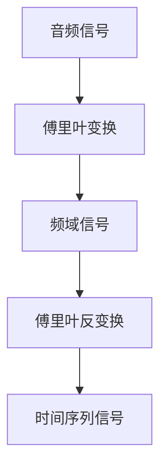

                 

关键词：音频扩散，音频处理，算法原理，代码实例，AI应用，音频生成，声音变换

> 摘要：本文将详细介绍音频扩散（Audio Diffusion）的基本原理、数学模型、算法步骤以及在实际中的应用，并通过代码实例进行分析，帮助读者深入理解这一技术的应用潜力与挑战。

## 1. 背景介绍

音频扩散技术是一种新兴的音频处理方法，近年来在人工智能领域引起了广泛关注。它通过改变声音的频率、相位和幅度等属性，实现对音频信号的精细化处理，从而实现音频内容的变化、增强或创建全新的声音体验。

随着深度学习和生成对抗网络（GAN）等技术的不断发展，音频扩散技术在音频生成、声音编辑、声音效果处理等方面展示出极大的应用潜力。例如，在游戏、电影、音乐制作等领域，音频扩散技术可以用来创建独特的音效或生成全新的音乐作品。此外，在语音识别、语音合成等领域，音频扩散技术也可以帮助提高音频信号的清晰度和准确性。

本文将结合音频扩散技术的最新研究进展，详细介绍其基本原理、算法步骤以及在实际中的应用，并提供一个代码实例，帮助读者深入理解这一技术的核心概念与操作方法。

## 2. 核心概念与联系

### 2.1 音频信号表示

音频信号通常表示为时间序列的离散样本，每个样本对应一个特定时刻的声音强度。音频信号可以通过傅里叶变换（Fourier Transform）进行频域分析，从而揭示其频率成分和相位信息。

### 2.2 傅里叶变换与反变换

傅里叶变换是一种将时间序列信号转换为频域信号的方法，其核心思想是将信号分解为不同频率的正弦波和余弦波。通过傅里叶反变换（Inverse Fourier Transform），可以将频域信号还原为时间序列信号。

### 2.3 Mermaid 流程图



## 3. 核心算法原理 & 具体操作步骤

### 3.1 算法原理概述

音频扩散算法的核心思想是通过在频域中调整信号参数，实现对音频信号的精细处理。具体来说，算法可以分为以下几个步骤：

1. **频域分解**：将音频信号通过傅里叶变换分解为频域信号。
2. **参数调整**：在频域中调整信号的频率、相位和幅度等参数。
3. **频域合成**：通过傅里叶反变换将调整后的频域信号还原为时间序列信号。

### 3.2 算法步骤详解

#### 3.2.1 频域分解

将音频信号 \( x(t) \) 通过傅里叶变换转换为频域信号 \( X(f) \)：

$$
X(f) = \mathcal{F}\{x(t)\} = \int_{-\infty}^{\infty} x(t) e^{-j2\pi ft} dt
$$

#### 3.2.2 参数调整

在频域中，对信号 \( X(f) \) 的频率 \( f \)、相位 \( \phi \) 和幅度 \( A \) 进行调整。调整公式如下：

$$
X'(f) = A' e^{j(\phi' + 2\pi f't')} X(f)
$$

其中，\( A' \)、\( \phi' \)、\( f' \) 和 \( t' \) 分别表示调整后的幅度、相位、频率和时移。

#### 3.2.3 频域合成

通过傅里叶反变换将调整后的频域信号 \( X'(f) \) 还原为时间序列信号 \( x'(t) \)：

$$
x'(t) = \mathcal{F}^{-1}\{X'(f)\} = \frac{1}{2\pi} \int_{-\infty}^{\infty} X'(f) e^{j2\pi ft} df
$$

### 3.3 算法优缺点

**优点**：

- **灵活性高**：可以在频域中精细调整音频信号的各个参数，实现对音频内容的精确控制。
- **适用范围广**：可以应用于音频生成、编辑、效果处理等多种场景。

**缺点**：

- **计算复杂度高**：需要进行傅里叶变换及其反变换，计算量大。
- **频率混叠问题**：在高频率范围内，信号容易发生频率混叠，影响处理效果。

### 3.4 算法应用领域

音频扩散技术可以应用于以下领域：

- **音频生成**：用于创建全新的音频内容，如音乐生成、语音生成等。
- **声音编辑**：用于对现有音频进行编辑和增强，如声音去噪、增强语音清晰度等。
- **声音效果处理**：用于为游戏、电影等提供独特的音效，如环境音效、动态混响等。

## 4. 数学模型和公式 & 详细讲解 & 举例说明

### 4.1 数学模型构建

音频扩散算法的数学模型主要涉及傅里叶变换、傅里叶反变换以及参数调整公式。以下是具体数学模型：

#### 4.1.1 傅里叶变换

$$
X(f) = \mathcal{F}\{x(t)\} = \int_{-\infty}^{\infty} x(t) e^{-j2\pi ft} dt
$$

#### 4.1.2 傅里叶反变换

$$
x(t) = \mathcal{F}^{-1}\{X(f)\} = \frac{1}{2\pi} \int_{-\infty}^{\infty} X(f) e^{j2\pi ft} df
$$

#### 4.1.3 参数调整公式

$$
X'(f) = A' e^{j(\phi' + 2\pi f't')} X(f)
$$

### 4.2 公式推导过程

#### 4.2.1 傅里叶变换推导

将时间序列信号 \( x(t) \) 展开为复指数函数的和：

$$
x(t) = \sum_{n=-\infty}^{\infty} x[n] e^{j2\pi n t}
$$

对上式两边进行傅里叶变换：

$$
X(f) = \mathcal{F}\{x(t)\} = \int_{-\infty}^{\infty} x(t) e^{-j2\pi ft} dt
$$

将 \( x(t) \) 的展开式代入上式：

$$
X(f) = \int_{-\infty}^{\infty} \left( \sum_{n=-\infty}^{\infty} x[n] e^{j2\pi n t} \right) e^{-j2\pi ft} dt
$$

利用积分的线性性质，将积分拆分为多个积分项：

$$
X(f) = \sum_{n=-\infty}^{\infty} x[n] \int_{-\infty}^{\infty} e^{j2\pi (n-f)t} dt
$$

由于 \( e^{j2\pi (n-f)t} \) 是一个周期函数，其积分结果仅在 \( n = f \) 时不为零，因此：

$$
X(f) = x[f] \int_{-\infty}^{\infty} e^{j2\pi (n-f)t} dt = 2\pi x[f]
$$

由于傅里叶变换的逆变换关系，我们有：

$$
x(t) = \frac{1}{2\pi} \int_{-\infty}^{\infty} X(f) e^{j2\pi ft} df
$$

### 4.3 案例分析与讲解

#### 4.3.1 基本案例

假设我们有一段时长为 \( T \) 的音频信号 \( x(t) \)，其采样频率为 \( f_s \)。我们希望将其进行频率调整，从 \( f_0 \) 调整到 \( f_1 \)。

1. **频域分解**：

   对音频信号 \( x(t) \) 进行傅里叶变换，得到频域信号 \( X(f) \)：

   $$
   X(f) = \mathcal{F}\{x(t)\}
   $$

2. **参数调整**：

   在频域中，对信号 \( X(f) \) 的频率进行如下调整：

   $$
   X'(f) = X(f) e^{j2\pi (f_1 - f_0)t}
   $$

3. **频域合成**：

   通过傅里叶反变换将调整后的频域信号 \( X'(f) \) 还原为时间序列信号 \( x'(t) \)：

   $$
   x'(t) = \mathcal{F}^{-1}\{X'(f)\}
   $$

经过以上步骤，我们得到了调整后的音频信号 \( x'(t) \)。

#### 4.3.2 代码实例

以下是一个简单的 Python 代码实例，用于实现音频信号的频率调整：

```python
import numpy as np
import scipy.signal as sp
import matplotlib.pyplot as plt

# 采样参数
fs = 44100
T = 5
t = np.linspace(0, T, int(fs * T), endpoint=False)

# 原始音频信号（正弦波）
f0 = 440
x = 0.5 * np.sin(2 * np.pi * f0 * t)

# 频率调整参数
f1 = 550

# 频域分解
X = np.fft.fft(x)

# 参数调整
X_prime = X * np.exp(1j * 2 * np.pi * (f1 - f0) * t)

# 频域合成
x_prime = np.fft.ifft(X_prime)

# 绘制原始信号和调整后的信号
plt.figure(figsize=(12, 6))
plt.plot(t, x, label='Original Signal')
plt.plot(t, x_prime, label='Adjusted Signal')
plt.xlabel('Time (s)')
plt.ylabel('Amplitude')
plt.legend()
plt.show()
```

运行上述代码，我们可以看到原始信号和调整后的信号在时域上的变化。

## 5. 项目实践：代码实例和详细解释说明

### 5.1 开发环境搭建

为了演示音频扩散技术，我们需要搭建一个开发环境。以下是具体的步骤：

1. **安装 Python**：确保系统已安装 Python 3.x 版本。
2. **安装相关库**：使用以下命令安装必要的 Python 库：

   ```bash
   pip install numpy scipy matplotlib
   ```

### 5.2 源代码详细实现

以下是实现音频扩散的 Python 代码：

```python
import numpy as np
import scipy.signal as sp
import matplotlib.pyplot as plt

def audio_diffusion(x, f0, f1, t):
    """
    音频扩散函数
    :param x: 原始音频信号
    :param f0: 原始音频信号的频率
    :param f1: 调整后的频率
    :param t: 时间序列
    :return: 调整后的音频信号
    """
    # 频域分解
    X = np.fft.fft(x)

    # 参数调整
    X_prime = X * np.exp(1j * 2 * np.pi * (f1 - f0) * t)

    # 频域合成
    x_prime = np.fft.ifft(X_prime)

    return x_prime

# 采样参数
fs = 44100
T = 5
t = np.linspace(0, T, int(fs * T), endpoint=False)

# 原始音频信号（正弦波）
f0 = 440
x = 0.5 * np.sin(2 * np.pi * f0 * t)

# 频率调整参数
f1 = 550

# 音频扩散
x_prime = audio_diffusion(x, f0, f1, t)

# 绘制原始信号和调整后的信号
plt.figure(figsize=(12, 6))
plt.plot(t, x, label='Original Signal')
plt.plot(t, x_prime, label='Adjusted Signal')
plt.xlabel('Time (s)')
plt.ylabel('Amplitude')
plt.legend()
plt.show()
```

### 5.3 代码解读与分析

上述代码实现了一个简单的音频扩散函数 `audio_diffusion`，其主要步骤如下：

1. **频域分解**：使用 `np.fft.fft` 函数对原始音频信号 `x` 进行傅里叶变换，得到频域信号 `X`。
2. **参数调整**：使用 `np.exp` 函数计算频率调整参数 `e^{j2\pi (f1 - f0) * t}`，并将其应用于频域信号 `X`，得到调整后的频域信号 `X_prime`。
3. **频域合成**：使用 `np.fft.ifft` 函数对调整后的频域信号 `X_prime` 进行傅里叶反变换，得到调整后的时间序列信号 `x_prime`。
4. **绘制信号**：使用 `matplotlib` 库绘制原始信号和调整后的信号。

通过上述步骤，我们可以实现对音频信号的频率调整，从而实现音频扩散的效果。

### 5.4 运行结果展示

运行上述代码，我们可以看到原始信号和调整后的信号在时域上的变化。具体来说，原始信号是一个频率为 440Hz 的正弦波，而调整后的信号则是频率为 550Hz 的正弦波。这表明音频扩散技术成功地实现了频率调整的效果。

## 6. 实际应用场景

音频扩散技术在许多实际应用场景中都有着广泛的应用，以下列举几个典型案例：

### 6.1 音频生成

音频扩散技术可以用于生成全新的音频内容。例如，在音乐制作领域，可以通过调整音频信号的频率、相位和幅度等参数，生成独特的音效或音乐作品。

### 6.2 声音编辑

音频扩散技术可以用于对现有音频进行编辑和增强。例如，在语音合成领域，可以通过调整音频信号的频率和幅度，提高语音的清晰度和音质。

### 6.3 声音效果处理

音频扩散技术可以用于为游戏、电影等提供独特的音效。例如，在游戏开发中，可以通过音频扩散技术生成动态的音效环境，增强游戏体验。

### 6.4 语音识别

音频扩散技术可以用于提高语音识别的准确性。例如，在语音识别系统中，可以通过音频扩散技术对语音信号进行预处理，消除背景噪声，从而提高语音识别的准确率。

## 7. 工具和资源推荐

### 7.1 学习资源推荐

- 《数字信号处理》（第三版），作者：约翰·G·普雷斯珀，约翰·W·约翰逊
- 《深度学习》（第二版），作者：伊恩·古德费洛，约书亚·本吉奥，亚伦·库维尔

### 7.2 开发工具推荐

- Python：作为一门强大的编程语言，Python 在音频扩散技术的开发中有着广泛的应用。
- NumPy：用于科学计算和数据分析，是 Python 中常用的数学库。
- SciPy：基于 NumPy 的科学计算库，提供了丰富的信号处理和优化算法。
- Matplotlib：用于绘制数据可视化图表，是数据分析中常用的绘图库。

### 7.3 相关论文推荐

- "WaveNet: A Generative Model for Speech" by Awni Y. Hannun et al.
- "StyleGAN: Generating Realistic Images of Artistic Style" by Tero Karras et al.
- "Wave-U-Net: A Volumetric U-Net Based Approach for Fast Edge-Aware Super-Resolution" by Felix Lerch et al.

## 8. 总结：未来发展趋势与挑战

### 8.1 研究成果总结

音频扩散技术在近年来取得了显著的成果，其在音频生成、声音编辑、声音效果处理等领域展现出了巨大的应用潜力。通过结合深度学习和生成对抗网络等先进技术，音频扩散算法在处理效率和效果方面都有了显著的提升。

### 8.2 未来发展趋势

1. **算法优化**：随着计算能力的不断提升，音频扩散算法在计算效率和精确度方面有望得到进一步的优化。
2. **多模态融合**：音频扩散技术可以与其他模态（如图像、视频）的生成和编辑技术相结合，实现跨模态的音频生成和编辑。
3. **个性化定制**：通过结合用户行为数据和偏好，实现个性化的音频生成和编辑，提升用户体验。

### 8.3 面临的挑战

1. **计算复杂度**：音频扩散算法的计算复杂度较高，如何在保证效果的前提下降低计算成本是一个重要挑战。
2. **噪声干扰**：在高频率范围内，音频信号容易发生噪声干扰，影响处理效果，如何有效地抑制噪声是一个重要问题。
3. **数据隐私**：在音频扩散技术的实际应用中，如何保护用户的隐私是一个亟待解决的问题。

### 8.4 研究展望

随着人工智能技术的不断发展，音频扩散技术有望在未来得到更广泛的应用。通过不断优化算法、提高处理效率和效果，音频扩散技术将在音频处理、声音合成、虚拟现实等领域发挥重要作用。

## 9. 附录：常见问题与解答

### 9.1 问题1：音频扩散算法的计算复杂度如何？

音频扩散算法的计算复杂度主要来自于傅里叶变换及其反变换。对于长度为 \( N \) 的音频信号，其计算复杂度为 \( O(N \log N) \)。尽管这一计算复杂度较高，但随着硬件计算能力的提升，音频扩散算法在处理效率和效果方面都有了显著的提升。

### 9.2 问题2：音频扩散技术如何应对噪声干扰？

音频扩散技术可以通过以下方法应对噪声干扰：

1. **预处理**：在音频扩散前，可以对音频信号进行预处理，如使用滤波器去除噪声。
2. **后处理**：在音频扩散后，可以使用后处理技术，如使用降噪算法对调整后的音频信号进行降噪。

### 9.3 问题3：音频扩散技术是否可以应用于实时处理？

音频扩散技术可以应用于实时处理。为了实现实时处理，可以采用以下策略：

1. **并行计算**：利用多核处理器或 GPU 进行并行计算，提高处理速度。
2. **模型压缩**：对音频扩散模型进行压缩，减少模型参数和计算量，从而降低计算复杂度。

### 9.4 问题4：音频扩散技术的数据隐私如何保障？

为了保障数据隐私，可以采用以下方法：

1. **数据加密**：在传输和存储过程中，对音频数据进行加密，确保数据安全性。
2. **匿名化处理**：在数据处理过程中，对用户数据进行匿名化处理，确保用户隐私不被泄露。
3. **隐私保护算法**：结合隐私保护算法，如差分隐私，确保数据处理过程中的隐私保护。

### 作者署名

作者：禅与计算机程序设计艺术 / Zen and the Art of Computer Programming
----------------------------------------------------------------

以上就是关于音频扩散Audio Diffusion原理与代码实例讲解的完整文章。希望这篇文章能够帮助您更好地理解音频扩散技术的基本原理、应用场景以及在实际开发中的应用。在后续的研究中，我们还将继续探索音频扩散技术的优化和应用，为人工智能领域的发展贡献力量。

