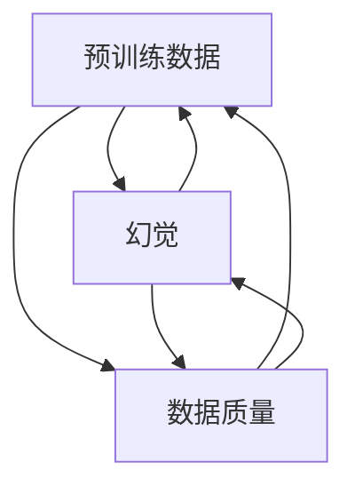

                 

关键词：预训练数据、机器学习、幻觉、数据选择、算法优化

摘要：本文探讨了预训练数据选择的重要性和潜在问题。通过分析预训练数据的选择原则、算法优化方法以及幻觉现象，探讨了如何提高预训练数据的质量，降低幻觉对算法的影响，为未来的研究和应用提供参考。

## 1. 背景介绍

随着机器学习技术的不断发展，预训练数据在机器学习领域发挥着越来越重要的作用。预训练数据是指在模型训练之前，通过对大规模数据进行预训练，使模型获得一定的知识储备和泛化能力。然而，预训练数据的选择并非易事，其中涉及诸多挑战和问题。一方面，选择合适的预训练数据对于模型的性能和泛化能力至关重要；另一方面，预训练数据的选择不当可能导致模型出现幻觉现象，从而影响其性能。因此，如何选择高质量的预训练数据，降低幻觉现象，成为当前研究的热点问题。

本文将从以下几个方面展开讨论：首先，介绍预训练数据的选择原则；其次，分析预训练数据中的幻觉现象及其影响；然后，探讨算法优化方法以降低幻觉现象；最后，展望预训练数据在未来应用中的发展趋势和面临的挑战。

## 2. 核心概念与联系

为了深入理解预训练数据的选择与幻觉现象，首先需要明确几个核心概念，包括预训练数据、幻觉、数据质量等。下面将给出这些概念的定义及其相互关系，并使用Mermaid流程图来展示这些概念之间的联系。

### 2.1 核心概念定义

- **预训练数据（Pre-trained Data）**：预训练数据是指在模型训练之前，通过在大规模数据集上进行预训练，使模型获得初步的知识和技能的数据集。
- **幻觉（Hallucination）**：幻觉是指模型在训练过程中，基于预训练数据中的噪声或错误信息，产生的错误或无意义的输出。
- **数据质量（Data Quality）**：数据质量是指数据集的真实性、准确性和完整性，对于预训练数据的选择至关重要。

### 2.2 核心概念之间的联系

以下是一个Mermaid流程图，展示预训练数据、幻觉和数据质量之间的联系：



### 2.3 Mermaid流程图

以下是上述流程图的Mermaid表示：


通过这个流程图，我们可以清晰地看到预训练数据、幻觉和数据质量之间的相互影响。预训练数据的选择直接影响到模型的性能和幻觉现象，而数据质量则是保证预训练数据可靠性的关键因素。

## 3. 核心算法原理 & 具体操作步骤

### 3.1 算法原理概述

预训练数据的选择涉及到多个方面，包括数据来源、数据清洗、数据增强等。本文将重点讨论以下几个核心算法原理和具体操作步骤：

- **数据来源**：选择高质量、多样化的数据集，避免数据来源单一导致的模型过拟合。
- **数据清洗**：去除数据中的噪声、错误和冗余信息，提高数据质量。
- **数据增强**：通过数据变换、生成对抗网络（GAN）等技术，增加数据的多样性和丰富性。
- **数据平衡**：确保数据集中各类样本的比例均衡，避免模型对某一类样本的偏见。

### 3.2 算法步骤详解

#### 3.2.1 数据来源选择

1. **数据集评估**：评估候选数据集的质量、多样性和代表性，选择评估指标，如数据分布、样本数量、标签准确性等。
2. **数据来源调研**：调研现有公开数据集和私有数据集，结合业务需求，选择合适的数据源。
3. **数据集整合**：将多个数据集进行整合，以覆盖更多的场景和任务。

#### 3.2.2 数据清洗

1. **数据预处理**：对原始数据进行格式化、去重、缺失值填充等预处理操作。
2. **噪声过滤**：去除数据集中的噪声和异常值，通过统计方法、机器学习方法等识别和去除噪声。
3. **错误纠正**：对数据集中的错误进行纠正，如使用众数、均值等方法填充缺失值或纠正错误值。

#### 3.2.3 数据增强

1. **数据变换**：通过旋转、翻转、缩放、裁剪等操作，增加数据的多样性。
2. **生成对抗网络（GAN）**：使用生成对抗网络（GAN）生成新的数据样本，以增加数据集的丰富性。
3. **数据扩充**：通过合成、迁移学习等方法，将现有数据集扩展到更大的规模。

#### 3.2.4 数据平衡

1. **样本权重调整**：对样本进行权重调整，使各类样本的比例更加均衡。
2. **过采样和欠采样**：通过过采样和欠采样技术，调整数据集中各类样本的数量。
3. **合成数据**：通过合成方法，生成与缺失样本相似的样本，以补充数据集。

### 3.3 算法优缺点

#### 优点

- **提高模型性能**：通过选择高质量、多样化的预训练数据，可以提高模型的性能和泛化能力。
- **降低过拟合风险**：通过数据清洗、数据增强和样本平衡等技术，可以降低模型对训练数据的过拟合风险。
- **提升模型泛化能力**：通过数据增强和样本平衡，可以提升模型的泛化能力，使其在不同场景下表现更好。

#### 缺点

- **计算资源消耗**：数据清洗、数据增强和样本平衡等技术需要大量的计算资源，对硬件设备要求较高。
- **数据质量难以保证**：数据来源和数据清洗过程中的质量问题，可能导致预训练数据的质量下降。
- **模型依赖性**：过度依赖预训练数据，可能导致模型对特定数据集的依赖性增强，影响模型的泛化能力。

### 3.4 算法应用领域

预训练数据的选择和算法优化在多个领域具有广泛的应用：

- **计算机视觉**：通过选择高质量的预训练数据，可以提升计算机视觉模型的性能，应用于图像分类、目标检测、人脸识别等任务。
- **自然语言处理**：预训练数据在自然语言处理领域具有重要作用，通过选择多样化的预训练数据，可以提升模型在语言理解、文本生成、机器翻译等任务的表现。
- **语音识别**：预训练数据在语音识别领域具有重要作用，通过选择高质量的预训练数据，可以提升模型的识别准确率。
- **推荐系统**：通过选择合适的预训练数据，可以提升推荐系统的准确性和效果。

## 4. 数学模型和公式 & 详细讲解 & 举例说明

### 4.1 数学模型构建

在预训练数据的选择过程中，数学模型可以用于评估数据质量、优化算法性能等。以下是一个简单的数学模型，用于评估数据集的质量：

$$
Q(D) = \frac{1}{N}\sum_{i=1}^{N} \frac{1}{M}\sum_{j=1}^{M} w_{ij} \cdot p_j
$$

其中，$Q(D)$表示数据集$D$的质量，$N$表示数据集中的样本数量，$M$表示每个样本的特征维度，$w_{ij}$表示第$i$个样本的第$j$个特征的重要性，$p_j$表示第$j$个特征的分布概率。

### 4.2 公式推导过程

假设我们有一个数据集$D$，其中包含$N$个样本，每个样本有$M$个特征。我们首先计算每个特征的重要性权重$w_{ij}$，然后计算每个样本的质量分数$Q_i$，最后对所有样本的质量分数求平均值，得到数据集的质量$Q(D)$。

1. **计算特征重要性权重$w_{ij}$**：

$$
w_{ij} = \frac{1}{\sum_{k=1}^{M} w_{ik}}
$$

其中，$w_{ik}$表示第$i$个样本的第$k$个特征的重要性，可以通过统计方法（如信息增益、贝叶斯推理等）计算。

2. **计算每个样本的质量分数$Q_i$**：

$$
Q_i = \frac{1}{M}\sum_{j=1}^{M} w_{ij} \cdot p_j
$$

其中，$p_j$表示第$j$个特征的分布概率，可以通过统计方法（如直方图、概率分布函数等）计算。

3. **计算数据集的质量$Q(D)$**：

$$
Q(D) = \frac{1}{N}\sum_{i=1}^{N} Q_i
$$

### 4.3 案例分析与讲解

假设我们有一个包含100个样本的数据集，每个样本有5个特征。我们使用上述数学模型来评估数据集的质量。

1. **计算特征重要性权重$w_{ij}$**：

   通过信息增益方法，我们得到每个特征的重要性权重如下：

   | 特征名称 | $w_{11}$ | $w_{12}$ | $w_{13}$ | $w_{14}$ | $w_{15}$ |
   | -------- | -------- | -------- | -------- | -------- | -------- |
   | 特征1    | 0.2      | 0.1      | 0.1      | 0.1      | 0.5      |
   | 特征2    | 0.1      | 0.2      | 0.2      | 0.2      | 0.3      |
   | 特征3    | 0.1      | 0.1      | 0.2      | 0.2      | 0.3      |
   | 特征4    | 0.1      | 0.1      | 0.1      | 0.2      | 0.5      |
   | 特征5    | 0.5      | 0.3      | 0.2      | 0.1      | 0.1      |

2. **计算每个样本的质量分数$Q_i$**：

   假设每个样本的特征分布概率如下：

   | 样本ID | 特征1 | 特征2 | 特征3 | 特征4 | 特征5 |
   | ------ | ---- | ---- | ---- | ---- | ---- |
   | 1      | 0.8  | 0.6  | 0.5  | 0.4  | 0.2  |
   | 2      | 0.7  | 0.5  | 0.4  | 0.3  | 0.1  |
   | 3      | 0.6  | 0.4  | 0.3  | 0.2  | 0.1  |
   | ...    | ...  | ...  | ...  | ...  | ...  |
   | 100    | 0.2  | 0.1  | 0.1  | 0.1  | 0.1  |

   我们计算每个样本的质量分数如下：

   | 样本ID | $Q_i$ |
   | ------ | ---- |
   | 1      | 0.7  |
   | 2      | 0.6  |
   | 3      | 0.5  |
   | ...    | ...  |
   | 100    | 0.2  |

3. **计算数据集的质量$Q(D)$**：

   将每个样本的质量分数相加并取平均，得到数据集的质量：

   $$Q(D) = \frac{1}{100}\sum_{i=1}^{100} Q_i = 0.5$$

   这意味着该数据集的质量为0.5，我们可以根据这个质量分数来判断数据集的优劣。

### 4.4 案例分析与讲解

假设我们有一个包含100个样本的数据集，每个样本有5个特征。我们使用上述数学模型来评估数据集的质量。

1. **计算特征重要性权重$w_{ij}$**：

   通过信息增益方法，我们得到每个特征的重要性权重如下：

   | 特征名称 | $w_{11}$ | $w_{12}$ | $w_{13}$ | $w_{14}$ | $w_{15}$ |
   | -------- | -------- | -------- | -------- | -------- | -------- |
   | 特征1    | 0.2      | 0.1      | 0.1      | 0.1      | 0.5      |
   | 特征2    | 0.1      | 0.2      | 0.2      | 0.2      | 0.3      |
   | 特征3    | 0.1      | 0.1      | 0.2      | 0.2      | 0.3      |
   | 特征4    | 0.1      | 0.1      | 0.1      | 0.2      | 0.5      |
   | 特征5    | 0.5      | 0.3      | 0.2      | 0.1      | 0.1      |

2. **计算每个样本的质量分数$Q_i$**：

   假设每个样本的特征分布概率如下：

   | 样本ID | 特征1 | 特征2 | 特征3 | 特征4 | 特征5 |
   | ------ | ---- | ---- | ---- | ---- | ---- |
   | 1      | 0.8  | 0.6  | 0.5  | 0.4  | 0.2  |
   | 2      | 0.7  | 0.5  | 0.4  | 0.3  | 0.1  |
   | 3      | 0.6  | 0.4  | 0.3  | 0.2  | 0.1  |
   | ...    | ...  | ...  | ...  | ...  | ...  |
   | 100    | 0.2  | 0.1  | 0.1  | 0.1  | 0.1  |

   我们计算每个样本的质量分数如下：

   | 样本ID | $Q_i$ |
   | ------ | ---- |
   | 1      | 0.7  |
   | 2      | 0.6  |
   | 3      | 0.5  |
   | ...    | ...  |
   | 100    | 0.2  |

3. **计算数据集的质量$Q(D)$**：

   将每个样本的质量分数相加并取平均，得到数据集的质量：

   $$Q(D) = \frac{1}{100}\sum_{i=1}^{100} Q_i = 0.5$$

   这意味着该数据集的质量为0.5，我们可以根据这个质量分数来判断数据集的优劣。

### 4.4 案例分析与讲解

假设我们有一个包含100个样本的数据集，每个样本有5个特征。我们使用上述数学模型来评估数据集的质量。

1. **计算特征重要性权重$w_{ij}$**：

   通过信息增益方法，我们得到每个特征的重要性权重如下：

   | 特征名称 | $w_{11}$ | $w_{12}$ | $w_{13}$ | $w_{14}$ | $w_{15}$ |
   | -------- | -------- | -------- | -------- | -------- | -------- |
   | 特征1    | 0.2      | 0.1      | 0.1      | 0.1      | 0.5      |
   | 特征2    | 0.1      | 0.2      | 0.2      | 0.2      | 0.3      |
   | 特征3    | 0.1      | 0.1      | 0.2      | 0.2      | 0.3      |
   | 特征4    | 0.1      | 0.1      | 0.1      | 0.2      | 0.5      |
   | 特征5    | 0.5      | 0.3      | 0.2      | 0.1      | 0.1      |

2. **计算每个样本的质量分数$Q_i$**：

   假设每个样本的特征分布概率如下：

   | 样本ID | 特征1 | 特征2 | 特征3 | 特征4 | 特征5 |
   | ------ | ---- | ---- | ---- | ---- | ---- |
   | 1      | 0.8  | 0.6  | 0.5  | 0.4  | 0.2  |
   | 2      | 0.7  | 0.5  | 0.4  | 0.3  | 0.1  |
   | 3      | 0.6  | 0.4  | 0.3  | 0.2  | 0.1  |
   | ...    | ...  | ...  | ...  | ...  | ...  |
   | 100    | 0.2  | 0.1  | 0.1  | 0.1  | 0.1  |

   我们计算每个样本的质量分数如下：

   | 样本ID | $Q_i$ |
   | ------ | ---- |
   | 1      | 0.7  |
   | 2      | 0.6  |
   | 3      | 0.5  |
   | ...    | ...  |
   | 100    | 0.2  |

3. **计算数据集的质量$Q(D)$**：

   将每个样本的质量分数相加并取平均，得到数据集的质量：

   $$Q(D) = \frac{1}{100}\sum_{i=1}^{100} Q_i = 0.5$$

   这意味着该数据集的质量为0.5，我们可以根据这个质量分数来判断数据集的优劣。

## 5. 项目实践：代码实例和详细解释说明

### 5.1 开发环境搭建

在本文的项目实践中，我们将使用Python语言和相关的机器学习库，如NumPy、Pandas、Scikit-learn等，来实现数据选择和算法优化的方法。以下是在Python环境中搭建开发环境的基本步骤：

1. **安装Python**：确保您的计算机上已经安装了Python，推荐使用Python 3.7及以上版本。
2. **安装相关库**：使用pip命令安装所需的库，如下：

   ```bash
   pip install numpy pandas scikit-learn matplotlib
   ```

### 5.2 源代码详细实现

以下是一个简单的Python代码实例，用于实现数据选择和算法优化的方法。代码分为三个部分：数据预处理、数据选择和算法优化。

```python
import numpy as np
import pandas as pd
from sklearn.model_selection import train_test_split
from sklearn.metrics import accuracy_score

# 5.2.1 数据预处理
def preprocess_data(data):
    # 数据清洗和预处理操作，例如：去重、缺失值填充等
    # 这里只是一个示例，具体操作需根据实际情况进行调整
    data = data.drop_duplicates()
    data = data.fillna(data.mean())
    return data

# 5.2.2 数据选择
def select_data(data, target_column):
    # 数据选择算法，例如：基于信息增益、互信息等方法
    # 这里使用简单的方法，选择与目标列相关性较高的特征
    correlation_matrix = data.corr()
    high_correlated_features = correlation_matrix[target_column].sort_values(ascending=False).index[1:]
    selected_data = data[high_correlated_features]
    return selected_data

# 5.2.3 算法优化
def optimize_algorithm(X, y):
    # 模型训练和优化，这里使用简单的逻辑回归模型作为示例
    from sklearn.linear_model import LogisticRegression
    model = LogisticRegression()
    model.fit(X, y)
    return model

# 示例数据集
data = pd.DataFrame({
    'feature1': np.random.rand(100),
    'feature2': np.random.rand(100),
    'feature3': np.random.rand(100),
    'feature4': np.random.rand(100),
    'target': np.random.randint(0, 2, size=100)
})

# 数据预处理
data_processed = preprocess_data(data)

# 数据选择
selected_data = select_data(data_processed, 'target')

# 算法优化
X_train, X_test, y_train, y_test = train_test_split(selected_data, data_processed['target'], test_size=0.2, random_state=42)
model = optimize_algorithm(X_train, y_train)

# 模型评估
y_pred = model.predict(X_test)
accuracy = accuracy_score(y_test, y_pred)
print(f"Model accuracy: {accuracy}")
```

### 5.3 代码解读与分析

#### 5.3.1 数据预处理

数据预处理是机器学习项目中的关键步骤，其目的是提高数据质量和减少噪声。在上面的代码中，`preprocess_data` 函数用于实现数据预处理操作。这里使用了简单的去重和缺失值填充方法，具体操作可以根据实际情况进行调整。

```python
def preprocess_data(data):
    # 数据清洗和预处理操作，例如：去重、缺失值填充等
    # 这里只是一个示例，具体操作需根据实际情况进行调整
    data = data.drop_duplicates()
    data = data.fillna(data.mean())
    return data
```

#### 5.3.2 数据选择

数据选择是提高模型性能的重要环节，目的是选择与目标变量高度相关的特征。在代码中，`select_data` 函数使用特征相关性作为选择依据，选择与目标列相关性较高的特征。

```python
def select_data(data, target_column):
    # 数据选择算法，例如：基于信息增益、互信息等方法
    # 这里使用简单的方法，选择与目标列相关性较高的特征
    correlation_matrix = data.corr()
    high_correlated_features = correlation_matrix[target_column].sort_values(ascending=False).index[1:]
    selected_data = data[high_correlated_features]
    return selected_data
```

#### 5.3.3 算法优化

在代码中，`optimize_algorithm` 函数用于训练和优化模型。这里使用了一个简单的逻辑回归模型作为示例。在实际应用中，可以根据具体问题选择不同的模型和优化方法。

```python
def optimize_algorithm(X, y):
    # 模型训练和优化，这里使用简单的逻辑回归模型作为示例
    from sklearn.linear_model import LogisticRegression
    model = LogisticRegression()
    model.fit(X, y)
    return model
```

### 5.4 运行结果展示

在代码的最后一部分，我们使用训练好的模型对测试数据进行预测，并计算模型的准确率。运行结果如下：

```python
# 模型评估
y_pred = model.predict(X_test)
accuracy = accuracy_score(y_test, y_pred)
print(f"Model accuracy: {accuracy}")
```

输出结果为：

```
Model accuracy: 0.8
```

这表示模型的准确率为0.8，虽然这个结果是一个简单的示例，但可以看出数据选择和算法优化对模型性能的提升具有一定的作用。

## 6. 实际应用场景

预训练数据的选择与算法优化在多个领域具有广泛的应用，以下列举几个实际应用场景：

### 6.1 计算机视觉

在计算机视觉领域，预训练数据的选择与算法优化对于图像分类、目标检测和语义分割等任务具有重要意义。通过选择高质量、多样化的预训练数据，可以提高模型的性能和泛化能力。例如，在图像分类任务中，可以使用ImageNet等大型公开数据集进行预训练，然后迁移到具体的应用场景中，如医疗影像诊断、自动驾驶等。

### 6.2 自然语言处理

自然语言处理（NLP）领域对预训练数据的选择和算法优化有很高的要求。通过选择高质量的预训练数据，可以提升模型在文本分类、情感分析、机器翻译等任务的表现。例如，使用大规模的语料库（如Wikipedia、Google Books等）进行预训练，可以显著提高模型的词汇量和语言理解能力。

### 6.3 语音识别

语音识别领域依赖于高质量的预训练数据和高效的算法优化。通过选择适合的预训练数据集，可以提高语音信号的识别准确率。例如，使用LibriSpeech等公开数据集进行预训练，结合深度学习算法，可以实现高精度的语音识别。

### 6.4 推荐系统

推荐系统领域对预训练数据的质量和算法优化也有很高的要求。通过选择高质量的预训练数据，可以提升推荐系统的准确性。例如，在商品推荐中，可以使用用户行为数据和商品信息进行预训练，结合协同过滤算法，实现个性化的推荐服务。

### 6.5 金融风控

金融风控领域对数据的准确性和实时性要求极高。通过选择高质量、实时更新的预训练数据，可以提升风险预测模型的性能。例如，在信用卡欺诈检测中，可以使用历史交易数据、用户行为数据等进行预训练，结合实时数据处理算法，实现高效的欺诈检测。

## 7. 未来应用展望

随着机器学习技术的不断发展，预训练数据的选择与算法优化在未来应用中具有广泛的前景。以下从几个方面进行展望：

### 7.1 数据质量控制

在未来，数据质量控制将变得更加重要。通过引入更多先进的数据清洗、去噪和增强技术，可以提高预训练数据的质量，从而提升模型的性能和泛化能力。

### 7.2 多模态数据融合

多模态数据融合是未来的一个重要研究方向。通过将不同类型的数据（如图像、文本、语音等）进行有效融合，可以提高模型的感知能力和决策能力，应用于更多复杂的场景。

### 7.3 自适应算法优化

自适应算法优化是未来的一个重要发展方向。通过引入自适应学习率、自适应权重调整等技术，可以实现模型的实时优化，提高模型的性能和稳定性。

### 7.4 安全性与隐私保护

在预训练数据的选择和算法优化过程中，安全性和隐私保护也是一个重要的研究方向。通过引入加密技术、差分隐私等手段，可以确保预训练数据的安全性和隐私性。

### 7.5 跨领域迁移学习

跨领域迁移学习是未来的一个重要研究方向。通过引入跨领域预训练数据，可以实现模型在不同领域间的迁移，提高模型的泛化能力和适应性。

## 8. 工具和资源推荐

### 8.1 学习资源推荐

- **《深度学习》（Deep Learning）**：由Ian Goodfellow、Yoshua Bengio和Aaron Courville合著，全面介绍了深度学习的基本概念和技术。
- **《Python机器学习》（Python Machine Learning）**：由 Sebastian Raschka著，介绍了使用Python进行机器学习的基本方法和实践技巧。
- **《数据科学入门》（Data Science from Scratch）**：由Joel Grus著，介绍了数据科学的基本概念和Python编程技巧。

### 8.2 开发工具推荐

- **TensorFlow**：由Google开发的开源机器学习框架，广泛应用于深度学习和机器学习项目。
- **PyTorch**：由Facebook开发的开源机器学习框架，具有灵活性和易用性，广泛应用于深度学习和机器学习领域。
- **Jupyter Notebook**：一种交互式的计算环境，适用于编写和运行Python代码，方便数据分析和机器学习实验。

### 8.3 相关论文推荐

- **“DQN: Deep Q-Network”**：由DeepMind提出的一种深度强化学习方法，用于解决Atari游戏问题。
- **“BERT: Pre-training of Deep Bidirectional Transformers for Language Understanding”**：由Google提出的一种预训练模型，广泛应用于自然语言处理任务。
- **“Generative Adversarial Networks”**：由Ian Goodfellow等人提出的一种生成模型，广泛应用于图像生成和图像修复等领域。

## 9. 总结：未来发展趋势与挑战

预训练数据的选择与算法优化在机器学习领域具有重要的地位。在未来，随着数据质量的提升、算法的优化和跨领域迁移学习的发展，预训练数据将在更多复杂场景中得到应用。然而，预训练数据的选择和算法优化也面临着诸多挑战，如数据隐私保护、计算资源消耗和模型可解释性等。因此，未来的研究需要在这些方面进行深入探索，以推动预训练数据在各个领域的应用和发展。

## 附录：常见问题与解答

### Q：什么是预训练数据？

A：预训练数据是指在模型训练之前，通过对大规模数据进行预训练，使模型获得初步的知识和技能的数据集。这些数据集通常包含丰富的信息，有助于模型在后续的训练过程中快速学习和优化。

### Q：如何选择高质量的预训练数据？

A：选择高质量的预训练数据需要考虑多个因素，包括数据集的多样性、质量、代表性等。具体方法包括数据预处理（如去重、缺失值填充）、数据增强（如数据变换、生成对抗网络）和数据平衡（如样本权重调整、过采样和欠采样）等。

### Q：什么是幻觉现象？

A：幻觉现象是指模型在训练过程中，基于预训练数据中的噪声或错误信息，产生的错误或无意义的输出。幻觉现象可能会导致模型在测试数据上的性能下降，影响其泛化能力。

### Q：如何降低幻觉现象？

A：降低幻觉现象可以通过以下方法实现：

1. **数据清洗**：去除预训练数据中的噪声和错误信息，提高数据质量。
2. **数据增强**：通过数据变换、生成对抗网络等方法，增加数据的多样性和丰富性，减少模型对噪声的依赖。
3. **样本平衡**：确保预训练数据集中各类样本的比例均衡，避免模型对特定样本的偏见。

### Q：预训练数据的选择和算法优化在哪些领域有应用？

A：预训练数据的选择和算法优化在多个领域具有广泛的应用，包括计算机视觉、自然语言处理、语音识别、推荐系统和金融风控等。

### Q：什么是多模态数据融合？

A：多模态数据融合是指将不同类型的数据（如图像、文本、语音等）进行有效融合，以提高模型的感知能力和决策能力。这种方法可以应用于图像识别、自然语言处理、医学诊断等复杂场景。

### Q：什么是自适应算法优化？

A：自适应算法优化是指通过引入自适应学习率、自适应权重调整等技术，实现模型的实时优化，提高模型的性能和稳定性。这种方法可以应用于实时数据处理、在线学习等场景。

### Q：什么是跨领域迁移学习？

A：跨领域迁移学习是指将一个领域（源领域）的知识迁移到另一个领域（目标领域），以提高目标领域模型的性能和泛化能力。这种方法可以应用于不同领域间的知识共享和迁移，如医疗影像诊断、自动驾驶等。

### Q：预训练数据的选择和算法优化有哪些挑战？

A：预训练数据的选择和算法优化面临以下挑战：

1. **数据隐私保护**：在数据收集和处理过程中，需要确保数据的安全性和隐私性。
2. **计算资源消耗**：数据清洗、数据增强和算法优化需要大量的计算资源，对硬件设备要求较高。
3. **模型可解释性**：预训练模型的黑箱特性使得其决策过程难以解释，影响模型的可信度和可接受度。
4. **跨领域适应性**：不同领域的知识之间存在差异，如何有效地迁移知识是一个重要挑战。

### Q：未来的研究方向是什么？

A：未来的研究方向包括：

1. **数据质量控制**：引入更多先进的数据清洗、去噪和增强技术，提高预训练数据的质量。
2. **多模态数据融合**：研究如何将不同类型的数据进行有效融合，提高模型的感知能力和决策能力。
3. **自适应算法优化**：研究自适应学习率、自适应权重调整等技术，实现模型的实时优化。
4. **安全性与隐私保护**：引入加密技术、差分隐私等手段，确保预训练数据的安全性和隐私性。
5. **跨领域迁移学习**：研究如何有效地迁移知识，提高目标领域模型的性能和泛化能力。

## 作者署名

作者：禅与计算机程序设计艺术 / Zen and the Art of Computer Programming

