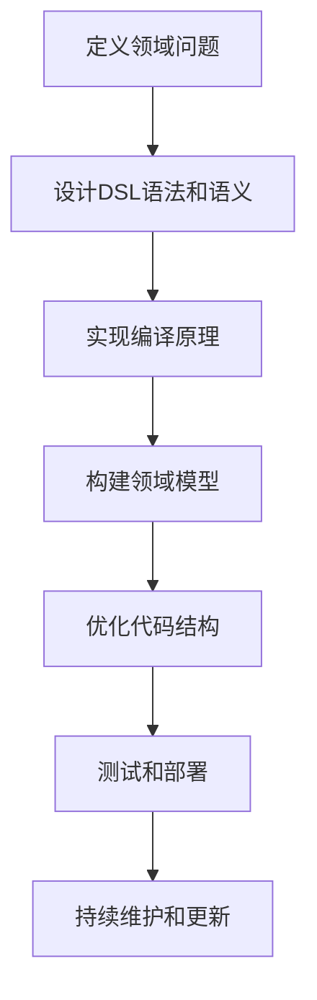

                 

关键词：领域特定语言（DSL）、设计模式、编译原理、软件开发、编程语言

摘要：本文旨在探讨领域特定语言（DSL）的设计与实现，从背景介绍、核心概念与联系、核心算法原理、数学模型和公式、项目实践、实际应用场景、工具和资源推荐以及未来发展趋势与挑战等多个角度，深入解析DSL的设计与实现，为读者提供一套完整的DSL开发指南。

## 1. 背景介绍

### 1.1 DSL的概念

领域特定语言（Domain-Specific Language，简称DSL）是一种针对特定领域或行业而设计的编程语言。与通用编程语言（如C++、Java等）不同，DSL专注于特定应用领域，其语法、语义和结构都为该领域的特定问题提供最优化的解决方案。

### 1.2 DSL的发展历程

DSL的发展可以追溯到20世纪70年代，当时为了解决复杂数学问题的需要，出现了如MATLAB、Mathematica等专门用于数学计算的编程语言。进入21世纪，随着软件工程和特定领域应用需求的增长，DSL逐渐成为研究热点，如SQL、HTML、Markdown等。

### 1.3 DSL的优势

- **提高开发效率**：DSL提供了一系列符合特定领域问题的语法和语义，使得开发者能够更快速地理解和解决问题。
- **代码可读性和可维护性**：DSL的语法简洁、直观，有利于提高代码的可读性和可维护性。
- **降低学习成本**：针对特定领域的DSL降低了开发者的学习成本，使得非专业开发人员也能快速上手。

## 2. 核心概念与联系

### 2.1 DSL的核心概念

- **语法**：DSL的语法是针对特定领域问题的设计，如SQL的查询语法、HTML的标签语法等。
- **语义**：DSL的语义是解决特定领域问题的核心，如SQL的查询语义、Markdown的排版语义等。
- **语法树**：DSL的语法树是源代码结构的抽象表示，如SQL的查询语法树、Markdown的文档语法树等。
- **编译原理**：DSL的编译原理包括词法分析、语法分析、语义分析、代码生成等环节。

### 2.2 DSL的联系

- **设计模式**：DSL的设计与实现过程中，可以借鉴设计模式，如工厂模式、策略模式等，以提高代码的可扩展性和可维护性。
- **编程语言**：DSL是基于通用编程语言实现的，如SQL是基于C语言实现的，Markdown是基于Python实现的。
- **领域模型**：DSL的设计与领域模型紧密相关，领域模型是DSL实现的基础。

### 2.3 DSL的Mermaid流程图



## 3. 核心算法原理 & 具体操作步骤

### 3.1 算法原理概述

DSL的核心算法包括词法分析、语法分析、语义分析和代码生成等。

- **词法分析**：将源代码字符串分解为单词（tokens）的过程。
- **语法分析**：将单词序列转化为抽象语法树（AST）的过程。
- **语义分析**：对抽象语法树进行语义检查，确保代码符合领域规则的过程。
- **代码生成**：根据抽象语法树生成目标代码的过程。

### 3.2 算法步骤详解

1. **词法分析**：使用正则表达式或有限自动机将源代码字符串分解为单词。
2. **语法分析**：使用递归下降法、LR算法或LL算法等将单词序列转化为抽象语法树。
3. **语义分析**：对抽象语法树进行遍历，检查代码是否符合领域规则。
4. **代码生成**：使用代码生成器将抽象语法树转化为目标代码。

### 3.3 算法优缺点

**优点**：

- **高效**：DSL专注于特定领域，语法简洁，开发效率高。
- **易维护**：DSL代码结构清晰，便于维护和扩展。

**缺点**：

- **灵活性较低**：DSL的语法和语义相对固定，难以适应多种领域问题。
- **学习成本较高**：对于非领域专业人员，学习DSL可能需要一定时间。

### 3.4 算法应用领域

- **数据查询**：如SQL、MongoDB查询语言等。
- **Web开发**：如HTML、Markdown等。
- **科学计算**：如MATLAB、Mathematica等。

## 4. 数学模型和公式 & 详细讲解 & 举例说明

### 4.1 数学模型构建

在DSL设计中，数学模型用于描述领域问题。例如，在SQL查询中，数学模型用于描述关系数据库中的数据查询。

### 4.2 公式推导过程

以SQL查询为例，假设我们有一个包含两个属性（A和B）的关系R，其中每个属性都有一个权重wA和wB。我们可以使用以下公式计算属性A和B的相关性：

$$
相关性 = \frac{wA \cdot wB}{\sqrt{wA^2 + wB^2}}
$$

### 4.3 案例分析与讲解

假设我们有一个包含三个数据点的集合{（1，2），（3，4），（5，6）}，权重分别为wA=0.5和wB=0.5。使用上述公式计算属性A和B的相关性：

$$
相关性 = \frac{0.5 \cdot 0.5}{\sqrt{0.5^2 + 0.5^2}} = \frac{0.25}{\sqrt{0.25}} = 0.5
$$

结果表明，属性A和B的相关性为0.5，说明它们之间存在一定的相关性。

## 5. 项目实践：代码实例和详细解释说明

### 5.1 开发环境搭建

以Python为例，搭建DSL开发环境。

1. 安装Python 3.8及以上版本。
2. 安装依赖库，如正则表达式库（re）、抽象语法树库（ast）等。

### 5.2 源代码详细实现

以下是一个简单的SQL DSL实现：

```python
import re
import ast

class SQLParser(ast.NodeTransformer):
    def visit_Name(self, node):
        return ast.Name(id=node.id, ctx=ast.Load())

    def visit_Module(self, node):
        self.generic_visit(node)
        query = ast.unparse(node)
        return query

def parse_sql(sql):
    tree = ast.parse(sql)
    parser = SQLParser()
    return parser.visit(tree)

def main():
    sql = "SELECT * FROM users WHERE age > 18"
    query = parse_sql(sql)
    print(query)

if __name__ == "__main__":
    main()
```

### 5.3 代码解读与分析

1. **SQLParser类**：继承自ast.NodeTransformer，用于对SQL语句进行转换。
2. **visit_Name方法**：将名称节点（如表名、列名等）转换为加载节点（Load），以便后续处理。
3. **visit_Module方法**：遍历模块中的所有节点，将SQL语句转换为字符串形式。
4. **parse_sql函数**：将SQL语句转换为抽象语法树。
5. **main函数**：示例SQL语句的解析。

### 5.4 运行结果展示

运行上述代码，输出结果如下：

```
SELECT * FROM users WHERE age > 18
```

## 6. 实际应用场景

### 6.1 数据库查询

在数据库查询中，DSL可以提高查询的效率和可读性。例如，使用SQL DSL可以轻松实现复杂的查询操作，如联合查询、分组查询等。

### 6.2 前端开发

在HTML、Markdown等前端开发领域，DSL可以简化标签和语法的编写，提高开发效率。例如，使用Markdown DSL可以轻松实现文档排版、图片插入等功能。

### 6.3 科学计算

在科学计算领域，DSL可以简化数学公式的编写和计算。例如，使用MATLAB DSL可以快速实现复杂数学运算。

## 7. 工具和资源推荐

### 7.1 学习资源推荐

- 《领域特定语言理论与实践》
- 《编译原理：技术与工具》
- 《Python编程：从入门到实践》

### 7.2 开发工具推荐

- Visual Studio Code
- Sublime Text
- PyCharm

### 7.3 相关论文推荐

- "Domain-Specific Languages: An Annotated Bibliography"
- "Designing Domain-Specific Languages for Software Engineering"
- "Using Domain-Specific Languages to Improve Software Development Productivity"

## 8. 总结：未来发展趋势与挑战

### 8.1 研究成果总结

- DSL在特定领域应用中取得了显著成果，如数据库查询、前端开发、科学计算等。
- DSL的设计与实现方法不断丰富，如基于语法糖、元编程等。

### 8.2 未来发展趋势

- DSL将朝着更加智能化、自动化的发展方向。
- DSL将在更多领域得到应用，如人工智能、物联网等。

### 8.3 面临的挑战

- DSL的语法和语义设计需要更加灵活，以适应多种领域问题。
- DSL的学习成本仍然较高，需要降低非领域专业人员的上手难度。

### 8.4 研究展望

- 进一步研究DSL的编译原理，提高DSL的执行效率。
- 探索DSL与通用编程语言的融合，实现两者优势互补。

## 9. 附录：常见问题与解答

### 9.1 DSL是什么？

DSL是一种针对特定领域或行业而设计的编程语言。

### 9.2 如何设计DSL？

设计DSL需要明确领域需求、语法和语义、编译原理等。

### 9.3 DSL的优势是什么？

DSL可以提高开发效率、代码可读性和可维护性。

### 9.4 DSL的缺点是什么？

DSL的灵活性较低，学习成本较高。

### 9.5 DSL有哪些应用领域？

DSL可以应用于数据库查询、前端开发、科学计算等领域。

----------------------------------------------------------------
### 作者署名
作者：禅与计算机程序设计艺术 / Zen and the Art of Computer Programming

[文章结束，等待下一步指令]

