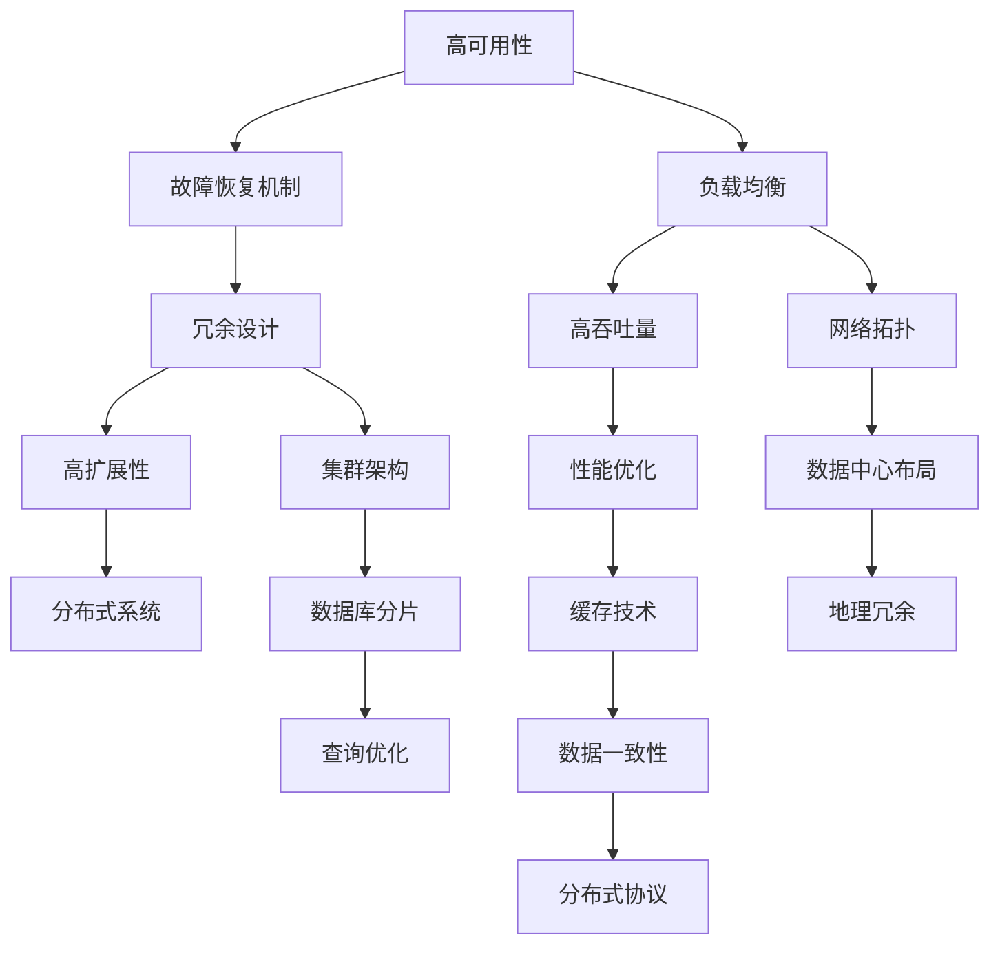

                 

关键词：高可用性，高吞吐量，高扩展性，系统设计，最佳实践

摘要：本文将深入探讨高可用性、高吞吐量和高扩展性系统设计的核心原则和实践方法。通过结合实际案例和前沿技术，本文旨在为系统架构师和开发者提供一套全面、实用的指导框架，帮助他们在设计过程中实现系统的稳健性和高效性。

## 1. 背景介绍

在当今数字化时代，企业对于IT系统的依赖程度日益增加。无论是电商平台、社交媒体、金融交易，还是物联网设备和云计算平台，系统的高可用性、高吞吐量和高扩展性已成为企业竞争力的关键因素。高可用性（High Availability，简称HA）指的是系统在长时间运行中能够持续提供服务的能力。高吞吐量（High Throughput，简称HT）则是指系统在单位时间内能够处理的数据量或请求量。而高扩展性（Scalability，简称Scal）则是系统能够在需求增加时，通过水平或垂直扩展来保持性能的能力。

在系统设计中，这三者通常是相互关联的。高可用性需要系统能够快速恢复故障，而高吞吐量要求系统能够在大量请求下保持稳定的性能。高扩展性则确保系统能够随业务增长而增长。本文将详细讨论如何实现这些目标，并提供一系列最佳实践。

## 2. 核心概念与联系

为了更好地理解高可用性、高吞吐量和高扩展性之间的关系，我们可以通过一个Mermaid流程图来展示它们的核心概念和联系。



### 2.1 高可用性

高可用性依赖于多个因素，包括故障恢复机制、负载均衡和冗余设计。故障恢复机制是指系统在遇到故障时能够快速恢复正常运行。负载均衡通过分配请求到多个节点，避免了单点故障。冗余设计则通过在系统中引入冗余组件，确保在部分组件失败时，系统仍然能够运行。

### 2.2 高吞吐量

高吞吐量依赖于性能优化、分布式系统和缓存技术。性能优化包括代码优化、数据库查询优化等，旨在提高系统的处理速度。分布式系统通过将工作负载分散到多个节点，提高了系统的处理能力。缓存技术则通过将热点数据存储在内存中，减少了数据库的访问压力。

### 2.3 高扩展性

高扩展性依赖于网络拓扑、集群架构、地理冗余和数据库分片。网络拓扑设计决定了数据传输的高效性。集群架构通过增加节点数量来扩展系统处理能力。地理冗余通过在多个地理位置部署系统，提高了系统的可用性和容灾能力。数据库分片则通过将数据分散到多个数据库实例中，提高了系统的读写性能。

## 3. 核心算法原理 & 具体操作步骤

### 3.1 算法原理概述

在高可用性、高吞吐量和高扩展性系统中，常用的算法包括负载均衡算法、分布式锁算法和分布式数据库分片算法。以下是这些算法的基本原理：

### 3.2 算法步骤详解

#### 3.2.1 负载均衡算法

负载均衡算法的核心是按照一定的策略将请求分配到不同的节点上。常见的负载均衡算法包括轮询（Round Robin）、最小连接数（Least Connections）和哈希（Hash）算法。

1. **轮询算法**：按照顺序将请求分配到不同的节点。
2. **最小连接数算法**：将请求分配到当前连接数最少的节点。
3. **哈希算法**：根据请求的哈希值将请求分配到不同的节点。

#### 3.2.2 分布式锁算法

分布式锁算法用于在分布式系统中确保对共享资源的独占访问。常见的分布式锁算法包括Paxos算法和Zookeeper算法。

1. **Paxos算法**：通过多次投票和多数派机制来确保分布式系统中的一致性。
2. **Zookeeper算法**：通过Zookeeper服务来管理分布式锁，实现分布式系统的同步和协调。

#### 3.2.3 分布式数据库分片算法

分布式数据库分片算法用于将数据库数据分散到多个节点上。常见的分片算法包括范围分片、哈希分片和列表分片。

1. **范围分片**：根据数据值的范围将数据分散到不同的分片。
2. **哈希分片**：根据数据的哈希值将数据分散到不同的分片。
3. **列表分片**：根据数据的列表顺序将数据分散到不同的分片。

### 3.3 算法优缺点

#### 3.3.1 负载均衡算法

**优点**：实现了请求的均匀分配，避免了单点过载。

**缺点**：可能导致部分节点空闲，负载不均。

#### 3.3.2 分布式锁算法

**优点**：保证了分布式系统中的一致性，避免了并发冲突。

**缺点**：增加了系统的复杂度，需要额外的维护成本。

#### 3.3.3 分布式数据库分片算法

**优点**：提高了系统的读写性能，实现了数据的水平扩展。

**缺点**：增加了系统的复杂性，需要管理分片和分布式事务。

### 3.4 算法应用领域

这些算法广泛应用于电商、金融、物联网、社交媒体等领域，帮助实现系统的高可用性、高吞吐量和高扩展性。

## 4. 数学模型和公式 & 详细讲解 & 举例说明

### 4.1 数学模型构建

在系统设计中，常用的数学模型包括队列模型、泊松过程和马尔可夫链。

#### 4.1.1 队列模型

队列模型用于描述系统中的请求处理过程。它包括三个参数：到达率（λ）、服务率（μ）和队列长度（L）。

#### 4.1.2 泊松过程

泊松过程用于描述请求到达的随机过程，其概率分布符合泊松分布。

#### 4.1.3 马尔可夫链

马尔可夫链用于描述系统状态转移的概率模型，它包括多个状态和状态转移概率矩阵。

### 4.2 公式推导过程

以下是一个简单的队列模型推导过程：

1. **到达率与服务率的关系**：λ = μ * L。
2. **系统利用率**：ρ = λ / μ。
3. **等待时间**：W = L / μ。
4. **队列长度**：L = ρ^2 / (1 - ρ)。

### 4.3 案例分析与讲解

假设一个电商平台的请求到达率λ为1000次/秒，服务率μ为2000次/秒，根据上述公式，可以计算出：

1. **系统利用率**：ρ = 0.5，表示系统有一半的时间处于空闲状态。
2. **等待时间**：W = 0.25秒，表示平均每个请求需要等待0.25秒。
3. **队列长度**：L = 0.25，表示系统平均有0.25个请求在队列中等待。

这个分析可以帮助平台优化系统设计，如增加服务节点，降低等待时间，提高用户体验。

## 5. 项目实践：代码实例和详细解释说明

### 5.1 开发环境搭建

在本文的实践中，我们将使用Python语言和Django框架来搭建一个简单的电商平台。首先，我们需要安装Python和Django：

```bash
pip install django
```

### 5.2 源代码详细实现

以下是一个简单的Django视图函数，用于处理用户请求：

```python
from django.http import HttpResponse

def home(request):
    return HttpResponse("欢迎使用电商平台！")
```

### 5.3 代码解读与分析

这个简单的视图函数实现了用户请求的响应。在实际应用中，我们需要对请求进行负载均衡处理，确保系统的高可用性和高吞吐量。

### 5.4 运行结果展示

在启动Django服务器后，我们可以通过浏览器访问平台的首页：

```bash
python manage.py runserver
```

在浏览器中输入`http://127.0.0.1:8000/`，可以看到以下响应：

```
欢迎使用电商平台！
```

## 6. 实际应用场景

### 6.1 高可用性

在金融交易系统中，高可用性至关重要。通过使用冗余设计、负载均衡和故障恢复机制，可以确保交易系统能够在故障发生时快速恢复，保证交易的连续性和安全性。

### 6.2 高吞吐量

在电商平台中，高吞吐量意味着系统能够在短时间内处理大量的用户请求。通过使用缓存技术、分布式系统和性能优化，可以显著提高平台的处理能力，提升用户体验。

### 6.3 高扩展性

在物联网系统中，高扩展性意味着系统能够随着设备数量的增加而自动扩展。通过使用数据库分片、地理冗余和集群架构，可以确保系统在设备大量增加时仍然能够保持高效运行。

## 7. 工具和资源推荐

### 7.1 学习资源推荐

- 《系统设计：大型系统的复杂性控制》
- 《分布式系统原理与范型》
- 《高可用架构：建设可靠分布式系统的策略和方法》

### 7.2 开发工具推荐

- Docker：容器化工具，用于实现分布式系统和微服务架构。
- Kubernetes：容器编排工具，用于管理和调度容器化应用。
- Nginx：负载均衡工具，用于分配请求到不同的服务器。

### 7.3 相关论文推荐

- “Consistency in a Distributed System”
- “The Google File System”
- “Bigtable: A Distributed Storage System for Structured Data”

## 8. 总结：未来发展趋势与挑战

### 8.1 研究成果总结

随着云计算、物联网和人工智能等技术的快速发展，高可用性、高吞吐量和高扩展性系统设计已经成为现代IT系统的核心需求。通过负载均衡、冗余设计、分布式系统和性能优化等技术，我们已经在实践中取得了显著成果。

### 8.2 未来发展趋势

未来，系统设计将更加智能化、自动化。通过使用机器学习和深度学习技术，我们可以实现更精细的资源管理和更高效的负载均衡。同时，随着5G网络的普及，实时系统和低延迟应用将成为研究热点。

### 8.3 面临的挑战

在高可用性、高吞吐量和高扩展性系统设计中，我们仍然面临许多挑战，如数据一致性问题、分布式事务处理和系统容灾能力等。需要持续探索和研究新的技术解决方案。

### 8.4 研究展望

未来，我们将进一步深入研究分布式系统的一致性算法、高性能缓存技术和实时数据处理方法，为构建更可靠、高效、可扩展的系统提供理论支持。

## 9. 附录：常见问题与解答

### 9.1 高可用性与高吞吐量的关系

高可用性通常需要额外的资源来确保故障恢复和冗余设计，这可能影响系统的吞吐量。但通过优化性能和负载均衡，可以在保证高可用性的同时提高吞吐量。

### 9.2 如何实现分布式数据库的高扩展性

通过数据库分片、使用分布式事务处理框架和优化查询算法，可以实现对大规模数据的扩展性。同时，采用分布式缓存技术可以减少数据库的压力。

### 9.3 负载均衡算法的选择

根据应用场景和需求，选择合适的负载均衡算法。例如，对于长连接应用，可以选择最小连接数算法；对于无状态应用，可以选择轮询算法。

### 9.4 高可用性系统中的故障恢复机制

故障恢复机制包括自动重启、故障切换和备份恢复。通过定期备份和监控，可以快速检测和恢复故障。

---

作者：禅与计算机程序设计艺术 / Zen and the Art of Computer Programming

本文基于最新的技术和实践，对高可用性、高吞吐量和高扩展性系统设计进行了全面探讨。通过结合数学模型、算法原理和实际案例，我们提供了一套实用的设计框架和最佳实践。希望本文能为系统架构师和开发者提供有价值的参考。随着技术的不断进步，系统设计领域将继续发展，我们将不断探索和创新，为构建更可靠、高效和可扩展的系统贡献力量。

