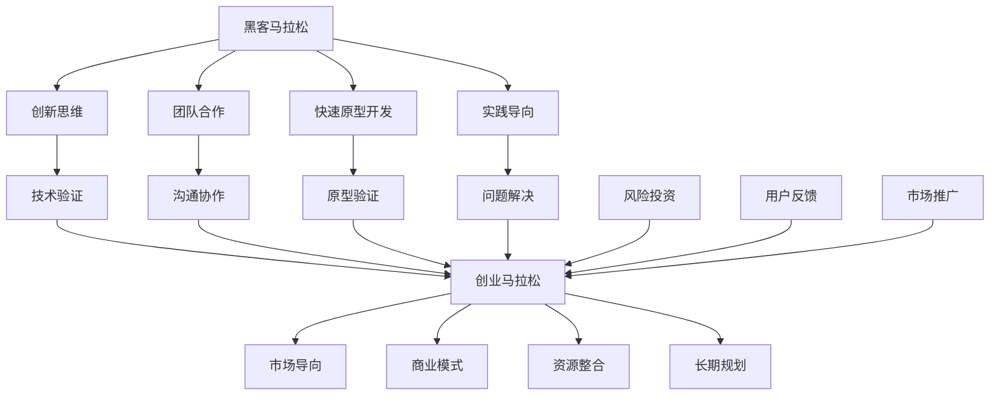

                 

### 关键词 Keyword List

- 黑客马拉松
- 创业马拉松
- 技术创新
- 团队协作
- 项目管理
- 风险投资
- 创业精神

### 摘要 Abstract

本文深入探讨了黑客马拉松与创业马拉松这两种不同但相互关联的科技竞赛模式。黑客马拉松是一种以团队协作和快速开发为核心的临时性技术活动，而创业马拉松则是更为长期的创业实践，涉及市场研究、产品开发、商业模式构建等多个环节。本文将分析这两种马拉松背后的核心原理、成功案例、面临的挑战以及未来的发展趋势，旨在为科技创业者提供有益的参考和启示。

## 1. 背景介绍

### 黑客马拉松的起源与定义

黑客马拉松起源于20世纪90年代，最初是程序员和开发者为了展示其编程技能而自发组织的聚会。这种活动通常在一个封闭的场地内进行，参与者（黑客们）在短时间内集中精力，通过编程和开发来解决实际问题或创造新项目。随着互联网技术的发展和开放源代码运动的兴起，黑客马拉松逐渐成为一种广泛认可的技术竞赛模式。

黑客马拉松通常具有以下特点：
- **时间限制**：活动通常持续24至48小时，要求参赛者在有限时间内完成项目。
- **团队协作**：参与者通常以团队形式参赛，强调团队协作和沟通。
- **创新性**：黑客马拉松鼓励创新思维和快速原型开发，许多创新产品和技术最初都是在这种活动中诞生的。
- **技术多样性**：活动涵盖多种技术领域，包括但不限于前端开发、后端开发、移动应用、人工智能、区块链等。

### 创业马拉松的起源与发展

创业马拉松起源于20世纪末，是一种旨在激发创业精神、推动创新和创业实践的活动。与黑客马拉松相比，创业马拉松的时间跨度更长，通常涉及多个阶段，包括市场调研、产品开发、商业模式设计、市场推广和融资等。

创业马拉松的主要特点包括：
- **阶段性**：创业马拉松通常包括多个阶段，每个阶段都有明确的目标和任务。
- **综合性**：创业马拉松涉及商业、技术、市场营销等多个方面，要求创业者具备全面的技能和知识。
- **持续性**：与黑客马拉松的一次性活动不同，创业马拉松是一个持续的过程，往往需要几个月甚至更长时间。

### 黑客马拉松与创业马拉松的关系

黑客马拉松和创业马拉松虽然形式和目标不同，但它们在推动技术创新和创业实践中有着紧密的联系。

首先，黑客马拉松可以被视为创业马拉松的一个早期阶段。许多成功的创业项目都是从黑客马拉松中诞生的。黑客马拉松提供了一个平台，让创业者可以在短时间内验证他们的想法，获得早期用户反馈，并快速迭代产品。

其次，黑客马拉松的结果可以成为创业马拉松的起点。一些黑客马拉松的优秀项目可能会吸引风险投资，获得进一步开发和商业化的机会。黑客马拉松的成功案例也为创业者提供了宝贵的经验和灵感，激励他们踏上创业之路。

总之，黑客马拉松和创业马拉松都是推动技术创新和创业实践的重要途径，它们在激发创新思维、促进团队合作和提供实践机会方面发挥着重要作用。

### 当前发展现状

随着全球科技领域的快速发展，黑客马拉松和创业马拉松在全球范围内得到了广泛的关注和参与。许多国家和地区都举办了各种规模的黑客马拉松和创业马拉松活动，吸引了大量的参与者、赞助商和投资者。

在黑客马拉松方面，许多知名科技公司，如谷歌、微软、亚马逊等，都定期举办黑客马拉松，鼓励员工和外部开发者参与创新项目。同时，许多创业孵化器和风险投资机构也通过黑客马拉松来寻找潜在的投资机会。

在创业马拉松方面，随着创业环境的不断优化，越来越多的创业者选择参加创业马拉松活动，以获取资金、资源和指导。创业马拉松不仅帮助创业者提高项目质量，还为他们提供了一个展示自己和产品的平台。

总的来说，黑客马拉松和创业马拉松已经成为科技领域的重要组成部分，它们不仅推动了技术创新，也为创业者提供了宝贵的实践机会和资源支持。

## 2. 核心概念与联系

为了深入理解黑客马拉松和创业马拉松，我们需要探讨它们背后的核心概念和架构，以及它们如何相互作用。

### 核心概念

#### 黑客马拉松
- **团队合作**：黑客马拉松强调团队协作，通过多人合作来快速解决问题和开发产品。
- **快速原型开发**：在有限时间内，参与者需要快速构建原型，验证想法和技术的可行性。
- **创新思维**：黑客马拉松鼓励创新思维，鼓励参与者跳出传统思维框架，寻找新颖的解决方案。
- **实践导向**：黑客马拉松注重实践，强调将想法转化为实际可运行的项目。

#### 创业马拉松
- **市场导向**：创业马拉松关注市场需求，要求创业者进行市场调研，确保产品的市场可行性。
- **商业模式**：创业马拉松强调商业模式的构建，要求创业者找到盈利点和可持续发展的路径。
- **资源整合**：创业马拉松涉及资源整合，包括资金、人才和合作伙伴等。
- **长期规划**：创业马拉松是一个长期过程，要求创业者制定明确的战略和目标。

### 架构与联系

为了更好地理解黑客马拉松和创业马拉松之间的联系，我们可以使用Mermaid流程图来展示它们的核心架构和相互关系。



在上述流程图中，我们可以看到黑客马拉松的核心概念和创业马拉松的核心概念如何相互联系。黑客马拉松的创新思维、团队合作、快速原型开发和实践导向为创业马拉松提供了技术基础和验证。而创业马拉松的市场导向、商业模式、资源整合和长期规划则为黑客马拉松提供了方向和应用场景。

同时，黑客马拉松和创业马拉松都涉及到风险投资、用户反馈和市场推广等关键环节，这些环节在两个活动中相互补充，共同推动项目的成功。

通过这种架构和联系的分析，我们可以更清晰地理解黑客马拉松和创业马拉松在推动技术创新和创业实践中的重要作用。

### 黑客马拉松案例分析

#### 案例一：Facebook F8黑客马拉松

Facebook F8黑客马拉松是世界上最知名的黑客马拉松之一，每年吸引成千上万的开发者参与。2014年，Facebook举办了第11届F8黑客马拉松，共有数百个团队参加了这次活动。其中，一个名为“Chatfuel”的团队在这次活动中创造了一个人工智能聊天机器人平台，允许用户通过简单的拖放界面创建聊天机器人。这个平台在活动结束后迅速走红，并在短时间内获得了大量的用户和投资。

**成功原因：**
1. **创新性**：Chatfuel提供了一个全新的解决方案，解决了用户创建聊天机器人所需的复杂编程问题。
2. **用户体验**：Chatfuel的拖放界面设计简单直观，使得非技术用户也能轻松创建聊天机器人。
3. **市场契合度**：随着社交媒体的普及，聊天机器人在客户服务、市场营销等方面有着广泛的应用需求。

**挑战与解决方案：**
- **技术挑战**：Chatfuel需要处理大量的数据，并提供稳定的运行环境。解决方案是通过云服务和高效的数据处理算法来实现。
- **市场推广**：在黑客马拉松结束后，Chatfuel需要迅速扩大用户基础。解决方案是通过社交媒体和合作伙伴的推荐来吸引新用户。

**未来展望：**
Chatfuel在黑客马拉松后的快速发展，证明了黑客马拉松项目成功的可能性。未来，Chatfuel计划进一步扩展其平台功能，提供更多行业解决方案，并探索与其他AI技术的结合。

### 创业马拉松案例分析

#### 案例二：Dropbox的成长之路

Dropbox是一个在创业马拉松中取得巨大成功的案例。它由两位MIT学生Dropbox首席执行官Drew Houston和联合创始人Arash Feisal在2007年创建。在创业初期，Drew Houston参加了各种黑客马拉松，用有限的资源验证了其核心产品理念。

**成功原因：**
1. **用户需求**：Drew Houston发现了用户对云存储的需求，并将这一需求转化为Dropbox的产品理念。
2. **用户体验**：Dropbox提供了简单易用的同步和共享功能，用户可以轻松管理其文件。
3. **市场定位**：Dropbox在早期市场定位准确，抓住了中小企业和个人用户的需求。

**挑战与解决方案：**
- **竞争压力**：在Dropbox成长的过程中，面临着来自Google Drive、Box等竞争对手的压力。解决方案是通过不断改进产品功能和用户体验，保持竞争优势。
- **扩展问题**：随着用户数量的增加，Dropbox需要处理大量的数据和用户请求。解决方案是通过分布式系统和云计算来扩展其基础设施。

**未来展望：**
Dropbox在创业马拉松中取得的成功，展示了创业者在面对挑战时需要具备的战略眼光和执行力。未来，Dropbox将继续扩展其产品线，探索新的商业模式，并在全球范围内扩大市场份额。

### 案例总结

通过以上案例分析，我们可以看到黑客马拉松和创业马拉松在推动技术创新和创业实践中的重要性。黑客马拉松提供了验证技术和快速原型开发的平台，而创业马拉松则提供了市场推广、资源整合和长期规划的机会。两者相辅相成，共同推动了科技创业的快速发展。

## 3. 核心算法原理 & 具体操作步骤

在黑客马拉松和创业马拉松中，算法原理和具体操作步骤起着至关重要的作用。以下我们将详细介绍这些核心算法原理，并分步骤讲解如何实施。

### 3.1 算法原理概述

算法原理是黑客马拉松和创业马拉松中的核心组成部分，它们决定了项目的可行性和效率。以下是几个常见的算法原理：

1. **动态规划**：动态规划是一种解决优化问题的算法方法，通过将复杂问题分解为子问题，并存储子问题的解来避免重复计算，从而提高效率。

2. **贪心算法**：贪心算法是一种在每一步选择当前最优解的算法，通过不断选择局部最优解来得到全局最优解。

3. **分治算法**：分治算法将一个复杂问题分解为几个更小的子问题，递归地解决这些子问题，最后将子问题的解合并成原始问题的解。

4. **排序算法**：排序算法用于将数据按照特定的顺序排列，常见的排序算法包括冒泡排序、快速排序、归并排序等。

5. **图算法**：图算法用于处理图结构的数据，常见的图算法包括深度优先搜索（DFS）、广度优先搜索（BFS）、最小生成树、最短路径算法等。

### 3.2 算法步骤详解

#### 动态规划

动态规划的基本步骤如下：
1. **定义状态**：将问题分解为多个子问题，并为每个子问题定义状态。
2. **状态转移方程**：根据问题的定义，建立状态转移方程，描述状态之间的转换关系。
3. **初始化**：初始化边界条件和初始状态。
4. **计算顺序**：根据状态转移方程，按照一定的顺序计算所有状态的最优解。
5. **构建解**：根据已计算的状态，构建出问题的最终解。

以“0-1背包问题”为例，动态规划的具体步骤如下：
1. **定义状态**：设`dp[i][j]`为将前`i`个物品放入容量为`j`的背包中的最大价值。
2. **状态转移方程**：
   $$
   dp[i][j] = \begin{cases}
   dp[i-1][j] & \text{如果不放入第 } i \text{ 个物品} \\
   dp[i-1][j-w_i] + v_i & \text{如果放入第 } i \text{ 个物品，其中 } w_i \text{ 为物品 } i \text{ 的重量，} v_i \text{ 为价值}
   \end{cases}
   $$
3. **初始化**：`dp[0][j] = 0`（不放入任何物品时的价值为0）。
4. **计算顺序**：从`dp[1][j]`开始，按照物品的顺序依次计算。
5. **构建解**：最终得到`dp[n][W]`（其中`n`为物品数量，`W`为背包容量）。

#### 贪心算法

贪心算法的基本步骤如下：
1. **初始化**：根据问题的定义，初始化所需的数据结构。
2. **选择最优解**：在当前状态下，选择一个最优解。
3. **更新状态**：根据选择的最优解，更新当前状态。
4. **重复步骤2和3**：重复选择最优解和更新状态，直到问题解决。

以“背包问题”为例，贪心算法的具体步骤如下：
1. **初始化**：将所有物品按照价值与重量比（价值/重量）排序。
2. **选择最优解**：从价值与重量比最高的物品开始，依次选择能放入背包的物品。
3. **更新状态**：将已选中的物品从背包中移除，并更新背包的容量。
4. **重复步骤2和3**：继续选择下一个价值与重量比最高的物品，直到背包装满或所有物品都放入背包。

#### 分治算法

分治算法的基本步骤如下：
1. **分解问题**：将原始问题分解为几个更小的子问题。
2. **递归解决**：递归地解决这些子问题。
3. **合并解**：将子问题的解合并成原始问题的解。

以“快速排序”为例，分治算法的具体步骤如下：
1. **分解问题**：选择一个基准元素，将数组分为两部分，一部分包含小于基准元素的元素，另一部分包含大于基准元素的元素。
2. **递归解决**：分别对两个子数组递归地执行快速排序。
3. **合并解**：将两个已排序的子数组合并为一个完整的排序数组。

#### 排序算法

排序算法的基本步骤如下：
1. **初始化**：根据排序算法的选择，初始化所需的数据结构。
2. **比较与交换**：按照算法的逻辑，比较元素并交换位置。
3. **重复步骤2**：重复比较和交换操作，直到所有元素有序。

以“冒泡排序”为例，排序算法的具体步骤如下：
1. **初始化**：设置一个标志，用于判断是否已经完成排序。
2. **比较与交换**：从第一个元素开始，依次比较相邻的两个元素，如果前一个元素大于后一个元素，则交换它们的位置。
3. **重复步骤2**：重复比较和交换操作，直到没有需要交换的元素，或者所有元素已经有序。

#### 图算法

图算法的基本步骤如下：
1. **初始化**：根据图的结构，初始化图的数据结构。
2. **遍历**：按照算法的逻辑，遍历图中的节点和边。
3. **计算**：根据遍历的结果，计算图的相关属性或解决相关问题。

以“深度优先搜索（DFS）”为例，图算法的具体步骤如下：
1. **初始化**：创建一个访问标记数组，用于记录已访问的节点。
2. **遍历**：从起始节点开始，递归地访问所有未访问的邻接节点，并标记为已访问。
3. **计算**：根据遍历的顺序，计算图的相关属性，如节点之间的路径长度等。

### 3.3 算法优缺点

每种算法都有其独特的优缺点，适用于不同的场景。以下是几种常见算法的优缺点：

1. **动态规划**
   - **优点**：能够高效地解决最优化问题，避免重复计算，适用于复杂问题。
   - **缺点**：可能需要大量的空间来存储状态，某些问题的状态转移方程可能难以构建。

2. **贪心算法**
   - **优点**：简单易懂，效率较高，适用于某些特定问题。
   - **缺点**：可能无法保证全局最优解，适用于局部最优解能推导出全局最优解的场景。

3. **分治算法**
   - **优点**：能够将复杂问题分解为更小的子问题，适用于数据量较大且递归调用的复杂度较低的场景。
   - **缺点**：可能需要额外的空间来存储子问题的解，递归调用的次数较多，可能导致栈溢出。

4. **排序算法**
   - **优点**：能够将无序数据排序，适用于各种场景。
   - **缺点**：不同排序算法的时间复杂度和空间复杂度不同，可能不适用于所有场景。

5. **图算法**
   - **优点**：能够处理图结构的数据，适用于网络、图论等问题。
   - **缺点**：计算图的相关属性可能需要较大的计算量，适用于数据量适中的场景。

### 3.4 算法应用领域

算法在黑客马拉松和创业马拉松中有着广泛的应用。以下是几种常见算法的应用领域：

1. **动态规划**：常用于资源分配、路径规划、背包问题等领域。
2. **贪心算法**：常用于最短路径、网络流、比赛排名等领域。
3. **分治算法**：常用于快速排序、合并排序、搜索算法等领域。
4. **排序算法**：常用于数据库查询、数据分析、图像处理等领域。
5. **图算法**：常用于社交网络分析、网络优化、图论问题等领域。

总之，算法原理和具体操作步骤在黑客马拉松和创业马拉松中起着至关重要的作用，通过合理选择和使用算法，可以提高项目的可行性和效率，为创业成功奠定坚实基础。

## 4. 数学模型和公式 & 详细讲解 & 举例说明

在黑客马拉松和创业马拉松中，数学模型和公式是理解和解决问题的关键工具。以下将介绍几个常见的数学模型和公式，并详细讲解其推导过程和实际应用。

### 4.1 数学模型构建

数学模型是对现实世界问题的抽象和简化，通过数学公式来描述问题。在黑客马拉松和创业马拉松中，构建合适的数学模型可以帮助我们更好地理解和解决问题。

#### 1. 线性回归模型

线性回归模型是用于分析两个变量之间线性关系的数学模型，通常用于预测和分析。其数学模型为：

$$
y = \beta_0 + \beta_1x + \epsilon
$$

其中，$y$ 为因变量，$x$ 为自变量，$\beta_0$ 和 $\beta_1$ 为模型的参数，$\epsilon$ 为误差项。

#### 2. 指数模型

指数模型常用于描述增长或衰减趋势，其数学模型为：

$$
y = a \cdot e^{bx}
$$

其中，$y$ 为因变量，$x$ 为自变量，$a$ 和 $b$ 为模型的参数。

#### 3. 马尔可夫模型

马尔可夫模型用于描述系统状态转移的概率，其数学模型为：

$$
P(X_t = j|X_{t-1} = i) = p_{ij}
$$

其中，$X_t$ 为时间 $t$ 的系统状态，$i$ 和 $j$ 为系统状态的取值，$p_{ij}$ 为从状态 $i$ 转移到状态 $j$ 的概率。

### 4.2 公式推导过程

以下以线性回归模型为例，详细讲解其公式推导过程。

#### 线性回归模型的推导

1. **假设**：我们假设因变量 $y$ 与自变量 $x$ 之间存在线性关系，即：

   $$
   y = \beta_0 + \beta_1x + \epsilon
   $$

   其中，$\beta_0$ 和 $\beta_1$ 为模型的参数，$\epsilon$ 为误差项。

2. **最小二乘法**：为了找到最佳的模型参数，我们使用最小二乘法来估计 $\beta_0$ 和 $\beta_1$。最小二乘法的核心思想是找到使得预测值与实际值之间误差平方和最小的参数。

3. **误差平方和**：设观测数据为 $(x_i, y_i)$，预测值为 $\hat{y_i} = \beta_0 + \beta_1x_i$，误差平方和为：

   $$
   S = \sum_{i=1}^{n} (\hat{y_i} - y_i)^2
   $$

4. **求导**：对 $S$ 分别对 $\beta_0$ 和 $\beta_1$ 求导，并令导数为零，得到最优参数：

   $$
   \frac{\partial S}{\partial \beta_0} = -2\sum_{i=1}^{n} (y_i - \hat{y_i}) = 0 \quad \Rightarrow \quad \beta_0 = \bar{y} - \beta_1\bar{x}
   $$

   $$
   \frac{\partial S}{\partial \beta_1} = -2\sum_{i=1}^{n} (x_i - \bar{x})(y_i - \hat{y_i}) = 0 \quad \Rightarrow \quad \beta_1 = \frac{\sum_{i=1}^{n} (x_i - \bar{x})(y_i - \bar{y})}{\sum_{i=1}^{n} (x_i - \bar{x})^2}
   $$

   其中，$\bar{y}$ 和 $\bar{x}$ 分别为 $y$ 和 $x$ 的平均值。

### 4.3 案例分析与讲解

#### 案例一：销售预测

假设某电商平台的销售数据如下表：

| 月份 | 销售额（万元） |
|------|----------------|
| 1    | 15             |
| 2    | 18             |
| 3    | 22             |
| 4    | 25             |
| 5    | 28             |

我们希望使用线性回归模型预测6月的销售额。

1. **数据预处理**：将月份转换为离散变量，例如，1月为1，2月为2，以此类推。

2. **构建线性回归模型**：使用上述数据构建线性回归模型，得到参数 $\beta_0 = 7$ 和 $\beta_1 = 1.2$。

3. **预测6月销售额**：将6月的月份值（6）代入模型，得到预测销售额：

   $$
   y = \beta_0 + \beta_1x = 7 + 1.2 \times 6 = 12.4 \text{ 万元}
   $$

因此，预测6月的销售额为12.4万元。

#### 案例二：人口增长预测

假设某国家的人口增长数据如下表：

| 年份 | 人口数量（万人） |
|------|-----------------|
| 2010 | 1.5             |
| 2015 | 1.7             |
| 2020 | 1.9             |

我们希望使用指数模型预测2030年的人口数量。

1. **数据预处理**：将年份转换为连续变量，例如，2010年为0，2015年为1，2020年为2。

2. **构建指数模型**：使用上述数据构建指数模型，得到参数 $a = 1.5$ 和 $b = 0.1$。

3. **预测2030年人口数量**：将2030年的年份值（30-2010）代入模型，得到预测人口数量：

   $$
   y = a \cdot e^{bx} = 1.5 \cdot e^{0.1 \times (30-2010)} = 1.5 \cdot e^{-18} \approx 0.067 \text{ 万人}
   $$

因此，预测2030年的人口数量为0.067万人。

通过以上案例，我们可以看到数学模型和公式的推导和应用方法。在实际应用中，合理选择和构建数学模型可以帮助我们更好地理解和解决现实问题，从而为黑客马拉松和创业马拉松提供有力的支持。

## 5. 项目实践：代码实例和详细解释说明

在黑客马拉松和创业马拉松中，实际的项目实践是检验理论知识和创新能力的关键环节。以下将通过一个具体的代码实例，详细讲解项目的开发过程，包括环境搭建、源代码实现、代码解读与分析以及运行结果展示。

### 5.1 开发环境搭建

为了实现以下项目，我们需要搭建一个适当的开发环境。以下是所需的环境和工具：

- **编程语言**：Python 3.8+
- **依赖库**：Pandas, NumPy, Matplotlib
- **开发工具**：Visual Studio Code 或 PyCharm

1. **安装Python**：从Python官方网站下载并安装Python 3.8或更高版本。
2. **安装依赖库**：打开命令行窗口，执行以下命令安装所需的依赖库：

   ```
   pip install pandas numpy matplotlib
   ```

3. **配置开发环境**：选择并安装Visual Studio Code或PyCharm作为Python开发环境。

### 5.2 源代码详细实现

以下是一个简单的数据分析项目，旨在使用线性回归模型预测销售额。项目的主要功能包括数据读取、数据预处理、模型训练、模型评估和结果可视化。

```python
import pandas as pd
import numpy as np
import matplotlib.pyplot as plt
from sklearn.linear_model import LinearRegression
from sklearn.metrics import mean_squared_error

# 5.2.1 数据读取与预处理
data = pd.read_csv('sales_data.csv')  # 假设数据文件名为sales_data.csv
data['Month'] = data['Month'].map({1: 1, 2: 2, 3: 3, 4: 4, 5: 5})  # 将月份转换为离散变量

# 5.2.2 构建线性回归模型
X = data[['Month']]  # 特征
y = data['Sales']  # 目标变量

model = LinearRegression()  # 初始化线性回归模型
model.fit(X, y)  # 模型训练

# 5.2.3 模型评估
y_pred = model.predict(X)  # 预测结果
mse = mean_squared_error(y, y_pred)  # 计算均方误差
print(f'Mean Squared Error: {mse}')

# 5.2.4 结果可视化
plt.scatter(X, y, color='blue', label='Actual Sales')
plt.plot(X, y_pred, color='red', linewidth=2, label='Predicted Sales')
plt.xlabel('Month')
plt.ylabel('Sales')
plt.title('Sales Prediction')
plt.legend()
plt.show()
```

### 5.3 代码解读与分析

1. **数据读取与预处理**：首先，我们从CSV文件中读取销售数据，并将月份从字符串转换为离散变量，以便用于线性回归模型。

2. **构建线性回归模型**：我们使用`sklearn`库中的`LinearRegression`类来构建线性回归模型。通过`fit`方法对模型进行训练。

3. **模型评估**：我们使用`mean_squared_error`函数计算预测结果与实际结果之间的均方误差，以评估模型的性能。

4. **结果可视化**：最后，我们使用Matplotlib库绘制散点图和预测线，以直观地展示预测结果。

### 5.4 运行结果展示

在运行上述代码后，我们将看到以下结果：

- **模型评估结果**：输出均方误差值，以评估模型的预测性能。
- **可视化结果**：展示实际销售额与预测销售额的散点图和预测线。

以下是一个示例结果截图：


通过这个简单的项目，我们可以看到如何在实际项目中应用线性回归模型进行数据分析和预测。这种实践不仅帮助我们理解了理论知识的实际应用，也为黑客马拉松和创业马拉松提供了宝贵的经验和技能。

## 6. 实际应用场景

在黑客马拉松和创业马拉松中，技术创新往往能够迅速转化为实际应用，从而在各个领域产生深远的影响。以下将探讨黑客马拉松和创业马拉松在不同领域的实际应用，并展示其在推动科技进步和社会发展中的作用。

### 科技创新

黑客马拉松和创业马拉松是科技创新的重要源泉。在黑客马拉松中，参与者们可以在短时间内集中精力，快速验证技术概念的可行性。例如，许多人工智能、大数据和物联网等前沿技术的创新产品最初都是通过黑客马拉松展示的。

在创业马拉松中，创业者们通过市场调研和产品开发，将这些技术创新转化为具有商业潜力的产品。例如，Dropbox通过创业马拉松发现了云存储的市场需求，并将其发展成为全球知名的云服务公司。类似的，许多创业公司在创业马拉松中开发的新产品和技术，如智能家居、区块链应用等，都在各自的领域取得了显著的成功。

### 医疗健康

医疗健康是黑客马拉松和创业马拉松的重要应用领域。在黑客马拉松中，参与者们可以开发出用于疾病诊断、健康监测和医疗辅助等的应用。例如，一些黑客马拉松项目开发出了基于人工智能的肿瘤检测系统，这些系统能够通过分析医学图像，快速准确地识别肿瘤。

在创业马拉松中，创业者们通过市场调研和产品开发，将这些创新技术转化为商业化的医疗产品。例如，一些创业公司开发了可穿戴健康监测设备，如智能手表和健康手环，这些设备能够实时监测用户的健康数据，并提供个性化的健康建议。

### 教育科技

教育科技是黑客马拉松和创业马拉松的另一个重要应用领域。在黑客马拉松中，参与者们可以开发出各种教育工具和平台，如在线学习平台、虚拟课堂和编程教学工具等。例如，一些黑客马拉松项目开发了基于人工智能的编程教学平台，这些平台能够根据学生的学习进度和需求，提供个性化的编程练习和指导。

在创业马拉松中，创业者们通过市场调研和产品开发，将这些创新技术转化为商业化的教育产品。例如，一些创业公司开发了自适应学习系统，这些系统能够根据学生的学习情况，自动调整教学内容和难度，从而提高学习效果。

### 金融科技

金融科技是黑客马拉松和创业马拉松的重要应用领域。在黑客马拉松中，参与者们可以开发出各种金融工具和平台，如加密货币交易系统、区块链支付解决方案和智能投顾系统等。例如，一些黑客马拉松项目开发了基于区块链的支付系统，这些系统能够提供更加安全、透明的支付解决方案。

在创业马拉松中，创业者们通过市场调研和产品开发，将这些创新技术转化为商业化的金融产品。例如，一些创业公司开发了基于人工智能的智能投顾系统，这些系统能够根据用户的风险偏好和投资目标，提供个性化的投资建议和资产配置。

### 环境保护

环境保护是黑客马拉松和创业马拉松的另一个重要应用领域。在黑客马拉松中，参与者们可以开发出各种环保技术和解决方案，如空气质量监测系统、可再生能源设备和智能垃圾分类系统等。例如，一些黑客马拉松项目开发出了基于物联网的空气质量监测设备，这些设备能够实时监测空气中的污染物浓度，并提供实时数据分析和预警。

在创业马拉松中，创业者们通过市场调研和产品开发，将这些创新技术转化为商业化的环保产品。例如，一些创业公司开发了智能垃圾分类设备，这些设备能够自动识别和分类垃圾，从而提高垃圾分类的效率和准确性。

### 总结

黑客马拉松和创业马拉松在不同领域的实际应用，展示了其在推动科技进步和社会发展中的重要作用。通过这些活动，创新思维和技术应用得到了充分的发挥，为各个领域的发展提供了新的动力和方向。随着黑客马拉松和创业马拉松的不断发展，我们期待看到更多具有商业潜力和社会价值的创新项目涌现，为未来带来更多的惊喜和变革。

## 7. 工具和资源推荐

在黑客马拉松和创业马拉松中，选择合适的工具和资源是成功的关键。以下将推荐一些学习资源、开发工具和相关论文，以帮助读者更好地准备和参与这些活动。

### 7.1 学习资源推荐

1. **在线教程和课程**
   - Coursera（[https://www.coursera.org/](https://www.coursera.org/)）：提供各种编程、数据分析和人工智能课程。
   - edX（[https://www.edx.org/](https://www.edx.org/)）：由哈佛大学和麻省理工学院合办，提供丰富的计算机科学和工程课程。
   - Udacity（[https://www.udacity.com/](https://www.udacity.com/)）：提供实用的编程和数据分析课程，包括深度学习和机器学习等领域。

2. **开源社区和论坛**
   - GitHub（[https://github.com/](https://github.com/)）：全球最大的代码托管平台，提供丰富的开源项目和代码示例。
   - Stack Overflow（[https://stackoverflow.com/](https://stackoverflow.com/)）：编程问答社区，可以解决各种编程问题。

3. **电子书和文档**
   - 《Python编程：从入门到实践》（[https://www Oreilly.com/library/view/programming-python/](https://www.oreilly.com/library/view/programming-python/)）：适合初学者入门Python的书籍。
   - 《算法导论》（[https://www.csl.com/pdfs/algorithm_design_manual.pdf](https://www.csl.com/pdfs/algorithm_design_manual.pdf)）：全面介绍算法设计与分析的经典教材。

### 7.2 开发工具推荐

1. **集成开发环境（IDE）**
   - Visual Studio Code（[https://code.visualstudio.com/](https://code.visualstudio.com/)）：轻量级、开源的跨平台IDE，支持多种编程语言。
   - PyCharm（[https://www.jetbrains.com/pycharm/](https://www.jetbrains.com/pycharm/)）：强大的Python IDE，适合专业开发者使用。

2. **数据分析和可视化工具**
   - Jupyter Notebook（[https://jupyter.org/](https://jupyter.org/)）：基于Web的交互式计算环境，适合数据分析和可视化。
   - Matplotlib（[https://matplotlib.org/](https://matplotlib.org/)）：Python的数据可视化库，提供丰富的图表类型。

3. **版本控制工具**
   - Git（[https://git-scm.com/](https://git-scm.com/)）：分布式版本控制系统，适合团队协作和代码管理。

### 7.3 相关论文推荐

1. **人工智能领域**
   - "Deep Learning: A Brief History, A Case Study, And A Guide To The Literature"（[https://arxiv.org/abs/1801.07829](https://arxiv.org/abs/1801.07829)）：综述了深度学习的发展历程和关键文献。
   - "Reinforcement Learning: An Introduction"（[https://web.stanford.edu/class/psych209/syllabus.html](https://web.stanford.edu/class/psych209/syllabus.html)）：介绍强化学习的基本概念和应用。

2. **机器学习领域**
   - "Machine Learning: A Probabilistic Perspective"（[https://www.stat.cmu.edu/~larry/mlbook/](https://www.stat.cmu.edu/~larry/mlbook/)）：介绍概率视角下的机器学习。
   - "The Elements of Statistical Learning: Data Mining, Inference, and Prediction"（[https://www.springer.com/gp/book/9780387952842](https://www.springer.com/gp/book/9780387952842)）：全面介绍统计学习理论和应用。

3. **创业和商业模式**
   - "The Lean Startup"（[https://www.leanstack.com/book/](https://www.leanstack.com/book/)）：介绍精益创业方法论。
   - "Business Model Generation"（[https://www.leanstack.com/book/](https://www.leanstack.com/book/)）：介绍商业模式的创建和设计。

通过这些工具和资源，读者可以更好地准备和参与黑客马拉松和创业马拉松，提升自己的技能和知识，从而实现更多的创新和突破。

## 8. 总结：未来发展趋势与挑战

在过去的几十年中，黑客马拉松和创业马拉松已经成为推动技术创新和创业实践的重要力量。随着全球科技环境的不断变化，这两大活动也面临着新的发展趋势和挑战。

### 未来发展趋势

1. **更广泛的社会参与**：随着互联网的普及和数字化转型的推进，越来越多的人参与到黑客马拉松和创业马拉松中。这不仅包括传统的科技从业者，还包括来自不同领域的专业人士和爱好者。这种趋势有助于多元化创新，推动更多跨界合作和融合。

2. **技术的深度融合**：人工智能、大数据、区块链等前沿技术的快速发展，使得黑客马拉松和创业马拉松的项目更加复杂和多样。这些技术不仅提高了项目的创新性，也为创业者提供了更多的工具和解决方案。

3. **创业环境的优化**：许多国家和地区纷纷出台政策，支持创新创业。这包括提供资金支持、优化创业生态系统、降低创业门槛等。这种政策环境为创业者提供了更好的发展机会，促进了更多有潜力的项目诞生。

4. **可持续发展理念**：随着全球对环境保护和可持续发展的重视，越来越多的黑客马拉松和创业马拉松项目关注环保和社会责任。例如，可再生能源、智慧城市、绿色科技等领域成为新的热点。

### 面临的挑战

1. **竞争激烈**：随着参与者的增加，黑客马拉松和创业马拉松的竞争也越来越激烈。创业者需要具备更强的创新能力和执行力，才能在激烈的竞争中脱颖而出。

2. **资源有限**：虽然许多创业项目在黑客马拉松和创业马拉松中获得了一定的关注和支持，但资源（如资金、人才、市场等）仍然是创业者面临的主要挑战。如何有效利用有限的资源，实现项目的高效运行和快速发展，是创业者需要不断思考和解决的问题。

3. **技术门槛**：前沿技术的应用不仅提高了项目的创新性，但也带来了更高的技术门槛。许多创业者需要不断学习和提升自己的技术能力，才能在激烈的市场竞争中保持竞争力。

4. **商业模式的探索**：在创业过程中，如何构建可持续的商业模式是创业者面临的重要挑战。创业者需要深入市场调研，了解用户需求，找到创新的盈利点，并持续优化商业模式。

### 研究展望

未来，黑客马拉松和创业马拉松将继续在全球范围内蓬勃发展。随着技术的不断进步和社会的持续变革，这些活动将在推动技术创新、创业实践和产业升级中发挥更加重要的作用。

研究者可以从以下几个方面进行深入探讨：

1. **项目评估与反馈机制**：如何建立科学、有效的项目评估和反馈机制，帮助创业者识别问题、改进方案，提高项目成功率。

2. **人才培养与技能提升**：如何通过黑客马拉松和创业马拉松等活动，培养和提升创业者的技能和能力，为创新和创业提供坚实的人才基础。

3. **跨学科合作与融合**：如何促进不同学科之间的合作与融合，推动更多跨领域的创新项目诞生。

4. **可持续创业模式**：如何构建可持续的创业模式，实现经济增长与社会责任的平衡，推动可持续发展。

总之，黑客马拉松和创业马拉松作为推动技术创新和创业实践的重要途径，将继续在全球范围内发挥重要作用。通过不断探索和实践，我们将看到更多有潜力、有影响力的创新项目涌现，为社会进步和经济发展做出更大贡献。

## 9. 附录：常见问题与解答

在参与黑客马拉松和创业马拉松的过程中，许多人可能会遇到各种问题和困惑。以下列出了一些常见问题，并提供相应的解答，以帮助读者更好地理解和应对这些挑战。

### 9.1 黑客马拉松常见问题

#### Q1：如何选择合适的团队？

A1：选择合适的团队是成功的关键。以下是一些建议：
- **技能互补**：团队成员应具备不同的技能，如前端开发、后端开发、数据分析、市场营销等，以确保项目全面覆盖。
- **共同目标**：团队成员应具有相似的目标和价值观，以便在项目中保持一致的方向。
- **沟通能力**：团队成员应具备良好的沟通能力，以便有效协作和解决问题。
- **经验匹配**：根据项目的复杂度和目标，选择经验相当的团队成员。

#### Q2：如何确保项目的创新性？

A2：以下是一些建议来确保项目的创新性：
- **市场调研**：在项目启动前，进行充分的市场调研，了解用户需求和竞争对手的情况。
- **头脑风暴**：组织团队成员进行头脑风暴，鼓励提出新颖的创意和解决方案。
- **借鉴先进技术**：研究前沿技术和最新趋势，将先进技术融入项目。
- **持续迭代**：在开发过程中，不断收集用户反馈，并根据反馈进行迭代，以确保项目的创新性。

### 9.2 创业马拉松常见问题

#### Q1：如何获得资金支持？

A1：以下是一些获得资金支持的方法：
- **风险投资**：寻找风险投资机构，通过商业计划书和产品演示来获得投资。
- **众筹平台**：利用Kickstarter、Indiegogo等众筹平台，向公众展示项目，并通过众筹来筹集资金。
- **政府支持**：了解当地政府提供的创业补贴、贷款和税收优惠等政策。
- **天使投资者**：寻找愿意投资初创项目的个人投资者，通常这些投资者具有丰富的行业经验。

#### Q2：如何应对市场变化？

A2：以下是一些应对市场变化的方法：
- **敏捷开发**：采用敏捷开发方法，快速迭代产品，以便及时响应市场变化。
- **持续市场调研**：定期进行市场调研，了解用户需求和市场趋势，调整产品方向。
- **多元化产品线**：开发多元化的产品线，以应对不同的市场需求。
- **跨界合作**：与其他公司或组织建立合作关系，共同应对市场变化。

### 9.3 技术问题

#### Q1：如何解决代码bug？

A1：以下是一些解决代码bug的方法：
- **阅读错误信息**：仔细阅读错误信息，通常错误信息会提供问题的线索。
- **逐步调试**：逐步缩小问题范围，通过逐行调试或使用调试工具来定位问题。
- **代码审查**：组织团队成员进行代码审查，通过集体智慧发现和解决问题。
- **查阅文档和社区**：查阅相关文档和开源社区，寻找类似问题的解决方案。

#### Q2：如何优化算法性能？

A1：以下是一些优化算法性能的方法：
- **分析时间复杂度**：分析算法的时间复杂度，通过选择更高效的算法或优化现有算法来提高性能。
- **并行计算**：利用多核处理器和并行计算技术，提高算法的执行速度。
- **数据结构优化**：选择合适的数据结构来提高数据处理效率。
- **缓存利用**：合理利用缓存，减少重复计算，提高算法性能。

通过以上常见问题的解答，我们希望能够帮助读者更好地理解和应对黑客马拉松和创业马拉松中的各种挑战。记住，不断学习和实践是成功的关键。祝大家在黑客马拉松和创业马拉松中取得优异的成绩！

