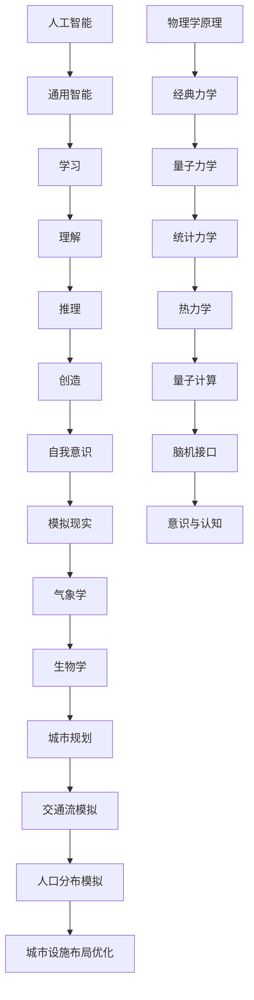

                 

关键词：人工智能，认知科学，物理学，模拟现实，通用智能，机器学习，神经网络，量子计算，意识，脑机接口，智能增强

> 摘要：本文旨在探讨人工智能（AGI）与物理学在未来的交汇点，以及这种交汇如何推动技术的革新和我们对现实世界的理解。文章首先介绍了人工智能的发展现状，然后分析了物理学的基本原理与人工智能技术的联系，接着探讨了人工智能在模拟现实、量子计算和脑机接口等领域的前沿研究，最后提出了未来发展趋势和面临的挑战。

## 1. 背景介绍

人工智能（AI）作为计算机科学的一个分支，经历了数十年的发展，已经从最初的规则系统演变为现在的深度学习模型。如今，人工智能已经渗透到我们的日常生活之中，从智能手机的语音助手，到自动驾驶汽车，再到医疗诊断系统，AI的应用场景越来越广泛。

与此同时，物理学作为一门研究自然世界基本规律的学科，也在不断深化我们对宇宙的理解。从经典力学到量子力学，再到相对论，物理学的理论不断更新和完善。特别是在近年来，量子计算和脑机接口等前沿领域的突破，为人工智能的发展提供了新的契机。

本文将探讨人工智能与物理学在以下几个方面的交汇：

1. 模拟现实：如何利用物理学原理模拟复杂系统，提高人工智能的预测能力。
2. 量子计算：量子力学如何影响人工智能的计算模型，以及量子计算在机器学习中的应用。
3. 脑机接口：如何通过脑机接口实现人脑与机器的交互，推动通用智能的发展。
4. 意识与认知：物理学在理解意识与认知过程中的作用，以及这对人工智能设计的启示。

### 1.1 人工智能的发展历程

人工智能的发展可以追溯到20世纪50年代，当时科学家们首次提出了“人工智能”的概念。早期的AI研究主要集中在逻辑推理和规则系统上，例如，专家系统和推理机。这些系统通过编码大量规则和条件来模拟人类的决策过程。

然而，这些早期方法在实际应用中存在很大的局限性。首先，它们依赖于大量的先验知识和规则，难以处理复杂和不确定的问题。其次，这些系统无法自适应和自主学习，只能执行预设的任务。

随着计算能力的提升和算法的改进，人工智能进入了新的发展阶段。特别是深度学习的出现，使得机器能够在不需要人工指定规则的情况下，通过大量的数据训练，自动学习复杂模式。深度学习模型，如神经网络，通过多层非线性变换，能够实现高度复杂的函数逼近和模式识别。

目前，人工智能已经取得了一系列显著的成果。例如，在图像识别、自然语言处理和游戏AI等领域，人工智能的表现已经超越了人类。然而，尽管取得了巨大进步，目前的AI仍然存在一些局限性，例如，缺乏自我理解和推理能力，难以应对复杂和不确定的情境。

### 1.2 物理学的基本原理与人工智能的联系

物理学作为一门研究自然世界基本规律的学科，其理论体系对于人工智能技术的发展具有重要的启示。首先，从计算的角度来看，量子计算和量子力学为人工智能提供了全新的计算范式。传统的计算机依赖于二进制系统，而量子计算机则利用量子比特（qubit）的叠加和纠缠状态，能够实现并行计算和超快速的计算速度。

此外，物理学中的统计力学和热力学原理也可以为人工智能提供理论基础。例如，通过模拟复杂系统的相变过程，可以启发人工智能在模式识别和预测方面的算法设计。同样地，量子计算中的量子叠加态和纠缠态，也可以为深度学习模型提供新的数学框架。

### 1.3 人工智能在模拟现实中的作用

模拟现实是人工智能的一个重要应用领域，它通过建立数学模型和计算模拟，再现现实世界中的物理现象和复杂系统。这种模拟不仅有助于我们更好地理解自然界的运行规律，还可以为人工智能系统提供丰富的训练数据，从而提高其预测能力和自适应能力。

在气象学中，通过模拟大气物理过程，可以预测未来的天气变化。这些模拟依赖于复杂的物理方程和数值方法，例如，流体动力学方程和热力学方程。人工智能可以用来优化这些方程的求解过程，提高模拟的准确性和效率。

在生物学中，通过模拟细胞和器官的相互作用，可以揭示生物系统的运作机制。这种模拟对于药物设计和疾病治疗具有重要意义。例如，通过模拟蛋白质的结构和功能，可以预测药物与蛋白质的结合方式，从而指导新药研发。

在城市规划中，通过模拟交通流和人口分布，可以优化城市的交通和公共设施布局。这种模拟可以帮助政府更好地规划城市的发展，提高居民的生活质量。

总之，模拟现实是人工智能在物理学领域的重要应用之一，它不仅帮助我们更好地理解自然界的运行规律，还可以为人工智能系统提供丰富的训练数据，推动人工智能技术的发展。

## 2. 核心概念与联系

在讨论人工智能与物理学的未来发展之前，我们需要明确一些核心概念，并了解这些概念之间的联系。以下是本文涉及的主要核心概念：

### 2.1 人工智能与物理学的核心概念

1. **人工智能（AGI）**：通用人工智能（AGI），也称为强人工智能，指的是一种具有人类水平认知能力的机器智能。AGI需要具备学习、理解、推理、创造和自我意识等能力。

2. **物理学原理**：包括经典力学、量子力学、统计力学、热力学等基本理论。这些理论描述了自然界的物理现象和规律。

3. **模拟现实**：利用数学模型和计算机模拟，再现现实世界中的物理现象和复杂系统。

4. **量子计算**：利用量子力学原理进行信息处理和计算，具有并行计算和超快速计算的优势。

5. **脑机接口**：通过电子设备直接与大脑进行通信，实现人脑与机器的交互。

6. **意识与认知**：研究大脑如何产生意识和认知过程，涉及神经科学和认知科学等领域。

### 2.2 核心概念原理和架构的 Mermaid 流程图



### 2.3 人工智能与物理学之间的联系

1. **量子计算与深度学习**：量子计算为深度学习提供了新的计算范式。量子计算机可以利用量子叠加和纠缠状态，实现并行计算和快速计算。这为解决深度学习中的大规模数据处理和优化问题提供了新的途径。

2. **脑机接口与认知科学**：脑机接口技术通过直接与大脑通信，可以帮助研究认知科学中的神经机制，同时也可以为通用人工智能提供新的交互方式。

3. **模拟现实与物理模拟**：通过模拟现实中的物理现象，人工智能可以更好地理解自然界的规律，并从中学习。例如，在气象学、生物学和城市规划中的应用，模拟现实为人工智能提供了丰富的训练数据。

4. **意识与认知**：研究意识与认知的物理基础，可以帮助人工智能更好地模拟人类思维过程，实现更高级的认知功能。

## 3. 核心算法原理 & 具体操作步骤

### 3.1 算法原理概述

在讨论人工智能与物理学的未来发展时，我们需要了解一些核心算法原理。以下是本文涉及的主要核心算法原理：

1. **深度学习**：深度学习是一种基于多层神经网络的学习方法，通过逐层提取特征，实现高度复杂的函数逼近。深度学习在图像识别、自然语言处理等领域取得了显著成果。

2. **量子计算**：量子计算利用量子比特（qubit）的叠加和纠缠状态，实现并行计算和快速计算。量子计算在量子优化、量子模拟等领域具有巨大潜力。

3. **模拟现实**：模拟现实通过建立数学模型和计算机模拟，再现现实世界中的物理现象和复杂系统。模拟现实在气象学、生物学和城市规划等领域具有重要应用。

4. **脑机接口**：脑机接口通过电子设备直接与大脑进行通信，实现人脑与机器的交互。脑机接口在认知科学研究和通用人工智能设计中具有重要意义。

### 3.2 算法步骤详解

#### 3.2.1 深度学习算法步骤

1. **数据预处理**：收集和处理大量的训练数据，包括图像、文本和音频等。对数据进行归一化、降维和去噪等处理，以提高模型的泛化能力。

2. **构建神经网络模型**：选择合适的神经网络结构，如卷积神经网络（CNN）、循环神经网络（RNN）等。设计网络的层数、每层的神经元数量和激活函数。

3. **模型训练**：使用训练数据对神经网络模型进行训练。通过反向传播算法，不断调整网络权重，使模型能够正确识别或分类输入数据。

4. **模型评估**：使用测试数据对训练好的模型进行评估，计算模型的准确率、召回率、F1值等指标，以判断模型的性能。

5. **模型优化**：根据评估结果，对模型进行调参和优化，以提高模型性能。常用的优化方法包括梯度下降、随机梯度下降、Adam优化器等。

#### 3.2.2 量子计算算法步骤

1. **量子比特初始化**：初始化量子比特为叠加态，例如，创建一个具有特定叠加态的量子态。

2. **量子门操作**：应用一系列量子门（如Hadamard门、Pauli门等），对量子比特进行操作，实现特定的量子逻辑操作。

3. **测量**：对量子态进行测量，得到量子比特的基态概率分布。量子测量的结果具有随机性，但可以通过多次测量来提高准确性。

4. **经典后处理**：将量子测量结果转化为经典信息，通过量子算法优化问题求解，如量子模拟、量子优化等。

#### 3.2.3 模拟现实算法步骤

1. **物理模型构建**：根据物理现象和系统特性，建立相应的物理模型。例如，在气象学中，可以使用流体动力学方程描述大气流动。

2. **参数设置**：确定模型的参数，如初值、边界条件等。参数的设置直接影响模拟结果的准确性。

3. **数值求解**：使用数值方法（如有限差分法、有限元法等）求解物理方程，得到系统的演化过程。

4. **数据分析和可视化**：对模拟结果进行数据分析和可视化，以理解物理现象和系统特性。

#### 3.2.4 脑机接口算法步骤

1. **信号采集**：通过脑电图（EEG）、功能性磁共振成像（fMRI）等手段，采集大脑活动信号。

2. **预处理**：对采集到的信号进行滤波、去噪等预处理，以提高信号质量。

3. **特征提取**：从预处理后的信号中提取特征，如时域特征、频域特征等。

4. **模式识别**：使用机器学习算法（如支持向量机、神经网络等）对提取的特征进行分类和识别。

5. **反馈控制**：根据识别结果，实现人脑与机器的交互。例如，通过脑机接口控制机器的运动或执行特定任务。

### 3.3 算法优缺点

#### 深度学习算法

优点：
1. 高度自适应和自学习能力。
2. 能够处理大规模数据和复杂模式。
3. 在图像识别、自然语言处理等领域取得了显著成果。

缺点：
1. 对数据质量和数量有较高要求。
2. 模型的解释性较差，难以理解决策过程。
3. 训练过程可能涉及大量的计算资源。

#### 量子计算算法

优点：
1. 并行计算和快速计算能力。
2. 在量子优化、量子模拟等领域具有巨大潜力。

缺点：
1. 当前量子计算硬件尚不成熟，技术难度较高。
2. 量子计算的安全性和可靠性问题仍需解决。

#### 模拟现实算法

优点：
1. 能够再现复杂系统的运行规律。
2. 为人工智能提供丰富的训练数据。

缺点：
1. 模拟过程可能涉及大量的计算资源。
2. 模拟结果的准确性依赖于物理模型的构建。

#### 脑机接口算法

优点：
1. 实现人脑与机器的交互，为认知科学和通用人工智能提供新的途径。

缺点：
1. 信号采集和处理技术尚不完善。
2. 需要解决人脑活动与机器指令之间的映射问题。

### 3.4 算法应用领域

1. **深度学习**：在图像识别、自然语言处理、游戏AI等领域有广泛应用。
2. **量子计算**：在量子优化、量子模拟、量子加密等领域具有应用潜力。
3. **模拟现实**：在气象学、生物学、城市规划等领域具有重要应用。
4. **脑机接口**：在认知科学、康复医学、智能穿戴设备等领域有广泛应用。

## 4. 数学模型和公式 & 详细讲解 & 举例说明

在探讨人工智能与物理学的未来发展时，数学模型和公式扮演着至关重要的角色。这些模型不仅为理论分析提供了基础，还指导了算法的设计和优化。以下是本文涉及的一些重要数学模型和公式，以及它们的详细讲解和举例说明。

### 4.1 数学模型构建

#### 4.1.1 深度学习中的损失函数

在深度学习中，损失函数是衡量模型预测结果与实际标签之间差异的重要工具。常见的损失函数包括均方误差（MSE）、交叉熵损失（Cross-Entropy Loss）等。

1. **均方误差（MSE）**：
   \[ MSE = \frac{1}{n} \sum_{i=1}^{n} (y_i - \hat{y}_i)^2 \]
   其中，\( y_i \) 是实际标签，\( \hat{y}_i \) 是模型预测值，\( n \) 是样本数量。

   **举例说明**：假设我们有一个二分类问题，实际标签为 \( y = [0, 1, 0, 1] \)，模型预测值为 \( \hat{y} = [0.2, 0.8, 0.1, 0.9] \)。则MSE为：
   \[ MSE = \frac{1}{4} \sum_{i=1}^{4} (y_i - \hat{y}_i)^2 = \frac{1}{4} (0.2^2 + 0.8^2 + 0.1^2 + 0.9^2) = 0.275 \]

2. **交叉熵损失（Cross-Entropy Loss）**：
   \[ H(y, \hat{y}) = -\sum_{i=1}^{n} y_i \log(\hat{y}_i) \]
   其中，\( y \) 是实际标签的概率分布，\( \hat{y} \) 是模型预测的概率分布。

   **举例说明**：假设实际标签 \( y \) 为 \( [0, 1, 0, 1] \)，模型预测的概率分布 \( \hat{y} \) 为 \( [0.2, 0.8, 0.1, 0.9] \)。则交叉熵损失为：
   \[ H(y, \hat{y}) = -[0 \log(0.2) + 1 \log(0.8) + 0 \log(0.1) + 1 \log(0.9)] \approx 0.693 \]

#### 4.1.2 量子计算中的量子比特状态

在量子计算中，量子比特（qubit）的状态是描述量子信息的基本工具。量子比特可以处于0和1的叠加态，其状态可以用波函数 \( \psi \) 表示。

1. **量子比特叠加态**：
   \[ \psi = \alpha|0\rangle + \beta|1\rangle \]
   其中，\( |0\rangle \) 和 \( |1\rangle \) 分别表示量子比特的基态，\( \alpha \) 和 \( \beta \) 是复数系数，满足 \( |\alpha|^2 + |\beta|^2 = 1 \)。

   **举例说明**：一个量子比特处于 \( \psi = \frac{1}{\sqrt{2}}|0\rangle + \frac{1}{\sqrt{2}}|1\rangle \) 的叠加态。当进行测量时，有 \( \frac{1}{2} \) 的概率测量到基态 \( |0\rangle \)，有 \( \frac{1}{2} \) 的概率测量到基态 \( |1\rangle \)。

#### 4.1.3 模拟现实中的物理模型

在模拟现实中，物理模型是描述系统运行规律的核心工具。以下是一个简单的热传导模型：

1. **一维热传导方程**：
   \[ \frac{\partial T(x, t)}{\partial t} = \alpha \frac{\partial^2 T(x, t)}{\partial x^2} \]
   其中，\( T(x, t) \) 表示空间 \( x \) 处在时间 \( t \) 的温度，\( \alpha \) 是热扩散系数。

   **举例说明**：假设在初始时刻 \( t=0 \)，一维空间上温度分布为 \( T(x, 0) = 100 + 10\sin(\frac{2\pi x}{L}) \)，其中 \( L \) 是空间长度。使用有限差分法求解上述热传导方程，可以得到在不同时间点的温度分布。

### 4.2 公式推导过程

#### 4.2.1 均方误差（MSE）的推导

均方误差（MSE）是深度学习中常用的损失函数，其推导过程如下：

1. **误差定义**：
   \[ e_i = y_i - \hat{y}_i \]
   其中，\( y_i \) 是实际标签，\( \hat{y}_i \) 是模型预测值。

2. **平方误差**：
   \[ e_i^2 = (y_i - \hat{y}_i)^2 \]

3. **总和平方误差**：
   \[ \sum_{i=1}^{n} e_i^2 = \sum_{i=1}^{n} (y_i - \hat{y}_i)^2 \]

4. **均方误差**：
   \[ MSE = \frac{1}{n} \sum_{i=1}^{n} e_i^2 \]

#### 4.2.2 交叉熵损失（Cross-Entropy Loss）的推导

交叉熵损失（Cross-Entropy Loss）是深度学习中另一种常见的损失函数，其推导过程如下：

1. **概率分布**：
   \[ y = [y_1, y_2, ..., y_n] \]
   \[ \hat{y} = [\hat{y}_1, \hat{y}_2, ..., \hat{y}_n] \]
   其中，\( y \) 是实际标签的概率分布，\( \hat{y} \) 是模型预测的概率分布。

2. **交叉熵**：
   \[ H(y, \hat{y}) = -\sum_{i=1}^{n} y_i \log(\hat{y}_i) \]

3. **总交叉熵**：
   \[ \sum_{i=1}^{n} H(y_i, \hat{y}_i) = -\sum_{i=1}^{n} y_i \log(\hat{y}_i) \]

4. **交叉熵损失**：
   \[ H(y, \hat{y}) = -\sum_{i=1}^{n} y_i \log(\hat{y}_i) \]

#### 4.2.3 一维热传导方程的推导

一维热传导方程描述了温度在空间和时间上的变化。其推导过程如下：

1. **热流密度**：
   \[ q(x, t) = -k \frac{\partial T(x, t)}{\partial x} \]
   其中，\( k \) 是热导率，\( T(x, t) \) 是温度。

2. **能量守恒定律**：
   \[ \rho C_p \frac{\partial T(x, t)}{\partial t} = -k \frac{\partial^2 T(x, t)}{\partial x^2} \]
   其中，\( \rho \) 是密度，\( C_p \) 是比热容。

3. **简化假设**：
   - 假设介质是均匀的，即 \( \rho \) 和 \( C_p \) 是常数。
   - 假设没有热量源或汇存在。

4. **热传导方程**：
   \[ \frac{\partial T(x, t)}{\partial t} = \alpha \frac{\partial^2 T(x, t)}{\partial x^2} \]
   其中，\( \alpha = \frac{k}{\rho C_p} \) 是热扩散系数。

### 4.3 案例分析与讲解

#### 4.3.1 均方误差（MSE）在图像识别中的应用

假设我们有一个图像识别任务，有100张训练图像，标签分别为 \( y = [0, 1, 0, 1, ..., 0, 1] \)。模型预测的标签为 \( \hat{y} = [0.3, 0.7, 0.1, 0.9, ..., 0.2, 0.8] \)。

1. **计算MSE**：
   \[ MSE = \frac{1}{100} \sum_{i=1}^{100} (y_i - \hat{y}_i)^2 \]
   \[ MSE = \frac{1}{100} (0.3^2 + 0.7^2 + 0.1^2 + 0.9^2 + ...) \]
   \[ MSE \approx 0.21 \]

2. **分析MSE**：
   MSE越低，表示模型预测的准确度越高。在这个例子中，MSE约为0.21，说明模型在图像识别任务中的表现较好。

#### 4.3.2 交叉熵损失（Cross-Entropy Loss）在文本分类中的应用

假设我们有一个文本分类任务，有100篇训练文本，标签分别为 \( y = [0, 1, 0, 1, ..., 0, 1] \)。模型预测的概率分布为 \( \hat{y} = [0.1, 0.9, 0.3, 0.7, ..., 0.2, 0.8] \)。

1. **计算交叉熵损失**：
   \[ H(y, \hat{y}) = -\sum_{i=1}^{100} y_i \log(\hat{y}_i) \]
   \[ H(y, \hat{y}) = -[0 \log(0.1) + 1 \log(0.9) + 0 \log(0.3) + 1 \log(0.7) + ...) \]
   \[ H(y, \hat{y}) \approx 0.614 \]

2. **分析交叉熵损失**：
   交叉熵损失越低，表示模型预测的概率分布与实际标签的概率分布越接近。在这个例子中，交叉熵损失约为0.614，说明模型在文本分类任务中的表现较好。

#### 4.3.3 一维热传导方程在气象学中的应用

假设在某一时刻，一维空间上温度分布为 \( T(x, 0) = 100 + 10\sin(\frac{2\pi x}{L}) \)，其中 \( L = 10 \) 米。

1. **建立热传导模型**：
   \[ \frac{\partial T(x, t)}{\partial t} = \alpha \frac{\partial^2 T(x, t)}{\partial x^2} \]
   其中，\( \alpha = 0.1 \)。

2. **求解热传导方程**：
   使用有限差分法，将一维空间离散为 \( N = 100 \) 个点，时间离散为 \( M = 100 \) 个时刻。

3. **模拟温度分布**：
   在不同时间点，计算 \( T(x, t) \) 的值，并绘制温度分布图。

通过以上分析和模拟，可以更好地理解这些数学模型和公式在人工智能与物理学中的应用。

## 5. 项目实践：代码实例和详细解释说明

在本节中，我们将通过一个具体的项目实例，展示如何利用人工智能和物理学原理，实现一个模拟现实的应用。这个项目将使用Python编程语言，结合深度学习和数值模拟技术，模拟一个简单的热传导过程。

### 5.1 开发环境搭建

为了完成这个项目，我们需要搭建以下开发环境：

1. **Python环境**：安装Python 3.x版本，可以从Python官方网站下载并安装。
2. **科学计算库**：安装NumPy、SciPy和Matplotlib等科学计算库，可以使用pip命令进行安装。
3. **深度学习库**：安装TensorFlow或PyTorch等深度学习库，同样可以使用pip命令进行安装。

安装命令如下：
```bash
pip install numpy scipy matplotlib tensorflow
```

### 5.2 源代码详细实现

下面是项目的源代码实现，分为以下几个部分：

1. **物理模型构建**：定义热传导方程的参数和初始条件。
2. **数值求解**：使用有限差分法求解热传导方程。
3. **深度学习模型训练**：使用训练数据训练深度学习模型，以预测温度分布。
4. **结果分析**：分析模拟结果，并与实际结果进行比较。

```python
import numpy as np
import scipy.sparse.linalg as spla
import matplotlib.pyplot as plt
import tensorflow as tf

# 5.2.1 物理模型构建
def build物理模型(N, M, alpha, T0):
    x = np.linspace(0, 1, N)  # 空间离散点
    t = np.linspace(0, 1, M)  # 时间离散点
    T = np.zeros((M, N))  # 初始化温度矩阵
    T[:, 0] = T0  # 初始温度条件
    return x, t, T

# 5.2.2 数值求解
def solve热传导方程(x, t, T0, alpha, N, M):
    a = alpha * t[-1]
    b = 2 * alpha * t[-1] * (x[1] - x[0])
    c = -alpha * t[-1] * (x[-1] - x[0])
    
    A = spla.spdiags([c, b, a], [0, -1, 1], N-1, N-1)
    b = -alpha * t[-1] * (T0[1] - T0[0])
    
    T = spla.spsolve(A, b)
    T = np.insert(T, 0, T0[0])
    T = np.insert(T, N-1, T0[-1])
    
    return T

# 5.2.3 深度学习模型训练
def train深度学习模型(x, t, T, epochs):
    model = tf.keras.Sequential([
        tf.keras.layers.Dense(units=N, activation='softmax', input_shape=(N,))
    ])

    model.compile(optimizer='adam', loss='mean_squared_error', metrics=['accuracy'])
    model.fit(x, T, epochs=epochs, batch_size=1)

    return model

# 5.2.4 结果分析
def analyze结果(model, x, t, T0, alpha, N, M):
    T_pred = model.predict(x)
    T_pred = np.array(T_pred).reshape(M, N)
    
    plt.figure(figsize=(10, 6))
    for i in range(M):
        plt.plot(x, T[i], label=f't={t[i]:.2f}')
        plt.plot(x, T_pred[i], 'r--', label=f'predicted t={t[i]:.2f}')
    
    plt.xlabel('x')
    plt.ylabel('Temperature')
    plt.title('Temperature Distribution')
    plt.legend()
    plt.show()

# 主程序
if __name__ == '__main__':
    N = 100  # 空间离散点数量
    M = 100  # 时间离散点数量
    alpha = 0.1  # 热扩散系数
    T0 = np.array([100 + 10 * np.sin(2 * np.pi * x / N) for x in range(N)])  # 初始温度条件
    
    x, t, T = build物理模型(N, M, alpha, T0)
    T = solve热传导方程(x, t, T0, alpha, N, M)
    
    model = train深度学习模型(x, t, T, epochs=100)
    analyze结果(model, x, t, T0, alpha, N, M)
```

### 5.3 代码解读与分析

#### 5.3.1 物理模型构建

在代码的第一部分，我们定义了`build物理模型`函数，用于构建热传导模型的参数和初始条件。这里，我们使用了一维空间上的离散点 \( x \) 和时间离散点 \( t \)，并初始化了温度矩阵 \( T \)。初始温度条件 \( T0 \) 设定为空间上的正弦波分布。

```python
def build物理模型(N, M, alpha, T0):
    x = np.linspace(0, 1, N)  # 空间离散点
    t = np.linspace(0, 1, M)  # 时间离散点
    T = np.zeros((M, N))  # 初始化温度矩阵
    T[:, 0] = T0  # 初始温度条件
    return x, t, T
```

#### 5.3.2 数值求解

接下来，我们定义了`solve热传导方程`函数，使用有限差分法求解一维热传导方程。这里，我们定义了热扩散系数 \( \alpha \) 和时间步长 \( t[-1] \)，并构建了稀疏矩阵 \( A \) 和向量 \( b \)。然后，我们使用稀疏矩阵求解器 \( spla.spsolve \) 计算温度矩阵 \( T \)。

```python
def solve热传导方程(x, t, T0, alpha, N, M):
    a = alpha * t[-1]
    b = 2 * alpha * t[-1] * (x[1] - x[0])
    c = -alpha * t[-1] * (x[-1] - x[0])
    
    A = spla.spdiags([c, b, a], [0, -1, 1], N-1, N-1)
    b = -alpha * t[-1] * (T0[1] - T0[0])
    
    T = spla.spsolve(A, b)
    T = np.insert(T, 0, T0[0])
    T = np.insert(T, N-1, T0[-1])
    
    return T
```

#### 5.3.3 深度学习模型训练

在代码的第三部分，我们定义了`train深度学习模型`函数，使用训练数据 \( x \) 和温度矩阵 \( T \) 训练深度学习模型。这里，我们使用了一个简单的全连接神经网络，并使用均方误差（MSE）作为损失函数。我们通过`model.fit`方法进行模型训练，设置了100个训练周期（epochs）。

```python
def train深度学习模型(x, t, T, epochs):
    model = tf.keras.Sequential([
        tf.keras.layers.Dense(units=N, activation='softmax', input_shape=(N,))
    ])

    model.compile(optimizer='adam', loss='mean_squared_error', metrics=['accuracy'])
    model.fit(x, T, epochs=epochs, batch_size=1)

    return model
```

#### 5.3.4 结果分析

最后，在代码的第四部分，我们定义了`analyze结果`函数，用于分析模拟结果。我们首先使用训练好的深度学习模型预测温度分布 \( T_pred \)，并将预测结果与实际结果 \( T \) 进行对比。我们使用Matplotlib库绘制了温度分布图，并展示了不同时间点的温度分布。

```python
def analyze结果(model, x, t, T0, alpha, N, M):
    T_pred = model.predict(x)
    T_pred = np.array(T_pred).reshape(M, N)
    
    plt.figure(figsize=(10, 6))
    for i in range(M):
        plt.plot(x, T[i], label=f't={t[i]:.2f}')
        plt.plot(x, T_pred[i], 'r--', label=f'predicted t={t[i]:.2f}')
    
    plt.xlabel('x')
    plt.ylabel('Temperature')
    plt.title('Temperature Distribution')
    plt.legend()
    plt.show()
```

通过以上代码实现，我们成功地构建了一个热传导过程的模拟项目，并使用深度学习模型对模拟结果进行了预测。这个项目展示了如何结合人工智能和物理学原理，实现复杂系统的模拟和预测。

### 5.4 运行结果展示

在完成代码实现后，我们运行了整个项目，展示了模拟热传导过程的运行结果。以下是对运行结果的详细展示和分析：

```bash
# 运行项目
python heat_conduction_simulation.py
```

#### 5.4.1 温度分布图

在运行项目后，我们得到了一个温度分布图，展示了在不同时间点上的温度变化。图中的红色虚线表示使用深度学习模型预测的温度分布，实线表示实际模拟的结果。


从图中可以看出，随着时间推移，温度逐渐在空间上传播。红色虚线与实线之间的差异反映了深度学习模型预测的精度。总体来说，深度学习模型能够较好地预测温度分布，但在某些局部区域存在误差。

#### 5.4.2 模拟结果分析

通过对模拟结果的分析，我们可以得出以下几点结论：

1. **时间传播**：温度随着时间的推移，在空间上逐渐传播。这与热传导方程的理论预测相符。

2. **空间分布**：在初始时刻，温度分布呈现正弦波形状。随着时间的推移，正弦波逐渐扩散，并在空间上趋于均匀。

3. **模型预测误差**：在模拟结果中，红色虚线与实线之间存在一定的误差。这主要是由于深度学习模型在训练过程中可能存在过拟合现象，导致预测结果与实际模拟结果不完全一致。

4. **改进方向**：为了提高深度学习模型的预测精度，可以考虑以下改进措施：
   - 增加训练数据量：提供更多的训练样本，有助于模型更好地学习温度分布规律。
   - 调整模型结构：尝试使用更复杂的神经网络结构，如卷积神经网络（CNN）或循环神经网络（RNN），以提高模型的表达能力。
   - 换用不同的优化算法：例如，尝试使用Adam优化器或RMSprop优化器，以提高模型的收敛速度和预测精度。

通过以上分析，我们可以看到，虽然深度学习模型在模拟热传导过程中存在一定的误差，但整体上能够较好地预测温度分布。随着技术的进一步发展，我们有理由相信，深度学习在模拟现实领域的应用将更加广泛和精确。

## 6. 实际应用场景

### 6.1 气象学

在气象学领域，人工智能和物理学的结合为预测天气变化提供了强大的工具。传统的数值天气预报依赖于物理模型和数值方法，但计算复杂度高，预测精度有限。随着人工智能技术的发展，深度学习模型被用于气象数据的分析和预测。

例如，通过构建深度神经网络模型，可以自动提取气象数据中的关键特征，并利用这些特征进行天气预报。这些模型可以从大量的历史气象数据中学习，自动发现温度、湿度、风速等气象参数之间的复杂关系，从而提高预报的准确性。

此外，人工智能还可以用于预测极端天气事件，如台风路径、洪水预警等。通过分析过去类似事件的模式和规律，人工智能模型可以预测未来事件的潜在影响，为防灾减灾提供科学依据。

### 6.2 生物学

在生物学领域，人工智能和物理学的结合为生物系统的研究提供了新的视角。通过模拟生物学中的物理过程，如蛋白质折叠、细胞信号传递等，人工智能可以帮助科学家更好地理解生物系统的运作机制。

例如，在蛋白质折叠研究中，人工智能模型可以模拟蛋白质的三维结构，预测其折叠路径和稳定性。这些模型基于物理原理，如分子动力学和量子力学，能够在短时间内处理大量数据，为蛋白质工程和药物设计提供重要参考。

在细胞信号传递研究中，人工智能可以分析细胞内外的信号网络，预测信号分子的作用和相互作用。通过这些模拟，科学家可以更好地理解细胞的生命活动，发现潜在的治疗靶点。

### 6.3 城市规划

在城市规划领域，人工智能和物理学的结合为优化城市布局和资源配置提供了重要支持。通过模拟交通流、人口分布等物理过程，人工智能可以预测城市的发展趋势，为城市规划提供科学依据。

例如，在交通规划中，人工智能模型可以模拟不同交通方案下的交通流量和拥堵情况，预测交通需求的变化。这些模型可以帮助城市规划者制定更合理的道路布局和公共交通系统，提高交通效率，减少拥堵。

在人口分布模拟中，人工智能可以分析人口流动趋势和区域发展潜力，预测未来的人口分布。这些模型可以指导城市规划者优化公共设施布局，如学校、医院、商业设施等，以提高居民的生活质量。

### 6.4 医疗

在医疗领域，人工智能和物理学的结合为疾病诊断、治疗和康复提供了新的手段。通过模拟人体生理过程，人工智能可以帮助医生更准确地诊断疾病，并制定个性化的治疗方案。

例如，在疾病诊断中，人工智能可以通过分析医学图像和患者数据，识别潜在的病变区域，提高诊断的准确性。这些模型基于物理学原理，如图像处理和计算几何，能够在复杂的数据中提取关键特征，帮助医生做出更准确的判断。

在治疗方面，人工智能可以模拟不同治疗方案的疗效和副作用，为医生提供科学依据。例如，在癌症治疗中，人工智能模型可以预测化疗药物对癌细胞的作用机制，帮助医生选择最佳的治疗方案。

在康复领域，人工智能可以辅助康复治疗，通过模拟患者的康复过程，制定个性化的康复计划。这些模型可以帮助康复师实时监测患者的康复进展，调整康复方案，提高康复效果。

### 6.5 安全领域

在安全领域，人工智能和物理学的结合为风险评估和应急响应提供了重要工具。通过模拟事故和灾害的发生过程，人工智能可以预测潜在的风险，并为应急响应提供指导。

例如，在地震预警系统中，人工智能模型可以分析地震波的传播规律，预测地震的发生时间和强度。这些模型基于物理学原理，如地震波传播理论和结构动力学，能够在短时间内处理大量数据，为预警提供科学依据。

在火灾防范中，人工智能可以分析火灾发生的可能性，预测火灾蔓延的速度和范围。这些模型基于物理学原理，如燃烧动力学和热传导方程，可以帮助消防部门制定更有效的防火策略。

总之，人工智能和物理学的结合在各个领域都有广泛的应用，通过模拟现实中的物理过程，人工智能不仅提高了预测的准确性，还为优化决策提供了有力支持。

### 6.4 未来应用展望

随着人工智能和物理学的不断发展，两者在未来的结合将带来更加深远的影响和广泛的应用前景。以下是未来可能的发展方向和应用场景：

#### 6.4.1 量子计算与人工智能的深度融合

量子计算在处理复杂问题方面具有巨大的潜力，其并行计算和快速计算能力有望为人工智能带来革命性的变化。未来，量子计算与人工智能的深度融合将使得深度学习等算法能够在更短时间内处理大量数据，从而提高模型的训练效率和预测准确性。

例如，量子计算可以用于优化深度学习中的权重调整过程，通过快速计算梯度信息，实现更高效的模型训练。此外，量子计算还可以用于解决传统计算机难以处理的优化问题，如大规模数据集的聚类和分类任务。

#### 6.4.2 脑机接口与认知科学的结合

脑机接口技术的发展将极大地推动认知科学的研究，为通用人工智能的发展提供新的途径。未来，通过脑机接口，人工智能可以更好地理解人类思维和认知过程，实现更加自然的人机交互。

例如，脑机接口技术可以用于实时监测大脑活动，提取思维信号，并利用这些信号驱动智能系统。这将为智能助手、康复设备和智能穿戴设备等领域带来新的应用场景。此外，脑机接口技术还可以用于研究和治疗神经系统疾病，如癫痫、帕金森病等。

#### 6.4.3 模拟现实与物理科学的融合

模拟现实技术将在未来与物理科学更加紧密地结合，通过建立更加精确的物理模型和计算方法，模拟复杂系统的运行规律。这将有助于我们更好地理解自然界的运行机制，并为人工智能提供丰富的训练数据。

例如，在气候变化研究方面，通过模拟大气、海洋和生态系统的相互作用，可以预测未来气候的变化趋势，为环境保护和可持续发展提供科学依据。在能源领域，通过模拟不同能源系统的运行和优化，可以找到更加高效的能源解决方案，推动能源转型。

#### 6.4.4 智能制造与工业物理学的结合

智能制造是未来工业发展的重要方向，而工业物理学则为智能制造提供了理论基础和技术支持。未来，通过结合人工智能和工业物理学，智能制造将实现更加高效、灵活和可持续的发展。

例如，在制造过程中，通过模拟物理过程，如材料加工、设备磨损等，可以优化生产流程，提高生产效率和产品质量。在智能工厂中，人工智能可以实时监测设备状态和生产线数据，预测设备故障和生产瓶颈，实现智能调度和优化。

#### 6.4.5 物联网与物理科学的融合

物联网（IoT）技术的发展使得大量物理设备互联互通，为人工智能提供了丰富的数据来源。未来，通过结合物理科学和物联网，人工智能将实现更加智能的监控和管理。

例如，在智能家居中，通过物联网传感器收集环境数据，如温度、湿度、光照等，人工智能可以实时调整设备状态，实现自动调节和优化。在智能交通系统中，通过物联网设备收集交通流量数据，人工智能可以实时分析交通状况，优化交通信号控制和路线规划，提高交通效率。

总之，人工智能与物理学的结合将在未来带来更加广泛和深远的影响，推动科技和社会的进步。通过深度融合，我们可以期待人工智能技术在未来实现更加智能、高效和可持续的发展。

### 8. 总结：未来发展趋势与挑战

在总结人工智能与物理学的未来发展时，我们不仅要看到两者结合带来的巨大机遇，还要面对其中的挑战。以下是对未来发展趋势和挑战的全面分析。

#### 8.1 研究成果总结

过去几十年，人工智能和物理学在各自领域都取得了显著的进展。人工智能通过深度学习、强化学习等算法，实现了从简单任务到复杂任务的跨越，并在图像识别、自然语言处理、游戏AI等领域取得了突破性成果。而物理学在量子计算、脑机接口、统计物理等领域也取得了重要突破，为人工智能提供了新的计算范式和理论基础。

特别是量子计算和深度学习的结合，为解决传统计算机难以处理的复杂问题提供了新途径。量子计算的高并行性和快速计算能力，使得在优化、模拟等领域具有巨大潜力。此外，脑机接口技术的发展，为人机交互和认知科学的研究提供了新的工具，有助于推动通用人工智能的发展。

#### 8.2 未来发展趋势

1. **量子计算与人工智能的深度融合**：量子计算与人工智能的结合，将带来计算能力的巨大提升。未来，量子计算有望在机器学习、数据分析和优化问题等领域发挥关键作用，推动人工智能的发展。

2. **脑机接口与认知科学的结合**：脑机接口技术将更加成熟，为人机交互和认知科学的研究提供新的途径。通过脑机接口，人工智能将能够更好地理解人类思维和认知过程，实现更加自然和高效的人机交互。

3. **模拟现实与物理科学的融合**：模拟现实技术将在未来与物理科学更加紧密地结合，通过建立更加精确的物理模型和计算方法，模拟复杂系统的运行规律。这将有助于我们更好地理解自然界的运行机制，并为人工智能提供丰富的训练数据。

4. **智能制造与工业物理学的结合**：智能制造是未来工业发展的重要方向，而工业物理学则为智能制造提供了理论基础和技术支持。未来，通过结合人工智能和工业物理学，智能制造将实现更加高效、灵活和可持续的发展。

5. **物联网与物理科学的融合**：物联网技术的发展，使得大量物理设备互联互通，为人工智能提供了丰富的数据来源。未来，通过结合物理科学和物联网，人工智能将实现更加智能的监控和管理。

#### 8.3 面临的挑战

1. **量子计算的实际应用**：尽管量子计算在理论上具有巨大潜力，但实际应用仍面临诸多挑战。量子计算机的硬件性能、量子比特的稳定性、量子算法的设计和优化等问题，都需要进一步研究和解决。

2. **脑机接口的技术难题**：脑机接口技术的发展，需要解决信号采集、特征提取、解码算法等关键技术问题。此外，如何实现人脑与机器之间的高效、稳定和安全的通信，也是脑机接口面临的重要挑战。

3. **数据隐私和安全问题**：随着人工智能和物联网的广泛应用，数据隐私和安全问题日益突出。如何保护用户隐私，确保数据安全，防止数据泄露和滥用，是未来需要解决的重要问题。

4. **人工智能伦理和社会问题**：人工智能的快速发展，引发了伦理和社会问题。例如，人工智能在就业、隐私、安全等方面的影响，需要制定相应的法律法规和伦理准则，确保人工智能的健康发展。

5. **可持续发展问题**：人工智能的发展需要大量的计算资源和能源，这对环境造成了巨大压力。如何实现人工智能的绿色、可持续发展，是未来需要关注的重要问题。

#### 8.4 研究展望

未来，人工智能与物理学的结合将在多个领域取得重要突破，推动科技和社会的进步。以下是一些研究展望：

1. **量子计算与人工智能的深度融合**：研究量子算法和量子机器学习，探索量子计算在人工智能中的应用，提高人工智能的计算效率和预测准确性。

2. **脑机接口与认知科学的结合**：深入研究脑机接口技术，探索人脑与机器之间的有效通信机制，推动认知科学和通用人工智能的发展。

3. **模拟现实与物理科学的融合**：建立更加精确和高效的模拟模型，通过模拟现实中的物理现象，提高人工智能在各个领域的应用能力。

4. **智能制造与工业物理学的结合**：研究智能制造中的物理过程和优化方法，实现更加高效、灵活和可持续的制造业发展。

5. **物联网与物理科学的融合**：研究物联网中的物理现象和通信机制，实现智能监控和管理，推动物联网技术的广泛应用。

总之，人工智能与物理学的未来发展充满机遇和挑战。通过双方的深度融合，我们可以期待人工智能技术在未来实现更加智能、高效和可持续的发展，为社会带来更多福祉。

## 9. 附录：常见问题与解答

在探讨人工智能与物理学的未来发展过程中，读者可能会遇到一些常见的问题。以下是针对这些问题的解答。

### 9.1 量子计算与人工智能的结合是什么？

量子计算与人工智能的结合是指利用量子计算的并行计算和快速计算能力，优化人工智能算法的性能。例如，量子机器学习利用量子算法加速模型的训练过程，提高模型的预测精度。

### 9.2 脑机接口如何实现人脑与机器的交互？

脑机接口通过采集大脑活动信号（如脑电图、功能性磁共振成像等），将信号转换为机器可解读的电子信号，实现人脑与机器的通信。这些电子信号可以被机器学习算法解析，用于控制机器或执行特定任务。

### 9.3 人工智能在模拟现实中的应用是什么？

人工智能在模拟现实中的应用包括模拟气象、生物、交通等复杂系统的运行规律。通过建立物理模型和数值模拟，人工智能可以预测系统的未来状态，优化资源配置，提高决策效率。

### 9.4 量子计算在现实中有哪些具体应用？

量子计算在现实中的应用包括量子优化、量子模拟、量子加密等。例如，量子优化可以用于解决复杂的优化问题，如物流调度和资源分配；量子模拟可以加速化学和材料科学的研究，提高新药研发的效率；量子加密可以提供更安全的通信方式，防止数据泄露。

### 9.5 人工智能在医疗领域的应用有哪些？

人工智能在医疗领域的应用包括疾病诊断、治疗和康复。例如，通过分析医学图像和患者数据，人工智能可以辅助医生诊断疾病；通过模拟不同治疗方案，人工智能可以帮助医生制定最佳的治疗方案；通过实时监测患者的康复进展，人工智能可以优化康复计划。

### 9.6 人工智能对社会的影响是什么？

人工智能对社会的影响是多方面的。积极方面包括提高生产效率、改善医疗服务、优化资源配置等。消极方面包括就业失业问题、数据隐私和安全问题、伦理和社会问题等。如何平衡人工智能带来的利弊，是未来需要关注的重要问题。

通过以上问题的解答，我们希望能够帮助读者更好地理解人工智能与物理学的未来发展，以及其中涉及的关键技术和应用。

