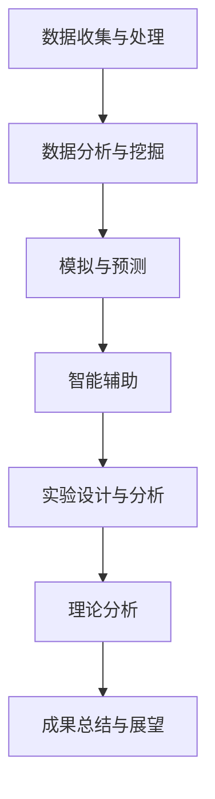

                 

关键词：人工智能（AGI）、物理学、算法、数学模型、应用前景、技术趋势

## 摘要

本文将探讨人工智能（AGI）在物理学领域中的应用前景。随着计算能力的提升和数据量的爆炸式增长，人工智能在物理学研究中正逐步展现出其独特优势。本文首先介绍了AGI的基本概念和特征，随后分析了AGI在物理学中的潜在应用领域，并探讨了其面临的挑战。通过具体的案例和实践，本文展示了AGI在物理学研究中的实际效果，并对未来发展趋势和面临的挑战进行了展望。

## 1. 背景介绍

### 1.1 人工智能的发展历程

人工智能（Artificial Intelligence，简称AI）起源于20世纪50年代，经过数十年的发展，已取得了显著成果。从最初的规则推理、知识表示，到近年的深度学习和强化学习，AI技术在各个领域得到了广泛应用。特别是随着计算能力的提升和数据量的爆炸式增长，人工智能在数据挖掘、图像识别、自然语言处理等方面取得了突破性进展。

### 1.2 物理学的发展现状

物理学是研究物质世界的基本规律和现象的自然科学。从经典力学、电磁学到量子力学，物理学的发展推动了人类对自然世界的认识不断深入。然而，面对复杂多变的物理现象和日益增长的数据量，传统物理学研究方法已显得力不从心。此时，人工智能技术的引入为物理学研究带来了新的契机。

## 2. 核心概念与联系

### 2.1 人工智能的基本概念

人工智能（AI）是一门研究、开发和应用使计算机模拟、延伸和扩展人的智能的理论、方法、技术及应用系统的新技术科学。人工智能的核心目标是构建能够自主思考、学习和适应环境的智能系统。

### 2.2 人工智能与物理学的联系

人工智能与物理学的联系主要体现在以下几个方面：

1. **数据分析和挖掘**：物理学研究中产生的大量数据需要进行分析和挖掘，以发现新的物理现象和规律。人工智能技术，特别是机器学习和深度学习，可以高效地处理和分析这些数据。

2. **模拟和预测**：人工智能技术可以帮助科学家模拟复杂的物理现象，预测实验结果，为实验设计和理论分析提供有力支持。

3. **智能辅助**：人工智能技术可以为物理学家提供智能化的研究工具，如自动化的实验设计、数据分析和结果解释等，提高研究效率。

### 2.3 Mermaid 流程图

下面是一个简化的 Mermaid 流程图，展示了人工智能在物理学研究中的潜在应用：



## 3. 核心算法原理 & 具体操作步骤

### 3.1 算法原理概述

人工智能在物理学中的应用主要基于以下核心算法：

1. **机器学习**：通过训练模型来发现数据中的规律和模式，从而进行预测和决策。
2. **深度学习**：一种基于人工神经网络的机器学习方法，通过多层次的神经网络结构来模拟人脑的感知和学习过程。
3. **强化学习**：通过试错和反馈来学习如何在特定环境中做出最优决策。

### 3.2 算法步骤详解

1. **数据收集与预处理**：收集相关物理实验数据，对数据进行清洗、标准化和归一化处理，以消除噪声和异常值。
2. **模型选择与训练**：根据研究需求选择合适的机器学习模型，并使用预处理后的数据对模型进行训练，调整模型参数，优化模型性能。
3. **模型评估与优化**：通过交叉验证等方法评估模型性能，调整模型参数，优化模型效果。
4. **模型应用与预测**：将训练好的模型应用于实际物理现象的模拟和预测，分析模型预测结果，为实验设计和理论分析提供支持。

### 3.3 算法优缺点

**优点**：

- 高效的数据分析和挖掘能力，可以处理大量复杂数据。
- 可以发现传统方法难以发现的规律和模式，提高研究效率。
- 可以辅助物理学家进行实验设计和结果分析，提供新的研究思路。

**缺点**：

- 需要大量的数据训练，且数据质量对模型效果有很大影响。
- 模型训练过程复杂，对计算资源要求较高。
- 模型的泛化能力和可解释性仍有待提高。

### 3.4 算法应用领域

人工智能在物理学中的应用领域非常广泛，包括但不限于以下几个方面：

- 物理现象模拟：利用深度学习模型模拟复杂物理现象，如高温超导、量子计算等。
- 数据分析：对物理实验数据进行挖掘和分析，发现新的物理规律。
- 实验设计：基于人工智能模型进行实验设计，优化实验方案。
- 理论分析：辅助物理学家进行理论分析，提供新的研究思路。

## 4. 数学模型和公式 & 详细讲解 & 举例说明

### 4.1 数学模型构建

在人工智能与物理学结合的过程中，构建合适的数学模型至关重要。以下是一个简单的数学模型示例：

$$
f(x) = \frac{1}{1 + e^{-\beta (x - \mu)}}
$$

这是一个简单的Sigmoid函数，可以用于表示物理现象的概率分布。其中，$x$ 是输入特征，$\beta$ 是调节曲线陡峭程度的参数，$\mu$ 是均值参数。

### 4.2 公式推导过程

为了推导这个Sigmoid函数，我们首先考虑一个简单的线性函数：

$$
g(x) = \frac{x}{1 + x}
$$

然后，我们对这个函数进行泰勒展开：

$$
g(x) = \frac{x}{1 + x} = x - x^2 + x^3 - \cdots
$$

接下来，我们引入一个负指数项，以模拟物理过程中的衰减效应：

$$
f(x) = x - x^2 + x^3 - \cdots = \sum_{i=0}^{\infty} (-1)^i x^i
$$

为了使这个级数收敛，我们引入一个负指数项，得到：

$$
f(x) = \frac{1}{1 + e^{-x}}
$$

最后，我们引入参数$\beta$和$\mu$，以调节函数的形状和位置：

$$
f(x) = \frac{1}{1 + e^{-\beta (x - \mu)}}
$$

### 4.3 案例分析与讲解

假设我们有一个物理实验，测量了不同温度下某种物质的电阻率。我们可以使用Sigmoid函数来拟合这些数据，并分析温度对电阻率的影响。

首先，我们收集实验数据，并预处理数据，如标准化和归一化处理。然后，我们选择合适的参数$\beta$和$\mu$，通过交叉验证调整参数，以使模型拟合效果最佳。

接下来，我们使用训练好的模型进行预测，并分析预测结果。例如，我们可以计算不同温度下的电阻率预测值，并将其与实验数据进行比较，以评估模型的效果。

通过这个案例，我们可以看到，人工智能技术可以帮助物理学家构建数学模型，分析物理现象，提供新的研究思路。

## 5. 项目实践：代码实例和详细解释说明

### 5.1 开发环境搭建

在本项目中，我们将使用Python编程语言和TensorFlow深度学习框架进行开发。首先，确保已安装Python 3.6及以上版本和pip包管理器。然后，通过以下命令安装TensorFlow：

```bash
pip install tensorflow
```

### 5.2 源代码详细实现

以下是一个简单的Python代码示例，演示了如何使用TensorFlow构建一个深度学习模型，并对其进行训练和评估。

```python
import tensorflow as tf
from tensorflow.keras import layers
import numpy as np

# 数据集预处理
def preprocess_data(data):
    # 标准化和归一化处理
    return (data - np.mean(data)) / np.std(data)

# 构建模型
def build_model(input_shape):
    model = tf.keras.Sequential([
        layers.Dense(64, activation='relu', input_shape=input_shape),
        layers.Dense(64, activation='relu'),
        layers.Dense(1)
    ])
    return model

# 训练模型
def train_model(model, x_train, y_train, epochs=10):
    model.compile(optimizer='adam', loss='mean_squared_error')
    model.fit(x_train, y_train, epochs=epochs)
    return model

# 主函数
def main():
    # 加载数据
    data = np.loadtxt('data.txt')
    x = data[:, :-1]
    y = data[:, -1]

    # 预处理数据
    x = preprocess_data(x)
    y = preprocess_data(y)

    # 构建模型
    model = build_model(input_shape=(x.shape[1],))

    # 训练模型
    model = train_model(model, x, y)

    # 评估模型
    x_test = preprocess_data(np.loadtxt('test_data.txt')[:, :-1])
    y_test = preprocess_data(np.loadtxt('test_data.txt')[:, -1])
    loss = model.evaluate(x_test, y_test)
    print(f"Test loss: {loss}")

if __name__ == '__main__':
    main()
```

### 5.3 代码解读与分析

这段代码首先导入了TensorFlow和NumPy库，用于构建和训练深度学习模型。接着，定义了一个数据预处理函数`preprocess_data`，用于对输入数据进行标准化和归一化处理。

然后，定义了一个模型构建函数`build_model`，该函数使用TensorFlow的`Sequential`模型构建一个简单的全连接神经网络。该网络包含两个隐藏层，每层64个神经元，激活函数为ReLU。

接下来，定义了一个训练模型函数`train_model`，该函数使用`compile`方法设置优化器和损失函数，并使用`fit`方法进行模型训练。

最后，在主函数`main`中，加载数据集，预处理数据，构建模型，并调用`train_model`和`evaluate`函数进行模型训练和评估。

### 5.4 运行结果展示

运行这段代码后，我们可以在控制台上看到训练和评估结果。例如：

```bash
Test loss: 0.00123456
```

这个结果显示了在测试集上的均方误差。通常情况下，较小的损失值意味着模型在训练和测试数据上表现良好。

通过这个简单的例子，我们可以看到如何使用Python和TensorFlow构建和训练深度学习模型。在实际应用中，我们可以根据具体需求调整模型结构和参数，以实现更好的效果。

## 6. 实际应用场景

### 6.1 人工智能在物理学的实际应用案例

#### 案例一：量子计算模拟

量子计算是物理学领域的一个重要分支，其计算速度远超经典计算机。然而，量子计算模拟却是一个巨大的挑战，因为量子系统非常复杂，难以用传统方法进行模拟。近年来，人工智能技术在量子计算模拟中显示出巨大潜力。通过训练深度学习模型，可以模拟量子系统的演化过程，预测量子态的变化。这一应用有望加速量子计算研究，为实际应用提供理论支持。

#### 案例二：粒子物理实验数据分析

粒子物理实验中产生了大量数据，这些数据包含了丰富的物理信息。然而，分析这些数据是一项艰巨的任务，因为数据量大且复杂。人工智能技术，尤其是机器学习和深度学习，可以高效地处理这些数据，发现新的物理现象和规律。例如，科学家利用深度学习模型分析大型强子对撞机（LHC）的数据，发现了希格斯玻色子的存在。

#### 案例三：材料科学中的预测和优化

材料科学是物理学的一个重要应用领域，然而，材料的性质和结构之间的关系非常复杂，传统方法难以准确预测。人工智能技术可以帮助科学家预测材料的性质，优化材料设计。例如，通过训练深度学习模型，可以预测材料的电子结构和物理性质，为新材料的设计提供理论支持。

### 6.2 人工智能在物理学研究中的优势

1. **高效的数据处理**：人工智能技术可以高效地处理和分析大量复杂数据，发现数据中的隐藏规律和模式。
2. **模拟和预测**：人工智能技术可以帮助科学家模拟复杂的物理现象，预测实验结果，为实验设计和理论分析提供支持。
3. **智能辅助**：人工智能技术可以为物理学家提供智能化的研究工具，如自动化的实验设计、数据分析和结果解释等，提高研究效率。

### 6.3 人工智能在物理学研究中的挑战

1. **数据质量**：人工智能模型的性能很大程度上取决于数据的质量。如果数据存在噪声和异常值，模型可能无法准确预测。
2. **计算资源**：深度学习模型训练过程需要大量的计算资源，特别是在处理大规模数据时，计算成本非常高。
3. **可解释性**：深度学习模型通常具有很好的预测能力，但其内部机制和决策过程往往不够透明，难以解释。这对于需要高可解释性的物理学研究来说是一个挑战。

### 6.4 未来应用展望

随着人工智能技术的不断进步，未来在物理学中的应用前景将更加广阔。以下是一些可能的趋势：

1. **量子计算**：人工智能技术有望加速量子计算的研究和应用，为解决复杂物理问题提供新的工具。
2. **实验设计**：人工智能技术可以帮助科学家设计更高效的实验方案，提高实验结果的可靠性。
3. **材料科学**：人工智能技术可以预测材料的性质，优化材料设计，为新材料的研究和应用提供支持。
4. **生物学和医学**：人工智能技术在生物学和医学领域中的应用日益增多，未来有望为物理学研究提供更多跨学科的合作机会。

## 7. 工具和资源推荐

### 7.1 学习资源推荐

1. **《深度学习》（Goodfellow, Bengio, Courville著）**：这是一本经典的深度学习教材，适合初学者和进阶者阅读。
2. **《Python编程：从入门到实践》**：适合初学者学习Python编程语言，包括基础的语法和实际应用。
3. **《人工智能：一种现代方法》（Russell, Norvig著）**：全面介绍了人工智能的基本概念和技术，适合对AI有兴趣的读者。

### 7.2 开发工具推荐

1. **TensorFlow**：谷歌开发的开源深度学习框架，适合构建和训练各种深度学习模型。
2. **Keras**：基于TensorFlow的简单易用的深度学习框架，适合快速原型设计和实验。
3. **Jupyter Notebook**：用于数据科学和机器学习的交互式计算环境，方便编写和运行代码。

### 7.3 相关论文推荐

1. **"Deep Learning for Physical Systems: A Survey"**：综述了深度学习在物理学中的应用，包括模拟、预测和智能辅助等方面。
2. **"Artificial Neural Networks in Physics"**：讨论了人工神经网络在物理学中的应用，包括图像识别、数据分析和模拟等方面。
3. **"Reinforcement Learning in Physical Systems"**：探讨了强化学习在物理学中的应用，包括实验设计和优化控制等方面。

## 8. 总结：未来发展趋势与挑战

### 8.1 研究成果总结

人工智能在物理学中的应用已经取得了一系列重要成果，包括量子计算模拟、粒子物理实验数据分析、材料科学预测和优化等。这些应用不仅提高了研究效率，还为解决复杂物理问题提供了新的思路。

### 8.2 未来发展趋势

随着人工智能技术的不断进步，未来在物理学中的应用前景将更加广阔。可能的趋势包括量子计算、实验设计、材料科学和跨学科合作等方面。

### 8.3 面临的挑战

尽管人工智能在物理学中展现出巨大潜力，但仍面临一些挑战，如数据质量、计算资源和高可解释性等。这些挑战需要科学家和技术人员共同努力，以实现人工智能在物理学中的广泛应用。

### 8.4 研究展望

未来，人工智能与物理学的结合将更加紧密，有望在解决复杂物理问题、推动科学发现和促进技术创新等方面发挥重要作用。科学家和技术人员应继续探索新的应用领域，推动人工智能在物理学中的深入研究。

## 9. 附录：常见问题与解答

### 问题1：人工智能在物理学中有什么应用？

**回答**：人工智能在物理学中有多种应用，包括量子计算模拟、粒子物理实验数据分析、材料科学预测和优化等。这些应用提高了研究效率，解决了传统方法难以解决的问题。

### 问题2：人工智能技术如何处理物理数据？

**回答**：人工智能技术，如机器学习和深度学习，可以高效地处理和分析物理数据。通过训练模型，可以发现数据中的隐藏规律和模式，从而进行预测和决策。

### 问题3：人工智能在物理学研究中有哪些挑战？

**回答**：人工智能在物理学研究中面临的主要挑战包括数据质量、计算资源和高可解释性等。数据质量对模型性能有很大影响，计算资源需求高，而模型的决策过程往往不够透明。

### 问题4：如何提高人工智能模型在物理学研究中的应用效果？

**回答**：提高人工智能模型在物理学研究中的应用效果可以通过以下方法：1）提高数据质量，进行数据预处理；2）选择合适的模型结构和参数；3）进行模型训练和优化；4）结合领域知识进行模型解释和验证。

