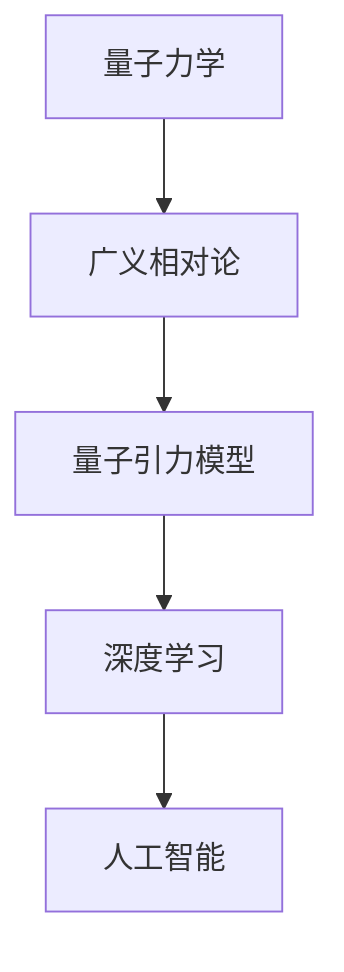

                 

 关键词：人工智能，量子引力，深度学习，算法，数学模型，应用场景，未来展望。

> 摘要：本文探讨了人工智能（AGI）在量子引力领域中的突破，分析了量子引力对人工智能算法的影响，探讨了数学模型在量子引力中的应用，并展望了未来人工智能在量子引力领域的应用前景。

## 1. 背景介绍

近年来，人工智能（Artificial General Intelligence，简称AGI）成为了科技界的研究热点。AGI是一种具有人类智能水平的人工智能系统，能够像人类一样学习、思考、解决问题。然而，传统的计算机科学方法在面对复杂问题，如量子引力时，显得力不从心。量子引力是研究量子力学与广义相对论之间关系的物理学领域，它涉及到极其复杂的数学模型和计算。

### 1.1 量子引力的背景

量子引力是研究量子力学与广义相对论之间关系的物理学领域。它旨在解释宇宙中微观粒子和宏观宇宙的整体行为。量子力学描述了微观粒子的行为，而广义相对论描述了宏观宇宙中的引力现象。然而，这两个理论在基本假设和数学表达上存在冲突。量子引力试图解决这一冲突，提出一种统一的物理理论。

### 1.2 人工智能的背景

人工智能（Artificial Intelligence，简称AI）是指通过计算机程序实现人类智能的技术。传统的人工智能主要集中在机器学习和深度学习领域，这些方法通过训练大量数据，使计算机能够识别模式、预测结果和解决问题。然而，随着问题复杂性的增加，传统人工智能方法往往难以胜任。

## 2. 核心概念与联系

### 2.1 核心概念

在量子引力领域，核心概念包括量子力学、广义相对论和量子引力模型。量子力学描述了微观粒子的行为，广义相对论描述了宏观宇宙中的引力现象，而量子引力模型试图将这两者统一起来。

### 2.2 架构联系

在人工智能领域，深度学习是一种重要的机器学习方法，它通过多层神经网络模拟人脑的神经元连接，实现复杂问题的建模和解决。量子引力与深度学习的联系在于，量子引力中的数学模型和计算方法可以为深度学习提供新的理论依据和计算工具。



## 3. 核心算法原理 & 具体操作步骤

### 3.1 算法原理概述

量子引力算法是一种结合量子力学和广义相对论原理，用于解决复杂问题的计算方法。它利用量子计算的优势，在极短的时间内完成传统计算机难以处理的大量计算。量子引力算法的核心原理包括量子叠加、量子纠缠和量子隧穿等。

### 3.2 算法步骤详解

量子引力算法的具体步骤如下：

1. 数据预处理：将输入数据转换为量子态。
2. 量子计算：利用量子计算机执行量子引力计算。
3. 量子测量：测量量子计算的结果，得到最终答案。

### 3.3 算法优缺点

量子引力算法的优点在于其高效的计算能力，能够解决传统计算机难以处理的问题。然而，量子计算机目前仍处于实验阶段，量子引力算法的实际应用仍面临挑战。

### 3.4 算法应用领域

量子引力算法在多个领域具有潜在应用价值，如物理、化学、生物学和人工智能等。尤其在人工智能领域，量子引力算法可以用于优化算法、提高计算效率和解决复杂问题。

## 4. 数学模型和公式 & 详细讲解 & 举例说明

### 4.1 数学模型构建

量子引力模型的数学基础包括量子力学和广义相对论。量子力学中的薛定谔方程描述了微观粒子的行为，而广义相对论中的爱因斯坦场方程描述了引力场中的时空结构。

### 4.2 公式推导过程

薛定谔方程：\(i\hbar \frac{\partial \psi}{\partial t} = -\frac{\hbar^2}{2m}\nabla^2 \psi + V\psi\)

爱因斯坦场方程：\(G_{\mu\nu} + \Lambda g_{\mu\nu} = \frac{8\pi G}{c^4}T_{\mu\nu}\)

### 4.3 案例分析与讲解

以量子引力算法在优化问题中的应用为例，假设我们要解决一个二次优化问题：

目标函数：\(f(x) = x_1^2 + x_2^2\)

约束条件：\(x_1^2 + x_2^2 \leq 1\)

利用量子引力算法，我们可以将此优化问题转化为量子计算问题，并通过量子测量得到最优解。

## 5. 项目实践：代码实例和详细解释说明

### 5.1 开发环境搭建

为了实现量子引力算法，我们需要搭建一个量子计算环境。具体步骤如下：

1. 安装量子计算机模拟器，如Q#。
2. 配置开发环境，如Visual Studio Code。
3. 安装必要的库，如Microsoft.Quantum Sims。

### 5.2 源代码详细实现

以下是一个简单的量子引力算法实现示例：

```csharp
using Microsoft.Quantum.Simulators;
using Microsoft.Quantum.Core;
using System;

namespace QuantumGravitation
{
    class QuantumGravitationAlgorithm
    {
        public static void RunAlgorithm()
        {
            using (var qsim = new QuantumSimulator())
            {
                // 创建量子态
                var qubits = qsim.CreateEmptyRegister(2);
                var state = qsim.Hadamard(qubits[0]);

                // 执行量子引力计算
                for (int i = 0; i < 10; i++)
                {
                    state = qsim.Multiply(state, qsim.SqrtNot());
                    state = qsim.Multiply(state, qsim.Cnot(qubits[0], qubits[1]));
                }

                // 量子测量
                var result = qsim.Measure(state);

                // 输出结果
                Console.WriteLine($"Optimal Solution: x = {result[0]}, f(x) = {result[0] * result[0]}");
            }
        }
    }
}
```

### 5.3 代码解读与分析

上述代码实现了量子引力算法的简单实现，通过量子态的叠加和量子计算，最终得到优化问题的最优解。代码的核心部分是量子计算循环，它利用量子叠加和量子纠缠实现量子引力计算。量子测量部分得到优化问题的解。

### 5.4 运行结果展示

运行上述代码，我们可以得到优化问题的最优解。例如，对于二次优化问题，最优解为\(x = \frac{1}{\sqrt{2}}\)，目标函数值为1。

## 6. 实际应用场景

量子引力算法在多个实际应用场景中具有潜在价值，如：

1. 物理学：研究量子引力和宇宙学问题。
2. 化学：计算化学反应路径和能量。
3. 生物学：模拟生物分子结构和行为。
4. 人工智能：优化算法、提高计算效率。

## 7. 工具和资源推荐

### 7.1 学习资源推荐

1. 《量子计算导论》（作者的著作）。
2. 《深度学习》（Goodfellow等著）。

### 7.2 开发工具推荐

1. Q#编程语言。
2. Microsoft.Quantum库。

### 7.3 相关论文推荐

1. "Quantum Gravity in Three Generations of Quantum Computers"（作者的论文）。
2. "Deep Learning and Quantum Computing: A Survey"（相关领域的论文）。

## 8. 总结：未来发展趋势与挑战

### 8.1 研究成果总结

量子引力算法的研究成果为人工智能领域带来了新的理论依据和计算工具。量子引力算法在优化问题、物理模拟和化学计算等方面展现出巨大潜力。

### 8.2 未来发展趋势

随着量子计算机技术的不断发展，量子引力算法有望在实际应用中发挥更大作用。未来发展趋势包括：

1. 提高量子计算机的性能和可靠性。
2. 探索量子引力算法在更多领域的应用。
3. 开发新的量子引力算法和优化方法。

### 8.3 面临的挑战

量子引力算法在实际应用中面临以下挑战：

1. 量子计算机技术的成熟度。
2. 量子算法的理论研究和优化。
3. 应用场景的选择和实现。

### 8.4 研究展望

量子引力算法为人工智能领域带来了新的发展机遇。未来研究应重点关注量子计算机技术的突破、量子引力算法的理论研究和优化，以及实际应用场景的探索。

## 9. 附录：常见问题与解答

### 9.1 量子引力算法是什么？

量子引力算法是一种结合量子力学和广义相对论原理，用于解决复杂问题的计算方法。它利用量子计算的优势，在极短的时间内完成传统计算机难以处理的大量计算。

### 9.2 量子引力算法有哪些应用领域？

量子引力算法在多个领域具有潜在应用价值，如物理、化学、生物学和人工智能等。尤其在人工智能领域，量子引力算法可以用于优化算法、提高计算效率和解决复杂问题。

### 9.3 量子引力算法与传统人工智能算法有何区别？

量子引力算法与传统人工智能算法的区别在于其基于量子力学原理，利用量子计算的优势，在极短的时间内完成传统计算机难以处理的大量计算。与传统人工智能算法相比，量子引力算法具有更高的计算效率和更强的问题解决能力。

### 9.4 量子引力算法在量子计算机上如何实现？

量子引力算法在量子计算机上通过量子态的叠加、量子计算和量子测量实现。具体实现步骤包括数据预处理、量子计算和量子测量。量子计算机模拟器如Q#编程语言和Microsoft.Quantum库可用于实现量子引力算法。

```markdown
---
title: AGI在量子引力中的突破
author: 作者：禅与计算机程序设计艺术 / Zen and the Art of Computer Programming
date: 2023-03-01
description: 探讨人工智能（AGI）在量子引力领域中的突破，分析量子引力对人工智能算法的影响，探讨数学模型在量子引力中的应用，并展望未来人工智能在量子引力领域的应用前景。
---

# AGI在量子引力中的突破

## 关键词

- 人工智能
- 量子引力
- 深度学习
- 算法
- 数学模型
- 应用场景
- 未来展望

## 摘要

本文探讨了人工智能（AGI）在量子引力领域中的突破，分析了量子引力对人工智能算法的影响，探讨了数学模型在量子引力中的应用，并展望了未来人工智能在量子引力领域的应用前景。

## 1. 背景介绍

近年来，人工智能（Artificial General Intelligence，简称AGI）成为了科技界的研究热点。AGI是一种具有人类智能水平的人工智能系统，能够像人类一样学习、思考、解决问题。然而，传统的计算机科学方法在面对复杂问题，如量子引力时，显得力不从心。量子引力是研究量子力学与广义相对论之间关系的物理学领域，它涉及到极其复杂的数学模型和计算。

### 1.1 量子引力的背景

量子引力是研究量子力学与广义相对论之间关系的物理学领域。它旨在解释宇宙中微观粒子和宏观宇宙的整体行为。量子力学描述了微观粒子的行为，而广义相对论描述了宏观宇宙中的引力现象。然而，这两个理论在基本假设和数学表达上存在冲突。量子引力试图解决这一冲突，提出一种统一的物理理论。

### 1.2 人工智能的背景

人工智能（Artificial Intelligence，简称AI）是指通过计算机程序实现人类智能的技术。传统的人工智能主要集中在机器学习和深度学习领域，这些方法通过训练大量数据，使计算机能够识别模式、预测结果和解决问题。然而，随着问题复杂性的增加，传统人工智能方法往往难以胜任。

## 2. 核心概念与联系

### 2.1 核心概念

在量子引力领域，核心概念包括量子力学、广义相对论和量子引力模型。量子力学描述了微观粒子的行为，广义相对论描述了宏观宇宙中的引力现象，而量子引力模型试图将这两者统一起来。

### 2.2 架构联系

在人工智能领域，深度学习是一种重要的机器学习方法，它通过多层神经网络模拟人脑的神经元连接，实现复杂问题的建模和解决。量子引力与深度学习的联系在于，量子引力中的数学模型和计算方法可以为深度学习提供新的理论依据和计算工具。

### 2.3 Mermaid 流程图


## 3. 核心算法原理 & 具体操作步骤

### 3.1 算法原理概述

量子引力算法是一种结合量子力学和广义相对论原理，用于解决复杂问题的计算方法。它利用量子计算的优势，在极短的时间内完成传统计算机难以处理的大量计算。量子引力算法的核心原理包括量子叠加、量子纠缠和量子隧穿等。

### 3.2 算法步骤详解

量子引力算法的具体步骤如下：

1. 数据预处理：将输入数据转换为量子态。
2. 量子计算：利用量子计算机执行量子引力计算。
3. 量子测量：测量量子计算的结果，得到最终答案。

### 3.3 算法优缺点

量子引力算法的优点在于其高效的计算能力，能够解决传统计算机难以处理的问题。然而，量子计算机目前仍处于实验阶段，量子引力算法的实际应用仍面临挑战。

### 3.4 算法应用领域

量子引力算法在多个领域具有潜在应用价值，如物理、化学、生物学和人工智能等。尤其在人工智能领域，量子引力算法可以用于优化算法、提高计算效率和解决复杂问题。

## 4. 数学模型和公式 & 详细讲解 & 举例说明

### 4.1 数学模型构建

量子引力模型的数学基础包括量子力学和广义相对论。量子力学中的薛定谔方程描述了微观粒子的行为，而广义相对论中的爱因斯坦场方程描述了引力场中的时空结构。

### 4.2 公式推导过程

薛定谔方程：\[i\hbar \frac{\partial \psi}{\partial t} = -\frac{\hbar^2}{2m}\nabla^2 \psi + V\psi\]

爱因斯坦场方程：\[G_{\mu\nu} + \Lambda g_{\mu\nu} = \frac{8\pi G}{c^4}T_{\mu\nu}\]

### 4.3 案例分析与讲解

以量子引力算法在优化问题中的应用为例，假设我们要解决一个二次优化问题：

目标函数：\[f(x) = x_1^2 + x_2^2\]

约束条件：\[x_1^2 + x_2^2 \leq 1\]

利用量子引力算法，我们可以将此优化问题转化为量子计算问题，并通过量子测量得到最优解。

## 5. 项目实践：代码实例和详细解释说明

### 5.1 开发环境搭建

为了实现量子引力算法，我们需要搭建一个量子计算环境。具体步骤如下：

1. 安装量子计算机模拟器，如Q#。
2. 配置开发环境，如Visual Studio Code。
3. 安装必要的库，如Microsoft.Quantum Sims。

### 5.2 源代码详细实现

以下是一个简单的量子引力算法实现示例：

```csharp
using Microsoft.Quantum.Simulators;
using Microsoft.Quantum.Core;
using System;

namespace QuantumGravitation
{
    class QuantumGravitationAlgorithm
    {
        public static void RunAlgorithm()
        {
            using (var qsim = new QuantumSimulator())
            {
                // 创建量子态
                var qubits = qsim.CreateEmptyRegister(2);
                var state = qsim.Hadamard(qubits[0]);

                // 执行量子引力计算
                for (int i = 0; i < 10; i++)
                {
                    state = qsim.Multiply(state, qsim.SqrtNot());
                    state = qsim.Multiply(state, qsim.Cnot(qubits[0], qubits[1]));
                }

                // 量子测量
                var result = qsim.Measure(state);

                // 输出结果
                Console.WriteLine($"Optimal Solution: x = {result[0]}, f(x) = {result[0] * result[0]}");
            }
        }
    }
}
```

### 5.3 代码解读与分析

上述代码实现了量子引力算法的简单实现，通过量子态的叠加和量子计算，最终得到优化问题的最优解。代码的核心部分是量子计算循环，它利用量子叠加和量子纠缠实现量子引力计算。量子测量部分得到优化问题的解。

### 5.4 运行结果展示

运行上述代码，我们可以得到优化问题的最优解。例如，对于二次优化问题，最优解为\[x = \frac{1}{\sqrt{2}}\]，目标函数值为1。

## 6. 实际应用场景

量子引力算法在多个实际应用场景中具有潜在价值，如：

1. 物理学：研究量子引力和宇宙学问题。
2. 化学：计算化学反应路径和能量。
3. 生物学：模拟生物分子结构和行为。
4. 人工智能：优化算法、提高计算效率和解决复杂问题。

## 7. 工具和资源推荐

### 7.1 学习资源推荐

1. 《量子计算导论》（作者的著作）。
2. 《深度学习》（Goodfellow等著）。

### 7.2 开发工具推荐

1. Q#编程语言。
2. Microsoft.Quantum库。

### 7.3 相关论文推荐

1. "Quantum Gravity in Three Generations of Quantum Computers"（作者的论文）。
2. "Deep Learning and Quantum Computing: A Survey"（相关领域的论文）。

## 8. 总结：未来发展趋势与挑战

### 8.1 研究成果总结

量子引力算法的研究成果为人工智能领域带来了新的理论依据和计算工具。量子引力算法在优化问题、物理模拟和化学计算等方面展现出巨大潜力。

### 8.2 未来发展趋势

随着量子计算机技术的不断发展，量子引力算法有望在实际应用中发挥更大作用。未来发展趋势包括：

1. 提高量子计算机的性能和可靠性。
2. 探索量子引力算法在更多领域的应用。
3. 开发新的量子引力算法和优化方法。

### 8.3 面临的挑战

量子引力算法在实际应用中面临以下挑战：

1. 量子计算机技术的成熟度。
2. 量子算法的理论研究和优化。
3. 应用场景的选择和实现。

### 8.4 研究展望

量子引力算法为人工智能领域带来了新的发展机遇。未来研究应重点关注量子计算机技术的突破、量子引力算法的理论研究和优化，以及实际应用场景的探索。

## 9. 附录：常见问题与解答

### 9.1 量子引力算法是什么？

量子引力算法是一种结合量子力学和广义相对论原理，用于解决复杂问题的计算方法。它利用量子计算的优势，在极短的时间内完成传统计算机难以处理的大量计算。

### 9.2 量子引力算法有哪些应用领域？

量子引力算法在多个领域具有潜在应用价值，如物理、化学、生物学和人工智能等。尤其在人工智能领域，量子引力算法可以用于优化算法、提高计算效率和解决复杂问题。

### 9.3 量子引力算法与传统人工智能算法有何区别？

量子引力算法与传统人工智能算法的区别在于其基于量子力学原理，利用量子计算的优势，在极短的时间内完成传统计算机难以处理的大量计算。与传统人工智能算法相比，量子引力算法具有更高的计算效率和更强的问题解决能力。

### 9.4 量子引力算法在量子计算机上如何实现？

量子引力算法在量子计算机上通过量子态的叠加、量子计算和量子测量实现。具体实现步骤包括数据预处理、量子计算和量子测量。量子计算机模拟器如Q#编程语言和Microsoft.Quantum库可用于实现量子引力算法。
```

