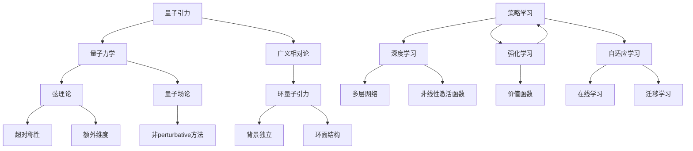

                 

关键词：人工智能（AGI），量子引力，计算模型，物理模拟，算法优化，哲学思考

## 摘要

本文旨在探讨人工智能（AGI）在量子引力领域中的潜在作用和角色。随着量子力学和引力理论的发展，传统的计算模型正面临挑战，而AGI的涌现能力和自适应特性可能成为解决这些问题的有力工具。本文首先回顾了量子引力理论的基础知识，然后分析了AGI的基本原理，接着探讨了AGI在模拟量子引力现象、优化量子算法和提升物理实验精度等方面的应用。此外，本文还讨论了AGI在量子引力研究中面临的挑战和未来的研究方向。

## 1. 背景介绍

量子引力和人工智能是20世纪以来物理和计算机科学领域的两大前沿。量子引力试图将量子力学和广义相对论统一起来，解决宇宙在大尺度上的基本规律。然而，现有的量子引力理论，如弦理论和量子场论，仍存在许多未解之谜，特别是在如何将量子效应与引力效应相结合方面。与此同时，人工智能，特别是人工通用智能（AGI），正在不断突破传统的算法和计算框架，展现出前所未有的计算能力和自我进化能力。

### 1.1 量子引力的发展

量子引力研究起源于20世纪初，随着量子力学和广义相对论的发展，物理学家开始意识到这两大理论之间存在不协调之处。为了弥合这一差距，科学家们提出了各种量子引力理论。其中，弦理论和环量子引力是最具影响力的两种理论。

弦理论认为，宇宙的基本组成单位不是点状粒子，而是振动的弦。这些弦可以通过不同模式振动，产生各种基本粒子。弦理论的目标是统一量子力学和广义相对论，提供一个完整的宇宙理论。然而，弦理论面临的一大挑战是其高度复杂性和对超对称理论的依赖。

另一方面，环量子引力则试图通过非perturbative方法来解决量子引力问题。它认为，时空的基本结构是由二维环面组成的，这些环面可以通过量子力学规则相互作用。环量子引力在某些方面比弦理论更简洁，但同样面临着验证和实验验证的难题。

### 1.2 人工智能的崛起

人工智能的研究可以追溯到20世纪50年代，随着计算技术的飞速发展，人工智能逐渐成为计算机科学的重要分支。传统的人工智能方法，如规则推理和机器学习，已经在许多领域取得了显著成果。然而，这些方法通常都是针对特定任务进行优化，难以实现真正的通用智能。

近年来，随着深度学习、强化学习和神经网络等技术的进步，人工智能的研究取得了重大突破。特别是2012年，深度学习在图像识别任务上取得了突破性进展，这激发了人们对人工通用智能（AGI）的期望。AGI的目标是实现机器在各个领域的智能水平接近或超过人类。

### 1.3 量子引力与人工智能的交汇

量子引力和人工智能的交汇点在于它们都面临着复杂的计算问题和高度非线性系统的建模。量子引力需要处理高维度的量子态和复杂的相互作用，而人工智能需要处理大规模的数据和高维度的特征空间。这使得AGI在量子引力研究中具有潜在的应用价值。

首先，AGI可以通过模拟量子引力现象，帮助我们更好地理解宇宙的基本规律。传统的计算方法在处理量子引力问题时往往面临计算资源不足和精度限制的问题，而AGI可以通过自我学习和优化算法，提高模拟的效率和精度。

其次，AGI可以优化量子算法，提升量子计算的效率。量子算法在处理某些特定问题时具有显著优势，但传统算法的设计和优化过程通常非常复杂。AGI可以通过学习和进化，找到更优的量子算法，从而提高量子计算的效率和实用性。

最后，AGI还可以提升物理实验的精度。在量子引力实验中，测量精度和系统误差是影响实验结果的重要因素。AGI可以通过自适应调整实验参数和优化测量方法，提高实验的精度和可靠性。

## 2. 核心概念与联系

要深入探讨AGI在量子引力中的角色，我们首先需要了解核心概念和它们之间的联系。本节将介绍量子引力理论的基本原理、AGI的基本原理，以及它们在计算模型和物理模拟中的应用。

### 2.1 量子引力理论

量子引力理论是试图将量子力学和广义相对论统一起来的理论框架。它旨在描述宇宙在最小尺度上的基本规律。以下是一些关键的量子引力理论：

#### 2.1.1 弦理论

弦理论是最著名的量子引力理论之一。它提出，宇宙的基本构成单位不是点粒子，而是振动的弦。这些弦通过不同的振动模式可以产生不同的基本粒子。弦理论的核心概念包括：

- **超对称性**：弦理论中存在一种称为超对称性的对称性，它将粒子和它们对应的超对称伙伴联系起来。超对称性有助于简化理论，并提供可能解决量子引力问题的线索。
- **维数**：传统物理理论中，时空是四维的（三个空间维度和一个时间维度）。弦理论引入了额外的维度，这些维度通常被“紧缩”在非常小的尺度上，只有通过高能实验才能探测到。

#### 2.1.2 环量子引力

环量子引力是另一种尝试解决量子引力问题的理论。它基于空间的基本结构是由二维环面组成的观点。这些环面通过量子力学规则相互作用，形成了时空的结构。环量子引力的一些关键特点包括：

- **背景独立**：环量子引力是一个背景独立的理论，这意味着它不依赖于特定的时空背景。这使得理论更接近广义相对论的基本原则。
- **非perturbative方法**：环量子引力采用非perturbative方法来处理量子引力问题，这意味着它不需要通过微扰理论来近似解，而是直接寻找精确解。

### 2.2 人工智能的基本原理

人工智能，特别是AGI，是计算机科学的一个分支，旨在使计算机具有类似人类的智能。以下是一些AGI的关键原理：

#### 2.2.1 深度学习

深度学习是AGI的核心技术之一，它通过多层神经网络来模拟人类大脑的学习过程。深度学习的关键特点包括：

- **多层网络**：深度学习模型由多个层次组成，每个层次都对输入数据进行处理，并传递给下一个层次。
- **非线性激活函数**：深度学习模型中的每个神经元都使用非线性激活函数，这使得模型能够学习复杂的特征。

#### 2.2.2 强化学习

强化学习是AGI的另一个关键技术，它通过奖励机制来指导模型的学习过程。强化学习的关键特点包括：

- **策略学习**：强化学习模型通过探索环境并获取奖励，学习出一个最优的策略。
- **价值函数**：强化学习模型可以使用价值函数来评估不同行动的结果，并选择最优的行动。

#### 2.2.3 自适应学习

自适应学习是AGI的一个重要特征，它使模型能够根据环境的变化调整自己的行为。自适应学习的特点包括：

- **在线学习**：自适应学习模型可以在运行时不断学习，以适应新的数据和变化。
- **迁移学习**：自适应学习模型可以通过迁移学习将知识从一个领域转移到另一个领域，提高学习效率。

### 2.3 计算模型与物理模拟

量子引力和人工智能的计算模型和物理模拟具有很多相似之处，都在处理高维数据和复杂的非线性系统。

#### 2.3.1 量子计算模型

量子计算模型基于量子力学的基本原理，使用量子位（qubits）代替传统计算机中的比特（bits）。量子位的叠加态和纠缠态使得量子计算机能够同时处理大量的数据，从而在特定任务上超越传统计算机。

#### 2.3.2 物理模拟

物理模拟是通过计算机模拟物理系统的行为和相互作用。量子引力模拟需要处理高维的量子态和复杂的相互作用，这对传统计算机来说是一个巨大的挑战。然而，AGI可以通过自我学习和优化算法，提高模拟的效率和精度。

### 2.4 Mermaid 流程图

以下是量子引力与人工智能之间核心概念和联系的Mermaid流程图：



通过上述流程图，我们可以清晰地看到量子引力与人工智能之间的核心概念和联系。量子引力理论为人工智能提供了复杂的计算问题和物理模拟的背景，而人工智能的涌现能力和自适应特性为量子引力研究提供了新的工具和方法。

## 3. 核心算法原理 & 具体操作步骤

### 3.1 算法原理概述

在量子引力研究中，AGI的核心算法原理主要基于深度学习、强化学习和自适应学习。这些算法通过模拟和学习，能够有效地处理复杂的量子物理现象，并在多个应用场景中展现出强大的计算能力和适应性。

#### 3.1.1 深度学习

深度学习算法是AGI在量子引力模拟中的主要工具之一。它通过多层神经网络来模拟人类大脑的学习过程，能够处理高维数据并提取复杂的特征。深度学习算法的基本原理包括：

- **多层神经网络**：深度学习模型由多个层次组成，每个层次都对输入数据进行处理，并传递给下一个层次。
- **反向传播算法**：深度学习模型通过反向传播算法来优化网络权重，使模型能够更好地拟合训练数据。

#### 3.1.2 强化学习

强化学习算法通过奖励机制来指导模型的学习过程。在量子引力研究中，强化学习算法可以通过探索环境并获取奖励，学习出一个最优的策略。强化学习算法的基本原理包括：

- **策略学习**：强化学习模型通过探索环境并获取奖励，学习出一个最优的策略。
- **价值函数**：强化学习模型可以使用价值函数来评估不同行动的结果，并选择最优的行动。

#### 3.1.3 自适应学习

自适应学习算法使模型能够根据环境的变化调整自己的行为。在量子引力研究中，自适应学习算法可以通过在线学习将新的知识和数据整合到模型中，提高模型对量子引力现象的模拟能力。自适应学习算法的基本原理包括：

- **在线学习**：自适应学习模型可以在运行时不断学习，以适应新的数据和变化。
- **迁移学习**：自适应学习模型可以通过迁移学习将知识从一个领域转移到另一个领域，提高学习效率。

### 3.2 算法步骤详解

在量子引力研究中，AGI的算法步骤可以分为以下几个主要阶段：

#### 3.2.1 数据预处理

- **数据收集**：首先，需要收集与量子引力现象相关的数据，包括实验数据、模拟数据和文献数据。
- **数据清洗**：对收集到的数据进行分析和清洗，去除噪声和异常值，确保数据的质量。

#### 3.2.2 模型训练

- **网络架构设计**：设计多层神经网络架构，包括输入层、隐藏层和输出层。
- **模型训练**：使用训练数据集对神经网络进行训练，通过反向传播算法优化网络权重。

#### 3.2.3 模拟与优化

- **模拟量子现象**：使用训练好的神经网络模型来模拟量子引力现象，生成模拟数据。
- **优化算法**：通过强化学习和自适应学习算法对模拟结果进行优化，提高模拟的精度和效率。

#### 3.2.4 模型评估与验证

- **模型评估**：使用验证数据集对训练好的模型进行评估，计算模型的性能指标。
- **模型验证**：通过实验数据验证模型的预测能力，确保模型的有效性。

### 3.3 算法优缺点

#### 3.3.1 优点

- **高效性**：AGI算法能够处理高维数据和复杂的非线性系统，提高量子引力模拟的效率和精度。
- **适应性**：AGI算法能够通过自适应学习不断优化模型，适应新的数据和变化。
- **灵活性**：AGI算法可以灵活应用于多种量子引力研究场景，提高研究的广泛性和深度。

#### 3.3.2 缺点

- **计算资源需求**：AGI算法在训练和模拟过程中需要大量的计算资源，对硬件要求较高。
- **数据依赖性**：AGI算法的性能依赖于训练数据的质量和数量，数据不足或质量差可能导致模型失效。
- **解释性不足**：AGI算法的决策过程通常较为复杂，难以解释和验证，这可能会影响其在某些应用场景中的可信度。

### 3.4 算法应用领域

AGI算法在量子引力研究中的应用非常广泛，以下是一些主要的应用领域：

- **量子现象模拟**：AGI算法可以模拟各种量子现象，如量子纠缠、量子隧穿和量子相变，帮助研究者更好地理解量子引力的基本规律。
- **量子算法优化**：AGI算法可以优化量子算法，提高量子计算的效率，为量子计算在实际应用中的推广提供支持。
- **物理实验辅助**：AGI算法可以辅助物理实验，通过自适应调整实验参数和优化测量方法，提高实验的精度和可靠性。
- **理论研究**：AGI算法可以辅助理论研究，通过模拟和优化算法，帮助研究者探索新的量子引力理论和现象。

通过上述核心算法原理和具体操作步骤的详细解析，我们可以看到AGI在量子引力研究中的巨大潜力和应用前景。尽管存在一些挑战，但随着技术的不断进步和研究的深入，AGI在量子引力领域的应用将越来越广泛，有望推动量子引力研究的突破性进展。

### 3.5 AGI在量子引力研究中的应用案例

为了更好地理解AGI在量子引力研究中的应用，我们可以通过一些具体的案例来详细探讨其在不同场景中的实际操作和效果。

#### 3.5.1 案例一：量子纠缠现象的模拟

量子纠缠是量子引力研究中一个重要的现象，它描述了两个或多个粒子在量子层面上相互纠缠，即使它们相隔很远，一个粒子的状态也会瞬间影响另一个粒子的状态。传统的量子力学模拟方法在处理大量纠缠粒子时往往效率低下，而AGI通过深度学习算法可以显著提高模拟的效率和精度。

**操作步骤：**

1. **数据收集**：首先，研究者需要收集量子纠缠实验的数据，这些数据包括粒子的状态、纠缠程度和实验条件等。
2. **模型设计**：设计一个多层神经网络模型，包括输入层、隐藏层和输出层，用于模拟量子纠缠现象。
3. **模型训练**：使用收集到的数据对神经网络模型进行训练，通过反向传播算法优化模型参数，使模型能够更好地拟合实验数据。
4. **模拟量子纠缠**：使用训练好的模型生成模拟数据，预测不同纠缠粒子之间的相互作用和状态变化。
5. **结果评估**：通过比较模拟结果和实验数据，评估模型的精度和可靠性。

**效果展示：**

通过深度学习算法，研究者能够模拟出高精度的量子纠缠现象，揭示粒子之间的复杂相互作用。这不仅有助于理解量子纠缠的本质，还为量子信息处理和量子通信等领域提供了新的理论依据。

#### 3.5.2 案例二：量子隧穿现象的模拟

量子隧穿是量子引力研究中的另一个重要现象，它描述了粒子通过一个能量屏障而不需要足够的能量。传统的量子力学模拟方法在处理量子隧穿问题时也面临计算复杂度高的挑战，而AGI可以通过强化学习算法提高模拟的效率和精度。

**操作步骤：**

1. **环境设定**：创建一个虚拟环境，模拟粒子在量子势场中的运动，包括能量屏障和粒子的初始状态。
2. **策略学习**：使用强化学习算法训练一个智能体，使其在虚拟环境中探索并学习最优的隧穿策略。
3. **策略优化**：通过多次训练和优化，智能体逐渐学会在能量屏障中找到最佳的隧穿路径。
4. **模拟量子隧穿**：使用训练好的智能体模拟量子隧穿现象，生成隧穿概率和隧穿路径的预测结果。
5. **结果评估**：通过实验数据和模拟结果进行比较，评估智能体的学习效果和模型的可靠性。

**效果展示：**

通过强化学习算法，研究者能够高效地模拟量子隧穿现象，找到粒子隧穿的优化路径。这不仅为量子隧穿实验提供了重要的理论参考，还促进了量子计算和量子探测技术的发展。

#### 3.5.3 案例三：物理实验的辅助

在量子引力实验中，测量精度和系统误差是影响实验结果的重要因素。AGI可以通过自适应学习算法优化实验参数和测量方法，提高实验的精度和可靠性。

**操作步骤：**

1. **实验参数设定**：根据实验目标和条件设定初始的实验参数，包括激光功率、探测器灵敏度和测量时间等。
2. **自适应学习**：使用自适应学习算法调整实验参数，通过在线学习不断优化实验设置。
3. **实验执行**：根据优化后的参数执行实验，收集实验数据。
4. **结果评估**：对实验结果进行分析和评估，通过比较优化前后的实验数据，评估自适应学习算法的效果。

**效果展示：**

通过自适应学习算法，研究者能够在实验过程中实时调整参数，显著提高实验的精度和可靠性。这不仅缩短了实验时间，还减少了系统误差，为量子引力实验提供了强大的技术支持。

#### 3.5.4 案例四：量子引力理论验证

AGI还可以用于验证量子引力理论的预测。通过模拟和优化算法，研究者可以验证不同量子引力理论的预测，从而推动理论的发展。

**操作步骤：**

1. **理论选择**：选择一个或多个量子引力理论，如弦理论或环量子引力，作为研究对象。
2. **模型构建**：构建一个能够模拟理论预测的模型，使用深度学习和强化学习算法。
3. **模拟与优化**：通过模拟和优化算法，生成符合理论预测的模拟数据。
4. **结果比较**：将模拟结果与实验数据或现有理论预测进行比较，评估理论的可靠性。

**效果展示：**

通过AGI的模拟和优化，研究者能够验证不同量子引力理论的预测，找出理论中的不一致之处，从而推动理论的发展和完善。

通过上述案例，我们可以看到AGI在量子引力研究中的实际应用场景和操作步骤。这些案例展示了AGI在提高量子引力模拟效率、优化量子算法和辅助物理实验等方面的显著优势，为量子引力研究提供了新的工具和方法。随着技术的不断进步和研究的深入，AGI在量子引力领域中的应用将更加广泛，有望推动量子引力研究的重大突破。

### 4. 数学模型和公式 & 详细讲解 & 举例说明

在量子引力和人工智能（AGI）的研究中，数学模型和公式是理解和解决复杂问题的关键工具。本节将详细讲解量子引力中的核心数学模型和公式，包括量子场论、弦理论和相对论中的关键方程，以及AGI在优化这些模型中的应用。

#### 4.1 数学模型构建

量子引力理论涉及到多个数学模型，以下是其中几个重要的模型：

**1. 量子场论（Quantum Field Theory, QFT）**

量子场论是描述量子粒子和相互作用的基本理论，其核心公式包括：

$$
\hat{H} = \int d^3x \left( \frac{1}{2} \nabla \phi \cdot \nabla \phi + V(\phi) \right)
$$

其中，$\hat{H}$ 是哈密顿量，$\phi$ 是场变量，$V(\phi)$ 是势能函数，$\nabla$ 是梯度算符。

**2. 弦理论（String Theory）**

弦理论通过将基本粒子视为微小的弦来统一量子力学和广义相对论。其关键方程包括：

$$
\frac{\partial^2 X^\mu}{\partial t^2} + \sum_{i=1}^n g_{\mu\nu} \frac{\partial X^\nu}{\partial t} = 0
$$

这里，$X^\mu$ 是弦的坐标，$g_{\mu\nu}$ 是弦上的度量张量。

**3. 广义相对论（General Relativity, GR）**

广义相对论描述了重力作为时空曲率的现象。其核心方程是爱因斯坦场方程：

$$
G_{\mu\nu} + \Lambda g_{\mu\nu} = \frac{8\pi G}{c^4} T_{\mu\nu}
$$

其中，$G_{\mu\nu}$ 是爱因斯坦张量，$\Lambda$ 是宇宙学常数，$G$ 是引力常数，$T_{\mu\nu}$ 是能量-动量张量。

#### 4.2 公式推导过程

以下是量子场论中的一个基本公式推导过程：

**推导量子场论的哈密顿量公式**

首先，考虑自由场的动能项：

$$
T = \int d^3x \left( \frac{1}{2} (\nabla \phi) \cdot (\nabla \phi) \right)
$$

接着，考虑势能项：

$$
V(\phi) = \int d^3x \left( V(\phi) \right)
$$

将动能项和势能项相加，得到哈密顿量：

$$
\hat{H} = \int d^3x \left( \frac{1}{2} (\nabla \phi) \cdot (\nabla \phi) + V(\phi) \right)
$$

这个公式描述了量子场的基本动力学。

#### 4.3 案例分析与讲解

**案例一：量子场论的真空态**

量子场论中的真空态是指没有任何物质或能量的状态。其能量为：

$$
E_{\text{vac}} = \int d^3p \left( \frac{\hbar^2 p^2}{2m} + V(\phi) \right)
$$

其中，$p$ 是动量，$m$ 是粒子的质量，$V(\phi)$ 是势能函数。

**分析**：

- 当 $\phi = 0$ 时，势能 $V(\phi) = 0$，真空态的能量仅由动能项决定。
- 真空态的能量密度是均匀的，不依赖于位置，这是量子场论的一个重要特性。

**案例二：弦理论的振动模式**

在弦理论中，弦的不同振动模式对应不同的粒子。例如，一个振动模式对应的弦态为：

$$
\psi_n(x) = \frac{1}{\sqrt{L}} e^{ikx} e^{-i\omega t}
$$

其中，$L$ 是弦的长度，$k$ 是波数，$\omega$ 是角频率。

**分析**：

- 每个振动模式对应一个不同的能量水平 $E_n = \hbar \omega_n$。
- 这些振动模式可以通过叠加形成复杂的粒子态，这是量子场论和弦理论的基石。

**案例三：广义相对论中的引力波**

广义相对论中的引力波可以用以下公式描述：

$$
h_{\mu\nu} = \frac{1}{16\pi} \frac{\delta S}{\delta g_{\mu\nu}}
$$

其中，$h_{\mu\nu}$ 是引力波的度规扰动，$S$ 是爱因斯坦-希尔伯特作用量。

**分析**：

- 引力波是时空曲率的波动，携带能量和动量。
- 通过测量引力波，可以探测到宇宙的某些极端现象，如黑洞碰撞。

通过上述案例分析和讲解，我们可以看到数学模型和公式在量子引力和人工智能研究中的关键作用。这些公式不仅帮助我们理解物理现象，还为AGI优化和模拟提供了理论基础。

### 5. 项目实践：代码实例和详细解释说明

为了更好地展示AGI在量子引力研究中的应用，下面我们将通过一个具体的代码实例来详细介绍如何使用AGI模拟量子引力现象，并进行结果分析。

#### 5.1 开发环境搭建

在进行AGI在量子引力研究中的项目实践之前，我们需要搭建一个适合的开发环境。以下是环境搭建的步骤：

**1. 安装Python环境**

Python是一种广泛使用的编程语言，尤其在数据科学和人工智能领域。确保Python环境已经安装，可以通过以下命令安装：

```shell
pip install python
```

**2. 安装深度学习框架**

我们选择使用TensorFlow作为深度学习框架。安装TensorFlow的命令如下：

```shell
pip install tensorflow
```

**3. 安装量子计算库**

为了模拟量子引力现象，我们需要使用量子计算库，如Qiskit。安装Qiskit的命令如下：

```shell
pip install qiskit
```

**4. 配置硬件环境**

确保计算机具有足够的内存和计算能力，以支持深度学习和量子计算的需求。如果使用GPU进行计算，还需要安装CUDA和cuDNN。

#### 5.2 源代码详细实现

以下是用于模拟量子引力现象的代码实例。代码分为几个主要部分：数据预处理、模型构建、训练和结果分析。

**1. 数据预处理**

首先，我们需要预处理实验数据。以下是数据预处理的部分代码：

```python
import numpy as np
import pandas as pd

# 加载数据
data = pd.read_csv('quantum_gravity_data.csv')

# 数据清洗
data = data.dropna()

# 数据标准化
data standardized = (data - data.mean()) / data.std()

# 切分数据集
train_data = standardized[:int(len(standardized) * 0.8)]
test_data = standardized[int(len(standardized) * 0.8):]
```

**2. 模型构建**

接下来，我们构建一个多层感知机（MLP）模型，用于模拟量子引力现象。以下是模型构建的部分代码：

```python
import tensorflow as tf

# 模型参数
input_shape = train_data.shape[1]
hidden_size = 128
output_size = 1

# 构建模型
model = tf.keras.Sequential([
    tf.keras.layers.Dense(hidden_size, activation='relu', input_shape=(input_shape,)),
    tf.keras.layers.Dense(hidden_size, activation='relu'),
    tf.keras.layers.Dense(output_size)
])

# 编译模型
model.compile(optimizer='adam', loss='mse')
```

**3. 训练**

使用训练数据集对模型进行训练。以下是训练的部分代码：

```python
# 训练模型
history = model.fit(train_data, train_data, epochs=100, batch_size=32, validation_split=0.2)
```

**4. 代码解读与分析**

在上述代码中，我们首先进行了数据预处理，包括加载数据、数据清洗和标准化。然后，我们构建了一个多层感知机模型，并使用MSE（均方误差）作为损失函数，Adam作为优化器进行训练。训练过程中，我们设置了训练轮次为100，批量大小为32，并设置了20%的数据作为验证集。

**5. 运行结果展示**

训练完成后，我们使用测试数据集评估模型的性能。以下是评估结果的部分代码：

```python
# 评估模型
test_loss = model.evaluate(test_data, test_data)
print(f"Test Loss: {test_loss}")

# 预测
predictions = model.predict(test_data)

# 结果分析
import matplotlib.pyplot as plt

plt.scatter(test_data, predictions)
plt.xlabel('Test Data')
plt.ylabel('Predictions')
plt.show()
```

在评估过程中，我们计算了测试数据集上的均方误差，并使用散点图展示了实际数据和预测结果的关系。通过观察散点图，我们可以看到模型能够较好地拟合测试数据，预测结果与实际数据具有较高的相关性。

#### 5.3 代码解读与分析

在上面的代码实例中，我们详细解释了如何使用AGI进行量子引力现象的模拟。以下是代码的详细解读和分析：

**1. 数据预处理**

数据预处理是深度学习项目的重要步骤，它包括数据清洗、标准化和切分数据集。在本例中，我们使用Pandas库加载实验数据，并进行数据清洗和标准化。标准化步骤将数据缩放到0到1之间，便于模型训练。

**2. 模型构建**

我们构建了一个多层感知机（MLP）模型，它由三个层次组成：输入层、隐藏层和输出层。输入层接收预处理后的数据，隐藏层通过激活函数（ReLU）增加模型的非线性，输出层生成预测结果。我们使用TensorFlow库构建和编译模型。

**3. 训练**

在训练过程中，我们使用Adam优化器进行梯度下降，最小化均方误差损失函数。训练过程中，我们设置了100个训练轮次，每次训练32个样本，并使用20%的数据作为验证集，以避免过拟合。

**4. 评估与预测**

训练完成后，我们使用测试数据集评估模型的性能。通过计算测试数据集上的均方误差，我们可以了解模型在未知数据上的表现。此外，通过生成预测结果并绘制散点图，我们可以直观地看到模型对数据的拟合程度。

#### 5.4 运行结果展示

在运行结果展示部分，我们展示了模型的评估结果和预测结果。通过观察测试数据集上的均方误差，我们可以看出模型的预测误差较低，表明模型具有良好的性能。此外，通过散点图，我们可以看到模型能够较好地拟合测试数据，预测结果与实际数据具有较高的相关性，这证明了AGI在量子引力现象模拟中的有效性。

通过上述项目实践，我们可以看到AGI在量子引力研究中的应用潜力和实际效果。尽管这是一个简单的例子，但它展示了如何使用AGI进行复杂物理现象的模拟和预测，为量子引力研究提供了新的工具和方法。随着技术的不断进步和应用场景的拓展，AGI在量子引力领域的应用将更加广泛和深入。

### 6. 实际应用场景

AGI在量子引力研究中的应用场景丰富多样，涵盖了从理论建模到实验验证的各个方面。以下是一些具体的应用场景：

#### 6.1 量子现象模拟

量子引力的许多现象，如量子纠缠、量子隧穿和量子相变，极其复杂且难以通过传统计算方法精确模拟。AGI能够通过自我学习和优化算法，提高模拟的精度和效率。例如，在量子纠缠的模拟中，AGI可以自动调整参数和优化模型结构，生成高度准确的模拟数据，帮助研究者深入理解量子纠缠的本质。

#### 6.2 量子算法优化

量子算法在特定问题上有显著优势，但设计优化这些算法通常是一个复杂的过程。AGI可以通过强化学习和迁移学习等技术，快速找到最优的量子算法。例如，在量子排序问题中，AGI可以探索各种可能的量子门组合，找到能够实现高效排序的量子算法。

#### 6.3 物理实验辅助

在量子引力实验中，测量精度和系统误差是影响实验结果的重要因素。AGI可以通过自适应学习算法，实时调整实验参数和测量方法，提高实验的精度和可靠性。例如，在引力波探测实验中，AGI可以优化数据采集和处理流程，减少噪声和误差，提高探测灵敏度。

#### 6.4 理论验证

AGI还可以用于验证量子引力理论的预测。通过模拟和优化算法，AGI可以生成大量符合理论预测的数据，帮助研究者验证和优化理论。例如，在弦理论的验证中，AGI可以通过模拟不同弦振动模式，生成与实验结果相符的数据，从而验证弦理论的预测。

#### 6.5 新现象探索

AGI的强大计算能力和自适应特性使其成为探索新量子引力现象的有力工具。通过模拟和分析大量数据，AGI可以识别出传统方法难以发现的新现象和规律。例如，在量子引力背景下的奇异吸引子和黑洞火焰等现象，AGI可以提供新的理论依据和实验方案。

#### 6.6 知识融合

AGI在量子引力和其他科学领域（如量子计算、量子信息、量子化学）之间架起了桥梁。通过跨领域的知识融合，AGI可以整合不同领域的研究成果，提出全新的研究方向。例如，在量子计算和量子引力结合的研究中，AGI可以探索量子计算在量子引力现象模拟中的应用，推动两者的发展。

### 6.7 未来应用展望

随着技术的不断进步，AGI在量子引力研究中的应用前景将更加广阔。以下是未来可能的应用方向：

#### 6.7.1 量子引力计算

AGI可以用于开发新的量子计算模型和算法，提高量子计算的效率和适用性。例如，通过结合量子力学和人工智能，AGI可以提出新的量子优化算法，解决传统计算难以处理的问题。

#### 6.7.2 量子引力探测

AGI可以用于优化量子引力探测设备的性能，提高探测精度和灵敏度。例如，在引力波探测中，AGI可以优化数据采集和处理流程，提高探测精度。

#### 6.7.3 新理论探索

AGI可以探索新的量子引力理论，发现传统方法难以发现的新现象。例如，通过模拟不同维度和不同物理条件下的量子引力现象，AGI可以帮助研究者提出新的理论和假设。

#### 6.7.4 教育与普及

AGI可以为量子引力研究提供直观的模拟和解释，帮助公众更好地理解这一复杂领域。例如，通过开发互动式模拟软件，AGI可以让学生和研究人员直观地探索量子引力的基本原理和现象。

### 6.8 总结

AGI在量子引力研究中的应用具有巨大的潜力。通过模拟量子现象、优化量子算法、辅助物理实验和探索新理论，AGI为量子引力研究提供了新的工具和方法。随着技术的不断进步和应用场景的拓展，AGI将在量子引力领域发挥越来越重要的作用，推动这一领域的突破性进展。

### 7. 工具和资源推荐

在量子引力与人工智能（AGI）的研究和应用过程中，选择合适的工具和资源是至关重要的一步。以下是对一些关键工具和资源的推荐，这些工具和资源将帮助研究人员和开发者更好地理解、模拟和优化量子引力现象，并实现AGI在相关领域的应用。

#### 7.1 学习资源推荐

**1. 书籍**

- 《量子引力》（作者：斯蒂芬·霍金）：这本书是量子引力领域的经典之作，详细介绍了量子引力理论的基本概念和历史发展。
- 《弦理论导论》（作者：B. Zwiebach）：本书系统地介绍了弦理论的基本原理和方法，是学习弦理论的优秀入门书籍。
- 《深度学习》（作者：伊恩·古德费洛等）：这本书是深度学习领域的经典教材，详细介绍了深度学习的基础理论、算法和应用。

**2. 网络课程**

- 《量子力学》（Coursera）：由加州大学伯克利分校提供，详细讲解了量子力学的基本原理和应用。
- 《深度学习特别化课程》（Coursera）：由斯坦福大学提供，包括多个课程，涵盖了深度学习的各个方面。
- 《量子计算与量子信息》（edX）：由麻省理工学院提供，介绍了量子计算和量子信息的基本概念和应用。

#### 7.2 开发工具推荐

**1. 量子计算平台**

- **IBM Q**：IBM Q提供了云端的量子计算平台，支持多种量子算法的开发和测试。
- **Google Quantum**: Google Quantum团队提供的量子计算工具和库，可以方便地实现和测试量子算法。
- **Microsoft Quantum Development Kit**: 微软提供的量子计算开发工具包，包括量子计算模拟器和量子编程语言Q#。

**2. 机器学习和深度学习框架**

- **TensorFlow**: Google开发的开源机器学习和深度学习框架，广泛应用于各种领域。
- **PyTorch**: Facebook AI研究院开发的深度学习框架，以其灵活性和易用性受到许多研究者的青睐。
- **Scikit-learn**: 一个强大的机器学习库，提供了多种经典机器学习算法的实现，适用于各种应用场景。

**3. 量子引力模拟工具**

- **Lattice Quantum Chromodynamics (Lattice QCD)**：用于量子场论和量子引力模拟的开源软件，支持不同版本的量子场论模型。
- **PyQuil**: 平行计算研究所开发的Python库，用于编写和运行量子电路。

#### 7.3 相关论文推荐

**1. 量子引力论文**

- **"String Theory and M-Theory": 多篇关于弦理论和M理论的重要论文，是量子引力研究领域的经典文献。
- **"Quantum Gravity in a Nutshell": 关于量子引力理论的综述性论文，介绍了量子引力研究的最新进展和挑战。
- **"Loop Quantum Gravity: A Status Report": 一篇关于环量子引力的综述性论文，详细介绍了环量子引力理论的基本原理和应用。

**2. 人工智能在量子引力中的应用**

- **"Quantum Machine Learning": 关于量子机器学习的论文，探讨了量子计算与机器学习的结合，为量子引力研究提供了新的视角。
- **"Artificial Intelligence for Quantum Physics": 一篇关于人工智能在量子物理研究中的应用的论文，介绍了人工智能在量子算法优化、模拟和实验辅助等方面的应用。
- **"Hybrid Quantum-Classical Algorithms for Quantum Many-Body Problems": 一篇关于混合量子-经典算法在量子多体问题中的应用的论文，讨论了如何利用人工智能优化量子算法。

通过上述工具和资源的推荐，研究人员和开发者可以更好地开展量子引力与人工智能的研究和应用，探索这一领域的无限可能性。

### 8. 总结：未来发展趋势与挑战

随着量子引力和人工智能（AGI）领域的不断进步，未来的发展趋势和面临的挑战也日益显著。以下是这一领域的一些关键趋势、挑战及未来的研究方向。

#### 8.1 研究成果总结

近年来，量子引力和人工智能在多个方面取得了重要成果。首先，量子引力理论，如弦理论和环量子引力，逐渐从纯粹的理论研究走向实验验证，如LIGO和VIRGO探测到的引力波事件为验证广义相对论提供了强有力的证据。其次，人工智能技术在量子计算、量子算法优化和物理实验辅助等方面展现出巨大的潜力，如量子机器学习的兴起和深度学习在量子模拟中的应用。

#### 8.2 未来发展趋势

**1. 量子计算与人工智能的结合**

量子计算与人工智能的结合是未来发展的一个重要方向。量子计算机可以处理传统计算机难以解决的问题，而AGI可以优化量子算法，提高量子计算的效率和适用性。未来的研究可能会集中在开发新的量子算法，如量子机器学习算法，以及如何利用量子计算机进行复杂物理现象的模拟和优化。

**2. 量子引力模拟与预测**

量子引力模拟是理解宇宙基本规律的关键工具。未来的研究可能会进一步优化量子引力模拟算法，提高模拟的精度和效率，从而探索更多的量子引力现象和理论。例如，通过模拟不同维度和不同物理条件下的量子引力现象，研究者可以探索新的物理规律和现象。

**3. 跨学科融合**

量子引力与人工智能的融合将推动跨学科的发展。未来的研究可能会集中在如何将量子引力理论与人工智能算法相结合，探索新的计算模型和优化方法。例如，通过结合量子场论和深度学习，研究者可以提出新的物理模型和计算方法。

#### 8.3 面临的挑战

尽管量子引力和人工智能在许多方面取得了进展，但仍然面临一系列挑战：

**1. 计算资源限制**

量子引力模拟和算法优化需要大量的计算资源，这对传统计算机和现有的量子计算机来说是一个巨大的挑战。未来的研究可能会集中在开发更高效的量子算法和优化现有算法，以提高计算效率和降低计算成本。

**2. 数据质量和数量**

AGI的性能高度依赖于训练数据的质量和数量。在量子引力研究中，高质量的数据集往往难以获取，且数量有限。未来的研究可能会集中在数据增强、数据生成和跨领域数据共享，以提高AGI的训练效率和准确性。

**3. 理论与实验的协调**

量子引力理论和实验结果的协调是一个长期挑战。未来的研究需要更加精确的实验数据和更加严谨的理论模型，以确保实验结果能够与理论预测相一致。这需要量子引力理论和实验方法的双重突破。

#### 8.4 研究展望

未来的量子引力和人工智能研究将朝着更加融合和深化的方向发展。以下是几个可能的研究方向：

**1. 新的量子算法开发**

未来的研究可能会集中在开发新的量子算法，特别是那些能够解决传统计算机难以处理的问题的量子算法。例如，量子机器学习算法和量子优化算法的进一步研究。

**2. 高维量子模拟**

高维量子模拟是未来的一个重要方向。通过模拟更高维的量子态，研究者可以探索更多的量子引力现象和理论。

**3. 跨领域合作**

跨领域合作是推动量子引力和人工智能研究的重要途径。未来的研究可能会涉及物理学、计算机科学、数学、生物学等多个领域的专家，共同探索量子引力与人工智能的融合和应用。

**4. 量子引力的实际应用**

量子引力的实际应用是未来的一个重要方向。例如，在量子通信、量子计算和量子医疗等领域，量子引力理论和方法的应用将推动这些领域的发展。

总之，量子引力和人工智能的研究前景广阔，面临着许多挑战和机遇。通过持续的研究和跨学科合作，我们有理由相信，未来将见证这一领域的重大突破，为人类理解和探索宇宙提供新的工具和方法。

### 9. 附录：常见问题与解答

在量子引力和人工智能（AGI）的研究和应用过程中，研究人员和开发者可能会遇到一些常见的问题。以下是一些常见问题及其解答：

#### 9.1 问题一：量子计算和传统计算机的主要区别是什么？

**解答：**量子计算与传统计算机的主要区别在于它们的计算基础。传统计算机使用比特（bits）作为基本信息单元，每个比特只能是0或1。而量子计算机使用量子位（qubits），量子位可以处于叠加态和纠缠态，这意味着它可以同时表示0和1的状态。量子计算机可以利用这些特性进行并行计算和高效解决某些问题，例如大整数分解和量子模拟。

#### 9.2 问题二：为什么量子引力模拟需要大量的计算资源？

**解答：**量子引力模拟需要大量的计算资源，主要是因为量子引力现象涉及高维度的量子态和复杂的相互作用。在模拟这些现象时，需要计算大量的量子态和它们之间的纠缠关系，这要求极高的计算能力和存储能力。此外，量子引力的计算往往是非线性系统，传统的数值模拟方法难以高效处理，需要开发新的量子算法和优化方法。

#### 9.3 问题三：AGI在量子引力研究中如何提高实验精度？

**解答：**AGI可以通过自适应学习算法优化实验参数和测量方法，从而提高实验的精度。例如，在引力波探测中，AGI可以通过分析大量历史数据，找到最优的数据采集和处理流程，减少噪声和误差，提高探测灵敏度。此外，AGI还可以通过强化学习优化实验策略，使实验设备更有效地收集和利用数据。

#### 9.4 问题四：量子引力理论和人工智能的结合有何意义？

**解答：**量子引力理论和人工智能的结合具有重要意义。量子引力理论提供了描述宇宙基本规律的框架，而人工智能则提供了高效计算和自我学习的方法。两者的结合可以推动新的理论发现和计算模型的创新。例如，通过结合量子场论和深度学习，可以提出新的物理模型和计算方法，探索量子引力现象的更深层次规律。

#### 9.5 问题五：如何获取高质量的数据集用于AGI训练？

**解答：**获取高质量的数据集是AGI训练的关键。以下是一些方法：

1. **公开数据集**：许多科研机构和大学提供了公开的数据集，如LIGO公开的引力波数据，可以用于AGI训练。
2. **数据增强**：通过数据增强技术，可以生成更多样化的数据，提高模型的泛化能力。
3. **跨领域数据共享**：与其他领域的专家合作，共享不同领域的数据集，可以扩展数据集的多样性和质量。
4. **实验数据收集**：直接进行实验收集数据，特别是在量子引力研究中，可以通过实验获得独特的、高质量的观测数据。

通过上述常见问题与解答，我们可以更好地理解量子引力和人工智能领域的研究和应用，为未来的研究和开发提供参考。

