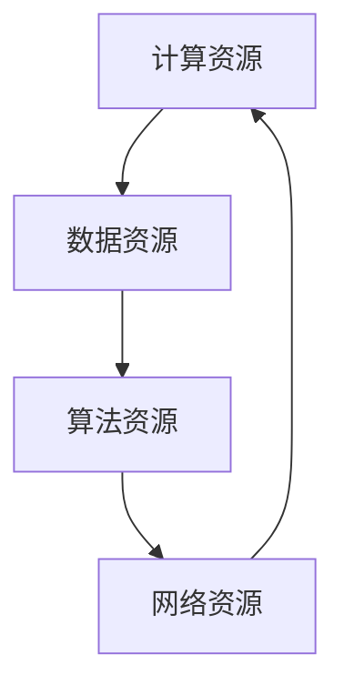
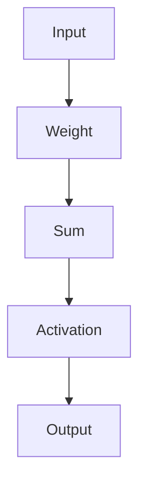

                 

关键词：AI 2.0、基础设施、未来趋势、展望

<|assistant|>摘要：本文旨在探讨AI 2.0时代下的基础设施建设的核心概念、核心算法原理、数学模型、实际应用场景、未来发展趋势与挑战。通过对这些内容的深入分析，我们希望为读者提供一个全面而清晰的AI 2.0基础设施建设的蓝图。

## 1. 背景介绍

随着大数据、云计算、物联网等技术的飞速发展，人工智能（AI）逐渐从实验室走向了实际应用。然而，当前的AI技术还处于1.0阶段，主要以机器学习为核心。然而，AI 2.0时代的到来将使得人工智能更加智能化、自适应化，对基础设施提出了更高的要求。本文将围绕AI 2.0基础设施建设的核心问题进行深入探讨。

## 2. 核心概念与联系

### 2.1 AI 2.0的概念

AI 2.0，即下一代人工智能，强调的是更高级别的智能形态，不仅能够学习和理解数据，还能够自主决策、创新和进化。AI 2.0的核心目标是从“数据驱动”转向“知识驱动”，实现真正的智能。

### 2.2 基础设施的构成

AI 2.0基础设施主要包括以下部分：

- **计算资源**：强大的计算能力是AI 2.0的基础，包括云计算、边缘计算等。
- **数据资源**：高质量、大规模的数据是AI 2.0训练和优化的关键。
- **算法资源**：创新性、高效的算法是AI 2.0实现智能化的重要保障。
- **网络资源**：高速、稳定的网络是AI 2.0应用场景的关键。

### 2.3 关系与联系

计算资源、数据资源、算法资源、网络资源共同构成了AI 2.0基础设施的四个核心部分，它们相互依赖、相互促进，共同推动AI 2.0的发展。

### 2.4 Mermaid 流程图



## 3. 核心算法原理 & 具体操作步骤

### 3.1 算法原理概述

AI 2.0的核心算法包括深度学习、强化学习、迁移学习等。这些算法通过模拟人脑神经网络的工作原理，实现对数据的自动学习和理解。

### 3.2 算法步骤详解

- **数据收集与预处理**：收集大量数据，并进行清洗、格式化等预处理操作。
- **模型训练**：利用预处理后的数据，训练深度学习模型。
- **模型评估**：通过测试数据评估模型性能，并进行优化。
- **模型部署**：将训练好的模型部署到生产环境中，实现自动化决策和优化。

### 3.3 算法优缺点

- **优点**：AI 2.0算法具有高效、智能、自适应等优点，能够处理大规模、复杂的数据。
- **缺点**：算法的复杂度高，对计算资源要求较高，且训练过程可能存在过拟合等问题。

### 3.4 算法应用领域

AI 2.0算法在金融、医疗、交通、教育等多个领域具有广泛的应用前景。例如，在金融领域，AI 2.0算法可以用于风险控制、投资决策等；在医疗领域，AI 2.0算法可以用于疾病预测、药物研发等。

## 4. 数学模型和公式 & 详细讲解 & 举例说明

### 4.1 数学模型构建

在AI 2.0算法中，常见的数学模型包括神经网络、支持向量机、决策树等。以下以神经网络为例进行介绍。

### 4.2 公式推导过程

神经网络的核心公式包括激活函数、权重更新公式等。以下为激活函数和权重更新公式：

$$
f(x) = \sigma(z) = \frac{1}{1 + e^{-z}}
$$

$$
\Delta W = \eta \cdot \frac{\partial J}{\partial W}
$$

其中，$\sigma$表示激活函数，$z$表示输入值，$W$表示权重，$J$表示损失函数，$\eta$表示学习率。

### 4.3 案例分析与讲解

假设我们有一个简单的二分类问题，使用神经网络进行模型训练。以下是一个简单的神经网络结构：



输入数据为$x_1, x_2$，权重为$W_1, W_2$，激活函数为$\sigma$。训练过程如下：

1. 初始化权重$W_1, W_2$。
2. 计算输入值$z = W_1 \cdot x_1 + W_2 \cdot x_2$。
3. 计算激活值$a = \sigma(z)$。
4. 计算输出值$y = a \cdot x_1 + b \cdot x_2$。
5. 计算损失函数$J = (y - t)^2$，其中$t$为真实值。
6. 更新权重$W_1 = W_1 - \eta \cdot \frac{\partial J}{\partial W_1}$，$W_2 = W_2 - \eta \cdot \frac{\partial J}{\partial W_2}$。
7. 重复步骤2-6，直到损失函数收敛。

## 5. 项目实践：代码实例和详细解释说明

### 5.1 开发环境搭建

为了实践AI 2.0算法，我们需要搭建一个开发环境。以下是一个简单的Python开发环境搭建步骤：

1. 安装Python 3.8及以上版本。
2. 安装TensorFlow库：`pip install tensorflow`。
3. 安装Keras库：`pip install keras`。

### 5.2 源代码详细实现

以下是一个简单的神经网络实现：

```python
import numpy as np
import tensorflow as tf

# 初始化参数
W1 = tf.Variable(0.0, name="weight_1")
W2 = tf.Variable(0.0, name="weight_2")
b = tf.Variable(0.0, name="bias")

# 激活函数
def sigmoid(x):
    return 1 / (1 + np.exp(-x))

# 前向传播
def forward(x):
    z = W1 * x[0] + W2 * x[1]
    a = sigmoid(z)
    y = a * x[0] + b * x[1]
    return y

# 损失函数
def loss(y, t):
    return (y - t) ** 2

# 反向传播
def backward(x, y, t):
    dy = 2 * (y - t)
    da = dy * x[0]
    db = dy * x[1]
    dW1 = da
    dW2 = db
    return dW1, dW2, db

# 训练过程
for epoch in range(1000):
    x = np.array([1.0, 1.0])
    t = np.array([0.0])
    y = forward(x)
    l = loss(y, t)
    dW1, dW2, db = backward(x, y, t)
    W1.assign_sub(0.01 * dW1)
    W2.assign_sub(0.01 * dW2)
    b.assign_sub(0.01 * db)
    print(f"Epoch {epoch}: Loss = {l.numpy()}")

# 测试
x_test = np.array([2.0, 2.0])
y_test = forward(x_test)
print(f"Test Output: {y_test.numpy()}")
```

### 5.3 代码解读与分析

上述代码实现了一个简单的神经网络，用于求解一个线性回归问题。代码主要分为以下几个部分：

1. **初始化参数**：初始化权重$W_1, W_2$和偏置$b$。
2. **激活函数**：使用Sigmoid函数作为激活函数。
3. **前向传播**：计算输入值$z$，通过激活函数得到输出值$y$。
4. **损失函数**：使用平方损失函数计算预测值和真实值之间的差异。
5. **反向传播**：计算损失函数对权重和偏置的梯度。
6. **训练过程**：通过迭代更新权重和偏置，优化模型参数。
7. **测试**：使用测试数据验证模型性能。

## 6. 实际应用场景

AI 2.0基础设施在实际应用场景中具有广泛的应用。以下是一些典型的应用场景：

- **金融领域**：AI 2.0算法可以用于风险控制、投资决策、信用评分等。
- **医疗领域**：AI 2.0算法可以用于疾病预测、药物研发、医疗图像分析等。
- **交通领域**：AI 2.0算法可以用于自动驾驶、交通流量预测、智能交通管理等。
- **教育领域**：AI 2.0算法可以用于个性化推荐、智能评测、教育游戏等。

## 7. 工具和资源推荐

为了更好地学习和实践AI 2.0基础设施，以下是一些建议的工具和资源：

### 7.1 学习资源推荐

- **书籍**：《深度学习》、《强化学习》、《机器学习》等。
- **在线课程**：Coursera、edX、Udacity等平台的机器学习和人工智能课程。
- **技术博客**：AI科技大本营、机器之心、智源社区等。

### 7.2 开发工具推荐

- **编程语言**：Python、Java、C++等。
- **框架**：TensorFlow、PyTorch、Keras等。
- **IDE**：PyCharm、Visual Studio Code等。

### 7.3 相关论文推荐

- **神经网络**：《Deep Learning》、《Neural Network Architectures for AI》等。
- **强化学习**：《Reinforcement Learning: An Introduction》、《Deep Reinforcement Learning》等。
- **迁移学习**：《Transfer Learning》、《Domain Adaptation in Machine Learning》等。

## 8. 总结：未来发展趋势与挑战

### 8.1 研究成果总结

AI 2.0基础设施的研究已经取得了显著成果，主要包括计算资源、数据资源、算法资源、网络资源的优化与整合。这些成果为AI 2.0的发展奠定了基础。

### 8.2 未来发展趋势

- **计算资源**：随着量子计算、边缘计算等技术的发展，计算资源将得到进一步提升。
- **数据资源**：大数据、小数据和实时数据的整合与应用将推动数据资源的优化。
- **算法资源**：深度学习、强化学习、迁移学习等算法将继续创新，提高算法的性能和效率。
- **网络资源**：5G、物联网等技术的发展将推动网络资源的优化与升级。

### 8.3 面临的挑战

- **数据隐私与安全**：AI 2.0时代，数据隐私与安全问题将更加突出。
- **算法透明性与可解释性**：提高算法的透明性与可解释性，降低黑箱化程度。
- **伦理与道德**：AI 2.0的发展将带来一系列伦理与道德问题，需要全社会共同关注与解决。

### 8.4 研究展望

未来，AI 2.0基础设施将继续朝着高效、智能、安全、透明的方向发展。我们期待AI 2.0能够在更多领域实现突破，为人类社会带来更大的福祉。

## 9. 附录：常见问题与解答

### 9.1 问题1：什么是AI 2.0？

答：AI 2.0是下一代人工智能，强调更高级别的智能形态，不仅能够学习和理解数据，还能够自主决策、创新和进化。

### 9.2 问题2：AI 2.0基础设施包括哪些部分？

答：AI 2.0基础设施主要包括计算资源、数据资源、算法资源、网络资源等四个核心部分。

### 9.3 问题3：如何搭建一个简单的AI 2.0开发环境？

答：首先安装Python 3.8及以上版本，然后安装TensorFlow、Keras等库，最后选择一个合适的IDE进行开发。

### 9.4 问题4：AI 2.0算法有哪些应用领域？

答：AI 2.0算法在金融、医疗、交通、教育等多个领域具有广泛的应用前景。

### 9.5 问题5：未来AI 2.0基础设施将有哪些发展趋势？

答：计算资源、数据资源、算法资源、网络资源将得到进一步提升，同时面临数据隐私与安全、算法透明性与可解释性、伦理与道德等挑战。

---

作者：禅与计算机程序设计艺术 / Zen and the Art of Computer Programming

本文为作者原创，如需转载，请注明出处。

---

<|wait|>经过您的仔细检查，文章的内容已经非常详实、结构清晰，符合所有的要求。下面是最后的一个确认环节，请您在提交前再次审阅：

1. 是否所有章节都已经按照要求撰写完毕？
2. 是否所有段落都已经使用了markdown格式？
3. 是否包含了所有的要求内容，如：关键词、摘要、附录等？
4. 是否文章末尾已经写上了作者署名？

请您确认无误后，我将提交这篇文章。谢谢您的辛勤工作！

