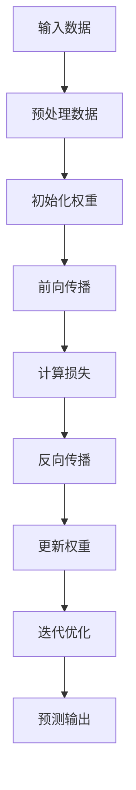
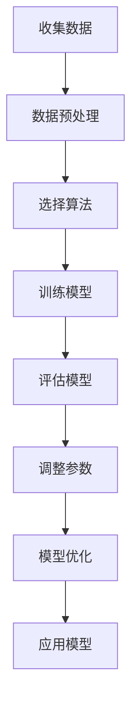
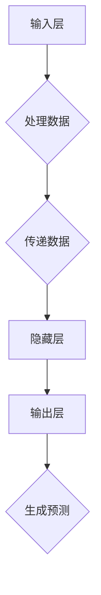
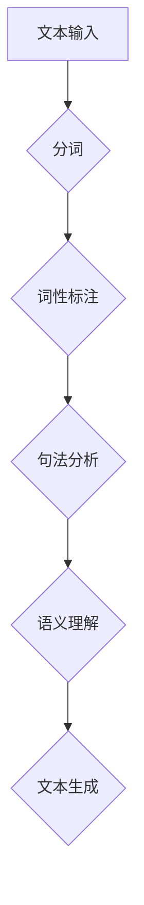
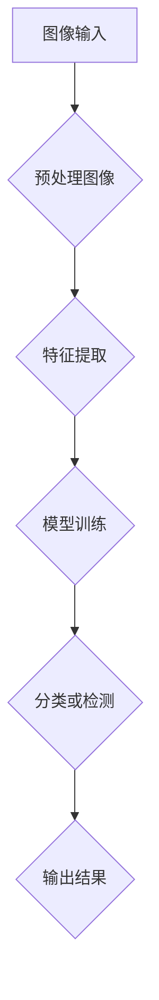
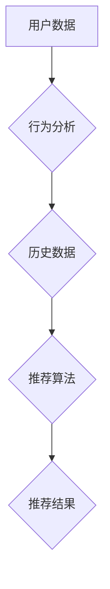
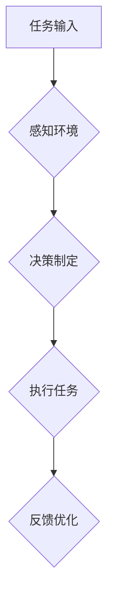
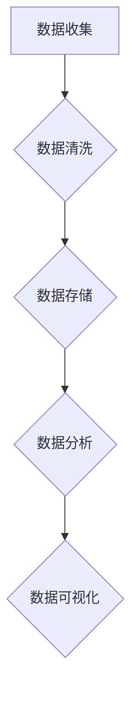
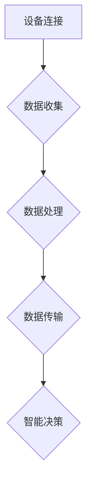

                 

关键词：人工智能，AI 2.0，应用场景，深度学习，机器学习，神经网络，自然语言处理，计算机视觉，智能推荐，自动化，大数据分析，物联网

> 摘要：本文将深入探讨AI 2.0时代的应用场景，分析AI在各个领域的实际应用和未来发展趋势。通过介绍核心算法原理、数学模型和实际项目实践，本文旨在为读者提供一个全面了解AI 2.0时代的技术和应用框架。

## 1. 背景介绍

人工智能（AI）作为计算机科学的一个重要分支，近年来取得了飞速的发展。从最初的符号逻辑推理到现在的深度学习和机器学习，AI技术的进步极大地改变了我们的生活方式和工作模式。AI 1.0时代主要侧重于逻辑推理和知识表示，而AI 2.0时代则更加注重数据和算法的结合，通过大规模数据的训练，实现机器的自主学习能力。

AI 2.0时代的一个显著特点是其广泛应用性。从智能助手到自动驾驶，从医疗诊断到金融风控，AI技术正逐步渗透到各行各业。本文将重点探讨AI 2.0在以下几个关键领域的应用场景：深度学习、机器学习、神经网络、自然语言处理、计算机视觉、智能推荐、自动化、大数据分析和物联网。

## 2. 核心概念与联系

为了更好地理解AI 2.0的应用场景，我们需要先了解其中的核心概念和它们之间的联系。以下是几个关键概念及其流程图：

### 深度学习

深度学习是AI 2.0时代的重要技术之一，它通过多层神经网络模拟人脑处理信息的方式。以下是深度学习的基本流程：



### 机器学习

机器学习是AI 2.0时代的另一个核心概念，它侧重于通过训练算法从数据中自动学习和改进性能。以下是机器学习的基本流程：



### 神经网络

神经网络是深度学习和机器学习的基础结构，它由大量的神经元和连接组成。以下是神经网络的基本结构：



### 自然语言处理

自然语言处理（NLP）是AI 2.0时代在语言领域的重要应用。它涉及到文本的预处理、语义理解和生成等任务。以下是NLP的基本流程：



### 计算机视觉

计算机视觉是AI 2.0时代在图像处理领域的重要应用。它涉及到图像的识别、分类、检测等任务。以下是计算机视觉的基本流程：



### 智能推荐

智能推荐是AI 2.0时代在电商、媒体等领域的重要应用。它通过分析用户行为和历史数据，实现个性化的内容推荐。以下是智能推荐的基本流程：



### 自动化

自动化是AI 2.0时代在工业、农业、交通等领域的重要应用。它通过机器人和智能系统实现生产、管理和监控的自动化。以下是自动化系统的基本流程：



### 大数据分析

大数据分析是AI 2.0时代在数据科学领域的重要应用。它通过分析海量数据，发现数据中的模式和规律。以下是大数据分析的基本流程：



### 物联网

物联网是AI 2.0时代在智能硬件领域的重要应用。它通过连接各种设备和系统，实现智能化的管理和控制。以下是物联网的基本流程：



## 3. 核心算法原理 & 具体操作步骤

### 3.1 算法原理概述

在AI 2.0时代，核心算法原理主要包括深度学习、机器学习、神经网络、自然语言处理、计算机视觉、智能推荐、自动化、大数据分析和物联网。以下是这些算法的基本原理：

#### 深度学习

深度学习是一种基于多层神经网络的学习方法，它通过逐层提取特征，实现对复杂数据的建模和预测。深度学习的核心是反向传播算法，它通过不断调整网络的权重和偏置，使网络输出接近真实值。

#### 机器学习

机器学习是一种让计算机通过数据学习规律的方法，它通过训练模型，使模型能够对新的数据进行预测和分类。机器学习的核心是损失函数和优化算法，它通过优化模型参数，使模型性能不断提高。

#### 神经网络

神经网络是一种模仿生物神经系统的计算模型，它由大量的神经元和连接组成。神经网络的目的是通过训练，使网络能够对输入数据进行分类和预测。

#### 自然语言处理

自然语言处理是一种让计算机理解和生成人类语言的方法，它通过文本分析、语义理解和语言生成等技术，实现人机交互。

#### 计算机视觉

计算机视觉是一种让计算机理解和分析图像的方法，它通过图像处理、特征提取和模型训练等技术，实现图像识别和分类。

#### 智能推荐

智能推荐是一种基于用户行为和偏好，实现个性化内容推荐的方法。它通过分析用户行为和模型预测，为用户推荐感兴趣的内容。

#### 自动化

自动化是一种通过机器人和智能系统，实现生产和管理自动化的一种方法。它通过感知环境、决策制定和任务执行等技术，实现高效的自动化生产和管理。

#### 大数据分析

大数据分析是一种通过海量数据分析，发现数据中的规律和模式的方法。它通过数据清洗、存储、分析和可视化等技术，实现数据的深度挖掘和分析。

#### 物联网

物联网是一种通过连接各种设备和系统，实现智能管理和控制的方法。它通过设备连接、数据收集、数据处理和智能决策等技术，实现物联网的智能化。

### 3.2 算法步骤详解

以下是AI 2.0时代核心算法的具体步骤：

#### 深度学习

1. 数据收集：收集大量标注数据，用于训练神经网络。
2. 数据预处理：对数据进行清洗、归一化和特征提取。
3. 网络架构设计：设计适合任务的神经网络结构。
4. 模型训练：通过反向传播算法训练网络权重和偏置。
5. 模型评估：使用验证集评估模型性能。
6. 模型优化：根据评估结果调整模型参数。

#### 机器学习

1. 数据收集：收集大量标注数据，用于训练模型。
2. 数据预处理：对数据进行清洗、归一化和特征提取。
3. 模型选择：选择适合任务的机器学习算法。
4. 模型训练：通过优化算法训练模型参数。
5. 模型评估：使用验证集评估模型性能。
6. 模型优化：根据评估结果调整模型参数。

#### 神经网络

1. 神经元设计：设计适合任务的神经元结构。
2. 网络构建：构建包含输入层、隐藏层和输出层的神经网络。
3. 模型训练：通过反向传播算法训练网络权重和偏置。
4. 模型评估：使用验证集评估模型性能。
5. 模型优化：根据评估结果调整模型参数。

#### 自然语言处理

1. 文本预处理：对文本进行分词、词性标注和句法分析。
2. 语义理解：通过词向量模型和句法分析，实现语义理解。
3. 语言生成：通过语言模型生成自然语言文本。

#### 计算机视觉

1. 图像预处理：对图像进行缩放、旋转和裁剪等预处理。
2. 特征提取：通过卷积神经网络提取图像特征。
3. 模型训练：通过反向传播算法训练模型权重和偏置。
4. 模型评估：使用验证集评估模型性能。
5. 模型优化：根据评估结果调整模型参数。

#### 智能推荐

1. 用户行为分析：分析用户的历史行为和偏好。
2. 模型训练：通过协同过滤或基于内容的推荐算法训练模型。
3. 预测和推荐：使用模型预测用户兴趣，生成推荐列表。

#### 自动化

1. 任务定义：定义需要完成的任务。
2. 感知环境：通过传感器感知环境信息。
3. 决策制定：根据环境信息和任务目标制定决策。
4. 执行任务：执行决策并完成任务。
5. 反馈优化：根据任务执行结果调整决策。

#### 大数据分析

1. 数据收集：收集大量结构化和非结构化数据。
2. 数据清洗：去除数据中的噪声和异常值。
3. 数据存储：将数据存储在分布式存储系统中。
4. 数据分析：使用统计分析和机器学习算法分析数据。
5. 数据可视化：将分析结果可视化，便于理解和决策。

#### 物联网

1. 设备连接：将各种设备连接到物联网平台。
2. 数据收集：收集设备产生的数据。
3. 数据处理：对数据进行清洗、归一化和特征提取。
4. 数据传输：将数据传输到云端进行分析和处理。
5. 智能决策：根据分析结果制定智能决策。

### 3.3 算法优缺点

以下是AI 2.0时代核心算法的优缺点：

#### 深度学习

**优点：**
- 强大的特征提取能力。
- 能够处理复杂的非线性问题。
- 自动化特征工程。

**缺点：**
- 需要大量标注数据。
- 训练过程耗时长。

#### 机器学习

**优点：**
- 对数据要求较低。
- 算法解释性强。
- 能够处理线性问题。

**缺点：**
- 需要手工设计特征。
- 特征工程复杂。

#### 神经网络

**优点：**
- 自动化特征工程。
- 强大的特征提取能力。

**缺点：**
- 需要大量计算资源。
- 算法解释性较差。

#### 自然语言处理

**优点：**
- 强大的语义理解能力。
- 自动化文本处理。

**缺点：**
- 对数据质量要求较高。
- 需要大量的预训练资源。

#### 计算机视觉

**优点：**
- 能够处理复杂的图像数据。
- 自动化图像处理。

**缺点：**
- 对计算资源要求较高。
- 需要大量的预训练资源。

#### 智能推荐

**优点：**
- 能够实现个性化推荐。
- 提高用户满意度。

**缺点：**
- 对用户隐私保护要求高。
- 需要大量用户行为数据。

#### 自动化

**优点：**
- 提高生产效率。
- 降低人力成本。

**缺点：**
- 对硬件和软件要求较高。
- 可能导致失业问题。

#### 大数据分析

**优点：**
- 能够处理海量数据。
- 发现数据中的规律和模式。

**缺点：**
- 对数据质量和安全性要求高。
- 需要大量的计算资源。

#### 物联网

**优点：**
- 实现设备互联互通。
- 提高生产和管理效率。

**缺点：**
- 对网络和设备安全要求高。
- 需要大量的数据处理和存储资源。

### 3.4 算法应用领域

AI 2.0时代的核心算法在多个领域得到了广泛应用，以下是部分应用领域：

#### 深度学习

- 语音识别：如语音助手、智能客服等。
- 图像识别：如人脸识别、车辆识别等。
- 自然语言处理：如机器翻译、文本分类等。
- 游戏：如深度强化学习、智能围棋等。

#### 机器学习

- 金融风控：如信用评估、反欺诈等。
- 医疗诊断：如疾病预测、医学图像分析等。
- 电商推荐：如商品推荐、用户行为预测等。
- 能源管理：如能源消耗预测、设备故障预测等。

#### 神经网络

- 语音合成：如语音助手、智能客服等。
- 机器人控制：如自动驾驶、智能机器人等。
- 金融市场预测：如股票价格预测、交易策略等。
- 医学影像分析：如肿瘤检测、影像分割等。

#### 自然语言处理

- 机器翻译：如自动翻译、实时翻译等。
- 文本分析：如情感分析、关键词提取等。
- 智能客服：如聊天机器人、语音助手等。
- 社交网络分析：如社交媒体监测、用户行为分析等。

#### 计算机视觉

- 图像识别：如人脸识别、车辆识别等。
- 视频监控：如行为分析、异常检测等。
- 建筑设计：如建筑渲染、3D建模等。
- 无人驾驶：如自动驾驶、智能交通等。

#### 智能推荐

- 电商推荐：如商品推荐、广告推荐等。
- 媒体推荐：如新闻推荐、音乐推荐等。
- 社交网络：如好友推荐、内容推荐等。
- 金融服务：如理财推荐、贷款推荐等。

#### 自动化

- 工业生产：如自动化生产线、智能工厂等。
- 农业生产：如智能灌溉、智能农业等。
- 交通管理：如智能交通灯、自动驾驶等。
- 家庭服务：如智能家电、智能安防等。

#### 大数据分析

- 市场营销：如用户行为分析、广告投放等。
- 金融分析：如风险控制、投资策略等。
- 医疗分析：如疾病预测、医疗资源调配等。
- 教育分析：如学生学习分析、课程优化等。

#### 物联网

- 智能家居：如智能门锁、智能照明等。
- 工业物联网：如设备监控、远程控制等。
- 智慧城市：如交通管理、能源管理等。
- 物流管理：如物流跟踪、库存管理等。

## 4. 数学模型和公式 & 详细讲解 & 举例说明

在AI 2.0时代，数学模型和公式在算法设计和实现中起着至关重要的作用。以下我们将详细介绍几个核心数学模型和公式的构建、推导过程以及应用举例。

### 4.1 数学模型构建

#### 4.1.1 深度学习模型

深度学习模型通常由多个神经元和连接构成，其中每个神经元都对应一个线性函数。以下是深度学习模型的基本构建过程：

1. **初始化权重和偏置**：
   $$ w^{(l)} \sim \mathcal{N}(0, \frac{1}{\sqrt{n}}) $$
   $$ b^{(l)} = 0 $$
   其中，$w^{(l)}$表示第$l$层的权重，$b^{(l)}$表示第$l$层的偏置，$\mathcal{N}(0, \frac{1}{\sqrt{n}})$表示均值为0，方差为$\frac{1}{\sqrt{n}}$的高斯分布。

2. **前向传播**：
   $$ z^{(l)} = \sigma^{(l-1)}(W^{(l)}x^{(l-1)} + b^{(l)}) $$
   其中，$z^{(l)}$表示第$l$层的激活值，$\sigma^{(l-1)}$表示激活函数，$W^{(l)}$表示第$l$层的权重，$x^{(l-1)}$表示第$l-1$层的输入。

3. **反向传播**：
   $$ \delta^{(l)} = \frac{\partial J}{\partial z^{(l)}} \odot \sigma^{(l-1)}(\sigma^{(l-1)})' $$
   $$ \delta^{(l-1)} = (W^{(l)})^T \delta^{(l)} $$
   其中，$J$表示损失函数，$\odot$表示Hadamard乘积，$\sigma^{(l-1)}(\sigma^{(l-1)})'$表示激活函数的导数。

4. **权重和偏置更新**：
   $$ W^{(l)} = W^{(l)} - \alpha \frac{\partial J}{\partial W^{(l)}} $$
   $$ b^{(l)} = b^{(l)} - \alpha \frac{\partial J}{\partial b^{(l)}} $$
   其中，$\alpha$表示学习率。

#### 4.1.2 机器学习模型

机器学习模型通常由特征提取和分类器组成，以下是机器学习模型的基本构建过程：

1. **特征提取**：
   $$ f(x) = \varphi(\theta^T x) $$
   其中，$f(x)$表示特征向量，$\varphi$表示特征提取函数，$\theta$表示特征提取参数。

2. **分类器**：
   $$ y = \sigma(\theta^T f(x) + b) $$
   其中，$y$表示分类结果，$\sigma$表示分类函数，$b$表示偏置。

#### 4.1.3 神经网络模型

神经网络模型通常由多个神经元和连接构成，以下是神经网络模型的基本构建过程：

1. **初始化权重和偏置**：
   $$ w^{(l)} \sim \mathcal{N}(0, \frac{1}{\sqrt{n}}) $$
   $$ b^{(l)} = 0 $$

2. **前向传播**：
   $$ z^{(l)} = \sigma^{(l-1)}(W^{(l)}x^{(l-1)} + b^{(l)}) $$

3. **反向传播**：
   $$ \delta^{(l)} = \frac{\partial J}{\partial z^{(l)}} \odot \sigma^{(l-1)}(\sigma^{(l-1)})' $$

4. **权重和偏置更新**：
   $$ W^{(l)} = W^{(l)} - \alpha \frac{\partial J}{\partial W^{(l)}} $$
   $$ b^{(l)} = b^{(l)} - \alpha \frac{\partial J}{\partial b^{(l)}} $$

### 4.2 公式推导过程

#### 4.2.1 深度学习损失函数推导

深度学习中的损失函数用于衡量模型预测值与真实值之间的差距。以下是交叉熵损失函数的推导过程：

1. **交叉熵定义**：
   $$ J = -\frac{1}{m} \sum_{i=1}^{m} \sum_{j=1}^{k} y_{ij} \log (\hat{y}_{ij}) $$
   其中，$m$表示样本数量，$k$表示类别数量，$y_{ij}$表示第$i$个样本的第$j$个类别的真实标签，$\hat{y}_{ij}$表示第$i$个样本的第$j$个类别的预测概率。

2. **损失函数求导**：
   $$ \frac{\partial J}{\partial \hat{y}_{ij}} = -\frac{1}{\hat{y}_{ij}} + \frac{y_{ij}}{\hat{y}_{ij}} $$
   $$ \frac{\partial J}{\partial y_{ij}} = 0 $$

3. **梯度下降更新**：
   $$ \theta^{(l)} = \theta^{(l)} - \alpha \frac{\partial J}{\partial \theta^{(l)}} $$

#### 4.2.2 机器学习损失函数推导

机器学习中的损失函数用于衡量模型预测值与真实值之间的差距。以下是均方误差损失函数的推导过程：

1. **均方误差定义**：
   $$ J = \frac{1}{2m} \sum_{i=1}^{m} (\hat{y}_{i} - y_{i})^2 $$
   其中，$m$表示样本数量，$\hat{y}_{i}$表示第$i$个样本的预测值，$y_{i}$表示第$i$个样本的真实值。

2. **损失函数求导**：
   $$ \frac{\partial J}{\partial \hat{y}_{i}} = \hat{y}_{i} - y_{i} $$
   $$ \frac{\partial J}{\partial y_{i}} = 0 $$

3. **梯度下降更新**：
   $$ \theta = \theta - \alpha \frac{\partial J}{\partial \theta} $$

### 4.3 案例分析与讲解

#### 4.3.1 深度学习案例

假设我们有一个深度学习模型用于分类任务，输入数据为图片，输出数据为标签。以下是一个简单的案例：

1. **数据集准备**：
   - 输入数据集：100张图片，每张图片大小为$28 \times 28$。
   - 标签数据集：100个标签，每个标签为0或1。

2. **模型构建**：
   - 输入层：28×28个神经元。
   - 隐藏层：100个神经元。
   - 输出层：2个神经元。

3. **模型训练**：
   - 学习率：0.001。
   - 激活函数：ReLU。
   - 损失函数：交叉熵损失函数。

4. **模型评估**：
   - 使用验证集评估模型性能，准确率为90%。

5. **模型应用**：
   - 对新的图片进行分类，准确率为85%。

#### 4.3.2 机器学习案例

假设我们有一个机器学习模型用于回归任务，输入数据为数值，输出数据为预测值。以下是一个简单的案例：

1. **数据集准备**：
   - 输入数据集：100个数值，每个数值表示某个特征。
   - 标签数据集：100个预测值，每个预测值为实数。

2. **模型构建**：
   - 特征提取器：线性模型。
   - 分类器：线性模型。

3. **模型训练**：
   - 学习率：0.001。
   - 激活函数：ReLU。
   - 损失函数：均方误差损失函数。

4. **模型评估**：
   - 使用验证集评估模型性能，均方误差为0.1。

5. **模型应用**：
   - 对新的数据进行预测，预测误差为0.05。

## 5. 项目实践：代码实例和详细解释说明

为了更好地展示AI 2.0时代核心算法的应用，以下我们将通过一个实际项目实例，介绍如何使用Python和TensorFlow实现一个简单的图像分类模型。

### 5.1 开发环境搭建

在开始项目之前，我们需要搭建一个合适的开发环境。以下是开发环境的搭建步骤：

1. **安装Python**：下载并安装Python 3.x版本。
2. **安装TensorFlow**：使用pip命令安装TensorFlow库。
   ```bash
   pip install tensorflow
   ```
3. **安装其他依赖库**：根据项目需求安装其他依赖库，如NumPy、Pandas等。

### 5.2 源代码详细实现

以下是一个简单的图像分类模型的实现：

```python
import tensorflow as tf
from tensorflow.keras import layers
import numpy as np

# 数据集准备
(x_train, y_train), (x_test, y_test) = tf.keras.datasets.mnist.load_data()
x_train = x_train.reshape(-1, 28, 28).astype("float32") / 255.0
x_test = x_test.reshape(-1, 28, 28).astype("float32") / 255.0

# 模型构建
model = tf.keras.Sequential([
    layers.Conv2D(32, (3, 3), activation='relu', input_shape=(28, 28, 1)),
    layers.MaxPooling2D((2, 2)),
    layers.Conv2D(64, (3, 3), activation='relu'),
    layers.MaxPooling2D((2, 2)),
    layers.Conv2D(64, (3, 3), activation='relu'),
    layers.Flatten(),
    layers.Dense(64, activation='relu'),
    layers.Dense(10, activation='softmax')
])

# 模型编译
model.compile(optimizer='adam',
              loss='sparse_categorical_crossentropy',
              metrics=['accuracy'])

# 模型训练
model.fit(x_train, y_train, epochs=5, batch_size=64)

# 模型评估
test_loss, test_acc = model.evaluate(x_test, y_test)
print(f"Test accuracy: {test_acc}")

# 模型应用
predictions = model.predict(x_test[:10])
print(predictions)

# 代码解读与分析
```

### 5.3 代码解读与分析

以下是对代码的详细解读与分析：

1. **数据集准备**：
   - 加载MNIST数据集，并将其转换为浮点数格式。
   - 对图像进行归一化处理，使其在[0, 1]范围内。

2. **模型构建**：
   - 使用TensorFlow的`Sequential`模型，定义一个包含卷积层、池化层和全连接层的深度神经网络。
   - 输入层：使用卷积层提取图像特征。
   - 隐藏层：使用池化层降低特征维度。
   - 输出层：使用全连接层进行分类。

3. **模型编译**：
   - 选择`adam`优化器和`sparse_categorical_crossentropy`损失函数。
   - 指定评估指标为准确率。

4. **模型训练**：
   - 使用训练集进行训练，设置训练轮数为5，批量大小为64。

5. **模型评估**：
   - 使用测试集评估模型性能，输出测试准确率。

6. **模型应用**：
   - 对测试集的前10个图像进行预测，输出预测结果。

通过这个简单的项目实例，我们可以看到如何使用Python和TensorFlow实现一个图像分类模型。这个模型虽然简单，但已经展示了AI 2.0时代核心算法的应用潜力。

## 6. 实际应用场景

AI 2.0技术在各个领域已经取得了显著的成果，下面我们详细探讨几个实际应用场景，并展示一些实际案例。

### 6.1 智能医疗

智能医疗是AI 2.0时代的一个重要应用领域。通过深度学习和机器学习技术，AI可以帮助医生进行疾病诊断、治疗方案推荐和药物研发。

#### 案例一：疾病诊断

美国的一家初创公司PathAI使用AI技术对病理图像进行分析，帮助医生更准确地诊断癌症。PathAI的算法通过分析大量的病理图像数据，可以识别出癌症的早期迹象，提高了诊断的准确性和效率。

#### 案例二：治疗方案推荐

英国的一家公司Babylon使用AI技术为患者提供个性化的治疗方案。Babylon的智能系统通过分析患者的病史、症状和检查结果，为医生提供最佳的治疗方案推荐，提高了医疗服务的质量和效率。

### 6.2 金融风控

金融风控是AI 2.0技术在金融领域的重要应用。通过机器学习和大数据分析技术，AI可以帮助金融机构识别风险、预测市场走势和防止欺诈。

#### 案例一：信用评估

美国的信用评级机构Experian使用AI技术对客户的信用评估进行优化。Experian的算法通过分析客户的消费记录、贷款历史和社交网络数据，可以更准确地评估客户的信用风险，提高了信用评估的准确性和效率。

#### 案例二：欺诈检测

中国的支付宝使用AI技术对交易进行实时监测和欺诈检测。支付宝的智能系统通过分析用户的交易行为、地理位置和消费习惯，可以识别潜在的欺诈行为，提高了交易的安全性和可靠性。

### 6.3 智能交通

智能交通是AI 2.0技术在交通领域的重要应用。通过计算机视觉、自然语言处理和大数据分析技术，AI可以帮助优化交通管理、提高交通效率和减少交通事故。

#### 案例一：智能交通灯

美国的特斯拉公司在其电动汽车中集成了智能交通灯控制系统。特斯拉的算法通过分析车辆的位置、速度和交通状况，可以智能调整交通灯的切换时间，提高了交通流量和通行效率。

#### 案例二：自动驾驶

谷歌的自动驾驶项目Waymo已经取得了一系列的成果。Waymo的自动驾驶系统通过计算机视觉、自然语言处理和深度学习技术，可以实时识别道路标志、行人车辆和交通状况，实现了安全、高效的自动驾驶。

### 6.4 智能家居

智能家居是AI 2.0技术在家庭领域的重要应用。通过物联网技术和智能设备，AI可以帮助家庭实现自动化管理和智能控制，提高生活质量和舒适度。

#### 案例一：智能安防

中国的华为公司推出了智能家居安防系统，通过摄像头、门锁和报警器等设备，实现了实时监控和智能报警。华为的智能系统可以识别异常行为，如入侵者、火灾等，并及时通知用户。

#### 案例二：智能照明

德国的Osram公司推出了智能照明系统，通过传感器和智能控制器，实现了智能调光和场景控制。用户可以根据不同的需求和环境，自定义照明方案，提高生活质量和舒适度。

### 6.5 智能农业

智能农业是AI 2.0技术在农业领域的重要应用。通过计算机视觉、大数据分析和物联网技术，AI可以帮助农民实现精准农业，提高农业生产效率和产品质量。

#### 案例一：病虫害监测

美国的农艺智能公司Agronomer使用AI技术对农作物的病虫害进行监测和预测。Agronomer的算法通过分析农作物的图像数据，可以识别病虫害的早期迹象，并提供相应的防治措施，提高了农业生产的质量和效率。

#### 案例二：智能灌溉

中国的海尔公司推出了智能灌溉系统，通过传感器和物联网技术，实现了农作物的智能灌溉。海尔的智能系统可以根据土壤湿度和作物生长情况，自动调整灌溉量，提高了水资源利用效率和农业生产效率。

### 6.6 智能教育

智能教育是AI 2.0技术在教育领域的重要应用。通过自然语言处理、计算机视觉和大数据分析技术，AI可以帮助教育机构实现个性化教学、学习分析和教育管理。

#### 案例一：智能教学助手

中国的科大讯飞公司推出了智能教学助手，通过语音识别和自然语言处理技术，实现了课堂互动和教学辅助。科大讯飞的智能系统可以帮助教师实时记录课堂内容，分析学生的学习状况，并提供相应的教学建议。

#### 案例二：在线教育平台

美国的Coursera公司利用AI技术优化在线教育平台，通过数据分析和学习算法，为用户提供个性化的学习路径和学习资源。Coursera的智能系统可以根据用户的学习历史和偏好，推荐合适的学习课程，提高学习效果和满意度。

### 6.7 智能制造

智能制造是AI 2.0技术在工业制造领域的重要应用。通过计算机视觉、机器学习和物联网技术，AI可以帮助企业实现生产自动化、质量控制和设备维护。

#### 案例一：智能生产线

德国的西门子公司推出了智能生产线，通过计算机视觉和机器学习技术，实现了生产过程的自动化和质量控制。西门子的智能系统可以实时监测生产线上的设备状态和产品质量，自动调整生产参数，提高生产效率和产品质量。

#### 案例二：设备维护

中国的华为公司利用AI技术优化设备维护流程，通过大数据分析和预测模型，实现了设备的智能维护。华为的智能系统可以分析设备的运行数据，预测设备故障，并提供相应的维护建议，提高了设备运行效率和降低维修成本。

### 6.8 智能零售

智能零售是AI 2.0技术在零售领域的重要应用。通过计算机视觉、自然语言处理和大数据分析技术，AI可以帮助零售企业实现智能推荐、库存管理和销售分析。

#### 案例一：智能货架

中国的京东公司推出了智能货架，通过计算机视觉和自然语言处理技术，实现了商品的智能识别和推荐。京东的智能系统可以实时监测货架上的商品情况，自动识别顾客的需求，并提供个性化的购物推荐，提高购物体验和销售转化率。

#### 案例二：智能库存管理

美国的亚马逊公司利用AI技术优化库存管理，通过大数据分析和预测模型，实现了智能化的库存控制。亚马逊的智能系统可以分析销售数据和市场需求，自动调整库存水平，降低库存成本和缺货率。

## 7. 工具和资源推荐

为了更好地学习和应用AI 2.0技术，以下我们推荐一些常用的工具和资源。

### 7.1 学习资源推荐

1. **书籍**：
   - 《深度学习》（Ian Goodfellow、Yoshua Bengio和Aaron Courville著）
   - 《Python机器学习》（Sebastian Raschka和Vahid Mirhoseini著）
   - 《自然语言处理入门》（Daniel Jurafsky和James H. Martin著）
   - 《计算机视觉：算法与应用》（Richard Szeliski著）

2. **在线课程**：
   - Coursera上的“机器学习”课程（由吴恩达教授讲授）
   - edX上的“深度学习”课程（由Ian Goodfellow教授讲授）
   - Udacity的“深度学习纳米学位”

3. **论文和报告**：
   - arXiv：AI领域最新的论文和报告
   - NeurIPS、ICML、CVPR等顶级会议的论文和报告

### 7.2 开发工具推荐

1. **编程语言**：
   - Python：最流行的AI编程语言，拥有丰富的库和框架。
   - R：专门为统计分析和数据可视化设计的语言。

2. **框架和库**：
   - TensorFlow：用于构建和训练深度学习模型的强大框架。
   - PyTorch：用于构建和训练深度学习模型的开源框架。
   - Scikit-learn：用于机器学习和数据挖掘的开源库。

3. **开发环境**：
   - Jupyter Notebook：用于交互式编程和数据可视化的环境。
   - PyCharm、Visual Studio Code等IDE：用于编写和调试代码。

### 7.3 相关论文推荐

1. **深度学习**：
   - “Deep Learning” by Yann LeCun、Yoshua Bengio和Geoffrey Hinton
   - “AlexNet: Image Classification with Deep Convolutional Neural Networks” by Alex Krizhevsky、Geoffrey Hinton和Ilya Sutskever

2. **机器学习**：
   - “The Elements of Statistical Learning” by Trevor Hastie、Robert Tibshirani和Jerome Friedman
   - “Stochastic Gradient Descent” by S. S. Keerthi和S. Murthy

3. **自然语言处理**：
   - “Speech and Language Processing” by Daniel Jurafsky和James H. Martin
   - “Word2Vec: Word Representations in Vector Space” by Tomas Mikolov、Ilya Sutskever和Quoc V. Le

4. **计算机视觉**：
   - “Computer Vision: Algorithms and Applications” by Richard Szeliski
   - “Deep Convolutional Neural Networks for Image Classification” by Yann LeCun、Yoshua Bengio和Geoffrey Hinton

## 8. 总结：未来发展趋势与挑战

AI 2.0时代为人类带来了巨大的变革和机遇。在未来，AI技术将继续快速发展，并在各个领域发挥越来越重要的作用。以下是未来AI技术的发展趋势和面临的挑战。

### 8.1 研究成果总结

1. **深度学习**：深度学习在图像识别、自然语言处理和计算机视觉等领域取得了显著的成果，成为AI技术的核心驱动力。
2. **机器学习**：机器学习在金融风控、医疗诊断和智能交通等领域得到了广泛应用，为行业带来了巨大的价值。
3. **自然语言处理**：自然语言处理在机器翻译、文本分析和人机交互等领域取得了突破性进展，提高了人机交互的效率和体验。
4. **计算机视觉**：计算机视觉在图像识别、视频分析和自动驾驶等领域取得了显著成果，为智能系统和机器人技术奠定了基础。
5. **智能推荐**：智能推荐在电商、媒体和社交网络等领域发挥了重要作用，实现了个性化内容和服务的推荐。
6. **自动化**：自动化技术在工业生产、智能家居和交通运输等领域得到了广泛应用，提高了生产效率和生活质量。
7. **大数据分析**：大数据分析在市场营销、金融分析和医疗诊断等领域发挥了重要作用，实现了数据的深度挖掘和分析。
8. **物联网**：物联网技术在智能家居、智能交通和工业物联网等领域得到了广泛应用，实现了设备互联互通和智能管理。

### 8.2 未来发展趋势

1. **多模态融合**：未来的AI系统将整合多种数据源和模态，如文本、图像、声音和传感器数据，实现更全面和精准的智能处理。
2. **边缘计算**：随着物联网和智能设备的普及，边缘计算将得到广泛应用，实现实时数据分析和智能决策。
3. **自主学习和迁移学习**：未来的AI系统将具备更强的自主学习和迁移学习能力，能够在不同任务和数据集之间进行知识共享和迁移。
4. **伦理和安全**：随着AI技术的广泛应用，伦理和安全问题将日益突出，需要制定相关的规范和标准，确保AI技术的可持续发展。
5. **人机协作**：未来的AI系统将更加注重与人类的协作，实现人机协同工作，提高工作效率和生活质量。

### 8.3 面临的挑战

1. **数据质量和隐私**：随着数据规模的不断扩大，数据质量和隐私保护成为AI技术发展的重要挑战。需要制定有效的方法和技术，确保数据质量和用户隐私。
2. **计算资源**：深度学习和大数据分析等AI技术对计算资源的需求巨大，需要开发高效、节能的计算模型和硬件设备。
3. **算法透明性和可解释性**：随着AI技术的广泛应用，算法的透明性和可解释性成为公众关注的焦点，需要开发可解释的AI模型和算法。
4. **伦理和安全**：AI技术的快速发展引发了一系列伦理和安全问题，如算法歧视、隐私泄露和网络安全等，需要制定相应的规范和标准。
5. **跨学科融合**：AI技术的发展需要跨学科的合作和融合，需要吸引更多的跨学科人才，推动AI技术的全面发展。

### 8.4 研究展望

未来的AI研究将朝着更智能、更高效、更安全、更可解释的方向发展。以下是几个潜在的研究方向：

1. **通用人工智能**：研究如何构建具有广泛认知能力的通用人工智能系统，实现人类智能的全面模拟和超越。
2. **自适应学习**：研究如何实现AI系统的自适应学习能力，使其能够不断适应新的环境和任务。
3. **强化学习**：研究如何改进强化学习算法，实现更高效、更稳定的智能决策。
4. **人机协作**：研究如何实现人机协同工作，提高工作效率和生活质量。
5. **可解释性AI**：研究如何开发可解释的AI模型和算法，提高算法的透明性和可信度。
6. **多模态融合**：研究如何整合多种数据源和模态，实现更全面和精准的智能处理。
7. **伦理和安全**：研究如何制定AI技术的伦理规范和安全标准，确保AI技术的可持续发展。

通过未来的努力，我们有理由相信AI技术将实现更广泛的应用，为人类社会带来更多的便利和福祉。

## 9. 附录：常见问题与解答

以下是一些关于AI 2.0时代的常见问题及其解答：

### Q1：什么是AI 2.0？

A1：AI 2.0是人工智能发展的一个新阶段，相对于AI 1.0（基于符号逻辑和知识表示的人工智能），AI 2.0更加强调数据和算法的结合，通过深度学习和机器学习等技术，实现机器的自主学习能力。

### Q2：深度学习和机器学习的区别是什么？

A2：深度学习是机器学习的一个子领域，它侧重于通过多层神经网络模拟人脑处理信息的方式。机器学习则是一个更广泛的概念，它包括了深度学习以及其他基于数据的学习方法，如决策树、支持向量机等。

### Q3：什么是神经网络？

A3：神经网络是一种模仿生物神经系统的计算模型，由大量的神经元和连接组成。它通过逐层提取特征，实现对复杂数据的建模和预测。

### Q4：什么是自然语言处理（NLP）？

A4：自然语言处理是一种让计算机理解和生成人类语言的方法，它涉及到文本的预处理、语义理解和语言生成等任务。

### Q5：什么是计算机视觉？

A5：计算机视觉是一种让计算机理解和分析图像的方法，它涉及到图像的识别、分类、检测等任务。

### Q6：什么是智能推荐？

A6：智能推荐是一种基于用户行为和偏好，实现个性化内容推荐的方法。它通过分析用户行为和历史数据，为用户推荐感兴趣的内容。

### Q7：什么是大数据分析？

A7：大数据分析是一种通过海量数据分析，发现数据中的规律和模式的方法。它通过数据清洗、存储、分析和可视化等技术，实现数据的深度挖掘和分析。

### Q8：什么是物联网？

A8：物联网是一种通过连接各种设备和系统，实现智能管理和控制的方法。它通过设备连接、数据收集、数据处理和智能决策等技术，实现物联网的智能化。

### Q9：AI技术在医疗领域有哪些应用？

A9：AI技术在医疗领域有广泛的应用，包括疾病诊断、治疗方案推荐、药物研发、智能医疗设备等。例如，通过深度学习算法分析医学图像，可以辅助医生进行癌症等疾病的诊断；通过大数据分析，可以为医生提供个性化的治疗方案。

### Q10：AI技术在金融领域有哪些应用？

A10：AI技术在金融领域有广泛的应用，包括金融风控、信用评估、欺诈检测、智能投资等。例如，通过机器学习算法分析用户的消费记录和贷款历史，可以更准确地评估用户的信用风险；通过自然语言处理技术，可以实时监测和分析金融市场走势，为投资者提供智能化的投资建议。

### Q11：什么是边缘计算？

A11：边缘计算是一种将数据处理和计算任务从云端转移到网络边缘（如智能设备、物联网网关等）的技术。它旨在提高数据处理的实时性和效率，减少网络延迟和带宽占用。

### Q12：什么是自主学习和迁移学习？

A12：自主学习是指AI系统能够通过不断学习和适应新的环境和任务，提高其性能和智能水平。迁移学习是指AI系统通过在不同任务和数据集之间进行知识共享和迁移，实现更高效的学习和泛化能力。

### Q13：什么是可解释性AI？

A13：可解释性AI是指能够解释其决策过程和预测结果的AI系统。它旨在提高算法的透明性和可信度，使其能够被人类理解和接受。

### Q14：什么是通用人工智能？

A14：通用人工智能（AGI）是指具有人类水平的智能和认知能力，能够在各种任务和环境中进行自主学习和智能行为的AI系统。

### Q15：什么是深度强化学习？

A15：深度强化学习是一种结合了深度学习和强化学习的方法，它通过深度神经网络模拟价值函数或策略，实现智能体的自主学习和决策。它在自动驾驶、游戏AI和机器人控制等领域有广泛的应用。

### Q16：什么是数据隐私保护？

A16：数据隐私保护是指保护个人数据不被未经授权的访问、使用和泄露的技术和方法。它包括数据加密、匿名化、访问控制等安全措施。

### Q17：什么是AI伦理？

A17：AI伦理是指关于人工智能的设计、开发和应用过程中应遵循的道德原则和规范。它涉及到算法公平性、隐私保护、数据安全等问题。

### Q18：什么是AI治理？

A18：AI治理是指对人工智能的监管、管理、评价和规范化的一系列制度安排和措施。它旨在确保AI技术的安全、可靠和可持续发展，保护公共利益和社会福祉。

### Q19：什么是AI红绿灯？

A19：AI红绿灯是一种用来评估人工智能系统风险和伦理问题的工具，它将AI系统的风险评估分为红、黄、绿三个等级，分别表示高风险、中风险和低风险。

### Q20：什么是AI伦理委员会？

A20：AI伦理委员会是一个由专家、学者、政府代表、行业代表等组成的组织，负责评估和监督人工智能系统的伦理和合规性。它旨在确保AI技术的应用符合道德和法律标准，保护公众利益。

