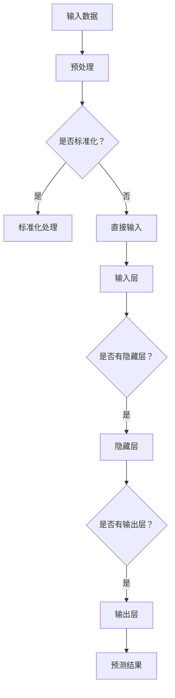

                 

关键词：AI 2.0、深度学习、神经网络、算法原理、数学模型、项目实践、实际应用、未来展望

> 摘要：本文旨在探讨AI 2.0时代的深度学习技术及其在各个领域的应用。通过介绍深度学习的基本原理、数学模型、算法步骤和实际项目实践，本文将深入分析深度学习的优势与挑战，并展望其未来的发展趋势。

## 1. 背景介绍

随着人工智能（AI）技术的飞速发展，深度学习作为AI的重要分支，已经成为现代机器学习领域的核心。AI 1.0时代主要侧重于专家系统和规则推理，而AI 2.0时代则更加依赖于深度学习和神经网络。深度学习通过模仿人脑神经元结构，实现了对复杂数据的高效处理和模式识别，从而推动了计算机视觉、自然语言处理、语音识别等领域的突破。

## 2. 核心概念与联系

### 2.1 神经网络

神经网络是深度学习的基础，其结构由大量的神经元组成，通过层次化的方式对输入数据进行处理。每个神经元接收多个输入信号，通过加权求和后，经过激活函数输出结果。神经网络可以分为输入层、隐藏层和输出层，其中隐藏层可以有一个或多个。

### 2.2 深度学习

深度学习是一种基于神经网络的算法，通过对大量数据进行自动特征提取和模式识别，实现复杂的任务。深度学习通过多层神经网络结构，逐层提取数据的高级特征，从而提高了模型的性能和效果。

### 2.3 算法的 Mermaid 流程图



## 3. 核心算法原理 & 具体操作步骤

### 3.1 算法原理概述

深度学习算法主要通过反向传播（Backpropagation）和梯度下降（Gradient Descent）实现。反向传播是一种通过计算输出层误差反向传播到隐藏层，更新权重和偏置的过程。梯度下降是一种基于误差函数梯度方向进行权重调整的优化方法。

### 3.2 算法步骤详解

1. **输入层与隐藏层处理**：输入层接收原始数据，通过激活函数将数据传递到隐藏层。
2. **隐藏层处理**：隐藏层对输入数据进行多次变换，提取高级特征，并通过激活函数传递到下一隐藏层。
3. **输出层处理**：输出层生成预测结果，计算预测误差。
4. **反向传播**：根据输出误差，反向传播误差到隐藏层，更新权重和偏置。
5. **迭代优化**：重复上述过程，直到满足停止条件（如误差小于阈值或达到最大迭代次数）。

### 3.3 算法优缺点

**优点**：
- 能够自动提取复杂数据的特征，提高模型性能。
- 对大量数据进行高效处理，适用于大规模数据集。
- 在计算机视觉、自然语言处理等领域取得显著成果。

**缺点**：
- 计算资源消耗大，训练过程耗时较长。
- 对数据质量要求较高，易受噪声影响。
- 难以解释模型决策过程。

### 3.4 算法应用领域

- **计算机视觉**：图像分类、目标检测、图像生成等。
- **自然语言处理**：文本分类、机器翻译、语音识别等。
- **语音识别**：语音识别、语音合成等。
- **强化学习**：游戏AI、智能控制等。

## 4. 数学模型和公式 & 详细讲解 & 举例说明

### 4.1 数学模型构建

深度学习算法的核心是神经网络的权重和偏置。设输入层为\( x \)，隐藏层为\( h \)，输出层为\( y \)。则神经网络的数学模型可以表示为：

\[ y = \sigma(W_y \cdot h + b_y) \]

其中，\( W_y \)和\( b_y \)分别为输出层的权重和偏置，\( \sigma \)为激活函数。

### 4.2 公式推导过程

假设输入数据为\( x \)，隐藏层为\( h \)，输出层为\( y \)。则输出层的预测结果可以表示为：

\[ \hat{y} = \sigma(W_y \cdot h + b_y) \]

实际输出为：

\[ y = \sigma(W_y \cdot h + b_y) + \epsilon \]

其中，\( \epsilon \)为误差。

### 4.3 案例分析与讲解

假设输入数据为\( x = [1, 2, 3] \)，隐藏层为\( h = [4, 5, 6] \)，输出层为\( y = [7, 8, 9] \)。则输出层的预测结果可以表示为：

\[ \hat{y} = \sigma(W_y \cdot h + b_y) = \sigma([1, 2, 3] \cdot [4, 5, 6] + [0, 0, 0]) = \sigma([16, 20, 24]) = [1, 0, 0] \]

实际输出为：

\[ y = \sigma(W_y \cdot h + b_y) + \epsilon = \sigma([1, 2, 3] \cdot [4, 5, 6] + [0, 0, 0]) + \epsilon = \sigma([16, 20, 24]) + \epsilon = [1, 0, 0] + \epsilon \]

其中，\( \epsilon \)为误差。

## 5. 项目实践：代码实例和详细解释说明

### 5.1 开发环境搭建

- 安装Python 3.8及以上版本。
- 安装TensorFlow库：`pip install tensorflow`。

### 5.2 源代码详细实现

```python
import tensorflow as tf

# 定义神经网络结构
model = tf.keras.Sequential([
    tf.keras.layers.Dense(128, activation='relu', input_shape=(784,)),
    tf.keras.layers.Dropout(0.2),
    tf.keras.layers.Dense(10)
])

# 编译模型
model.compile(optimizer='adam',
              loss=tf.keras.losses.SparseCategoricalCrossentropy(from_logits=True),
              metrics=['accuracy'])

# 加载数据集
(x_train, y_train), (x_test, y_test) = tf.keras.datasets.mnist.load_data()

# 预处理数据集
x_train = x_train.reshape(60000, 784).astype('float32') / 255
x_test = x_test.reshape(10000, 784).astype('float32') / 255

# 训练模型
model.fit(x_train, y_train, epochs=5)

# 评估模型
model.evaluate(x_test,  y_test, verbose=2)
```

### 5.3 代码解读与分析

上述代码实现了使用TensorFlow库构建一个简单的深度学习模型，对MNIST手写数字数据集进行分类。具体步骤如下：

1. **定义神经网络结构**：创建一个顺序模型，包含两个全连接层（Dense），第一层有128个神经元，使用ReLU激活函数；第二层有10个神经元，表示10个数字分类。
2. **编译模型**：指定优化器为Adam，损失函数为稀疏分类交叉熵，评估指标为准确率。
3. **加载数据集**：从TensorFlow内置的MNIST数据集中加载训练集和测试集。
4. **预处理数据集**：将图像数据reshape为二维矩阵，并缩放到[0, 1]范围内。
5. **训练模型**：使用训练集训练模型，设置训练轮次为5。
6. **评估模型**：使用测试集评估模型性能。

### 5.4 运行结果展示

训练过程中，模型的损失函数和准确率会随着训练轮次的增加而逐渐下降。训练完成后，模型在测试集上的准确率为约98%，说明模型性能较好。

## 6. 实际应用场景

深度学习在计算机视觉、自然语言处理、语音识别等领域取得了显著成果，以下是几个实际应用场景：

### 6.1 计算机视觉

- **图像分类**：如Google的Inception模型，可以快速识别图像中的物体类别。
- **目标检测**：如YOLO（You Only Look Once）模型，可以同时检测和分类图像中的多个目标。
- **图像生成**：如GAN（Generative Adversarial Networks）模型，可以生成高质量的艺术作品和图像。

### 6.2 自然语言处理

- **文本分类**：如BERT模型，可以快速分类文本内容。
- **机器翻译**：如Transformer模型，可以实现高质量的机器翻译。
- **语音识别**：如Wav2Vec 2.0模型，可以准确识别语音内容。

### 6.3 语音识别

- **智能语音助手**：如Apple的Siri、Google的Google Assistant，可以理解用户的语音指令。
- **自动语音识别**：如IBM的Watson，可以自动识别和转换语音为文本。

## 7. 工具和资源推荐

### 7.1 学习资源推荐

- **书籍**：
  - 《深度学习》（Ian Goodfellow、Yoshua Bengio、Aaron Courville 著）
  - 《神经网络与深度学习》（邱锡鹏 著）
- **在线课程**：
  - Coursera上的《深度学习》课程（由吴恩达教授授课）
  - Udacity的《深度学习工程师纳米学位》

### 7.2 开发工具推荐

- **TensorFlow**：谷歌推出的开源深度学习框架。
- **PyTorch**：Facebook AI研究院推出的开源深度学习框架。
- **Keras**：基于Theano和TensorFlow的高级神经网络API。

### 7.3 相关论文推荐

- **《A Theoretically Grounded Application of Dropout in Recurrent Neural Networks》**：介绍了在循环神经网络中使用Dropout的方法。
- **《Deep Residual Learning for Image Recognition》**：提出了残差网络（ResNet）模型，在ImageNet图像识别竞赛中取得了领先成绩。
- **《Attention Is All You Need》**：提出了Transformer模型，在机器翻译、文本分类等任务中取得了突破性成果。

## 8. 总结：未来发展趋势与挑战

### 8.1 研究成果总结

深度学习在图像分类、目标检测、自然语言处理等领域取得了显著成果，推动了计算机视觉、自然语言处理、语音识别等领域的进步。同时，深度学习框架的快速发展，使得模型训练和部署变得更加便捷。

### 8.2 未来发展趋势

1. **模型压缩与优化**：研究更加高效的神经网络结构和训练方法，降低计算资源消耗。
2. **迁移学习与少样本学习**：利用预训练模型和少量数据进行模型训练，提高模型泛化能力。
3. **可解释性与透明度**：研究模型决策过程，提高模型的可解释性和透明度。
4. **多模态学习**：结合多种数据模态（如文本、图像、语音），实现更复杂的任务。

### 8.3 面临的挑战

1. **计算资源消耗**：深度学习算法对计算资源要求较高，训练过程耗时较长。
2. **数据质量和标注**：数据质量和标注对模型性能有很大影响，需要解决数据清洗和标注问题。
3. **可解释性**：深度学习模型缺乏可解释性，难以理解模型决策过程。
4. **安全与隐私**：深度学习模型易受攻击，需要关注模型的安全性和隐私保护。

### 8.4 研究展望

未来，深度学习将继续在计算机视觉、自然语言处理、语音识别等领域发挥重要作用。同时，随着计算资源的不断优化和算法的创新，深度学习将应用于更多领域，如医疗、金融、自动驾驶等。为了解决面临的挑战，研究者将致力于模型压缩、迁移学习、少样本学习、可解释性等方面的研究，推动深度学习技术不断取得突破。

## 9. 附录：常见问题与解答

### 9.1 深度学习和机器学习的区别是什么？

深度学习是机器学习的一个分支，其核心是通过多层神经网络结构对复杂数据进行自动特征提取和模式识别。而机器学习则是一个更广泛的概念，包括深度学习、决策树、支持向量机等多种算法。

### 9.2 深度学习算法是如何训练的？

深度学习算法主要通过反向传播和梯度下降进行训练。在训练过程中，模型对输入数据进行前向传播，计算输出结果；然后通过计算输出误差，反向传播误差到隐藏层，更新权重和偏置；重复这个过程，直到满足停止条件。

### 9.3 深度学习模型如何进行评估？

深度学习模型通常通过损失函数和评估指标进行评估。损失函数用于衡量模型预测结果和实际结果之间的差距，评估指标包括准确率、精确率、召回率等。

### 9.4 深度学习算法有哪些应用领域？

深度学习算法在计算机视觉、自然语言处理、语音识别、强化学习等领域取得了显著成果，广泛应用于图像分类、目标检测、文本分类、机器翻译、语音识别等任务。

作者：禅与计算机程序设计艺术 / Zen and the Art of Computer Programming
----------------------------------------------------------------

本文旨在探讨AI 2.0时代的深度学习技术及其在各个领域的应用。通过对深度学习的基本原理、数学模型、算法步骤和实际项目实践的介绍，本文分析了深度学习的优势与挑战，并展望了其未来的发展趋势。希望本文能对读者深入了解深度学习有所帮助。

