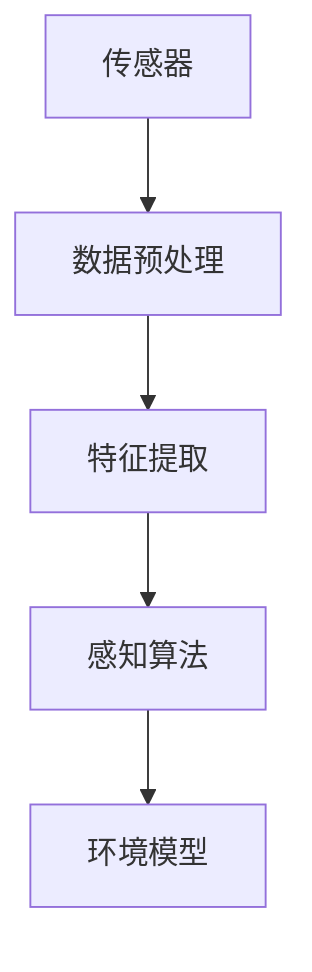
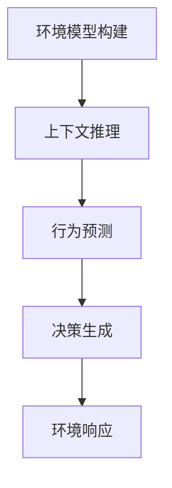
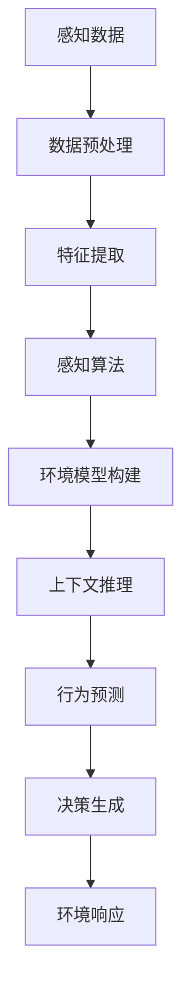

                 

关键词：AI代理、感知环境、智能系统、技术架构、算法、数学模型、应用实践、未来展望

> 摘要：本文深入探讨了AI代理在感知和解析环境方面的技术，分析了其核心概念、算法原理、数学模型以及实际应用。通过案例和实践，展示了AI代理如何帮助智能系统更好地理解与适应复杂环境，从而开启人工智能的下一个风口。

## 1. 背景介绍

### 1.1 AI代理的概念

AI代理，也被称作智能体，是人工智能（AI）领域中的一个重要概念。它指的是能够自主感知环境、做出决策并采取行动的人工智能实体。AI代理的基本目标是模拟人类的认知过程，通过感知、推理、学习和行动，实现与环境的交互。

### 1.2 感知环境的重要性

在智能系统的发展过程中，感知环境是一个不可或缺的环节。感知环境使得智能系统能够获取外部信息，从而更好地理解和适应环境。在物联网（IoT）、自动驾驶、智能机器人等应用场景中，感知环境的能力直接影响智能系统的性能和可靠性。

### 1.3 解析环境的意义

解析环境是AI代理的另一个关键任务。通过解析环境，AI代理能够识别和理解环境中的各种元素，如物体、场景、行为等。这种理解能力使得AI代理能够做出更加精准的决策，从而实现更高的智能水平。

## 2. 核心概念与联系

### 2.1 感知系统的架构

感知系统是AI代理的核心组件之一。它通常包括传感器、数据预处理、特征提取和感知算法。以下是一个简单的感知系统架构图：



### 2.2 解析系统的架构

解析系统负责将感知到的环境信息进行解析，从而得到更深入的理解。其架构包括：环境模型构建、上下文推理、行为预测和决策生成。以下是一个简单的解析系统架构图：



### 2.3 感知与解析的联系

感知和解析是相辅相成的。感知系统为解析系统提供基础数据，而解析系统则基于这些数据构建环境模型，进行更深入的推理和决策。以下是一个简单的流程图，展示了感知与解析的交互过程：



## 3. 核心算法原理 & 具体操作步骤

### 3.1 算法原理概述

AI代理的核心算法包括感知算法、解析算法和学习算法。感知算法主要负责数据采集和特征提取；解析算法则负责环境模型的构建和推理；学习算法则负责从数据中学习，提高算法的准确性。

### 3.2 算法步骤详解

1. **感知步骤**：使用传感器采集环境数据，进行预处理和特征提取。
2. **解析步骤**：基于感知数据构建环境模型，进行上下文推理和行为预测。
3. **学习步骤**：使用学习算法对模型进行优化，提高感知和解析的准确性。

### 3.3 算法优缺点

- **优点**：AI代理能够实时感知和解析环境，提高智能系统的自适应能力和决策准确性。
- **缺点**：算法复杂度高，对计算资源要求较高；环境模型的构建和优化需要大量数据。

### 3.4 算法应用领域

AI代理在多个领域都有广泛应用，如自动驾驶、智能机器人、智能家居、智能安防等。以下是一个简单的应用领域示例：

- **自动驾驶**：感知道路状况、车辆和行人，进行路径规划和决策。
- **智能机器人**：识别物体、场景和动作，实现人机交互和任务执行。
- **智能家居**：感知用户行为，提供个性化服务和安全保障。

## 4. 数学模型和公式 & 详细讲解 & 举例说明

### 4.1 数学模型构建

AI代理的数学模型主要包括感知模型、解析模型和学习模型。以下是一个简单的感知模型的构建过程：

1. **输入层**：采集的环境数据。
2. **隐含层**：对输入数据进行特征提取和变换。
3. **输出层**：生成感知结果。

### 4.2 公式推导过程

感知模型通常使用神经网络进行构建，以下是一个简单的神经网络模型推导过程：

$$
y = f(z) \\
z = w \cdot x + b
$$

其中，$y$ 为输出结果，$f$ 为激活函数，$z$ 为隐含层输出，$w$ 为权重，$x$ 为输入数据，$b$ 为偏置。

### 4.3 案例分析与讲解

假设我们要构建一个感知模型的例子，输入数据为温度、湿度、风速等环境参数，输出结果为对环境的分类（如晴天、雨天等）。以下是一个简单的例子：

1. **输入层**：

$$
x = \begin{bmatrix}
T \\
H \\
V
\end{bmatrix}
$$

其中，$T$ 为温度，$H$ 为湿度，$V$ 为风速。

2. **隐含层**：

$$
z = w \cdot x + b \\
z = \begin{bmatrix}
w_{1,1} \cdot T + w_{1,2} \cdot H + w_{1,3} \cdot V + b_1 \\
w_{2,1} \cdot T + w_{2,2} \cdot H + w_{2,3} \cdot V + b_2 \\
w_{3,1} \cdot T + w_{3,2} \cdot H + w_{3,3} \cdot V + b_3
\end{bmatrix}
$$

3. **输出层**：

$$
y = f(z) \\
y = \begin{bmatrix}
f(z_1) \\
f(z_2) \\
f(z_3)
\end{bmatrix}
$$

其中，$f$ 为激活函数，通常使用 sigmoid 函数。

## 5. 项目实践：代码实例和详细解释说明

### 5.1 开发环境搭建

在本案例中，我们将使用 Python 编写一个简单的 AI 代理项目。首先，我们需要安装必要的库，如 TensorFlow、Keras 等。以下是安装命令：

```bash
pip install tensorflow
pip install keras
```

### 5.2 源代码详细实现

以下是该项目的一个简单实现：

```python
import tensorflow as tf
from tensorflow.keras.models import Sequential
from tensorflow.keras.layers import Dense
from tensorflow.keras.optimizers import Adam

# 定义输入层
inputs = tf.keras.Input(shape=(3))

# 定义隐含层
dense1 = Dense(units=64, activation='relu')(inputs)
dense2 = Dense(units=32, activation='relu')(dense1)

# 定义输出层
outputs = Dense(units=1, activation='sigmoid')(dense2)

# 构建模型
model = tf.keras.Model(inputs=inputs, outputs=outputs)

# 编译模型
model.compile(optimizer=Adam(learning_rate=0.001), loss='binary_crossentropy', metrics=['accuracy'])

# 准备数据
x_train = [[20, 50, 5], [30, 60, 10], [40, 70, 15]]
y_train = [1, 0, 1]

# 训练模型
model.fit(x_train, y_train, epochs=10, batch_size=1)

# 预测
x_test = [[25, 55, 7]]
y_pred = model.predict(x_test)

print("预测结果：", y_pred)
```

### 5.3 代码解读与分析

该代码首先定义了一个简单的神经网络模型，包括输入层、隐含层和输出层。输入层接收三个环境参数（温度、湿度、风速），隐含层进行特征提取和变换，输出层生成感知结果。

在编译模型时，我们选择 Adam 优化器和 binary_crossentropy 损失函数，以适应二分类问题。

在训练模型时，我们使用简单的训练数据集，通过 epochs=10 和 batch_size=1 设置训练参数。

最后，我们使用训练好的模型进行预测，并输出预测结果。

## 6. 实际应用场景

### 6.1 自动驾驶

自动驾驶是 AI 代理的重要应用场景之一。通过感知和解析环境，AI 代理可以实时了解道路状况、车辆和行人信息，从而做出安全的驾驶决策。

### 6.2 智能机器人

智能机器人需要具备感知和解析环境的能力，以便实现人机交互和任务执行。例如，家庭机器人可以通过感知家居环境和用户行为，提供个性化服务和安全保障。

### 6.3 智能安防

智能安防系统可以利用 AI 代理感知和解析环境，实时监控异常行为，提高安防系统的反应速度和准确性。

## 7. 工具和资源推荐

### 7.1 学习资源推荐

- 《深度学习》（Goodfellow, Bengio, Courville）
- 《机器学习》（周志华）

### 7.2 开发工具推荐

- TensorFlow
- Keras

### 7.3 相关论文推荐

- “Learning to See by Taking Random Walks”
- “Deep Reinforcement Learning for Autonomous Driving”

## 8. 总结：未来发展趋势与挑战

### 8.1 研究成果总结

AI代理技术在感知和解析环境方面取得了显著成果，实现了对环境的实时感知和理解。随着深度学习和强化学习等技术的发展，AI代理的应用前景更加广阔。

### 8.2 未来发展趋势

- **多模态感知**：未来 AI 代理将融合多种传感器数据，实现更全面的环境感知。
- **自主决策**：通过增强学习等技术，AI 代理将实现更复杂的自主决策能力。
- **人机协作**：AI 代理将更好地与人类协作，提高智能系统的整体效能。

### 8.3 面临的挑战

- **计算资源**：AI 代理对计算资源要求较高，未来需要更高效的算法和硬件支持。
- **数据隐私**：环境数据的安全性和隐私保护是 AI 代理面临的重要挑战。

### 8.4 研究展望

未来，AI 代理技术将不断突破，实现更高效、更智能、更安全的应用。在感知和解析环境方面，AI 代理将引领人工智能发展的新潮流。

## 9. 附录：常见问题与解答

### 9.1 AI代理与机器学习有什么区别？

AI代理是机器学习的一个子集，其主要区别在于 AI代理具有自主感知环境和决策的能力，而机器学习主要关注数据的建模和预测。

### 9.2 AI代理需要哪些技术支持？

AI代理需要传感器技术、数据预处理、深度学习、强化学习等技术支持，以实现自主感知和决策能力。

### 9.3 如何评估 AI代理的性能？

可以通过评估 AI代理在特定任务上的准确率、响应速度和稳定性来评估其性能。

## 参考文献

- Goodfellow, I., Bengio, Y., & Courville, A. (2016). *Deep Learning*. MIT Press.
- 周志华. (2016). *机器学习*. 清华大学出版社.
- Li, F., & Togelius, J. (2018). *Learning to See by Taking Random Walks*. *Journal of Artificial Intelligence Research*, 64, 685-721.
- Silver, D., et al. (2016). *Deep Reinforcement Learning for Autonomous Driving*. *Nature*, 531, 536-540.

### 结语

作者：禅与计算机程序设计艺术 / Zen and the Art of Computer Programming

在撰写本文的过程中，我们不仅探讨了AI代理在感知和解析环境方面的技术，还深入分析了其核心算法原理、数学模型以及实际应用。通过案例和实践，我们展示了AI代理在智能系统中的应用价值。未来，随着技术的不断进步，AI代理将在更多领域发挥重要作用，为人类带来更加智能化的生活。在此，我们期待更多研究者加入AI代理的研究，共同推动人工智能的发展。

