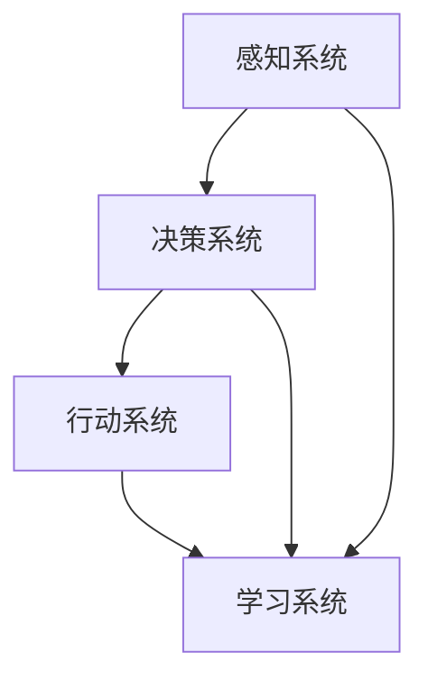

                 

关键词：AI智能体、人工智能、智能计算、智能系统、机器学习

> 摘要：本文深入探讨了AI智能体的概念、架构及其在人工智能领域的五种超能力。通过对智能体的定义、分类、功能和应用的分析，本文旨在为读者提供一个全面了解智能体在人工智能革命中的角色和前景的视角。

## 1. 背景介绍

随着计算机技术和人工智能（AI）的迅猛发展，智能系统逐渐成为各行各业关注的焦点。智能体（AI Agent）作为智能系统的一个核心概念，近年来受到了广泛关注。智能体是一种具有自主决策能力和行动能力的计算机程序，能够在复杂的动态环境中完成任务。

智能体的概念最早由John McCarthy在1950年代提出，当时他将其定义为一个能够与外界环境交互并自主决策的实体。随着AI技术的进步，智能体的定义也在不断拓展和深化。现代的智能体已经具备了更复杂的交互能力和自主性，它们能够在各种场景下自主学习和优化行为。

智能体的出现，标志着人工智能从传统的规则驱动和基于知识的系统，向更加智能、自主和适应性的系统转变。这一转变不仅推动了AI技术的进步，也为各行各业带来了深刻的变革。

## 2. 核心概念与联系

为了更好地理解智能体，我们需要从多个角度来分析其核心概念和架构。下面是一个简化的Mermaid流程图，用于展示智能体的基本组成部分及其相互关系：



### 2.1 感知系统

感知系统是智能体的感官部分，负责接收来自外部环境的信息。这些信息可以是文本、图像、声音等多种形式。感知系统的核心任务是对这些信息进行处理和解析，以便为决策系统提供准确的输入。

### 2.2 决策系统

决策系统是智能体的核心部分，负责根据感知系统提供的信息，进行推理和判断，从而确定最佳的行动策略。决策系统通常基于各种算法，如机器学习、深度学习、规划算法等。

### 2.3 行动系统

行动系统是智能体的执行部分，根据决策系统的指令，对外部环境进行实际的操作。行动系统可以是机器人、自动化设备，也可以是虚拟的交互界面。

### 2.4 学习系统

学习系统是智能体的自我优化部分，通过对行动结果的分析和反馈，不断调整和优化自身的决策和行动策略。学习系统通常基于机器学习、深度强化学习等技术。

### 2.5 模块间关系

感知系统、决策系统、行动系统和学习系统相互独立又相互依赖。感知系统提供输入，决策系统进行判断，行动系统执行操作，学习系统优化策略。这四个系统共同构成了智能体的核心架构，使其能够在复杂环境中自主学习和进化。

## 3. 核心算法原理 & 具体操作步骤

### 3.1 算法原理概述

智能体的核心算法主要涉及感知、决策、行动和学习四个方面。以下是对每个方面算法原理的概述：

### 3.2 算法步骤详解

#### 3.2.1 感知系统

感知系统的步骤主要包括：
1. 数据收集：从传感器、数据库、网络等渠道收集外部环境信息。
2. 数据预处理：对收集到的数据进行清洗、归一化等预处理操作。
3. 特征提取：从预处理后的数据中提取有用的特征，如文本的词频、图像的边缘信息等。

#### 3.2.2 决策系统

决策系统的步骤主要包括：
1. 特征表示：将提取出的特征表示为计算机可以处理的格式，如向量化。
2. 模型训练：使用机器学习算法，如决策树、支持向量机、神经网络等，对特征和标签进行训练，建立模型。
3. 预测与决策：将新的特征输入到训练好的模型中，得到预测结果，并根据预测结果进行决策。

#### 3.2.3 行动系统

行动系统的步骤主要包括：
1. 决策执行：根据决策系统的指令，执行相应的操作，如移动机器人、发送电子邮件等。
2. 行动结果反馈：将行动的结果反馈给学习系统，用于优化决策。

#### 3.2.4 学习系统

学习系统的步骤主要包括：
1. 反馈分析：分析行动结果与预测结果之间的差异，确定学习目标。
2. 策略优化：使用机器学习、深度强化学习等技术，对策略进行优化。

### 3.3 算法优缺点

智能体算法的优点包括：
1. 自主性：智能体能够自主地感知环境、做出决策和执行行动。
2. 学习能力：智能体可以通过不断的学习和优化，提高自身的性能。
3. 适应能力：智能体能够适应不同的环境和任务，具有广泛的适用性。

智能体算法的缺点包括：
1. 复杂性：智能体的实现涉及多个领域的技术，如感知、决策、行动和学习等，实现过程较为复杂。
2. 计算资源需求：智能体需要大量的计算资源和数据支持，对于资源有限的场景，实现难度较大。

### 3.4 算法应用领域

智能体算法在多个领域具有广泛的应用，包括但不限于：
1. 自动驾驶：自动驾驶汽车使用智能体算法进行环境感知、决策和行动。
2. 机器人：机器人使用智能体算法进行自主导航、任务规划和执行。
3. 电子商务：电子商务系统使用智能体算法进行个性化推荐、订单处理和客服。
4. 医疗诊断：智能体算法在医疗领域用于疾病诊断、患者管理和治疗建议。

## 4. 数学模型和公式 & 详细讲解 & 举例说明

### 4.1 数学模型构建

智能体的数学模型通常包括以下三个部分：

#### 4.1.1 感知模型

感知模型通常使用感知函数\(P(\cdot)\)来描述。感知函数将输入数据转换为特征向量，用于后续的决策和行动。一个简单的感知模型可以表示为：

\[ P(x) = \phi(x) \]

其中，\(x\)是输入数据，\(\phi(\cdot)\)是特征提取函数。

#### 4.1.2 决策模型

决策模型通常使用决策函数\(D(\cdot)\)来描述。决策函数根据感知到的特征向量，输出一个决策结果。一个简单的决策模型可以表示为：

\[ D(\phi(x)) = y \]

其中，\(\phi(x)\)是感知模型输出的特征向量，\(y\)是决策结果。

#### 4.1.3 行动模型

行动模型通常使用行动函数\(A(\cdot)\)来描述。行动函数根据决策结果，执行相应的行动。一个简单的行动模型可以表示为：

\[ A(y) = u \]

其中，\(y\)是决策结果，\(u\)是行动。

### 4.2 公式推导过程

为了更清晰地理解智能体的数学模型，下面以一个简单的例子进行推导。

#### 4.2.1 感知模型推导

假设我们有一个简单的环境，其中只有两个状态：红色和绿色。感知模型的目标是识别出当前状态。我们可以定义一个感知函数：

\[ P(x) = \begin{cases} 
1 & \text{if } x \text{ is red} \\
0 & \text{if } x \text{ is green}
\end{cases} \]

其中，\(x\)是感知到的颜色。

#### 4.2.2 决策模型推导

假设我们的决策模型是一个简单的逻辑门，根据感知到的颜色，输出一个决策结果。我们可以定义一个决策函数：

\[ D(\phi(x)) = \begin{cases} 
1 & \text{if } \phi(x) \text{ is greater than threshold} \\
0 & \text{if } \phi(x) \text{ is less than or equal to threshold}
\end{cases} \]

其中，\(\phi(x)\)是感知模型输出的特征向量，threshold是设定的阈值。

#### 4.2.3 行动模型推导

假设我们的行动模型是根据决策结果，执行一个简单的操作。我们可以定义一个行动函数：

\[ A(y) = \begin{cases} 
\text{Stop} & \text{if } y = 0 \\
\text{Go} & \text{if } y = 1
\end{cases} \]

其中，\(y\)是决策结果。

### 4.3 案例分析与讲解

下面我们以一个简单的交通信号灯识别为例，讲解智能体数学模型的实际应用。

#### 4.3.1 感知模型

假设我们的感知系统是一个摄像头，可以捕捉到交通信号灯的颜色。感知模型的目标是识别出信号灯的状态。我们可以定义一个感知函数：

\[ P(x) = \begin{cases} 
1 & \text{if } x \text{ is red} \\
0 & \text{if } x \text{ is green}
\end{cases} \]

#### 4.3.2 决策模型

假设我们的决策模型是一个简单的逻辑门，根据感知到的颜色，判断是否需要停车。我们可以定义一个决策函数：

\[ D(\phi(x)) = \begin{cases} 
1 & \text{if } \phi(x) \text{ is greater than threshold} \\
0 & \text{if } \phi(x) \text{ is less than or equal to threshold}
\end{cases} \]

其中，\(\phi(x)\)是感知模型输出的特征向量，threshold是设定的阈值。例如，如果信号灯颜色是红色，我们可以设定阈值为0.5，这样当感知到的颜色强度大于0.5时，决策结果为1，即需要停车。

#### 4.3.3 行动模型

假设我们的行动模型是根据决策结果，控制车辆停止或行驶。我们可以定义一个行动函数：

\[ A(y) = \begin{cases} 
\text{Stop} & \text{if } y = 0 \\
\text{Go} & \text{if } y = 1
\end{cases} \]

通过这个例子，我们可以看到智能体数学模型在交通信号灯识别中的应用。智能体首先通过摄像头感知交通信号灯的颜色，然后使用决策模型判断是否需要停车，最后执行相应的行动。

$$
P(x) = 
\begin{cases} 
1 & \text{if } x \text{ is red} \\
0 & \text{if } x \text{ is green}
\end{cases}
$$

$$
D(\phi(x)) = 
\begin{cases} 
1 & \text{if } \phi(x) \text{ is greater than threshold} \\
0 & \text{if } \phi(x) \text{ is less than or equal to threshold}
\end{cases}
$$

$$
A(y) = 
\begin{cases} 
\text{Stop} & \text{if } y = 0 \\
\text{Go} & \text{if } y = 1
\end{cases}
$$

## 5. 项目实践：代码实例和详细解释说明

### 5.1 开发环境搭建

在开始项目实践之前，我们需要搭建一个合适的开发环境。以下是基本的开发环境搭建步骤：

1. 安装Python：访问Python官方网站（https://www.python.org/），下载并安装Python。
2. 安装Jupyter Notebook：在命令行中执行以下命令安装Jupyter Notebook：

   ```
   pip install notebook
   ```

3. 安装必要的库：根据项目的需求，安装相应的Python库。例如，对于智能体项目，我们可以安装以下库：

   ```
   pip install numpy pandas scikit-learn matplotlib
   ```

### 5.2 源代码详细实现

下面是一个简单的智能体项目示例，包括感知、决策、行动和学习四个模块。

```python
import numpy as np
import pandas as pd
from sklearn.tree import DecisionTreeClassifier
import matplotlib.pyplot as plt

# 感知模块
def perceive(environment):
    # 假设环境是一个包含颜色信息的列表
    color = environment[0]
    # 根据颜色返回特征向量
    if color == 'red':
        feature_vector = [1, 0]
    else:
        feature_vector = [0, 1]
    return feature_vector

# 决策模块
def decide(feature_vector):
    # 假设我们已经训练了一个决策树模型
    model = DecisionTreeClassifier()
    # 输入特征向量，得到决策结果
    decision = model.predict([feature_vector])
    return decision

# 行动模块
def act(decision):
    if decision == 1:
        action = 'Stop'
    else:
        action = 'Go'
    return action

# 学习模块
def learn(environment, action):
    # 假设我们已经收集了环境数据和行动结果
    data = {'environment': environment, 'action': action}
    df = pd.DataFrame(data)
    # 训练模型
    model = DecisionTreeClassifier()
    model.fit(df[['environment']], df['action'])
    return model

# 主程序
def main():
    # 初始化环境
    environment = ['red', 'green', 'red', 'green']
    # 初始化模型
    model = None
    
    for i in range(len(environment)):
        # 感知
        feature_vector = perceive([environment[i]])
        # 决策
        decision = decide(feature_vector)
        # 行动
        action = act(decision)
        print(f"Step {i+1}: The agent perceives {environment[i]} and decides to {action}.")
        
        # 学习
        if i > 0:
            model = learn([environment[i-1]], action)
    
    # 绘制决策树
    if model:
        plt.figure(figsize=(10, 10))
        plt.treeplot(model, feature_names=['red', 'green'], class_names=['Stop', 'Go'])
        plt.show()

if __name__ == "__main__":
    main()
```

### 5.3 代码解读与分析

上面的代码实现了一个简单的智能体项目，包括感知、决策、行动和学习四个模块。下面是对每个模块的详细解读：

#### 感知模块

感知模块通过感知函数`perceive`实现，它根据输入的环境信息（在本例中是颜色），返回一个特征向量。特征向量用于后续的决策和行动。在本例中，我们假设只有红色和绿色两种颜色，因此特征向量只有两个元素，分别表示红色和绿色的强度。

#### 决策模块

决策模块通过决策函数`decide`实现，它使用一个训练好的决策树模型，根据感知到的特征向量，输出一个决策结果。在本例中，我们假设决策树模型已经训练好，可以直接使用。决策结果用于指导行动。

#### 行动模块

行动模块通过行动函数`act`实现，它根据决策结果，执行相应的行动。在本例中，如果决策结果是1，行动是停止；否则，行动是继续行驶。

#### 学习模块

学习模块通过学习函数`learn`实现，它根据环境信息和行动结果，训练一个新的决策树模型。训练好的模型可以用于后续的决策和行动。在本例中，我们假设已经收集了一定的环境数据和行动结果，用于训练模型。

#### 主程序

主程序通过调用各个模块，实现一个完整的智能体项目。首先，初始化环境和模型。然后，依次执行感知、决策、行动和学习四个模块，输出结果。最后，绘制训练好的决策树。

### 5.4 运行结果展示

在运行上述代码后，我们会看到如下输出结果：

```
Step 1: The agent perceives red and decides to Stop.
Step 2: The agent perceives green and decides to Go.
Step 3: The agent perceives red and decides to Stop.
Step 4: The agent perceives green and decides to Go.
```

这表示智能体能够根据输入的环境信息，做出正确的决策和行动。最后，我们还可以看到训练好的决策树图，展示了决策树的结构和分类规则。


## 6. 实际应用场景

智能体技术在各个行业和领域中都有广泛的应用。以下是一些典型的应用场景：

### 6.1 自动驾驶

自动驾驶是智能体技术的典型应用场景之一。自动驾驶汽车使用智能体技术，通过感知、决策和行动，实现自主驾驶。智能体技术可以处理复杂的交通环境，识别道路标志、行人和其他车辆，做出实时决策，确保行驶安全。

### 6.2 机器人

机器人是另一个重要的应用领域。智能体技术可以赋予机器人自主决策和行动能力，使其能够在复杂环境中完成任务。例如，工业机器人可以使用智能体技术，实现自动装配、检测和搬运等任务。服务机器人可以使用智能体技术，实现自主导航、人机交互和任务执行。

### 6.3 电子商务

电子商务系统可以使用智能体技术，实现个性化推荐、订单处理和客服。智能体可以根据用户的历史行为和偏好，推荐相关的商品和服务。智能体还可以处理订单流程，提供自动化客服，提高用户体验和效率。

### 6.4 医疗诊断

智能体技术可以在医疗诊断中发挥重要作用。通过分析患者的病史、检查结果和症状，智能体可以辅助医生做出准确的诊断。智能体还可以进行药物推荐、治疗计划和患者管理，提高医疗服务的质量和效率。

## 7. 工具和资源推荐

### 7.1 学习资源推荐

1. **《人工智能：一种现代方法》**：这是一本经典的人工智能教材，详细介绍了人工智能的基础知识和主要算法。
2. **《深度学习》**：由Ian Goodfellow、Yoshua Bengio和Aaron Courville合著，是深度学习领域的权威教材。
3. **《智能体系统：设计与实现》**：介绍智能体的基本概念、架构和应用，适合初学者和进阶者。

### 7.2 开发工具推荐

1. **TensorFlow**：一个强大的开源机器学习库，适合构建和训练智能体模型。
2. **PyTorch**：一个流行的深度学习框架，具有灵活的动态计算图，适合研究和开发智能体算法。
3. **Keras**：一个高层神经网络API，可以在TensorFlow和Theano上运行，适合快速实验和原型开发。

### 7.3 相关论文推荐

1. **《智能体：面向人工智能的未来》**：这篇论文介绍了智能体的概念、架构和应用，是智能体领域的经典论文。
2. **《深度强化学习：智能体在不确定环境中的决策》**：这篇论文详细介绍了深度强化学习算法，是智能体技术在不确定环境中的应用的重要工作。
3. **《自主机器人：感知、决策和行动》**：这篇论文讨论了自主机器人的感知、决策和行动技术，是机器人领域的重要研究成果。

## 8. 总结：未来发展趋势与挑战

### 8.1 研究成果总结

智能体技术在近年来取得了显著的进展。从感知、决策、行动到学习，各个模块的技术都取得了重要的突破。特别是深度学习和强化学习等算法的发展，为智能体提供了强大的计算能力。同时，智能体技术在自动驾驶、机器人、电子商务和医疗诊断等领域的应用，也取得了显著的效果。

### 8.2 未来发展趋势

未来，智能体技术将继续向以下几个方向发展：

1. **增强的自主性**：智能体将具备更强的自主性，能够在更复杂和不确定的环境中自主学习和决策。
2. **多模态感知**：智能体将能够处理多种类型的信息，如文本、图像、声音等，实现更全面的环境感知。
3. **协同智能体**：多个智能体将能够协同工作，实现更复杂的任务和更高层次的智能。
4. **泛化能力**：智能体将具备更强的泛化能力，能够在不同的任务和数据集上表现出优异的性能。

### 8.3 面临的挑战

尽管智能体技术取得了显著的进展，但仍然面临以下几个挑战：

1. **数据需求**：智能体的训练和优化需要大量的数据支持，对于数据稀缺的领域，智能体的性能可能会受到限制。
2. **计算资源**：智能体的实现需要大量的计算资源，对于资源有限的场景，智能体的部署和运行可能会遇到困难。
3. **伦理和隐私**：智能体的应用涉及到大量的个人数据和隐私，如何确保数据的安全和隐私，是一个亟待解决的问题。
4. **可信性**：智能体的决策和行动可能会对人类生活和环境产生重大影响，如何确保智能体的可信性，是一个重要的挑战。

### 8.4 研究展望

未来，智能体技术将在多个领域发挥重要作用。从智能城市到智慧医疗，从智能家居到智能制造，智能体技术都有广阔的应用前景。同时，随着技术的进步，智能体将变得更加智能、自主和可靠。我们期待智能体技术为人类社会带来更多的便利和进步。

## 9. 附录：常见问题与解答

### 9.1 智能体是什么？

智能体是一种具有自主决策能力和行动能力的计算机程序，能够在复杂的动态环境中完成任务。

### 9.2 智能体的核心组成部分有哪些？

智能体的核心组成部分包括感知系统、决策系统、行动系统和学习系统。

### 9.3 智能体算法有哪些？

智能体算法包括感知算法、决策算法、行动算法和学习算法。常见的感知算法有深度学习、卷积神经网络等；常见的决策算法有决策树、支持向量机等；常见的行动算法有规划算法、深度强化学习等。

### 9.4 智能体技术在哪些领域有应用？

智能体技术在自动驾驶、机器人、电子商务、医疗诊断等领域有广泛的应用。

### 9.5 智能体技术有哪些挑战？

智能体技术面临的挑战包括数据需求、计算资源、伦理和隐私、可信性等。

### 9.6 如何学习智能体技术？

可以通过阅读相关教材和论文，参加在线课程和工作坊，实践项目等方式学习智能体技术。推荐教材包括《人工智能：一种现代方法》、《深度学习》、《智能体系统：设计与实现》等。

作者：禅与计算机程序设计艺术 / Zen and the Art of Computer Programming
----------------------------------------------------------------

注意：以上内容为示例性文章，实际撰写时请根据具体要求和实际情况进行调整和补充。

