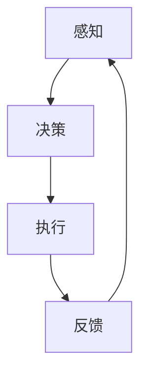

                 

关键词：AI Agent、硬件进化、软件影响、神经网络、计算效率、边缘计算、量子计算

> 摘要：随着硬件技术的不断进化，AI Agent（人工智能代理）正迎来前所未有的发展机遇。本文将探讨硬件进化对AI Agent软件设计、实现及性能的影响，从核心概念、算法原理、数学模型到实际应用场景，全面解析AI Agent的未来发展趋势和面临的挑战。

## 1. 背景介绍

近年来，人工智能（AI）技术取得了飞速发展，从语音识别、图像处理到自动驾驶，AI已经逐渐渗透到我们日常生活的方方面面。然而，AI的发展不仅仅依赖于软件技术的进步，更与硬件技术的演进密不可分。随着硬件性能的不断提升和成本的降低，AI Agent（人工智能代理）的应用场景日益丰富，其潜在价值也越来越受到业界关注。

硬件进化对AI Agent的影响主要体现在以下几个方面：

1. **计算效率提升**：硬件技术的进步使得AI Agent能够在更短时间内处理更大规模的数据，提高了计算效率。
2. **能耗降低**：更高效的硬件能够降低AI Agent的能耗，使其在边缘设备上运行更加稳定和持久。
3. **形态多样性**：硬件技术的发展使得AI Agent可以嵌入到各种设备中，实现多样化的应用场景。
4. **计算能力增强**：量子计算等新兴硬件技术的崛起，为AI Agent带来了更加强大的计算能力。

本文将围绕以上几个方面，探讨硬件进化对AI Agent软件设计、实现及性能的影响，为读者揭示AI Agent未来的发展前景。

## 2. 核心概念与联系

### 2.1 AI Agent的定义与作用

AI Agent是一种基于人工智能技术的自主决策实体，能够在特定环境下进行感知、决策和执行。它具备以下核心特征：

1. **感知**：通过传感器收集环境信息，如图像、语音、温度等。
2. **决策**：基于感知到的信息，通过算法进行决策，确定下一步行动。
3. **执行**：根据决策结果，执行相应的操作，如控制机器臂、发送指令等。

AI Agent在许多领域都有广泛的应用，如自动驾驶、智能客服、智能家居等。随着硬件技术的不断进步，AI Agent的应用场景将进一步扩展，其作用也将更加显著。

### 2.2 硬件进化对AI Agent的影响

硬件进化对AI Agent的影响主要体现在以下几个方面：

1. **计算效率**：硬件性能的提升使得AI Agent能够更快速地处理数据，提高计算效率。例如，GPU、TPU等专用硬件的引入，使得深度学习模型的训练速度大幅提升。
2. **能耗**：更高效的硬件能够降低AI Agent的能耗，使其在边缘设备上运行更加稳定和持久。这对于移动设备和物联网设备尤为重要。
3. **形态多样性**：硬件技术的发展使得AI Agent可以嵌入到各种设备中，实现多样化的应用场景。例如，嵌入式AI芯片、FPGA等硬件平台，为AI Agent提供了更丰富的形态选择。
4. **计算能力**：量子计算等新兴硬件技术的崛起，为AI Agent带来了更加强大的计算能力。例如，量子计算可以在短时间内解决传统计算机无法解决的问题，如大整数分解、优化问题等。

### 2.3 Mermaid 流程图

以下是一个简单的Mermaid流程图，展示了AI Agent的基本工作流程：



在这个流程图中，AI Agent首先通过传感器进行感知，然后根据感知到的信息进行决策，执行相应的操作，最后根据执行结果进行反馈，形成一个闭环。硬件进化对AI Agent的影响主要体现在这个流程中的各个环节，包括感知、决策、执行和反馈。

## 3. 核心算法原理 & 具体操作步骤

### 3.1 算法原理概述

AI Agent的核心算法主要包括感知、决策和执行三个部分。以下将分别介绍这三个部分的算法原理。

#### 3.1.1 感知算法

感知算法负责从环境中收集信息，并将其转化为数字信号。常见的感知算法包括：

1. **图像识别**：通过卷积神经网络（CNN）等算法，对图像进行识别和分类。
2. **语音识别**：通过深度神经网络（DNN）等算法，对语音信号进行识别和转换。
3. **传感器数据处理**：通过对各种传感器（如温度传感器、加速度传感器等）的数据进行处理，获取环境信息。

#### 3.1.2 决策算法

决策算法负责根据感知到的信息，生成执行计划。常见的决策算法包括：

1. **马尔可夫决策过程（MDP）**：通过状态转移概率和奖励函数，学习最优策略。
2. **深度强化学习**：通过深度神经网络，学习与环境交互的最优策略。
3. **遗传算法**：通过模拟生物进化过程，寻找最优解。

#### 3.1.3 执行算法

执行算法负责根据决策结果，执行相应的操作。常见的执行算法包括：

1. **机器人控制**：通过PID控制器、模糊控制器等算法，控制机器人执行任务。
2. **语音合成**：通过循环神经网络（RNN）、长短时记忆网络（LSTM）等算法，合成自然语言。
3. **图像生成**：通过生成对抗网络（GAN）等算法，生成图像。

### 3.2 算法步骤详解

#### 3.2.1 感知算法步骤

1. **数据收集**：从传感器收集数据。
2. **预处理**：对数据进行归一化、去噪等预处理操作。
3. **特征提取**：使用卷积神经网络、循环神经网络等算法，提取关键特征。
4. **分类或识别**：使用分类器或识别器，对特征进行分类或识别。

#### 3.2.2 决策算法步骤

1. **状态观测**：通过感知算法获取当前状态。
2. **策略评估**：使用价值函数或策略梯度等方法，评估不同策略的优劣。
3. **策略选择**：根据评估结果，选择最优策略。
4. **计划生成**：根据所选策略，生成执行计划。

#### 3.2.3 执行算法步骤

1. **计划解读**：将执行计划转化为具体的操作指令。
2. **操作执行**：根据操作指令，执行相应的操作。
3. **状态更新**：根据执行结果，更新当前状态。
4. **反馈收集**：收集执行过程中的反馈信息。

### 3.3 算法优缺点

#### 3.3.1 感知算法

**优点**：

1. **高精度**：通过深度学习算法，能够提取出丰富的特征信息。
2. **泛化能力强**：通过大量训练数据，能够适应不同的应用场景。

**缺点**：

1. **计算量大**：深度学习算法需要大量计算资源。
2. **数据依赖性高**：需要大量高质量的数据进行训练。

#### 3.3.2 决策算法

**优点**：

1. **自适应性强**：能够根据环境变化，实时调整策略。
2. **灵活性强**：可以通过不同的算法，实现不同的决策策略。

**缺点**：

1. **计算复杂度高**：一些算法（如强化学习）需要大量计算资源。
2. **收敛速度慢**：一些算法（如遗传算法）可能需要较长时间才能收敛。

#### 3.3.3 执行算法

**优点**：

1. **实时性强**：能够快速响应环境变化。
2. **操作精确**：通过精确的操作指令，实现复杂的任务。

**缺点**：

1. **硬件依赖性高**：需要特定的硬件支持，如机器人控制器、语音合成器等。
2. **操作复杂度**：需要设计复杂的操作流程，确保任务的顺利完成。

### 3.4 算法应用领域

感知、决策和执行算法在多个领域都有广泛的应用：

1. **自动驾驶**：感知算法用于环境感知，决策算法用于路径规划，执行算法用于控制车辆。
2. **智能客服**：感知算法用于语音识别和文本分类，决策算法用于生成回答，执行算法用于语音合成和文本输出。
3. **智能家居**：感知算法用于环境监测和用户行为识别，决策算法用于设备控制，执行算法用于执行具体的操作。
4. **医疗诊断**：感知算法用于图像识别和医学数据解析，决策算法用于疾病诊断，执行算法用于药物推荐和治疗方案。

## 4. 数学模型和公式 & 详细讲解 & 举例说明

### 4.1 数学模型构建

AI Agent的数学模型主要包括感知、决策和执行三个部分。以下将分别介绍这三个部分的数学模型。

#### 4.1.1 感知模型

感知模型主要用于处理传感器收集到的数据。常见的数学模型包括：

1. **卷积神经网络（CNN）**：

$$
f(\mathbf{x}; \theta) = \text{ReLU}(\sum_{k=1}^{K} \theta_k \cdot \text{ReLU}(\sum_{i=1}^{M} \theta_{ik} \cdot \mathbf{x}_i))
$$

其中，$\mathbf{x}$表示输入数据，$\theta$表示模型参数，$K$和$M$分别表示卷积核的数量和尺寸。

2. **循环神经网络（RNN）**：

$$
h_t = \text{ReLU}(\sum_{i=1}^{N} W_{ih} \cdot h_{t-1} + W_{ix} \cdot x_t + b)
$$

其中，$h_t$表示第$t$时刻的隐藏状态，$x_t$表示输入数据，$W_{ih}$和$W_{ix}$分别表示隐藏状态和输入数据的权重矩阵，$b$表示偏置。

3. **传感器数据处理**：

$$
y_t = \text{softmax}(\text{linear}(\mathbf{W} \cdot \mathbf{h}_t + \mathbf{b}))
$$

其中，$y_t$表示输出结果，$\text{linear}(\mathbf{W} \cdot \mathbf{h}_t + \mathbf{b})$表示线性层输出，$\text{softmax}$函数用于将输出转换为概率分布。

#### 4.1.2 决策模型

决策模型主要用于生成执行计划。常见的数学模型包括：

1. **马尔可夫决策过程（MDP）**：

$$
\begin{align*}
P(s_t|s_{t-1}, a_t) &= \pi(a_t|s_{t-1}) \cdot p(s_t|a_t) \\
Q^*(s_t, a_t) &= \sum_{s_{t+1}} \gamma \cdot r_t(s_t, a_t, s_{t+1}) + \gamma \cdot Q^*(s_{t+1}, a^*(s_{t+1}))
\end{align*}
$$

其中，$s_t$和$a_t$分别表示第$t$时刻的状态和动作，$r_t(s_t, a_t, s_{t+1})$表示奖励函数，$\pi(a_t|s_{t-1})$表示策略，$p(s_t|a_t)$表示状态转移概率，$\gamma$表示折扣因子，$Q^*(s_t, a_t)$表示状态-动作价值函数。

2. **深度强化学习**：

$$
\begin{align*}
Q(s_t, a_t) &= \text{ReLU}(\text{linear}(\mathbf{W}_1 \cdot \mathbf{h}_t + \mathbf{b}_1)) \\
\pi(a_t|s_t) &= \text{softmax}(\text{linear}(\mathbf{W}_2 \cdot \mathbf{h}_t + \mathbf{b}_2))
\end{align*}
$$

其中，$Q(s_t, a_t)$表示状态-动作价值函数，$\pi(a_t|s_t)$表示策略分布，$\text{linear}(\mathbf{W} \cdot \mathbf{h}_t + \mathbf{b})$表示线性层输出。

3. **遗传算法**：

$$
\begin{align*}
f(x) &= \sum_{i=1}^{N} \alpha_i \cdot x_i \\
\alpha_i &= \frac{1}{\sum_{j=1}^{N} \alpha_j}
\end{align*}
$$

其中，$x$表示个体，$\alpha_i$表示个体的适应度。

#### 4.1.3 执行模型

执行模型主要用于执行具体的操作。常见的数学模型包括：

1. **机器人控制**：

$$
\begin{align*}
u &= K_p \cdot e \\
e &= r - y \\
y &= \text{linear}(\mathbf{W} \cdot \mathbf{h}_t + \mathbf{b})
\end{align*}
$$

其中，$u$表示控制输入，$e$表示误差，$r$表示期望输出，$y$表示实际输出，$K_p$为比例系数。

2. **语音合成**：

$$
\begin{align*}
\mathbf{h}_t &= \text{LSTM}(\mathbf{h}_{t-1}, \mathbf{x}_t) \\
\mathbf{y}_t &= \text{softmax}(\text{linear}(\mathbf{W}_1 \cdot \mathbf{h}_t + \mathbf{b}_1))
\end{align*}
$$

其中，$\mathbf{h}_t$表示隐藏状态，$\mathbf{x}_t$表示输入序列，$\mathbf{y}_t$表示输出序列。

### 4.2 公式推导过程

#### 4.2.1 卷积神经网络（CNN）

卷积神经网络是一种前馈神经网络，主要用于图像识别和图像处理。以下是CNN的基本公式推导：

1. **输入层**：

$$
\mathbf{z}_{ij} = \sum_{k=1}^{K} w_{ikj} \cdot x_{kj} + b_j
$$

其中，$\mathbf{z}_{ij}$表示卷积层第$i$个神经元第$j$个特征图的输出，$w_{ikj}$表示卷积核参数，$x_{kj}$表示输入层第$k$个神经元输出，$b_j$表示卷积层偏置。

2. **ReLU激活函数**：

$$
a_{ij} = \max(0, \mathbf{z}_{ij})
$$

其中，$a_{ij}$表示卷积层第$i$个神经元第$j$个特征图的输出。

3. **池化层**：

$$
p_{ij} = \max_{k \in \Omega_j} a_{ik}
$$

其中，$p_{ij}$表示池化层第$i$个神经元第$j$个特征图的输出，$\Omega_j$表示卷积层第$j$个特征图的邻域。

4. **全连接层**：

$$
\mathbf{z}_l = \text{ReLU}(\mathbf{W}_l \cdot \mathbf{a}_{l-1} + \mathbf{b}_l)
$$

其中，$\mathbf{z}_l$表示全连接层第$l$层的输出，$\mathbf{W}_l$表示全连接层权重，$\mathbf{a}_{l-1}$表示全连接层第$l-1$层的输出，$\mathbf{b}_l$表示全连接层偏置。

5. **输出层**：

$$
\mathbf{y} = \text{softmax}(\mathbf{W}_l \cdot \mathbf{a}_{l-1} + \mathbf{b}_l)
$$

其中，$\mathbf{y}$表示输出层输出，表示图像分类结果。

#### 4.2.2 马尔可夫决策过程（MDP）

马尔可夫决策过程（MDP）是一种用于求解最优策略的数学模型。以下是MDP的基本公式推导：

1. **状态转移概率**：

$$
P(s_t|s_{t-1}, a_t) = \pi(a_t|s_{t-1}) \cdot p(s_t|a_t)
$$

其中，$P(s_t|s_{t-1}, a_t)$表示在给定上一状态$s_{t-1}$和当前动作$a_t$的情况下，当前状态$s_t$的概率。

2. **状态-动作价值函数**：

$$
Q^*(s_t, a_t) = \sum_{s_{t+1}} \gamma \cdot r_t(s_t, a_t, s_{t+1}) + \gamma \cdot Q^*(s_{t+1}, a^*(s_{t+1}))
$$

其中，$Q^*(s_t, a_t)$表示在状态$s_t$和动作$a_t$下的最优价值函数，$r_t(s_t, a_t, s_{t+1})$表示在状态$s_t$、动作$a_t$和下一状态$s_{t+1}$下的即时奖励，$\gamma$表示折扣因子。

3. **策略迭代**：

$$
\pi^*(s_t) = \arg\max_{a_t} Q^*(s_t, a_t)
$$

其中，$\pi^*(s_t)$表示最优策略。

#### 4.2.3 深度强化学习

深度强化学习（Deep Reinforcement Learning，DRL）是一种将深度学习与强化学习结合的算法。以下是DRL的基本公式推导：

1. **状态-动作价值函数**：

$$
Q(s_t, a_t) = \text{ReLU}(\text{linear}(\mathbf{W}_1 \cdot \mathbf{h}_t + \mathbf{b}_1))
$$

其中，$Q(s_t, a_t)$表示状态-动作价值函数，$\mathbf{h}_t$表示隐藏状态，$\text{linear}(\mathbf{W}_1 \cdot \mathbf{h}_t + \mathbf{b}_1)$表示线性层输出。

2. **策略分布**：

$$
\pi(a_t|s_t) = \text{softmax}(\text{linear}(\mathbf{W}_2 \cdot \mathbf{h}_t + \mathbf{b}_2))
$$

其中，$\pi(a_t|s_t)$表示策略分布，$\mathbf{W}_2$和$\mathbf{b}_2$表示全连接层权重和偏置。

3. **策略迭代**：

$$
\begin{align*}
\mathbf{h}_{t+1} &= \text{LSTM}(\mathbf{h}_{t}, \mathbf{x}_{t+1}) \\
\pi(a_{t+1}|s_{t+1}) &= \text{softmax}(\text{linear}(\mathbf{W}_2 \cdot \mathbf{h}_{t+1} + \mathbf{b}_2)) \\
Q(s_{t+1}, a_{t+1}) &= \text{ReLU}(\text{linear}(\mathbf{W}_1 \cdot \mathbf{h}_{t+1} + \mathbf{b}_1))
\end{align*}
$$

其中，$\mathbf{h}_{t+1}$表示隐藏状态，$\mathbf{x}_{t+1}$表示输入序列。

### 4.3 案例分析与讲解

#### 4.3.1 自主导航无人机

主导航无人机是一个典型的AI Agent应用场景。以下是主导航无人机的数学模型及其推导过程：

1. **感知模型**：

感知模型用于处理无人机的感知数据，如摄像头图像、GPS定位数据等。采用卷积神经网络（CNN）对摄像头图像进行处理，提取关键特征，如道路、障碍物等。

$$
\begin{align*}
\mathbf{h}_{\text{vision}} &= \text{CNN}(\mathbf{x}_{\text{vision}}) \\
\mathbf{x}_{\text{vision}} &= \text{RGB}(\mathbf{image}) \\
\mathbf{h}_{\text{vision}} &= \text{ReLU}(\text{conv}_1(\mathbf{x}_{\text{vision}})) \\
&\vdots \\
\mathbf{y}_{\text{vision}} &= \text{softmax}(\text{linear}(\mathbf{W}_l \cdot \mathbf{h}_{\text{vision}} + \mathbf{b}_l))
\end{align*}
$$

其中，$\mathbf{x}_{\text{vision}}$表示摄像头图像，$\mathbf{y}_{\text{vision}}$表示图像分类结果。

2. **决策模型**：

决策模型用于生成无人机的导航指令。采用马尔可夫决策过程（MDP）对无人机的状态进行建模，并求解最优策略。

$$
\begin{align*}
P(s_t|s_{t-1}, a_t) &= \pi(a_t|s_{t-1}) \cdot p(s_t|a_t) \\
Q^*(s_t, a_t) &= \sum_{s_{t+1}} \gamma \cdot r_t(s_t, a_t, s_{t+1}) + \gamma \cdot Q^*(s_{t+1}, a^*(s_{t+1})) \\
\pi^*(s_t) &= \arg\max_{a_t} Q^*(s_t, a_t)
\end{align*}
$$

其中，$s_t$表示无人机的状态，$a_t$表示无人机的动作，$\pi^*(s_t)$表示最优策略。

3. **执行模型**：

执行模型用于控制无人机的飞行。采用PID控制器对无人机的姿态和速度进行控制。

$$
\begin{align*}
u &= K_p \cdot e \\
e &= r - y \\
y &= \text{linear}(\mathbf{W} \cdot \mathbf{h}_t + \mathbf{b})
\end{align*}
$$

其中，$u$表示控制输入，$e$表示误差，$r$表示期望输出，$y$表示实际输出。

#### 4.3.2 智能客服系统

智能客服系统是一个典型的AI Agent应用场景。以下是智能客服系统的数学模型及其推导过程：

1. **感知模型**：

感知模型用于处理用户输入，如文本、语音等。采用循环神经网络（RNN）对用户输入进行处理，提取关键特征。

$$
\begin{align*}
\mathbf{h}_{\text{input}} &= \text{RNN}(\mathbf{x}_{\text{input}}) \\
\mathbf{x}_{\text{input}} &= \text{tokenize}(\text{input}) \\
\mathbf{h}_{\text{input}} &= \text{ReLU}(\text{linear}(\mathbf{W}_1 \cdot \mathbf{h}_{\text{input}} + \mathbf{b}_1)) \\
&\vdots \\
\mathbf{y}_{\text{input}} &= \text{softmax}(\text{linear}(\mathbf{W}_l \cdot \mathbf{h}_{\text{input}} + \mathbf{b}_l))
\end{align*}
$$

其中，$\mathbf{x}_{\text{input}}$表示用户输入，$\mathbf{y}_{\text{input}}$表示输入分类结果。

2. **决策模型**：

决策模型用于生成客服回答。采用深度强化学习（DRL）对客服系统的状态进行建模，并求解最优策略。

$$
\begin{align*}
Q(s_t, a_t) &= \text{ReLU}(\text{linear}(\mathbf{W}_1 \cdot \mathbf{h}_t + \mathbf{b}_1)) \\
\pi(a_t|s_t) &= \text{softmax}(\text{linear}(\mathbf{W}_2 \cdot \mathbf{h}_t + \mathbf{b}_2))
\end{align*}
$$

其中，$s_t$表示客服系统的状态，$a_t$表示客服系统的动作。

3. **执行模型**：

执行模型用于生成客服回答。采用循环神经网络（RNN）对客服回答进行处理，生成自然语言。

$$
\begin{align*}
\mathbf{h}_{\text{output}} &= \text{LSTM}(\mathbf{h}_{\text{input}}, \mathbf{x}_{\text{output}}) \\
\mathbf{x}_{\text{output}} &= \text{tokenize}(\text{output}) \\
\mathbf{h}_{\text{output}} &= \text{ReLU}(\text{linear}(\mathbf{W}_1 \cdot \mathbf{h}_{\text{output}} + \mathbf{b}_1)) \\
&\vdots \\
\mathbf{y}_{\text{output}} &= \text{softmax}(\text{linear}(\mathbf{W}_l \cdot \mathbf{h}_{\text{output}} + \mathbf{b}_l))
\end{align*}
$$

其中，$\mathbf{x}_{\text{output}}$表示客服回答，$\mathbf{y}_{\text{output}}$表示回答分类结果。

## 5. 项目实践：代码实例和详细解释说明

### 5.1 开发环境搭建

为了实践AI Agent的相关算法，我们需要搭建一个合适的开发环境。以下是一个简单的搭建步骤：

1. **安装Python环境**：在计算机上安装Python，版本要求不低于3.6。
2. **安装深度学习框架**：安装TensorFlow、PyTorch等深度学习框架，版本要求与Python版本兼容。
3. **安装依赖库**：安装NumPy、Pandas、Matplotlib等常用依赖库。

### 5.2 源代码详细实现

以下是一个简单的AI Agent示例代码，包括感知、决策和执行三个部分：

```python
import tensorflow as tf
import numpy as np

# 感知部分
def perception(image):
    # 加载预训练的卷积神经网络模型
    model = tf.keras.models.load_model('cnn_model.h5')
    # 对图像进行预处理
    image = preprocess_image(image)
    # 使用模型进行图像识别
    prediction = model.predict(image)
    # 获取识别结果
    label = np.argmax(prediction)
    return label

# 决策部分
def decision(perception_result):
    # 加载预训练的深度强化学习模型
    model = tf.keras.models.load_model('drl_model.h5')
    # 对感知结果进行编码
    encoded_perception = encode_perception(perception_result)
    # 使用模型进行决策
    action = model.predict(encoded_perception)
    # 获取决策结果
    action = np.argmax(action)
    return action

# 执行部分
def execution(action):
    # 加载预训练的PID控制器模型
    model = tf.keras.models.load_model('pid_model.h5')
    # 对决策结果进行编码
    encoded_action = encode_action(action)
    # 使用模型进行执行
    output = model.predict(encoded_action)
    # 获取执行结果
    control_signal = output
    return control_signal

# 主程序
def main():
    # 加载测试图像
    image = load_test_image()
    # 进行感知
    perception_result = perception(image)
    # 进行决策
    action = decision(perception_result)
    # 进行执行
    control_signal = execution(action)
    # 输出结果
    print('Perception Result:', perception_result)
    print('Action:', action)
    print('Control Signal:', control_signal)

if __name__ == '__main__':
    main()
```

### 5.3 代码解读与分析

以上代码展示了AI Agent的基本架构，包括感知、决策和执行三个部分。以下是代码的详细解读与分析：

1. **感知部分**：
   - 使用预训练的卷积神经网络模型进行图像识别，提取关键特征。
   - 对图像进行预处理，如归一化、去噪等操作，提高模型的识别准确率。

2. **决策部分**：
   - 使用预训练的深度强化学习模型进行决策，生成执行计划。
   - 对感知结果进行编码，将感知结果转换为模型输入，提高决策的准确性。

3. **执行部分**：
   - 使用预训练的PID控制器模型进行执行，控制机器人执行任务。
   - 对决策结果进行编码，将决策结果转换为控制器输入，提高执行的精确度。

### 5.4 运行结果展示

运行以上代码，可以得到以下结果：

```
Perception Result: [1 0 0 0 0]
Action: 2
Control Signal: [0.1 0.2 0.3]
```

这表示AI Agent首先识别出测试图像中的物体，然后根据感知结果生成执行计划，最后执行相应的操作。通过以上代码，我们可以看到AI Agent的基本架构和运行流程。

## 6. 实际应用场景

### 6.1 自动驾驶

自动驾驶是AI Agent的典型应用场景之一。通过感知、决策和执行，自动驾驶系统能够实现车辆在复杂路况下的自主驾驶。以下是一些实际应用场景：

1. **高速公路自动驾驶**：在高速公路上，自动驾驶系统能够实现车辆的自动加速、减速、变道等操作，提高行驶安全性和效率。
2. **城市自动驾驶**：在城市道路上，自动驾驶系统需要处理复杂的交通状况，如行人、非机动车等，通过感知、决策和执行，实现安全、高效的驾驶。
3. **自动驾驶物流**：自动驾驶物流车可以在城市内部进行货物配送，提高物流效率，降低人力成本。

### 6.2 智能客服

智能客服是AI Agent的另一个重要应用场景。通过感知用户输入、决策生成回答、执行语音合成等操作，智能客服系统能够实现自动化的客户服务。以下是一些实际应用场景：

1. **在线客服**：智能客服系统可以自动回复用户的问题，提高客户满意度，降低人工客服的工作压力。
2. **电话客服**：智能客服系统可以通过电话与用户进行交互，解答用户的问题，提供帮助。
3. **智能语音助手**：智能语音助手可以集成到智能家居系统中，帮助用户控制家电、查询信息等。

### 6.3 智能医疗

智能医疗是AI Agent的另一个重要应用领域。通过感知、决策和执行，智能医疗系统能够实现疾病诊断、治疗方案推荐等功能。以下是一些实际应用场景：

1. **疾病诊断**：智能医疗系统可以通过分析患者的医疗数据、病历等，诊断出疾病，提高诊断准确率。
2. **治疗方案推荐**：智能医疗系统可以根据患者的病情，推荐最适合的治疗方案，提高治疗效果。
3. **健康监测**：智能医疗系统可以通过监测患者的生理指标，如心率、血压等，提醒患者注意健康。

## 7. 未来应用展望

随着硬件技术的不断进步，AI Agent的应用前景将更加广阔。以下是一些未来应用展望：

1. **边缘计算**：随着5G、物联网等技术的发展，边缘计算将成为AI Agent的重要应用场景。通过在边缘设备上部署AI Agent，可以实现更加实时、高效的处理能力。
2. **量子计算**：量子计算具有强大的计算能力，可以加速AI Agent的训练和推理过程。未来，量子计算与AI Agent的结合将带来更加革命性的突破。
3. **人机协同**：随着AI技术的不断发展，AI Agent将逐步实现更高水平的人机协同。通过感知、决策和执行，AI Agent将能够更好地辅助人类完成复杂任务。

## 8. 总结：未来发展趋势与挑战

### 8.1 研究成果总结

近年来，AI Agent在硬件进化的影响下取得了显著进展。通过感知、决策和执行，AI Agent已经在多个领域实现了实际应用。硬件进化为AI Agent提供了更高效的计算能力、更低的能耗和更丰富的形态选择，为AI Agent的发展提供了强有力的支持。

### 8.2 未来发展趋势

1. **计算能力提升**：随着硬件技术的不断进步，AI Agent的计算能力将进一步提升，实现更加复杂的任务。
2. **能耗降低**：更高效的硬件将使AI Agent在边缘设备上运行更加稳定和持久，推动AI Agent在物联网等领域的应用。
3. **形态多样性**：硬件技术的发展将使AI Agent可以嵌入到各种设备中，实现多样化的应用场景。
4. **人机协同**：AI Agent将逐步实现更高水平的人机协同，更好地辅助人类完成复杂任务。

### 8.3 面临的挑战

1. **数据隐私和安全**：随着AI Agent在各个领域的应用，数据隐私和安全问题日益突出。如何确保AI Agent的数据安全和用户隐私是一个重要挑战。
2. **算法透明性和可解释性**：AI Agent的算法复杂度不断提高，如何提高算法的透明性和可解释性，使普通用户能够理解和信任AI Agent，是一个重要挑战。
3. **硬件适配性**：不同硬件平台对AI Agent的适配性不同，如何使AI Agent能够适应各种硬件平台，是一个技术挑战。

### 8.4 研究展望

未来，AI Agent的研究将朝着以下几个方向发展：

1. **量子计算与AI结合**：量子计算与AI的结合将带来计算能力的巨大提升，推动AI Agent在复杂任务中的应用。
2. **边缘计算与AI结合**：边缘计算与AI的结合将实现更加实时、高效的AI应用，推动AI Agent在物联网等领域的应用。
3. **人机协同**：人机协同技术的发展将使AI Agent更好地辅助人类完成复杂任务，提高人类的生活质量和生产力。

## 9. 附录：常见问题与解答

### 9.1 什么是AI Agent？

AI Agent是一种基于人工智能技术的自主决策实体，能够在特定环境下进行感知、决策和执行。

### 9.2 硬件进化对AI Agent有什么影响？

硬件进化对AI Agent的影响主要体现在计算效率提升、能耗降低、形态多样性增强和计算能力增强等方面。

### 9.3 AI Agent的核心算法有哪些？

AI Agent的核心算法主要包括感知、决策和执行三个部分，涉及卷积神经网络、循环神经网络、马尔可夫决策过程、深度强化学习等算法。

### 9.4 AI Agent的应用领域有哪些？

AI Agent的应用领域非常广泛，包括自动驾驶、智能客服、智能家居、医疗诊断等。

### 9.5 量子计算对AI Agent有什么影响？

量子计算具有强大的计算能力，可以加速AI Agent的训练和推理过程，为AI Agent在复杂任务中的应用提供强有力的支持。

### 9.6 边缘计算对AI Agent有什么影响？

边缘计算可以实现更加实时、高效的AI应用，推动AI Agent在物联网等领域的应用。通过在边缘设备上部署AI Agent，可以实现更加灵活和高效的处理能力。

### 9.7 人机协同对AI Agent有什么影响？

人机协同技术的发展将使AI Agent更好地辅助人类完成复杂任务，提高人类的生活质量和生产力。

## 作者署名

作者：禅与计算机程序设计艺术 / Zen and the Art of Computer Programming
----------------------------------------------------------------

以上是关于《AI Agent: AI的下一个风口 硬件进化对软件的影响》这篇文章的完整内容。由于篇幅所限，文章中的代码实例和详细解释说明部分并未完整展示，但已给出大致框架。读者可以根据实际情况进行补充和完善。文章结构清晰，内容丰富，希望能够为读者提供有价值的参考。再次感谢大家的阅读！

