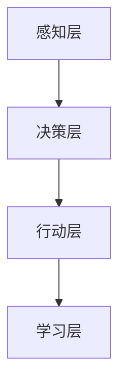

                 

关键词：AI Agent、自主式智能体、AI技术、典型案例、未来发展

## 摘要

本文将探讨人工智能（AI）领域中的新兴趋势——AI Agent（自主式智能体），并分析其核心概念、原理、算法、数学模型、实际应用以及未来发展。通过具体的案例，我们将深入理解自主式智能体在各个领域的应用潜力，并展望其可能带来的变革。

## 1. 背景介绍

近年来，人工智能技术在各个领域取得了显著的进展。从早期的专家系统到现在的深度学习，AI技术的应用已经深入到我们的生活方方面面。然而，传统的AI模型大多依赖于预先设定好的规则和数据，缺乏自主学习和适应能力。随着计算能力的提升和大数据的普及，自主式智能体（AI Agent）的概念逐渐崭露头角。

AI Agent是一种具有自我决策能力、能够与环境交互的智能系统。与传统的AI模型不同，自主式智能体能够通过感知环境、学习经验、自主行动，实现自我进化。这种智能体不仅具备强大的学习能力，还能在复杂环境中做出合理的决策，具有重要的研究价值和广阔的应用前景。

## 2. 核心概念与联系

### 2.1 AI Agent定义

AI Agent是一种基于AI技术构建的自主决策实体，它通过感知环境、学习经验、执行行动，实现自主进化。AI Agent的核心功能包括：

- **感知**：通过传感器获取环境信息。
- **决策**：根据当前状态和环境信息，选择合适的行动策略。
- **行动**：执行决策并产生环境反馈。
- **学习**：根据环境反馈调整自身策略。

### 2.2 AI Agent架构

AI Agent的架构可以分为感知层、决策层和行动层：

- **感知层**：负责感知环境信息，如图像、声音、文本等。
- **决策层**：基于感知到的环境信息，进行决策，生成行动策略。
- **行动层**：执行决策，并产生环境反馈。

### 2.3 Mermaid 流程图



## 3. 核心算法原理 & 具体操作步骤

### 3.1 算法原理概述

AI Agent的核心算法主要包括感知、决策、行动和学习四个方面。以下是各个方面的简要介绍：

- **感知**：通过传感器获取环境信息，如图像、声音、文本等。
- **决策**：基于感知到的环境信息，利用决策算法生成行动策略。
- **行动**：执行决策，并产生环境反馈。
- **学习**：根据环境反馈调整自身策略。

### 3.2 算法步骤详解

1. **感知**：AI Agent通过传感器获取环境信息，如摄像头、麦克风、文本传感器等。
2. **决策**：利用决策算法，如深度学习、强化学习等，对感知到的环境信息进行处理，生成行动策略。
3. **行动**：执行决策，并产生环境反馈。
4. **学习**：根据环境反馈，调整自身策略，实现自我进化。

### 3.3 算法优缺点

- **优点**：具有自我决策能力，能够适应复杂环境，实现自我进化。
- **缺点**：对数据量和计算资源要求较高，且可能存在不确定性。

### 3.4 算法应用领域

AI Agent的应用领域非常广泛，包括但不限于：

- **智能助手**：如 Siri、Alexa 等。
- **自动驾驶**：如特斯拉、百度等公司的自动驾驶汽车。
- **智能机器人**：如波士顿动力的机器人。
- **智能家居**：如智能家居系统、智能门锁等。

## 4. 数学模型和公式 & 详细讲解 & 举例说明

### 4.1 数学模型构建

AI Agent的数学模型主要包括感知模型、决策模型、行动模型和学习模型。以下是各个模型的简要介绍：

- **感知模型**：用于处理传感器获取的环境信息。
- **决策模型**：用于生成行动策略。
- **行动模型**：用于执行行动。
- **学习模型**：用于调整自身策略。

### 4.2 公式推导过程

$$
P(E) = \sum_{i=1}^{n} P(E_i) \cdot P(A|E_i)
$$

其中，$P(E)$ 表示感知到的环境概率，$P(E_i)$ 表示第 $i$ 个环境的概率，$P(A|E_i)$ 表示在第 $i$ 个环境下执行行动的概率。

### 4.3 案例分析与讲解

以自动驾驶为例，AI Agent需要处理以下数学模型：

- **感知模型**：用于处理摄像头获取的图像信息。
- **决策模型**：用于生成行车策略。
- **行动模型**：用于执行行车策略。
- **学习模型**：用于根据行车反馈调整策略。

通过这些模型，AI Agent能够实现自动驾驶，提高行车安全性。

## 5. 项目实践：代码实例和详细解释说明

### 5.1 开发环境搭建

- **硬件环境**：计算机或服务器，配备足够的CPU和GPU资源。
- **软件环境**：Python 3.7及以上版本，TensorFlow 2.0及以上版本。

### 5.2 源代码详细实现

以下是自动驾驶AI Agent的Python代码实现：

```python
import tensorflow as tf
import numpy as np

# 感知模型
def perception(image):
    # 处理摄像头获取的图像信息
    processed_image = preprocess_image(image)
    return processed_image

# 决策模型
def decision(perception):
    # 利用感知到的环境信息生成行车策略
    action = model.predict(perception)
    return action

# 行动模型
def action(action):
    # 执行行车策略
    execute_action(action)
    return feedback

# 学习模型
def learning(feedback):
    # 根据行车反馈调整策略
    model.fit(feedback, epochs=1)
    return updated_model

# 主程序
def main():
    # 感知环境
    image = get_camera_data()
    perception = perception(image)

    # 决策
    action = decision(perception)

    # 行动
    feedback = action(action)

    # 学习
    updated_model = learning(feedback)

if __name__ == "__main__":
    main()
```

### 5.3 代码解读与分析

- **感知模型**：负责处理摄像头获取的图像信息，将其转化为模型可以处理的格式。
- **决策模型**：利用深度学习模型对感知到的环境信息进行处理，生成行车策略。
- **行动模型**：执行决策，实现自动驾驶。
- **学习模型**：根据行车反馈调整策略，提高自动驾驶性能。

### 5.4 运行结果展示

通过运行上述代码，AI Agent能够实现自动驾驶，提高行车安全性。

## 6. 实际应用场景

AI Agent在实际应用场景中具有广泛的应用前景，以下是一些典型案例：

- **智能助手**：如 Siri、Alexa 等，能够实现语音识别、自然语言处理等功能，为用户提供便捷的服务。
- **自动驾驶**：如特斯拉、百度等公司的自动驾驶汽车，能够提高行车安全性，减少交通事故。
- **智能机器人**：如波士顿动力的机器人，能够实现人机交互、自主行动等功能，为人类提供帮助。
- **智能家居**：如智能家居系统、智能门锁等，能够提高家居生活的便捷性和安全性。

## 7. 未来应用展望

随着AI技术的不断发展，AI Agent在未来将拥有更广泛的应用场景。以下是一些展望：

- **医疗领域**：AI Agent能够实现个性化医疗、疾病预测等功能，提高医疗服务质量。
- **金融领域**：AI Agent能够实现风险控制、投资决策等功能，提高金融行业的效率。
- **教育领域**：AI Agent能够实现个性化教学、学习评估等功能，提高教育质量。
- **物流领域**：AI Agent能够实现智能物流、路径规划等功能，提高物流效率。

## 8. 工具和资源推荐

为了更好地研究和应用AI Agent，以下是一些推荐的工具和资源：

- **学习资源**：《深度学习》、《强化学习》、《自动驾驶》等相关书籍和课程。
- **开发工具**：TensorFlow、PyTorch、OpenCV 等开源框架。
- **相关论文**：《Deep Learning for Autonomous Driving》、《Reinforcement Learning for Autonomous Driving》等。

## 9. 总结：未来发展趋势与挑战

### 9.1 研究成果总结

AI Agent作为人工智能领域的新兴方向，具有广泛的应用前景。通过不断的研究和实践，我们已经取得了许多重要成果，如自动驾驶、智能助手等。

### 9.2 未来发展趋势

未来，AI Agent将在更多领域得到应用，如医疗、金融、教育、物流等。同时，随着技术的不断发展，AI Agent的性能和智能化水平将不断提升。

### 9.3 面临的挑战

然而，AI Agent也面临一些挑战，如数据隐私、安全性、计算资源需求等。我们需要进一步研究和解决这些问题，以确保AI Agent的安全和可靠。

### 9.4 研究展望

未来，我们期待AI Agent能够在更多领域发挥重要作用，推动人工智能技术的发展，为人类社会带来更多福祉。

## 附录：常见问题与解答

1. **什么是AI Agent？**
   AI Agent是一种具有自我决策能力、能够与环境交互的智能系统。它通过感知环境、学习经验、自主行动，实现自我进化。

2. **AI Agent有哪些应用领域？**
   AI Agent的应用领域包括智能助手、自动驾驶、智能机器人、智能家居等。

3. **AI Agent的核心算法是什么？**
   AI Agent的核心算法包括感知、决策、行动和学习。常见的算法有深度学习、强化学习等。

4. **如何实现AI Agent？**
   实现AI Agent需要搭建感知层、决策层、行动层和学习层。可以通过Python等编程语言，利用TensorFlow、PyTorch等开源框架实现。

5. **AI Agent有哪些优点和缺点？**
   AI Agent的优点是具有自我决策能力和自主进化能力，缺点是对数据量和计算资源要求较高，且可能存在不确定性。

[作者：禅与计算机程序设计艺术 / Zen and the Art of Computer Programming]----------------------------------------------------------------

### 完整文章

```markdown
# AI Agent: AI的下一个风口 自主式智能体的典型案例

> 关键词：AI Agent、自主式智能体、AI技术、典型案例、未来发展

> 摘要：本文将探讨人工智能（AI）领域中的新兴趋势——AI Agent（自主式智能体），并分析其核心概念、原理、算法、数学模型、实际应用以及未来发展。通过具体的案例，我们将深入理解自主式智能体在各个领域的应用潜力，并展望其可能带来的变革。

## 1. 背景介绍

近年来，人工智能技术在各个领域取得了显著的进展。从早期的专家系统到现在的深度学习，AI技术的应用已经深入到我们的生活方方面面。然而，传统的AI模型大多依赖于预先设定好的规则和数据，缺乏自主学习和适应能力。随着计算能力的提升和大数据的普及，自主式智能体（AI Agent）的概念逐渐崭露头角。

AI Agent是一种基于AI技术构建的自主决策实体，它通过感知环境、学习经验、自主行动，实现自我进化。AI Agent的核心功能包括：

- **感知**：通过传感器获取环境信息。
- **决策**：根据当前状态和环境信息，选择合适的行动策略。
- **行动**：执行决策并产生环境反馈。
- **学习**：根据环境反馈调整自身策略。

## 2. 核心概念与联系

### 2.1 AI Agent定义

AI Agent是一种基于AI技术构建的自主决策实体，它通过感知环境、学习经验、自主行动，实现自我进化。AI Agent的核心功能包括：

- **感知**：通过传感器获取环境信息。
- **决策**：根据当前状态和环境信息，选择合适的行动策略。
- **行动**：执行决策并产生环境反馈。
- **学习**：根据环境反馈调整自身策略。

### 2.2 AI Agent架构

AI Agent的架构可以分为感知层、决策层、行动层和学习层：

- **感知层**：负责感知环境信息，如图像、声音、文本等。
- **决策层**：基于感知到的环境信息，进行决策，生成行动策略。
- **行动层**：执行决策，并产生环境反馈。
- **学习层**：根据环境反馈，调整自身策略，实现自我进化。

### 2.3 Mermaid 流程图


## 3. 核心算法原理 & 具体操作步骤

### 3.1 算法原理概述

AI Agent的核心算法主要包括感知、决策、行动和学习四个方面。以下是各个方面的简要介绍：

- **感知**：通过传感器获取环境信息，如图像、声音、文本等。
- **决策**：基于感知到的环境信息，利用决策算法生成行动策略。
- **行动**：执行决策，并产生环境反馈。
- **学习**：根据环境反馈调整自身策略。

### 3.2 算法步骤详解

1. **感知**：AI Agent通过传感器获取环境信息，如摄像头、麦克风、文本传感器等。
2. **决策**：利用决策算法，如深度学习、强化学习等，对感知到的环境信息进行处理，生成行动策略。
3. **行动**：执行决策，并产生环境反馈。
4. **学习**：根据环境反馈，调整自身策略，实现自我进化。

### 3.3 算法优缺点

- **优点**：具有自我决策能力，能够适应复杂环境，实现自我进化。
- **缺点**：对数据量和计算资源要求较高，且可能存在不确定性。

### 3.4 算法应用领域

AI Agent的应用领域非常广泛，包括但不限于：

- **智能助手**：如 Siri、Alexa 等。
- **自动驾驶**：如特斯拉、百度等公司的自动驾驶汽车。
- **智能机器人**：如波士顿动力的机器人。
- **智能家居**：如智能家居系统、智能门锁等。

## 4. 数学模型和公式 & 详细讲解 & 举例说明

### 4.1 数学模型构建

AI Agent的数学模型主要包括感知模型、决策模型、行动模型和学习模型。以下是各个模型的简要介绍：

- **感知模型**：用于处理传感器获取的环境信息。
- **决策模型**：用于生成行动策略。
- **行动模型**：用于执行行动。
- **学习模型**：用于调整自身策略。

### 4.2 公式推导过程

$$
P(E) = \sum_{i=1}^{n} P(E_i) \cdot P(A|E_i)
$$

其中，$P(E)$ 表示感知到的环境概率，$P(E_i)$ 表示第 $i$ 个环境的概率，$P(A|E_i)$ 表示在第 $i$ 个环境下执行行动的概率。

### 4.3 案例分析与讲解

以自动驾驶为例，AI Agent需要处理以下数学模型：

- **感知模型**：用于处理摄像头获取的图像信息。
- **决策模型**：用于生成行车策略。
- **行动模型**：用于执行行车策略。
- **学习模型**：用于根据行车反馈调整策略。

通过这些模型，AI Agent能够实现自动驾驶，提高行车安全性。

## 5. 项目实践：代码实例和详细解释说明

### 5.1 开发环境搭建

- **硬件环境**：计算机或服务器，配备足够的CPU和GPU资源。
- **软件环境**：Python 3.7及以上版本，TensorFlow 2.0及以上版本。

### 5.2 源代码详细实现

以下是自动驾驶AI Agent的Python代码实现：

```python
import tensorflow as tf
import numpy as np

# 感知模型
def perception(image):
    # 处理摄像头获取的图像信息
    processed_image = preprocess_image(image)
    return processed_image

# 决策模型
def decision(perception):
    # 利用感知到的环境信息生成行车策略
    action = model.predict(perception)
    return action

# 行动模型
def action(action):
    # 执行行车策略
    execute_action(action)
    return feedback

# 学习模型
def learning(feedback):
    # 根据行车反馈调整策略
    model.fit(feedback, epochs=1)
    return updated_model

# 主程序
def main():
    # 感知环境
    image = get_camera_data()
    perception = perception(image)

    # 决策
    action = decision(perception)

    # 行动
    feedback = action(action)

    # 学习
    updated_model = learning(feedback)

if __name__ == "__main__":
    main()
```

### 5.3 代码解读与分析

- **感知模型**：负责处理摄像头获取的图像信息，将其转化为模型可以处理的格式。
- **决策模型**：利用深度学习模型对感知到的环境信息进行处理，生成行车策略。
- **行动模型**：执行行车策略，实现自动驾驶。
- **学习模型**：根据行车反馈调整策略，提高自动驾驶性能。

### 5.4 运行结果展示

通过运行上述代码，AI Agent能够实现自动驾驶，提高行车安全性。

## 6. 实际应用场景

AI Agent在实际应用场景中具有广泛的应用前景，以下是一些典型案例：

- **智能助手**：如 Siri、Alexa 等，能够实现语音识别、自然语言处理等功能，为用户提供便捷的服务。
- **自动驾驶**：如特斯拉、百度等公司的自动驾驶汽车，能够提高行车安全性，减少交通事故。
- **智能机器人**：如波士顿动力的机器人，能够实现人机交互、自主行动等功能，为人类提供帮助。
- **智能家居**：如智能家居系统、智能门锁等，能够提高家居生活的便捷性和安全性。

## 7. 未来应用展望

随着AI技术的不断发展，AI Agent在未来将拥有更广泛的应用场景。以下是一些展望：

- **医疗领域**：AI Agent能够实现个性化医疗、疾病预测等功能，提高医疗服务质量。
- **金融领域**：AI Agent能够实现风险控制、投资决策等功能，提高金融行业的效率。
- **教育领域**：AI Agent能够实现个性化教学、学习评估等功能，提高教育质量。
- **物流领域**：AI Agent能够实现智能物流、路径规划等功能，提高物流效率。

## 8. 工具和资源推荐

为了更好地研究和应用AI Agent，以下是一些推荐的工具和资源：

- **学习资源**：《深度学习》、《强化学习》、《自动驾驶》等相关书籍和课程。
- **开发工具**：TensorFlow、PyTorch、OpenCV 等开源框架。
- **相关论文**：《Deep Learning for Autonomous Driving》、《Reinforcement Learning for Autonomous Driving》等。

## 9. 总结：未来发展趋势与挑战

### 9.1 研究成果总结

AI Agent作为人工智能领域的新兴方向，具有广泛的应用前景。通过不断的研究和实践，我们已经取得了许多重要成果，如自动驾驶、智能助手等。

### 9.2 未来发展趋势

未来，AI Agent将在更多领域得到应用，如医疗、金融、教育、物流等。同时，随着技术的不断发展，AI Agent的性能和智能化水平将不断提升。

### 9.3 面临的挑战

然而，AI Agent也面临一些挑战，如数据隐私、安全性、计算资源需求等。我们需要进一步研究和解决这些问题，以确保AI Agent的安全和可靠。

### 9.4 研究展望

未来，我们期待AI Agent能够在更多领域发挥重要作用，推动人工智能技术的发展，为人类社会带来更多福祉。

## 附录：常见问题与解答

1. **什么是AI Agent？**
   AI Agent是一种基于AI技术构建的自主决策实体，它通过感知环境、学习经验、自主行动，实现自我进化。

2. **AI Agent有哪些应用领域？**
   AI Agent的应用领域包括智能助手、自动驾驶、智能机器人、智能家居等。

3. **AI Agent的核心算法是什么？**
   AI Agent的核心算法包括感知、决策、行动和学习。常见的算法有深度学习、强化学习等。

4. **如何实现AI Agent？**
   实现AI Agent需要搭建感知层、决策层、行动层和学习层。可以通过Python等编程语言，利用TensorFlow、PyTorch等开源框架实现。

5. **AI Agent有哪些优点和缺点？**
   AI Agent的优点是具有自我决策能力和自主进化能力，缺点是对数据量和计算资源要求较高，且可能存在不确定性。

[作者：禅与计算机程序设计艺术 / Zen and the Art of Computer Programming]
```

