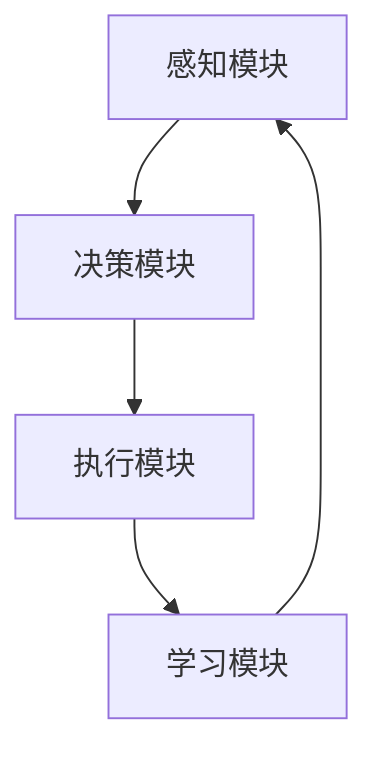

                 

关键词：人工智能，自动化，生产力革命，AI Agent，深度学习，技术革新

摘要：本文旨在探讨AI Agent在现代技术发展中的重要性，以及它如何引领下一波生产力革命。通过对AI Agent的核心概念、算法原理、数学模型、实际应用以及未来展望的深入分析，本文将揭示AI Agent在未来科技领域的巨大潜力。

## 1. 背景介绍

自20世纪50年代人工智能（AI）的概念提出以来，AI技术经历了数次变革。从最初的符号推理到专家系统，再到如今的深度学习和强化学习，人工智能正在迅速融入我们的日常生活。然而，随着计算能力的提升和数据量的爆炸式增长，人工智能正迎来一个新的发展阶段——AI Agent。

AI Agent，或者说人工智能代理，是一种能够自主决策并执行任务的系统。与传统的人工智能系统不同，AI Agent不仅能够处理特定任务，还具有学习、适应和改进的能力。这一特性使得AI Agent在高度自动化的生产环境中具有巨大潜力，能够大幅提高生产力。

### 1.1 AI Agent的定义与发展

AI Agent的定义源于代理理论（Agent Theory），其核心在于自主性、交互性和适应性。自主性意味着AI Agent能够根据环境信息自主决策；交互性则要求AI Agent能够与人类或其他系统进行有效沟通；适应性则体现在AI Agent能够在不同环境和任务中不断学习与改进。

AI Agent的发展可以分为三个阶段：

1. **初步阶段**：主要以规则为基础，AI Agent能够执行一些简单任务，但缺乏自适应能力。
2. **发展阶段**：借助机器学习和深度学习，AI Agent开始具备自主学习和决策的能力。
3. **成熟阶段**：现在的AI Agent已经能够执行复杂任务，并具备较高的自适应能力。

### 1.2 AI Agent的关键特性

AI Agent的关键特性包括：

1. **自主性**：AI Agent能够在没有人类干预的情况下自主完成任务。
2. **适应性**：AI Agent能够根据环境变化调整其行为，实现持续优化。
3. **协作性**：AI Agent能够与其他AI系统或人类协同工作，提高整体效率。
4. **学习性**：AI Agent能够通过学习历史数据和经验不断改进其性能。

## 2. 核心概念与联系

### 2.1 AI Agent的核心概念

AI Agent的核心概念包括：

1. **感知**：AI Agent通过传感器获取环境信息。
2. **决策**：AI Agent根据感知信息进行决策。
3. **执行**：AI Agent根据决策执行任务。
4. **反馈**：AI Agent根据执行结果调整决策。

### 2.2 AI Agent的工作原理

AI Agent的工作原理可以简化为以下步骤：

1. **感知环境**：AI Agent使用传感器收集环境数据。
2. **处理数据**：AI Agent使用机器学习算法处理数据，提取特征。
3. **决策**：基于处理结果，AI Agent生成决策。
4. **执行任务**：AI Agent根据决策执行具体任务。
5. **反馈学习**：AI Agent根据执行结果调整决策，实现持续优化。

### 2.3 AI Agent的架构

AI Agent的架构通常包括以下几个部分：

1. **感知模块**：负责收集环境信息。
2. **决策模块**：负责处理感知信息并生成决策。
3. **执行模块**：负责执行决策。
4. **学习模块**：负责根据执行结果调整决策。

### 2.4 Mermaid流程图



## 3. 核心算法原理 & 具体操作步骤

### 3.1 算法原理概述

AI Agent的核心算法原理主要包括以下几个方面：

1. **感知**：使用传感器收集环境数据，如视觉、听觉、触觉等。
2. **数据处理**：通过机器学习算法处理感知数据，提取有用特征。
3. **决策**：基于特征数据生成决策，如路径规划、目标识别等。
4. **执行**：根据决策执行具体任务，如移动、操作等。
5. **反馈学习**：根据执行结果调整决策，提高后续任务性能。

### 3.2 算法步骤详解

1. **感知阶段**：AI Agent通过传感器（如摄像头、麦克风、触摸传感器等）收集环境数据。
2. **数据处理阶段**：AI Agent使用预处理算法（如滤波、去噪等）处理感知数据，然后使用机器学习算法（如卷积神经网络、循环神经网络等）提取特征。
3. **决策阶段**：AI Agent根据提取的特征生成决策，如基于图像识别生成移动路径。
4. **执行阶段**：AI Agent根据决策执行具体任务，如移动到特定位置。
5. **反馈学习阶段**：AI Agent根据执行结果调整决策，以实现持续优化。

### 3.3 算法优缺点

**优点**：

1. **高度自动化**：AI Agent能够自主执行任务，减少人工干预。
2. **适应性强**：AI Agent能够根据环境变化调整行为，提高任务成功率。
3. **持续学习**：AI Agent能够通过学习历史数据和经验不断改进性能。

**缺点**：

1. **计算资源消耗大**：AI Agent需要大量的计算资源和存储空间。
2. **数据依赖性强**：AI Agent的性能高度依赖于感知数据的准确性和完整性。
3. **安全性问题**：AI Agent可能受到恶意攻击或数据泄露的影响。

### 3.4 算法应用领域

AI Agent在多个领域具有广泛的应用前景，包括：

1. **机器人**：AI Agent能够为机器人提供自主决策能力，使其在复杂环境中执行任务。
2. **自动驾驶**：AI Agent能够为自动驾驶车辆提供实时决策支持，提高行车安全性。
3. **智能家居**：AI Agent能够为智能家居设备提供智能化控制，提高生活便利性。
4. **金融风控**：AI Agent能够为金融机构提供实时风险监控和决策支持，降低风险。

## 4. 数学模型和公式 & 详细讲解 & 举例说明

### 4.1 数学模型构建

AI Agent的数学模型通常基于概率论、信息论和机器学习理论。以下是一个简化的数学模型：

1. **感知模型**：使用贝叶斯网络描述感知过程，如：
   $$P(s|a) = \frac{P(a|s)P(s)}{P(a)}$$
   其中，$s$ 表示传感器数据，$a$ 表示决策。

2. **决策模型**：使用马尔可夫决策过程（MDP）描述决策过程，如：
   $$V(s) = \max_{a} \sum_{s'} P(s'|s,a) \cdot R(s',a) + \gamma V(s')$$
   其中，$V(s)$ 表示状态价值函数，$R(s',a)$ 表示立即回报，$\gamma$ 表示折扣因子。

3. **执行模型**：使用动态规划（如Q-Learning）描述执行过程，如：
   $$Q(s,a) = \sum_{s'} P(s'|s,a) \cdot [R(s',a) + \gamma \max_{a'} Q(s',a')]$$

### 4.2 公式推导过程

在此，我们以马尔可夫决策过程（MDP）中的状态价值函数推导为例：

$$V(s) = \max_{a} \sum_{s'} P(s'|s,a) \cdot R(s',a) + \gamma V(s')$$

1. **初始状态**：$V(s_0) = R(s_0)$，其中$s_0$表示初始状态。
2. **迭代计算**：对于每个状态$s$，根据上述公式计算状态价值函数$V(s)$。
3. **收敛性**：当状态价值函数收敛时，即$V(s)$不再变化，表示最优解已找到。

### 4.3 案例分析与讲解

以自动驾驶中的路径规划为例，我们使用马尔可夫决策过程（MDP）进行建模。

1. **状态定义**：状态$S$表示车辆的位置和方向。
2. **动作定义**：动作$A$表示加速、减速或转向。
3. **奖励函数**：奖励$R$表示到达目标地点的奖励或偏离目标地点的惩罚。
4. **状态转移概率**：$P(S'|S,A)$表示执行动作$A$后，从状态$S$转移到状态$S'$的概率。

通过上述定义，我们可以构建自动驾驶的MDP模型，并使用Q-Learning算法求解最优路径规划。

## 5. 项目实践：代码实例和详细解释说明

### 5.1 开发环境搭建

1. **安装Python环境**：Python是AI Agent开发的主要语言，我们需要安装Python 3.7及以上版本。
2. **安装深度学习库**：如TensorFlow、PyTorch等。
3. **安装机器人控制库**：如ROS（Robot Operating System）。

### 5.2 源代码详细实现

以下是一个简单的AI Agent示例，用于控制机器人移动。

```python
import rospy
from geometry_msgs.msg import Twist

class RobotControlAgent:
    def __init__(self):
        rospy.init_node('robot_control_agent')
        self.cmd_vel_pub = rospy.Publisher('cmd_vel', Twist, queue_size=10)
        
    def move_forward(self, speed, duration):
        twist = Twist()
        twist.linear.x = speed
        self.cmd_vel_pub.publish(twist)
        rospy.sleep(duration)
        twist.linear.x = 0
        self.cmd_vel_pub.publish(twist)
        
    def rotate_left(self, angular_speed, duration):
        twist = Twist()
        twist.angular.z = angular_speed
        self.cmd_vel_pub.publish(twist)
        rospy.sleep(duration)
        twist.angular.z = 0
        self.cmd_vel_pub.publish(twist)

if __name__ == '__main__':
    agent = RobotControlAgent()
    agent.move_forward(1.0, 5.0)
    agent.rotate_left(1.0, 2.0)
```

### 5.3 代码解读与分析

1. **初始化ROS节点**：`rospy.init_node('robot_control_agent')`用于初始化ROS节点。
2. **创建Publisher**：`self.cmd_vel_pub = rospy.Publisher('cmd_vel', Twist, queue_size=10)`用于创建速度命令发布者。
3. **移动函数**：`move_forward`和`rotate_left`函数用于控制机器人移动和旋转。
4. **发布速度命令**：`self.cmd_vel_pub.publish(twist)`用于发布速度命令。

### 5.4 运行结果展示

运行上述代码后，机器人将按照预设的速度和方向进行移动和旋转。通过调整速度和旋转角度，可以实现更复杂的移动路径。

## 6. 实际应用场景

### 6.1 工业自动化

AI Agent在工业自动化领域具有广泛的应用，如机器人手臂的自主操作、生产线中的质量检测等。AI Agent能够提高生产效率，降低人力成本，并在复杂生产环境中实现自动化。

### 6.2 交通运输

AI Agent在自动驾驶、智能交通管理等领域具有重要应用。自动驾驶车辆通过AI Agent实现自主导航和决策，提高行车安全性和效率。智能交通管理系统利用AI Agent优化交通流量，减少拥堵。

### 6.3 智能家居

智能家居设备通过AI Agent实现智能化控制，如自动调节灯光、温度、安防报警等。AI Agent能够提高生活便利性，提高家居安全性。

### 6.4 金融风控

金融风控系统利用AI Agent进行实时风险监控和决策支持，如欺诈检测、信用评估等。AI Agent能够提高风险管理效率，降低金融风险。

### 6.5 健康医疗

AI Agent在健康医疗领域具有广泛应用，如智能诊断、医疗机器人等。AI Agent能够提高医疗诊断的准确性和效率，提高患者满意度。

## 7. 工具和资源推荐

### 7.1 学习资源推荐

1. **《深度学习》（Ian Goodfellow, Yoshua Bengio, Aaron Courville著）**
2. **《强化学习手册》（Richard S. Sutton, Andrew G. Barto著）**
3. **《机器人学导论》（Peter Corke著）**

### 7.2 开发工具推荐

1. **Python**：用于AI Agent开发的编程语言。
2. **TensorFlow**：用于深度学习的开源库。
3. **PyTorch**：用于深度学习的开源库。
4. **ROS**：用于机器人开发的操作系统。

### 7.3 相关论文推荐

1. **"Deep Reinforcement Learning for Autonomous Navigation"（DeepMind，2016）**
2. **"Distributed Deep Reinforcement Learning for Autonomous Driving"（Google AI，2018）**
3. **"Sim-to-Real Transfer of Robot Locomotion Skills with Deep Learning"（DeepMind，2018）**

## 8. 总结：未来发展趋势与挑战

### 8.1 研究成果总结

1. **算法性能提升**：深度学习和强化学习等算法性能不断提高，为AI Agent的发展提供技术支持。
2. **应用领域拓展**：AI Agent在工业、交通、家居、医疗等多个领域得到广泛应用，显著提高生产力。
3. **跨学科研究**：AI Agent的发展离不开计算机科学、机器人学、神经科学等多个学科的合作。

### 8.2 未来发展趋势

1. **自主学习与决策能力提升**：AI Agent将具备更强的自主学习与决策能力，实现更高水平的自动化。
2. **跨领域融合**：AI Agent将与其他领域（如生物、物理等）相结合，推动技术创新。
3. **分布式与协作**：AI Agent将实现分布式与协作，提高系统效率和可靠性。

### 8.3 面临的挑战

1. **计算资源消耗**：AI Agent需要大量计算资源，如何优化算法和硬件设计成为关键挑战。
2. **数据隐私与安全**：AI Agent涉及大量数据收集与处理，如何保护用户隐私和安全成为重要问题。
3. **伦理与法律**：AI Agent的广泛应用带来伦理和法律挑战，如何确保其合法合规成为关键。

### 8.4 研究展望

1. **算法优化**：研究更高效的算法，降低计算资源消耗。
2. **数据安全**：研究数据加密、隐私保护等技术，确保数据安全。
3. **伦理法律规范**：研究伦理和法律规范，确保AI Agent的合法合规应用。

## 9. 附录：常见问题与解答

### 9.1 什么是AI Agent？

AI Agent是一种能够自主决策并执行任务的系统，它具有自主性、交互性和适应性。

### 9.2 AI Agent有哪些应用领域？

AI Agent在工业自动化、交通运输、智能家居、金融风控、健康医疗等多个领域具有广泛应用。

### 9.3 AI Agent的核心算法是什么？

AI Agent的核心算法主要包括感知、数据处理、决策和执行等步骤，常用的算法包括深度学习和强化学习。

### 9.4 如何搭建AI Agent的开发环境？

搭建AI Agent的开发环境需要安装Python、深度学习库（如TensorFlow、PyTorch）和机器人控制库（如ROS）。

### 9.5 AI Agent面临哪些挑战？

AI Agent面临的挑战主要包括计算资源消耗、数据隐私与安全、伦理与法律等。

---

### 作者署名

作者：禅与计算机程序设计艺术 / Zen and the Art of Computer Programming

---

通过本文的探讨，我们深入了解了AI Agent的核心概念、算法原理、数学模型、实际应用以及未来展望。AI Agent作为人工智能发展的新风口，必将引领下一波生产力革命，为人类社会带来深远的影响。未来，随着技术的不断进步和跨学科的融合，AI Agent将在更广泛的领域发挥重要作用。让我们共同期待AI Agent带来的美好未来。

