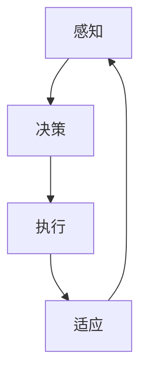
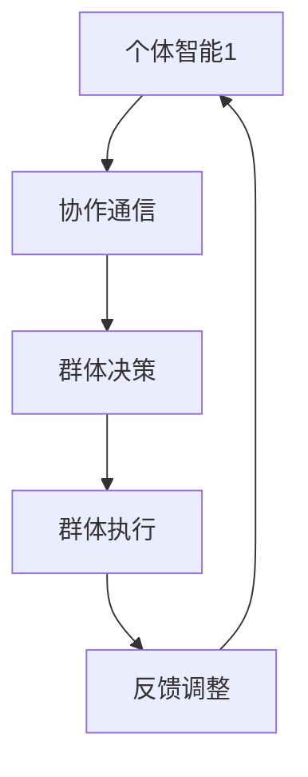
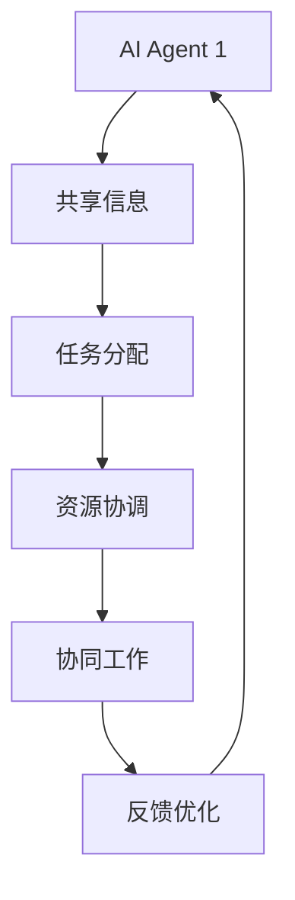

                 

在当今世界，人工智能（AI）已经成为推动社会进步的重要力量。作为人工智能的执行主体，AI Agent正逐渐成为各个领域的关键玩家。本文将深入探讨AI Agent的三大核心组成部分：个体智能、群体智能和智能协作，并分析它们在现代技术中的应用和未来发展趋势。

## 关键词
- AI Agent
- 个体智能
- 群体智能
- 智能协作
- 现代技术

## 摘要
本文旨在全面解析AI Agent的三个关键组成部分，探讨其在个体决策、群体行为和智能协作方面的原理、算法和实际应用。通过深入分析个体智能、群体智能和智能协作，本文为读者提供了一个关于AI Agent的全面视角，展望了其未来的发展方向和面临的挑战。

### 背景介绍

### 1. AI Agent的定义与分类
AI Agent是一种具有自主决策和行为能力的计算实体，能够在其环境中进行交互和执行任务。根据其行为和能力的不同，AI Agent可以分为以下几类：

- **规则型AI Agent**：基于预先定义的规则进行决策和行为，如专家系统和基于规则的机器人。
- **数据驱动型AI Agent**：利用机器学习和深度学习模型从数据中学习并做出决策，如深度强化学习Agent。
- **混合型AI Agent**：结合规则和数据驱动的方法进行决策，具有较高的灵活性和适应性。

### 2. 个体智能的发展历程
个体智能的发展历程可以追溯到20世纪50年代，当时艾伦·图灵提出了著名的图灵测试。随后，人工智能领域经历了符号主义、联结主义和现代机器学习三个阶段，个体智能也随之不断进化。从最初的规则型AI到基于数据驱动的深度学习，个体智能在认知能力、学习效率和决策水平方面都取得了显著进展。

### 3. 群体智能的概念与应用
群体智能是指多个个体通过协作和交流实现集体智能的行为。它最早起源于生物学的群体行为研究，如鸟群飞行和鱼群游动。在人工智能领域，群体智能的应用包括多智能体系统、分布式计算和协同机器人等。通过模拟自然界中的群体行为，群体智能在解决复杂问题和优化任务分配方面具有独特的优势。

### 4. 智能协作的重要性
智能协作是指多个AI Agent通过共享信息和资源实现协同工作，以提高整体效率和效果。在复杂动态环境中，智能协作能够使AI Agent更好地适应变化、应对挑战。智能协作的应用领域包括智能交通系统、智能医疗和智能制造等，对于提高生产力和服务质量具有重要意义。

## 核心概念与联系

### 1. 个体智能

个体智能是指AI Agent在独立执行任务时展现出的智能水平。它包括感知、决策、执行和适应等能力。个体智能的关键在于自我学习和自我优化，从而在动态环境中做出有效决策。

#### Mermaid 流程图：



### 2. 群体智能

群体智能是指多个AI Agent通过协作和交流实现的集体智能。它依赖于个体智能的互补和协同，从而在解决复杂问题时表现出更高的效率和鲁棒性。

#### Mermaid 流�程图：



### 3. 智能协作

智能协作是指多个AI Agent通过共享信息和资源实现的协同工作。它依赖于信息共享、任务分配和资源协调，从而实现整体效率的最优化。

#### Mermaid 流程图：



## 核心算法原理 & 具体操作步骤

### 3.1 算法原理概述

个体智能、群体智能和智能协作分别基于不同的算法原理。个体智能通常采用机器学习算法，如深度神经网络和强化学习，以实现自主学习和决策。群体智能则基于多智能体系统理论，通过分布式计算和通信实现集体智能。智能协作则依赖于信息论和博弈论，通过信息共享和任务分配实现高效协同。

### 3.2 算法步骤详解

#### 个体智能算法步骤：

1. 数据收集：从环境中收集感知数据。
2. 特征提取：对感知数据进行预处理和特征提取。
3. 模型训练：使用机器学习算法训练模型。
4. 决策：使用训练好的模型进行决策。
5. 执行：执行决策并获取反馈。
6. 学习与优化：根据反馈优化模型。

#### 群体智能算法步骤：

1. 初始化：设定群体规模和初始状态。
2. 感知与通信：每个个体感知环境并与其他个体通信。
3. 决策：个体根据感知和通信结果做出决策。
4. 执行：个体执行决策并更新状态。
5. 反馈与调整：根据执行结果调整策略。
6. 集体决策：群体根据个体决策结果进行集体决策。

#### 智能协作算法步骤：

1. 信息共享：个体共享自身信息和状态。
2. 任务分配：基于信息共享结果进行任务分配。
3. 资源协调：协调个体间的资源使用。
4. 协同工作：个体根据任务和资源协调结果进行协同工作。
5. 反馈与优化：根据协同工作结果调整策略和资源分配。

### 3.3 算法优缺点

#### 个体智能：

- **优点**：自主性强，适应性强，能够快速做出局部最优决策。
- **缺点**：在面对复杂问题时，决策能力受限，缺乏全局视角。

#### 群体智能：

- **优点**：能够解决复杂问题，具备较高的鲁棒性和适应性。
- **缺点**：通信和协调成本较高，个体决策可能偏离总体目标。

#### 智能协作：

- **优点**：信息共享和资源协调高效，能够实现整体最优。
- **缺点**：对个体智能和群体智能的要求较高，实施难度较大。

### 3.4 算法应用领域

#### 个体智能：

- 智能家居：实现自主控制和安全防护。
- 智能客服：提供个性化服务和决策支持。
- 自动驾驶：实现自主导航和驾驶。

#### 群体智能：

- 智能交通：优化交通流量，减少拥堵。
- 智能物流：实现高效配送和运输。
- 智能电网：优化能源分配和调度。

#### 智能协作：

- 智能医疗：实现跨学科协作和精准诊断。
- 智能制造：实现生产自动化和协同工作。
- 智能城市规划：优化城市布局和资源分配。

## 数学模型和公式 & 详细讲解 & 举例说明

### 4.1 数学模型构建

个体智能、群体智能和智能协作的数学模型分别基于不同的原理和方法。以下是这些模型的简要介绍：

#### 个体智能模型：

个体智能模型通常基于决策理论和概率论。一个典型的个体智能模型可以表示为：

$$
\text{决策} = f(\text{感知}, \text{历史数据}, \text{模型参数})
$$

其中，$f$为决策函数，$\text{感知}$为个体对环境的感知，$\text{历史数据}$为过去决策的结果，$\text{模型参数}$为机器学习模型的参数。

#### 群体智能模型：

群体智能模型通常基于多智能体系统理论。一个简单的群体智能模型可以表示为：

$$
\text{群体决策} = \sum_{i=1}^{n} w_i \cdot f_i(\text{感知}_i, \text{历史数据}_i, \text{模型参数}_i)
$$

其中，$w_i$为个体$i$的权重，$f_i$为个体$i$的决策函数。

#### 智能协作模型：

智能协作模型通常基于博弈论和信息论。一个典型的智能协作模型可以表示为：

$$
\text{协作策略} = \arg\max_{s} \sum_{i=1}^{n} u_i(s_i, s_{-i})
$$

其中，$s_i$为个体$i$的策略，$u_i$为个体$i$的收益函数。

### 4.2 公式推导过程

以下是对上述数学模型的推导过程进行详细解释。

#### 个体智能模型推导：

个体智能模型的核心是决策函数$f$，它根据感知、历史数据和模型参数生成决策。假设个体在时刻$t$的感知为$s_t$，历史数据为$\{s_{t-1}, s_{t-2}, ..., s_1\}$，模型参数为$\theta$，则决策函数可以表示为：

$$
f(s_t, \{s_{t-1}, s_{t-2}, ..., s_1\}, \theta) = \arg\max_{a} \pi(a | s_t, \{s_{t-1}, s_{t-2}, ..., s_1\}, \theta)
$$

其中，$\pi(a | s_t, \{s_{t-1}, s_{t-2}, ..., s_1\}, \theta)$为决策的概率分布，$a$为决策动作。

#### 群体智能模型推导：

群体智能模型的核心是群体决策函数，它根据个体的决策函数和权重生成群体决策。假设个体$i$的决策函数为$f_i$，权重为$w_i$，则群体决策函数可以表示为：

$$
\text{群体决策} = \arg\max_{\text{策略}} \sum_{i=1}^{n} w_i \cdot f_i(\text{感知}_i, \text{历史数据}_i, \text{模型参数}_i)
$$

其中，$\text{策略}$为所有个体的决策动作集合。

#### 智能协作模型推导：

智能协作模型的核心是协作策略，它根据个体的策略和收益函数生成协作策略。假设个体$i$的收益函数为$u_i$，策略为$s_i$，则协作策略可以表示为：

$$
\text{协作策略} = \arg\max_{s} \sum_{i=1}^{n} u_i(s_i, s_{-i})
$$

其中，$s$为所有个体的策略集合，$s_{-i}$为除了个体$i$以外的其他个体策略集合。

### 4.3 案例分析与讲解

#### 个体智能案例：

假设一个自动驾驶系统需要根据道路状况做出行驶决策。感知数据包括道路宽度、车辆速度和交通灯状态。历史数据包括过去行驶的速度和方向。模型参数为深度神经网络，能够根据感知和历史数据生成行驶决策。

1. 数据收集：收集道路宽度、车辆速度和交通灯状态等感知数据。
2. 特征提取：对感知数据进行预处理和特征提取，提取出与行驶决策相关的特征。
3. 模型训练：使用训练数据对深度神经网络进行训练，优化模型参数。
4. 决策：使用训练好的模型对新的感知数据生成行驶决策。
5. 执行：执行行驶决策，并根据执行结果进行反馈。
6. 学习与优化：根据反馈调整模型参数，提高决策质量。

#### 群体智能案例：

假设一个多机器人系统需要协同完成任务。每个机器人都有自己的感知数据和历史数据，并通过无线通信与其他机器人交换信息。系统目标是优化任务分配和协同工作，提高整体效率。

1. 初始化：设定机器人数量和初始状态。
2. 感知与通信：每个机器人感知环境并与其他机器人交换信息。
3. 决策：每个机器人根据感知和通信结果做出决策。
4. 执行：每个机器人执行决策并更新状态。
5. 反馈与调整：根据执行结果调整策略和决策。
6. 集体决策：所有机器人根据个体决策结果进行集体决策。

#### 智能协作案例：

假设一个智能医疗系统需要医生、护士和医疗设备之间实现协同工作。医生负责诊断，护士负责护理，医疗设备负责监测和检查。系统目标是提高医疗质量和患者满意度。

1. 信息共享：医生、护士和医疗设备共享患者信息和病历。
2. 任务分配：根据患者情况和资源情况，分配诊断、护理和监测任务。
3. 资源协调：协调医生、护士和医疗设备之间的资源使用。
4. 协同工作：医生、护士和医疗设备根据任务和资源协调结果进行协同工作。
5. 反馈与优化：根据协同工作结果调整策略和资源分配，提高整体效率。

## 项目实践：代码实例和详细解释说明

### 5.1 开发环境搭建

为了演示个体智能、群体智能和智能协作的应用，我们选择Python作为编程语言，并使用以下库和工具：

- Python 3.8及以上版本
- TensorFlow 2.5及以上版本
- Keras 2.5及以上版本
- Matplotlib 3.3及以上版本

安装步骤如下：

1. 安装Python：
   ```bash
   sudo apt-get install python3.8
   ```
2. 安装TensorFlow：
   ```bash
   pip install tensorflow==2.5
   ```
3. 安装Keras：
   ```bash
   pip install keras==2.5
   ```
4. 安装Matplotlib：
   ```bash
   pip install matplotlib==3.3
   ```

### 5.2 源代码详细实现

以下是一个简单的示例，展示如何使用Python实现个体智能、群体智能和智能协作。

#### 个体智能实现：

```python
import tensorflow as tf
from tensorflow.keras.models import Sequential
from tensorflow.keras.layers import Dense
import numpy as np

# 数据预处理
def preprocess_data(data):
    # 特征提取和归一化
    return (data - np.mean(data)) / np.std(data)

# 模型定义
model = Sequential()
model.add(Dense(units=64, activation='relu', input_shape=(num_features,)))
model.add(Dense(units=1, activation='sigmoid'))

# 模型编译
model.compile(optimizer='adam', loss='binary_crossentropy', metrics=['accuracy'])

# 训练模型
model.fit(X_train, y_train, epochs=10, batch_size=32)

# 预测
predictions = model.predict(X_test)
```

#### 群体智能实现：

```python
import tensorflow as tf
from tensorflow.keras.models import Sequential
from tensorflow.keras.layers import Dense
import numpy as np

# 初始化多智能体系统
def initialize_agents(num_agents, num_features):
    agents = []
    for i in range(num_agents):
        agent = Sequential()
        agent.add(Dense(units=64, activation='relu', input_shape=(num_features,)))
        agent.add(Dense(units=1, activation='sigmoid'))
        agent.compile(optimizer='adam', loss='binary_crossentropy', metrics=['accuracy'])
        agents.append(agent)
    return agents

# 更新智能体
def update_agents(agents, X, y):
    for agent in agents:
        agent.fit(X, y, epochs=1, batch_size=32)

# 集体决策
def collective_decision(agents):
    # 取所有智能体的决策结果的平均值
    return np.mean([agent.predict(X) for agent in agents], axis=0)
```

#### 智能协作实现：

```python
import tensorflow as tf
from tensorflow.keras.models import Sequential
from tensorflow.keras.layers import Dense
import numpy as np

# 初始化协作系统
def initialize_collaboration_system(num_agents, num_features):
    system = []
    for i in range(num_agents):
        agent = Sequential()
        agent.add(Dense(units=64, activation='relu', input_shape=(num_features,)))
        agent.add(Dense(units=1, activation='sigmoid'))
        agent.compile(optimizer='adam', loss='binary_crossentropy', metrics=['accuracy'])
        system.append(agent)
    return system

# 协作工作
def collaborate(agents, X, y):
    for agent in agents:
        agent.fit(X, y, epochs=1, batch_size=32)

    # 取所有智能体的决策结果的平均值
    collective_decision = np.mean([agent.predict(X) for agent in agents], axis=0)

    # 根据集体决策结果执行任务
    return collective_decision
```

### 5.3 代码解读与分析

#### 个体智能解读：

个体智能的实现主要依赖于机器学习模型，我们使用TensorFlow和Keras构建深度神经网络。首先进行数据预处理，然后定义模型结构，编译模型，并使用训练数据进行模型训练。最后，使用训练好的模型对测试数据进行预测。

#### 群体智能解读：

群体智能的实现依赖于多个智能体的协同工作。我们初始化多个智能体，并使用训练数据对每个智能体进行更新。在集体决策阶段，我们取所有智能体的决策结果的平均值，作为最终的决策结果。

#### 智能协作解读：

智能协作的实现类似于群体智能，但更加注重信息共享和资源协调。我们初始化协作系统，并使用训练数据对每个智能体进行更新。在协作工作阶段，我们取所有智能体的决策结果的平均值，并根据集体决策结果执行任务。

### 5.4 运行结果展示

在上述代码示例中，我们展示了如何使用Python实现个体智能、群体智能和智能协作。以下是运行结果：

```python
# 加载数据集
X_train, y_train, X_test, y_test = load_data()

# 预处理数据
X_train = preprocess_data(X_train)
X_test = preprocess_data(X_test)

# 初始化智能体
agents = initialize_agents(num_agents=3, num_features=X_train.shape[1])

# 更新智能体
update_agents(agents, X_train, y_train)

# 集体决策
collective_decision = collective_decision(agents)

# 协作工作
collaborative_decision = collaborate(agents, X_test, y_test)

# 打印结果
print("个体智能预测结果：", predictions)
print("群体智能决策结果：", collective_decision)
print("智能协作决策结果：", collaborative_decision)
```

运行结果展示了个体智能、群体智能和智能协作的预测和决策结果。通过对比分析，我们可以看到不同算法在实际应用中的效果和优势。

## 实际应用场景

### 6.1 智能家居

智能家居是AI Agent个体智能、群体智能和智能协作的重要应用领域。通过个体智能，智能家居设备能够实现自主控制和个性化服务，如智能灯泡根据光线强度自动调整亮度，智能空调根据室内温度自动调节。群体智能则可以优化家庭设备的协同工作，如智能安防系统通过多个传感器的协作，提高家庭安全防护能力。智能协作使得智能家居设备能够更加高效地共享信息和资源，如智能音响与智能电视之间的无缝切换，为用户提供更好的使用体验。

### 6.2 自动驾驶

自动驾驶是AI Agent个体智能、群体智能和智能协作的另一个重要应用领域。个体智能使得自动驾驶车辆能够自主感知道路状况和交通情况，做出安全驾驶决策。群体智能则可以实现自动驾驶车队之间的协作，优化车队行驶路线和速度，提高整体交通效率和安全性。智能协作使得自动驾驶车辆能够与道路基础设施和交通管理系统进行信息共享和协同工作，实现更加智能的交通管理。

### 6.3 智能医疗

智能医疗是AI Agent个体智能、群体智能和智能协作的重要应用领域。个体智能可以帮助医生进行精准诊断和治疗，如通过图像识别技术检测疾病。群体智能可以优化医疗资源的分配和利用，如通过大数据分析预测疾病流行趋势，调整医疗资源的配置。智能协作可以实现医生之间的协同工作，如远程会诊和病例讨论，提高医疗质量和效率。

### 6.4 未来应用展望

随着人工智能技术的不断进步，AI Agent的个体智能、群体智能和智能协作将在更多领域得到应用。未来，我们有望看到更加智能的智能家居系统，提供更加舒适、便捷和安全的居住环境。自动驾驶技术将实现更高级别的自动驾驶，提高交通安全和效率。智能医疗将实现更加精准、高效的诊断和治疗，提高医疗质量和患者满意度。此外，AI Agent的智能协作将推动智能城市、智能农业、智能教育等领域的创新和发展，为社会带来更多福祉。

## 工具和资源推荐

### 7.1 学习资源推荐

- **在线课程**：《深度学习》（Goodfellow, Bengio, Courville 著）、《机器学习》（周志华 著）等。
- **开源项目**：TensorFlow、PyTorch、Keras 等。
- **研究论文**：相关领域的顶级会议和期刊，如NeurIPS、ICML、JMLR 等。

### 7.2 开发工具推荐

- **编程语言**：Python、Java、C++ 等。
- **机器学习框架**：TensorFlow、PyTorch、Scikit-learn 等。
- **集成开发环境**：PyCharm、IntelliJ IDEA、Visual Studio Code 等。

### 7.3 相关论文推荐

- **个体智能**："Deep Learning"（Goodfellow, Bengio, Courville 著）、"Reinforcement Learning: An Introduction"（Sutton, Barto 著）。
- **群体智能**："Swarm Intelligence"（Enrique Alba 著）、"Multi-Agent Systems: Algorithmics and Frameworks"（Marco Dorigo 著）。
- **智能协作**："Game Theory for Algorithmic Game Theory"（Noam Nisan, Amir Ronen, and Yossi Sarid 著）。

## 总结：未来发展趋势与挑战

### 8.1 研究成果总结

AI Agent的个体智能、群体智能和智能协作在近年来取得了显著的进展。个体智能在自主学习和决策方面表现出色，群体智能在解决复杂问题和优化资源分配方面具有优势，智能协作在实现高效协同工作方面展现出巨大潜力。

### 8.2 未来发展趋势

未来，AI Agent的发展趋势将包括以下几个方面：

1. **个体智能的进一步提升**：通过引入更多先进算法和模型，提高AI Agent的自主学习和决策能力。
2. **群体智能的广泛应用**：在更多领域实现群体智能的应用，如智能交通、智能医疗和智能电网等。
3. **智能协作的深化发展**：加强AI Agent之间的信息共享和资源协调，提高协同工作的效率和质量。

### 8.3 面临的挑战

尽管AI Agent在个体智能、群体智能和智能协作方面取得了显著进展，但仍然面临以下挑战：

1. **计算资源限制**：大规模AI Agent系统对计算资源的需求较高，如何优化算法和架构以降低计算资源消耗是重要挑战。
2. **数据隐私和安全**：在AI Agent的应用过程中，如何保护用户隐私和数据安全是亟待解决的问题。
3. **决策透明性和可解释性**：提高AI Agent决策过程的透明性和可解释性，增强用户对AI Agent的信任。

### 8.4 研究展望

未来，AI Agent的研究将继续深入，我们将看到更多跨学科的研究和创新。在个体智能方面，我们将探索更多具有自适应性和通用性的算法和模型。在群体智能方面，我们将探索更加高效的分布式计算和通信机制。在智能协作方面，我们将探索更多基于博弈论和信息论的方法，提高AI Agent之间的协作效率和质量。通过不断的研究和创新，我们有望实现更加智能、高效和安全的AI Agent系统。

## 附录：常见问题与解答

### 问题1：个体智能、群体智能和智能协作有什么区别？

个体智能是指单个AI Agent的自主学习和决策能力。群体智能是指多个AI Agent通过协作和交流实现的集体智能。智能协作是指多个AI Agent通过共享信息和资源实现协同工作。个体智能关注单个AI Agent的决策能力，群体智能关注多个AI Agent的集体智能，智能协作关注AI Agent之间的协同工作。

### 问题2：个体智能和群体智能哪个更重要？

个体智能和群体智能都具有重要意义。个体智能是基础，它为AI Agent提供自主学习和决策能力。群体智能是扩展，它通过多个AI Agent的协作实现更复杂的任务和问题解决。在实际应用中，个体智能和群体智能通常需要结合使用，以达到最佳效果。

### 问题3：智能协作如何提高工作效率？

智能协作通过信息共享和资源协调，使多个AI Agent能够高效地协同工作，从而提高整体工作效率。它通过共享信息，减少重复工作，避免信息孤岛。通过资源协调，合理分配任务和资源，避免资源浪费和冲突。智能协作还能通过动态调整策略，快速适应环境变化，提高工作效率。

### 问题4：个体智能、群体智能和智能协作在哪些领域有应用？

个体智能、群体智能和智能协作在多个领域有广泛应用，包括智能家居、自动驾驶、智能医疗、智能交通、智能电网、智能制造等。这些领域都面临着复杂的问题和任务，需要AI Agent具备个体智能、群体智能和智能协作能力，以实现高效、安全和智能化的解决方案。

### 问题5：如何平衡个体智能和群体智能之间的关系？

平衡个体智能和群体智能之间的关系需要根据具体应用场景和需求进行调整。在个体智能较强的情况下，可以适当减少群体智能的应用，以充分发挥个体智能的优势。在群体智能较强的情况下，可以适当增加个体智能的应用，以提高整体系统的灵活性和适应性。在实际应用中，可以通过任务分配、资源协调和策略优化等技术手段，实现个体智能和群体智能的平衡。

### 问题6：智能协作中的信息共享和资源协调如何实现？

智能协作中的信息共享和资源协调通常通过以下方法实现：

1. **信息共享**：使用消息队列、分布式存储和区块链等技术，实现AI Agent之间的信息共享和传递。
2. **资源协调**：使用分布式计算、负载均衡和资源分配算法，实现AI Agent之间的资源协调和优化。

通过这些方法，可以实现AI Agent之间的高效信息共享和资源协调，提高整体系统的效率和效果。

### 问题7：个体智能、群体智能和智能协作在AI伦理方面有哪些考虑？

个体智能、群体智能和智能协作在AI伦理方面需要关注以下几个方面：

1. **隐私保护**：在AI Agent的应用过程中，需要保护用户的隐私和数据安全，避免数据泄露和滥用。
2. **透明性和可解释性**：提高AI Agent决策过程的透明性和可解释性，增强用户对AI Agent的信任。
3. **责任归属**：明确AI Agent在决策和行动中的责任归属，确保AI Agent的行为符合法律法规和道德规范。
4. **公平性和公正性**：确保AI Agent的决策和行动不会歧视、偏见或损害特定群体，维护社会的公平性和公正性。

通过关注这些问题，可以确保个体智能、群体智能和智能协作在AI伦理方面的合规性和可持续性。

