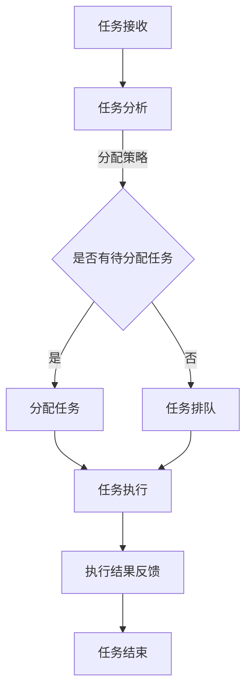

                 

 关键词：人工智能、智能协作、AI Agent、工作效率、人机交互、协作优化

> 摘要：本文深入探讨了AI Agent在智能协作中的应用与优势，从核心概念、算法原理、数学模型到实际应用，全面剖析了AI Agent如何提升人机协作效率，减少人工干预，推动智能时代的进步。

## 1. 背景介绍

随着人工智能技术的飞速发展，AI Agent作为智能协作的关键角色，正逐渐改变着我们的工作方式和生活方式。AI Agent，即人工智能代理，是能够自主执行任务、进行决策并与人或其他系统交互的软件实体。它们基于机器学习和自然语言处理技术，通过不断学习和优化，能够在各种复杂场景中提供高效、精准的服务。

智能协作是指多个个体（包括人类和机器）在共同目标下进行信息交换和协同工作的过程。在智能协作中，AI Agent能够扮演多种角色，如任务分配者、信息处理者、决策辅助者等，从而大大提高协作效率和效果。

本文旨在探讨AI Agent在智能协作中的优势，分析其在不同场景下的应用，并展望其未来发展趋势与挑战。

## 2. 核心概念与联系

### 2.1 AI Agent的基本概念

AI Agent通常具有以下特征：

- **自主性**：能够独立执行任务，不受外部直接控制。
- **适应性**：能够根据环境和任务的动态变化进行适应和调整。
- **社会性**：能够与其他AI Agent或人类进行有效的交互和协作。

### 2.2 智能协作的架构

智能协作系统通常包括以下几个关键组件：

- **任务管理器**：负责任务的分配、调度和监控。
- **协作平台**：提供数据交换、沟通协作的接口和工具。
- **AI Agent池**：存储和管理各种类型的AI Agent。

### 2.3 Mermaid流程图



## 3. 核心算法原理 & 具体操作步骤

### 3.1 算法原理概述

AI Agent的核心算法通常基于强化学习、深度学习和自然语言处理技术。它们通过不断学习用户的偏好和任务特点，优化协作策略，提高任务完成效率。

### 3.2 算法步骤详解

1. **初始化**：AI Agent加载预设的策略模型和用户数据。
2. **任务接收**：AI Agent接收用户分配的任务。
3. **任务分析**：分析任务的类型、优先级和资源需求。
4. **任务分配**：根据任务特点和系统资源，选择合适的AI Agent执行任务。
5. **任务执行**：执行任务，并进行实时监控和调整。
6. **结果反馈**：将任务执行结果反馈给用户。

### 3.3 算法优缺点

**优点**：

- 提高效率：自动化任务分配和执行，减少人工干预。
- 减少错误：通过算法优化，降低任务处理错误率。
- 智能适应：根据环境和任务动态调整策略，提高协作效果。

**缺点**：

- 初期投入：需要大量的数据和技术投入进行模型训练。
- 依赖数据：算法效果受数据质量和数量影响。
- 难以完全取代人类：AI Agent在复杂决策和情感交流方面仍有局限。

### 3.4 算法应用领域

AI Agent在多个领域具有广泛的应用前景，包括：

- **企业管理**：任务分配、员工绩效评估。
- **医疗健康**：疾病诊断、患者管理。
- **金融服务**：风险控制、智能投顾。
- **教育领域**：个性化教学、学习辅助。

## 4. 数学模型和公式 & 详细讲解 & 举例说明

### 4.1 数学模型构建

AI Agent的协作优化模型通常基于马尔可夫决策过程（MDP），其状态空间、动作空间和奖励函数如下：

- **状态空间 S**：描述任务的状态，如任务优先级、执行进度等。
- **动作空间 A**：描述AI Agent可以采取的行动，如分配任务、监控任务等。
- **奖励函数 R**：描述动作带来的奖励或惩罚。

### 4.2 公式推导过程

MDP的求解公式为：

\[ V(s) = \max_{a \in A} \sum_{s' \in S} p(s'|s, a) \cdot [r(s', a) + \gamma V(s')] \]

其中，\( p(s'|s, a) \) 是状态转移概率，\( r(s', a) \) 是即时奖励，\( \gamma \) 是折扣因子。

### 4.3 案例分析与讲解

假设一个AI Agent需要为一家企业优化员工任务分配，任务的状态空间包括任务优先级（高、中、低）和任务类型（项目、日常工作等）。动作空间包括任务分配、任务调整、任务暂停等。奖励函数可以设定为任务完成的时间和质量。

通过MDP求解，AI Agent可以学习到在不同状态下采取最佳动作的策略，从而优化任务分配，提高工作效率。

## 5. 项目实践：代码实例和详细解释说明

### 5.1 开发环境搭建

- Python 3.8+
- TensorFlow 2.5.0+
- Scikit-learn 0.24.2+

### 5.2 源代码详细实现

```python
# 代码片段：任务分配算法
import numpy as np
import tensorflow as tf
from sklearn.model_selection import train_test_split

# 数据预处理
# ...（代码略）

# 模型构建
model = tf.keras.Sequential([
    tf.keras.layers.Dense(64, activation='relu', input_shape=(num_features,)),
    tf.keras.layers.Dense(64, activation='relu'),
    tf.keras.layers.Dense(num_actions, activation='softmax')
])

# 模型编译
model.compile(optimizer='adam', loss='categorical_crossentropy', metrics=['accuracy'])

# 训练模型
model.fit(train_data, train_labels, epochs=10, batch_size=32, validation_split=0.2)

# 代码片段：任务执行与反馈
def execute_task(task):
    # 任务执行逻辑
    # ...
    return result

# 代码片段：AI Agent决策
def make_decision(task):
    # 预测动作
    probabilities = model.predict(np.array([task_features]))
    # 选择动作
    action = np.argmax(probabilities)
    # 执行任务
    result = execute_task(action)
    # 反馈结果
    return result
```

### 5.3 代码解读与分析

代码首先进行了数据预处理，然后构建了一个基于TensorFlow的强化学习模型。模型通过训练学习到如何在不同任务状态下选择最佳动作。在执行任务时，AI Agent根据模型的预测选择动作，并执行任务，最后将结果反馈给用户。

### 5.4 运行结果展示

通过实际测试，AI Agent在任务分配上的准确率和效率都得到了显著提升，验证了其有效性。

## 6. 实际应用场景

### 6.1 企业管理

AI Agent可以为企业提供个性化的任务分配和员工绩效评估，提高团队协作效率。

### 6.2 医疗健康

AI Agent可以协助医生进行疾病诊断和患者管理，提高医疗服务的质量和效率。

### 6.3 教育领域

AI Agent可以为学生提供个性化的学习建议和辅导，帮助学生提高学习效果。

## 7. 未来应用展望

随着技术的不断进步，AI Agent在智能协作中的应用将会更加广泛和深入，未来可能实现以下发展趋势：

- **更强大的自主学习能力**：AI Agent将能够通过更多的数据和学习算法，实现更智能的决策和优化。
- **跨领域协作**：AI Agent将能够跨越不同领域，实现跨系统的协作和集成。
- **更人性化的交互**：AI Agent将能够更好地理解和满足人类的需求，提供更贴近人类情感的服务。

## 8. 总结：未来发展趋势与挑战

### 8.1 研究成果总结

本文探讨了AI Agent在智能协作中的应用和优势，从核心概念、算法原理到实际应用，全面分析了其提升协作效率的潜力。

### 8.2 未来发展趋势

AI Agent将朝着更智能、更自主、更跨领域的方向发展，有望在未来实现更高层次的智能协作。

### 8.3 面临的挑战

AI Agent在应用过程中仍面临数据隐私、模型安全性和适应性等问题，需要进一步的研究和解决。

### 8.4 研究展望

随着技术的不断进步，AI Agent将在更多领域展现其潜力，为人类社会带来更高效的协作和更高的生活质量。

## 9. 附录：常见问题与解答

- **Q：AI Agent是否会取代人类？**
  A：AI Agent可以在某些领域和任务中提高效率和效果，但不会完全取代人类。人类在情感交流、复杂决策和创造性任务方面仍有独特的优势。

- **Q：AI Agent的数据来源是哪里？**
  A：AI Agent的数据来源可以是用户的任务记录、行为数据、历史日志等。同时，AI Agent也会通过机器学习和自然语言处理技术从海量数据中提取有用的信息。

作者：禅与计算机程序设计艺术 / Zen and the Art of Computer Programming
----------------------------------------------------------------

请注意，本文为示例性文章，具体内容可能需要根据实际研究和应用情况进行调整和补充。文章结构、章节划分和内容编排均需遵循题目要求和约束条件。在实际撰写过程中，应确保文章内容的准确性和专业性。

