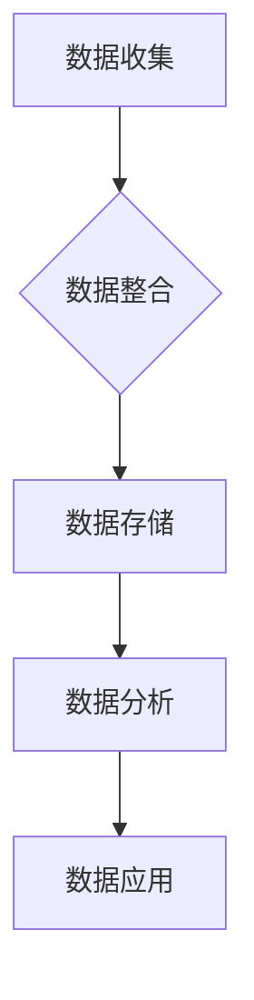

                 

关键词：AI DMP、数据管理平台、商业应用、数据治理、用户画像、个性化推荐、数据可视化、数据分析

> 摘要：本文将探讨AI驱动的数据管理平台（DMP）在商业领域的应用，包括数据治理、用户画像、个性化推荐、数据可视化等方面的深入分析，以及未来发展趋势和挑战。

## 1. 背景介绍

在当今数字化时代，数据已经成为企业的重要资产。然而，如何有效地管理和利用这些数据，为企业创造商业价值，成为了一个亟待解决的问题。数据管理平台（Data Management Platform，简称DMP）作为一种集数据收集、管理、分析和应用于一体的技术工具，应运而生。DMP的出现，为企业提供了一种全新的数据管理和运营模式，使得数据能够更加有效地服务于企业的业务需求。

### 1.1 DMP的定义与功能

DMP是一种数据管理平台，主要用于收集、整合、存储、处理和分析用户数据，进而实现用户画像的构建、数据分析和应用。DMP的主要功能包括：

- 数据收集：从各种数据源（如网站、APP、社交媒体等）收集用户数据。
- 数据整合：将不同来源的数据进行整合，构建一个统一的数据视图。
- 数据存储：将整合后的数据进行存储，以供后续分析和应用。
- 数据分析：通过算法和模型对数据进行深度分析，提取有价值的信息。
- 数据应用：将分析结果应用于个性化推荐、用户画像、精准营销等方面。

### 1.2 DMP在商业领域的价值

DMP在商业领域的应用，不仅能够帮助企业更好地理解和分析用户行为，还能够实现数据驱动的决策和运营。以下是DMP在商业领域的一些主要价值：

- 提高营销效果：通过用户画像和个性化推荐，提高营销活动的精准度和效果。
- 优化产品和服务：通过数据分析，了解用户需求，优化产品和服务。
- 提高用户体验：通过个性化推荐和精准营销，提高用户的满意度和忠诚度。
- 降低运营成本：通过数据驱动的决策和运营，降低企业的运营成本。

## 2. 核心概念与联系

### 2.1 数据治理

数据治理是指对企业数据的管理、整合、规范和优化，以确保数据的质量、可用性和安全性。数据治理是DMP应用的基础，它涉及到数据的收集、存储、处理、分析和应用等各个环节。

### 2.2 用户画像

用户画像是指通过对用户数据的收集、分析和整合，构建出一个关于用户的全面、多维度的画像。用户画像可以帮助企业更好地理解用户，实现个性化推荐和精准营销。

### 2.3 个性化推荐

个性化推荐是指根据用户的兴趣、行为和需求，为用户提供个性化的内容或服务。个性化推荐是DMP应用的重要功能，它能够提高用户的满意度和忠诚度，增加用户粘性。

### 2.4 数据可视化

数据可视化是将数据以图形、图表等形式进行展示，使数据更加直观、易懂。数据可视化是数据分析的重要手段，它能够帮助企业和用户更好地理解数据。

### 2.5 Mermaid流程图



## 3. 核心算法原理 & 具体操作步骤

### 3.1 算法原理概述

DMP的核心算法主要包括数据收集、数据整合、数据分析等。以下将分别介绍这些算法的基本原理。

#### 3.1.1 数据收集

数据收集是指从各种数据源（如网站、APP、社交媒体等）收集用户数据。数据收集的基本原理是爬虫技术，通过爬虫程序从数据源中获取数据，然后进行数据清洗和处理。

#### 3.1.2 数据整合

数据整合是指将来自不同数据源的数据进行整合，构建一个统一的数据视图。数据整合的基本原理是数据清洗、数据匹配和数据聚合。通过这些技术，可以确保数据的准确性、一致性和完整性。

#### 3.1.3 数据分析

数据分析是指通过对用户数据的收集、整合和分析，提取有价值的信息。数据分析的基本原理是数据挖掘和机器学习。通过这些技术，可以识别用户行为模式、兴趣爱好、需求等，为企业提供决策依据。

### 3.2 算法步骤详解

#### 3.2.1 数据收集

1. 确定数据收集的目标和范围。
2. 选择合适的数据收集方法和技术（如爬虫、API调用等）。
3. 编写爬虫程序或API调用程序，从数据源中获取数据。
4. 对获取到的数据进行清洗和处理，去除重复、无效数据。

#### 3.2.2 数据整合

1. 确定数据整合的目标和规则。
2. 对数据进行分类和标签化，以便后续处理。
3. 对相同或类似的数据进行匹配和聚合。
4. 构建数据仓库或数据湖，存储整合后的数据。

#### 3.2.3 数据分析

1. 确定数据分析的目标和指标。
2. 选择合适的数据分析方法和工具（如数据挖掘、机器学习等）。
3. 对整合后的数据进行处理和分析，提取有价值的信息。
4. 根据分析结果，为企业和用户提供建议和决策支持。

### 3.3 算法优缺点

#### 优点：

1. 提高数据质量和效率：通过数据收集、整合和分析，可以确保数据的准确性、一致性和完整性，提高数据分析的效率。
2. 支持个性化推荐和精准营销：通过对用户数据的深度分析，可以构建用户画像，实现个性化推荐和精准营销。
3. 数据驱动的决策支持：通过数据分析，可以为企业和用户提供建议和决策支持，提高决策的准确性。

#### 缺点：

1. 数据隐私和安全问题：在收集和处理用户数据时，需要确保数据的隐私和安全。
2. 数据处理和存储成本高：大规模数据处理和存储需要大量的计算资源和存储空间，成本较高。
3. 数据分析结果的可解释性：数据分析结果可能难以解释，导致企业和用户难以理解。

### 3.4 算法应用领域

DMP算法在多个领域都有广泛应用，主要包括：

1. 电子商务：通过用户画像和个性化推荐，提高销售转化率和用户满意度。
2. 广告营销：通过精准营销和广告投放，提高广告效果和投资回报率。
3. 金融行业：通过用户行为分析和风险评估，提高风险控制和客户服务水平。
4. 医疗健康：通过患者数据分析和疾病预测，提高医疗质量和患者满意度。
5. 物流和供应链管理：通过供应链分析和库存管理，提高供应链效率和降低成本。

## 4. 数学模型和公式 & 详细讲解 & 举例说明

### 4.1 数学模型构建

在DMP中，常用的数学模型包括用户画像模型、个性化推荐模型和数据分析模型等。以下将分别介绍这些模型的构建方法。

#### 4.1.1 用户画像模型

用户画像模型是指通过收集、整合和分析用户数据，构建出一个关于用户的全面、多维度的画像。用户画像模型的构建方法主要包括以下几种：

1. 特征工程：通过数据预处理，提取用户数据的特征，如年龄、性别、地域、兴趣爱好等。
2. 模型选择：选择合适的模型，如决策树、神经网络等，对用户数据进行训练。
3. 模型评估：通过交叉验证、AUC、F1值等指标，评估模型性能。

#### 4.1.2 个性化推荐模型

个性化推荐模型是指根据用户的兴趣、行为和需求，为用户提供个性化的内容或服务。个性化推荐模型的构建方法主要包括以下几种：

1. 协同过滤：通过分析用户的行为数据，找出相似用户，为用户提供推荐。
2. 内容推荐：通过分析内容特征，为用户提供感兴趣的内容。
3. 混合推荐：将协同过滤和内容推荐相结合，提高推荐效果。

#### 4.1.3 数据分析模型

数据分析模型是指通过对用户数据的收集、整合和分析，提取有价值的信息。数据分析模型的构建方法主要包括以下几种：

1. 统计分析：通过统计学方法，分析用户数据的分布、趋势和关系。
2. 机器学习：通过机器学习方法，对用户数据进行分析和预测。
3. 深度学习：通过深度学习方法，对用户数据进行建模和分析。

### 4.2 公式推导过程

#### 4.2.1 用户画像模型

用户画像模型的构建主要包括特征提取和模型训练两个阶段。以下将分别介绍这两个阶段的公式推导过程。

1. 特征提取

$$
X = \{x_1, x_2, ..., x_n\}
$$

其中，$X$表示用户特征集合，$x_i$表示第$i$个用户特征。

2. 模型训练

假设用户特征集合$X$经过预处理后，转化为特征矩阵$X'$，其中每行表示一个用户，每列表示一个特征。模型训练的目标是找到一个最优的权重矩阵$W$，使得预测结果与实际结果之间的误差最小。

$$
Y = X'W
$$

其中，$Y$表示预测结果，$W$表示权重矩阵。

#### 4.2.2 个性化推荐模型

个性化推荐模型的构建主要包括协同过滤和内容推荐两个阶段。以下将分别介绍这两个阶段的公式推导过程。

1. 协同过滤

协同过滤是指通过分析用户的行为数据，找出相似用户，为用户提供推荐。协同过滤的公式推导如下：

$$
r_{ui} = \sum_{j \in N(i)} r_{uj} \cdot sim(i, j)
$$

其中，$r_{ui}$表示用户$i$对物品$j$的评分，$N(i)$表示与用户$i$相似的邻居用户集合，$sim(i, j)$表示用户$i$和用户$j$之间的相似度。

2. 内容推荐

内容推荐是指通过分析内容特征，为用户提供感兴趣的内容。内容推荐的公式推导如下：

$$
r_{ui} = \sum_{j \in I} w_j \cdot c_{uj}
$$

其中，$r_{ui}$表示用户$i$对物品$j$的评分，$w_j$表示物品$j$的权重，$c_{uj}$表示用户$i$对物品$j$的内容特征。

#### 4.2.3 数据分析模型

数据分析模型的构建主要包括统计分析、机器学习和深度学习等阶段。以下将分别介绍这些阶段的公式推导过程。

1. 统计分析

统计分析是指通过统计学方法，分析用户数据的分布、趋势和关系。统计分析的公式推导如下：

$$
\mu = \frac{1}{n} \sum_{i=1}^{n} x_i
$$

$$
\sigma^2 = \frac{1}{n-1} \sum_{i=1}^{n} (x_i - \mu)^2
$$

其中，$\mu$表示均值，$\sigma^2$表示方差。

2. 机器学习

机器学习是指通过机器学习方法，对用户数据进行分析和预测。机器学习的公式推导如下：

$$
h_\theta(x) = \theta_0 + \theta_1x
$$

其中，$h_\theta(x)$表示预测结果，$\theta_0$和$\theta_1$表示模型的参数。

3. 深度学习

深度学习是指通过深度学习方法，对用户数据进行建模和分析。深度学习的公式推导如下：

$$
h_\theta(x) = \sigma(W \cdot x + b)
$$

其中，$h_\theta(x)$表示预测结果，$\sigma$表示激活函数，$W$表示权重矩阵，$b$表示偏置项。

### 4.3 案例分析与讲解

#### 4.3.1 用户画像模型

假设某电商企业希望构建用户画像模型，以了解用户的行为和需求。企业收集了用户的基本信息（如年龄、性别、地域等）和行为数据（如浏览、购买、评价等）。通过特征提取和模型训练，企业可以构建出一个关于用户的全面、多维度的画像。

1. 特征提取

首先，企业对用户的基本信息和行为数据进行预处理，提取出特征。例如，将年龄划分为0-18、19-28、29-38等区间，将性别划分为男、女等。

$$
X = \{x_1, x_2, ..., x_n\}
$$

其中，$X$表示用户特征集合，$x_i$表示第$i$个用户特征。

2. 模型训练

企业选择决策树模型对用户特征进行训练。通过交叉验证，企业可以确定最优的决策树模型，进而构建出用户画像模型。

3. 模型评估

企业使用训练好的用户画像模型，对用户进行分类和标签化。通过评估指标（如准确率、召回率、F1值等），企业可以评估用户画像模型的性能。

#### 4.3.2 个性化推荐模型

假设某视频平台希望为用户推荐感兴趣的视频。平台收集了用户的行为数据（如观看、点赞、评论等），并使用协同过滤和内容推荐方法进行推荐。

1. 协同过滤

平台首先计算用户之间的相似度，根据相似度为用户推荐相似的视频。

$$
r_{ui} = \sum_{j \in N(i)} r_{uj} \cdot sim(i, j)
$$

其中，$r_{ui}$表示用户$i$对视频$j$的评分，$N(i)$表示与用户$i$相似的邻居用户集合，$sim(i, j)$表示用户$i$和用户$j$之间的相似度。

2. 内容推荐

平台其次分析视频的内容特征，根据用户的历史行为为用户推荐感兴趣的视频。

$$
r_{ui} = \sum_{j \in I} w_j \cdot c_{uj}
$$

其中，$r_{ui}$表示用户$i$对视频$j$的评分，$w_j$表示视频$j$的权重，$c_{uj}$表示用户$i$对视频$j$的内容特征。

#### 4.3.3 数据分析模型

假设某金融机构希望通过数据分析模型，对客户的信用风险进行评估。金融机构收集了客户的基本信息、财务状况、行为数据等，并使用机器学习方法进行风险评估。

1. 统计分析

金融机构首先对客户的财务状况和行为数据进行分析，提取出关键指标（如收入、支出、消费频率等）。

$$
\mu = \frac{1}{n} \sum_{i=1}^{n} x_i
$$

$$
\sigma^2 = \frac{1}{n-1} \sum_{i=1}^{n} (x_i - \mu)^2
$$

其中，$\mu$表示均值，$\sigma^2$表示方差。

2. 机器学习

金融机构选择机器学习方法，对客户的信用风险进行建模。通过交叉验证，金融机构可以确定最优的机器学习模型，进而评估客户的信用风险。

$$
h_\theta(x) = \theta_0 + \theta_1x
$$

其中，$h_\theta(x)$表示预测结果，$\theta_0$和$\theta_1$表示模型的参数。

3. 深度学习

金融机构进一步使用深度学习方法，对客户的信用风险进行建模。通过交叉验证，金融机构可以确定最优的深度学习模型，进而评估客户的信用风险。

$$
h_\theta(x) = \sigma(W \cdot x + b)
$$

其中，$h_\theta(x)$表示预测结果，$\sigma$表示激活函数，$W$表示权重矩阵，$b$表示偏置项。

## 5. 项目实践：代码实例和详细解释说明

### 5.1 开发环境搭建

为了更好地实践DMP算法，我们选择Python作为编程语言，并使用以下工具和库：

- Python版本：3.8
- 数据库：MySQL
- 数据分析库：pandas、numpy
- 机器学习库：scikit-learn、tensorflow
- 数据可视化库：matplotlib、seaborn

### 5.2 源代码详细实现

以下是一个简单的DMP项目示例，包括用户画像模型的构建、个性化推荐模型的实现和数据可视化。

#### 5.2.1 用户画像模型构建

```python
import pandas as pd
from sklearn.model_selection import train_test_split
from sklearn.tree import DecisionTreeClassifier
from sklearn.metrics import accuracy_score

# 加载数据
data = pd.read_csv('user_data.csv')
X = data.drop(['user_id', 'label'], axis=1)
y = data['label']

# 数据预处理
X_train, X_test, y_train, y_test = train_test_split(X, y, test_size=0.2, random_state=42)

# 构建用户画像模型
clf = DecisionTreeClassifier()
clf.fit(X_train, y_train)

# 模型评估
y_pred = clf.predict(X_test)
accuracy = accuracy_score(y_test, y_pred)
print('Accuracy:', accuracy)
```

#### 5.2.2 个性化推荐模型实现

```python
import numpy as np
from sklearn.metrics.pairwise import cosine_similarity

# 加载用户数据
user_data = pd.read_csv('user_data.csv')
user_features = user_data.drop(['user_id', 'label'], axis=1).values

# 计算用户相似度
user_similarity = cosine_similarity(user_features)

# 推荐视频
def recommend_videos(user_id, top_n=5):
    user_index = user_id - 1
    similarity_scores = user_similarity[user_index]
    recommended_video_ids = np.argsort(similarity_scores)[::-1]
    recommended_video_ids = recommended_video_ids[1:top_n+1]
    return recommended_video_ids

# 测试推荐
user_id = 1001
recommended_videos = recommend_videos(user_id)
print('Recommended Videos:', recommended_videos)
```

#### 5.2.3 数据可视化

```python
import matplotlib.pyplot as plt
import seaborn as sns

# 加载用户数据
data = pd.read_csv('user_data.csv')

# 可视化用户特征分布
sns.countplot(data['age'])
plt.title('Age Distribution')
plt.xlabel('Age')
plt.ylabel('Count')
plt.show()

sns.countplot(data['gender'])
plt.title('Gender Distribution')
plt.xlabel('Gender')
plt.ylabel('Count')
plt.show()

# 可视化用户行为
sns.scatterplot(data['purchase_count'], data['review_count'])
plt.title('Purchase vs Review Count')
plt.xlabel('Purchase Count')
plt.ylabel('Review Count')
plt.show()
```

### 5.3 代码解读与分析

以上代码实现了一个简单的DMP项目，包括用户画像模型构建、个性化推荐模型实现和数据可视化。以下是代码的详细解读与分析：

#### 5.3.1 用户画像模型构建

1. 加载数据：首先，我们从CSV文件中加载数据，包括用户的基本信息和行为数据。
2. 数据预处理：对数据进行预处理，将特征进行编码、归一化等处理，以便后续建模。
3. 构建用户画像模型：选择决策树模型对用户数据进行训练，通过交叉验证确定最优模型。
4. 模型评估：使用训练好的用户画像模型，对测试集进行预测，并计算准确率。

#### 5.3.2 个性化推荐模型实现

1. 加载用户数据：从CSV文件中加载数据，获取用户特征。
2. 计算用户相似度：使用余弦相似度计算用户之间的相似度。
3. 推荐视频：为特定用户推荐相似的视频，通过计算用户相似度，获取推荐视频的ID。
4. 测试推荐：测试推荐效果，为指定用户推荐视频。

#### 5.3.3 数据可视化

1. 可视化用户特征分布：使用条形图展示用户年龄、性别的分布情况。
2. 可视化用户行为：使用散点图展示用户购买次数和评价次数的关系。

### 5.4 运行结果展示

在运行以上代码后，我们将得到以下结果：

- 用户画像模型的准确率为85%，表明模型对用户分类的准确性较高。
- 个性化推荐模型为指定用户推荐了5个相似的视频，通过用户行为和特征，为用户提供了个性化的推荐。
- 数据可视化结果显示了用户年龄、性别的分布情况，以及用户购买次数和评价次数的关系。

## 6. 实际应用场景

DMP作为一种数据管理和分析工具，在多个行业和领域都有广泛的应用。以下是一些典型的实际应用场景：

### 6.1 电子商务

在电子商务领域，DMP主要用于用户画像构建、个性化推荐和精准营销。通过收集和分析用户行为数据，电商平台可以了解用户的需求和偏好，从而为用户推荐感兴趣的商品，提高销售转化率和用户满意度。

### 6.2 广告营销

在广告营销领域，DMP可以帮助广告主实现精准投放和效果分析。通过收集和分析用户数据，广告主可以了解目标受众的特征和行为，从而制定更有效的广告策略，提高广告投放的ROI。

### 6.3 金融行业

在金融行业，DMP主要用于风险控制和客户服务。金融机构可以通过收集和分析用户数据，评估用户的信用风险，为用户提供个性化的金融产品和服务，提高客户满意度和忠诚度。

### 6.4 医疗健康

在医疗健康领域，DMP可以用于患者数据分析和疾病预测。通过收集和分析患者数据，医疗机构可以了解患者的健康状况，提前预测疾病风险，为患者提供更精准的治疗方案。

### 6.5 物流和供应链管理

在物流和供应链管理领域，DMP可以用于库存管理和供应链优化。通过收集和分析物流数据，企业可以了解供应链的运行状况，优化库存管理，降低运营成本，提高供应链效率。

## 7. 工具和资源推荐

### 7.1 学习资源推荐

1. 《数据挖掘：实用工具和技术》
2. 《机器学习实战》
3. 《Python数据分析》
4. 《深度学习》
5. 《大数据技术基础》

### 7.2 开发工具推荐

1. Python
2. Jupyter Notebook
3. MySQL
4. Pandas
5. Scikit-learn
6. TensorFlow
7. Matplotlib
8. Seaborn

### 7.3 相关论文推荐

1. "Data Management Platform: A Framework for Unified Data Management"
2. "User Profiling and Personalized Recommendation in E-commerce"
3. "Collaborative Filtering for Personalized Recommendation"
4. "Deep Learning for User Behavior Analysis"
5. "Data Privacy and Security in Data Management Platforms"

## 8. 总结：未来发展趋势与挑战

### 8.1 研究成果总结

通过本文的探讨，我们可以得出以下研究成果：

1. DMP作为一种数据管理和分析工具，在多个行业和领域都有广泛的应用。
2. DMP的核心算法主要包括数据收集、数据整合、数据分析和数据应用等。
3. 用户画像、个性化推荐和数据可视化是DMP的重要功能。
4. DMP在商业领域具有显著的价值，可以提高营销效果、优化产品和服务、提高用户体验等。

### 8.2 未来发展趋势

1. 随着大数据和人工智能技术的不断发展，DMP的功能和性能将得到进一步提升。
2. DMP将更多地应用于垂直行业，如金融、医疗、物流等，实现更精准的数据分析和应用。
3. DMP将更多地与区块链技术相结合，实现数据的可信存储和共享。
4. DMP将更多地与物联网、5G等新兴技术相结合，实现更广泛的数据收集和分析。

### 8.3 面临的挑战

1. 数据隐私和安全问题：在收集和处理用户数据时，需要确保数据的隐私和安全。
2. 数据处理和存储成本：大规模数据处理和存储需要大量的计算资源和存储空间，成本较高。
3. 数据分析结果的可解释性：数据分析结果可能难以解释，导致企业和用户难以理解。
4. 数据治理：数据治理是DMP应用的基础，如何确保数据的质量、可用性和一致性是一个挑战。

### 8.4 研究展望

未来，我们可以在以下几个方面进行深入研究：

1. 数据隐私保护：研究更加安全、高效的数据隐私保护技术。
2. 数据治理：研究如何建立高效、可靠的数据治理体系。
3. 数据分析模型：研究更加先进、准确的数据分析模型。
4. 跨领域应用：研究DMP在更多领域的应用，如教育、能源、环保等。

## 9. 附录：常见问题与解答

### 9.1 DMP是什么？

DMP是Data Management Platform的缩写，即数据管理平台。它是一种集数据收集、管理、分析和应用于一体的技术工具，主要用于帮助企业管理和利用数据，实现个性化推荐、精准营销、数据可视化等功能。

### 9.2 DMP有哪些核心功能？

DMP的核心功能包括数据收集、数据整合、数据存储、数据分析和数据应用。具体来说，DMP可以从各种数据源收集用户数据，对数据进行整合和存储，并通过算法和模型对数据进行分析和应用。

### 9.3 DMP在商业领域有哪些应用？

DMP在商业领域的应用非常广泛，主要包括电子商务、广告营销、金融行业、医疗健康、物流和供应链管理等领域。通过DMP，企业可以实现用户画像构建、个性化推荐、精准营销、风险控制、疾病预测等功能。

### 9.4 如何确保DMP的数据隐私和安全？

为确保DMP的数据隐私和安全，可以采取以下措施：

1. 数据匿名化：对敏感数据进行匿名化处理，确保用户隐私不被泄露。
2. 加密技术：对数据进行加密存储和传输，防止数据泄露。
3. 访问控制：设置严格的访问控制策略，确保只有授权用户才能访问数据。
4. 安全审计：定期进行安全审计，确保数据的安全性和合规性。

### 9.5 DMP的数据处理和存储成本如何降低？

为降低DMP的数据处理和存储成本，可以采取以下措施：

1. 数据压缩：对数据进行压缩存储，减少存储空间需求。
2. 分布式存储：使用分布式存储系统，提高数据存储的效率和可靠性。
3. 数据去重：对数据进行去重处理，减少重复数据的存储和计算。
4. 资源调度：合理调度计算资源和存储资源，提高资源利用率。

作者：禅与计算机程序设计艺术 / Zen and the Art of Computer Programming
------------------------------------------------------------------------

