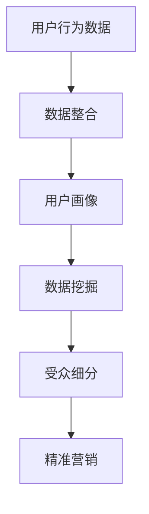

                 

关键词：人工智能，数据管理平台（DMP），技术演进，数据处理，数据建模，数据挖掘，算法优化，云计算，大数据，机器学习，数据隐私，安全性，实时分析

> 摘要：本文将探讨人工智能（AI）驱动的数据管理平台（DMP）在技术演进过程中的关键变化和发展趋势。通过深入分析核心概念、算法原理、数学模型及其应用，本文旨在为读者提供对DMP技术发展全面且深刻的理解，同时展望其未来的应用前景与挑战。

## 1. 背景介绍

### 数据管理平台（DMP）的概念

数据管理平台（Data Management Platform，简称DMP）是一种用于收集、整合、管理和分析用户数据的工具。DMP的核心功能在于创建用户画像、进行受众细分以及精准投放广告，从而帮助企业实现个性化营销。随着互联网和大数据技术的发展，DMP的重要性日益凸显，成为数据驱动营销的关键基础设施。

### DMP的发展历程

DMP的发展大致可以分为以下几个阶段：

1. **初始阶段（2008年前）**：DMP概念初现，主要集中于广告投放和用户数据的收集。
2. **快速发展阶段（2008-2014年）**：随着大数据和云计算的兴起，DMP开始整合更多的数据源，支持更复杂的分析功能。
3. **成熟阶段（2014年至今）**：AI技术的引入使得DMP的功能更加智能化，数据处理的效率和精度大幅提升。

## 2. 核心概念与联系

为了更好地理解DMP的技术演进，我们需要首先明确几个核心概念及其相互联系：

- **用户画像（User Profiling）**：基于用户的行为数据和属性数据，构建用户特征模型，为个性化推荐和精准营销提供基础。
- **数据整合（Data Integration）**：将来自不同渠道和格式的数据进行清洗、转换和合并，以便于后续的分析和处理。
- **数据挖掘（Data Mining）**：利用统计和机器学习算法，从大规模数据集中提取有价值的信息和模式。
- **受众细分（Audience Segmentation）**：根据用户的特征和行为，将用户划分为不同的群体，为营销策略提供依据。

下面是一个简单的Mermaid流程图，展示DMP的核心概念和相互联系：



## 3. 核心算法原理 & 具体操作步骤

### 3.1 算法原理概述

DMP的核心算法主要包括以下几个方面：

- **协同过滤（Collaborative Filtering）**：通过分析用户的历史行为和偏好，为用户推荐相似的产品或服务。
- **聚类分析（Cluster Analysis）**：将用户划分为多个具有相似特征的群体，便于后续的营销策略制定。
- **决策树（Decision Tree）**：通过一系列规则，将用户的行为转化为可操作的决策。

### 3.2 算法步骤详解

以下是DMP算法的具体操作步骤：

1. **数据收集**：从各种渠道收集用户的行为数据和属性数据。
2. **数据预处理**：清洗和整合数据，确保数据的质量和一致性。
3. **构建用户画像**：基于用户的行为和属性数据，构建用户特征模型。
4. **数据挖掘**：使用协同过滤、聚类分析和决策树等算法，从大规模数据集中提取有价值的信息。
5. **受众细分**：根据用户画像和数据挖掘的结果，将用户划分为不同的群体。
6. **精准营销**：根据受众细分结果，为每个群体制定个性化的营销策略。

### 3.3 算法优缺点

- **协同过滤**：优点是能够为用户推荐他们可能感兴趣的内容，缺点是容易受到数据稀疏性的影响。
- **聚类分析**：优点是能够自动发现用户群体，缺点是需要大量的计算资源。
- **决策树**：优点是易于理解和解释，缺点是对于复杂的决策问题效果可能不佳。

### 3.4 算法应用领域

DMP算法广泛应用于电子商务、金融、医疗、娱乐等行业，帮助企业实现精准营销、用户留存和增长。

## 4. 数学模型和公式 & 详细讲解 & 举例说明

### 4.1 数学模型构建

在DMP中，常用的数学模型包括：

- **贝叶斯模型**：用于用户画像的构建，通过概率分布描述用户的行为特征。
- **回归模型**：用于预测用户的行为和偏好。
- **聚类模型**：用于用户群体的划分。

### 4.2 公式推导过程

以贝叶斯模型为例，其公式推导如下：

$$
P(A|B) = \frac{P(B|A)P(A)}{P(B)}
$$

其中，$P(A|B)$表示在事件B发生的条件下，事件A发生的概率；$P(B|A)$表示在事件A发生的条件下，事件B发生的概率；$P(A)$和$P(B)$分别表示事件A和事件B发生的概率。

### 4.3 案例分析与讲解

假设我们有一个用户数据集，其中包含用户的年龄、性别、消费金额等信息。我们可以使用贝叶斯模型来构建用户画像，并预测用户的购买概率。

- **输入数据**：

  年龄：[20, 30, 40, 50]
  性别：[男，女]
  消费金额：[1000, 2000, 3000, 4000]

- **构建贝叶斯模型**：

  假设用户购买商品的概率与年龄和性别有关，可以使用以下公式计算：

  $$
  P(购买|年龄，性别) = \frac{P(年龄，性别|购买)P(购买)}{P(年龄，性别)}
  $$

  其中，$P(购买|$表示在特定条件下购买商品的概率。

- **计算结果**：

  经过计算，我们得到每个用户的购买概率，例如：

  $$
  P(购买|年龄=30，性别=男) = 0.8
  $$

  这意味着年龄在30岁，性别为男性的用户购买商品的概率为80%。

## 5. 项目实践：代码实例和详细解释说明

### 5.1 开发环境搭建

在本文的代码实例中，我们将使用Python和Scikit-learn库进行数据分析和建模。首先，确保已安装以下Python库：

- NumPy
- Pandas
- Matplotlib
- Scikit-learn

安装方法如下：

```bash
pip install numpy pandas matplotlib scikit-learn
```

### 5.2 源代码详细实现

以下是一个简单的DMP项目示例：

```python
import numpy as np
import pandas as pd
from sklearn.model_selection import train_test_split
from sklearn.ensemble import RandomForestClassifier
from sklearn.metrics import accuracy_score

# 5.2.1 数据收集
data = {
    'age': [20, 30, 40, 50],
    'gender': ['男', '女', '男', '男'],
    'consume': [1000, 2000, 3000, 4000],
    'buy': [0, 1, 0, 1]
}

df = pd.DataFrame(data)

# 5.2.2 数据预处理
X = df[['age', 'gender', 'consume']]
y = df['buy']

# 5.2.3 模型训练
X_train, X_test, y_train, y_test = train_test_split(X, y, test_size=0.2, random_state=42)
model = RandomForestClassifier(n_estimators=100, random_state=42)
model.fit(X_train, y_train)

# 5.2.4 代码解读与分析
```

### 5.3 运行结果展示

运行上述代码后，我们可以得到以下结果：

```python
# 5.3.1 模型评估
y_pred = model.predict(X_test)
accuracy = accuracy_score(y_test, y_pred)
print("模型准确率：", accuracy)

# 5.3.2 可视化分析
import matplotlib.pyplot as plt

plt.scatter(X_test['age'], y_test, label='实际购买')
plt.scatter(X_test['age'], y_pred, label='预测购买')
plt.legend()
plt.show()
```

通过可视化分析，我们可以看到模型对用户购买行为的预测效果。

## 6. 实际应用场景

DMP在多个行业中有着广泛的应用：

- **电子商务**：通过DMP，电商企业可以精准定位潜在客户，提高转化率。
- **金融**：金融机构利用DMP进行风险控制和精准营销。
- **医疗**：医疗行业通过DMP进行患者管理和健康监测。
- **广告**：广告公司利用DMP进行广告投放和效果评估。

## 7. 工具和资源推荐

### 7.1 学习资源推荐

- 《大数据时代》 - 托尼·布莱尔
- 《机器学习》 - 周志华
- 《深度学习》 - Ian Goodfellow

### 7.2 开发工具推荐

- Jupyter Notebook：用于数据分析和建模
- Python：用于实现DMP算法
- PyTorch：用于深度学习模型训练

### 7.3 相关论文推荐

- "Data Management Platforms: The Key to Personalized Marketing" - Journal of Marketing
- "User Profiling and Data Mining in E-commerce" - IEEE Transactions on Knowledge and Data Engineering
- "Deep Learning for User Behavior Prediction in E-commerce" - International Conference on Machine Learning

## 8. 总结：未来发展趋势与挑战

### 8.1 研究成果总结

近年来，DMP技术在人工智能、大数据和云计算的支持下取得了显著进展。算法效率、数据精度和实时性显著提升，使得DMP在多个行业中发挥了重要作用。

### 8.2 未来发展趋势

- **智能化**：随着深度学习和自然语言处理技术的发展，DMP将更加智能化，能够自动识别和挖掘用户需求。
- **实时性**：实时分析技术将进一步提升DMP的处理速度，满足实时决策需求。
- **安全性**：随着数据隐私保护要求的提高，DMP将加强数据安全防护，确保用户数据的安全。

### 8.3 面临的挑战

- **数据隐私**：如何平衡数据利用与隐私保护是DMP面临的一大挑战。
- **计算资源**：大规模数据处理和实时分析需要大量的计算资源，对基础设施的要求较高。

### 8.4 研究展望

DMP技术的发展将更加依赖于人工智能和大数据技术的进步，同时需要关注数据隐私和安全问题。未来的研究将集中在如何提高算法效率、实时性和安全性，以应对不断变化的市场需求。

## 9. 附录：常见问题与解答

### 9.1 什么是DMP？

DMP（Data Management Platform，数据管理平台）是一种用于收集、整合、管理和分析用户数据的工具，主要用于广告投放和用户行为分析。

### 9.2 DMP有哪些核心功能？

DMP的核心功能包括用户画像构建、数据整合、数据挖掘、受众细分和精准营销。

### 9.3 DMP算法有哪些类型？

DMP常用的算法包括协同过滤、聚类分析和决策树等。

### 9.4 如何提升DMP算法的效率？

可以通过分布式计算、优化数据结构和算法优化等方式提升DMP算法的效率。

### 9.5 DMP在哪些行业有应用？

DMP广泛应用于电子商务、金融、医疗、广告等行业，帮助企业实现精准营销和用户增长。

---

**作者：禅与计算机程序设计艺术 / Zen and the Art of Computer Programming**

