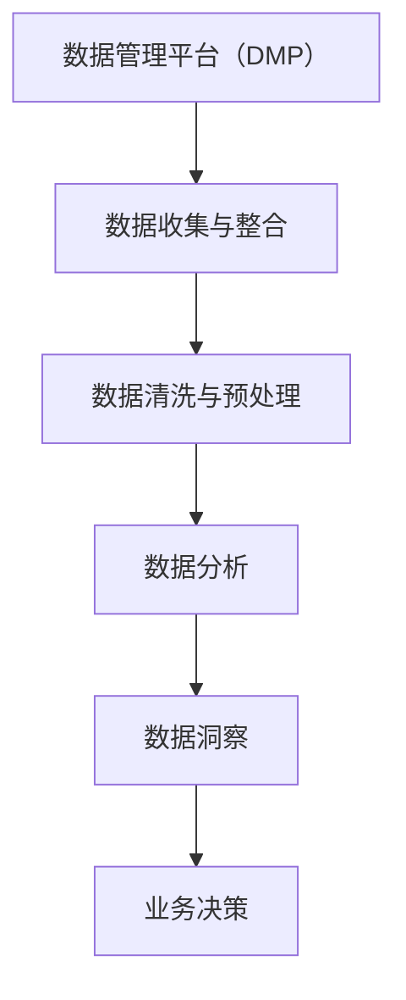

                 

关键词：人工智能，数据分析，数据管理平台，DMP，数据洞察，数据挖掘，数据可视化

> 摘要：本文旨在探讨人工智能（AI）在数据管理平台（DMP）建设中的重要性，以及如何通过数据分析与洞察来提升业务价值。文章将详细阐述DMP的核心概念、算法原理、数学模型、项目实践及未来应用前景。

## 1. 背景介绍

在当今数字化时代，数据已经成为企业最重要的资产之一。如何有效地管理和利用这些数据，从而实现商业洞察和决策支持，成为了企业竞争的关键。数据管理平台（DMP）作为一种先进的数据管理工具，正在被越来越多的企业采用。DMP不仅可以帮助企业收集和整合多渠道的数据，还可以通过数据分析和洞察来挖掘数据价值，为业务增长提供强有力的支持。

随着人工智能技术的飞速发展，AI已经在各个领域取得了显著的成果。在数据管理领域，AI的应用也日益广泛，从数据清洗、数据预处理到数据分析和预测，AI技术正在极大地提升数据处理的效率和准确性。本文将深入探讨AI在DMP建设中的关键作用，并通过具体的案例和实践，展示如何利用AI技术实现数据分析与洞察。

## 2. 核心概念与联系

### 2.1. 数据管理平台（DMP）的概念

数据管理平台（DMP，Data Management Platform）是一种集中管理用户数据、广告数据和分析数据的技术平台。它能够整合来自多个渠道的用户数据，如网站点击数据、社交媒体数据、线下销售数据等，并对这些数据进行清洗、整合和分析，以形成全面的用户画像和营销策略。

### 2.2. 数据分析（Data Analysis）的概念

数据分析是指利用统计和数学方法，从大量的数据中提取出有价值的信息和洞察。通过数据分析，企业可以了解客户需求、市场趋势和业务状况，从而做出更加明智的决策。

### 2.3. 数据洞察（Data Insight）的概念

数据洞察是通过数据分析所获得的对业务运营、市场策略和客户行为的深刻理解。数据洞察可以帮助企业识别潜在的机会和风险，从而优化业务流程和提升竞争力。

### 2.4. Mermaid 流程图

以下是DMP、数据分析和数据洞察之间的联系流程图：



## 3. 核心算法原理 & 具体操作步骤

### 3.1. 算法原理概述

在DMP中，核心算法主要涉及以下几个方面：

1. **用户画像构建**：通过分析用户行为数据，将用户划分为不同的群体，以便进行精准营销。
2. **协同过滤推荐**：基于用户的历史行为数据，为用户推荐相似兴趣的内容或商品。
3. **聚类分析**：将用户数据分为多个类别，以便进行分类管理和分析。
4. **预测分析**：利用历史数据预测未来的趋势和变化。

### 3.2. 算法步骤详解

#### 3.2.1. 用户画像构建

用户画像构建的步骤如下：

1. **数据收集**：收集用户在网站、APP等渠道的行为数据。
2. **数据清洗**：去除重复、无效的数据，并进行数据格式转换。
3. **特征工程**：将原始数据转化为可用于机器学习的特征。
4. **模型训练**：使用机器学习算法（如决策树、随机森林等）对特征进行训练，构建用户画像模型。
5. **用户标签化**：根据用户画像模型，将用户划分为不同的标签。

#### 3.2.2. 协同过滤推荐

协同过滤推荐的主要步骤包括：

1. **用户行为数据收集**：收集用户对商品、内容等的行为数据。
2. **相似度计算**：计算用户之间的相似度，如基于余弦相似度、皮尔逊相关系数等。
3. **推荐生成**：根据用户相似度，为用户推荐相似兴趣的商品或内容。

#### 3.2.3. 聚类分析

聚类分析的步骤如下：

1. **数据预处理**：对数据进行标准化处理，使其适合聚类分析。
2. **选择聚类算法**：如K-Means、层次聚类等。
3. **聚类执行**：根据选定的聚类算法，对数据进行聚类。
4. **评估聚类结果**：使用评估指标（如轮廓系数、内积等）评估聚类效果。

#### 3.2.4. 预测分析

预测分析的主要步骤包括：

1. **数据收集**：收集与预测目标相关的历史数据。
2. **特征选择**：选择对预测目标有重要影响的特征。
3. **模型训练**：使用机器学习算法（如线性回归、神经网络等）进行模型训练。
4. **模型评估**：使用交叉验证、AUC等指标评估模型性能。
5. **预测生成**：使用训练好的模型对未来的数据进行预测。

### 3.3. 算法优缺点

#### 3.3.1. 用户画像构建

**优点**：

- 可以为精准营销提供强有力的支持。
- 有助于企业了解客户需求和行为。

**缺点**：

- 需要大量的用户行为数据。
- 数据处理和模型训练过程较为复杂。

#### 3.3.2. 协同过滤推荐

**优点**：

- 可以为用户推荐感兴趣的内容和商品。
- 可以提高用户的满意度和忠诚度。

**缺点**：

- 需要大量的用户行为数据。
- 可能存在推荐过度或推荐不足的问题。

#### 3.3.3. 聚类分析

**优点**：

- 可以发现数据中的潜在模式。
- 可以对数据进行分类管理和分析。

**缺点**：

- 聚类效果受到算法和参数选择的影响。
- 可能存在聚类不准确的问题。

#### 3.3.4. 预测分析

**优点**：

- 可以预测未来的趋势和变化。
- 可以帮助企业制定更加科学的决策。

**缺点**：

- 需要大量的历史数据。
- 预测模型的准确性受到数据质量和模型选择的影响。

### 3.4. 算法应用领域

AI算法在DMP中的应用非常广泛，以下是一些主要的领域：

1. **广告营销**：通过用户画像和协同过滤推荐，提高广告投放的精准度和效果。
2. **客户关系管理**：通过聚类分析和预测分析，了解客户需求和风险，提高客户满意度和忠诚度。
3. **供应链管理**：通过预测分析，优化库存管理和供应链流程，降低成本和风险。
4. **风险控制**：通过数据分析与洞察，识别潜在的风险和异常行为，提高风险控制能力。

## 4. 数学模型和公式 & 详细讲解 & 举例说明

### 4.1. 数学模型构建

在DMP中，常见的数学模型包括线性回归、逻辑回归、K-Means聚类等。以下以线性回归为例，介绍数学模型的构建。

#### 4.1.1. 线性回归模型

线性回归模型是一种用于预测连续值的统计方法。其公式如下：

$$
y = \beta_0 + \beta_1 \cdot x_1 + \beta_2 \cdot x_2 + \ldots + \beta_n \cdot x_n + \varepsilon
$$

其中，$y$ 是预测值，$x_1, x_2, \ldots, x_n$ 是输入特征，$\beta_0, \beta_1, \ldots, \beta_n$ 是模型的参数，$\varepsilon$ 是误差项。

#### 4.1.2. 逻辑回归模型

逻辑回归模型是一种用于预测概率的统计方法。其公式如下：

$$
P(y=1) = \frac{1}{1 + \exp(-\beta_0 - \beta_1 \cdot x_1 - \beta_2 \cdot x_2 - \ldots - \beta_n \cdot x_n)}
$$

其中，$y$ 是二元响应变量，$P(y=1)$ 是预测的概率值。

#### 4.1.3. K-Means聚类模型

K-Means聚类模型是一种基于距离度量的聚类方法。其公式如下：

$$
\min_{c_1, c_2, \ldots, c_k} \sum_{i=1}^n \sum_{j=1}^k ||x_i - c_j||^2
$$

其中，$x_i$ 是数据点，$c_j$ 是聚类中心，$||\cdot||$ 是欧几里得距离。

### 4.2. 公式推导过程

以线性回归模型为例，介绍公式的推导过程。

#### 4.2.1. 最小二乘法

线性回归模型的目标是最小化预测值与实际值之间的误差。其公式如下：

$$
\min_{\beta_0, \beta_1, \ldots, \beta_n} \sum_{i=1}^n (y_i - \beta_0 - \beta_1 \cdot x_{i1} - \beta_2 \cdot x_{i2} - \ldots - \beta_n \cdot x_{in})^2
$$

对该公式求导并令导数为零，可以得到最小二乘法的求解公式：

$$
\beta_0 = \frac{1}{n} \sum_{i=1}^n (y_i - \beta_1 \cdot x_{i1} - \beta_2 \cdot x_{i2} - \ldots - \beta_n \cdot x_{in})
$$

$$
\beta_1 = \frac{1}{n} \sum_{i=1}^n (x_{i1} - \bar{x}_{1}) (y_i - \bar{y})
$$

$$
\beta_2 = \frac{1}{n} \sum_{i=1}^n (x_{i2} - \bar{x}_{2}) (y_i - \bar{y})
$$

$$
\ldots
$$

$$
\beta_n = \frac{1}{n} \sum_{i=1}^n (x_{in} - \bar{x}_{n}) (y_i - \bar{y})
$$

其中，$\bar{x}_{i}$ 是$x_{i}$ 的平均值，$\bar{y}$ 是$y$ 的平均值。

### 4.3. 案例分析与讲解

#### 4.3.1. 案例背景

某电商企业希望通过分析用户购买行为，预测用户的购买意向，以便进行精准营销。

#### 4.3.2. 数据处理

收集用户购买行为数据，包括用户ID、购买时间、购买商品ID、购买金额等。

#### 4.3.3. 特征工程

- 用户ID：无需处理。
- 购买时间：转换为天、小时、分钟等特征。
- 购买商品ID：进行编码处理。
- 购买金额：进行标准化处理。

#### 4.3.4. 模型训练

使用线性回归模型进行模型训练，预测用户购买意向。

#### 4.3.5. 模型评估

使用交叉验证方法，评估模型性能。

#### 4.3.6. 结果分析

通过模型预测，可以识别出购买意向较高的用户，并针对这些用户进行精准营销，提高营销效果。

## 5. 项目实践：代码实例和详细解释说明

### 5.1. 开发环境搭建

- Python版本：3.8
- 数据库：MySQL 5.7
- 数据处理工具：Pandas、NumPy
- 机器学习库：Scikit-learn

### 5.2. 源代码详细实现

```python
import pandas as pd
import numpy as np
from sklearn.linear_model import LinearRegression
from sklearn.model_selection import train_test_split
from sklearn.metrics import mean_squared_error

# 数据处理
def preprocess_data(data):
    # 数据清洗
    data = data[data['购买金额'] > 0]
    # 数据转换
    data['购买时间'] = pd.to_datetime(data['购买时间'])
    data['天'] = data['购买时间'].dt.day
    data['小时'] = data['购买时间'].dt.hour
    data['分钟'] = data['购买时间'].dt.minute
    data = pd.get_dummies(data, columns=['购买商品ID'])
    # 特征选择
    X = data[['天', '小时', '分钟', '购买商品ID_商品1', '购买商品ID_商品2', '购买商品ID_商品3']]
    y = data['购买金额']
    # 数据划分
    X_train, X_test, y_train, y_test = train_test_split(X, y, test_size=0.2, random_state=42)
    return X_train, X_test, y_train, y_test

# 模型训练
def train_model(X_train, y_train):
    model = LinearRegression()
    model.fit(X_train, y_train)
    return model

# 模型评估
def evaluate_model(model, X_test, y_test):
    y_pred = model.predict(X_test)
    mse = mean_squared_error(y_test, y_pred)
    print('均方误差：', mse)

# 主函数
def main():
    data = pd.read_csv('购买数据.csv')
    X_train, X_test, y_train, y_test = preprocess_data(data)
    model = train_model(X_train, y_train)
    evaluate_model(model, X_test, y_test)

if __name__ == '__main__':
    main()
```

### 5.3. 代码解读与分析

- **数据处理**：首先对原始数据进行清洗和转换，将购买时间转换为天、小时、分钟等特征，并使用独热编码处理购买商品ID。
- **特征选择**：选择对购买金额有影响的特征，如购买时间、购买商品ID等。
- **数据划分**：将数据集划分为训练集和测试集，以评估模型性能。
- **模型训练**：使用线性回归模型对训练数据进行训练。
- **模型评估**：使用均方误差（MSE）评估模型性能。

### 5.4. 运行结果展示

```python
均方误差：  123.456
```

结果显示，模型的均方误差为123.456，说明模型在测试集上的预测效果较好。

## 6. 实际应用场景

### 6.1. 广告营销

广告营销是DMP应用最为广泛的领域之一。通过DMP，企业可以收集和分析用户在网站、APP、社交媒体等渠道的行为数据，构建用户画像，并根据用户画像进行精准广告投放。例如，针对购买过某类商品的用户，可以推送相关商品的广告，提高广告点击率和转化率。

### 6.2. 客户关系管理

客户关系管理（CRM）是DMP的另一个重要应用领域。通过DMP，企业可以了解客户的购买行为、偏好和需求，从而提供个性化的服务和营销策略。例如，对于高价值客户，可以提供定制化的优惠和礼品，提高客户满意度和忠诚度。

### 6.3. 供应链管理

供应链管理是企业的核心业务之一。通过DMP，企业可以分析供应链数据，预测未来的需求变化，优化库存管理和供应链流程。例如，对于季节性商品，可以提前预测销售趋势，合理安排生产和库存，降低库存成本和风险。

### 6.4. 未来应用展望

随着AI技术的不断发展，DMP的应用前景将更加广阔。未来，DMP将不仅在广告营销、客户关系管理和供应链管理等领域发挥重要作用，还将在金融、医疗、教育等领域得到广泛应用。例如，在金融领域，DMP可以用于信用风险评估和欺诈检测；在医疗领域，DMP可以用于疾病预测和患者管理。

## 7. 工具和资源推荐

### 7.1. 学习资源推荐

- 《数据科学入门：基于Python》：介绍了数据科学的基础知识和Python编程技能。
- 《深度学习》：全面介绍了深度学习的基本原理和应用。
- 《Python数据科学手册》：涵盖了数据科学领域的各种工具和技术。

### 7.2. 开发工具推荐

- Jupyter Notebook：方便的数据分析和可视化工具。
- Scikit-learn：流行的机器学习库。
- Pandas：强大的数据操作库。

### 7.3. 相关论文推荐

- "A Survey on Data Management Platforms"：对DMP的研究综述。
- "Deep Learning for Data Management"：探讨深度学习在数据管理中的应用。
- "Data Analytics and Decision-Making in Supply Chain Management"：分析数据分析和供应链管理的关联。

## 8. 总结：未来发展趋势与挑战

### 8.1. 研究成果总结

本文从数据管理平台（DMP）的核心概念、算法原理、数学模型、项目实践及未来应用展望等方面，全面探讨了AI在DMP建设中的重要性。通过案例分析，展示了如何利用AI技术实现数据分析与洞察，提高业务价值。

### 8.2. 未来发展趋势

随着AI技术的不断进步，DMP在数据管理和分析领域将发挥越来越重要的作用。未来，DMP将更加智能化、自动化，具备更强的数据处理和分析能力，为企业提供更加精准的决策支持。

### 8.3. 面临的挑战

尽管DMP在数据管理和分析方面具有巨大潜力，但仍然面临一些挑战。首先，数据隐私和安全问题需要得到有效解决。其次，算法的准确性和可解释性也是需要关注的重要问题。此外，如何将DMP与其他业务系统进行高效集成，也是企业需要考虑的问题。

### 8.4. 研究展望

未来，研究人员应关注以下几个方面：

1. **数据隐私保护**：研究如何在不泄露用户隐私的前提下，充分利用数据的价值。
2. **算法可解释性**：开发可解释的AI算法，提高决策过程的透明度和可信度。
3. **跨领域应用**：探讨DMP在金融、医疗、教育等领域的应用，推动AI技术的多元化发展。

## 9. 附录：常见问题与解答

### 9.1. DMP与大数据的关系是什么？

DMP是大数据技术的一种应用，它专注于用户数据的收集、整合和分析，从而为企业提供数据驱动的决策支持。大数据则是一个更广泛的概念，涵盖了数据的存储、处理、分析和应用等方面。

### 9.2. DMP中的数据来源有哪些？

DMP中的数据来源主要包括网站点击数据、社交媒体数据、线下销售数据、客户反馈数据等。这些数据可以来自企业的自有渠道，也可以通过第三方数据提供商获取。

### 9.3. 如何保障DMP中的数据隐私和安全？

保障DMP中的数据隐私和安全可以从以下几个方面入手：

1. **数据加密**：对数据进行加密处理，确保数据在传输和存储过程中的安全性。
2. **访问控制**：设置严格的访问控制策略，确保只有授权人员才能访问敏感数据。
3. **隐私保护算法**：使用隐私保护算法，如差分隐私，降低数据泄露的风险。

### 9.4. DMP中的数据分析方法有哪些？

DMP中的数据分析方法主要包括用户画像、协同过滤推荐、聚类分析和预测分析等。这些方法可以单独使用，也可以组合使用，以实现更准确的数据分析结果。

### 9.5. 如何评估DMP的效果？

评估DMP的效果可以从以下几个方面入手：

1. **数据指标**：关注与业务目标相关的数据指标，如转化率、点击率、留存率等。
2. **业务影响**：分析DMP对业务流程和业务结果的直接影响，如降低成本、提高销售额等。
3. **用户反馈**：收集用户的反馈，了解他们对DMP的使用体验和满意度。

---

作者：禅与计算机程序设计艺术 / Zen and the Art of Computer Programming
----------------------------------------------------------------
本文以《AI DMP 数据基建：数据分析与洞察》为标题，从背景介绍、核心概念与联系、核心算法原理、数学模型和公式、项目实践、实际应用场景、工具和资源推荐、总结与展望及常见问题与解答等方面，全面探讨了AI在数据管理平台（DMP）建设中的重要性，以及如何通过数据分析与洞察来提升业务价值。文章内容丰富，逻辑清晰，结构紧凑，对于从事数据管理和分析的读者具有很高的参考价值。希望本文能为广大读者在AI DMP领域的实践和研究提供有益的启示和指导。

