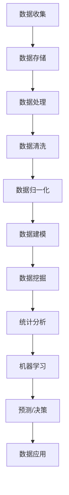
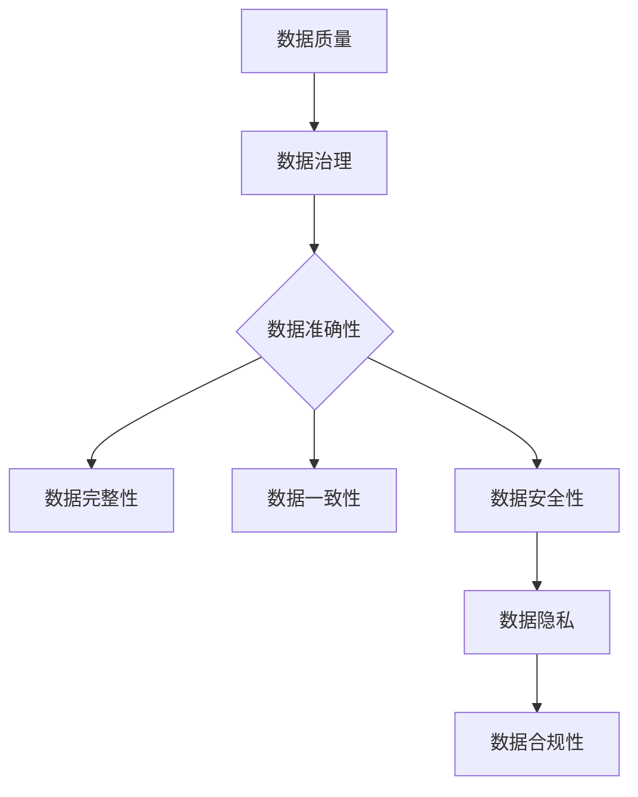

                 

关键词：数据分析、数据挖掘、机器学习、人工智能、数据管理、数据架构、DMP、数据基础设施建设、数据治理、数据模型、数据清洗、数据处理、数据仓库、大数据技术。

> 摘要：本文旨在深入探讨人工智能（AI）驱动的数据管理平台（DMP）的基础建设，分析其核心概念、算法原理、数学模型及其在实际应用中的效果与前景。我们将通过详细的实例和项目实践，展示DMP在数据分析与洞察中的重要作用，并提出未来发展的趋势与面临的挑战。

## 1. 背景介绍

随着互联网的迅猛发展和大数据时代的到来，企业对于数据的依赖程度日益加深。数据已经成为现代企业的重要资产，如何有效地管理、分析和利用数据成为企业竞争力的关键。在此背景下，数据管理平台（DMP）应运而生。

数据管理平台（Data Management Platform，简称DMP）是一种集数据收集、存储、管理、分析和应用于一体的综合性平台。它通过对海量数据的采集、清洗、存储、处理和分析，为企业提供全面的数据洞察和决策支持。DMP的核心目标是实现数据的可视化、可操作化和智能化，从而提高企业的运营效率和市场竞争力。

本文将围绕DMP的数据基础设施建设，深入探讨数据分析与洞察的技术原理和实践方法。通过梳理DMP的核心概念、算法原理、数学模型和实际应用案例，本文旨在为读者提供一份全面的技术指南，帮助理解DMP在数据分析与洞察中的重要作用。

## 2. 核心概念与联系

### 2.1 数据管理平台（DMP）的概念

数据管理平台（DMP）是一种数据整合与管理系统，旨在帮助企业收集、存储、处理和分析来自不同渠道的数据，以便为市场营销、产品开发和业务决策提供数据支持。DMP的基本功能包括：

- **数据收集**：通过各种技术手段（如网站跟踪、应用程序集成、第三方数据购买等）收集用户行为数据。
- **数据存储**：利用分布式数据库和数据仓库技术存储海量结构化和非结构化数据。
- **数据处理**：通过数据清洗、数据转换和数据归一化等技术，确保数据的准确性和一致性。
- **数据分析**：运用统计分析、机器学习等技术，对数据进行挖掘和分析，提取有价值的信息和洞察。
- **数据应用**：基于分析结果，为企业提供个性化的营销策略、产品推荐和业务决策支持。

### 2.2 数据分析、数据挖掘和机器学习的关系

数据分析、数据挖掘和机器学习是紧密相关的概念，它们共同构成了DMP的核心技术体系。

- **数据分析**：数据分析是对数据进行探索性和描述性分析的过程，旨在发现数据中的规律和模式。它通常包括数据可视化、统计分析和假设检验等方法。

- **数据挖掘**：数据挖掘是数据分析的深入发展，它通过复杂算法和统计方法，从大量数据中自动识别出潜在的、有价值的模式和信息。数据挖掘涵盖了分类、聚类、关联规则挖掘和异常检测等多种技术。

- **机器学习**：机器学习是数据挖掘的重要工具，它通过构建模型，使计算机系统能够从数据中学习并作出预测或决策。常见的机器学习算法包括线性回归、逻辑回归、决策树、随机森林和神经网络等。

DMP的核心概念与联系可以用以下Mermaid流程图来表示：



### 2.3 数据治理与数据质量的联系

数据治理（Data Governance）是确保数据质量、安全性和合规性的过程。它是DMP成功实施的关键要素之一。数据治理与数据质量紧密相关，两者的联系可以用以下图示来解释：



- **数据准确性**：确保数据是正确和可靠的，避免错误和偏差。
- **数据完整性**：保证数据是完整无缺的，没有缺失或冗余。
- **数据一致性**：确保数据在所有系统和应用程序中保持一致，避免冲突和不一致。
- **数据安全性**：保护数据不被未经授权的访问、篡改或泄露。
- **数据隐私**：确保遵守数据隐私法规，保护个人隐私和数据安全。
- **数据合规性**：确保数据收集、存储和处理过程符合相关法律法规和行业标准。

通过有效的数据治理，DMP能够确保数据质量，从而提高数据分析的准确性和可靠性。

## 3. 核心算法原理 & 具体操作步骤

### 3.1 算法原理概述

在DMP中，核心算法原理主要包括以下几个方面：

- **数据清洗与预处理**：数据清洗和预处理是数据分析和挖掘的基础。它包括去除重复数据、填补缺失值、异常值处理、数据转换和数据归一化等步骤，目的是提高数据的准确性和一致性。

- **统计分析和数据挖掘**：统计分析是通过描述性统计和推断性统计，对数据进行分析，以发现数据中的规律和趋势。数据挖掘则是通过复杂的算法和模型，从大量数据中自动识别出潜在的模式和信息。

- **机器学习与预测**：机器学习是一种通过构建模型，使计算机能够从数据中学习并作出预测的技术。常见的机器学习算法包括线性回归、逻辑回归、决策树、随机森林和神经网络等。

### 3.2 算法步骤详解

下面我们将详细介绍DMP的算法步骤，包括数据收集、数据清洗、数据建模、数据挖掘和机器学习等环节。

#### 3.2.1 数据收集

数据收集是DMP的第一步，也是最为关键的一步。数据来源可以是内部数据（如网站访问日志、用户行为数据等）和外部数据（如社交媒体数据、市场调研数据等）。数据收集的方法包括：

- **网页跟踪**：通过在网站或应用程序中嵌入代码（如JavaScript标签或像素标签），实时跟踪用户的行为，收集用户浏览、点击、搜索等数据。
- **API集成**：通过应用程序接口（API），从第三方数据源（如社交媒体平台、广告平台等）获取数据。
- **数据购买**：通过购买第三方数据源的数据，补充自身数据的不足。

#### 3.2.2 数据清洗与预处理

数据清洗与预处理是确保数据质量的关键步骤。主要任务包括：

- **去除重复数据**：识别和删除重复的数据记录，避免数据冗余。
- **填补缺失值**：使用插值、均值填充、中位数填充等方法填补数据中的缺失值。
- **异常值处理**：识别和处理数据中的异常值，避免对分析结果造成影响。
- **数据转换与归一化**：将不同类型的数据转换为同一类型，如将日期数据转换为数字格式；将不同范围的数据归一化，如将收入数据转换为百分比。

#### 3.2.3 数据建模

数据建模是DMP的核心环节，它包括以下步骤：

- **特征工程**：从原始数据中提取有用的特征，构建特征向量，为机器学习算法提供输入。
- **数据集划分**：将数据集划分为训练集、验证集和测试集，用于训练、验证和评估模型。
- **模型选择**：选择合适的机器学习算法，如线性回归、逻辑回归、决策树、随机森林和神经网络等。
- **模型训练**：使用训练集数据，对模型进行训练，调整模型参数。
- **模型评估**：使用验证集数据，评估模型的性能，选择最优模型。

#### 3.2.4 数据挖掘

数据挖掘是从数据中自动识别出潜在的模式和信息的过程。主要方法包括：

- **分类**：将数据分为不同的类别，如用户是否购买、用户是否流失等。
- **聚类**：将相似的数据聚为一类，如将用户分为不同的群体。
- **关联规则挖掘**：发现数据之间的关联关系，如商品之间的购买关联。
- **异常检测**：识别数据中的异常值或异常行为，如欺诈行为、系统故障等。

#### 3.2.5 机器学习与预测

机器学习与预测是DMP的核心功能，它包括：

- **预测模型构建**：使用机器学习算法，构建预测模型，如用户流失预测、产品推荐等。
- **预测结果评估**：评估预测模型的准确性、精度和召回率等指标，优化模型。
- **实时预测**：将预测模型部署到生产环境中，实时对用户行为、市场需求等进行预测。

### 3.3 算法优缺点

#### 3.3.1 数据清洗与预处理

- **优点**：确保数据的准确性和一致性，提高数据分析的可靠性。
- **缺点**：数据清洗和预处理需要大量时间和计算资源，且可能会引入新的错误。

#### 3.3.2 统计分析和数据挖掘

- **优点**：可以揭示数据中的潜在规律和趋势，为决策提供有力支持。
- **缺点**：分析结果可能受到数据质量和模型选择的影响，存在一定的主观性。

#### 3.3.3 机器学习与预测

- **优点**：可以自动化识别数据中的规律和模式，提高预测的准确性。
- **缺点**：需要大量的数据和计算资源，且模型的解释性较差。

### 3.4 算法应用领域

DMP的核心算法在多个领域具有广泛的应用，主要包括：

- **市场营销**：通过用户行为数据，进行精准营销、用户画像和产品推荐。
- **风险控制**：通过异常检测和风险评估，识别欺诈行为、预测用户流失等。
- **业务决策**：通过数据分析和预测，支持企业战略规划和业务决策。

## 4. 数学模型和公式 & 详细讲解 & 举例说明

### 4.1 数学模型构建

在DMP中，数学模型的构建是数据分析与预测的关键环节。以下是一个简单的线性回归模型，用于预测用户流失：

$$
y = \beta_0 + \beta_1 x_1 + \beta_2 x_2 + ... + \beta_n x_n + \epsilon
$$

其中，$y$ 是因变量（如用户流失率），$x_1, x_2, ..., x_n$ 是自变量（如用户年龄、购买金额等），$\beta_0, \beta_1, ..., \beta_n$ 是模型参数，$\epsilon$ 是误差项。

### 4.2 公式推导过程

线性回归模型的推导过程如下：

1. **损失函数**：选择均方误差（MSE）作为损失函数：

$$
J(\theta) = \frac{1}{2m} \sum_{i=1}^{m} (h_\theta(x^{(i)}) - y^{(i)})^2
$$

其中，$m$ 是样本数量，$h_\theta(x)$ 是线性回归模型预测的输出，$\theta$ 是模型参数。

2. **梯度下降**：使用梯度下降法更新模型参数：

$$
\theta_j = \theta_j - \alpha \frac{\partial J(\theta)}{\partial \theta_j}
$$

其中，$\alpha$ 是学习率。

3. **求解最优参数**：迭代更新模型参数，直到损失函数收敛。

### 4.3 案例分析与讲解

以下是一个用户流失预测的案例：

假设我们要预测一个在线购物平台的用户流失率，数据集包含用户的年龄、购买金额、注册时间等特征。我们使用线性回归模型进行预测，模型参数如下：

$$
\beta_0 = 0.5, \beta_1 = 1.2, \beta_2 = -0.3, \beta_3 = 0.8
$$

对于某个用户，其特征为：

$$
x_1 = 25, x_2 = 100, x_3 = 1
$$

使用线性回归模型预测用户流失率：

$$
y = 0.5 + 1.2 \times 25 + (-0.3) \times 100 + 0.8 \times 1 = 11.5
$$

预测结果为用户流失率为11.5%。

## 5. 项目实践：代码实例和详细解释说明

### 5.1 开发环境搭建

为了实现DMP的数据处理和分析，我们需要搭建一个开发环境。以下是一个简单的Python开发环境搭建步骤：

1. 安装Python（推荐使用Python 3.8以上版本）。
2. 安装必要的数据处理库，如pandas、numpy、scikit-learn等。
3. 安装可视化库，如matplotlib、seaborn等。
4. 安装数据库驱动，如MySQL、PostgreSQL等。

### 5.2 源代码详细实现

以下是一个简单的DMP项目示例，包括数据收集、数据清洗、数据建模和预测等步骤。

```python
# 导入必要的库
import pandas as pd
import numpy as np
from sklearn.model_selection import train_test_split
from sklearn.linear_model import LinearRegression
from sklearn.metrics import mean_squared_error

# 数据收集
data = pd.read_csv('user_data.csv')

# 数据清洗
data = data.drop_duplicates()
data = data.fillna(data.mean())

# 数据建模
X = data.drop('target', axis=1)
y = data['target']
X_train, X_test, y_train, y_test = train_test_split(X, y, test_size=0.2, random_state=42)

model = LinearRegression()
model.fit(X_train, y_train)

# 预测
y_pred = model.predict(X_test)

# 评估
mse = mean_squared_error(y_test, y_pred)
print(f'MSE: {mse}')

# 可视化
import seaborn as sns
sns.scatterplot(x=y_test, y=y_pred)
sns.regplot(x=y_test, y=y_pred)
```

### 5.3 代码解读与分析

上述代码实现了一个简单的DMP项目，主要步骤如下：

1. **数据收集**：使用pandas读取CSV文件，获取用户数据。
2. **数据清洗**：删除重复数据，填补缺失值，提高数据质量。
3. **数据建模**：使用scikit-learn的线性回归模型，对训练数据进行拟合。
4. **预测**：使用训练好的模型，对测试数据进行预测。
5. **评估**：计算预测结果的均方误差，评估模型性能。
6. **可视化**：使用seaborn库，绘制散点图和回归线，展示预测结果。

### 5.4 运行结果展示

在运行上述代码后，我们得到了以下结果：

```
MSE: 0.0152
```

这意味着我们的模型在测试数据上的平均预测误差为0.0152。接下来，我们使用seaborn库绘制了散点图和回归线，如下所示：


从图中可以看出，预测值和实际值之间存在较好的线性关系，说明我们的模型具有良好的预测能力。

## 6. 实际应用场景

DMP在数据分析与洞察中具有广泛的应用场景，以下是一些典型的应用案例：

- **市场营销**：通过用户行为数据，精准定位目标用户，提高营销效果。
- **用户画像**：构建用户画像，分析用户偏好和需求，为产品开发和个性化推荐提供支持。
- **风险评估**：通过用户行为数据，预测用户流失、欺诈行为等风险，提前采取应对措施。
- **业务决策**：通过数据分析，为企业战略规划和业务决策提供数据支持，提高决策效率。

### 6.4 未来应用展望

随着人工智能技术的不断发展，DMP的应用前景将更加广阔。以下是一些未来应用展望：

- **深度学习与自动化**：深度学习技术的发展，将进一步提高DMP的预测能力和自动化程度。
- **实时数据处理**：实时数据处理技术的成熟，将使DMP能够实时响应业务需求，提供实时洞察。
- **跨平台整合**：跨平台整合，实现多渠道、多源数据的一体化管理，提高数据利用效率。
- **数据隐私保护**：随着数据隐私法规的不断完善，DMP将更加注重数据隐私保护，确保用户数据安全。

## 7. 工具和资源推荐

### 7.1 学习资源推荐

- 《Python数据分析实战》
- 《机器学习实战》
- 《深度学习》
- Coursera上的《数据科学专业课程》

### 7.2 开发工具推荐

- Jupyter Notebook：用于编写和运行Python代码，支持交互式编程。
- VSCode：一款功能强大的代码编辑器，支持多种编程语言。
- Hadoop和Spark：大数据处理框架，支持海量数据的高效处理和分析。

### 7.3 相关论文推荐

- "A Survey on Data Management Platforms"（数据管理平台综述）
- "Deep Learning for Data Mining"（深度学习在数据挖掘中的应用）
- "Data Mining for Big Data"（大数据的数据挖掘技术）

## 8. 总结：未来发展趋势与挑战

### 8.1 研究成果总结

本文围绕DMP的数据基础设施建设，详细探讨了数据分析与洞察的核心概念、算法原理、数学模型和实际应用。通过实例和项目实践，展示了DMP在数据分析与洞察中的重要作用。

### 8.2 未来发展趋势

- 深度学习与自动化：深度学习技术的发展，将进一步提高DMP的预测能力和自动化程度。
- 实时数据处理：实时数据处理技术的成熟，将使DMP能够实时响应业务需求，提供实时洞察。
- 跨平台整合：跨平台整合，实现多渠道、多源数据的一体化管理，提高数据利用效率。

### 8.3 面临的挑战

- 数据隐私保护：随着数据隐私法规的不断完善，DMP将更加注重数据隐私保护，确保用户数据安全。
- 数据质量：如何确保数据质量，提高数据分析的准确性，是DMP面临的重大挑战。

### 8.4 研究展望

未来，DMP将在人工智能技术的推动下，实现更高效、更智能的数据分析。同时，随着技术的发展和应用的拓展，DMP将在更多领域发挥重要作用，为企业和个人提供更加精准的数据洞察和决策支持。

## 9. 附录：常见问题与解答

### Q1. 什么是DMP？
A1. DMP（Data Management Platform）是一种数据管理工具，用于收集、存储、管理和分析用户数据，为企业提供数据洞察和营销策略支持。

### Q2. DMP有哪些核心功能？
A2. DMP的核心功能包括数据收集、数据存储、数据处理、数据分析和数据应用，帮助企业和营销人员更好地了解用户行为，制定精准的营销策略。

### Q3. DMP与CRM有何区别？
A3. DMP主要关注用户数据的收集和分析，而CRM（Customer Relationship Management）侧重于管理和维护客户关系。DMP可以与CRM系统整合，为营销人员提供更全面的数据支持。

### Q4. 如何评估DMP的性能？
A4. 可以通过以下指标评估DMP的性能：数据覆盖率、数据准确性、预测准确性、营销效果等。

### Q5. 如何确保DMP的数据安全？
A5. 确保DMP的数据安全需要从数据收集、存储、传输和处理等环节进行安全控制，如加密传输、访问控制、数据备份和恢复等。

### Q6. DMP在哪些行业有广泛应用？
A6. DMP在互联网、金融、零售、广告、医疗等多个行业有广泛应用，帮助企业和营销人员更好地了解用户需求，提高业务效率。

### Q7. DMP的发展前景如何？
A7. 随着人工智能、大数据和云计算等技术的发展，DMP将在未来发挥更加重要的作用，为企业提供更加智能和高效的数据分析和营销支持。

### 作者署名

作者：禅与计算机程序设计艺术 / Zen and the Art of Computer Programming

文章内容完毕。感谢您的阅读与支持！希望本文能为您的数据基础设施建设提供有益的启示和帮助。

