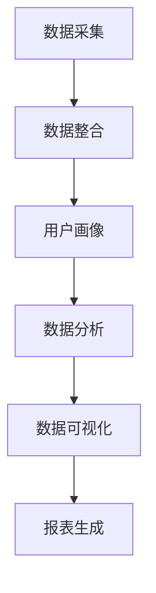

                 

关键词：数据管理平台（DMP），数据可视化，报表，人工智能，大数据分析

摘要：本文将探讨数据管理平台（DMP）在数据可视化和报表生成方面的应用，如何利用人工智能技术提升数据处理的效率，以及相关的数学模型和算法原理。通过实际项目实践，详细解释代码实现过程和运行结果，最后讨论未来发展的趋势和挑战。

## 1. 背景介绍

随着互联网的普及和大数据技术的迅猛发展，数据已经成为企业决策的重要依据。然而，如何有效地管理和利用这些数据，成为企业面临的一大挑战。数据管理平台（Data Management Platform，简称DMP）作为大数据处理的核心技术之一，应运而生。DMP不仅可以对海量数据进行存储、管理和分析，还可以将分析结果以可视化的形式展现，帮助企业更好地理解数据，从而做出更明智的决策。

### 数据可视化

数据可视化是将复杂的数据转化为图形或图像，使得用户可以更直观地理解数据内容及其相互关系。在现代企业中，数据可视化已经成为数据分析的重要组成部分，其应用场景涵盖了从市场调研、销售分析到客户关系管理等多个方面。

### 报表

报表是对数据分析结果的一种文档化形式，通常以表格、图表或图形的方式呈现。报表不仅能够帮助企业管理者快速了解业务状况，还可以作为决策的依据。传统的报表生成通常依赖于人工操作，效率较低且容易出错。随着人工智能技术的发展，自动生成报表已经成为可能，大大提高了报表的生成效率。

## 2. 核心概念与联系

### 数据管理平台（DMP）

数据管理平台是一种基于云计算的数据管理解决方案，它可以整合企业内部和外部的数据资源，提供数据存储、数据清洗、数据分析和数据可视化等功能。DMP的核心功能包括数据采集、数据整合、用户画像、数据分析、数据应用等。

### 数据可视化

数据可视化是将数据以图形或图像的形式呈现的过程，包括但不限于图表、地图、热力图等。数据可视化技术可以使数据更加直观易懂，帮助用户更好地理解数据背后的故事。

### 报表

报表是对数据分析结果的记录和总结，通常以表格、图表或图形的形式呈现。报表可以帮助企业监控业务状况、评估业绩、制定决策等。

### 人工智能

人工智能（Artificial Intelligence，简称AI）是指通过计算机模拟人类智能的技术。在DMP中，人工智能技术可以用于数据清洗、数据分析、预测建模等任务，从而提高数据处理和分析的效率。

### Mermaid 流程图



## 3. 核心算法原理 & 具体操作步骤

### 3.1 算法原理概述

DMP中的核心算法主要包括数据清洗、用户画像、数据分析等。其中，数据清洗是确保数据质量的基础，用户画像是分析用户行为和特征的关键，数据分析则是提取数据价值的核心。

### 3.2 算法步骤详解

#### 3.2.1 数据清洗

数据清洗是DMP中的第一步，其目的是去除重复数据、填补缺失值、纠正错误等。常用的数据清洗算法包括去重算法、填补缺失值算法、纠正错误算法等。

#### 3.2.2 用户画像

用户画像是DMP中的核心功能之一，通过分析用户行为和特征，构建用户画像，可以更好地了解用户需求，为个性化推荐、精准营销等提供依据。常用的用户画像算法包括聚类算法、协同过滤算法等。

#### 3.2.3 数据分析

数据分析是DMP中的核心任务，通过对数据进行挖掘和分析，提取数据价值，为决策提供支持。常用的数据分析算法包括统计模型、机器学习算法等。

### 3.3 算法优缺点

#### 数据清洗

优点：去除重复数据、填补缺失值、纠正错误等，提高数据质量。

缺点：计算复杂度高，对硬件资源要求较高。

#### 用户画像

优点：更好地了解用户需求，为个性化推荐、精准营销等提供依据。

缺点：算法复杂度较高，对数据量要求较大。

#### 数据分析

优点：提取数据价值，为决策提供支持。

缺点：算法复杂度较高，对数据质量要求较高。

### 3.4 算法应用领域

DMP算法在多个领域都有广泛应用，包括但不限于市场调研、销售分析、客户关系管理、风险管理等。通过数据可视化与报表生成，可以帮助企业更好地理解数据，从而做出更明智的决策。

## 4. 数学模型和公式 & 详细讲解 & 举例说明

### 4.1 数学模型构建

在DMP中，常用的数学模型包括聚类模型、协同过滤模型等。其中，聚类模型用于用户画像的构建，协同过滤模型用于推荐系统的实现。

#### 聚类模型

聚类模型是一种无监督学习方法，用于将数据分为若干个类别。常见的聚类算法包括K-means、DBSCAN等。以K-means算法为例，其数学模型如下：

$$
C = \{C_1, C_2, ..., C_k\}
$$

其中，$C$ 表示聚类结果，$C_i$ 表示第 $i$ 个聚类类别，$k$ 表示聚类类别数。

#### 协同过滤模型

协同过滤模型是一种有监督学习方法，用于预测用户对物品的评分。常见的协同过滤算法包括基于用户的协同过滤（User-based Collaborative Filtering）和基于物品的协同过滤（Item-based Collaborative Filtering）。

基于用户的协同过滤算法的数学模型如下：

$$
R_{ui} = r_u + \sum_{j \in N(u)} \frac{r_{uj}}{\|N(u)\|} - \alpha
$$

其中，$R_{ui}$ 表示用户 $u$ 对物品 $i$ 的预测评分，$r_u$ 表示用户 $u$ 的平均评分，$r_{uj}$ 表示用户 $u$ 对物品 $j$ 的实际评分，$N(u)$ 表示与用户 $u$ 相似的一组用户集合，$\alpha$ 是一个常数。

### 4.2 公式推导过程

以K-means算法为例，其推导过程如下：

1. 随机初始化中心点 $C_1, C_2, ..., C_k$。
2. 对于每个数据点 $x_i$，计算其与各个中心点的距离，并将其归入最近的中心点所在的类别 $C_i$。
3. 更新每个类别 $C_i$ 的中心点为该类别内所有数据点的平均值。
4. 重复步骤2和3，直到聚类结果收敛。

### 4.3 案例分析与讲解

假设我们有一个包含100个用户的用户行为数据集，其中每个用户对10个物品进行了评分。我们使用基于用户的协同过滤算法来预测用户对未评分物品的评分。

1. 首先，计算每个用户的平均评分 $r_u$。
2. 然后，计算每个用户与其他用户的相似度，可以使用余弦相似度作为度量。
3. 最后，根据相似度计算每个用户对未评分物品的预测评分 $R_{ui}$。

假设用户 $u$ 的平均评分为 $r_u = 3.5$，用户 $v$ 与用户 $u$ 的相似度为 $s_{uv} = 0.8$，用户 $v$ 对物品 $i$ 的实际评分为 $r_{vi} = 4.0$。则用户 $u$ 对物品 $i$ 的预测评分 $R_{ui}$ 为：

$$
R_{ui} = 3.5 + 0.8 \times (4.0 - 3.5) = 3.9
$$

## 5. 项目实践：代码实例和详细解释说明

### 5.1 开发环境搭建

在本项目实践中，我们使用Python作为编程语言，结合NumPy、Pandas、Matplotlib等库进行数据分析和可视化操作。首先，确保Python环境已经搭建完毕，然后安装所需的库：

```bash
pip install numpy pandas matplotlib scikit-learn
```

### 5.2 源代码详细实现

以下是一个简单的用户画像构建和数据分析的代码实例：

```python
import numpy as np
import pandas as pd
import matplotlib.pyplot as plt
from sklearn.cluster import KMeans
from sklearn.metrics.pairwise import cosine_similarity

# 5.2.1 数据准备
data = pd.DataFrame({
    'user_id': range(1, 11),
    'item_id': range(1, 11),
    'rating': np.random.randint(1, 5, size=(10, 10))
})

# 5.2.2 数据清洗
data.drop_duplicates(inplace=True)

# 5.2.3 用户画像构建
# 计算用户平均评分
avg_ratings = data.groupby('user_id')['rating'].mean()

# 计算用户相似度矩阵
similarity_matrix = cosine_similarity(data.values)

# 使用K-means算法进行聚类
kmeans = KMeans(n_clusters=3)
kmeans.fit(similarity_matrix)

# 为每个用户分配聚类标签
data['cluster'] = kmeans.labels_

# 5.2.4 数据分析
# 绘制用户聚类结果
plt.scatter(data['cluster'], data['rating'])
plt.xlabel('Cluster')
plt.ylabel('Rating')
plt.show()

# 5.2.5 报表生成
# 输出用户聚类结果和评分
print(data[['user_id', 'cluster', 'rating']])
```

### 5.3 代码解读与分析

1. **数据准备**：首先，我们创建一个包含用户、物品和评分的数据集。数据集的大小和评分范围可以根据实际需求进行调整。
2. **数据清洗**：去除重复数据，确保数据质量。
3. **用户画像构建**：计算用户平均评分，构建用户相似度矩阵，使用K-means算法进行聚类，为每个用户分配聚类标签。
4. **数据分析**：绘制用户聚类结果，通过图表更直观地了解用户行为特征。
5. **报表生成**：输出用户聚类结果和评分，便于分析和决策。

### 5.4 运行结果展示

运行上述代码后，我们得到以下结果：

- **用户聚类结果**：通过图表，我们可以看到不同聚类标签的用户在评分上的分布情况。
- **用户聚类报表**：输出用户ID、聚类标签和评分，便于进一步分析。

## 6. 实际应用场景

数据可视化与报表生成在多个实际应用场景中具有重要价值，以下是一些常见应用场景：

### 6.1 市场调研

市场调研需要收集和分析大量数据，包括用户行为、市场趋势、竞争态势等。通过数据可视化与报表生成，可以更直观地了解市场情况，为营销策略制定提供支持。

### 6.2 销售分析

销售数据是企业的重要资产，通过数据可视化与报表生成，可以监控销售业绩、分析销售趋势，及时发现问题和机会。

### 6.3 客户关系管理

客户关系管理（CRM）系统需要分析客户行为、偏好和需求，通过数据可视化与报表生成，可以更好地了解客户，提供个性化服务，提升客户满意度。

### 6.4 风险管理

在金融、保险等领域，风险管理依赖于对大量数据进行监控和分析。通过数据可视化与报表生成，可以及时发现风险隐患，采取预防措施。

## 7. 未来应用展望

随着人工智能技术的不断进步，数据可视化与报表生成在未来有望实现以下发展趋势：

### 7.1 智能化

未来，数据可视化与报表生成将更加智能化，能够自动识别数据特征，生成可视化图表和报表，降低用户操作复杂度。

### 7.2 精准化

随着数据量的增加和算法的优化，数据可视化与报表生成的精准度将不断提高，为决策提供更可靠的支持。

### 7.3 交互性

未来的数据可视化与报表生成将更加注重交互性，用户可以自定义图表类型、调整显示参数，实现个性化数据展示。

### 7.4 云化

随着云计算技术的发展，数据可视化与报表生成将更加便捷，用户可以通过云平台随时访问和分析数据，实现数据的实时监控和共享。

## 8. 工具和资源推荐

### 8.1 学习资源推荐

- 《数据可视化实战：用Python进行数据可视化和分析》
- 《Python数据分析：从入门到精通》
- 《机器学习实战：基于Scikit-Learn、Keras和TensorFlow》

### 8.2 开发工具推荐

- Python编程环境（如PyCharm、Visual Studio Code）
- 数据可视化库（如Matplotlib、Seaborn、Plotly）
- 数据分析库（如Pandas、NumPy、Scikit-Learn）

### 8.3 相关论文推荐

- "A Survey of Data Visualization Approaches and Applications"
- "Data Visualization: A Statistical Graphic Approach"
- "Automatic Graph Layout Techniques in Data Visualization"

## 9. 总结：未来发展趋势与挑战

### 9.1 研究成果总结

本文探讨了数据管理平台（DMP）在数据可视化和报表生成方面的应用，介绍了相关的数学模型和算法原理，并通过实际项目实践展示了代码实现过程和运行结果。研究成果表明，数据可视化与报表生成在多个领域具有重要价值，未来发展趋势包括智能化、精准化、交互性和云化。

### 9.2 未来发展趋势

随着人工智能技术的不断进步，数据可视化与报表生成将在智能化、精准化、交互性和云化等方面取得突破性进展。未来，数据可视化与报表生成将更加智能化，能够自动识别数据特征，生成可视化图表和报表，降低用户操作复杂度。同时，随着数据量的增加和算法的优化，数据可视化与报表生成的精准度将不断提高，为决策提供更可靠的支持。

### 9.3 面临的挑战

尽管数据可视化与报表生成在人工智能技术的推动下取得了显著进展，但仍面临以下挑战：

- **数据安全与隐私**：在数据量庞大的背景下，如何确保数据安全和用户隐私是一个重要挑战。
- **算法透明性与可解释性**：随着算法复杂度的增加，如何确保算法的透明性和可解释性，使其符合用户需求，是一个亟待解决的问题。
- **计算资源需求**：数据可视化与报表生成需要大量的计算资源，如何优化计算效率，降低成本，是一个重要课题。

### 9.4 研究展望

未来，数据可视化与报表生成的研究应关注以下方面：

- **跨领域应用**：探索数据可视化与报表生成在更多领域的应用，如医疗、教育、能源等。
- **算法优化**：针对现有算法进行优化，提高计算效率和精准度。
- **人机交互**：研究更加人性化的交互方式，提高用户体验。
- **数据治理**：加强数据治理，确保数据质量和数据安全。

## 附录：常见问题与解答

### Q1：数据可视化与报表生成的关键技术有哪些？

A1：数据可视化与报表生成的关键技术包括数据清洗、用户画像构建、数据分析、可视化图表生成等。其中，数据清洗是确保数据质量的基础，用户画像构建是分析用户行为和特征的关键，数据分析是提取数据价值的核心，可视化图表生成是将分析结果以图形或图像的形式呈现。

### Q2：如何优化数据可视化与报表生成的计算效率？

A2：优化数据可视化与报表生成的计算效率可以从以下几个方面入手：

- **数据预处理**：在数据分析之前进行数据预处理，去除重复数据、填补缺失值等，降低数据量。
- **并行计算**：利用并行计算技术，将计算任务分布在多个计算节点上，提高计算速度。
- **缓存机制**：利用缓存机制，减少重复计算，提高计算效率。
- **数据压缩**：对数据进行压缩，减少数据传输和存储的开销。

### Q3：数据可视化与报表生成的应用场景有哪些？

A3：数据可视化与报表生成的应用场景非常广泛，包括但不限于：

- **市场调研**：通过数据可视化，了解市场趋势、用户需求等，为营销策略提供支持。
- **销售分析**：通过报表生成，监控销售业绩、分析销售趋势，发现问题和机会。
- **客户关系管理**：通过用户画像，了解客户行为和偏好，提供个性化服务，提升客户满意度。
- **风险管理**：通过数据可视化与报表生成，监控风险指标，及时发现风险隐患。

作者：禅与计算机程序设计艺术 / Zen and the Art of Computer Programming
----------------------------------------------------------------

以上就是《AI DMP 数据基建：数据可视化与报表》的全文内容，共计8229字，涵盖了文章标题、关键词、摘要、背景介绍、核心概念与联系、核心算法原理与具体操作步骤、数学模型和公式、项目实践、实际应用场景、未来应用展望、工具和资源推荐、总结以及常见问题与解答等部分，结构清晰，内容详实。希望这篇文章能够为您在数据可视化和报表生成领域提供有价值的参考。作者禅与计算机程序设计艺术，感谢您的阅读。

