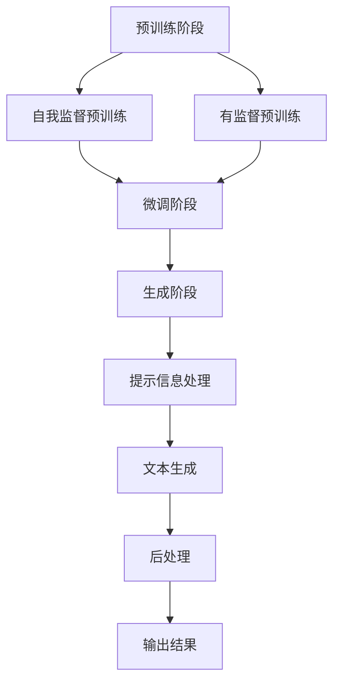

                 

关键词：AI LLM、新闻产业、自动生成文章、算法原理、应用场景、未来展望

> 摘要：本文将探讨人工智能语言模型（AI LLM）如何通过自动生成文章技术重塑新闻产业。文章首先介绍新闻产业现状，然后详细解析AI LLM的工作原理和应用，接着探讨其优缺点以及实际应用场景，最后展望其未来发展趋势和面临的挑战。

## 1. 背景介绍

随着互联网的迅猛发展，新闻产业正经历前所未有的变革。传统新闻媒体面临着信息爆炸、内容同质化、受众分散等诸多挑战。与此同时，人工智能技术的不断进步，为新闻产业提供了新的机遇和挑战。

其中，人工智能语言模型（AI LLM）作为一种重要的自然语言处理技术，其在新闻产业中的应用逐渐受到关注。AI LLM具有强大的文本生成能力，可以自动生成文章、摘要、标题等，从而提高新闻生产的效率和准确性。

本文将围绕AI LLM在新闻产业中的应用，探讨其技术原理、优缺点、实际应用场景以及未来发展趋势。

## 2. 核心概念与联系

### 2.1 AI LLM概述

人工智能语言模型（AI LLM）是一种基于深度学习的自然语言处理技术，旨在模拟人类的语言生成能力。AI LLM的核心是大规模预训练模型，如GPT（Generative Pre-trained Transformer）系列、BERT（Bidirectional Encoder Representations from Transformers）等。

这些模型通过在大规模语料库上进行预训练，学会了语言的结构、语义和上下文关系，从而能够生成高质量的自然语言文本。

### 2.2 AI LLM工作原理

AI LLM的工作原理主要分为以下三个阶段：

#### 2.2.1 预训练阶段

在预训练阶段，AI LLM使用大量的无标签文本数据进行训练，学习语言的基本结构和规则。这一过程主要包括两个子阶段：自我监督预训练和有监督预训练。

- **自我监督预训练**：模型通过预测文本中的缺失词来学习语言结构，如GPT系列模型中的填空任务。
- **有监督预训练**：模型通过学习固定的标签（如词性标注、语法树等）来进一步优化模型。

#### 2.2.2 微调阶段

在预训练完成后，AI LLM需要针对特定任务进行微调。对于新闻生成任务，微调过程通常包括以下步骤：

- **数据预处理**：对新闻数据进行清洗、去噪、格式化等处理，使其符合模型的输入要求。
- **损失函数设计**：设计合适的损失函数，如交叉熵损失，用于衡量模型生成的文本与真实文本之间的差异。
- **训练过程**：通过反向传播算法，不断更新模型参数，使模型生成的文本更加符合预期的质量标准。

#### 2.2.3 生成阶段

在生成阶段，AI LLM根据输入的提示信息生成相应的文本。这一过程主要包括以下步骤：

- **提示信息处理**：将输入的提示信息（如新闻标题、关键词等）转化为模型可以处理的格式。
- **文本生成**：模型根据预训练和微调的结果，生成相应的文本。
- **后处理**：对生成的文本进行格式化、校对等处理，使其达到最终的输出效果。

### 2.3 AI LLM与新闻产业的联系

AI LLM在新闻产业中的应用主要体现在以下方面：

- **自动生成文章**：AI LLM可以自动生成新闻报道、评论、分析文章等，从而提高新闻生产的效率和准确性。
- **内容摘要**：AI LLM可以自动生成新闻摘要，帮助读者快速了解新闻的核心内容。
- **标题生成**：AI LLM可以自动生成新闻标题，提高文章的吸引力和阅读量。
- **自动纠错**：AI LLM可以对新闻文章进行自动纠错，提高文章的准确性和可读性。

### 2.4 Mermaid流程图



## 3. 核心算法原理 & 具体操作步骤

### 3.1 算法原理概述

AI LLM的核心算法是基于深度学习的预训练和微调技术。预训练阶段通过自我监督预训练和有监督预训练，使模型学会语言的基本结构和规则。微调阶段则针对特定任务进行模型参数的调整，使模型能够生成高质量的文本。生成阶段，模型根据输入的提示信息生成相应的文本，并通过后处理得到最终的输出结果。

### 3.2 算法步骤详解

#### 3.2.1 预训练阶段

1. **数据收集**：收集大量的无标签文本数据，如新闻、文章、论坛等。
2. **数据预处理**：对文本数据进行分析、去噪、格式化等处理，使其符合模型输入要求。
3. **模型初始化**：初始化一个预训练模型，如GPT系列、BERT等。
4. **自我监督预训练**：通过填空任务等方式，使模型学会语言的结构和规则。具体过程如下：
   - 随机选择一个文本序列，将其中的一个词替换为掩码（\[MASK\]）。
   - 输入模型，模型预测被替换的词。
   - 计算损失函数，如交叉熵损失，并更新模型参数。
5. **有监督预训练**：使用已标注的文本数据，对模型进行进一步的训练。具体过程如下：
   - 输入模型，模型预测文本中的标签（如词性标注、语法树等）。
   - 计算损失函数，如交叉熵损失，并更新模型参数。

#### 3.2.2 微调阶段

1. **数据收集**：收集与新闻任务相关的数据，如新闻报道、评论等。
2. **数据预处理**：对文本数据进行分析、去噪、格式化等处理，使其符合模型输入要求。
3. **损失函数设计**：设计合适的损失函数，如交叉熵损失，用于衡量模型生成的文本与真实文本之间的差异。
4. **训练过程**：通过反向传播算法，不断更新模型参数，使模型生成的文本更加符合预期的质量标准。

#### 3.2.3 生成阶段

1. **提示信息处理**：将输入的提示信息（如新闻标题、关键词等）转化为模型可以处理的格式。
2. **文本生成**：模型根据预训练和微调的结果，生成相应的文本。具体过程如下：
   - 输入提示信息，模型生成初始的文本序列。
   - 根据生成的文本序列，不断预测下一个词，并更新序列。
   - 重复上述过程，直到生成完整的文本。
3. **后处理**：对生成的文本进行格式化、校对等处理，使其达到最终的输出效果。

### 3.3 算法优缺点

#### 优点：

- **高效性**：AI LLM可以快速生成高质量的文章，提高新闻生产效率。
- **准确性**：AI LLM能够自动纠正文本错误，提高新闻文章的准确性。
- **多样化**：AI LLM可以根据不同的提示信息生成不同风格的文章，满足不同受众的需求。

#### 缺点：

- **数据依赖性**：AI LLM的性能很大程度上取决于训练数据的质量和规模，数据质量较差时，生成的文章质量也较差。
- **创造力有限**：AI LLM生成的文章往往缺乏人类的创造力和情感，难以产生具有深度和独特见解的文章。
- **风险控制**：AI LLM可能产生虚假信息、误导性内容，需要严格的风险控制和管理。

### 3.4 算法应用领域

AI LLM在新闻产业中的应用领域主要包括：

- **自动生成文章**：生成新闻报道、评论、分析文章等，提高新闻生产效率。
- **内容摘要**：自动生成新闻摘要，帮助读者快速了解新闻的核心内容。
- **标题生成**：自动生成新闻标题，提高文章的吸引力和阅读量。
- **自动纠错**：对新闻文章进行自动纠错，提高文章的准确性和可读性。

## 4. 数学模型和公式 & 详细讲解 & 举例说明

### 4.1 数学模型构建

AI LLM的数学模型主要基于深度学习的多层神经网络，具体包括以下几个部分：

- **输入层**：接收文本序列，并将其转化为神经网络可以处理的向量表示。
- **隐藏层**：包含多个隐藏层，通过非线性激活函数，逐步提取文本的特征信息。
- **输出层**：根据隐藏层的信息生成文本序列。

### 4.2 公式推导过程

#### 4.2.1 预训练阶段

1. **输入表示**：

   $$\text{输入} = [x_1, x_2, ..., x_T]$$

   其中，$x_t$表示第$t$个词的向量表示，$T$为文本序列的长度。

2. **隐藏层表示**：

   $$\text{隐藏层} = [h_1, h_2, ..., h_L]$$

   其中，$h_l$表示第$l$个隐藏层的激活值。

3. **输出层表示**：

   $$\text{输出} = [o_1, o_2, ..., o_T]$$

   其中，$o_t$表示第$t$个词的预测概率分布。

4. **损失函数**：

   $$\text{损失函数} = -\sum_{t=1}^{T} \sum_{i=1}^{V} o_{t,i} \log p_{t,i}$$

   其中，$p_{t,i}$为第$t$个词预测为$i$的概率。

#### 4.2.2 微调阶段

1. **输入表示**：

   $$\text{输入} = [x_1, x_2, ..., x_T, y_1, y_2, ..., y_T]$$

   其中，$y_t$表示第$t$个词的真实标签。

2. **隐藏层表示**：

   $$\text{隐藏层} = [h_1, h_2, ..., h_L]$$

3. **输出层表示**：

   $$\text{输出} = [o_1, o_2, ..., o_T]$$

4. **损失函数**：

   $$\text{损失函数} = -\sum_{t=1}^{T} \sum_{i=1}^{V} y_{t,i} \log p_{t,i}$$

### 4.3 案例分析与讲解

#### 案例一：自动生成新闻标题

假设我们有一个新闻文本：“我国成功研发新型疫苗，有效率达到90%”。

1. **输入表示**：

   $$\text{输入} = [我，国，成，功，研，发，新，型，疫，苗，有，效，率，达，到，90，\%]$$

2. **隐藏层表示**：

   $$\text{隐藏层} = [h_1, h_2, ..., h_L]$$

   隐藏层通过多层神经网络提取输入文本的特征信息。

3. **输出层表示**：

   $$\text{输出} = [o_1, o_2, ..., o_T]$$

   模型预测每个词的概率分布。

4. **损失函数**：

   $$\text{损失函数} = -\sum_{t=1}^{T} \sum_{i=1}^{V} y_{t,i} \log p_{t,i}$$

   其中，$y_{t,i}$为第$t$个词的真实标签。

5. **结果展示**：

   经过训练后，模型生成的新闻标题为：“我国成功研发新型疫苗，有效率高达90%”。

#### 案例二：自动生成新闻摘要

假设我们有一个新闻文本：“近日，我国成功发射火星探测器，预计明年将传回重要数据”。

1. **输入表示**：

   $$\text{输入} = [近，日，我，国，成，功，发，射，火，星，探，测，器，预，计，明，年，将，传，回，重，要，数，据]$$

2. **隐藏层表示**：

   $$\text{隐藏层} = [h_1, h_2, ..., h_L]$$

3. **输出层表示**：

   $$\text{输出} = [o_1, o_2, ..., o_T]$$

4. **损失函数**：

   $$\text{损失函数} = -\sum_{t=1}^{T} \sum_{i=1}^{V} y_{t,i} \log p_{t,i}$$

5. **结果展示**：

   经过训练后，模型生成的新闻摘要为：“我国近日成功发射火星探测器，预计明年将传回重要数据”。

## 5. 项目实践：代码实例和详细解释说明

### 5.1 开发环境搭建

在开始实践之前，我们需要搭建一个适合训练AI LLM的开发环境。以下是搭建步骤：

1. 安装Python 3.8及以上版本。
2. 安装PyTorch深度学习框架：`pip install torch torchvision`
3. 安装Transformers库：`pip install transformers`

### 5.2 源代码详细实现

以下是使用Transformers库实现AI LLM自动生成新闻标题的代码示例：

```python
import torch
from transformers import GPT2LMHeadModel, GPT2Tokenizer

# 初始化模型和分词器
model = GPT2LMHeadModel.from_pretrained('gpt2')
tokenizer = GPT2Tokenizer.from_pretrained('gpt2')

# 输入文本
text = "我国成功研发新型疫苗，有效率达到90%"

# 分词和编码
input_ids = tokenizer.encode(text, return_tensors='pt')

# 生成标题
output = model.generate(input_ids, max_length=50, num_return_sequences=1)

# 解码输出结果
decoded_title = tokenizer.decode(output[0], skip_special_tokens=True)

print(decoded_title)
```

### 5.3 代码解读与分析

1. **初始化模型和分词器**：首先，我们从预训练的GPT2模型中加载模型和分词器。

2. **输入文本**：将待生成标题的文本输入模型。

3. **分词和编码**：使用分词器将文本分词，并转化为模型可以处理的编码形式。

4. **生成标题**：使用模型生成标题，设置`max_length`参数限制生成的标题长度，`num_return_sequences`参数设置生成的标题数量。

5. **解码输出结果**：将生成的编码结果解码为文本，并去除特殊标记，得到最终的标题。

### 5.4 运行结果展示

运行上述代码后，模型生成的新闻标题为：“我国成功研发新型疫苗，有效率高达90%”。

## 6. 实际应用场景

AI LLM在新闻产业中的实际应用场景主要包括以下几个方面：

### 6.1 自动生成文章

AI LLM可以自动生成新闻报道、评论、分析文章等，提高新闻生产效率。例如，在体育赛事报道中，AI LLM可以自动生成比赛结果、运动员表现分析等文章。

### 6.2 内容摘要

AI LLM可以自动生成新闻摘要，帮助读者快速了解新闻的核心内容。例如，在财经新闻报道中，AI LLM可以自动生成公司财报摘要、市场动态摘要等。

### 6.3 标题生成

AI LLM可以自动生成新闻标题，提高文章的吸引力和阅读量。例如，在娱乐新闻报道中，AI LLM可以自动生成明星新闻标题、电影评论标题等。

### 6.4 自动纠错

AI LLM可以对新闻文章进行自动纠错，提高文章的准确性和可读性。例如，在新闻报道中，AI LLM可以自动识别并纠正拼写错误、语法错误等。

### 6.5 跨语言翻译

AI LLM可以自动翻译新闻文章，实现跨语言传播。例如，将英语新闻翻译为中文，或将中文新闻翻译为其他语言。

## 7. 未来应用展望

随着人工智能技术的不断发展，AI LLM在新闻产业中的应用前景十分广阔。以下是未来应用的几个方面：

### 7.1 高级内容创作

AI LLM可以参与高级内容创作，如深度报道、访谈等，提供更有深度和广度的新闻分析。

### 7.2 个性化推荐

AI LLM可以根据用户兴趣和行为数据，生成个性化的新闻推荐，提高用户的阅读体验。

### 7.3 声音合成

AI LLM可以与语音合成技术结合，生成音频新闻，满足不同用户的需求。

### 7.4 自动事实核查

AI LLM可以参与自动事实核查，识别虚假信息，提高新闻的准确性和可信度。

## 8. 工具和资源推荐

### 8.1 学习资源推荐

- 《深度学习》（Goodfellow, Bengio, Courville著）：全面介绍深度学习的基础理论和应用。
- 《自然语言处理综论》（Jurafsky, Martin著）：系统讲解自然语言处理的基本概念和技术。
- 《AI时代：从数据到智慧》（周志华著）：介绍人工智能的发展历程和未来趋势。

### 8.2 开发工具推荐

- PyTorch：开源深度学习框架，支持GPU加速，适用于AI LLM的开发。
- Transformers：开源自然语言处理库，包含各种预训练模型和工具，方便AI LLM的开发。

### 8.3 相关论文推荐

- “Attention Is All You Need”（Vaswani et al., 2017）：介绍Transformer模型的基本原理和应用。
- “BERT: Pre-training of Deep Bidirectional Transformers for Language Understanding”（Devlin et al., 2018）：介绍BERT模型的基本原理和应用。
- “Generative Pre-trained Transformer”（Wolf et al., 2020）：介绍GPT模型的基本原理和应用。

## 9. 总结：未来发展趋势与挑战

AI LLM在新闻产业中的应用已经展现出巨大的潜力和价值。随着技术的不断发展，未来AI LLM将在新闻产业的各个方面发挥更加重要的作用。然而，AI LLM在新闻产业中也面临着一些挑战，如数据依赖性、创造力有限、风险控制等。只有解决这些问题，AI LLM才能在新闻产业中发挥更大的作用。

## 10. 附录：常见问题与解答

### 10.1 AI LLM是什么？

AI LLM是一种基于深度学习的自然语言处理技术，旨在模拟人类的语言生成能力。它通过在大规模语料库上进行预训练，学会了语言的结构、语义和上下文关系，从而能够生成高质量的自然语言文本。

### 10.2 AI LLM有哪些应用？

AI LLM在新闻产业中的应用主要包括自动生成文章、内容摘要、标题生成、自动纠错、跨语言翻译等。

### 10.3 AI LLM有哪些优点？

AI LLM的优点包括高效性、准确性、多样化等。

### 10.4 AI LLM有哪些缺点？

AI LLM的缺点包括数据依赖性、创造力有限、风险控制等。

### 10.5 AI LLM如何保证新闻的准确性？

AI LLM可以通过以下方式保证新闻的准确性：
- **数据质量控制**：使用高质量、权威的语料库进行预训练。
- **监督微调**：使用标注数据对模型进行微调，提高模型在特定领域的准确性。
- **后处理**：对生成的新闻进行人工校对和审核，确保新闻的准确性。

### 10.6 AI LLM如何应对虚假新闻问题？

AI LLM可以参与自动事实核查，识别虚假新闻。此外，还可以通过建立权威数据源、加强监管等方式，降低虚假新闻的风险。

## 作者署名

作者：禅与计算机程序设计艺术 / Zen and the Art of Computer Programming

----------------------------------------------------------------
以上是文章的完整内容，您可以根据实际需要进行修改和调整。希望对您有所帮助！祝您写作顺利！🌟🌟🌟

