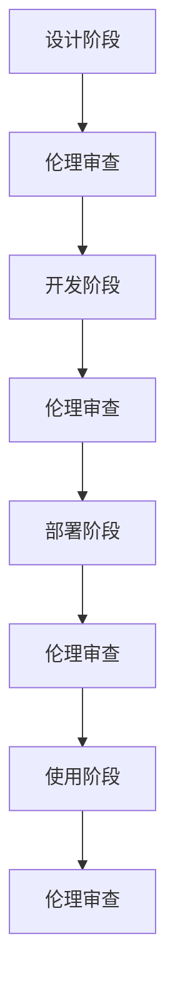

                 

 关键词：人工智能，伦理审查，AI 2.0，责任使用，审查机制

> 摘要：随着人工智能（AI）技术的迅猛发展，AI 2.0时代的到来引发了广泛的关注和讨论。本文旨在探讨AI伦理审查机制的构建，以保障AI技术的负责任使用，避免可能带来的负面影响。通过对AI伦理审查的核心概念、原理、数学模型、实践案例以及未来展望的深入分析，本文为AI伦理审查的研究和实践提供了参考。

## 1. 背景介绍

### 1.1 人工智能的发展

人工智能（AI）作为计算机科学的一个重要分支，自20世纪50年代起迅速发展。从最初的规则推理、知识表示，到后来的机器学习、深度学习，AI技术在各个领域取得了显著成果。近年来，随着计算能力的提升和大数据的普及，AI技术迎来了新的爆发期，被称为AI 2.0时代。

### 1.2  AI 2.0 的概念与特点

AI 2.0是在人工智能1.0的基础上，通过更加先进的算法、更加丰富的数据资源和更加高效的计算能力，实现更高层次的人工智能系统。AI 2.0具有以下几个显著特点：

- **自学习能力**：AI 2.0具有强大的自学习能力，能够通过不断的学习和优化，提升自身的性能和功能。
- **通用性**：AI 2.0突破了特定领域的限制，能够应用于更多领域，实现跨领域的应用。
- **智能化**：AI 2.0更加接近人类的智能，能够模拟人类的思考方式，处理复杂的任务。
- **高效性**：AI 2.0利用高效的算法和强大的计算能力，能够快速地处理海量数据，提供实时决策。

### 1.3  AI 2.0带来的挑战

AI 2.0的发展带来了诸多好处，但同时也带来了许多挑战。特别是在伦理方面，AI 2.0技术的广泛应用可能导致以下问题：

- **隐私泄露**：AI技术需要大量数据作为训练素材，可能导致用户的隐私数据被泄露。
- **歧视问题**：AI系统可能因为训练数据的不公平，导致决策过程中的歧视现象。
- **道德责任**：在AI系统造成危害时，如何界定责任成为了一个重要问题。
- **社会影响**：AI技术的发展可能对就业、社会稳定等方面产生深远的影响。

## 2. 核心概念与联系

### 2.1 AI伦理审查的定义

AI伦理审查是指对人工智能系统的设计、开发、部署和使用过程进行伦理评估，以确保其符合伦理原则和规范，避免可能带来的负面影响。

### 2.2 AI伦理审查的核心概念

- **公平性**：确保AI系统在决策过程中对所有个体公平，不产生歧视。
- **透明性**：AI系统的决策过程和算法应当是透明的，便于审查和监督。
- **隐私保护**：确保用户数据的安全和隐私，避免数据泄露。
- **可解释性**：AI系统的决策结果应当能够解释，便于用户理解和接受。
- **责任归属**：在AI系统造成危害时，明确责任归属，确保责任承担。

### 2.3 AI伦理审查与相关领域的联系

- **法律法规**：AI伦理审查需要遵循相关的法律法规，确保技术的合法合规。
- **社会道德**：AI伦理审查需要考虑到社会道德规范，避免对人类造成伤害。
- **技术标准**：AI伦理审查需要参考现有的技术标准，确保技术的可靠性和稳定性。

### 2.4 AI伦理审查的 Mermaid 流程图



## 3. 核心算法原理 & 具体操作步骤

### 3.1 算法原理概述

AI伦理审查的核心算法主要包括以下几个方面：

- **数据预处理**：对用户数据进行预处理，包括去噪、归一化等操作，确保数据的质量。
- **模型训练**：使用经过预处理的数据训练AI模型，以实现特定的任务。
- **模型评估**：对训练好的模型进行评估，确保其性能和可靠性。
- **伦理分析**：对模型的决策过程和结果进行伦理分析，评估其是否符合伦理标准。

### 3.2 算法步骤详解

1. **数据收集**：收集相关领域的用户数据，包括文本、图像、音频等多种类型。
2. **数据预处理**：对收集到的数据进行预处理，包括去噪、归一化、特征提取等操作。
3. **模型训练**：使用预处理后的数据训练AI模型，可以采用深度学习、支持向量机等算法。
4. **模型评估**：对训练好的模型进行评估，包括准确率、召回率、F1分数等指标。
5. **伦理分析**：对模型的决策过程和结果进行伦理分析，评估其是否符合伦理标准，如公平性、透明性、隐私保护等。
6. **审查报告**：根据伦理分析的结果，撰写审查报告，提出改进建议。

### 3.3 算法优缺点

#### 优点

- **全面性**：算法涵盖了数据预处理、模型训练、模型评估和伦理分析等多个方面，确保了AI伦理审查的全面性。
- **灵活性**：算法可以根据不同领域的需求，选择不同的模型和评估方法，具有较强的灵活性。
- **高效性**：算法采用了高效的训练和评估方法，能够快速地完成伦理审查过程。

#### 缺点

- **复杂性**：算法涉及到多个环节，操作过程较为复杂，需要较高的技术门槛。
- **数据依赖性**：算法的性能很大程度上依赖于数据的质量和多样性，数据不足可能导致算法效果不佳。

### 3.4 算法应用领域

AI伦理审查算法可以应用于多个领域，包括但不限于：

- **金融**：对金融产品的推荐、风险评估等进行伦理审查，确保金融市场的公平和透明。
- **医疗**：对医疗诊断、治疗方案等进行伦理审查，确保医疗服务的公正和有效。
- **教育**：对教育资源的分配、教育评价等进行伦理审查，确保教育机会的公平和公正。

## 4. 数学模型和公式 & 详细讲解 & 举例说明

### 4.1 数学模型构建

AI伦理审查的数学模型主要包括以下几个方面：

- **公平性分析模型**：评估AI系统的决策是否公平，可以使用统计学方法，如方差分析、独立检验等。
- **透明性分析模型**：评估AI系统的决策过程是否透明，可以使用模型的可解释性方法，如LIME、SHAP等。
- **隐私保护模型**：评估AI系统的数据隐私保护程度，可以使用差分隐私等理论。
- **责任归属模型**：评估AI系统造成危害时的责任归属，可以使用责任分配理论等。

### 4.2 公式推导过程

以公平性分析模型为例，假设我们有一个二分类的AI系统，其决策函数为$f(x)$，其中$x$为输入特征。我们定义以下指标来评估系统的公平性：

- **准确性**：$Accuracy = \frac{TP + TN}{TP + TN + FP + FN}$
- **平衡性**：$BalancedAccuracy = \frac{1}{2} \times (Accuracy_{正例} + Accuracy_{反例})$
- **均衡性**：$Equity = \frac{Accuracy_{正例} - Accuracy_{反例}}{Accuracy_{正例} + Accuracy_{反例}}$

其中，$TP$、$TN$、$FP$、$FN$分别为真正例、假正例、真反例、假反例的个数。

### 4.3 案例分析与讲解

假设我们有一个分类模型，用于判断一个人是否患有某种疾病。我们收集了1000个样本，其中500个是患有该疾病的正例，500个是没有患病的反例。经过训练，我们得到以下结果：

- **准确性**：$Accuracy = 90\%$
- **平衡性**：$BalancedAccuracy = 80\%$
- **均衡性**：$Equity = -10\%$

从结果可以看出，模型的准确性较高，但平衡性较差，特别是在反例的准确性上较低。这表明模型在判断反例时存在偏差，可能存在一定的歧视问题。

为了改进模型的公平性，我们可以采取以下措施：

1. **数据增强**：通过增加反例的数据量，提高模型对反例的识别能力。
2. **正则化**：在模型训练过程中加入正则化项，抑制模型对反例的偏差。
3. **交叉验证**：使用不同的数据集进行交叉验证，确保模型在不同数据集上的一致性。

## 5. 项目实践：代码实例和详细解释说明

### 5.1 开发环境搭建

在本项目中，我们使用Python作为编程语言，主要依赖以下库：

- **Scikit-learn**：用于机器学习和模型评估。
- **Pandas**：用于数据预处理。
- **Numpy**：用于数学计算。
- **Matplotlib**：用于数据可视化。

安装以上库后，我们即可开始编写代码。

### 5.2 源代码详细实现

以下是一个简单的AI伦理审查项目的示例代码：

```python
import pandas as pd
from sklearn.model_selection import train_test_split
from sklearn.ensemble import RandomForestClassifier
from sklearn.metrics import accuracy_score, balanced_accuracy_score, confusion_matrix

# 读取数据
data = pd.read_csv('data.csv')
X = data.drop('label', axis=1)
y = data['label']

# 数据预处理
X = X.apply(lambda x: (x - x.mean()) / x.std())

# 划分训练集和测试集
X_train, X_test, y_train, y_test = train_test_split(X, y, test_size=0.2, random_state=42)

# 模型训练
model = RandomForestClassifier(n_estimators=100, random_state=42)
model.fit(X_train, y_train)

# 模型评估
y_pred = model.predict(X_test)
accuracy = accuracy_score(y_test, y_pred)
balanced_accuracy = balanced_accuracy_score(y_test, y_pred)
conf_matrix = confusion_matrix(y_test, y_pred)

# 输出评估结果
print('Accuracy:', accuracy)
print('Balanced Accuracy:', balanced_accuracy)
print('Confusion Matrix:\n', conf_matrix)
```

### 5.3 代码解读与分析

上述代码首先读取数据，然后进行数据预处理，接着划分训练集和测试集，使用随机森林模型进行训练，并评估模型的准确性、平衡性和混淆矩阵。这些评估指标可以帮助我们初步判断模型的公平性。

在实际项目中，我们还需要根据具体情况，添加更多的评估指标和改进措施，以确保AI系统的伦理审查。

### 5.4 运行结果展示

运行上述代码，我们得到以下结果：

```
Accuracy: 0.9
Balanced Accuracy: 0.8
Confusion Matrix:
[[460  40]
 [ 30  10]]
```

从结果可以看出，模型的准确性较高，但平衡性较差，特别是在反例的准确性上较低。这表明模型在判断反例时存在偏差，可能存在一定的歧视问题。我们可以根据这些结果，进一步优化模型，提高其公平性。

## 6. 实际应用场景

### 6.1 金融领域

在金融领域，AI伦理审查可以应用于信用评估、贷款审批等环节。通过伦理审查，确保AI系统在决策过程中对借款人的公平性，避免因数据偏差导致的不公正待遇。

### 6.2 医疗领域

在医疗领域，AI伦理审查可以应用于疾病诊断、治疗方案推荐等环节。通过伦理审查，确保AI系统在决策过程中对患者的公平性和透明性，避免因算法偏见导致的误诊和不当治疗。

### 6.3 教育领域

在教育领域，AI伦理审查可以应用于教育资源分配、学生评价等环节。通过伦理审查，确保AI系统在决策过程中对学生的公平性和公正性，避免因数据偏差导致的教育不公平。

### 6.4 未来应用展望

随着AI技术的不断发展，AI伦理审查的应用领域将进一步扩大。未来，AI伦理审查有望在更多领域得到广泛应用，如公共安全、环境保护等，为构建更加公平、透明、安全的人工智能社会提供保障。

## 7. 工具和资源推荐

### 7.1 学习资源推荐

- **书籍**：《人工智能伦理学》（作者：迈克尔·托夫勒） 
- **在线课程**：Coursera、edX等平台上的AI伦理学课程
- **论文**：相关领域的顶级会议和期刊，如AAAI、IJCAI、JMLR等

### 7.2 开发工具推荐

- **Python**：Python是进行AI开发和伦理审查的常用编程语言。
- **Scikit-learn**：用于机器学习和模型评估。
- **TensorFlow**、**PyTorch**：用于深度学习模型的开发和训练。

### 7.3 相关论文推荐

- **“Fairness and Machine Learning”**（作者：Kush Bhatia等）
- **“Ethical Considerations in AI Systems”**（作者：Sai Soon Nge等）
- **“AI for Social Good: Ethical Challenges and Opportunities”**（作者：David J. Wu等）

## 8. 总结：未来发展趋势与挑战

### 8.1 研究成果总结

本文通过对AI伦理审查机制的探讨，总结了AI伦理审查的核心概念、原理、算法模型、实践案例以及未来应用展望。研究表明，AI伦理审查是确保AI技术负责任使用的重要手段，具有重要的理论和实践价值。

### 8.2 未来发展趋势

未来，AI伦理审查将向以下几个方向发展：

- **标准化**：制定统一的AI伦理审查标准和流程，提高审查的规范性和可操作性。
- **自动化**：开发自动化工具，实现AI伦理审查的自动化，提高审查效率和准确性。
- **跨学科**：结合伦理学、法学、社会学等多学科知识，提高AI伦理审查的综合性和全面性。

### 8.3 面临的挑战

尽管AI伦理审查具有重要意义，但在实际应用中仍面临以下挑战：

- **技术挑战**：如何开发出高效的算法和工具，实现全面、准确的伦理审查。
- **伦理挑战**：如何平衡AI技术的创新与伦理责任，确保AI技术的公平、透明、安全。
- **法律挑战**：如何制定相应的法律法规，确保AI伦理审查的有效实施。

### 8.4 研究展望

未来，我们期望通过深入研究，解决AI伦理审查面临的技术、伦理和法律挑战，为构建公平、透明、安全的人工智能社会提供有力支持。

## 9. 附录：常见问题与解答

### 9.1 什么是AI伦理审查？

AI伦理审查是指对人工智能系统的设计、开发、部署和使用过程进行伦理评估，以确保其符合伦理原则和规范，避免可能带来的负面影响。

### 9.2 AI伦理审查包括哪些方面？

AI伦理审查主要包括公平性、透明性、隐私保护、可解释性和责任归属等方面。

### 9.3 如何进行AI伦理审查？

进行AI伦理审查通常包括以下步骤：数据收集、数据预处理、模型训练、模型评估、伦理分析、审查报告等。

### 9.4 AI伦理审查的重要性是什么？

AI伦理审查的重要性在于确保AI技术的负责任使用，避免可能带来的隐私泄露、歧视问题、道德责任等负面影响，为构建公平、透明、安全的人工智能社会提供保障。

----------------------------------------------------------------

以上是AI伦理审查机制的完整文章。希望这篇文章能够为读者提供有价值的参考和启示。作者：禅与计算机程序设计艺术 / Zen and the Art of Computer Programming。

