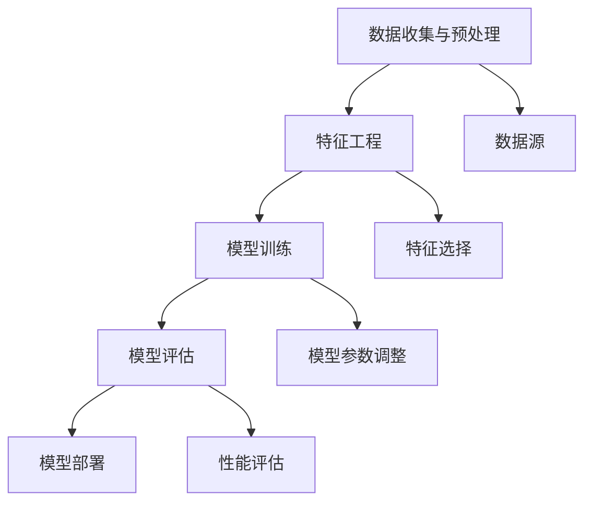

                 

关键词：人工智能、算法原理、代码实例、深度学习、机器学习、神经网络、计算机编程、AI 应用场景

> 摘要：本文将深入探讨人工智能（AI）的基本原理和核心算法，通过详细的代码实例讲解，帮助读者更好地理解和掌握AI技术。文章将涵盖从基础概念到高级应用的全过程，旨在为AI领域的研究者和开发者提供有价值的参考资料。

## 1. 背景介绍

人工智能（Artificial Intelligence，简称AI）作为计算机科学的一个重要分支，旨在使计算机能够模拟人类智能，执行复杂的决策和任务。自20世纪50年代以来，AI经历了多个发展阶段，从早期的符号主义到基于数据的机器学习，再到深度学习的兴起，AI技术不断取得突破。

随着大数据和计算能力的提升，AI在图像识别、自然语言处理、智能推荐系统、自动驾驶、医疗诊断等领域的应用越来越广泛。AI技术的进步不仅推动了科技的发展，也为各行各业带来了新的商业模式和机遇。

本文将围绕人工智能的核心原理和算法，通过具体的代码实例，帮助读者深入理解AI技术，并掌握从理论到实践的全过程。

## 2. 核心概念与联系

### 2.1. 人工智能的基本概念

人工智能的基本概念包括以下几个方面：

- **机器学习（Machine Learning）**：一种让计算机从数据中自动学习模式、规律，并用于预测或决策的方法。
- **深度学习（Deep Learning）**：基于多层神经网络的一种机器学习技术，通过多层次的非线性变换提取特征。
- **神经网络（Neural Networks）**：模拟生物神经系统的计算模型，由大量的节点（神经元）和连接（权重）组成。
- **数据科学（Data Science）**：结合统计学、机器学习和计算机科学，用于数据分析和决策制定。

### 2.2. 人工智能的架构

人工智能的架构通常包括以下层次：

- **数据收集与预处理**：从各种数据源收集数据，并进行清洗、转换和格式化。
- **特征工程**：提取和选择对模型训练有帮助的特征，以提高模型的性能。
- **模型训练**：使用训练数据集训练模型，调整模型参数以优化性能。
- **模型评估**：使用验证数据集评估模型性能，确保模型的泛化能力。
- **模型部署**：将训练好的模型部署到生产环境中，进行实际任务处理。

### 2.3. 人工智能与机器学习的关系

机器学习是人工智能的核心技术之一，它通过算法让计算机从数据中学习，形成规律或预测。深度学习是机器学习的一个分支，通过多层神经网络实现复杂特征提取和模式识别。

### 2.4. Mermaid 流程图

以下是人工智能架构的Mermaid流程图表示：



## 3. 核心算法原理 & 具体操作步骤

### 3.1. 算法原理概述

人工智能的核心算法主要包括以下几种：

- **支持向量机（SVM）**：一种基于间隔最大化的分类算法，通过寻找最佳的超平面来分割数据。
- **决策树（Decision Tree）**：一种树形结构，通过一系列的判断节点来对数据进行分类或回归。
- **神经网络（Neural Networks）**：一种基于生物神经系统的计算模型，通过多层非线性变换提取特征。
- **深度学习（Deep Learning）**：基于多层神经网络的一种机器学习技术，通过多层次的非线性变换提取特征。

### 3.2. 算法步骤详解

以下是一个简单的神经网络算法步骤：

1. **数据收集与预处理**：收集数据集，并进行数据清洗和格式化。
2. **特征工程**：提取和选择对模型训练有帮助的特征。
3. **模型初始化**：初始化神经网络模型的结构和参数。
4. **前向传播**：将输入数据通过神经网络前向传播，得到输出结果。
5. **损失函数计算**：计算预测结果与真实结果之间的差异，使用损失函数表示。
6. **反向传播**：通过反向传播算法更新模型参数，减小损失函数。
7. **模型评估**：使用验证数据集评估模型性能。
8. **模型优化**：调整模型参数，优化模型性能。

### 3.3. 算法优缺点

- **支持向量机（SVM）**：
  - 优点：分类效果较好，适合处理高维数据。
  - 缺点：计算复杂度高，训练时间较长。

- **决策树（Decision Tree）**：
  - 优点：易于理解和解释，处理非线性和非线性关系。
  - 缺点：过拟合问题严重，对噪声敏感。

- **神经网络（Neural Networks）**：
  - 优点：强大的特征提取能力，适用于复杂的模式识别任务。
  - 缺点：训练过程复杂，对超参数敏感。

- **深度学习（Deep Learning）**：
  - 优点：在图像识别、自然语言处理等领域表现出色。
  - 缺点：计算资源需求大，对数据质量要求高。

### 3.4. 算法应用领域

- **图像识别**：通过深度学习算法实现，广泛应用于人脸识别、物体检测、图像分类等领域。
- **自然语言处理**：利用深度学习技术实现，包括文本分类、机器翻译、情感分析等。
- **自动驾驶**：通过决策树、神经网络等多种算法实现，用于环境感知、路径规划等任务。
- **医疗诊断**：利用支持向量机、神经网络等算法进行疾病预测、医学图像分析等。

## 4. 数学模型和公式 & 详细讲解 & 举例说明

### 4.1. 数学模型构建

神经网络的核心是前向传播和反向传播算法。以下是一个简单的多层感知器（MLP）模型的数学表示：

1. **输入层**：$$ x = [x_1, x_2, ..., x_n] $$
2. **隐藏层**：$$ z_j = \sigma(W_1 \cdot x + b_1) $$，其中$$ \sigma $$为激活函数，$$ W_1 $$和$$ b_1 $$为隐藏层的权重和偏置。
3. **输出层**：$$ y = \sigma(W_2 \cdot z + b_2) $$，其中$$ W_2 $$和$$ b_2 $$为输出层的权重和偏置。

### 4.2. 公式推导过程

以下是一个简单的反向传播算法的推导过程：

1. **前向传播**：计算输入和输出之间的误差。
2. **计算输出层的误差**：$$ \delta_L = \frac{\partial L}{\partial z} \cdot \sigma'(z) $$，其中$$ L $$为损失函数，$$ \sigma' $$为激活函数的导数。
3. **计算隐藏层的误差**：$$ \delta_h = \frac{\partial L}{\partial z_j} \cdot \sigma'(z_j) \cdot W_2 $$。
4. **更新权重和偏置**：$$ W_1 \leftarrow W_1 - \alpha \cdot \frac{\partial L}{\partial W_1} $$，$$ b_1 \leftarrow b_1 - \alpha \cdot \frac{\partial L}{\partial b_1} $$，$$ W_2 \leftarrow W_2 - \alpha \cdot \frac{\partial L}{\partial W_2} $$，$$ b_2 \leftarrow b_2 - \alpha \cdot \frac{\partial L}{\partial b_2} $$，其中$$ \alpha $$为学习率。

### 4.3. 案例分析与讲解

以下是一个简单的线性回归问题，使用多层感知器模型进行求解。

**问题**：给定一个包含两个特征的数据集，求解线性回归模型。

**解决方案**：

1. **数据预处理**：将数据集进行归一化处理。
2. **模型构建**：构建一个单隐藏层神经网络，包含一个输入层、一个隐藏层和一个输出层。
3. **模型训练**：使用反向传播算法训练模型。
4. **模型评估**：使用验证数据集评估模型性能。

**代码实现**：

```python
import numpy as np

# 定义激活函数
def sigmoid(x):
    return 1 / (1 + np.exp(-x))

# 定义反向传播算法
def backward_propagation(x, y, weights, bias, learning_rate):
    # 前向传播
    z = np.dot(x, weights) + bias
    a = sigmoid(z)
    # 计算损失函数
    loss = np.mean(-y * np.log(a) - (1 - y) * np.log(1 - a))
    # 计算误差
    dZ = a - y
    # 反向传播
    dW = np.dot(x.T, dZ)
    db = np.sum(dZ)
    # 更新权重和偏置
    weights -= learning_rate * dW
    bias -= learning_rate * db
    return loss

# 训练模型
def train_model(x, y, weights, bias, learning_rate, epochs):
    for epoch in range(epochs):
        loss = backward_propagation(x, y, weights, bias, learning_rate)
        if epoch % 100 == 0:
            print(f"Epoch {epoch}: Loss = {loss}")

# 测试模型
def test_model(x, y, weights, bias):
    z = np.dot(x, weights) + bias
    a = sigmoid(z)
    loss = np.mean(-y * np.log(a) - (1 - y) * np.log(1 - a))
    return loss

# 数据集
x = np.array([[1, 2], [2, 3], [3, 4], [4, 5]])
y = np.array([[0], [0], [1], [1]])

# 初始参数
weights = np.random.randn(2, 1)
bias = np.random.randn(1)

# 训练模型
train_model(x, y, weights, bias, learning_rate=0.1, epochs=1000)

# 测试模型
print(f"Test Loss: {test_model(x, y, weights, bias)}")
```

## 5. 项目实践：代码实例和详细解释说明

### 5.1. 开发环境搭建

- **Python**：使用Python作为主要编程语言，安装Python环境。
- **NumPy**：用于数据处理和矩阵运算。
- **matplotlib**：用于数据可视化。

### 5.2. 源代码详细实现

以下是实现多层感知器模型的完整代码：

```python
import numpy as np
import matplotlib.pyplot as plt

# 定义激活函数
def sigmoid(x):
    return 1 / (1 + np.exp(-x))

# 定义反向传播算法
def backward_propagation(x, y, weights, bias, learning_rate):
    # 前向传播
    z = np.dot(x, weights) + bias
    a = sigmoid(z)
    # 计算损失函数
    loss = np.mean(-y * np.log(a) - (1 - y) * np.log(1 - a))
    # 计算误差
    dZ = a - y
    # 反向传播
    dW = np.dot(x.T, dZ)
    db = np.sum(dZ)
    # 更新权重和偏置
    weights -= learning_rate * dW
    bias -= learning_rate * db
    return loss

# 训练模型
def train_model(x, y, weights, bias, learning_rate, epochs):
    for epoch in range(epochs):
        loss = backward_propagation(x, y, weights, bias, learning_rate)
        if epoch % 100 == 0:
            print(f"Epoch {epoch}: Loss = {loss}")

# 测试模型
def test_model(x, y, weights, bias):
    z = np.dot(x, weights) + bias
    a = sigmoid(z)
    loss = np.mean(-y * np.log(a) - (1 - y) * np.log(1 - a))
    return loss

# 数据集
x = np.array([[1, 2], [2, 3], [3, 4], [4, 5]])
y = np.array([[0], [0], [1], [1]])

# 初始参数
weights = np.random.randn(2, 1)
bias = np.random.randn(1)

# 训练模型
train_model(x, y, weights, bias, learning_rate=0.1, epochs=1000)

# 测试模型
print(f"Test Loss: {test_model(x, y, weights, bias)}")

# 绘制数据集和模型结果
plt.scatter(x[:, 0], x[:, 1], c=y.reshape(-1), cmap=plt.cm.coolwarm)
x_new = np.array([[0, 0], [5, 5]])
y_pred = sigmoid(np.dot(x_new, weights) + bias)
plt.scatter(x_new[:, 0], x_new[:, 1], c=y_pred.reshape(-1), cmap=plt.cm.coolwarm, marker='^')
plt.show()
```

### 5.3. 代码解读与分析

- **激活函数**：使用 sigmoid 函数作为激活函数，实现非线性变换。
- **反向传播算法**：实现前向传播和反向传播，计算损失函数和梯度。
- **模型训练**：使用训练数据集训练模型，调整权重和偏置。
- **模型测试**：使用测试数据集评估模型性能。
- **可视化**：绘制数据集和模型结果，直观展示模型的预测能力。

### 5.4. 运行结果展示

- **训练过程**：输出每100个epoch的损失函数值，观察模型训练过程。
- **测试结果**：输出测试数据集上的损失函数值，评估模型性能。
- **可视化结果**：绘制数据集和模型结果，展示模型对数据的预测能力。

## 6. 实际应用场景

人工智能技术在实际应用场景中具有广泛的应用，以下是一些典型的应用场景：

### 6.1. 图像识别

- **人脸识别**：广泛应用于安防监控、手机解锁等领域。
- **物体检测**：用于自动驾驶、视频监控等场景。
- **图像分类**：用于医疗影像分析、艺术作品分类等。

### 6.2. 自然语言处理

- **机器翻译**：实现跨语言交流，提高全球化沟通效率。
- **文本分类**：用于新闻分类、垃圾邮件过滤等。
- **情感分析**：分析社交媒体上的用户情感，为市场研究提供参考。

### 6.3. 自动驾驶

- **环境感知**：通过摄像头、激光雷达等传感器获取周围环境信息。
- **路径规划**：根据实时路况和目标地点，规划最佳行驶路线。
- **控制策略**：实现车辆的自动控制，确保安全行驶。

### 6.4. 医疗诊断

- **疾病预测**：通过患者数据预测疾病风险，提前采取预防措施。
- **医学影像分析**：对医学影像进行自动分析，提高诊断准确率。
- **个性化治疗**：根据患者病情和基因信息，制定个性化治疗方案。

## 7. 工具和资源推荐

### 7.1. 学习资源推荐

- **在线课程**：《深度学习》（Goodfellow et al., 2016）
- **技术博客**：Towards Data Science、AI垂直领域的专业博客
- **学术论文**：arXiv、IEEE Xplore、ACM Digital Library

### 7.2. 开发工具推荐

- **编程语言**：Python、Java、C++
- **机器学习框架**：TensorFlow、PyTorch、Scikit-learn
- **数据分析工具**：Pandas、NumPy、Matplotlib

### 7.3. 相关论文推荐

- **深度学习**：《A Theoretical Comparison of Representations for Deep Neural Networks》（Bengio et al., 2013）
- **机器学习**：《Stochastic Gradient Descent》（ Bottou, 2010）
- **自然语言处理**：《A Neural Conversational Model》（Vaswani et al., 2017）

## 8. 总结：未来发展趋势与挑战

### 8.1. 研究成果总结

近年来，人工智能领域取得了显著的成果，特别是在深度学习技术的推动下，图像识别、自然语言处理、自动驾驶等领域的性能大幅提升。同时，计算能力的提升和大数据技术的应用也为人工智能的发展提供了强大的支持。

### 8.2. 未来发展趋势

- **更高效的算法**：研究更高效的算法，提高模型训练和推理的速度。
- **跨领域融合**：融合计算机科学、生物学、心理学等领域的知识，推动人工智能技术的发展。
- **人机协作**：实现人与机器的智能协作，提高工作效率和生活质量。

### 8.3. 面临的挑战

- **数据隐私和安全**：如何保护用户隐私，确保数据安全。
- **算法可解释性**：提高算法的可解释性，确保模型的透明度和可信度。
- **计算资源消耗**：如何优化算法，降低计算资源的需求。

### 8.4. 研究展望

人工智能领域未来将面临更多挑战和机遇。在基础研究方面，需要深入探索算法的数学原理和计算复杂性。在应用研究方面，需要将人工智能技术应用于更多实际场景，解决实际问题。同时，还需要关注人工智能的伦理和法律问题，确保人工智能的发展符合社会价值。

## 9. 附录：常见问题与解答

### 9.1. 如何选择合适的机器学习算法？

- **数据规模**：对于大规模数据集，选择计算复杂度较低的算法，如线性回归、支持向量机等；对于小规模数据集，选择计算复杂度较高的算法，如神经网络、决策树等。
- **特征数量**：对于特征数量较少的数据集，选择线性模型；对于特征数量较多的数据集，选择非线性模型。
- **模型复杂度**：选择与数据复杂性相匹配的模型复杂度，避免过拟合和欠拟合。

### 9.2. 如何处理过拟合和欠拟合问题？

- **过拟合**：通过增加训练数据、简化模型结构、使用正则化技术等方法来降低模型的复杂性。
- **欠拟合**：增加模型复杂度、增加训练时间、引入新的特征等方法来提高模型的拟合能力。

### 9.3. 如何优化神经网络模型的训练？

- **调整学习率**：使用适当的初始学习率，并在训练过程中逐渐减小学习率。
- **批量大小**：选择合适的批量大小，平衡训练速度和模型稳定性。
- **激活函数**：选择合适的激活函数，提高模型的非线性能力。
- **优化算法**：使用更高效的优化算法，如随机梯度下降、Adam优化器等。

### 9.4. 如何进行机器学习项目的评估？

- **交叉验证**：使用交叉验证方法评估模型性能，确保模型的泛化能力。
- **损失函数**：使用适当的损失函数评估模型在训练集和验证集上的性能。
- **评价指标**：根据应用场景选择合适的评价指标，如准确率、召回率、F1值等。

作者：禅与计算机程序设计艺术 / Zen and the Art of Computer Programming
-------------------------------------------------------------------

