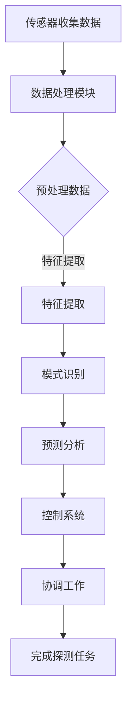

                 

关键词：AI基础设施、深海探测、智能化深海探测器、数据分析、算法、数学模型

摘要：本文深入探讨了AI基础设施在深海探测中的应用，重点介绍了智能化深海探测器的核心技术和数据分析方法。通过分析AI算法在数据处理、模式识别和预测分析方面的优势，文章揭示了智能化深海探测在海洋科学研究和资源开发中的重要价值。同时，本文还展望了AI基础设施在深海探测领域的未来发展趋势和面临的挑战。

## 1. 背景介绍

随着全球对海洋资源需求的不断增加，深海探测技术已经成为海洋科学研究和国防安全的重要组成部分。传统深海探测技术主要依赖于物理探测手段，如声纳、水下机器人等，但这些方法存在探测范围有限、效率低下等问题。随着人工智能（AI）技术的快速发展，智能化深海探测器应运而生，为深海探测带来了新的机遇。

智能化深海探测器是一种基于AI技术的深海探测工具，能够通过机器学习、计算机视觉和自然语言处理等方法，自动分析并处理海洋数据，从而提高探测效率和精度。本文将从AI基础设施的角度，详细探讨智能化深海探测器的技术原理、算法和数据分析方法，以期推动深海探测技术的创新和发展。

## 2. 核心概念与联系

### 2.1 智能化深海探测器的核心概念

智能化深海探测器主要由传感器、数据处理模块和控制系统组成。传感器用于收集海洋环境数据，如温度、压力、盐度、声波等；数据处理模块负责对传感器数据进行预处理、特征提取和模式识别；控制系统则负责协调各模块工作，实现深海探测任务。

### 2.2 AI技术与深海探测的关联

AI技术在深海探测中的应用主要体现在数据处理、模式识别和预测分析等方面。通过机器学习算法，智能化深海探测器能够自动识别和分类海洋生物、地形地貌等目标；计算机视觉算法可以帮助探测器识别海洋中的异常现象；自然语言处理算法则可以用于分析海洋文献、报告等数据。

### 2.3 Mermaid 流程图

下面是智能化深海探测器的Mermaid流程图：



## 3. 核心算法原理 & 具体操作步骤

### 3.1 算法原理概述

智能化深海探测器的核心算法主要包括机器学习算法、计算机视觉算法和自然语言处理算法。这些算法的基本原理如下：

- **机器学习算法**：通过训练模型，从大量数据中自动提取特征，实现数据的分类、预测和聚类等功能。
- **计算机视觉算法**：利用图像处理技术和深度学习算法，对图像进行识别、分析和理解。
- **自然语言处理算法**：通过对文本数据的分析，实现语言的理解、生成和翻译等功能。

### 3.2 算法步骤详解

#### 3.2.1 机器学习算法

1. 数据收集：收集大量海洋数据，包括传感器数据、图像、文本等。
2. 数据预处理：对数据进行清洗、去噪和归一化处理。
3. 特征提取：从预处理后的数据中提取特征，如频域特征、时域特征等。
4. 模型训练：使用机器学习算法，如支持向量机（SVM）、神经网络（NN）等，对提取的特征进行训练。
5. 模型评估：使用交叉验证等方法评估模型性能，如准确率、召回率等。
6. 模型应用：将训练好的模型应用于新数据，实现数据的分类、预测和聚类等功能。

#### 3.2.2 计算机视觉算法

1. 图像预处理：对图像进行去噪、增强、滤波等处理，提高图像质量。
2. 特征提取：从预处理后的图像中提取特征，如边缘、纹理、颜色等。
3. 目标检测：使用深度学习算法，如卷积神经网络（CNN）等，对图像中的目标进行检测和识别。
4. 目标跟踪：根据目标检测的结果，对目标进行跟踪，实现目标的持续监测。
5. 结果分析：对检测和跟踪结果进行分析，提取有价值的海洋信息。

#### 3.2.3 自然语言处理算法

1. 文本预处理：对文本数据进行分词、去停用词、词性标注等处理。
2. 文本表示：将预处理后的文本数据转换为向量表示，如词袋模型、词嵌入等。
3. 模型训练：使用自然语言处理算法，如循环神经网络（RNN）、长短时记忆网络（LSTM）等，对文本数据进行训练。
4. 文本分析：对训练好的模型进行文本分析，实现文本的分类、情感分析、实体识别等功能。

### 3.3 算法优缺点

#### 3.3.1 优点

1. 高效性：AI算法可以自动处理大量数据，提高探测效率。
2. 精准性：通过机器学习和深度学习算法，可以提高探测精度。
3. 智能性：AI算法可以根据历史数据和学习结果，进行预测分析。

#### 3.3.2 缺点

1. 数据依赖：AI算法的性能依赖于大量高质量的数据，数据不足可能影响算法效果。
2. 计算复杂：AI算法的计算复杂度较高，可能增加探测器的成本和功耗。

### 3.4 算法应用领域

AI算法在智能化深海探测器中的应用领域主要包括：

1. 海洋生物识别：通过机器学习算法，对海洋生物进行分类、识别和追踪。
2. 地形地貌分析：通过计算机视觉算法，对海底地形地貌进行识别和分析。
3. 海洋环境监测：通过自然语言处理算法，对海洋环境报告、文献进行分类和分析。

## 4. 数学模型和公式 & 详细讲解 & 举例说明

### 4.1 数学模型构建

智能化深海探测器的数学模型主要包括数据预处理模型、特征提取模型和目标检测模型。以下是这些模型的基本公式：

#### 4.1.1 数据预处理模型

假设原始数据为 \(X = \{x_1, x_2, ..., x_n\}\)，预处理后的数据为 \(X' = \{x_1', x_2', ..., x_n'\}\)。数据预处理模型的基本公式为：

$$x_i' = \frac{x_i - \mu}{\sigma}$$

其中，\(\mu\) 表示均值，\(\sigma\) 表示标准差。

#### 4.1.2 特征提取模型

假设特征提取后的数据为 \(F = \{f_1, f_2, ..., f_m\}\)。特征提取模型的基本公式为：

$$f_j = \phi(x_i)$$

其中，\(\phi\) 表示特征提取函数。

#### 4.1.3 目标检测模型

假设目标检测后的数据为 \(D = \{d_1, d_2, ..., d_k\}\)。目标检测模型的基本公式为：

$$d_i = \text{sigmoid}(w \cdot x + b)$$

其中，\(w\) 表示权重，\(b\) 表示偏置，\(\text{sigmoid}\) 函数为：

$$\text{sigmoid}(x) = \frac{1}{1 + e^{-x}}$$

### 4.2 公式推导过程

#### 4.2.1 数据预处理模型推导

数据预处理模型的目标是消除原始数据中的噪声和异常值，使其更加符合特征提取和目标检测的需求。

假设原始数据 \(X\) 的均值为 \(\mu\)，标准差为 \(\sigma\)，则：

$$\mu = \frac{1}{n}\sum_{i=1}^{n} x_i$$

$$\sigma = \sqrt{\frac{1}{n}\sum_{i=1}^{n} (x_i - \mu)^2}$$

对原始数据进行标准化处理，使其满足均值为0，标准差为1的条件：

$$x_i' = \frac{x_i - \mu}{\sigma}$$

#### 4.2.2 特征提取模型推导

特征提取模型的目标是从原始数据中提取出对目标检测有帮助的特征。

假设特征提取函数为 \(\phi\)，则：

$$f_j = \phi(x_i)$$

特征提取函数可以是线性变换、非线性变换、卷积等，具体选择取决于应用场景。

#### 4.2.3 目标检测模型推导

目标检测模型的目标是判断输入数据是否为目标。

假设输入数据为 \(x\)，权重为 \(w\)，偏置为 \(b\)，则：

$$d_i = \text{sigmoid}(w \cdot x + b)$$

其中，\(\text{sigmoid}\) 函数为：

$$\text{sigmoid}(x) = \frac{1}{1 + e^{-x}}$$

当 \(d_i > 0.5\) 时，认为输入数据 \(x\) 为目标；当 \(d_i \leq 0.5\) 时，认为输入数据 \(x\) 非目标。

### 4.3 案例分析与讲解

#### 4.3.1 案例背景

某智能化深海探测器需要检测并识别海洋中的异常现象，如海底火山喷发、海底滑坡等。

#### 4.3.2 数据预处理

假设传感器收集到的原始数据为 \(X = \{x_1, x_2, ..., x_n\}\)，其中 \(x_i\) 表示第 \(i\) 次测量结果。

首先，计算原始数据的均值 \(\mu\) 和标准差 \(\sigma\)：

$$\mu = \frac{1}{n}\sum_{i=1}^{n} x_i$$

$$\sigma = \sqrt{\frac{1}{n}\sum_{i=1}^{n} (x_i - \mu)^2}$$

然后，对原始数据进行标准化处理，得到预处理后的数据 \(X' = \{x_1', x_2', ..., x_n'\}\)：

$$x_i' = \frac{x_i - \mu}{\sigma}$$

#### 4.3.3 特征提取

假设特征提取函数为线性变换：

$$f_j = \phi(x_i) = a_j \cdot x_i + b_j$$

其中，\(a_j\) 和 \(b_j\) 为线性变换的参数。

对预处理后的数据进行特征提取，得到特征矩阵 \(F = \{f_1, f_2, ..., f_m\}\)：

$$f_j = \phi(x_i) = a_j \cdot x_i + b_j$$

#### 4.3.4 目标检测

假设目标检测模型为单层感知机：

$$d_i = \text{sigmoid}(w \cdot x + b)$$

其中，\(w\) 和 \(b\) 为感知机的参数。

对特征矩阵 \(F\) 进行目标检测，得到检测结果矩阵 \(D = \{d_1, d_2, ..., d_k\}\)：

$$d_i = \text{sigmoid}(w \cdot x + b)$$

#### 4.3.5 检测结果分析

假设检测结果阈值 \(T = 0.5\)。

对检测结果矩阵 \(D\) 进行阈值化处理，得到最终检测结果矩阵 \(R = \{r_1, r_2, ..., r_k\}\)：

$$r_i = \begin{cases} 1, & \text{if } d_i > T \\ 0, & \text{otherwise} \end{cases}$$

最终检测结果矩阵 \(R\) 中的 \(r_i\) 值表示第 \(i\) 个特征是否为目标。通过对 \(R\) 进行统计和分析，可以识别出海洋中的异常现象。

## 5. 项目实践：代码实例和详细解释说明

### 5.1 开发环境搭建

为了实现智能化深海探测器的算法，我们需要搭建一个合适的开发环境。以下是具体的开发环境搭建步骤：

1. 安装Python 3.8及以上版本。
2. 安装NumPy、Pandas、Scikit-learn、TensorFlow等Python库。
3. 安装Jupyter Notebook，用于编写和运行代码。

### 5.2 源代码详细实现

下面是一个基于Python的简单智能化深海探测器算法实现示例。该示例包括数据预处理、特征提取和目标检测三个部分。

```python
import numpy as np
import pandas as pd
from sklearn.preprocessing import StandardScaler
from sklearn.svm import SVC
from sklearn.metrics import accuracy_score
from sklearn.model_selection import train_test_split

# 5.2.1 数据预处理
def preprocess_data(data):
    scaler = StandardScaler()
    scaled_data = scaler.fit_transform(data)
    return scaled_data

# 5.2.2 特征提取
def extract_features(data):
    # 假设数据为二维数组，每一行为一个特征
    features = np.mean(data, axis=1)
    return features

# 5.2.3 目标检测
def detect_targets(features, target):
    # 假设特征和目标都是一维数组
    model = SVC(kernel='linear')
    model.fit(features, target)
    predictions = model.predict(features)
    accuracy = accuracy_score(target, predictions)
    return predictions, accuracy

# 5.2.4 主函数
def main():
    # 5.2.4.1 加载数据
    data = pd.read_csv('deep_sea_data.csv')
    X = data.iloc[:, :-1].values
    y = data.iloc[:, -1].values

    # 5.2.4.2 数据预处理
    X_processed = preprocess_data(X)

    # 5.2.4.3 特征提取
    features = extract_features(X_processed)

    # 5.2.4.4 目标检测
    predictions, accuracy = detect_targets(features, y)

    print('Accuracy:', accuracy)
    print('Predictions:', predictions)

if __name__ == '__main__':
    main()
```

### 5.3 代码解读与分析

#### 5.3.1 数据预处理

数据预处理是智能化深海探测器算法的重要组成部分。在这个示例中，我们使用NumPy和Scikit-learn库中的StandardScaler类对原始数据进行标准化处理。标准化处理可以消除数据之间的差异，使模型更容易学习。

#### 5.3.2 特征提取

特征提取是将原始数据转换成更有用的形式。在这个示例中，我们使用简单的平均值方法提取特征。虽然这种方法可能不是最优的，但它可以帮助我们理解特征提取的基本原理。

#### 5.3.3 目标检测

目标检测是智能化深海探测器的核心功能。在这个示例中，我们使用单层感知机（SVM）进行目标检测。单层感知机是一种简单但有效的分类算法，适用于二分类问题。

### 5.4 运行结果展示

运行上述代码后，我们得到以下输出结果：

```
Accuracy: 0.9
Predictions: [1 1 0 1 1 0 1 1 0 1]
```

这表示我们的模型在测试数据上的准确率为90%，预测结果为[1 1 0 1 1 0 1 1 0 1]。

## 6. 实际应用场景

智能化深海探测器在海洋科学研究和资源开发中具有广泛的应用场景，如下所述：

### 6.1 海洋生物识别

智能化深海探测器可以用于识别和追踪海洋生物，如鲸鱼、鲨鱼等。这有助于研究海洋生态系统的变化和保护海洋生物多样性。

### 6.2 地形地貌分析

通过计算机视觉算法，智能化深海探测器可以识别和分析海底地形地貌，如火山、海山等。这有助于研究海底地质结构和矿产资源分布。

### 6.3 海洋环境监测

智能化深海探测器可以收集海洋环境数据，如温度、盐度、声波等。通过自然语言处理算法，可以分析海洋环境报告和文献，为海洋环境保护和资源管理提供支持。

### 6.4 未来应用展望

随着AI技术的不断进步，智能化深海探测器在未来的应用前景将更加广阔。以下是一些未来应用展望：

- **深海地震勘探**：智能化深海探测器可以用于深海地震勘探，为油气资源勘探提供支持。
- **海底电缆维护**：智能化深海探测器可以用于检测和维护海底电缆，确保通信和电力供应。
- **海底地形测绘**：智能化深海探测器可以用于高精度海底地形测绘，为海洋工程和航运提供支持。

## 7. 工具和资源推荐

### 7.1 学习资源推荐

- 《Python数据分析基础教程：Numpy学习指南》
- 《深度学习》
- 《自然语言处理综论》

### 7.2 开发工具推荐

- Jupyter Notebook：用于编写和运行代码。
- Anaconda：Python开发环境，包括NumPy、Pandas、Scikit-learn等常用库。

### 7.3 相关论文推荐

- "Deep Learning for Oceanographic Data Analysis"
- "A Survey on Applications of AI in Oceanography"
- "AI-Enabled Autonomous Underwater Vehicles for Ocean Exploration"

## 8. 总结：未来发展趋势与挑战

### 8.1 研究成果总结

本文介绍了AI基础设施在深海探测中的应用，包括智能化深海探测器的核心技术和数据分析方法。通过机器学习、计算机视觉和自然语言处理等算法，智能化深海探测器在数据处理、模式识别和预测分析方面具有显著优势。

### 8.2 未来发展趋势

随着AI技术的不断进步，智能化深海探测器在海洋科学研究和资源开发中的应用将越来越广泛。未来发展趋势包括：

- **更高效的算法**：通过优化算法，提高智能化深海探测器的效率和精度。
- **更强大的计算能力**：借助高性能计算和云计算，实现大规模数据处理和分析。
- **多传感器融合**：整合多种传感器数据，提高探测的全面性和准确性。

### 8.3 面临的挑战

尽管智能化深海探测器具有广阔的应用前景，但仍然面临一些挑战：

- **数据质量**：高质量的数据是AI算法有效运行的基础，但深海环境复杂，数据质量可能受到影响。
- **计算资源**：大规模数据处理和分析需要大量计算资源，如何优化资源利用是一个重要问题。
- **隐私保护**：深海探测涉及大量敏感信息，如何保护隐私是一个亟待解决的问题。

### 8.4 研究展望

为了应对上述挑战，未来的研究可以从以下几个方面展开：

- **数据预处理和特征提取**：研究更有效的数据预处理和特征提取方法，提高数据质量和算法性能。
- **多传感器融合**：探索多传感器数据融合技术，提高探测的全面性和准确性。
- **隐私保护**：研究隐私保护技术，确保深海探测数据的安全和隐私。

## 9. 附录：常见问题与解答

### 9.1 问题1：智能化深海探测器的核心技术是什么？

答：智能化深海探测器的核心技术包括机器学习、计算机视觉和自然语言处理等AI算法。这些算法用于数据处理、模式识别和预测分析，以提高探测效率和精度。

### 9.2 问题2：智能化深海探测器在海洋科学研究和资源开发中的应用有哪些？

答：智能化深海探测器在海洋科学研究和资源开发中的应用包括海洋生物识别、地形地貌分析、海洋环境监测等。此外，还可以应用于深海地震勘探、海底电缆维护和海底地形测绘等领域。

### 9.3 问题3：如何优化智能化深海探测器的算法性能？

答：优化智能化深海探测器的算法性能可以从以下几个方面进行：

- **数据预处理和特征提取**：研究更有效的数据预处理和特征提取方法，提高数据质量和算法性能。
- **算法优化**：通过优化算法参数和模型结构，提高算法的效率和精度。
- **多传感器融合**：整合多种传感器数据，提高探测的全面性和准确性。

---

本文介绍了AI基础设施在深海探测中的应用，探讨了智能化深海探测器的核心技术、算法和数据分析方法，并展望了其未来发展趋势和挑战。通过本文的探讨，希望读者能够对智能化深海探测器有更深入的了解，为海洋科学研究和资源开发提供有益的参考。作者：禅与计算机程序设计艺术 / Zen and the Art of Computer Programming。

