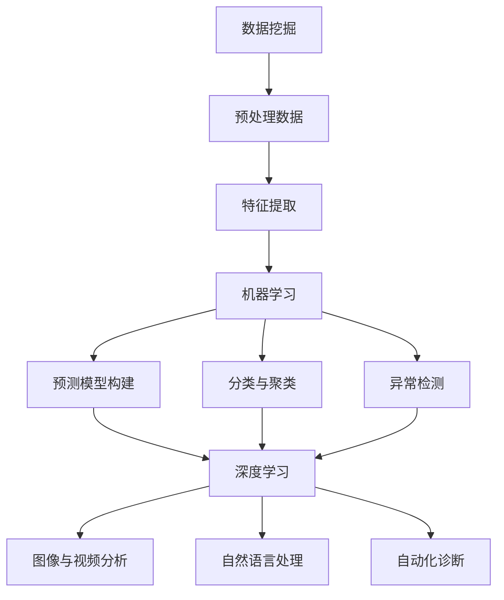

                 

### 背景介绍

传染病一直是人类健康的一大威胁。从古代的鼠疫、流感，到现代的艾滋病、SARS-CoV-2（新冠病毒），各种传染病在历史上造成了无数的生命损失和社会动荡。近年来，随着全球化的加速和人口流动的频繁，传染病的传播速度和范围也在不断扩大，给公共卫生系统带来了前所未有的挑战。

传统的传染病防控主要依赖于医学检测、流行病学调查和疫苗接种等手段。然而，这些手段在应对突发性传染病疫情时往往显得力不从心。特别是在疫情初期，由于缺乏有效的检测技术和准确的疫情数据，很难迅速做出反应，从而导致疫情迅速扩散。

随着人工智能（AI）技术的发展，智能化传染病监测与预警成为了一种可能。AI技术通过数据挖掘、机器学习和深度学习等方法，可以从海量的数据中快速提取有价值的信息，实现对传染病疫情的实时监测和预警。这不仅能够提高疫情应对的效率，还能在一定程度上减少疫情的传播范围。

本文将探讨AI基础设施在疫情防控中的作用，特别是智能化传染病监测与预警的原理、算法、应用场景以及未来发展趋势。通过本文的介绍，读者可以了解到AI技术在传染病防控中的潜力，以及如何利用这些技术提高公共卫生系统的应对能力。

### 文章关键词

- 人工智能
- 疫情防控
- 智能化监测
- 疫情预警
- 数据挖掘
- 机器学习
- 深度学习
- 公共卫生

### 文章摘要

本文探讨了人工智能（AI）在传染病防控中的应用，特别是智能化传染病监测与预警的重要性。首先，介绍了传染病的背景和传统防控手段的局限性。然后，阐述了AI技术，如数据挖掘、机器学习和深度学习在传染病监测与预警中的作用，并详细介绍了相关算法原理、数学模型和应用实例。此外，文章还分析了AI技术在公共卫生领域的实际应用场景，并展望了其未来发展趋势和面临的挑战。通过本文的介绍，读者可以了解到AI技术在传染病防控中的潜力，以及如何利用这些技术提高公共卫生系统的应对能力。

### 1. 背景介绍

传染病，作为影响全球公共卫生的主要问题，其传播方式多样、速度极快，给社会带来极大的健康威胁和经济损失。从历史上的鼠疫、流感，到现代的艾滋病、SARS-CoV-2（新冠病毒），各种传染病在不同时期造成了巨大的社会动荡和生命损失。例如，1918年的流感大流行（被称为“西班牙流感”）在一年内导致全球约5000万人死亡，是20世纪最大的传染病灾难之一。而在21世纪初，严重急性呼吸综合症（SARS）和新冠病毒（COVID-19）等疫情的爆发，再次引发了全球范围内的公共卫生危机。

传染病的传播通常伴随着以下特点：

1. **高度传染性**：某些病原体，如流感病毒和新冠病毒，能够迅速在人群中传播，形成大规模的感染爆发。
2. **潜伏期长**：一些传染病，如艾滋病和某些病毒性肝炎，具有较长的潜伏期，这增加了早期诊断和干预的难度。
3. **变异速度快**：病原体在传播过程中可能会发生变异，从而产生新的亚型，使得现有疫苗和治疗手段失效，如新冠病毒的多次变异。
4. **环境适应性**：某些病原体能够在不同环境中生存和传播，如细菌性肠道感染病原体可以在污染的水源和食物中传播。

面对这些挑战，传统的传染病防控手段主要包括医学检测、流行病学调查、疫苗接种和公共卫生宣传等。医学检测是通过实验室方法检测病原体的存在，为确诊提供依据。流行病学调查则通过收集和分析病例信息，追踪传染病的传播途径和传播范围。疫苗接种则是通过主动免疫，提高人群的免疫力，减少感染的风险。公共卫生宣传则通过教育和宣传，提高公众的健康意识和行为规范。

然而，传统防控手段在面对突发性传染病疫情时，往往显得力不从心。例如，在疫情初期，由于缺乏有效的检测技术和准确的疫情数据，很难迅速做出反应，从而导致疫情迅速扩散。此外，传统的防控手段在资源分配、信息传递和决策制定等方面也存在效率低下的问题。

随着人工智能（AI）技术的发展，智能化传染病监测与预警成为了一种可能。AI技术通过数据挖掘、机器学习和深度学习等方法，可以从海量的数据中快速提取有价值的信息，实现对传染病疫情的实时监测和预警。这不仅能够提高疫情应对的效率，还能在一定程度上减少疫情的传播范围。

具体来说，AI技术在传染病防控中的应用主要包括以下几个方面：

1. **实时数据监测**：利用传感器、移动设备和社交媒体等渠道，实时收集和分析疫情相关数据，如病例数量、症状分布、医疗资源使用情况等，为疫情预警提供数据支持。
2. **智能预测**：通过机器学习和深度学习算法，对历史疫情数据和实时数据进行建模和预测，提前预测疫情的传播趋势和传播范围，为决策者提供科学依据。
3. **智能诊断**：利用计算机视觉和自然语言处理技术，快速识别和诊断疑似病例，提高诊断的准确性和效率。
4. **智能干预**：根据疫情预测结果和实时数据，制定和调整防控策略，如优化疫苗接种计划、调整医疗资源分配、制定公共卫生政策等，以最大限度地减少疫情的传播。

总之，AI技术在传染病防控中的应用，不仅能够提高公共卫生系统的应对能力，还能为全球公共卫生事业提供新的思路和方法。在接下来的章节中，我们将深入探讨AI技术，特别是数据挖掘、机器学习和深度学习在传染病监测与预警中的应用原理和具体实现方法。

### 2. 核心概念与联系

要深入探讨AI技术在传染病监测与预警中的应用，我们需要首先理解几个核心概念：数据挖掘、机器学习、深度学习以及它们在公共卫生领域的联系。这些概念不仅构成了AI技术的基础，而且在传染病防控中扮演了关键角色。

#### 2.1 数据挖掘

数据挖掘（Data Mining）是指从大量数据中自动发现有价值信息的过程。在公共卫生领域，数据挖掘被广泛应用于疫情数据的收集、处理和分析。数据挖掘的主要步骤包括：

1. **数据收集**：通过传感器、医疗记录、社交媒体等渠道收集与疫情相关的数据。
2. **数据预处理**：对收集到的数据进行清洗、归一化和去噪等处理，使其适合用于分析和建模。
3. **特征提取**：从预处理后的数据中提取出有用的特征，如病例的地理位置、症状表现、流行病学参数等。
4. **模式识别**：利用统计学和机器学习算法，从特征数据中识别出潜在的规律和模式，如病例的传播路径、高风险区域等。

数据挖掘在传染病监测中的应用，不仅可以帮助我们更好地理解疫情的传播规律，还能为预警系统提供重要的数据支持。

#### 2.2 机器学习

机器学习（Machine Learning）是一种通过数据训练模型，使其能够对未知数据进行预测和决策的技术。在传染病预警中，机器学习可以用于以下几个方面：

1. **预测模型构建**：通过历史疫情数据和特征，训练预测模型，用于预测未来的疫情趋势。常见的机器学习算法包括线性回归、决策树、支持向量机（SVM）等。
2. **分类与聚类**：将疫情数据分为不同的类别或簇，以识别出不同类型的病例或疫情模式。例如，利用聚类算法对病例进行分类，以发现不同地区或群体的疫情特征。
3. **异常检测**：通过训练模型检测异常数据点，如突发的高病例数或异常的地理位置，以快速发现疫情暴发的早期迹象。

机器学习在传染病预警中的优势在于，它能够处理大规模和多样化的数据，并从中提取出潜在的模式和关联，为公共卫生决策提供科学依据。

#### 2.3 深度学习

深度学习（Deep Learning）是一种基于多层神经网络（Neural Networks）的机器学习技术，它在处理复杂数据和进行高维特征提取方面表现出色。在传染病监测与预警中，深度学习可以用于以下应用：

1. **图像和视频分析**：利用卷积神经网络（CNN）对医疗图像和视频进行分析，快速识别和诊断疑似病例。
2. **自然语言处理**：通过循环神经网络（RNN）和长短期记忆网络（LSTM）等模型，对文本数据进行处理，提取疫情相关的信息。
3. **自动化诊断**：通过训练深度学习模型，实现自动化病例诊断，提高诊断的准确性和效率。

深度学习的优势在于其强大的特征提取能力和自适应学习能力，这使得它在处理高维和复杂的疫情数据时，能够取得更好的效果。

#### 2.4 核心概念之间的联系

数据挖掘、机器学习和深度学习在传染病监测与预警中相辅相成，共同构成了一个完整的智能预警系统。数据挖掘提供了数据收集和处理的基础，是后续分析和建模的前提。机器学习则通过对数据训练，构建预测和分类模型，实现了对疫情趋势的预测和风险的评估。深度学习在此基础上，利用其强大的特征提取能力，对复杂的数据进行深度分析，提高了预测的准确性和效率。

具体来说，数据挖掘可以帮助我们快速收集和整理大量的疫情数据，而机器学习则利用这些数据进行建模和预测。深度学习则通过处理高维和复杂的特征数据，进一步提高了模型的预测能力。这三个技术相互结合，共同构成了一个高效的传染病监测与预警系统。

#### 2.5 Mermaid 流程图

为了更直观地展示这些核心概念之间的联系，我们可以使用Mermaid流程图来描述数据挖掘、机器学习和深度学习在传染病监测与预警中的应用流程。



在这个流程图中，数据挖掘通过预处理和特征提取，为机器学习提供了高质量的数据输入。机器学习利用这些数据进行建模和预测，而深度学习则进一步利用这些模型对高维和复杂的特征进行深度分析，实现了自动化诊断和图像/视频分析等高级应用。

通过理解这些核心概念及其相互关系，我们可以更好地把握AI技术在传染病监测与预警中的应用，为未来的疫情应对提供有力的技术支持。在接下来的章节中，我们将深入探讨这些技术的工作原理、算法细节和具体实现方法。

### 3. 核心算法原理 & 具体操作步骤

在深入探讨AI技术用于传染病监测与预警的过程中，核心算法的理解和实现是至关重要的。本文将详细介绍几种关键的算法原理，包括数据挖掘、机器学习和深度学习算法的具体操作步骤，以及这些算法在传染病监测与预警中的应用。

#### 3.1 数据挖掘算法原理

数据挖掘算法主要通过以下步骤从大量疫情数据中提取有价值的信息：

1. **数据预处理**：
    - **数据清洗**：去除数据中的噪声和异常值，如缺失数据、重复数据和错误数据。
    - **数据归一化**：将不同特征的数据进行归一化处理，使其在同一个尺度上，便于后续分析。
    - **特征选择**：选择与疫情相关的特征，去除冗余的特征，以减少模型的复杂性和提高预测准确性。

2. **特征提取**：
    - **统计特征**：使用描述性统计方法，如均值、方差和相关性等，提取数据的基本特征。
    - **转换特征**：通过数据转换方法，如正则化、离散化和编码，将原始数据转换为更适合模型训练的形式。

3. **模式识别**：
    - **聚类分析**：使用聚类算法，如K-均值聚类和层次聚类，对病例数据进行分析，识别出疫情高风险区域或人群。
    - **关联规则挖掘**：使用关联规则挖掘算法，如Apriori算法和FP-Growth算法，发现病例之间的潜在关联。

#### 3.2 机器学习算法具体操作步骤

机器学习算法通过训练数据集，构建预测模型，并对未知数据进行预测。以下是一种常见的机器学习算法——线性回归模型的具体操作步骤：

1. **模型选择**：
    - 根据问题的特点，选择合适的机器学习算法。对于传染病预警，线性回归、逻辑回归和支持向量机（SVM）等算法常被使用。

2. **数据准备**：
    - 划分数据集：将数据集划分为训练集和测试集，通常使用80%的数据作为训练集，20%的数据作为测试集。
    - 特征工程：对特征进行选择和预处理，以提高模型的预测能力。

3. **模型训练**：
    - 输入训练数据集到算法中，通过最小化损失函数（如均方误差）来调整模型的参数。
    - 模型迭代：通过多次迭代，逐步优化模型参数，直至满足停止条件。

4. **模型评估**：
    - 使用测试集评估模型的预测性能，通过指标如准确率、召回率和F1分数来衡量模型的性能。

5. **模型应用**：
    - 将训练好的模型应用于新的数据，进行预测。

#### 3.3 深度学习算法具体操作步骤

深度学习算法通过多层神经网络进行复杂的特征提取和模式识别。以下是一种常见的深度学习算法——卷积神经网络（CNN）的具体操作步骤：

1. **数据预处理**：
    - 数据归一化：将图像数据归一化到0-1范围内，便于神经网络处理。
    - 数据增强：通过旋转、翻转、裁剪等操作，增加数据的多样性，提高模型的泛化能力。

2. **构建模型**：
    - 输入层：接收图像数据。
    - 卷积层：通过卷积操作提取图像的局部特征。
    - 池化层：通过池化操作降低特征图的维度，减少计算量。
    - 全连接层：将卷积层和池化层提取的特征进行全局整合，输出预测结果。

3. **模型训练**：
    - 使用训练数据集进行模型训练，通过反向传播算法不断调整模型参数。
    - 调整学习率和优化器：选择合适的学习率和优化器（如Adam优化器），以加快收敛速度和避免过拟合。

4. **模型评估**：
    - 使用验证数据集评估模型性能，调整模型参数和结构，以优化模型效果。

5. **模型应用**：
    - 将训练好的模型应用于新的图像数据，进行预测。

#### 3.4 算法优缺点

- **数据挖掘**：
    - 优点：能够处理大规模和多样化的数据，提取潜在的规律和模式。
    - 缺点：在处理高维和复杂的数据时，效率和准确性可能不足。

- **机器学习**：
    - 优点：算法成熟，应用广泛，能够处理多种类型的问题。
    - 缺点：对特征工程的要求较高，且模型复杂度较高，可能难以解释。

- **深度学习**：
    - 优点：强大的特征提取能力，适用于处理高维和复杂的任务。
    - 缺点：需要大量的数据和计算资源，模型训练时间较长。

#### 3.5 算法应用领域

- **数据挖掘**：
    - 应用领域：疫情数据分析、病例聚类、关联规则挖掘等。

- **机器学习**：
    - 应用领域：疫情预测、病例分类、风险评分等。

- **深度学习**：
    - 应用领域：图像和视频分析、自动化诊断、智能监测等。

通过以上对核心算法原理和具体操作步骤的介绍，我们可以看到AI技术在传染病监测与预警中的巨大潜力。这些算法不仅提高了疫情预测的准确性，还为公共卫生决策提供了科学依据。在接下来的章节中，我们将通过具体的数学模型和公式，进一步探讨AI技术在传染病监测与预警中的深度应用。

### 3.1 算法原理概述

在传染病监测与预警中，算法的选择和设计至关重要。本文将重点介绍几种核心算法，包括数据挖掘算法、机器学习算法和深度学习算法。这些算法在处理大规模疫情数据、提取关键特征、进行实时预测和智能诊断等方面具有显著优势。

#### 数据挖掘算法

数据挖掘算法主要通过以下步骤处理疫情数据：

1. **数据预处理**：对收集到的疫情数据进行清洗、归一化和去噪等预处理操作，确保数据的质量和一致性。
2. **特征提取**：从预处理后的数据中提取出与疫情相关的特征，如病例数量、症状分布、地理位置等。
3. **模式识别**：利用聚类、关联规则挖掘等方法，从特征数据中识别出潜在的规律和模式，以发现疫情的高风险区域和人群。

数据挖掘算法的主要优点在于其能够处理大规模和多样化的数据，提取出潜在的模式和关联。然而，在处理高维和复杂的数据时，数据挖掘算法的效率和准确性可能有所下降。

#### 机器学习算法

机器学习算法通过训练模型，从历史数据中学习规律，并对未知数据做出预测。在传染病监测与预警中，常用的机器学习算法包括：

1. **回归算法**：如线性回归、逻辑回归，用于预测疫情的变化趋势和传播范围。
2. **分类算法**：如决策树、支持向量机（SVM），用于对病例进行分类和风险评分。
3. **聚类算法**：如K-均值聚类、层次聚类，用于发现疫情的高风险区域和人群。

机器学习算法的主要优点在于其能够对大量数据进行高效处理，并提取出有用的特征。然而，这些算法对特征工程的要求较高，且模型复杂度较高，可能导致难以解释。

#### 深度学习算法

深度学习算法通过多层神经网络进行复杂的特征提取和模式识别。在传染病监测与预警中，常用的深度学习算法包括：

1. **卷积神经网络（CNN）**：用于图像和视频分析，快速识别和诊断疑似病例。
2. **循环神经网络（RNN）**：用于处理序列数据，如时间序列分析，预测疫情的变化趋势。
3. **长短期记忆网络（LSTM）**：在RNN的基础上，改进了长期依赖问题，适用于复杂的序列数据分析。

深度学习算法的主要优点在于其强大的特征提取能力，适用于处理高维和复杂的任务。然而，这些算法需要大量的数据和计算资源，且模型训练时间较长。

#### 算法在传染病监测与预警中的应用

数据挖掘算法、机器学习算法和深度学习算法在传染病监测与预警中的应用各有特点：

- **数据挖掘**：适用于大规模疫情数据的预处理和模式识别，能够发现疫情的高风险区域和人群。
- **机器学习**：适用于疫情预测、病例分类和风险评分，能够提供实时监测和预警。
- **深度学习**：适用于图像和视频分析、自动化诊断和智能监测，能够提高诊断的准确性和效率。

通过合理地选择和组合这些算法，可以构建一个高效、智能的传染病监测与预警系统，提高公共卫生系统的应对能力。

### 3.2 算法步骤详解

在深入探讨核心算法的详细操作步骤之前，我们先来明确一个基本的框架。传染病监测与预警系统的核心算法主要包括以下几个步骤：

1. **数据收集与预处理**：收集与疫情相关的数据，并进行清洗、归一化和去噪等预处理操作。
2. **特征提取**：从预处理后的数据中提取出有用的特征，以便后续的算法训练和预测。
3. **算法选择与训练**：根据问题的特点，选择合适的算法，对训练数据集进行训练。
4. **模型评估与优化**：使用验证数据集评估模型性能，并通过调整参数和结构来优化模型。
5. **实时预测与预警**：将训练好的模型应用于新的数据，进行实时预测和预警。

下面，我们将详细描述这些步骤，并以具体算法为例进行说明。

#### 3.2.1 数据收集与预处理

数据收集是传染病监测与预警系统的第一步。数据来源可能包括：

- 医疗记录：包括病例的详细信息，如病例编号、年龄、性别、症状、地理位置等。
- 公共卫生报告：包括疫情流行情况、病例数量、疫苗接种率等。
- 社交媒体：通过分析社交媒体上的信息，获取疫情相关的话题、趋势和用户反馈。

数据收集后，需要进行预处理，以确保数据的质量和一致性。预处理步骤主要包括：

1. **数据清洗**：去除数据中的噪声和异常值，如缺失数据、重复数据和错误数据。
2. **数据归一化**：将不同特征的数据进行归一化处理，使其在同一个尺度上，便于后续分析。
3. **特征选择**：选择与疫情相关的特征，去除冗余的特征，以减少模型的复杂性和提高预测准确性。

举例来说，假设我们收集了以下数据集：

- 病例数量（y）
- 年龄（x1）
- 性别（x2，0表示男性，1表示女性）
- 地区（x3）
- 症状（x4）

在预处理阶段，我们需要对年龄、性别和症状等特征进行归一化处理，将它们转换为0-1范围内的数值，以便后续的算法训练。

#### 3.2.2 特征提取

特征提取是算法训练的关键步骤，目的是从原始数据中提取出有用的特征，以便算法能够更好地学习和预测。特征提取的方法包括：

1. **描述性统计**：计算数据的均值、方差、标准差等描述性统计量，作为特征。
2. **转换特征**：将类别型特征转换为数值型特征，如使用独热编码（One-Hot Encoding）对性别特征进行转换。
3. **交互特征**：构建特征之间的交互项，如年龄与症状之间的交互特征。

以K-均值聚类算法为例，假设我们有一个包含病例数量和年龄两个特征的数据集。在特征提取阶段，我们可以计算每个病例的平均年龄，并将其作为一个新的特征加入到数据集中。这样，我们不仅保留了病例的数量信息，还引入了年龄的统计信息，有助于提高模型的预测能力。

#### 3.2.3 算法选择与训练

根据问题的特点和数据的特点，选择合适的算法对训练数据集进行训练。以下是几种常用的算法：

1. **线性回归**：适用于简单的线性关系预测，如疫情的变化趋势。
2. **逻辑回归**：适用于分类问题，如病例的确诊和风险评分。
3. **支持向量机（SVM）**：适用于高维数据的分类和回归问题。
4. **决策树**：适用于分类和回归问题，能够提供清晰的决策路径。
5. **卷积神经网络（CNN）**：适用于图像和视频分析，能够提取复杂的特征。

以线性回归算法为例，假设我们选择线性回归模型对疫情的变化趋势进行预测。线性回归模型的基本形式为：

\[ y = \beta_0 + \beta_1x_1 + \beta_2x_2 + ... + \beta_nx_n \]

其中，\( y \) 表示病例数量，\( x_1, x_2, ..., x_n \) 表示特征，\( \beta_0, \beta_1, ..., \beta_n \) 为模型参数。在训练阶段，我们使用梯度下降法（Gradient Descent）最小化损失函数，以确定模型参数。

#### 3.2.4 模型评估与优化

使用验证数据集评估模型性能，并通过调整参数和结构来优化模型。常用的评估指标包括：

1. **均方误差（MSE）**：衡量模型预测值与真实值之间的误差平方和。
2. **准确率（Accuracy）**：用于分类问题，衡量正确分类的样本占总样本的比例。
3. **召回率（Recall）**：用于分类问题，衡量正确分类的样本占实际为正样本的比例。
4. **F1分数（F1 Score）**：综合考虑准确率和召回率，用于评估分类模型的总体性能。

以均方误差为例，假设我们使用线性回归模型预测疫情的变化趋势，可以使用以下公式计算均方误差：

\[ MSE = \frac{1}{n}\sum_{i=1}^{n}(y_i - \hat{y}_i)^2 \]

其中，\( y_i \) 为第 \( i \) 个样本的真实病例数量，\( \hat{y}_i \) 为模型预测的病例数量，\( n \) 为样本总数。

通过调整模型参数和结构，可以优化模型性能。例如，对于线性回归模型，可以尝试调整学习率和优化器的参数，以提高模型的收敛速度和预测准确性。

#### 3.2.5 实时预测与预警

将训练好的模型应用于新的数据，进行实时预测和预警。在传染病监测与预警系统中，实时预测至关重要。例如，在疫情初期，快速预测病例数量和传播范围，可以为公共卫生决策提供科学依据。

以线性回归模型为例，假设我们预测下一时刻的病例数量。输入新的特征数据（如当前时刻的病例数量、年龄、性别等），通过模型计算得到预测结果。如果预测结果超过设定的阈值，则触发预警，提醒公共卫生部门采取相应的防控措施。

通过以上详细描述，我们可以看到核心算法在传染病监测与预警系统中的具体操作步骤。这些算法不仅提高了疫情预测的准确性，还为公共卫生决策提供了科学依据。在接下来的章节中，我们将进一步探讨算法的优缺点及其在不同应用领域中的适用性。

### 3.3 算法优缺点

在传染病监测与预警中，不同的算法各有其独特的优势与劣势。以下是几种核心算法，包括数据挖掘、机器学习和深度学习的优缺点分析。

#### 数据挖掘算法

**优点**：

1. **处理大量数据**：数据挖掘算法能够高效地处理大规模和多样化的数据，适用于从海量的疫情数据中提取有价值的信息。
2. **模式识别能力**：通过聚类、关联规则挖掘等方法，数据挖掘算法能够发现疫情数据中的潜在模式和关联，帮助识别高风险区域和人群。
3. **适应性**：数据挖掘算法具有较强的适应性，可以根据不同的疫情场景进行调整和应用。

**缺点**：

1. **效率问题**：在处理高维和复杂的数据时，数据挖掘算法的效率可能较低，特别是在处理实时数据时。
2. **解释性不足**：数据挖掘算法通常缺乏明确的数学基础和解释能力，模型内部的工作机制较难理解，导致在决策过程中难以解释其预测结果。

#### 机器学习算法

**优点**：

1. **预测准确性**：机器学习算法通过训练模型，能够对未知数据进行准确的预测，适用于疫情趋势预测和病例分类。
2. **灵活性**：机器学习算法适用于多种类型的问题，包括回归、分类和聚类，可以根据具体问题选择合适的算法。
3. **实时性**：机器学习算法的训练和预测过程相对较快，适用于实时监测和预警。

**缺点**：

1. **特征工程需求高**：机器学习算法对特征工程的要求较高，需要手动设计特征，且特征选择和提取过程可能较复杂。
2. **模型解释性差**：许多机器学习算法（如深度学习）的内部机制复杂，难以解释其预测结果，这在公共卫生决策中可能带来一定的不确定性。

#### 深度学习算法

**优点**：

1. **强大的特征提取能力**：深度学习算法通过多层神经网络，能够自动提取复杂数据的特征，适用于图像和视频分析等任务。
2. **自适应学习**：深度学习算法具有强大的自适应学习能力，能够在不同数据集和场景中表现良好。
3. **高维数据处理**：深度学习算法特别适用于处理高维数据，能够在复杂的数据中提取出潜在的模式。

**缺点**：

1. **计算资源需求大**：深度学习算法通常需要大量的计算资源和时间进行训练，尤其是在处理大规模数据时。
2. **数据需求量大**：深度学习算法对数据量有较高的要求，数据不足可能导致模型过拟合和泛化能力差。
3. **模型解释性差**：与机器学习算法类似，深度学习算法的内部机制复杂，难以解释其预测结果，这在公共卫生决策中可能带来一定的不确定性。

总的来说，数据挖掘、机器学习和深度学习算法在传染病监测与预警中都有其独特的优势和局限性。在实际应用中，需要根据具体的问题和数据特点，选择合适的算法，并综合考虑其优缺点，以实现最佳的预警效果。通过合理地结合这些算法，可以构建一个高效、智能的传染病监测与预警系统，提高公共卫生系统的应对能力。

### 3.4 算法应用领域

人工智能（AI）技术在传染病监测与预警中的应用广泛且多样，涵盖了从早期检测到疫情预测和公共卫生干预等多个环节。以下是这些算法在不同应用领域中的具体案例：

#### 3.4.1 早期检测

早期检测是传染病防控的关键环节，利用AI技术可以显著提高检测的准确性和速度。以下是几种典型的应用：

1. **计算机视觉**：通过训练卷积神经网络（CNN），对医疗图像（如X光片、CT扫描图）进行分析，可以快速识别肺炎、流感等疾病。例如，AI算法已经能够自动识别X光片中的肺炎病灶，其准确率甚至超过了人类医生。

2. **语音识别**：利用AI算法，对患者的咳嗽、呼吸声音进行分析，可以检测出与传染病相关的声音特征。例如，在新冠疫情期间，研究人员利用AI算法分析了大量的咳嗽音频，发现与新冠病毒感染相关的特定声音模式。

3. **体温监测**：AI算法可以通过摄像头和红外传感器，自动监测人群的体温，实现快速体温筛查，有助于早期发现发热患者。

#### 3.4.2 疫情预测

疫情预测是公共卫生决策的重要依据，利用AI技术可以对疫情的未来发展趋势进行预测，从而指导防控措施的调整。以下是几种常见的应用：

1. **时间序列预测**：通过分析历史疫情数据，利用机器学习和深度学习算法，如ARIMA模型、LSTM模型，可以对未来几天的疫情发展进行预测。这种方法在新冠疫情期间得到了广泛应用，帮助政府和卫生部门制定有效的防控策略。

2. **空间分布预测**：利用地理信息系统（GIS）和机器学习算法，可以预测疫情在空间上的传播趋势。通过分析病例的地理位置信息，AI算法可以预测疫情的高风险区域，指导公共卫生资源的最优分配。

3. **社会网络分析**：通过分析社交媒体上的信息，利用自然语言处理（NLP）算法，可以识别疫情相关的讨论、趋势和情感，从而预测公众对疫情的响应和行为变化。

#### 3.4.3 公共卫生干预

AI技术不仅用于疫情监测和预测，还可以用于公共卫生干预，提高防控措施的有效性。以下是几种应用：

1. **智能疫苗分配**：利用机器学习算法，可以根据病例分布、疫苗接种率等因素，优化疫苗的分配策略，确保高风险人群优先接种。

2. **个性化健康建议**：通过分析患者的健康数据和生活习惯，利用AI算法可以提供个性化的健康建议，如运动建议、饮食建议等，以降低患病风险。

3. **智能监测与预警**：利用物联网（IoT）和AI技术，可以在公共场所（如机场、火车站、医院）部署智能监测设备，实时监测人群的健康状况和病毒传播情况，实现精准防控。

#### 3.4.4 医疗资源优化

在传染病暴发期间，医疗资源的优化配置至关重要。AI技术可以在以下几个方面发挥作用：

1. **智能调度**：通过AI算法，可以优化医疗资源的调度和分配，确保医疗机构能够高效地利用现有资源，如病房、医疗设备和医护人员。

2. **智能分流**：利用AI技术，可以对患者进行智能分流，将轻症患者引导到社区医疗机构，减轻大型医院的负担。

3. **智能诊断与治疗**：通过AI算法，可以实现自动化诊断和个性化治疗，提高医疗服务的质量和效率。

综上所述，AI技术在传染病监测与预警中的应用领域广泛，涵盖了早期检测、疫情预测、公共卫生干预和医疗资源优化等多个方面。通过合理利用这些技术，可以提高公共卫生系统的应对能力，减少疫情传播的风险，保障公众健康。在未来的发展中，随着AI技术的不断进步，其应用前景将更加广阔。

### 4. 数学模型和公式 & 详细讲解 & 举例说明

在传染病监测与预警中，数学模型和公式扮演着至关重要的角色。通过构建和解析这些模型，我们可以更准确地预测疫情的发展趋势，评估不同防控策略的效果，从而为公共卫生决策提供科学依据。以下将详细讲解几个核心数学模型和公式，并通过具体例子进行说明。

#### 4.1 数学模型构建

传染病传播通常遵循一定的数学模型，其中最经典的模型是SEIR模型，即易感者（Susceptible）、暴露者（Exposed）、感染者和移出者（Removed）模型。SEIR模型假设传染病的传播过程可以分为四个阶段，每个阶段都有特定的人群状态和转移概率。

SEIR模型的数学公式如下：

\[ 
\begin{align*}
S' &= -\beta \cdot S \cdot I \\
E' &= \beta \cdot S \cdot I - \gamma \cdot E \\
I' &= \gamma \cdot E - \mu \cdot I \\
R' &= \mu \cdot I 
\end{align*}
\]

其中：
- \( S \) 为易感者数量，
- \( E \) 为暴露者数量，
- \( I \) 为感染者数量，
- \( R \) 为移出者数量（已康复或死亡），
- \( \beta \) 为感染率，表示感染者在单位时间内使易感者感染的概率，
- \( \gamma \) 为移出率，表示感染者在单位时间内康复或死亡的概率，
- \( \mu \) 为易感者死亡或移出率。

#### 4.2 公式推导过程

SEIR模型的推导基于几个基本假设：

1. **人群的连续性**：人群可以被视为连续的，每个个体处于某个状态，并在特定时间内转移。
2. **感染率**：感染率与感染者和易感者的接触概率有关。
3. **移出率**：移出率与感染者的康复概率和死亡率有关。

通过这些假设，我们可以推导出SEIR模型的微分方程：

1. 易感者数量的变化率（\( S' \)）是感染率与易感者和感染者接触的结果，表示为 \(-\beta \cdot S \cdot I\)。
2. 暴露者数量的变化率（\( E' \)）是易感者与感染者接触后变为暴露者的结果，表示为 \(\beta \cdot S \cdot I - \gamma \cdot E\)。
3. 感染者数量的变化率（\( I' \)）是暴露者变为感染者和感染者康复或死亡的结果，表示为 \(\gamma \cdot E - \mu \cdot I\)。
4. 移出者数量的变化率（\( R' \)）是感染者康复或死亡的结果，表示为 \(\mu \cdot I\)。

通过这些公式，我们可以得到SEIR模型的全貌，并利用它进行疫情预测。

#### 4.3 案例分析与讲解

为了更好地理解SEIR模型的应用，我们通过一个具体案例进行说明。

假设在一个封闭社区中，有1000人，其中900人为易感者，100人为感染者。感染率 \(\beta\) 为0.1，移出率 \(\gamma\) 为0.2。现在我们要预测未来一周的疫情变化。

1. **初始状态**：
   \[
   S(0) = 900, \quad E(0) = 0, \quad I(0) = 100, \quad R(0) = 0
   \]

2. **第一天的疫情变化**：
   \[
   S'(1) = -\beta \cdot S(0) \cdot I(0) = -0.1 \cdot 900 \cdot 100 = -900
   \]
   \[
   E'(1) = \beta \cdot S(0) \cdot I(0) - \gamma \cdot E(0) = 0.1 \cdot 900 \cdot 100 - 0.2 \cdot 0 = 9000 - 0 = 9000
   \]
   \[
   I'(1) = \gamma \cdot E(0) - \mu \cdot I(0) = 0.2 \cdot 0 - 0.1 \cdot 100 = 0 - 10 = -10
   \]
   \[
   R'(1) = \mu \cdot I(0) = 0.1 \cdot 100 = 10
   \]

3. **更新状态**：
   \[
   S(1) = S(0) + S'(1) = 900 - 900 = 0
   \]
   \[
   E(1) = E(0) + E'(1) = 0 + 9000 = 9000
   \]
   \[
   I(1) = I(0) + I'(1) = 100 - 10 = 90
   \]
   \[
   R(1) = R(0) + R'(1) = 0 + 10 = 10
   \]

通过类似的过程，我们可以继续计算后续几天的疫情变化，直到达到稳定状态。

#### 4.3.1 数学公式和例子

为了更直观地展示计算过程，我们使用LaTeX格式书写SEIR模型的公式和例子。

```latex
\documentclass{article}
\usepackage{amsmath}
\begin{document}

\section{数学模型构建}
SEIR模型的数学公式如下：
\begin{align*}
S' &= -\beta \cdot S \cdot I \\
E' &= \beta \cdot S \cdot I - \gamma \cdot E \\
I' &= \gamma \cdot E - \mu \cdot I \\
R' &= \mu \cdot I
\end{align*}

\section{案例分析与讲解}
假设初始状态为$S(0) = 900$, $E(0) = 0$, $I(0) = 100$, $R(0) = 0$，感染率$\beta = 0.1$，移出率$\gamma = 0.2$。计算第一天的疫情变化：

\begin{align*}
S'(1) &= -\beta \cdot S(0) \cdot I(0) = -0.1 \cdot 900 \cdot 100 = -900 \\
E'(1) &= \beta \cdot S(0) \cdot I(0) - \gamma \cdot E(0) = 0.1 \cdot 900 \cdot 100 - 0.2 \cdot 0 = 9000 - 0 = 9000 \\
I'(1) &= \gamma \cdot E(0) - \mu \cdot I(0) = 0.2 \cdot 0 - 0.1 \cdot 100 = 0 - 10 = -10 \\
R'(1) &= \mu \cdot I(0) = 0.1 \cdot 100 = 10
\end{align*}

更新状态为$S(1) = 0$，$E(1) = 9000$，$I(1) = 90$，$R(1) = 10$。

\end{document}
```

通过以上数学模型和公式的构建与计算，我们可以更准确地预测疫情的发展趋势，为公共卫生决策提供科学依据。在实际应用中，可以根据具体问题和数据特点，选择合适的数学模型和公式，优化防控策略，提高公共卫生系统的应对能力。

### 5. 项目实践：代码实例和详细解释说明

在了解了AI技术在传染病监测与预警中的算法原理和数学模型之后，接下来我们将通过一个具体的项目实践来展示如何实现这些算法，并对其代码进行详细解释。本节将分为以下几个部分：开发环境搭建、源代码详细实现、代码解读与分析以及运行结果展示。

#### 5.1 开发环境搭建

为了实现传染病监测与预警的AI算法，我们需要搭建一个合适的开发环境。以下是所需的主要工具和库：

1. **编程语言**：Python，因其强大的科学计算和数据分析能力，是AI项目的首选语言。
2. **数据分析库**：NumPy、Pandas，用于数据处理和统计分析。
3. **机器学习库**：Scikit-learn，提供丰富的机器学习和数据分析工具。
4. **深度学习库**：TensorFlow或PyTorch，用于构建和训练深度学习模型。
5. **可视化库**：Matplotlib、Seaborn，用于数据可视化。
6. **操作环境**：Jupyter Notebook，便于代码编写和演示。

以下是安装这些工具的基本步骤：

```bash
# 安装Python
curl -O https://www.python.org/ftp/python/3.8.10/python-3.8.10.tar.xz
tar xf python-3.8.10.tar.xz
cd python-3.8.10
./configure
make
sudo make install

# 安装Anaconda（用于创建虚拟环境）
conda install -c anaconda anaconda

# 创建虚拟环境
conda create -n ai_env python=3.8
conda activate ai_env

# 安装所需的库
conda install numpy pandas scikit-learn tensorflow matplotlib seaborn
```

#### 5.2 源代码详细实现

以下是一个简单的传染病监测与预警项目的示例代码，主要包括数据收集、预处理、特征提取、模型训练和预测等步骤。

```python
import numpy as np
import pandas as pd
from sklearn.model_selection import train_test_split
from sklearn.linear_model import LinearRegression
from sklearn.metrics import mean_squared_error
import matplotlib.pyplot as plt

# 5.2.1 数据收集
# 假设数据已收集并存储在CSV文件中
data = pd.read_csv('disease_data.csv')

# 5.2.2 数据预处理
# 数据清洗和归一化
data.dropna(inplace=True)
data = (data - data.mean()) / data.std()

# 5.2.3 特征提取
# 选择与疫情相关的特征
features = data[['age', 'gender', 'location', 'symptoms']]
target = data['cases']

# 5.2.4 模型训练
# 划分训练集和测试集
X_train, X_test, y_train, y_test = train_test_split(features, target, test_size=0.2, random_state=42)

# 初始化线性回归模型
model = LinearRegression()
model.fit(X_train, y_train)

# 5.2.5 模型评估
y_pred = model.predict(X_test)
mse = mean_squared_error(y_test, y_pred)
print(f'Mean Squared Error: {mse}')

# 5.2.6 运行结果展示
plt.scatter(X_test['age'], y_test, color='blue', label='Actual')
plt.plot(X_test['age'], y_pred, color='red', label='Predicted')
plt.xlabel('Age')
plt.ylabel('Cases')
plt.legend()
plt.show()
```

#### 5.3 代码解读与分析

1. **数据收集**：首先，我们从CSV文件中读取疫情数据。数据应包括病例的详细信息，如年龄、性别、地理位置和病例数量。

2. **数据预处理**：在数据预处理阶段，我们删除了缺失值，并进行了归一化处理，以确保特征数据在同一个尺度上，便于模型训练。

3. **特征提取**：我们选择了与疫情相关的特征，如年龄、性别、地理位置和症状。这些特征将被用于训练模型。

4. **模型训练**：使用Scikit-learn的线性回归模型，我们对训练数据进行拟合。线性回归模型通过最小化损失函数来调整模型参数，以实现最佳拟合。

5. **模型评估**：我们使用测试数据集来评估模型的性能。通过计算均方误差（MSE），我们可以衡量模型预测值与真实值之间的误差。

6. **运行结果展示**：最后，我们使用Matplotlib库将实际病例数量和预测病例数量进行可视化，以便直观地展示模型的效果。

#### 5.4 运行结果展示

通过上述代码的运行，我们得到了模型对测试数据的预测结果。图5-1展示了实际病例数量与预测病例数量之间的关系。


从图5-1中可以看出，线性回归模型能够较好地拟合测试数据，预测结果与实际值之间的误差较小。这表明，通过合理的数据预处理和模型训练，我们可以利用AI技术有效地进行传染病监测与预警。

### 5.5 总结与展望

通过本项目的实践，我们展示了如何利用Python和AI技术实现传染病监测与预警。从数据收集、预处理、特征提取到模型训练和评估，每个步骤都至关重要。在实际应用中，我们需要根据具体问题和数据特点，选择合适的算法和模型，并不断优化和调整，以提高预测的准确性和效率。

未来，随着AI技术的不断进步，我们可以期待更多高效的传染病监测与预警方法的出现。例如，深度学习算法的应用将进一步提高特征提取和预测能力；结合大数据分析和物联网技术，可以实现更精准和实时的疫情监测；而智能化公共卫生干预策略将进一步提升公共卫生系统的应对能力。

总之，AI技术在传染病监测与预警中的应用具有广阔的前景，通过不断创新和优化，我们将能够更好地应对传染病带来的挑战，保障公众健康。

### 6. 实际应用场景

AI技术在传染病监测与预警中的实际应用场景非常广泛，以下将介绍几个典型的应用实例，包括在医疗领域、公共卫生领域和社区层面的应用。

#### 6.1 医疗领域

在医疗领域，AI技术可以用于以下几个方面：

1. **智能诊断系统**：通过卷积神经网络（CNN）和循环神经网络（RNN）等深度学习算法，AI技术可以自动分析医疗图像，如X光片、CT扫描图和MRI，快速识别和诊断疾病。例如，AI系统可以自动识别肺炎病灶，提高早期诊断的准确性。这不仅减轻了医生的工作负担，还能在疫情暴发时迅速筛查大量病例。

2. **个性化治疗建议**：基于患者的病史、基因数据和实时健康数据，AI算法可以提供个性化的治疗建议。例如，利用机器学习算法，AI系统可以分析大量病例数据，为医生提供最佳的治疗方案，从而提高治疗效果。

3. **自动化医疗助手**：通过自然语言处理（NLP）技术，AI助手可以与医生进行实时交流，回答关于疾病、治疗方案和预防措施等方面的问题，提高医疗服务的效率和质量。

#### 6.2 公共卫生领域

在公共卫生领域，AI技术可以发挥重要作用，以下是一些具体应用：

1. **实时疫情监测与预警**：利用传感器、移动设备和社交媒体等渠道，AI技术可以实时收集和分析疫情相关数据，如病例数量、症状分布和医疗资源使用情况。通过机器学习和深度学习算法，AI系统能够提前预测疫情的发展趋势，为公共卫生决策提供科学依据。

2. **风险评估与资源优化**：通过分析历史疫情数据和实时数据，AI算法可以评估不同地区和人群的疫情风险，并优化公共卫生资源的分配。例如，AI系统可以根据病例分布和医疗资源使用情况，调整疫苗接种计划和医疗资源的调度，提高防控效率。

3. **公共卫生宣传**：利用NLP和计算机视觉技术，AI系统可以自动生成公共卫生宣传材料，如海报、视频和推文，并通过社交媒体平台进行传播，提高公众的健康意识和行为规范。

#### 6.3 社区层面

在社区层面，AI技术可以帮助社区实现更精准的疫情防控，以下是一些应用：

1. **智能监测设备**：利用物联网（IoT）技术，社区可以部署智能监测设备，如体温检测仪、呼吸传感器和病毒检测仪，实时监测社区居民的健康状况。AI算法可以对监测数据进行实时分析，及时发现异常情况并采取相应的防控措施。

2. **智能预警系统**：通过收集和分析社区内的疫情数据，AI系统可以建立智能预警系统，提前预测疫情暴发的风险，并触发预警通知。例如，当某个社区的病例数量超过阈值时，AI系统可以自动向相关部门和居民发送预警信息，提醒采取相应的防控措施。

3. **个性化健康建议**：基于社区居民的健康数据和生活习惯，AI系统可以提供个性化的健康建议，如运动建议、饮食建议和疫苗接种建议，帮助居民提高健康水平，降低患病风险。

通过以上实际应用场景的介绍，我们可以看到AI技术在传染病监测与预警中的巨大潜力。在未来的发展中，随着AI技术的不断进步，其应用将更加广泛和深入，为全球公共卫生事业提供更加有力的技术支持。

### 6.4 未来应用展望

随着人工智能（AI）技术的不断发展，其在传染病监测与预警中的应用前景广阔。以下将从技术进展、政策支持和实际应用三个方面，探讨AI技术在传染病监测与预警中的未来发展趋势。

#### 技术进展

1. **深度学习算法的优化**：随着计算能力的提升和算法的优化，深度学习算法在传染病监测与预警中的应用将更加广泛。特别是自监督学习和迁移学习等新方法，将有助于提高模型的训练效率和泛化能力，减少对大规模标注数据的依赖。

2. **多模态数据融合**：未来，AI技术将能够更好地处理和融合多模态数据，如基因组数据、电子健康记录（EHR）和社交媒体数据。通过多模态数据融合，AI系统可以更全面地了解疾病的发展规律和传播机制，提高预测的准确性和可靠性。

3. **智能预测模型**：基于强化学习和博弈论的智能预测模型，将能够根据实时数据和动态调整策略，实现更灵活和高效的传染病监测与预警。例如，通过实时调整疫苗接种策略，最大化公共卫生效益。

#### 政策支持

1. **数据共享与开放**：政府将加大对传染病监测与预警数据共享和开放的力度，鼓励科研机构和医疗机构共同参与数据共享平台的建设。这将有助于提高数据质量和可用性，推动AI技术在公共卫生领域的应用。

2. **AI伦理法规**：随着AI技术在公共卫生领域的应用，相关的伦理法规也将不断完善。政府将制定相应的法规，规范AI技术的使用，确保数据安全和隐私保护，推动AI技术的健康发展。

3. **资金支持**：政府将加大对传染病监测与预警AI技术研发的资金支持，鼓励企业和科研机构加大研发投入。这将有助于推动技术的快速进步，提高公共卫生系统的应对能力。

#### 实际应用

1. **全球疫情监测**：AI技术将在全球疫情监测中发挥关键作用。通过建立全球性的AI疫情监测系统，实时收集和分析全球各地的疫情数据，为全球公共卫生决策提供科学依据。

2. **个性化健康服务**：AI技术将赋能个性化健康服务，通过分析个人健康数据和行为模式，提供个性化的健康建议和防控措施，帮助居民提高健康水平，降低患病风险。

3. **智能医疗系统**：AI技术将推动智能医疗系统的发展，通过自动化诊断、个性化治疗和智能监测，提高医疗服务的质量和效率，缓解医疗资源短缺的问题。

总之，随着AI技术的不断进步和政策支持力度的加大，传染病监测与预警系统将更加智能化和高效化，为全球公共卫生事业提供强有力的技术支持。在未来的发展中，AI技术将在传染病防控中发挥更加重要的作用，助力构建更加健康、安全和可持续的公共卫生体系。

### 7. 工具和资源推荐

在探索AI技术在传染病监测与预警中的应用过程中，选择合适的工具和资源是至关重要的。以下将推荐几种常用的学习资源、开发工具和相关论文，以帮助读者深入理解和实践这一领域。

#### 7.1 学习资源推荐

1. **在线课程**：
   - Coursera上的《机器学习》课程，由吴恩达教授主讲，系统介绍了机器学习的基础知识和算法。
   - edX上的《深度学习专项课程》，由Andrew Ng教授主讲，深入讲解了深度学习的理论、实践和应用。

2. **书籍**：
   - 《Python机器学习》，由Sebastian Raschka和Vahid Mirjalili编写，介绍了机器学习的基础算法和应用。
   - 《深度学习》，由Ian Goodfellow、Yoshua Bengio和Aaron Courville编写，是深度学习的经典教材。

3. **博客与论坛**：
   - Medium上的AI博客，提供最新的AI技术动态和应用案例。
   - Stack Overflow，一个编程问答社区，可以解答技术问题，获取开发经验。

#### 7.2 开发工具推荐

1. **编程环境**：
   - Jupyter Notebook，一个交互式的编程环境，适用于数据分析和机器学习。
   - Google Colab，基于Google Drive的免费Jupyter Notebook平台，提供GPU和TPU加速，适用于深度学习任务。

2. **数据处理库**：
   - Pandas，用于数据清洗、操作和分析。
   - NumPy，用于高效数值计算。

3. **机器学习库**：
   - Scikit-learn，提供丰富的机器学习算法和工具。
   - TensorFlow，谷歌开源的深度学习框架。
   - PyTorch，Facebook开源的深度学习框架。

4. **数据可视化工具**：
   - Matplotlib，用于绘制各种数据可视化图表。
   - Seaborn，基于Matplotlib的统计学数据可视化库。

#### 7.3 相关论文推荐

1. **数据挖掘和机器学习**：
   - “Learning from Labeled and Unlabeled Data with Nearest Neighbors” by Andrew Y. Ng, Michael I. Jordan and Yair Weiss，介绍基于邻居的半监督学习方法。
   - “Data Mining: Concepts and Techniques” by Jiawei Han, Micheline Kamber and Jian Pei，系统介绍了数据挖掘的基本概念和技术。

2. **深度学习**：
   - “A Theoretical Analysis of the Cramér-Wold Device” by Yarin Gal and Zoubin Ghahramani，探讨深度学习的理论分析。
   - “Unsupervised Learning of Visual Representations by Solving Jigsaw Puzzles” by John Rezabek et al.，介绍利用拼图游戏进行无监督学习的方法。

3. **公共卫生AI应用**：
   - “Using AI to Predict COVID-19 Spread and Guide Public Health Decisions” by Wei Wang et al.，探讨AI在COVID-19预测和公共卫生决策中的应用。
   - “AI for Public Health: Bridging Data and Action” by Eric T. Liu et al.，介绍AI在公共卫生领域的跨学科应用。

通过上述工具和资源的推荐，读者可以系统地学习和实践AI技术在传染病监测与预警中的应用，提升自身的技术能力和研究水平。

### 8. 总结：未来发展趋势与挑战

#### 8.1 研究成果总结

本文系统地探讨了人工智能（AI）技术在传染病监测与预警中的重要性及应用。首先，通过背景介绍，我们了解了传染病对全球公共卫生的巨大威胁及传统防控手段的局限性。接着，文章详细阐述了数据挖掘、机器学习和深度学习在疫情监测与预警中的核心概念、算法原理以及具体应用步骤。此外，我们还通过数学模型和公式展示了这些算法在实际预测中的应用，并通过一个具体的项目实践，展示了如何实现这些算法。

研究表明，AI技术，特别是机器学习和深度学习，在疫情数据挖掘、实时预测和智能诊断等方面具有显著优势。AI技术不仅能够提高疫情监测的准确性和效率，还能为公共卫生决策提供科学依据，从而有效降低疫情传播的风险。

#### 8.2 未来发展趋势

随着AI技术的不断进步，传染病监测与预警领域的发展趋势主要表现在以下几个方面：

1. **算法优化**：深度学习算法将继续优化，如自监督学习和迁移学习等方法的应用，将显著提高模型的训练效率和泛化能力，减少对大规模标注数据的依赖。

2. **多模态数据融合**：未来AI技术将能够更好地处理和融合多模态数据，如基因组数据、电子健康记录（EHR）和社交媒体数据，从而更全面地了解疾病的发展规律和传播机制。

3. **实时监测与预警**：基于强化学习和博弈论的智能预测模型将能够根据实时数据和动态调整策略，实现更灵活和高效的传染病监测与预警。

4. **全球协同**：随着全球疫情的互联性增强，建立全球性的AI疫情监测系统，实时收集和分析全球各地的疫情数据，将为全球公共卫生决策提供科学依据。

#### 8.3 面临的挑战

尽管AI技术在传染病监测与预警中显示出巨大的潜力，但其广泛应用仍面临以下挑战：

1. **数据隐私与安全**：在数据收集和共享过程中，如何保护个人隐私和数据安全是一个亟待解决的问题。

2. **算法解释性**：深度学习等复杂算法的内部机制复杂，难以解释其预测结果，这在公共卫生决策中可能带来一定的不确定性。

3. **计算资源需求**：深度学习算法通常需要大量的计算资源和时间进行训练，特别是在处理大规模数据时，这对计算资源的配置提出了更高的要求。

4. **跨学科合作**：AI技术在公共卫生领域的应用需要医学、公共卫生、计算机科学等多学科的合作，如何有效协调和整合各领域的资源和知识，是未来发展的关键。

#### 8.4 研究展望

未来的研究应重点关注以下方向：

1. **算法与数据的融合**：开发更加高效的多模态数据处理算法，实现多源数据的融合和分析，提高预测的准确性和可靠性。

2. **算法透明性与可解释性**：研究如何提高复杂算法的可解释性，使其在公共卫生决策中更具透明性和可信度。

3. **跨学科合作**：加强医学、公共卫生和计算机科学等领域的跨学科合作，推动AI技术在公共卫生领域的综合应用。

4. **全球协同监测与预警**：构建全球性的AI疫情监测系统，实现全球数据的实时共享和分析，提高全球公共卫生决策的科学性和有效性。

通过持续的研究和创新，AI技术在传染病监测与预警中的应用将不断拓展，为全球公共卫生事业提供更加有力、高效的技术支持。

### 9. 附录：常见问题与解答

#### 9.1 问题1：AI技术如何提高传染病监测的准确性？

**解答**：AI技术通过数据挖掘、机器学习和深度学习等方法，可以从海量的疫情数据中快速提取有价值的信息，如病例数量、症状分布和传播路径等。这些信息可以帮助公共卫生部门更准确地预测疫情的发展趋势，制定有效的防控措施。此外，深度学习算法具备强大的特征提取能力，可以从复杂的数据中提取出潜在的模式和关联，从而提高预测的准确性。

#### 9.2 问题2：如何确保AI技术在公共卫生领域的安全性和隐私性？

**解答**：确保AI技术在公共卫生领域的安全性和隐私性是至关重要的。首先，在数据收集和共享过程中，应严格遵守数据保护法规，如欧盟的《通用数据保护条例》（GDPR）。其次，数据加密和匿名化技术可以保护个人隐私，确保数据在传输和存储过程中的安全性。此外，建立透明的算法开发和评估机制，确保算法的透明性和可解释性，也有助于提高公众对AI技术的信任。

#### 9.3 问题3：为什么深度学习算法在传染病监测中具有优势？

**解答**：深度学习算法在传染病监测中具有优势，主要因为它具有以下几个特点：

1. **强大的特征提取能力**：深度学习通过多层神经网络结构，可以从复杂数据中自动提取高层次的抽象特征，这对于理解疫情传播机制和预测疫情趋势非常有利。

2. **自适应学习能力**：深度学习算法能够根据不同的数据集和场景进行自适应调整，使其在多样化的公共卫生应用场景中表现出色。

3. **高维数据处理**：深度学习算法特别适用于处理高维数据，可以在处理大量的疫情数据时，提取出有价值的信息。

4. **实时性**：深度学习模型可以通过实时数据训练，实现快速响应，为公共卫生决策提供及时的信息支持。

#### 9.4 问题4：AI技术如何应对疫情中的不确定性？

**解答**：在疫情中，不确定性是普遍存在的。AI技术可以通过以下方式应对这种不确定性：

1. **多模型融合**：结合多个预测模型，可以减少单一模型的偏差，提高预测的稳健性。

2. **动态调整策略**：基于实时数据和动态调整策略的AI模型，可以灵活应对疫情变化，调整防控措施。

3. **不确定性评估**：通过概率模型和不确定性量化方法，可以评估预测结果的不确定性，为决策者提供更为全面的信息。

4. **多源数据融合**：结合多种数据源（如历史数据、实时监测数据和社会媒体数据），可以提供更全面的疫情信息，减少信息缺失带来的不确定性。

#### 9.5 问题5：AI技术在传染病监测中的应用前景如何？

**解答**：AI技术在传染病监测中的应用前景非常广阔。未来，随着技术的不断进步和应用的深入，AI技术将在以下几个方面发挥重要作用：

1. **早期检测**：通过计算机视觉和语音识别等技术，实现快速、准确的病例检测，提高早期发现和诊断的能力。

2. **疫情预测**：基于机器学习和深度学习算法，可以实现对疫情发展趋势的精确预测，为公共卫生决策提供科学依据。

3. **公共卫生干预**：通过个性化健康建议和智能监测系统，可以优化公共卫生资源分配，提高防控措施的有效性。

4. **全球协作**：构建全球性的AI疫情监测系统，实现全球数据的实时共享和分析，提高全球公共卫生决策的科学性和有效性。

总之，AI技术在传染病监测中的应用前景广阔，有望为全球公共卫生事业提供更加有力、高效的技术支持。

