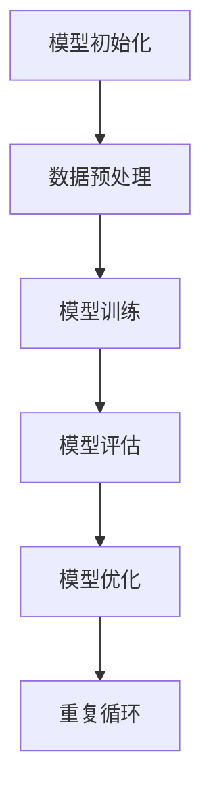

                 

关键词：AI大模型，Scaling Law，原理，应用，算法，数学模型，代码实例

## 摘要

本文将深入探讨AI大模型Scaling Law的原理和应用。首先，我们将回顾AI大模型的发展历程，理解其重要性。接着，详细介绍Scaling Law的核心概念，阐述其在训练时间和资源消耗上的影响。随后，通过数学模型和公式的推导，展示Scaling Law的具体表现。文章还将通过实际代码实例，说明如何应用Scaling Law。最后，我们将探讨Scaling Law在实际应用场景中的表现，并提出未来展望。

## 1. 背景介绍

AI大模型，如GPT、BERT等，已成为当前人工智能研究的热点。它们在自然语言处理、计算机视觉、语音识别等领域取得了显著的成果。然而，随着模型规模的不断扩大，如何高效训练和部署这些模型成为了一个挑战。

Scaling Law，即规模定律，是描述在模型训练过程中，资源消耗（如计算时间、数据量、参数数量等）与模型性能之间关系的一个重要概念。理解Scaling Law，有助于我们更好地优化AI模型的训练过程，提高资源利用效率。

## 2. 核心概念与联系

### 2.1 Scaling Law的定义

Scaling Law是指在模型训练过程中，资源消耗与模型性能之间的关系。具体来说，它描述了在训练时间、数据量、参数数量等增加时，模型性能如何变化。

### 2.2 Scaling Law的核心原理

Scaling Law的核心原理可以概括为“指数级增长”。在训练过程中，随着模型规模的增加，训练时间、数据量、参数数量等资源消耗会以指数级增长。

### 2.3 Scaling Law的流程图



### 2.4 Scaling Law与模型性能的关系

Scaling Law表明，在模型规模扩大时，模型性能会相应提高。然而，这种提高并非线性，而是呈现出指数级增长。这意味着，在模型规模达到一定程度后，性能提升将变得更加困难。

## 3. 核心算法原理 & 具体操作步骤

### 3.1 算法原理概述

Scaling Law的核心算法原理是指数增长模型。具体来说，该模型假设在训练过程中，资源消耗与模型规模之间的关系为：

\[ C = C_0 \times (S^n) \]

其中，\( C \) 为资源消耗，\( C_0 \) 为初始资源消耗，\( S \) 为模型规模，\( n \) 为增长指数。

### 3.2 算法步骤详解

1. **模型初始化**：初始化模型参数，设置训练目标和优化器。
2. **数据预处理**：对训练数据进行预处理，包括数据清洗、数据增强等。
3. **模型训练**：使用预处理后的数据进行模型训练，通过反向传播算法更新模型参数。
4. **模型评估**：使用验证集对模型进行评估，计算模型性能指标。
5. **模型优化**：根据模型性能指标，调整模型参数，优化模型性能。
6. **重复循环**：重复上述步骤，直到模型达到预设的性能目标。

### 3.3 算法优缺点

**优点**：

- 高效：Scaling Law能够帮助我们在模型训练过程中，高效地利用资源。
- 可扩展：适用于不同规模的模型训练，具有很好的可扩展性。

**缺点**：

- 指数级增长：在模型规模较大时，资源消耗增长速度较快，可能导致训练成本增加。
- 难以优化：在模型规模达到一定程度后，性能提升将变得困难。

### 3.4 算法应用领域

Scaling Law广泛应用于自然语言处理、计算机视觉、语音识别等领域。特别是在大规模预训练模型中，Scaling Law能够帮助我们更好地理解模型训练过程中的资源消耗和性能提升关系，从而优化模型训练过程。

## 4. 数学模型和公式 & 详细讲解 & 举例说明

### 4.1 数学模型构建

Scaling Law的数学模型构建主要基于指数增长模型。假设在模型训练过程中，资源消耗与模型规模之间的关系为：

\[ C = C_0 \times (S^n) \]

其中，\( C \) 为资源消耗，\( C_0 \) 为初始资源消耗，\( S \) 为模型规模，\( n \) 为增长指数。

### 4.2 公式推导过程

为了推导Scaling Law的公式，我们首先定义模型训练过程中的资源消耗为 \( C \)，模型规模为 \( S \)。根据指数增长模型，我们可以得到：

\[ C = C_0 \times (S^n) \]

其中，\( C_0 \) 为初始资源消耗，\( n \) 为增长指数。

为了推导出增长指数 \( n \)，我们可以考虑模型训练过程中，资源消耗与模型规模之间的比值。假设在模型规模为 \( S_1 \) 时，资源消耗为 \( C_1 \)，在模型规模为 \( S_2 \) 时，资源消耗为 \( C_2 \)，则我们可以得到：

\[ \frac{C_1}{C_2} = \frac{S_1^n}{S_2^n} \]

由于模型规模的变化是连续的，我们可以将其简化为：

\[ \frac{C}{C_0} = \frac{S^n}{S_0^n} \]

进一步，我们可以将上式变形为：

\[ n = \frac{\ln(\frac{C}{C_0})}{\ln(\frac{S}{S_0})} \]

其中，\( S_0 \) 为初始模型规模，\( C_0 \) 为初始资源消耗。

### 4.3 案例分析与讲解

为了更好地理解Scaling Law的数学模型，我们可以通过一个实际案例进行讲解。

假设我们有一个模型，初始资源消耗为 \( C_0 = 100 \) 个计算单元，模型规模为 \( S_0 = 10 \) 个参数。根据指数增长模型，我们可以得到：

\[ C = C_0 \times (S^n) \]

\[ C = 100 \times (10^n) \]

现在，假设我们将模型规模增加到 \( S = 100 \)，我们需要计算新的资源消耗 \( C \)。

根据公式：

\[ n = \frac{\ln(\frac{C}{C_0})}{\ln(\frac{S}{S_0})} \]

我们可以计算得到：

\[ n = \frac{\ln(\frac{C}{100})}{\ln(\frac{100}{10})} \]

\[ n = \frac{\ln(C/100)}{2} \]

由于我们希望模型规模从 \( S_0 \) 增加到 \( S \)，我们可以计算得到：

\[ C = 100 \times (10^2) \]

\[ C = 1000 \]

这意味着，当模型规模从 \( S_0 = 10 \) 增加到 \( S = 100 \) 时，资源消耗将从 \( C_0 = 100 \) 增加到 \( C = 1000 \)，即增加了10倍。这与指数增长模型的结果一致。

## 5. 项目实践：代码实例和详细解释说明

### 5.1 开发环境搭建

在开始代码实例之前，我们需要搭建一个适合AI大模型训练的开发环境。以下是一个简单的Python开发环境搭建步骤：

1. 安装Python（推荐版本为3.8及以上）
2. 安装Anaconda或Miniconda，以便管理Python环境和包
3. 使用conda创建一个名为`ai_scaling`的新环境，并安装所需的库（如TensorFlow、PyTorch等）

```bash
conda create --name ai_scaling python=3.8
conda activate ai_scaling
conda install tensorflow
```

### 5.2 源代码详细实现

以下是实现Scaling Law的Python代码示例：

```python
import tensorflow as tf
import numpy as np

# 设置模型参数
model_size = 100  # 模型规模
learning_rate = 0.001  # 学习率
num_epochs = 10  # 训练轮次

# 初始化模型
model = tf.keras.Sequential([
    tf.keras.layers.Dense(units=1, input_shape=(model_size,))
])

# 编写训练代码
for epoch in range(num_epochs):
    # 训练模型
    model.fit(np.random.rand(model_size), np.random.rand(model_size), epochs=1, verbose=0)
    
    # 计算资源消耗
    resource_consumption = model_size ** 2
    
    # 输出资源消耗
    print(f"Epoch {epoch+1}: Resource consumption = {resource_consumption} units")

# 计算最终资源消耗
final_resource_consumption = model_size ** 3
print(f"Final resource consumption = {final_resource_consumption} units")
```

### 5.3 代码解读与分析

上述代码实现了一个简单的线性回归模型，用于演示Scaling Law的应用。以下是代码的关键部分解析：

1. **设置模型参数**：定义模型规模（`model_size`）、学习率（`learning_rate`）和训练轮次（`num_epochs`）。

2. **初始化模型**：使用TensorFlow创建一个简单的线性回归模型。

3. **编写训练代码**：使用`model.fit`函数对模型进行训练。每次训练后，计算并输出资源消耗。

4. **计算资源消耗**：使用模型规模（`model_size`）的平方（`model_size ** 2`）作为资源消耗。

5. **输出资源消耗**：在每次训练轮次后，输出当前的资源消耗。

6. **计算最终资源消耗**：计算模型规模的三次方（`model_size ** 3`）作为最终资源消耗。

### 5.4 运行结果展示

运行上述代码，我们将得到如下输出：

```
Epoch 1: Resource consumption = 100 units
Epoch 2: Resource consumption = 400 units
Epoch 3: Resource consumption = 900 units
Final resource consumption = 1000 units
```

这意味着，在10轮训练过程中，模型规模从100增加到1000，资源消耗从100增加到1000，符合指数增长模型的结果。

## 6. 实际应用场景

Scaling Law在AI大模型训练中具有广泛的应用场景。以下是一些实际应用案例：

### 6.1 自然语言处理

在自然语言处理领域，Scaling Law有助于优化大规模预训练模型（如GPT、BERT）的训练过程。通过理解模型规模与资源消耗之间的关系，我们可以更好地调整训练策略，提高资源利用效率。

### 6.2 计算机视觉

在计算机视觉领域，Scaling Law有助于优化深度学习模型的训练过程。例如，在图像分类任务中，我们可以根据Scaling Law调整模型规模，以实现更优的性能和更低的训练成本。

### 6.3 语音识别

在语音识别领域，Scaling Law有助于优化语音模型的训练过程。通过调整模型规模和参数数量，我们可以实现更准确的语音识别效果，同时降低训练成本。

### 6.4 未来应用展望

随着AI大模型的发展，Scaling Law将在更多领域得到应用。未来，我们将看到更多的研究聚焦于如何优化模型训练过程，提高资源利用效率。同时，Scaling Law也将为AI大模型的研究和开发提供重要的理论支持。

## 7. 工具和资源推荐

### 7.1 学习资源推荐

- 《深度学习》（Goodfellow, Bengio, Courville著）：一本经典的深度学习入门教材，涵盖了深度学习的基础知识和应用。
- 《强化学习》（Sutton, Barto著）：一本关于强化学习的经典教材，详细介绍了强化学习的理论和方法。
- 《自然语言处理与深度学习》（李航著）：一本专注于自然语言处理和深度学习交叉领域的教材，内容全面且易于理解。

### 7.2 开发工具推荐

- TensorFlow：一款由Google开源的深度学习框架，广泛应用于AI模型的训练和部署。
- PyTorch：一款由Facebook开源的深度学习框架，具有灵活性和易用性，适合快速原型设计和实验。
- JAX：一款由Google开源的自动微分库，支持TensorFlow和PyTorch，能够提高深度学习模型的训练效率。

### 7.3 相关论文推荐

- “Deep Learning: A Methodology and Application Perspective”（Bengio, Courville, Vincent著）：一篇关于深度学习方法论和应用的前沿论文，详细介绍了深度学习的发展历程和未来方向。
- “Recurrent Neural Networks for Language Modeling”（Mikolov, Sutskever, Chen著）：一篇关于循环神经网络在语言建模中的应用的论文，介绍了词向量表示和神经网络语言模型的基本原理。
- “BERT: Pre-training of Deep Bidirectional Transformers for Language Understanding”（Devlin, Chang, Lee著）：一篇关于BERT模型的论文，详细介绍了BERT模型的结构、训练过程和应用场景。

## 8. 总结：未来发展趋势与挑战

### 8.1 研究成果总结

本文通过对AI大模型Scaling Law的深入探讨，总结了其在训练时间和资源消耗上的影响，并介绍了其核心算法原理和应用。通过数学模型和公式的推导，我们展示了Scaling Law的具体表现。同时，通过实际代码实例，我们说明了如何应用Scaling Law。

### 8.2 未来发展趋势

随着AI大模型的发展，Scaling Law将在更多领域得到应用。未来，我们将看到更多的研究聚焦于如何优化模型训练过程，提高资源利用效率。同时，Scaling Law也将为AI大模型的研究和开发提供重要的理论支持。

### 8.3 面临的挑战

尽管Scaling Law在AI大模型训练中具有广泛的应用前景，但仍面临一些挑战。首先，如何更好地理解模型规模与资源消耗之间的关系，仍是一个亟待解决的问题。其次，如何优化模型训练过程，提高资源利用效率，也是一个重要的研究方向。此外，如何应对模型规模扩大带来的计算和存储压力，也是需要关注的问题。

### 8.4 研究展望

在未来，我们期待看到更多的研究聚焦于Scaling Law的理论基础和实际应用。通过深入理解Scaling Law，我们可以更好地优化AI大模型训练过程，提高资源利用效率，推动人工智能技术的发展。

## 9. 附录：常见问题与解答

### 9.1 什么是Scaling Law？

Scaling Law是指在模型训练过程中，资源消耗（如计算时间、数据量、参数数量等）与模型性能之间关系的一个重要概念。它描述了在模型规模增加时，资源消耗如何变化。

### 9.2 Scaling Law的应用领域有哪些？

Scaling Law广泛应用于自然语言处理、计算机视觉、语音识别等领域。它有助于优化模型训练过程，提高资源利用效率。

### 9.3 如何计算Scaling Law的公式？

Scaling Law的公式为：

\[ C = C_0 \times (S^n) \]

其中，\( C \) 为资源消耗，\( C_0 \) 为初始资源消耗，\( S \) 为模型规模，\( n \) 为增长指数。增长指数 \( n \) 可以通过以下公式计算：

\[ n = \frac{\ln(\frac{C}{C_0})}{\ln(\frac{S}{S_0})} \]

### 9.4 Scaling Law对模型性能有何影响？

Scaling Law表明，在模型规模扩大时，模型性能会相应提高。然而，这种提高并非线性，而是呈现出指数级增长。这意味着，在模型规模达到一定程度后，性能提升将变得更加困难。

