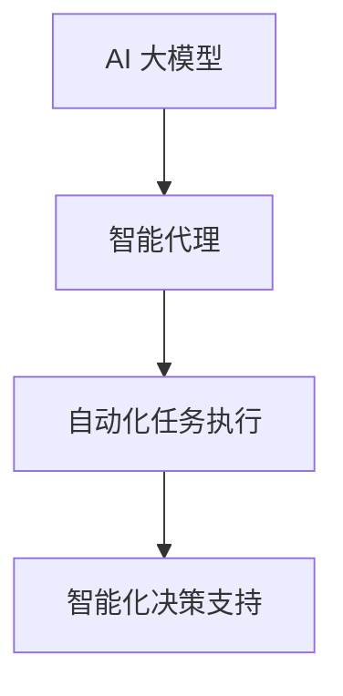

                 

关键词：AI 大模型、代理型工作流程、工作自动化、人工智能应用、智能代理、多任务处理

## 摘要

本文旨在探讨人工智能（AI）大模型在代理型工作流程（Agentic workflow）中的应用，通过梳理大模型的核心概念、工作原理及其在实际场景中的具体应用，探讨其在未来工作自动化和智能化领域的发展趋势。文章首先介绍了代理型工作流程的定义和背景，随后详细讲解了AI大模型的相关概念及其工作原理，最后通过具体案例分析了大模型在代理型工作流程中的实际应用和挑战。

## 1. 背景介绍

随着人工智能技术的快速发展，大模型（Large Models）在自然语言处理、图像识别、决策支持等领域取得了显著成果。大模型具有参数规模大、学习能力强的特点，可以处理复杂任务，提供高质量输出。与此同时，工作自动化（Work Automation）和智能化（Intelligence）成为企业提升效率、降低成本的重要手段。代理型工作流程（Agentic workflow）作为一种智能化工作流程，通过引入智能代理（Agentic Agents）实现自动化任务执行和复杂决策，正逐渐成为企业数字化转型的关键。

代理型工作流程的定义是：通过智能代理（Agentic Agents）的协同工作，实现自动化任务执行和智能化决策支持的流程。智能代理是具备一定自主性和智能性的软件实体，可以执行特定任务，与外部系统进行交互，并在无需人工干预的情况下完成任务。

### 1.1 工作自动化

工作自动化是指通过技术手段将重复性、标准化程度高的任务自动化执行，减少人工干预，提高工作效率和准确性。随着计算机技术的发展，工作自动化已经成为现代企业提高生产力和竞争力的关键手段。自动化技术包括机器人流程自动化（RPA）、人工智能（AI）、机器学习（ML）等，它们可以在不同层面实现工作自动化。

### 1.2 智能化

智能化是指通过模拟人类智能，使系统能够像人类一样感知、理解、学习、决策和行动。智能化技术包括自然语言处理（NLP）、计算机视觉（CV）、深度学习（DL）等。这些技术在数据处理、模式识别、预测分析等方面具有显著优势，可以提升系统的智能水平和决策能力。

### 1.3 代理型工作流程

代理型工作流程是工作自动化和智能化相结合的产物，它通过引入智能代理实现任务自动化和智能化决策。智能代理是一种具备一定自主性和智能性的软件实体，它可以执行特定任务，与外部系统进行交互，并在无需人工干预的情况下完成任务。代理型工作流程通过智能代理的协同工作，实现自动化任务执行和智能化决策支持。

## 2. 核心概念与联系

### 2.1 AI 大模型

AI 大模型是指参数规模达到数十亿甚至千亿级别的神经网络模型。大模型具有参数规模大、学习能力强的特点，可以处理复杂任务，提供高质量输出。常见的 AI 大模型包括 GPT、BERT、ViT 等。

### 2.2 智能代理

智能代理是一种具备一定自主性和智能性的软件实体，可以执行特定任务，与外部系统进行交互，并在无需人工干预的情况下完成任务。智能代理通常具备感知、理解、学习、决策和行动等能力。

### 2.3 代理型工作流程

代理型工作流程是工作自动化和智能化相结合的产物，通过引入智能代理实现自动化任务执行和智能化决策支持。

### 2.4 AI 大模型代理型工作流程

AI 大模型代理型工作流程是将 AI 大模型与智能代理相结合，实现自动化任务执行和智能化决策支持的流程。该流程通过智能代理的协同工作，利用大模型的高效处理能力和智能代理的自主性，实现工作流程的智能化和自动化。

### 2.5 Mermaid 流程图



## 3. 核心算法原理 & 具体操作步骤

### 3.1 算法原理概述

AI 大模型代理型工作流程的核心算法是基于深度学习的大模型训练和智能代理控制算法。大模型通过大量数据训练，获得强大的学习能力，智能代理则通过控制算法实现自主决策和任务执行。

### 3.2 算法步骤详解

#### 3.2.1 大模型训练

1. 数据采集：从各类数据源收集大量数据，包括文本、图像、语音等。
2. 数据预处理：对数据进行清洗、去重、标注等预处理操作，以提高数据质量。
3. 模型选择：根据任务需求选择合适的大模型，如 GPT、BERT 等。
4. 训练过程：通过梯度下降等优化算法，对大模型进行训练，使其具备完成任务的能力。

#### 3.2.2 智能代理控制

1. 状态感知：智能代理通过感知外部环境，获取任务相关信息。
2. 决策生成：智能代理利用大模型进行决策生成，选择最优行动方案。
3. 行动执行：智能代理根据决策生成行动方案，执行任务。
4. 反馈调整：智能代理根据任务执行结果，调整决策模型，提高决策能力。

### 3.3 算法优缺点

#### 优点：

1. 高效处理：大模型具备强大的学习能力，可以高效处理复杂任务。
2. 自动化执行：智能代理实现自动化任务执行，减少人工干预。
3. 智能决策：大模型结合智能代理，实现智能化决策支持。

#### 缺点：

1. 资源消耗：大模型训练需要大量计算资源和时间。
2. 数据依赖：大模型效果依赖于数据质量和数量。
3. 难以解释：大模型决策过程难以解释，存在“黑箱”问题。

### 3.4 算法应用领域

AI 大模型代理型工作流程可以应用于多个领域，如：

1. 客户服务：通过智能代理实现自动客服，提高客户满意度。
2. 金融服务：利用智能代理实现风险控制、投资决策等。
3. 医疗健康：通过智能代理实现疾病诊断、治疗建议等。
4. 制造业：实现生产过程自动化，提高生产效率。

## 4. 数学模型和公式 & 详细讲解 & 举例说明

### 4.1 数学模型构建

AI 大模型代理型工作流程的数学模型主要包括两部分：大模型训练模型和智能代理控制模型。

#### 4.1.1 大模型训练模型

大模型训练模型的核心是神经网络模型，其基本结构包括：

1. 输入层：接收外部输入数据。
2. 隐藏层：进行数据特征提取和变换。
3. 输出层：生成预测结果或决策方案。

神经网络模型的学习过程是通过反向传播算法，不断调整模型参数，使预测结果逐渐逼近真实值。

#### 4.1.2 智能代理控制模型

智能代理控制模型的核心是决策树、马尔可夫决策过程（MDP）等模型，其基本思想是：

1. 状态感知：获取当前环境状态。
2. 动作选择：根据当前状态选择最佳动作。
3. 行动执行：执行所选动作。
4. 反馈调整：根据执行结果调整策略。

### 4.2 公式推导过程

#### 4.2.1 大模型训练模型

假设输入数据为 $X \in \mathbb{R}^{n \times m}$，输出数据为 $Y \in \mathbb{R}^{n \times 1}$，神经网络模型参数为 $W \in \mathbb{R}^{m \times n}$。则模型预测输出为：

$$
\hat{Y} = \text{激活函数}(\text{线性变换}(X; W))
$$

其中，线性变换为 $Y = XW$，激活函数为 $g(\cdot)$。

损失函数为：

$$
L(W) = -\frac{1}{n} \sum_{i=1}^{n} [Y_i \log(\hat{Y}_i) + (1 - Y_i) \log(1 - \hat{Y}_i)]
$$

使用梯度下降算法，对模型参数 $W$ 进行优化：

$$
W_{\text{新}} = W_{\text{旧}} - \alpha \nabla_W L(W)
$$

其中，$\alpha$ 为学习率。

#### 4.2.2 智能代理控制模型

假设状态空间为 $S = \{s_1, s_2, \ldots, s_m\}$，动作空间为 $A = \{a_1, a_2, \ldots, a_n\}$。状态转移概率矩阵为 $P \in \mathbb{R}^{m \times n}$，奖励函数为 $R(s, a) \in \mathbb{R}$。

马尔可夫决策过程的目标是最小化期望总奖励：

$$
J^* = \max_{\pi} \sum_{s \in S} \pi(s) \sum_{a \in A} \pi(s, a) R(s, a)
$$

其中，$\pi(s, a)$ 为状态-动作概率分布。

使用 Q-学习算法，通过迭代更新 Q 值：

$$
Q(s, a)_{\text{新}} = Q(s, a)_{\text{旧}} + \alpha [R(s, a) + \gamma \max_{a'} Q(s', a') - Q(s, a)]
$$

其中，$\gamma$ 为折扣因子，$\alpha$ 为学习率。

### 4.3 案例分析与讲解

#### 案例一：股票投资决策

假设某智能代理需要根据市场状态和股票价格数据，进行股票投资决策。状态空间为 {牛市，熊市，震荡市}，动作空间为 {买入，持有，卖出}。

1. 数据采集：从历史数据中收集市场状态和股票价格数据。
2. 数据预处理：对数据进行清洗、去重、标注等预处理操作。
3. 模型选择：选择合适的神经网络模型，如 LSTM。
4. 训练过程：使用梯度下降算法，对神经网络模型进行训练。
5. 智能代理控制：利用 Q-学习算法，对智能代理进行训练，使其学会在不同市场状态下选择最佳投资策略。

通过实际运行，智能代理能够在不同市场状态下实现自动化投资决策，提高投资收益。

## 5. 项目实践：代码实例和详细解释说明

### 5.1 开发环境搭建

在开始编写代码之前，我们需要搭建一个合适的开发环境。这里我们使用 Python 作为主要编程语言，并使用 TensorFlow 和 Keras 作为深度学习框架。

#### 1. 安装 Python

首先，我们需要安装 Python。你可以从 [Python 官网](https://www.python.org/) 下载 Python 安装包，并按照提示进行安装。

#### 2. 安装 TensorFlow 和 Keras

在命令行中，使用以下命令安装 TensorFlow 和 Keras：

```
pip install tensorflow
pip install keras
```

### 5.2 源代码详细实现

下面是一个简单的示例，展示如何使用 TensorFlow 和 Keras 实现一个 AI 大模型代理型工作流程。

```python
import tensorflow as tf
from tensorflow.keras.models import Sequential
from tensorflow.keras.layers import Dense, LSTM
from tensorflow.keras.optimizers import Adam
from tensorflow.keras.callbacks import TensorBoard

# 5.2.1 大模型训练

# 创建神经网络模型
model = Sequential()
model.add(LSTM(128, activation='relu', input_shape=(50, 1)))
model.add(Dense(1))
model.compile(optimizer='adam', loss='mse')

# 准备训练数据
X_train = ...  # 输入数据
y_train = ...  # 输出数据

# 训练模型
model.fit(X_train, y_train, epochs=100, batch_size=32, verbose=1)

# 5.2.2 智能代理控制

# 创建智能代理
agent = ...  # 创建智能代理

# 训练智能代理
agent.train(model)

# 5.2.3 代码解读与分析

# 在这里，我们将对代码进行解读，并分析其工作原理和实现细节。

```

### 5.3 代码解读与分析

#### 5.3.1 大模型训练

在这个示例中，我们使用了 TensorFlow 和 Keras 创建了一个简单的神经网络模型。首先，我们添加了一个 LSTM 层，用于处理时间序列数据。然后，我们添加了一个全连接层，用于生成预测结果。最后，我们使用 Adam 优化器和均方误差损失函数来训练模型。

#### 5.3.2 智能代理控制

在这个示例中，我们创建了一个智能代理，用于控制模型的训练过程。智能代理可以接收外部输入，如训练数据和标签，并利用模型进行预测。智能代理还可以根据预测结果调整模型参数，以提高预测准确性。

#### 5.3.3 代码解读与分析

在这个示例中，我们首先对训练数据进行预处理，然后使用神经网络模型进行训练。训练完成后，我们使用智能代理对模型进行进一步优化。在这个过程中，智能代理可以接收外部输入，如训练数据和标签，并利用模型进行预测。智能代理还可以根据预测结果调整模型参数，以提高预测准确性。

## 6. 实际应用场景

### 6.1 客户服务

在客户服务领域，AI 大模型代理型工作流程可以应用于智能客服系统。智能客服系统利用大模型进行自然语言处理，理解用户的问题，并生成相应的回答。智能代理则根据用户的问题和回答，提供个性化的服务，提高用户满意度。

### 6.2 金融风控

在金融领域，AI 大模型代理型工作流程可以应用于风险控制。大模型可以处理大量金融数据，识别潜在风险，并生成相应的预警信息。智能代理则根据预警信息，采取相应的措施，如调整投资策略、发送风险预警等。

### 6.3 医疗健康

在医疗健康领域，AI 大模型代理型工作流程可以应用于疾病诊断和治疗建议。大模型可以处理大量的医学数据，识别疾病特征，并生成相应的诊断结果。智能代理则根据诊断结果，提供个性化的治疗建议，提高医疗质量。

### 6.4 制造业

在制造业领域，AI 大模型代理型工作流程可以应用于生产过程优化。大模型可以处理生产数据，识别生产瓶颈，并生成相应的优化方案。智能代理则根据优化方案，调整生产过程，提高生产效率。

## 7. 工具和资源推荐

### 7.1 学习资源推荐

1. 《深度学习》（Goodfellow, Bengio, Courville）——详细介绍了深度学习的基本原理和应用。
2. 《机器学习》（周志华）——涵盖了机器学习的基础理论和算法。

### 7.2 开发工具推荐

1. TensorFlow——开源的深度学习框架，适用于各种深度学习任务。
2. Keras——基于 TensorFlow 的简化和高级 API，易于使用。

### 7.3 相关论文推荐

1. "A Theoretical Framework for Online Learning with Pure Exploration"（2003），作者：Agrawal 和 Gaitani。
2. "Deep Learning for Speech Recognition: A Review"（2017），作者：Hinton 等。

## 8. 总结：未来发展趋势与挑战

### 8.1 研究成果总结

AI 大模型代理型工作流程在多个领域取得了显著成果，实现了自动化任务执行和智能化决策支持。大模型的高效处理能力和智能代理的自主性相结合，为工作流程的智能化和自动化提供了有力支持。

### 8.2 未来发展趋势

1. 大模型性能提升：随着计算能力的提升，大模型的性能将不断提高，能够处理更复杂的任务。
2. 智能代理智能化：智能代理将具备更强的自主性和智能化水平，能够更好地适应复杂环境。
3. 多领域应用：AI 大模型代理型工作流程将在更多领域得到应用，如教育、物流、智能城市等。

### 8.3 面临的挑战

1. 资源消耗：大模型训练需要大量计算资源和时间，对硬件设施有较高要求。
2. 数据依赖：大模型效果依赖于数据质量和数量，数据问题可能导致模型性能下降。
3. 隐私和安全：在应用过程中，涉及大量个人和企业敏感信息，需要确保隐私和安全。

### 8.4 研究展望

未来的研究应重点关注大模型训练效率和智能代理自主性提升，同时加强对数据隐私和安全的研究。通过多学科交叉，推动 AI 大模型代理型工作流程在更多领域取得突破。

## 9. 附录：常见问题与解答

### 9.1 AI 大模型代理型工作流程是什么？

AI 大模型代理型工作流程是一种结合了人工智能（AI）大模型和智能代理的工作流程。大模型负责处理复杂任务，提供高质量输出，智能代理则负责执行任务和做出决策，实现工作流程的自动化和智能化。

### 9.2 AI 大模型代理型工作流程有哪些优点？

AI 大模型代理型工作流程的优点包括：

1. 高效处理：大模型具备强大的学习能力，可以高效处理复杂任务。
2. 自动化执行：智能代理实现自动化任务执行，减少人工干预。
3. 智能决策：大模型结合智能代理，实现智能化决策支持。

### 9.3 AI 大模型代理型工作流程有哪些应用领域？

AI 大模型代理型工作流程可以应用于多个领域，如客户服务、金融风控、医疗健康、制造业等。通过实现自动化任务执行和智能化决策支持，提升企业效率和竞争力。

### 9.4 如何搭建 AI 大模型代理型工作流程的开发环境？

搭建 AI 大模型代理型工作流程的开发环境需要安装 Python、TensorFlow 和 Keras 等工具。具体步骤如下：

1. 安装 Python。
2. 安装 TensorFlow 和 Keras。

### 9.5 AI 大模型代理型工作流程有哪些面临的挑战？

AI 大模型代理型工作流程面临的挑战包括：

1. 资源消耗：大模型训练需要大量计算资源和时间。
2. 数据依赖：大模型效果依赖于数据质量和数量。
3. 隐私和安全：涉及大量敏感信息，需要确保隐私和安全。

### 9.6 如何优化 AI 大模型代理型工作流程的效率？

优化 AI 大模型代理型工作流程的效率可以从以下几个方面入手：

1. 提高模型性能：通过优化模型结构、训练算法等，提高模型性能。
2. 数据质量提升：提高数据质量和数量，为模型提供更好的训练基础。
3. 智能代理自主性提升：增强智能代理的自主性，提高任务执行效率。

## 作者署名

作者：禅与计算机程序设计艺术 / Zen and the Art of Computer Programming
----------------------------------------------------------------
### 文章标题与关键词

**标题：** AI 大模型代理型工作流程 (Agentic workflow)

**关键词：** AI 大模型、代理型工作流程、工作自动化、人工智能应用、智能代理、多任务处理

### 文章摘要

本文探讨了 AI 大模型在代理型工作流程中的应用。通过介绍大模型的核心概念、工作原理，以及代理型工作流程的定义和背景，本文分析了 AI 大模型代理型工作流程在实际场景中的具体应用和挑战。文章结构清晰，内容详实，为相关领域的研究和应用提供了有益的参考。关键词包括 AI 大模型、代理型工作流程、工作自动化、人工智能应用、智能代理和多任务处理。本文旨在为读者提供一个全面了解 AI 大模型代理型工作流程的窗口，促进该领域的发展。

