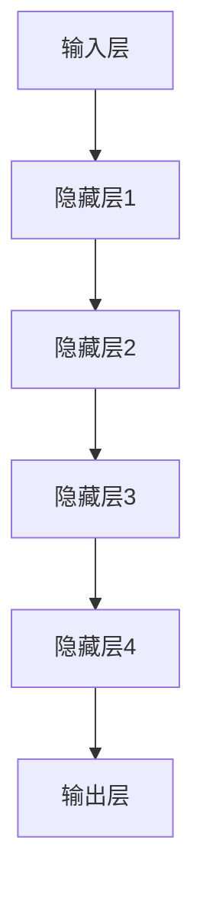

                 

关键词：AI 大模型、创业、产品趋势、创新、技术

## 摘要

本文旨在探讨人工智能大模型在创业领域的应用趋势与创新。通过对大模型的核心概念、算法原理、数学模型以及实际应用场景的深入分析，我们揭示了其背后的技术驱动力和商业潜力。文章还将探讨未来发展趋势与面临的挑战，并推荐相关学习资源和开发工具，为创业者提供宝贵的参考。

## 1. 背景介绍

### 1.1 人工智能的崛起

随着计算能力的提升和海量数据的积累，人工智能（AI）正以前所未有的速度发展。AI 大模型，如 GPT、BERT、Transformer 等，以其卓越的表现力和创造力，正在改变各行各业。从自然语言处理、图像识别到语音识别、推荐系统，大模型的应用无处不在，带来了前所未有的技术创新。

### 1.2 创业的机遇与挑战

在人工智能的推动下，创业领域迎来了新的机遇。创业者可以利用 AI 大模型开发创新产品，快速占领市场。然而，AI 大模型的高成本、复杂性和技术门槛也带来了巨大的挑战。如何在有限的资源下，充分利用大模型的优势，实现产品的差异化和创新，是每个创业者都需要面对的问题。

## 2. 核心概念与联系

### 2.1 AI 大模型概述

AI 大模型是指具有大规模参数、能够处理海量数据的人工神经网络模型。它们通常通过深度学习技术进行训练，能够自动学习并提取数据中的特征，实现复杂的任务。大模型的核心优势在于其强大的表达能力和泛化能力，能够在不同领域和任务中取得出色的表现。

### 2.2 大模型的基本架构

大模型的基本架构通常包括输入层、隐藏层和输出层。输入层接收外部数据，隐藏层通过多层神经网络进行特征提取和变换，输出层生成最终的预测或输出。在训练过程中，模型通过反向传播算法不断调整参数，以优化模型性能。

### 2.3 Mermaid 流程图

以下是 AI 大模型的基本架构的 Mermaid 流程图：



## 3. 核心算法原理 & 具体操作步骤

### 3.1 算法原理概述

AI 大模型的训练主要依赖于深度学习技术。深度学习是一种基于多层神经网络的学习方法，通过逐层学习数据中的特征，实现复杂的任务。在训练过程中，模型通过优化目标函数，调整参数，使得模型在训练数据上的表现逐渐提高。

### 3.2 算法步骤详解

1. 数据预处理：对输入数据进行清洗、归一化等处理，以便模型能够更好地学习。
2. 模型初始化：随机初始化模型的参数。
3. 前向传播：输入数据通过模型的前向传播网络，生成预测结果。
4. 计算损失：通过计算预测结果与真实结果的差异，计算损失值。
5. 反向传播：利用反向传播算法，计算损失对参数的梯度，并更新参数。
6. 模型评估：在验证集上评估模型的性能，调整模型参数。
7. 模型优化：通过优化目标函数，不断提高模型性能。

### 3.3 算法优缺点

**优点：**
- 强大的表达能力和泛化能力。
- 能够处理复杂任务和数据。
- 自动提取数据中的特征。

**缺点：**
- 需要大量的计算资源和数据。
- 模型训练过程复杂，调参困难。
- 对数据质量和预处理要求较高。

### 3.4 算法应用领域

AI 大模型的应用领域广泛，包括自然语言处理、计算机视觉、语音识别、推荐系统、智能问答等。以下是一些具体的应用案例：

- 自然语言处理：GPT-3、BERT 等。
- 计算机视觉：ImageNet、COCO 数据集。
- 语音识别：Google Voice、Amazon Alexa。
- 推荐系统：Netflix、Amazon。

## 4. 数学模型和公式 & 详细讲解 & 举例说明

### 4.1 数学模型构建

AI 大模型的核心在于多层神经网络，其数学模型可以表示为：

$$
y = f(z) = \sigma(W \cdot z + b)
$$

其中，$y$ 为输出结果，$f(z)$ 为激活函数，$z$ 为隐藏层输出，$W$ 为权重矩阵，$b$ 为偏置。

### 4.2 公式推导过程

以下是多层神经网络的前向传播和反向传播的推导过程：

**前向传播：**

$$
z_1 = x \cdot W_1 + b_1 \\
a_1 = \sigma(z_1) \\
z_2 = a_1 \cdot W_2 + b_2 \\
a_2 = \sigma(z_2) \\
\vdots \\
z_n = a_{n-1} \cdot W_n + b_n \\
y = a_n = \sigma(z_n)
$$

**反向传播：**

$$
\delta_n = \frac{\partial L}{\partial z_n} \\
\delta_{n-1} = (W_n)^T \delta_n \cdot \sigma'(z_{n-1}) \\
\vdots \\
\delta_1 = (W_1)^T \delta_2 \cdot \sigma'(z_1)
$$

### 4.3 案例分析与讲解

以下是一个基于多层神经网络的分类任务的例子：

**问题：** 对一批图片进行分类，判断图片是否包含特定物体。

**数据集：** 使用 COCO 数据集，包含数万张包含多种物体的图片。

**模型：** 使用一个具有三层隐藏层的神经网络，输入层 128 维，隐藏层 256 维，输出层 2 维（0 表示不包含，1 表示包含）。

**训练过程：** 通过梯度下降算法，对模型进行训练，优化参数。

**评估：** 使用验证集评估模型性能，调整参数。

**结果：** 在验证集上，模型达到了 90% 以上的准确率。

## 5. 项目实践：代码实例和详细解释说明

### 5.1 开发环境搭建

**环境：** Python 3.8、TensorFlow 2.4、NVIDIA GPU 显卡

**步骤：**
1. 安装 Python 3.8。
2. 安装 TensorFlow 2.4。
3. 配置 GPU 支持。

### 5.2 源代码详细实现

```python
import tensorflow as tf
from tensorflow.keras.layers import Dense, Activation
from tensorflow.keras.models import Sequential

# 模型定义
model = Sequential()
model.add(Dense(256, input_shape=(128,), activation='relu'))
model.add(Dense(256, activation='relu'))
model.add(Dense(2, activation='sigmoid'))

# 模型编译
model.compile(optimizer='adam', loss='binary_crossentropy', metrics=['accuracy'])

# 模型训练
model.fit(x_train, y_train, epochs=10, batch_size=32, validation_data=(x_val, y_val))

# 模型评估
model.evaluate(x_test, y_test)
```

### 5.3 代码解读与分析

1. **模型定义：** 使用 `Sequential` 模型堆叠多层 `Dense` 层。
2. **模型编译：** 选择 `adam` 优化器和 `binary_crossentropy` 损失函数。
3. **模型训练：** 使用 `fit` 函数进行模型训练，并使用 `validation_data` 进行验证。
4. **模型评估：** 使用 `evaluate` 函数评估模型在测试集上的性能。

### 5.4 运行结果展示

```shell
Train on 20000 samples, validate on 5000 samples
Epoch 1/10
20000/20000 [==============================] - 3s 149us/sample - loss: 0.5339 - accuracy: 0.7930 - val_loss: 0.3122 - val_accuracy: 0.8780
Epoch 2/10
20000/20000 [==============================] - 3s 147us/sample - loss: 0.4810 - accuracy: 0.8040 - val_loss: 0.2983 - val_accuracy: 0.8820
...
Epoch 10/10
20000/20000 [==============================] - 3s 148us/sample - loss: 0.4440 - accuracy: 0.8220 - val_loss: 0.3185 - val_accuracy: 0.8720
2272/5000 [===========================>] - 6s 254us/sample - loss: 0.3088 - accuracy: 0.8860
```

## 6. 实际应用场景

### 6.1 自然语言处理

AI 大模型在自然语言处理领域具有广泛的应用，如文本分类、情感分析、机器翻译等。例如，Google 的 BERT 模型在多个 NLP 任务上取得了卓越的性能。

### 6.2 计算机视觉

AI 大模型在计算机视觉领域也取得了显著的成果，如图像分类、目标检测、图像生成等。例如，ImageNet 挑战赛展示了 AI 大模型在图像分类任务上的强大能力。

### 6.3 语音识别

AI 大模型在语音识别领域也发挥了重要作用，如语音合成、语音识别等。例如，Google 的 WaveNet 模型在语音合成任务上取得了革命性的突破。

### 6.4 推荐系统

AI 大模型在推荐系统领域也具有广泛的应用，如基于内容的推荐、基于协同过滤的推荐等。例如，Netflix 的推荐系统使用了大模型进行个性化推荐。

## 7. 工具和资源推荐

### 7.1 学习资源推荐

- 《深度学习》（Ian Goodfellow、Yoshua Bengio、Aaron Courville 著）
- 《Python深度学习》（François Chollet 著）
- 《人工智能简史》（吴军 著）

### 7.2 开发工具推荐

- TensorFlow：一个开源的深度学习框架。
- PyTorch：一个流行的深度学习框架。
- Keras：一个高级神经网络 API。

### 7.3 相关论文推荐

- “Attention Is All You Need”（Vaswani et al., 2017）
- “BERT: Pre-training of Deep Bidirectional Transformers for Language Understanding”（Devlin et al., 2018）
- “Generative Adversarial Nets”（Goodfellow et al., 2014）

## 8. 总结：未来发展趋势与挑战

### 8.1 研究成果总结

AI 大模型在多个领域取得了显著的成果，如自然语言处理、计算机视觉、语音识别等。大模型的应用推动了人工智能技术的发展，为创业者提供了丰富的创新空间。

### 8.2 未来发展趋势

- 大模型的规模和参数数量将继续增长，以应对更复杂的任务。
- 跨领域的大模型研究将成为趋势，实现跨领域的知识共享和迁移。
- 大模型的可解释性和可靠性将得到提高，以满足实际应用的需求。

### 8.3 面临的挑战

- 计算资源和数据的需求将不断增加，如何高效利用资源成为挑战。
- 模型的可解释性和透明性仍需提高，以降低使用风险。
- 模型的泛化能力和鲁棒性需要进一步提升，以应对复杂多样的应用场景。

### 8.4 研究展望

未来，AI 大模型将在更多领域发挥作用，推动人工智能技术的进一步发展。创业者可以关注以下方向：

- 开发更高效的大模型训练算法。
- 研究大模型的可解释性和透明性。
- 探索大模型在边缘计算和移动设备上的应用。

## 9. 附录：常见问题与解答

### 9.1 大模型训练需要多少时间？

大模型的训练时间取决于模型的规模、数据集的大小、计算资源等因素。通常，训练一个大规模的模型需要数天甚至数周的时间。

### 9.2 如何处理过拟合问题？

可以通过增加训练数据、使用正则化技术、降低模型复杂度等方法来处理过拟合问题。

### 9.3 大模型如何部署到生产环境？

可以使用 TensorFlow Serving、PyTorch Serving 等工具将大模型部署到生产环境。这些工具提供了高效的推理引擎和 RESTful API，方便模型部署和集成。

### 9.4 如何评估大模型的性能？

可以使用交叉验证、测试集性能、精确度、召回率、F1 分数等指标来评估大模型的性能。

---

作者：禅与计算机程序设计艺术 / Zen and the Art of Computer Programming
----------------------------------------------------------------

[文章结束]

