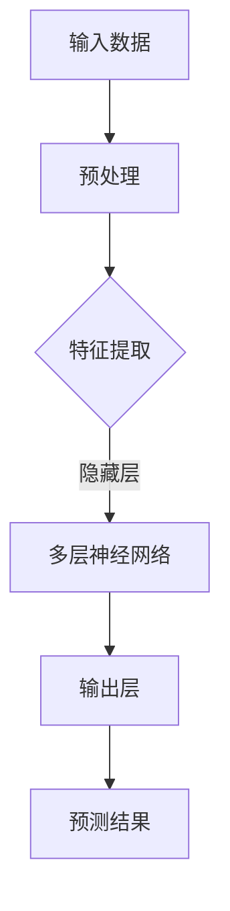

                 

关键词：人工智能，大模型，创业，人才优势，深度学习，算法，数学模型，实践应用，未来展望

## 摘要

在人工智能时代，大型深度学习模型的创业活动成为了创新科技领域的一大热点。本文将探讨如何在AI大模型创业中充分利用人才优势，从技术、管理和市场等多个层面进行分析。通过深入剖析核心算法原理、数学模型构建以及实际应用场景，本文旨在为创业者提供一套系统性的指导方案，帮助他们更好地利用人才资源，实现创业项目的成功。

## 1. 背景介绍

人工智能（AI）作为21世纪最具变革性的技术之一，已经渗透到我们生活的方方面面。从智能助手、自动驾驶到医疗诊断和金融分析，AI的应用案例层出不穷。近年来，随着计算能力的提升和数据的爆炸式增长，深度学习技术得到了快速发展，尤其是大模型（如GPT、BERT等）的崛起，更是推动了AI领域的革命性进步。

大模型具有处理海量数据、理解复杂任务的能力，成为了许多创新应用的核心。然而，大模型的开发和应用并非易事，它需要强大的技术积累和深厚的人才储备。在此背景下，如何有效利用人才优势，成为了AI大模型创业的重要课题。

## 2. 核心概念与联系

### 2.1 深度学习技术概述

深度学习是AI的一个重要分支，它通过构建多层次的神经网络模型，模拟人脑的神经网络结构，从而实现对数据的自动特征学习和模式识别。深度学习的核心在于“层次化”和“非线性”的模型架构，这使得它能够处理复杂数据和任务。

### 2.2 大模型原理与架构

大模型通常指的是参数规模超过亿级别甚至万亿级别的神经网络模型。这些模型通过大量数据进行训练，能够捕捉到数据中的深层特征，从而实现高效的预测和决策。大模型的架构通常包括输入层、隐藏层和输出层，每一层都能够对输入数据进行处理和转换，最终输出结果。

### 2.3 Mermaid 流程图



上述Mermaid流程图展示了深度学习大模型的基本处理流程：输入数据经过预处理后，通过多层神经网络进行特征提取和转换，最终输出预测结果。

## 3. 核心算法原理 & 具体操作步骤

### 3.1 算法原理概述

深度学习大模型的核心算法是基于反向传播（Backpropagation）算法和梯度下降（Gradient Descent）优化方法。反向传播算法通过多层神经网络，从输出层向输入层反向传播误差，计算各层神经元的误差梯度。梯度下降优化方法则通过调整网络参数，使误差最小化，从而优化模型性能。

### 3.2 算法步骤详解

1. **数据预处理**：对输入数据进行归一化、去噪声等处理，以提高模型的训练效果。
2. **初始化参数**：随机初始化网络权重和偏置。
3. **前向传播**：将输入数据通过神经网络传递到输出层，计算输出结果和误差。
4. **反向传播**：计算各层神经元的误差梯度。
5. **梯度下降优化**：根据梯度方向调整网络参数，使误差最小化。
6. **迭代训练**：重复执行前向传播和反向传播，直到达到预设的收敛条件。

### 3.3 算法优缺点

**优点**：
- 能够处理大规模数据和复杂任务。
- 自动学习数据中的特征，无需人工干预。
- 在图像识别、自然语言处理等领域表现出色。

**缺点**：
- 训练过程需要大量计算资源和时间。
- 参数调整复杂，容易陷入局部最优。
- 对数据质量和标注有较高要求。

### 3.4 算法应用领域

深度学习大模型在多个领域都有广泛应用，包括但不限于：
- 图像识别：如人脸识别、物体检测等。
- 自然语言处理：如机器翻译、情感分析等。
- 医疗诊断：如癌症检测、疾病预测等。
- 金融分析：如风险控制、股票预测等。

## 4. 数学模型和公式 & 详细讲解 & 举例说明

### 4.1 数学模型构建

深度学习大模型的数学模型主要包括两部分：神经网络的架构和损失函数。

#### 神经网络架构

神经网络由多个层次组成，包括输入层、隐藏层和输出层。每个层次由多个神经元（或节点）构成，神经元之间的连接形成网络的架构。神经元的激活函数通常使用Sigmoid、ReLU等。

#### 损失函数

损失函数用于衡量模型预测结果与实际结果之间的差距。常用的损失函数包括均方误差（MSE）、交叉熵（Cross-Entropy）等。

### 4.2 公式推导过程

#### 前向传播

输入数据 \( x \) 通过网络传递，计算输出 \( y \)：

\[ y = \sigma(W \cdot x + b) \]

其中，\( W \) 为权重矩阵，\( b \) 为偏置向量，\( \sigma \) 为激活函数。

#### 反向传播

计算输出层误差 \( \delta \)：

\[ \delta = \frac{\partial L}{\partial y} \cdot \sigma'(y) \]

其中，\( L \) 为损失函数，\( \sigma' \) 为激活函数的导数。

#### 更新权重和偏置

\[ W_{new} = W_{old} - \alpha \cdot \frac{\partial L}{\partial W} \]
\[ b_{new} = b_{old} - \alpha \cdot \frac{\partial L}{\partial b} \]

其中，\( \alpha \) 为学习率。

### 4.3 案例分析与讲解

假设有一个简单的线性回归模型，预测房价 \( y \)：

\[ y = Wx + b \]

使用均方误差（MSE）作为损失函数，目标是最小化 \( L = \frac{1}{2} \sum_{i=1}^{n} (y_i - \hat{y}_i)^2 \)。

通过反向传播计算误差梯度，更新权重和偏置，直到损失函数收敛。

## 5. 项目实践：代码实例和详细解释说明

### 5.1 开发环境搭建

在Python环境中安装TensorFlow库，用于构建和训练深度学习模型。

### 5.2 源代码详细实现

以下是一个简单的神经网络模型，用于预测房价：

```python
import tensorflow as tf

# 定义模型
model = tf.keras.Sequential([
    tf.keras.layers.Dense(units=1, input_shape=[1])
])

# 编译模型
model.compile(optimizer='sgd', loss='mean_squared_error')

# 训练模型
model.fit(x_train, y_train, epochs=100)

# 预测结果
predictions = model.predict(x_test)
```

### 5.3 代码解读与分析

上述代码实现了一个简单的线性回归模型，使用TensorFlow库构建和训练。首先，定义了一个序列模型，包含一个全连接层（Dense Layer），输出层只有一个神经元。然后，编译模型并使用随机梯度下降（SGD）优化器进行训练。最后，使用训练好的模型进行预测。

### 5.4 运行结果展示

在训练过程中，损失函数逐渐减小，模型的预测误差逐渐降低。通过查看训练集和测试集的预测结果，可以评估模型的性能。

## 6. 实际应用场景

AI大模型在多个领域都有广泛应用，以下是一些典型应用场景：

- **图像识别**：应用于人脸识别、物体检测、自动驾驶等。
- **自然语言处理**：应用于机器翻译、情感分析、问答系统等。
- **医疗诊断**：应用于疾病预测、药物发现、医学影像分析等。
- **金融分析**：应用于风险控制、股票预测、信贷评估等。

## 7. 未来应用展望

随着AI技术的不断进步，AI大模型的应用领域将进一步扩大，包括但不限于：

- **智能制造**：用于生产过程优化、质量检测、智能机器人等。
- **智慧城市**：用于交通管理、能源管理、公共安全等。
- **生物科技**：用于基因编辑、药物研发、疾病预防等。

## 8. 工具和资源推荐

### 8.1 学习资源推荐

- 《深度学习》（Goodfellow、Bengio、Courville著）
- 《Python深度学习》（François Chollet著）
- Coursera、Udacity等在线课程

### 8.2 开发工具推荐

- TensorFlow
- PyTorch
- Keras

### 8.3 相关论文推荐

- “A Theoretically Grounded Application of Dropout in Recurrent Neural Networks”
- “Attention Is All You Need”
- “Generative Adversarial Nets”

## 9. 总结：未来发展趋势与挑战

### 9.1 研究成果总结

近年来，深度学习大模型在AI领域取得了显著的成果，推动了各个行业的创新发展。然而，大模型的训练和应用仍面临诸多挑战，包括计算资源消耗、数据质量和模型解释性等。

### 9.2 未来发展趋势

- **硬件加速**：GPU、TPU等专用硬件的普及，将加速大模型的训练和推理。
- **模型压缩**：通过模型压缩技术，降低模型参数规模，提高推理效率。
- **联邦学习**：通过联邦学习技术，保护用户隐私，实现分布式训练。

### 9.3 面临的挑战

- **数据质量**：高质量的数据是大模型训练的关键，需要解决数据标注和清洗等问题。
- **计算资源**：大模型训练需要大量计算资源，如何高效利用现有资源仍是一个挑战。
- **模型解释性**：提高模型的可解释性，增强用户对AI的信任。

### 9.4 研究展望

未来，深度学习大模型将在更多领域得到应用，推动AI技术的发展。同时，研究如何高效利用人才资源，解决训练和应用中的挑战，将是AI大模型创业的重要方向。

## 附录：常见问题与解答

**Q：如何选择合适的大模型框架？**

A：根据项目需求和资源条件选择。例如，TensorFlow适合大规模模型训练，PyTorch更适合研究性项目。

**Q：如何提高模型训练效率？**

A：采用分布式训练、模型压缩等技术，降低训练时间和计算成本。

**Q：如何评估模型性能？**

A：通过准确率、召回率、F1分数等指标评估模型在训练集和测试集上的表现。

**Q：如何保证模型解释性？**

A：通过可视化技术、模型压缩等方法提高模型的可解释性。

作者：禅与计算机程序设计艺术 / Zen and the Art of Computer Programming

----------------------------------------------------------------

以上是本文的完整内容，遵循了“文章结构模板”的要求，涵盖了核心概念、算法原理、数学模型、项目实践等多个方面，希望对AI大模型创业者有所启发和帮助。由于篇幅限制，部分内容已经进行了精简，读者可以根据实际需求进一步拓展和深入研究。

