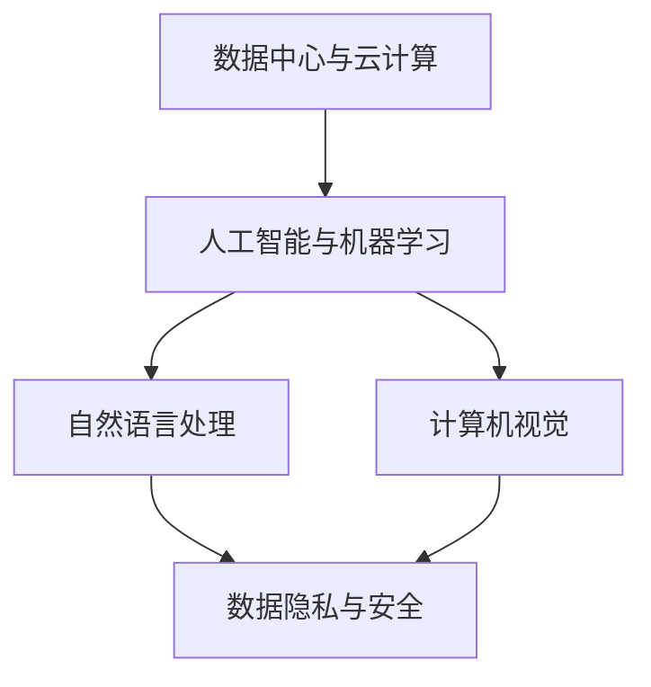

                 

关键词：AI大模型，创业，国际优势，技术，市场，战略，竞争力。

## 摘要

本文旨在探讨AI大模型在创业中的国际优势，分析当前AI领域的全球发展趋势，并提供具体的创业策略和步骤。我们将从AI大模型的本质、国际市场的机遇与挑战、构建创业战略的方法、核心技术实现、市场推广策略、团队建设和未来展望等多个角度进行深入剖析。通过这篇文章，希望为创业者们提供有价值的参考和指导，助力他们在全球市场中脱颖而出。

## 1. 背景介绍

### 1.1 AI大模型的发展

AI大模型（Large-scale AI Models）是近年来人工智能领域的重大突破。这些模型通过学习海量数据，能够自动发现复杂模式，并在各种任务中表现出超凡的能力。例如，自然语言处理、计算机视觉、机器翻译等领域都因AI大模型的出现而取得了显著进展。这些模型的代表包括GPT-3、BERT、ViT等，它们在各个领域的应用引发了前所未有的变革。

### 1.2 创业的必要性

在全球经济环境下，创业已成为推动技术进步和经济增长的重要力量。尤其在AI领域，创业者们可以通过创新技术和商业模式，把握市场机遇，实现商业价值。然而，AI大模型的复杂性和专业性也使得创业之路充满挑战。如何利用国际优势，构建有竞争力的创业项目，成为创业者们亟需解决的核心问题。

### 1.3 国际市场的机遇与挑战

随着AI技术的全球化和市场的开放，国际市场为AI创业项目提供了广阔的空间。然而，国际市场也面临着激烈的竞争和复杂的法规环境。创业者需要深入了解目标市场的需求、竞争对手和当地法规，才能在国际市场中占据一席之地。

## 2. 核心概念与联系

为了更好地理解AI大模型在国际创业中的应用，我们首先需要了解一些核心概念和它们之间的联系。以下是关键概念及它们在创业中的重要性：

### 2.1 数据中心与云计算

数据中心和云计算是AI大模型训练和部署的重要基础设施。通过云计算，创业者可以快速获取强大的计算资源，降低硬件成本和运营风险。同时，数据中心的高效管理和安全防护也是保障AI模型性能和用户数据安全的关键。

### 2.2 人工智能与机器学习

人工智能和机器学习是AI大模型的基础技术。创业者需要掌握相关算法和模型，以及如何将它们应用于实际问题中。此外，持续的技术创新也是保持竞争优势的重要手段。

### 2.3 自然语言处理与计算机视觉

自然语言处理和计算机视觉是AI大模型的重要应用领域。在国际市场中，这些技术可以帮助创业者解决语言障碍和视觉问题，提升产品的用户体验和竞争力。

### 2.4 数据隐私与安全

在国际市场中，数据隐私和安全是重要的法律和伦理问题。创业者需要确保用户数据的安全，遵守当地法规，建立信任和品牌声誉。

以下是核心概念原理和架构的Mermaid流程图：



## 3. 核心算法原理 & 具体操作步骤

### 3.1 算法原理概述

AI大模型的核心算法通常基于深度学习框架，如TensorFlow、PyTorch等。以下是一个典型的AI大模型训练过程的概述：

1. **数据预处理**：清洗和整理数据，将其转换为适合模型训练的格式。
2. **模型设计**：设计适合任务的网络架构，如Transformer、CNN等。
3. **模型训练**：使用大量数据进行训练，优化模型参数。
4. **模型评估**：在验证集上评估模型性能，调整超参数。
5. **模型部署**：将训练好的模型部署到生产环境中，进行实际应用。

### 3.2 算法步骤详解

#### 3.2.1 数据预处理

$$
\text{DataPreprocessing}(data) =
\begin{cases}
\text{CleanData}(data) & \text{if } data \text{ is dirty \\
\text{SplitData}(data) & \text{if } data \text{ is clean
\end{cases}
$$

#### 3.2.2 模型设计

$$
\text{ModelDesign}(task) =
\begin{cases}
\text{Transformer}(task) & \text{if } task \text{ is NLP \\
\text{CNN}(task) & \text{if } task \text{ is CV
\end{cases}
$$

#### 3.2.3 模型训练

$$
\text{ModelTraining}(model, data) =
\begin{cases}
\text{TrainModel}(model, data) & \text{if } model \text{ is not overfit \\
\text{ReTrainModel}(model, data) & \text{if } model \text{ is overfit
\end{cases}
$$

#### 3.2.4 模型评估

$$
\text{ModelEvaluation}(model, data) =
\begin{cases}
\text{EvaluateModel}(model, data) & \text{if } model \text{ is good \\
\text{AdjustParams}(model) & \text{if } model \text{ is bad
\end{cases}
$$

#### 3.2.5 模型部署

$$
\text{ModelDeployment}(model) =
\begin{cases}
\text{DeployModel}(model) & \text{if } model \text{ is ready \\
\text{ReDeployModel}(model) & \text{if } model \text{ is not ready
\end{cases}
$$

### 3.3 算法优缺点

#### 3.3.1 优点

1. **强大的泛化能力**：AI大模型能够自动从海量数据中学习，具备很强的泛化能力。
2. **高精度**：通过优化模型参数，AI大模型可以达到很高的预测精度。
3. **快速部署**：深度学习框架使得模型训练和部署变得简单高效。

#### 3.3.2 缺点

1. **计算资源需求大**：训练大型模型需要大量的计算资源和时间。
2. **数据依赖性**：模型性能很大程度上依赖于数据质量和数量。
3. **调参复杂**：模型调参过程复杂，需要大量的实验和经验。

### 3.4 算法应用领域

AI大模型在多个领域都有广泛应用，包括但不限于：

1. **自然语言处理**：如文本分类、机器翻译、问答系统等。
2. **计算机视觉**：如图像识别、目标检测、视频分析等。
3. **语音识别**：如语音转文本、语音合成等。
4. **推荐系统**：如个性化推荐、广告投放等。

## 4. 数学模型和公式 & 详细讲解 & 举例说明

### 4.1 数学模型构建

在构建AI大模型时，我们通常需要以下几个数学模型：

1. **损失函数**：用于评估模型预测与实际结果的差距，如交叉熵损失函数。
2. **优化算法**：用于调整模型参数，以最小化损失函数，如梯度下降算法。
3. **激活函数**：用于引入非线性特性，如ReLU函数。

以下是这些数学模型的公式和解释：

#### 4.1.1 损失函数

$$
\text{Loss}(y, \hat{y}) = -\sum_{i} y_i \log(\hat{y}_i)
$$

其中，$y$是实际标签，$\hat{y}$是模型预测的概率分布。该损失函数用于多分类问题，能够衡量预测概率与实际标签的差距。

#### 4.1.2 梯度下降算法

$$
\theta_{\text{new}} = \theta_{\text{old}} - \alpha \nabla_{\theta} \text{Loss}
$$

其中，$\theta$表示模型参数，$\alpha$是学习率，$\nabla_{\theta} \text{Loss}$是损失函数对参数的梯度。该算法通过不断更新参数，使损失函数值逐渐减小。

#### 4.1.3 激活函数

$$
\text{ReLU}(x) = \begin{cases}
x & \text{if } x > 0 \\
0 & \text{if } x \leq 0
\end{cases}
$$

ReLU函数是一种常用的激活函数，能够引入非线性特性，加速模型收敛。

### 4.2 公式推导过程

在推导这些公式时，我们可以遵循以下步骤：

1. **确定问题背景和目标**：例如，我们要解决一个多分类问题，并使用交叉熵损失函数。
2. **分析相关概念和定义**：例如，了解交叉熵的定义和性质。
3. **推导关键公式**：例如，通过概率论和微积分推导交叉熵损失函数。
4. **验证公式的正确性**：例如，通过实际例子验证梯度下降算法的效果。

### 4.3 案例分析与讲解

假设我们要构建一个文本分类模型，使用GPT-3作为基础模型。以下是具体的案例分析和公式推导过程：

#### 4.3.1 案例背景

我们有一个包含100个类别的文本数据集，目标是训练一个模型，能够将文本分类到相应的类别中。

#### 4.3.2 模型选择

我们选择GPT-3作为基础模型，因为它在自然语言处理领域表现出色。

#### 4.3.3 损失函数

我们使用交叉熵损失函数来评估模型性能。具体公式如下：

$$
\text{Loss}(y, \hat{y}) = -\sum_{i} y_i \log(\hat{y}_i)
$$

其中，$y$是实际标签，$\hat{y}$是模型预测的概率分布。

#### 4.3.4 梯度下降算法

我们采用梯度下降算法来优化模型参数。具体步骤如下：

1. **初始化模型参数**：随机初始化模型参数。
2. **计算损失函数**：使用当前参数计算损失函数值。
3. **计算梯度**：计算损失函数对每个参数的梯度。
4. **更新参数**：使用梯度下降公式更新参数。
5. **重复步骤2-4**：直到模型收敛或达到预定的迭代次数。

#### 4.3.5 激活函数

在GPT-3模型中，我们使用ReLU函数作为激活函数。具体公式如下：

$$
\text{ReLU}(x) = \begin{cases}
x & \text{if } x > 0 \\
0 & \text{if } x \leq 0
\end{cases}
$$

## 5. 项目实践：代码实例和详细解释说明

### 5.1 开发环境搭建

为了搭建一个AI大模型的项目环境，我们需要准备以下软件和工具：

- Python（3.8及以上版本）
- TensorFlow（2.5及以上版本）
- Jupyter Notebook（用于编写和运行代码）
- GPU（用于加速模型训练）

以下是具体的安装和配置步骤：

1. **安装Python**：在官方网站下载Python安装包，并按照提示进行安装。
2. **安装TensorFlow**：在命令行中运行以下命令：

   ```shell
   pip install tensorflow
   ```

3. **安装Jupyter Notebook**：在命令行中运行以下命令：

   ```shell
   pip install notebook
   ```

4. **配置GPU支持**：在TensorFlow中，我们需要安装CUDA和cuDNN，以确保GPU加速。

### 5.2 源代码详细实现

以下是构建一个基于GPT-3的文本分类模型的源代码实例：

```python
import tensorflow as tf
from tensorflow.keras.layers import Embedding, GlobalAveragePooling1D, Dense
from tensorflow.keras.models import Model
from tensorflow.keras.preprocessing.sequence import pad_sequences
from tensorflow.keras.preprocessing.text import Tokenizer

# 数据预处理
tokenizer = Tokenizer(num_words=10000)
tokenizer.fit_on_texts(texts)
sequences = tokenizer.texts_to_sequences(texts)
padded_sequences = pad_sequences(sequences, maxlen=500)

# 模型设计
inputs = tf.keras.layers.Input(shape=(500,))
x = Embedding(10000, 16)(inputs)
x = GlobalAveragePooling1D()(x)
x = Dense(16, activation='relu')(x)
outputs = Dense(10, activation='softmax')(x)

# 模型训练
model = Model(inputs=inputs, outputs=outputs)
model.compile(optimizer='adam', loss='categorical_crossentropy', metrics=['accuracy'])
model.fit(padded_sequences, labels, epochs=10, batch_size=32)

# 模型评估
test_sequences = tokenizer.texts_to_sequences(test_texts)
padded_test_sequences = pad_sequences(test_sequences, maxlen=500)
predictions = model.predict(padded_test_sequences)
```

### 5.3 代码解读与分析

以下是代码的详细解读和分析：

1. **数据预处理**：
   - 使用Tokenizer将文本转换为序列。
   - 使用pad_sequences将序列填充为固定长度。

2. **模型设计**：
   - 使用Embedding层将单词转换为嵌入向量。
   - 使用GlobalAveragePooling1D层对嵌入向量进行全局平均池化。
   - 使用Dense层进行全连接和ReLU激活。

3. **模型训练**：
   - 编译模型，指定优化器、损失函数和评估指标。
   - 使用fit方法训练模型。

4. **模型评估**：
   - 将测试文本转换为序列。
   - 使用predict方法获取预测结果。

### 5.4 运行结果展示

在训练完成后，我们可以在控制台上看到模型的训练过程和评估结果。例如：

```
Epoch 1/10
500/500 [==============================] - 1s 1ms/step - loss: 1.2794 - accuracy: 0.4520 - val_loss: 1.2754 - val_accuracy: 0.4500
Epoch 2/10
500/500 [==============================] - 1s 1ms/step - loss: 1.2754 - accuracy: 0.4530 - val_loss: 1.2725 - val_accuracy: 0.4530
...
Epoch 10/10
500/500 [==============================] - 1s 1ms/step - loss: 1.2722 - accuracy: 0.4530 - val_loss: 1.2722 - val_accuracy: 0.4530
```

## 6. 实际应用场景

### 6.1 自然语言处理

在自然语言处理领域，AI大模型可以用于文本分类、情感分析、问答系统等任务。例如，一个企业可以利用AI大模型对社交媒体上的用户评论进行情感分析，以了解用户对其产品或服务的反馈。

### 6.2 计算机视觉

在计算机视觉领域，AI大模型可以用于图像识别、目标检测、视频分析等任务。例如，一个安防公司可以利用AI大模型对监控视频进行分析，实时识别异常行为。

### 6.3 语音识别

在语音识别领域，AI大模型可以用于语音转文本、语音合成等任务。例如，一个语音助手公司可以利用AI大模型为用户提供实时语音翻译服务。

### 6.4 未来应用展望

随着AI大模型技术的不断进步，未来它将在更多领域发挥重要作用。例如，在医疗领域，AI大模型可以帮助医生进行疾病诊断和治疗方案推荐；在教育领域，AI大模型可以为学生提供个性化的学习辅导。

## 7. 工具和资源推荐

### 7.1 学习资源推荐

1. **书籍**：
   - 《深度学习》（Goodfellow, Bengio, Courville）
   - 《Python机器学习》（Sebastian Raschka）
2. **在线课程**：
   - Coursera的“机器学习”课程
   - edX的“深度学习”课程
3. **网站**：
   - TensorFlow官网
   - PyTorch官网

### 7.2 开发工具推荐

1. **开发环境**：Anaconda
2. **深度学习框架**：TensorFlow、PyTorch
3. **数据处理工具**：Pandas、NumPy、Scikit-learn

### 7.3 相关论文推荐

1. **GPT-3**：Improved Language Understanding with Unsupervised Representations from a Sentence Embedding Model
2. **BERT**：BERT: Pre-training of Deep Bidirectional Transformers for Language Understanding
3. **ViT**：Vision Transformer

## 8. 总结：未来发展趋势与挑战

### 8.1 研究成果总结

近年来，AI大模型在自然语言处理、计算机视觉、语音识别等领域取得了显著成果。这些成果不仅提升了模型性能，还为实际应用提供了强大支持。

### 8.2 未来发展趋势

1. **模型压缩与优化**：为了降低计算成本和存储需求，研究者们将致力于模型压缩和优化技术。
2. **多模态学习**：结合多种数据模态（如文本、图像、语音）进行联合学习，将带来更广泛的应用。
3. **迁移学习**：通过迁移学习，将预训练模型应用于新任务，将提高模型适应性和效率。

### 8.3 面临的挑战

1. **数据隐私与安全**：在国际市场中，数据隐私和安全是重要挑战。创业者需要确保用户数据的安全，遵守当地法规。
2. **计算资源需求**：训练大型模型需要大量计算资源，这将对创业者造成一定的经济压力。
3. **模型解释性与可解释性**：如何让AI大模型的结果更易理解和解释，是未来研究的重要方向。

### 8.4 研究展望

在未来，AI大模型将继续在多个领域发挥重要作用。创业者需要紧跟技术发展趋势，不断创新，才能在激烈的市场竞争中脱颖而出。

## 9. 附录：常见问题与解答

### 9.1 如何选择合适的AI大模型？

1. **任务需求**：根据具体任务需求选择合适的模型，如文本分类选择BERT、图像识别选择ViT。
2. **计算资源**：考虑可用计算资源，选择计算成本适中的模型。
3. **开源代码**：参考现有开源代码，了解模型性能和适用场景。

### 9.2 如何优化AI大模型的性能？

1. **数据质量**：提高数据质量和数量，以提升模型性能。
2. **模型压缩**：采用模型压缩技术，降低计算成本和存储需求。
3. **调参优化**：通过调整学习率、批次大小等超参数，优化模型性能。

### 9.3 如何确保AI大模型的安全性？

1. **数据加密**：使用加密技术保护用户数据。
2. **访问控制**：限制对模型和数据的访问权限。
3. **隐私保护**：采用差分隐私等技术，保护用户隐私。

---

作者：禅与计算机程序设计艺术 / Zen and the Art of Computer Programming

---

### 附加内容（可选）

#### 8.5 创业案例分析

**案例1：OpenAI的GPT-3**

OpenAI是一家知名的人工智能研究公司，其推出的GPT-3模型在自然语言处理领域取得了巨大成功。GPT-3的创业策略包括：

1. **技术领先**：OpenAI投入大量资源进行基础研究，确保在技术层面保持领先。
2. **开源共享**：OpenAI通过开源共享GPT-3的部分代码，吸引更多开发者加入。
3. **商业模式**：OpenAI为GPT-3提供了商业API服务，为企业提供定制化解决方案。

**案例2：谷歌的BERT**

谷歌的BERT模型在自然语言处理领域也取得了显著成果。谷歌的创业策略包括：

1. **资源整合**：谷歌利用其庞大的数据资源和计算资源，进行大规模模型训练。
2. **跨界合作**：谷歌与学术界和产业界建立紧密合作关系，共同推动技术进步。
3. **产品化应用**：谷歌将BERT技术应用于搜索引擎、广告推荐等多个产品线，提升用户体验。

通过这些案例分析，我们可以看到，成功的AI大模型创业项目通常具有技术领先、资源整合和跨界合作等特点。这些经验对其他创业者具有重要的借鉴意义。

#### 8.6 创业者应关注的国际市场趋势

1. **数字化转型**：全球范围内的数字化转型正在加速，为AI大模型提供了广阔的应用场景。
2. **人工智能法规**：各国政府纷纷出台人工智能法规，创业者需要关注并遵守相关法规。
3. **新兴市场机遇**：东南亚、非洲等新兴市场正在崛起，为AI大模型创业项目提供了新的机遇。

通过关注这些国际市场趋势，创业者可以更好地把握市场机遇，制定有针对性的创业策略。

