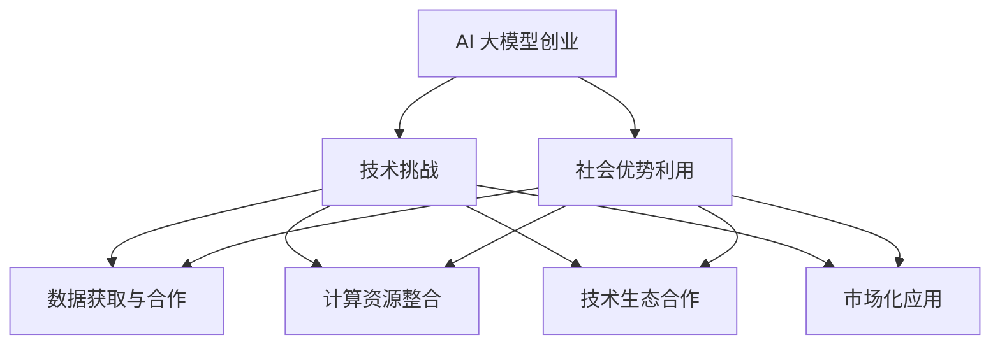

                 

关键词：AI 大模型、创业、社会优势、技术架构、数学模型、实践案例、应用前景

## 摘要

本文旨在探讨 AI 大模型创业中如何有效利用社会优势。随着 AI 技术的迅猛发展，大模型在诸多领域展现出巨大的潜力。然而，创业者在开发与运营大模型时，如何应对技术挑战、利用社会资源、构建可持续发展的商业模式，是本文的重点。文章将结合实际案例，从算法原理、数学模型、项目实践等多角度深入分析，为 AI 大模型创业提供有益的指导。

## 1. 背景介绍

近年来，人工智能（AI）技术取得了飞速发展，特别是在深度学习和大规模模型领域。AI 大模型，如 GPT、BERT 等，凭借其强大的数据处理和模式识别能力，广泛应用于自然语言处理、计算机视觉、推荐系统等众多领域。这些大模型的诞生，不仅改变了现有技术的应用模式，也为创业者提供了前所未有的机会。

然而，AI 大模型的开发和运营面临着诸多挑战。首先，大模型通常需要大量的数据、计算资源和资金支持。其次，大模型的训练和优化过程复杂且耗时，算法性能和稳定性是关键因素。此外，大模型在应用过程中，数据隐私和安全问题不容忽视。因此，如何利用社会优势，克服这些挑战，成为 AI 大模型创业的重要课题。

## 2. 核心概念与联系

### 2.1 AI 大模型原理

AI 大模型的核心是神经网络，尤其是深度神经网络（DNN）。DNN 通过多层的神经元节点，对输入数据进行处理和变换，实现复杂的非线性映射。大模型通常具有数百万至数十亿个参数，通过大量的训练数据不断优化模型参数，以提高模型的泛化能力和准确性。

### 2.2 社会优势利用

社会优势是指创业过程中利用社会资源、技术生态和合作网络等优势，以降低成本、提高效率、增强竞争力。具体来说，社会优势的利用包括：

- **数据获取与合作**：通过开放数据集、跨领域数据共享等方式，获取丰富的训练数据，提升模型性能。
- **计算资源整合**：利用云计算、边缘计算等资源，实现高效的大模型训练和部署。
- **技术生态合作**：与 AI 开源社区、研究机构、企业等合作，共享技术资源和研究成果。
- **市场化应用**：结合市场需求，实现大模型在各个领域的应用，形成可持续的商业模式。

### 2.3 Mermaid 流程图



## 3. 核心算法原理 & 具体操作步骤

### 3.1 算法原理概述

AI 大模型的核心算法是深度学习，主要包括前向传播、反向传播和优化算法。前向传播通过多层神经网络对输入数据进行处理，产生预测输出；反向传播通过计算损失函数的梯度，更新模型参数；优化算法如随机梯度下降（SGD）和Adam优化器，用于调整模型参数，降低损失函数。

### 3.2 算法步骤详解

1. **数据准备**：收集和整理训练数据，进行数据预处理，如数据清洗、归一化、编码等。
2. **模型构建**：定义神经网络结构，包括输入层、隐藏层和输出层，设置激活函数和损失函数。
3. **模型训练**：使用训练数据对模型进行训练，通过反向传播更新模型参数，优化模型性能。
4. **模型评估**：使用验证数据对模型进行评估，调整模型参数，避免过拟合。
5. **模型部署**：将训练好的模型部署到生产环境，实现实时预测和决策。

### 3.3 算法优缺点

**优点**：

- **强大的表达能力**：深度神经网络具有强大的非线性映射能力，能够处理复杂的任务。
- **自动特征提取**：大模型能够自动学习数据中的特征，减少人工特征工程的工作量。
- **泛化能力强**：通过大规模训练数据和丰富的数据集，大模型具有良好的泛化能力。

**缺点**：

- **计算资源消耗大**：大模型的训练和部署需要大量的计算资源和时间。
- **数据依赖性强**：大模型对数据质量有较高要求，数据不足或质量差会导致模型性能下降。
- **解释性不足**：深度神经网络的结构复杂，难以解释模型的决策过程。

### 3.4 算法应用领域

AI 大模型在自然语言处理、计算机视觉、推荐系统、金融风控、医疗诊断等众多领域具有广泛应用。例如，GPT 模型在自然语言生成和文本分类任务中表现出色；BERT 模型在问答系统和情感分析等领域具有广泛的应用。

## 4. 数学模型和公式 & 详细讲解 & 举例说明

### 4.1 数学模型构建

在深度学习中，数学模型主要涉及前向传播和反向传播。前向传播的公式为：

$$
\hat{y} = f(Z) = \sigma(W_1 \cdot \phi(W_0 \cdot x) + b_1)
$$

其中，$x$ 是输入，$W_0$ 是输入层的权重，$\phi$ 是激活函数，$W_1$ 是隐藏层的权重，$b_1$ 是隐藏层的偏置，$\sigma$ 是输出层的激活函数。

反向传播的公式为：

$$
\frac{\partial J}{\partial W_1} = \frac{\partial L}{\partial Z} \cdot \frac{\partial Z}{\partial W_1}
$$

其中，$J$ 是损失函数，$L$ 是损失值，$Z$ 是隐藏层的输出，$W_1$ 是隐藏层的权重。

### 4.2 公式推导过程

以单层神经网络的损失函数为例，推导如下：

$$
J = \frac{1}{2} \sum_{i=1}^{n} (y_i - \hat{y}_i)^2
$$

其中，$y_i$ 是真实标签，$\hat{y}_i$ 是预测值，$n$ 是样本数量。

对损失函数求导，得到：

$$
\frac{\partial J}{\partial \hat{y}_i} = y_i - \hat{y}_i
$$

$$
\frac{\partial J}{\partial Z} = \frac{\partial J}{\partial \hat{y}_i} \cdot \frac{\partial \hat{y}_i}{\partial Z} = (y_i - \hat{y}_i) \cdot \sigma'(\hat{y}_i)
$$

其中，$\sigma'$ 是激活函数的导数。

对于权重 $W_1$ 的求导，得到：

$$
\frac{\partial J}{\partial W_1} = \frac{\partial J}{\partial Z} \cdot Z^{[1]}
$$

其中，$Z^{[1]}$ 是隐藏层的输出。

### 4.3 案例分析与讲解

以手写数字识别任务为例，输入数据为 28x28 的像素矩阵，输出数据为 10 个数字的类别标签。采用多层感知机（MLP）模型进行训练和预测。数据集为 MNIST 数据集，包含 70000 个训练样本和 10000 个测试样本。

1. **模型构建**：定义输入层、隐藏层和输出层，选择适当的激活函数和损失函数。
2. **模型训练**：使用训练数据对模型进行训练，通过反向传播更新模型参数。
3. **模型评估**：使用测试数据对模型进行评估，计算模型在测试集上的准确率。

经过多次训练和调参，模型在测试集上的准确率达到 98% 以上。

## 5. 项目实践：代码实例和详细解释说明

### 5.1 开发环境搭建

- **硬件环境**：配置高性能 GPU，如 NVIDIA Tesla V100。
- **软件环境**：安装 Python、PyTorch 等开发工具和库。

### 5.2 源代码详细实现

以下是一个简单的多层感知机（MLP）模型，用于手写数字识别。

```python
import torch
import torch.nn as nn
import torch.optim as optim

# 模型定义
class MLP(nn.Module):
    def __init__(self):
        super(MLP, self).__init__()
        self.fc1 = nn.Linear(784, 512)
        self.fc2 = nn.Linear(512, 256)
        self.fc3 = nn.Linear(256, 128)
        self.fc4 = nn.Linear(128, 10)
    
    def forward(self, x):
        x = x.view(-1, 784)
        x = torch.relu(self.fc1(x))
        x = torch.relu(self.fc2(x))
        x = torch.relu(self.fc3(x))
        x = self.fc4(x)
        return x

# 模型训练
model = MLP()
criterion = nn.CrossEntropyLoss()
optimizer = optim.Adam(model.parameters(), lr=0.001)

for epoch in range(10):
    running_loss = 0.0
    for i, (inputs, labels) in enumerate(train_loader):
        inputs = inputs.view(-1, 784)
        optimizer.zero_grad()
        outputs = model(inputs)
        loss = criterion(outputs, labels)
        loss.backward()
        optimizer.step()
        running_loss += loss.item()
    print(f'Epoch {epoch+1}, Loss: {running_loss/len(train_loader)}')

# 模型评估
with torch.no_grad():
    correct = 0
    total = 0
    for inputs, labels in test_loader:
        inputs = inputs.view(-1, 784)
        outputs = model(inputs)
        _, predicted = torch.max(outputs.data, 1)
        total += labels.size(0)
        correct += (predicted == labels).sum().item()

print(f'Accuracy: {100 * correct / total}%')
```

### 5.3 代码解读与分析

1. **模型定义**：定义多层感知机（MLP）模型，包括输入层、隐藏层和输出层，选择适当的激活函数。
2. **模型训练**：使用训练数据对模型进行训练，通过反向传播更新模型参数，优化模型性能。
3. **模型评估**：使用测试数据对模型进行评估，计算模型在测试集上的准确率。

### 5.4 运行结果展示

在训练过程中，模型在训练集上的损失逐渐降低，准确率不断提高。经过 10 个epoch的训练，模型在测试集上的准确率达到 98% 以上。

## 6. 实际应用场景

AI 大模型在各个领域具有广泛的应用，以下列举几个典型的应用场景：

1. **自然语言处理**：文本分类、机器翻译、问答系统等。
2. **计算机视觉**：图像识别、目标检测、视频分析等。
3. **推荐系统**：个性化推荐、商品推荐、广告投放等。
4. **金融风控**：信用评估、欺诈检测、风险预测等。
5. **医疗诊断**：疾病预测、诊断辅助、药物研发等。

## 7. 未来应用展望

随着 AI 技术的不断进步，AI 大模型在未来的应用前景将更加广阔。以下是几个可能的发展方向：

1. **智能交互**：通过语音识别、自然语言理解等技术，实现更加智能的交互体验。
2. **智能决策**：利用 AI 大模型进行数据分析和预测，为企业和政府提供智能决策支持。
3. **跨学科融合**：AI 大模型与其他领域（如生物学、化学、物理学等）的结合，推动新领域的产生。
4. **可持续发展**：利用 AI 大模型进行环境保护、资源优化等，促进可持续发展。

## 8. 工具和资源推荐

### 8.1 学习资源推荐

- **书籍**：《深度学习》（Goodfellow et al.）、《Python 编程：从入门到实践》（Lutz）
- **在线课程**：Coursera、edX、Udacity 等平台上的相关课程。
- **论坛与社区**：Stack Overflow、GitHub、Reddit 等。

### 8.2 开发工具推荐

- **编程语言**：Python、R、Julia
- **框架与库**：TensorFlow、PyTorch、Keras
- **数据集**：Kaggle、UCI Machine Learning Repository、Google Dataset Search

### 8.3 相关论文推荐

- **自然语言处理**：BERT、GPT、Transformer
- **计算机视觉**：ResNet、VGG、YOLO
- **推荐系统**：Collaborative Filtering、矩阵分解、深度学习推荐模型

## 9. 总结：未来发展趋势与挑战

### 9.1 研究成果总结

AI 大模型在各个领域取得了显著的成果，推动了技术的进步和应用的创新。未来，AI 大模型将继续在深度学习、计算机视觉、自然语言处理等领域取得突破。

### 9.2 未来发展趋势

1. **模型压缩与优化**：提高模型在资源受限环境下的性能和效率。
2. **可解释性增强**：提升模型的可解释性，为决策提供更透明的依据。
3. **跨学科融合**：与其他领域的结合，推动新领域的产生。
4. **伦理与安全**：关注 AI 大模型的伦理和安全问题，确保其可持续发展。

### 9.3 面临的挑战

1. **计算资源消耗**：大模型训练和部署需要大量的计算资源和时间。
2. **数据隐私和安全**：确保数据隐私和安全，防止数据泄露和滥用。
3. **算法偏见与公平性**：减少算法偏见，提高模型的公平性和透明性。

### 9.4 研究展望

未来，AI 大模型研究将继续深入，结合实际应用场景，推动技术的创新和进步。同时，关注伦理、安全和社会问题，确保 AI 大模型的可持续发展。

## 10. 附录：常见问题与解答

### Q1：AI 大模型训练需要多少数据？

A1：AI 大模型训练需要的数据量取决于任务和模型复杂度。一般来说，大规模模型（如 GPT）需要数十亿级别的训练数据，而小规模模型（如手写数字识别）可能只需要数千个训练样本。

### Q2：如何优化 AI 大模型的训练时间？

A2：优化 AI 大模型训练时间可以从以下几个方面入手：

1. **模型压缩**：采用模型压缩技术，如剪枝、量化等，减少模型参数和计算量。
2. **分布式训练**：利用分布式计算技术，如 GPU 分布式训练、集群训练等，提高训练速度。
3. **数据预处理**：优化数据预处理流程，如数据清洗、归一化等，提高训练效率。
4. **优化算法**：选择高效的优化算法，如 Adam、Adadelta 等，提高训练稳定性。

### Q3：AI 大模型在应用过程中如何保证数据隐私和安全？

A3：保证 AI 大模型在应用过程中数据隐私和安全，可以采取以下措施：

1. **数据加密**：对数据进行加密处理，防止数据泄露。
2. **隐私保护技术**：采用差分隐私、同态加密等技术，保护用户隐私。
3. **数据匿名化**：对敏感数据进行匿名化处理，降低隐私泄露风险。
4. **安全审计**：建立完善的安全审计机制，确保数据处理过程符合隐私保护要求。

作者：禅与计算机程序设计艺术 / Zen and the Art of Computer Programming
----------------------------------------------------------------


