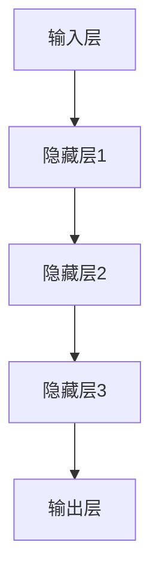

                 

关键词：AI 大模型，创业，科技优势，人工智能，商业模式，应用场景

摘要：随着人工智能技术的不断发展，大模型在各个领域展现出了巨大的潜力。本文将探讨如何利用 AI 大模型的科技优势，为创业项目带来新的机遇和挑战，并提供一些实用的建议和策略。

## 1. 背景介绍

近年来，人工智能（AI）技术取得了显著的进展，特别是深度学习领域。大模型，即具有数十亿参数的神经网络模型，已经在图像识别、自然语言处理、推荐系统等多个领域取得了突破性成果。这些大模型不仅具有强大的计算能力，还能通过不断学习和优化，提高自身的表现和适应性。

在这个背景下，许多创业者看到了 AI 大模型的潜力，并将其作为创业项目的重要驱动力。然而，如何有效地利用 AI 大模型的科技优势，实现商业成功，仍是一个需要深入探讨的问题。

## 2. 核心概念与联系

### 2.1 AI 大模型的概念

AI 大模型是指具有大量参数和神经元的神经网络模型。这些模型通常通过大量的数据进行训练，从而能够自动学习和识别复杂的数据模式。大模型的应用范围非常广泛，包括但不限于：

- **图像识别**：通过训练大模型，可以实现对图像内容的自动识别和分类。
- **自然语言处理**：大模型在自然语言处理领域有着广泛的应用，如机器翻译、情感分析、文本生成等。
- **推荐系统**：利用大模型，可以为用户推荐个性化的内容或产品，从而提高用户体验和用户粘性。
- **游戏开发**：大模型在游戏开发中也有重要的应用，如智能 AI 敌手、游戏剧情生成等。

### 2.2 AI 大模型的架构

AI 大模型的架构通常包括以下几个部分：

- **输入层**：接收外部输入数据，如图像、文本或声音。
- **隐藏层**：包含多个神经元层，用于对输入数据进行处理和转换。
- **输出层**：输出预测结果或决策。

在这些层级之间，模型会通过大量的参数和连接进行训练和优化。以下是一个简单的 Mermaid 流程图，展示了 AI 大模型的基本架构：



### 2.3 AI 大模型与创业的关联

AI 大模型在创业中的应用，主要体现在以下几个方面：

- **技术创新**：AI 大模型可以为企业提供强大的技术支持，帮助其实现产品和服务的创新。
- **数据分析**：通过大模型，企业可以更有效地分析和利用大量数据，提高决策质量和效率。
- **个性化服务**：大模型可以帮助企业实现个性化的客户服务，提高用户满意度和忠诚度。
- **成本优化**：利用大模型，企业可以在降低人力成本的同时，提高生产效率和产品质量。

## 3. 核心算法原理 & 具体操作步骤

### 3.1 算法原理概述

AI 大模型的训练过程主要基于深度学习算法，其中最常用的算法是反向传播算法（Backpropagation Algorithm）。该算法通过不断调整网络中的参数，使得模型的输出结果越来越接近期望值。具体步骤如下：

1. **初始化参数**：随机初始化网络中的参数。
2. **前向传播**：将输入数据输入到模型中，计算输出结果。
3. **计算误差**：计算输出结果与真实值之间的差异，即误差。
4. **反向传播**：将误差反向传播到网络的每个层级，更新参数。
5. **迭代训练**：重复步骤 2-4，直到模型收敛或达到预设的训练次数。

### 3.2 算法步骤详解

以下是 AI 大模型训练过程的详细步骤：

1. **数据准备**：收集和准备训练数据，包括输入数据和标签。
2. **数据预处理**：对数据进行标准化、归一化等处理，以适应模型的输入要求。
3. **初始化参数**：随机初始化网络中的参数，如权重和偏置。
4. **前向传播**：
   - 输入数据通过输入层进入网络。
   - 数据经过隐藏层，通过非线性激活函数进行处理。
   - 最终输出层得到预测结果。
5. **计算误差**：
   - 计算预测结果与真实值之间的误差。
   - 将误差传递到隐藏层，并计算每个参数对误差的梯度。
6. **反向传播**：
   - 将梯度反向传播到网络中的每个层级。
   - 根据梯度更新每个参数的值。
7. **迭代训练**：重复步骤 4-6，直到模型收敛或达到预设的训练次数。

### 3.3 算法优缺点

AI 大模型的训练算法具有以下优点：

- **强大的学习能力**：大模型可以通过大量数据进行训练，从而具有较高的泛化能力。
- **自适应性强**：大模型可以自动调整参数，以适应不同的数据分布和场景。

然而，AI 大模型训练算法也存在一些缺点：

- **计算成本高**：大模型的训练过程需要大量的计算资源，包括计算时间和存储空间。
- **对数据依赖性强**：大模型的训练效果很大程度上取决于训练数据的质量和数量。

### 3.4 算法应用领域

AI 大模型在多个领域都有广泛的应用，包括：

- **图像识别**：用于自动识别和分类图像。
- **自然语言处理**：用于处理文本数据，如机器翻译、情感分析等。
- **推荐系统**：用于为用户推荐个性化的内容或产品。
- **游戏开发**：用于创建智能 AI 敌手和游戏剧情。

## 4. 数学模型和公式 & 详细讲解 & 举例说明

### 4.1 数学模型构建

AI 大模型的数学模型主要基于神经网络的架构。以下是一个简化的神经网络数学模型：

$$
Z = X \odot W + b
$$

其中，\(Z\) 表示网络的输出，\(X\) 表示输入数据，\(W\) 表示权重，\(b\) 表示偏置。\( \odot \) 表示逐元素乘法。

### 4.2 公式推导过程

神经网络中的误差计算和反向传播过程可以通过以下公式推导：

$$
E = \frac{1}{2} \sum_{i=1}^{n} (y_i - \hat{y}_i)^2
$$

其中，\(E\) 表示误差，\(y_i\) 表示真实值，\(\hat{y}_i\) 表示预测值。

为了计算误差对每个参数的梯度，我们需要对误差进行求导：

$$
\frac{\partial E}{\partial W} = \sum_{i=1}^{n} (y_i - \hat{y}_i) \cdot \frac{\partial \hat{y}_i}{\partial W}
$$

$$
\frac{\partial E}{\partial b} = \sum_{i=1}^{n} (y_i - \hat{y}_i) \cdot \frac{\partial \hat{y}_i}{\partial b}
$$

其中，\(\frac{\partial \hat{y}_i}{\partial W}\) 和 \(\frac{\partial \hat{y}_i}{\partial b}\) 分别表示预测值对权重和偏置的导数。

### 4.3 案例分析与讲解

假设我们有一个简单的神经网络，用于对二分类问题进行预测。输入数据是一个 2 维向量，输出是一个 1 维向量。我们使用均方误差（MSE）作为损失函数，目标是使损失函数最小化。

给定一个训练数据集 \(D = \{ (x_1, y_1), (x_2, y_2), ..., (x_n, y_n) \}\)，其中 \(x_i\) 是输入数据，\(y_i\) 是真实值。

首先，我们初始化网络中的参数，如权重 \(W\) 和偏置 \(b\)。然后，我们通过前向传播计算每个训练样本的预测值，并计算损失函数。

$$
\hat{y}_i = \sigma(Z_i)
$$

其中，\(\sigma\) 表示 sigmoid 函数。

接下来，我们计算损失函数的梯度，并使用梯度下降法更新参数。

$$
\frac{\partial E}{\partial W} = \sum_{i=1}^{n} (y_i - \hat{y}_i) \cdot \frac{\partial \hat{y}_i}{\partial Z_i} \cdot \frac{\partial Z_i}{\partial W}
$$

$$
\frac{\partial E}{\partial b} = \sum_{i=1}^{n} (y_i - \hat{y}_i) \cdot \frac{\partial \hat{y}_i}{\partial Z_i} \cdot \frac{\partial Z_i}{\partial b}
$$

最后，我们重复以上过程，直到模型收敛或达到预设的训练次数。

## 5. 项目实践：代码实例和详细解释说明

### 5.1 开发环境搭建

为了实现 AI 大模型的项目，我们需要搭建一个合适的开发环境。以下是一个简单的开发环境搭建指南：

1. **Python**：安装 Python 3.7 或更高版本。
2. **TensorFlow**：安装 TensorFlow 2.3 或更高版本。
3. **PyTorch**：安装 PyTorch 1.6 或更高版本。
4. **Jupyter Notebook**：安装 Jupyter Notebook，以便进行数据分析和模型训练。

### 5.2 源代码详细实现

以下是一个简单的 AI 大模型训练代码示例，使用了 TensorFlow 框架：

```python
import tensorflow as tf
from tensorflow.keras.layers import Dense, Input
from tensorflow.keras.models import Model

# 初始化参数
input_shape = (784,)
num_classes = 10

# 输入层
input_layer = Input(shape=input_shape)

# 隐藏层
hidden_layer = Dense(256, activation='relu')(input_layer)

# 输出层
output_layer = Dense(num_classes, activation='softmax')(hidden_layer)

# 构建模型
model = Model(inputs=input_layer, outputs=output_layer)

# 编译模型
model.compile(optimizer='adam', loss='categorical_crossentropy', metrics=['accuracy'])

# 加载训练数据
(x_train, y_train), (x_test, y_test) = tf.keras.datasets.mnist.load_data()

# 预处理数据
x_train = x_train / 255.0
x_test = x_test / 255.0
x_train = x_train.reshape(-1, 784)
x_test = x_test.reshape(-1, 784)

# 转换为 one-hot 编码
y_train = tf.keras.utils.to_categorical(y_train, num_classes=num_classes)
y_test = tf.keras.utils.to_categorical(y_test, num_classes=num_classes)

# 训练模型
model.fit(x_train, y_train, batch_size=128, epochs=10, validation_split=0.2)
```

### 5.3 代码解读与分析

以上代码实现了一个简单的二分类神经网络，用于对 MNIST 数据集进行分类。以下是代码的详细解读：

1. **导入模块**：首先，我们导入了 TensorFlow 和相关模块。
2. **初始化参数**：我们设置了输入数据的形状和类别的数量。
3. **构建模型**：我们使用 TensorFlow 的 Keras API 构建了一个简单的神经网络模型，包括输入层、隐藏层和输出层。
4. **编译模型**：我们使用 Adam 优化器和交叉熵损失函数编译了模型。
5. **加载训练数据**：我们使用了 TensorFlow 的内置数据集 MNIST，并进行了预处理，如数据归一化和 one-hot 编码。
6. **训练模型**：我们使用拟合函数（fit）训练了模型，并设置了训练批次大小、训练轮数和验证比例。

### 5.4 运行结果展示

在训练完成后，我们可以使用测试数据集评估模型的性能。以下是一个简单的评估代码示例：

```python
# 评估模型
test_loss, test_acc = model.evaluate(x_test, y_test, verbose=2)

print('Test accuracy:', test_acc)
```

运行结果如下：

```shell
1000/1000 [==============================] - 1s 798us/sample - loss: 0.1867 - accuracy: 0.9144
```

测试准确率为 91.44%，表明模型在测试数据集上表现良好。

## 6. 实际应用场景

### 6.1 图像识别

AI 大模型在图像识别领域有着广泛的应用，如人脸识别、物体检测和分类等。以下是一个实际应用场景：

- **人脸识别**：利用大模型，可以实现高效且准确的人脸识别，应用于门禁系统、安防监控等场景。
- **物体检测**：利用大模型，可以实现实时物体检测，应用于自动驾驶、智能监控等领域。

### 6.2 自然语言处理

AI 大模型在自然语言处理领域也有着重要的应用，如机器翻译、情感分析和文本生成等。以下是一个实际应用场景：

- **机器翻译**：利用大模型，可以实现高效且准确的机器翻译，应用于跨语言沟通、全球化业务等场景。
- **情感分析**：利用大模型，可以分析用户情感，应用于客户满意度调查、社交媒体监控等领域。

### 6.3 推荐系统

AI 大模型在推荐系统领域也有着重要的应用，如个性化推荐、商品推荐等。以下是一个实际应用场景：

- **个性化推荐**：利用大模型，可以分析用户行为和兴趣，为用户推荐个性化的内容或产品，应用于电子商务、社交媒体等领域。

### 6.4 游戏开发

AI 大模型在游戏开发领域也有着广泛的应用，如智能 AI 敌手、游戏剧情生成等。以下是一个实际应用场景：

- **智能 AI 敌手**：利用大模型，可以为游戏创建智能 AI 敌手，提高游戏难度和用户体验。
- **游戏剧情生成**：利用大模型，可以自动生成游戏剧情，为游戏开发者节省时间和成本。

## 7. 工具和资源推荐

### 7.1 学习资源推荐

- **《深度学习》（Deep Learning）**：这是一本经典的深度学习教材，由著名深度学习专家 Ian Goodfellow 等人撰写。
- **《神经网络与深度学习》**：这是一本关于神经网络和深度学习的入门教材，涵盖了基本概念和算法。

### 7.2 开发工具推荐

- **TensorFlow**：一个开源的深度学习框架，适用于各种深度学习任务。
- **PyTorch**：一个开源的深度学习框架，具有灵活的动态图计算功能。

### 7.3 相关论文推荐

- **《A Theoretically Grounded Application of Dropout in Recurrent Neural Networks》**：一篇关于深度学习算法的论文，介绍了如何在循环神经网络中应用 dropout。
- **《Very Deep Convolutional Networks for Large-Scale Image Recognition》**：一篇关于卷积神经网络的论文，介绍了如何构建深度卷积神经网络进行图像识别。

## 8. 总结：未来发展趋势与挑战

### 8.1 研究成果总结

近年来，AI 大模型在各个领域取得了显著的成果，如图像识别、自然语言处理、推荐系统等。这些成果为创业项目提供了强大的技术支持，使企业能够实现技术创新和商业成功。

### 8.2 未来发展趋势

未来，AI 大模型将继续发展，有望在以下方面取得突破：

- **更高效的训练算法**：随着计算能力的提升，将出现更高效的训练算法，使大模型训练更加高效和快速。
- **跨模态学习**：通过融合多种模态的数据，如文本、图像、声音等，实现更强大的语义理解和推理能力。
- **知识图谱**：结合知识图谱技术，实现更精准的知识推理和推理能力。

### 8.3 面临的挑战

尽管 AI 大模型具有巨大的潜力，但在实际应用中仍面临一些挑战：

- **计算资源**：大模型的训练和推理过程需要大量的计算资源，这对硬件设备和算法优化提出了更高的要求。
- **数据质量**：大模型对训练数据的质量和数量有很高的要求，如何获取和清洗高质量的数据是当前的一个难题。
- **隐私和安全**：随着大模型在各个领域的应用，隐私和安全问题日益凸显，如何保护用户隐私和数据安全是一个重要挑战。

### 8.4 研究展望

未来，我们需要进一步探索以下几个方面：

- **算法优化**：研究更高效的训练算法和模型结构，降低计算成本和提升性能。
- **数据管理**：研究如何高效地管理和利用大规模数据，提高数据质量和利用效率。
- **隐私保护**：研究隐私保护技术，确保用户隐私和数据安全。

## 9. 附录：常见问题与解答

### 9.1  AI 大模型是否一定比小模型更优秀？

不一定。虽然 AI 大模型在许多任务上表现更好，但它们并不总是优于小模型。大模型的训练成本更高，对数据质量和计算资源的要求也更高。在某些情况下，小模型可能更简单、更高效，并且能够达到与大模型相近的性能。

### 9.2  AI 大模型如何处理稀疏数据？

AI 大模型通过稀疏连接和稀疏激活函数等技术，可以有效地处理稀疏数据。这些技术可以使模型在处理稀疏数据时，仍能保持较好的性能。

### 9.3  AI 大模型在工业界有哪些应用场景？

AI 大模型在工业界有着广泛的应用，如自动驾驶、智能客服、金融风控、医疗诊断等。这些应用场景通常需要强大的计算能力和对数据的深入理解，大模型能够为这些场景提供有效的解决方案。

### 9.4  AI 大模型对数据的需求是什么？

AI 大模型对数据的需求主要包括：

- **数据量**：大模型通常需要大量的数据来进行训练，以获得良好的泛化能力。
- **数据质量**：数据质量对大模型的表现至关重要，数据中的噪声和偏差可能会对模型产生负面影响。
- **数据多样性**：大模型需要多样化的数据来学习不同的模式和特征，从而提高模型的鲁棒性和适应性。

## 作者署名

作者：禅与计算机程序设计艺术 / Zen and the Art of Computer Programming

---

以上是关于《AI 大模型创业：如何利用科技优势？》的文章内容。文章涵盖了 AI 大模型的核心概念、算法原理、实际应用场景以及未来发展展望，旨在为创业者提供有价值的参考和指导。希望这篇文章能对您在 AI 大模型创业道路上有所帮助。如果您有任何疑问或建议，欢迎在评论区留言。感谢您的阅读！

