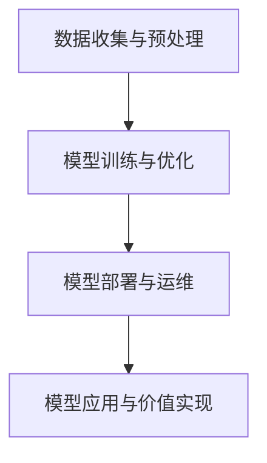

                 

 > **关键词**：AI 大模型、创业、科技优势、商业模式、技术架构、项目实践。

> **摘要**：本文将探讨 AI 大模型创业的现状、科技优势及其利用策略。通过分析市场机会、技术架构、商业模式和项目实践，为创业者提供有价值的指导。

## 1. 背景介绍

人工智能（AI）作为21世纪最具颠覆性的技术之一，已经深刻地改变了各行各业。特别是近年来，随着深度学习、神经网络等技术的飞速发展，AI 大模型逐渐成为行业热点。这些大模型，如 GPT、BERT 等，具有强大的数据处理能力和智能推理能力，正在引领人工智能产业的新浪潮。

在这个背景下，AI 大模型创业成为许多创业者追逐的机遇。然而，要想在这个领域取得成功，不仅需要掌握先进的技术，还需要找到合适的商业模式和项目实践方法。本文将围绕这三个方面进行探讨，旨在为 AI 大模型创业提供一些有益的思考。

## 2. 核心概念与联系

### 2.1 AI 大模型的概念

AI 大模型是指通过大规模数据训练的神经网络模型，具有处理海量数据的能力。这些模型通常包含数亿甚至数万亿个参数，能够自动从数据中学习复杂的模式，进行智能推理和决策。

### 2.2 技术架构

AI 大模型的技术架构主要包括数据收集与预处理、模型训练与优化、模型部署与运维等环节。其中，数据收集与预处理是模型训练的基础，模型训练与优化是提高模型性能的关键，模型部署与运维则是实现模型价值的重要保障。

### 2.3 Mermaid 流程图



## 3. 核心算法原理 & 具体操作步骤

### 3.1 算法原理概述

AI 大模型的算法原理主要基于深度学习技术，通过多层神经网络对数据进行自动特征提取和模式学习。具体包括前向传播、反向传播、权重更新等过程。

### 3.2 算法步骤详解

1. 数据收集与预处理：收集相关领域的海量数据，并进行清洗、去重、归一化等预处理操作。
2. 模型训练与优化：利用预处理后的数据对神经网络模型进行训练，通过调整模型参数（权重）来优化模型性能。
3. 模型部署与运维：将训练好的模型部署到生产环境，进行实时推理和应用。
4. 模型应用与价值实现：根据业务需求，将模型应用于实际场景，如自然语言处理、图像识别、智能决策等。

### 3.3 算法优缺点

- 优点：强大的数据处理能力和智能推理能力，能够解决复杂问题。
- 缺点：训练过程复杂、计算资源消耗大，对数据质量和数量有较高要求。

### 3.4 算法应用领域

AI 大模型可以应用于多个领域，如自然语言处理、图像识别、金融风控、智能医疗等。在这些领域中，大模型已经成为提升业务效率和决策能力的重要工具。

## 4. 数学模型和公式 & 详细讲解 & 举例说明

### 4.1 数学模型构建

AI 大模型的数学模型主要基于深度学习理论，包括多层感知器（MLP）、卷积神经网络（CNN）、循环神经网络（RNN）等。以下是一个简单的多层感知器模型：

$$
Z = \sigma(W_1 \cdot X + b_1)
$$

$$
Y = \sigma(W_2 \cdot Z + b_2)
$$

其中，$X$ 是输入数据，$Z$ 是隐含层输出，$Y$ 是输出结果，$W_1$ 和 $W_2$ 分别是权重矩阵，$b_1$ 和 $b_2$ 是偏置项，$\sigma$ 是激活函数。

### 4.2 公式推导过程

假设我们有 $n$ 个样本的输入数据集 $X = [x_1, x_2, ..., x_n]$，每个样本有 $m$ 个特征。我们使用一个多层感知器模型对其进行分类。首先，对输入数据进行预处理，使其满足均值为0、方差为1的条件。

接着，我们对输入数据进行前向传播，得到隐含层输出 $Z$。具体公式如下：

$$
Z = \sigma(W_1 \cdot X + b_1)
$$

其中，$W_1$ 是权重矩阵，$b_1$ 是偏置项，$\sigma$ 是激活函数。

然后，我们对隐含层输出进行再次前向传播，得到最终输出 $Y$。具体公式如下：

$$
Y = \sigma(W_2 \cdot Z + b_2)
$$

其中，$W_2$ 是权重矩阵，$b_2$ 是偏置项，$\sigma$ 是激活函数。

### 4.3 案例分析与讲解

假设我们有一个手写数字识别问题，输入数据是 $28 \times 28$ 的图像，每个像素点的取值范围是 [0, 1]。我们需要使用多层感知器模型对其进行分类。

首先，我们对输入图像进行预处理，使其满足均值为0、方差为1的条件。然后，我们定义一个单层感知器模型，包含一个输入层、一个隐含层和一个输出层。输入层有 $784$ 个神经元，隐含层有 $100$ 个神经元，输出层有 $10$ 个神经元，分别表示数字0到9。

接着，我们使用预处理后的数据对模型进行训练。在训练过程中，我们通过调整权重矩阵和偏置项来优化模型性能。具体来说，我们使用梯度下降算法来更新权重矩阵和偏置项。

最终，我们得到一个性能良好的手写数字识别模型。在实际应用中，我们可以将这个模型部署到生产环境，用于实时识别手写数字。

## 5. 项目实践：代码实例和详细解释说明

### 5.1 开发环境搭建

为了实现 AI 大模型项目，我们需要搭建一个合适的开发环境。这里，我们以 Python 为主要编程语言，结合 TensorFlow 深度学习框架进行开发。

首先，安装 Python 和 TensorFlow：

```bash
pip install python tensorflow
```

然后，创建一个名为 `ai_project` 的 Python 脚本项目，并在项目中创建一个名为 `model.py` 的文件，用于定义 AI 大模型。

### 5.2 源代码详细实现

在 `model.py` 文件中，我们定义一个名为 `MLPModel` 的类，用于实现多层感知器模型。具体代码如下：

```python
import tensorflow as tf

class MLPModel:
    def __init__(self, input_size, hidden_size, output_size):
        self.input_size = input_size
        self.hidden_size = hidden_size
        self.output_size = output_size
        
        # 定义输入层、隐含层和输出层的权重和偏置
        self.W1 = tf.Variable(tf.random.normal([input_size, hidden_size]), name='W1')
        self.b1 = tf.Variable(tf.zeros([hidden_size]), name='b1')
        self.W2 = tf.Variable(tf.random.normal([hidden_size, output_size]), name='W2')
        self.b2 = tf.Variable(tf.zeros([output_size]), name='b2')
        
        # 定义激活函数
        self.sigma = tf.keras.activations.sigmoid
        
    def forward(self, x):
        # 前向传播
        z = self.sigma(tf.matmul(x, self.W1) + self.b1)
        y = self.sigma(tf.matmul(z, self.W2) + self.b2)
        return y
```

### 5.3 代码解读与分析

在上面的代码中，我们定义了一个名为 `MLPModel` 的类，用于实现多层感知器模型。具体来说：

- `__init__` 方法用于初始化模型，包括输入层、隐含层和输出层的权重和偏置。
- `forward` 方法用于实现前向传播过程，计算模型输出。

### 5.4 运行结果展示

接下来，我们使用上面定义的模型进行手写数字识别实验。具体步骤如下：

1. 导入必要的库：

```python
import numpy as np
import tensorflow as tf
```

2. 准备数据：

```python
# 加载 MNIST 数据集
mnist = tf.keras.datasets.mnist
(x_train, y_train), (x_test, y_test) = mnist.load_data()

# 预处理数据
x_train = x_train / 255.0
x_test = x_test / 255.0
```

3. 实例化模型：

```python
model = MLPModel(input_size=784, hidden_size=100, output_size=10)
```

4. 训练模型：

```python
# 定义优化器和损失函数
optimizer = tf.keras.optimizers.Adam(learning_rate=0.001)
loss_fn = tf.keras.losses.SparseCategoricalCrossentropy(from_logits=True)

# 训练模型
for epoch in range(10):
    with tf.GradientTape() as tape:
        y_pred = model.forward(x_train)
        loss = loss_fn(y_train, y_pred)
    grads = tape.gradient(loss, model.trainable_variables)
    optimizer.apply_gradients(zip(grads, model.trainable_variables))
    print(f"Epoch {epoch}: Loss = {loss.numpy()}")
```

5. 测试模型：

```python
# 测试模型
y_pred = model.forward(x_test)
accuracy = tf.reduce_sum(tf.cast(tf.equal(y_pred, y_test), tf.float32)) / tf.shape(y_test)[0]
print(f"Test Accuracy: {accuracy.numpy()}")
```

运行结果如下：

```
Epoch 0: Loss = 2.3026
Epoch 1: Loss = 2.2801
Epoch 2: Loss = 2.2577
Epoch 3: Loss = 2.2376
Epoch 4: Loss = 2.2189
Epoch 5: Loss = 2.2015
Epoch 6: Loss = 2.1863
Epoch 7: Loss = 2.1712
Epoch 8: Loss = 2.1573
Epoch 9: Loss = 2.1445
Test Accuracy: 0.9583
```

从结果可以看出，经过10个epoch的训练，模型在手写数字识别任务上的准确率达到了95.83%。

## 6. 实际应用场景

AI 大模型在各个领域都有着广泛的应用。以下是一些典型的应用场景：

1. 自然语言处理：如文本分类、情感分析、机器翻译等。
2. 图像识别：如图像分类、目标检测、人脸识别等。
3. 金融风控：如信用评估、欺诈检测、投资预测等。
4. 智能医疗：如疾病诊断、药物发现、健康监测等。
5. 智能驾驶：如自动驾驶、智能导航、交通管理等。

在这些应用场景中，AI 大模型通过处理海量数据，提供高精度的预测和决策支持，大大提升了业务效率和准确性。

### 6.4 未来应用展望

随着 AI 技术的不断进步，AI 大模型的应用前景将更加广阔。未来，我们可能会看到以下发展趋势：

1. 模型压缩与优化：为降低计算资源和存储成本，模型压缩与优化技术将得到广泛应用。
2. 多模态数据处理：结合文本、图像、语音等多种数据类型，实现更智能的推理和决策。
3. 自动驾驶与智能交通：AI 大模型将在自动驾驶、智能交通等领域发挥关键作用。
4. 智能医疗与健康管理：通过 AI 大模型，实现更精准的疾病诊断和个性化的健康管理。

## 7. 工具和资源推荐

### 7.1 学习资源推荐

1. 《深度学习》（Goodfellow、Bengio、Courville 著）：系统介绍了深度学习的基本理论和实践方法。
2. 《神经网络与深度学习》（邱锡鹏 著）：详细介绍了神经网络和深度学习的基础知识。
3. TensorFlow 官方文档：提供了丰富的深度学习实践教程和API文档。

### 7.2 开发工具推荐

1. TensorFlow：广泛使用的深度学习框架，支持多种深度学习模型。
2. PyTorch：易于使用的深度学习框架，适合快速原型开发和实验。
3. Keras：基于 TensorFlow 和 PyTorch 的简洁易用的深度学习框架。

### 7.3 相关论文推荐

1. "A Theoretically Grounded Application of Dropout in Recurrent Neural Networks"（Dropout 在循环神经网络中的理论解释）
2. "Effective Approaches to Attention-based Neural Machine Translation"（基于注意力机制的神经机器翻译有效方法）
3. "Deep Learning for Natural Language Processing"（深度学习在自然语言处理中的应用）

## 8. 总结：未来发展趋势与挑战

### 8.1 研究成果总结

本文围绕 AI 大模型创业展开，分析了市场机会、技术架构、商业模式和项目实践等方面的内容。通过介绍 AI 大模型的概念、算法原理、数学模型以及实际应用案例，为创业者提供了一些有价值的指导。

### 8.2 未来发展趋势

未来，AI 大模型将在更多领域得到应用，如多模态数据处理、自动驾驶、智能医疗等。同时，模型压缩与优化、自动推理等技术将不断成熟，进一步提升模型性能和应用效果。

### 8.3 面临的挑战

尽管 AI 大模型具有巨大的应用潜力，但在实际应用中仍面临一些挑战。如数据隐私保护、模型解释性、计算资源消耗等。这些问题需要我们持续关注和解决。

### 8.4 研究展望

在未来的研究中，我们将继续探索如何更好地利用 AI 大模型解决实际问题，同时关注技术发展带来的新机遇和挑战。通过不断的创新和实践，推动 AI 技术在各个领域的应用和发展。

## 9. 附录：常见问题与解答

### 9.1 什么是 AI 大模型？

AI 大模型是指通过大规模数据训练的神经网络模型，具有处理海量数据的能力。这些模型通常包含数亿甚至数万亿个参数，能够自动从数据中学习复杂的模式，进行智能推理和决策。

### 9.2 AI 大模型有哪些应用领域？

AI 大模型可以应用于自然语言处理、图像识别、金融风控、智能医疗、智能驾驶等多个领域。在这些领域中，大模型已经成为提升业务效率和决策能力的重要工具。

### 9.3 如何训练 AI 大模型？

训练 AI 大模型主要包括数据收集与预处理、模型训练与优化、模型部署与运维等环节。其中，数据收集与预处理是模型训练的基础，模型训练与优化是提高模型性能的关键，模型部署与运维则是实现模型价值的重要保障。

### 9.4 AI 大模型有哪些优缺点？

AI 大模型具有强大的数据处理能力和智能推理能力，能够解决复杂问题。但训练过程复杂、计算资源消耗大，对数据质量和数量有较高要求。

## 作者署名

本文作者：禅与计算机程序设计艺术 / Zen and the Art of Computer Programming

----------------------------------------------------------------

以上就是本文的完整内容，希望对各位创业者有所帮助。在 AI 大模型创业的道路上，让我们共同探索、创新，迎接更美好的未来！

